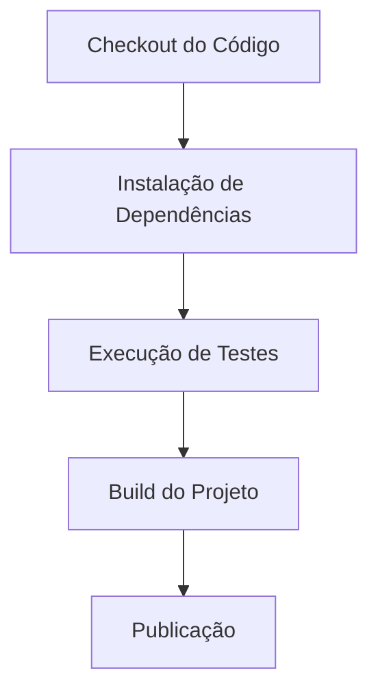

# Bem vindo ao CodePlay Pipelines

Aqui voce vai encontrar um repositorio com as mais diversas pipelines para diferentes tipos de CI e CD.

Leia nosso [Book de Diretrizes para Pipelines](./GUIDELINES.md)

> *Voce pode nos ajudar, leia o nosso* [**`manual de contribuicao`**](./CONTRIBUTING.md).

Aqui esta uma previa de diferentes tecnologias e que entregamos:

* Entrega de **`Microservicos Java`** para **`Kubernetes`**.
* Axway
* Entrega **`Aplicativos Java`** para **`Weblogic`**
* Entrega de pacotes externos para **`Nexus`** e **`Azure Artifacts`**.
* Entrega de **`Azure Functions`**.
* Entrega de **`Migracoes`** de Bancos de dados usando **`Liquibase`**.
* Entrega de **`Microservicos NodeJs`** para **`Kubernetes`**.
* Retrocompatibilidade para Entrega de Aplicativos usando **`Buildpack`**.
* Entrega de **`Fluxos Hybris`** SAAS.
* Entrega de **`Infraestrutura Terraform`**.
* Entrega de **`Aplicativos .Net`** para **`IIS`**.


## Antes de iniciar

## Daily CodePlay

Participe da Daily do CodePlay (Acontece todos os dias as 10h)

[Daily - Code Play | Meeting Chat | Microsoft Teams](https://teams.microsoft.com/l/chat/19:meeting_YTcyMGEwNjktYTgyZC00ODA2LThjMjEtYzlkZDkzZGU2MDFm@thread.v2/conversations?context=%7B%22contextType%22%3A%22chat%22%7D)

### Template Documentação para Pipelines do CodePlay

:::note
Antes de inciar um novo pipeline, é necessário criar um arquivo de documentação. Este arquivo deve conter as instruções e informações necessárias para o pipeline. Abaixo está um exemplo de template que pode ser usado, não se esqueça de dar um titulo ao pipeline.
:::

`/tech_products/<sigla>/<pipe-pr>.md`
```markdown
# Pipeline: Nome do Pipeline

## Descrição

## Configuração

## Decisões

## Erros conhecidos

## Plano de evolução
```

### Titulo

Coloque uma breve descrição do pipeline logo abaixo do titulo, explicando seu propósito e o que ele faz, se existe algum pré-requisito ou configuração necessária, e como ele se encaixa no fluxo de trabalho do projeto.

### Descrição

Nessa seção, forneça uma visão geral do pipeline, incluindo o que ele faz, quais etapas ele executa e qual é o seu objetivo principal. Por exemplo:

Este pipeline executa as seguintes etapas:
1. **Checkout do Código**: Clona o repositório do código-fonte.
2. **Instalação de Dependências**: Instala as dependências necessárias para o projeto.
3. **Execução de Testes**: Executa os testes unitários e de integração.
4. **Build do Projeto**: Compila o projeto para produção.
4. **Publicação**: Publica o artefato gerado em um repositório de tal tipo.

Além disso, forneça uma visão geral do fluxo de trabalho do pipeline, como mostrado abaixo:



### Configuração

Nesta seção, forneça instruções detalhadas sobre como configurar o pipeline. Inclua informações sobre como criar o arquivo de configuração do pipeline, quais parâmetros devem ser definidos e como personalizar o pipeline para atender às necessidades específicas do projeto.

Para configurar este pipeline, você precisa definir o arquivo `pipeline.yml` com o seguinte conteúdo:

```yaml
name: Nome do Pipeline
on:
  push:
    branches:
      - main
resources:
  repositories:
    resources:
      repositories:
        - repository: CodePlay
          name: DevOps/Vivo.CodePlay.Pipelines
          type: git
          ref: refs/heads/master

extends:
  template: /tech_product/<sigla>/<pipe-pr>.yaml@CodePlay
  parameters:
    example: 1234
```

Não se esqueça de explicar o que cada parâmetro significa e como ele deve ser configurado.

### Decisões

Utilize essa seção para documentar decisões importantes tomadas durante a criação do pipeline, como escolhas de ferramentas, padrões de codificação, etc.

### Erros conhecidos

Nesta seção, liste quaisquer erros conhecidos ou problemas que possam ocorrer ao executar o pipeline. Forneça soluções ou alternativas para resolver esses problemas.

### Plano de evolução

Nesta seção, descreva o plano de evolução do pipeline. Inclua informações sobre futuras melhorias, recursos planejados e quaisquer mudanças esperadas no fluxo de trabalho do pipeline.

## Decisão: Utilização do Rsync para Cópia de Artefatos

Foi definida a utilização do **`rsync`** como mecanismo de cópia de artefatos em pipelines que necessitam preservar links simbólicos (`symlinks`).

A decisão foi tomada devido a uma limitação identificada na task `CopyFiles@2` do Azure DevOps, que em determinados cenários tenta resolver links simbólicos como diretórios. Isso pode ocasionar falhas durante a preparação dos artefatos, como o erro `ENOTDIR`.

O `rsync` permite realizar a cópia preservando os links simbólicos e mantendo a estrutura original dos diretórios, reduzindo o risco de falhas durante a preparação dos artefatos.

A implementação deve manter o comportamento esperado pelos templates existentes, especialmente em relação ao parâmetro `artifactPaths`, que permite aos pipelines consumidores definir os arquivos e diretórios que devem ser incluídos ou excluídos dos artefatos.

### Diretrizes

- Utilizar `rsync` para a cópia dos artefatos quando houver necessidade de preservação de `symlinks`.
- Preservar a estrutura original dos diretórios.
- Preservar links simbólicos sem resolver o conteúdo apontado pelo link.
- Manter a compatibilidade com o parâmetro `artifactPaths` dos templates existentes.
- Evitar alterações no comportamento dos pipelines consumidores.
- Validar os pipelines existentes após alterações no mecanismo de cópia.

Essa decisão tem como objetivo substituir o mecanismo de cópia utilizado pelo pipeline sem alterar o conteúdo esperado dos artefatos gerados.