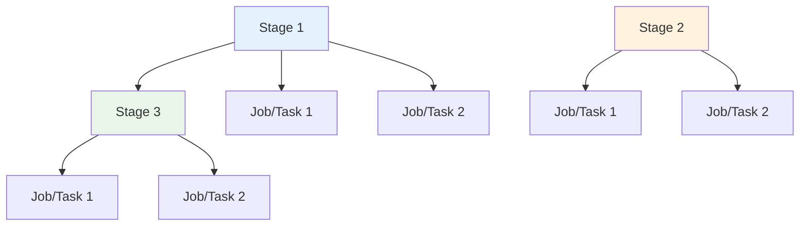

# Criar e formatar documentação no padrão framework

Analise o arquivo pipeline.yaml nesta pasta e preencha completamente o README.md seguindo exatamente a estrutura definida neste template.

## ⚠️ INSTRUÇÕES IMPORTANTES

**IMPORTANT!** Evite mudanças em informações que já estão corretas no README.md existente. Foque apenas em preencher os placeholders e ajustar detalhes conforme o pipeline.yaml.

**IMPORTANT!** Documente comentários importantes que já existem no pipeline.yaml.

**IMPORTANT!** Não use placeholders com chaves `{exemplo}` ou sinais de menor/maior `<exemplo>` diretamente no texto corrido. Sempre escreva como código inline: ``{exemplo}`` ou ``<exemplo>``.

**IMPORTANT!** O arquivo `README.md` deve ser escrito em **português do Brasil**, mantendo a formatação markdown exatamente como está neste template e deve ser salvo como `README.md` na mesma pasta do `pipeline.yaml`.

**IMPORTANT!** Use emojis conforme definido no template. Remova comentários deste documento que não são parte do README.md final.

**IMPORTANT!** Mantenha a estrutura e ordem das seções conforme definido. **NÃO invente seções novas nem remova seções existentes.**

**IMPORTANT!** Não invente informações (principalmente no FAQ e no Contato, mantenha essas seções)**

## 📋 ANÁLISE REQUERIDA

Examine o pipeline.yaml para identificar:

- Nome do pipeline (baseado no nome da pasta)
- Tecnologia principal (Java, .NET, Python, Node.js, Docker, etc.)
- Tipo de aplicação (web, API, microserviço, container, etc.)
- Estágios do pipeline e sua sequência de execução (stages, jobs, dependencies)
- Parâmetros definidos com tipos, valores padrão e descrições
- Variáveis de ambiente utilizadas internamente
- Dependências externas (service connections, agent pools, recursos)
- Condições e lógica de execução (conditions, displayNames)
- Templates internos utilizados
- Capacidades implementadas (SAST, SCA, testes, etc.)

## ✅ INSTRUÇÕES DE PREENCHIMENTO

1. **Substitua TODOS os placeholders** [entre colchetes] por informações específicas do pipeline
2. **Crie descrições específicas** baseadas nos estágios e funcionalidades observadas
3. **Gere diagrama mermaid** fidedigno ao fluxo real do pipeline analisado (apenas stages)
4. **Documente todos os parâmetros** encontrados com tipos, padrões e dependências
5. **Liste variáveis de ambiente** que NÃO são parâmetros configuráveis
6. **Identifique dependências** através das tasks, templates e service connections referenciadas
7. **Crie exemplos realistas** baseados em cenários identificados no pipeline
8. **Preencha a Matriz de Capacidades** com análise real do que o pipeline faz

## 🚫 DIRETRIZES OBRIGATÓRIAS

- ❌ NÃO invente informações que não estão no pipeline.yaml
- ❌ NÃO deixe placeholders vazios - substitua por "Não aplicável" se necessário
- ❌ NÃO UTILIZE `{}` ou `<>` fora de código inline
- ❌ NÃO adicione seções extras além das definidas neste template
- ❌ NÃO remova seções obrigatórias do template
- ❌ NÃO documente jobs ou steps no diagrama mermaid - apenas stages
- ✅ USE nomes específicos encontrados no pipeline, não genéricos
- ✅ MANTENHA a formatação markdown exata existente
- ✅ SEJA específico sobre tipos de dados e valores padrão
- ✅ EXPLIQUE o propósito real de cada parâmetro baseado em seu uso
- ✅ BASE os exemplos em cenários reais identificados no pipeline
- ✅ MANTENHA a ordem das seções conforme este template
- ✅ ANALISE capabilities de forma honesta (não marque ✅ se não existir)

**IMPORTANTE:** Após preencher, revise para garantir que todos os placeholders foram substituídos por informações específicas e precisas.

---

## 📄 TEMPLATE DO README.MD

```markdown
# [Nome do Pipeline]

Pipeline de [CI/CD] para [descrição breve e específica da finalidade].

## 🎯 Descrição

[Descrição detalhada do pipeline em 2-3 parágrafos. Explique:]

- [O processo que o pipeline automatiza - ex: construção e publicação de imagens Docker]
- [As tecnologias e ferramentas principais utilizadas - ex: Docker, BuildKit, ACR]
- [O tipo de aplicação ou projeto suportado - ex: aplicações containerizadas]
- [Principais benefícios e diferenciais - ex: versionamento automático, análises de segurança paralelas]

- [Pipeline utilizado para testes](MUDAR_PARA_LINK_DO_PIPELINE_DE_TESTES)
- [Repositório de exemplo](https://dev.azure.com/telefonica-vivo-brasil/DVPS%20-%20DEVOPS/_git/MUDAR_PARA_REPOSITORIO_CORRETO)


## 🚀 Quick Start (5 minutos)

1. Crie os arquivos necessários no seu repositório (Veja [Dependências Externas](#-dependências-externas))
2. Crie `.azuredevops/azure-pipeline-ci.yml` na raiz
3. Cole o código de exemplo
4. Commit e push
5. ✅ Pipeline executa automaticamente!
6. Opcional: ajuste triggers

```yaml
# [Descrição do exemplo - ex: Pipeline básico para build Docker]
# .azuredevops/pipelines/[categoria].yaml
resources:
  repositories:
    - repository: CodePlay
      name: DevOps/Vivo.CodePlay.Pipelines
      type: git
      ref: refs/heads/master
      endpoint: CodePlay

extends:
  template: /framework/pipelines/[categoria]/[nome-do-pipeline]/pipeline.yaml@CodePlay
```

**O que acontece com esta configuração:**

- [Comportamento 1 com emoji - ex: 🐳 Build da imagem Docker usando o Dockerfile na raiz]
- [Comportamento 2 com emoji - ex: 📋 Nome da imagem: `{sigla}/{nome-repositorio}`]
- [Comportamento 3 com emoji - ex: 🏷️ Versionamento automático (incremento patch)]
- [Comportamento 4 com emoji - ex: 🔒 Análise de segurança (SAST e SCA)]
- [Comportamento 5 com emoji - ex: 📤 Push para ACR usando service connection "ACR-DEVOPS"]
- [Comportamento N - liste todos os comportamentos padrão relevantes]

## 🏗️ Matriz de Capacidades

| Capacidade | Suporte | Descrição |
|------------|---------|-----------|
| [Trunk Based Development](https://dvps.redecorp.azr/portal/codeplay/capacidades/catalog/trunk-based-development) | [✅/❌/⚠️/🚧/❎] | [Descrição específica de como o pipeline suporta esta capacidade e quais parâmetros controlam. Ex: Pipeline executado em qualquer branch. Commit de versão condicional via `prValidationOnly`] |
| [Build Automatizado](https://dvps.redecorp.azr/portal/codeplay/capacidades/catalog/build-automatizado) | [✅/❌/⚠️/🚧/❎] | [Descrição específica. Ex: Build Docker com BuildKit e push para ACR configurável via `registryServiceConnection`] |
| [Testes Unitários](https://dvps.redecorp.azr/portal/codeplay/capacidades/catalog/testes-unitarios) | [✅/❌/⚠️/🚧/❎] | [Descrição. Ex: Não implementado. Pipeline focado em build e segurança] |
| [SAST](https://dvps.redecorp.azr/portal/codeplay/capacidades/catalog/sast) | [✅/❌/⚠️/🚧/❎] | [Descrição da ferramenta e como é executado. Ex: Fortify ScanCentral em paralelo ao build. Exclusões via `enableFortifyExclusions`] |
| [SCA](https://dvps.redecorp.azr/portal/codeplay/capacidades/catalog/sca) | [✅/❌/⚠️/🚧/❎] | [Descrição de limitações. Ex: Implementado mas condicional via `runSecuritySCA=true` (padrão habilitado)] |
| [Gates de Segurança](https://dvps.redecorp.azr/portal/codeplay/capacidades/catalog/gates-de-seguranca) | [✅/❌/⚠️/🚧/❎] | [Explicação. Ex: Análises executam mas não bloqueiam pipeline. Gates devem ser configurados externamente] |
| [Análise de Código](https://dvps.redecorp.azr/portal/codeplay/capacidades/catalog/analise-de-codigo) | [✅/❌/⚠️/🚧/❎] | [Descrição das ferramentas e processo. Ex: SAST via Fortify e SCA via Dependency Track executam em paralelo] |
| [Gates de Qualidade](https://dvps.redecorp.azr/portal/codeplay/capacidades/catalog/gate-de-qualidade) | [✅/❌/⚠️/🚧/❎] | [Explicação. Ex: Não implementado. Pipeline não valida cobertura ou métricas de código] |
| [Rollback de Upgrade](https://dvps.redecorp.azr/portal/codeplay/capacidades/catalog/rollback-de-upgrade) | ❎ | Pipeline de CI - não aplicável para rollback de deploy |
| [Blue/Green Deployment](https://dvps.redecorp.azr/portal/codeplay/capacidades/catalog/blue-green-deployment) | ❎ | Pipeline de CI - estratégias de deployment são responsabilidade do CD |
| [Canary Release](https://dvps.redecorp.azr/portal/codeplay/capacidades/catalog/canary-release) | ❎ | Pipeline de CI - estratégias de release são responsabilidade do CD |

**Legenda:**

- ✅ Suportado nativamente
- ❌ Não suportado
- ⚠️ Suportado com limitações ou condições
- 🚧 Planejado / Em Construção
- ❎ Não faz sentido habilitar essa capacidade

## 🔄 Estrutura do Pipeline

[Descrição em 1-2 parágrafos de como o pipeline está organizado. Explique: fluxo de execução, se há paralelização, dependências entre estágios, e otimizações importantes. Ex: "O pipeline é organizado em três estágios: DockerBuild e SecurityAnalysis executam em paralelo para otimizar o tempo total, seguidos pelo VersionCommit que depende apenas do DockerBuild"]



### Estágios do Pipeline

1. **[Nome do Estágio 1 com emoji - ex: 🐳 Docker Build]**
   - [Descrição do que acontece - ex: Cálculo automático da próxima versão semântica]
   - [Ação principal - ex: Construção da imagem Docker com BuildKit]
   - [Resultado - ex: Publicação no Azure Container Registry]

2. **[Nome do Estágio 2]** (Paralelo ao Estágio 1 / Depende do Estágio X)
   - [Descrição e ações]
   - [Resultado esperado]

3. **[Nome do Estágio N]** (Condicional - apenas quando `parametroX=valor`)
   - [Descrição e ações]
   - [Resultado esperado]


## ⚙️ Parâmetros Disponíveis

### [Categoria 1 - ex: Infraestrutura e Ambiente]

#### [nomeParametro1]

- **nome**: [nomeParametro1]
- **tipo**: [string|boolean|number|array]
- **default**: "[valorPadrao]"
- **descrição**: [Descrição clara do que o parâmetro faz e como deve ser utilizado. Explique o impacto de diferentes valores.]
- **dependências**: [Liste as dependências necessárias ou "Nenhuma."]

#### [nomeParametro2]

- **nome**: [nomeParametro2]
- **tipo**: [string|boolean|number|array]
- **default**: [valorPadrao - use true/false para boolean, não use aspas]
- **descrição**: [Descrição clara do parâmetro e seu uso.]
- **dependências**: [Dependências necessárias ou "Nenhuma."]

### [Categoria 2 - ex: Configurações de Docker]

[Continue documentando todos os parâmetros divididos por categorias conforme aparecem no pipeline.yaml]


## 🔧 Dependências Externas

### Service Connections Necessárias

#### 1. [Nome da Service Connection - ex: Azure Container Registry (ACR)]

- **Nome padrão**: `[nome-da-connection]`
- **Tipo**: [Docker Registry | Azure Resource Manager | GitHub | etc]
- **Uso**: [Para que é utilizada - ex: Publicação de imagens Docker]
- **Permissões necessárias**:
  - [Permissão 1]
  - [Permissão 2]
- **Configurável via**: parâmetro `[nomeDoParametro]`

### Agent Pool Requirements

#### Pool de Agentes

- **Pool padrão**: `[nome-do-pool]`
- **Sistema Operacional**: [Linux | Windows | macOS]
- **Ferramentas obrigatórias**:
  - [Ferramenta 1 - ex: Docker Engine (com BuildKit habilitado)]
  - [Ferramenta 2 - ex: Git (para checkout e operações de versionamento)]
  - [Ferramenta N]
- **Acesso de rede**:
  - [Acesso 1 - ex: Acesso ao Azure Container Registry]
  - [Acesso 2 - ex: Acesso ao proxy corporativo: `10.240.58.39:3128`]
  - [Acesso N]

### Arquivos Obrigatórios no Repositório

#### 1. [Nome do Arquivo - ex: Dockerfile]

- **Localização padrão**: [Caminho - ex: Raiz do repositório]
- **Configurável via**: parâmetro `[nomeParametro]`
- **Requisitos**:
  - [Requisito 1 - ex: Sintaxe válida do Dockerfile]
  - [Requisito 2 - ex: Compatível com BuildKit]
  - [Requisito N]
- **Comportamento**: [Explicação adicional. Ex: Se não existir, será criado automaticamente com versão `0.0.1`]

### Integrações Externas de Segurança

#### 1. [Nome da Integração - ex: Fortify ScanCentral (SAST)]

- **Descrição**: [Breve descrição do que faz]
- **Requisitos**:
  - [Requisito 1]
  - [Requisito 2]
- **Opcional**: [Se aplicável, descreva configurações opcionais]
- **Observação**: [Se aplicável - ex: Procure o time de AppSec para mais detalhes sobre a integração]

### Permissões de Repositório Git

[Se o pipeline faz commit ou push, documente:]

- **Permissão de escrita** no repositório Git
- **Capacidade de criar tags**
- **Checkout com `persistCredentials: true`** (configurado automaticamente quando [condição])

### Azure Key Vault

#### [nome-do-keyvault]

- **Uso**: [Para que é usado - ex: Armazenamento de secrets para integrações de segurança]
- **Secrets esperados**:
  - [Secret 1]
  - [Secret 2]

### Variáveis de Sistema Necessárias

| Variável | Origem | Uso |
|----------|--------|-----|
| `[VARIAVEL_1]` | Azure DevOps | [Descrição do uso] |
| `[VARIAVEL_2]` | Azure DevOps | [Descrição do uso] |

### Dependências de Templates Internos

O pipeline utiliza os seguintes templates do CodePlay Framework:

- `/framework/templates/[template1].yaml` - [Descrição breve]
- `/framework/templates/[template2].yaml` - [Descrição breve]

## 🎨 Comportamentos Customizados

:::danger
**⚠️ ATENÇÃO: CUSTOMIZAÇÕES REQUEREM RESPONSABILIDADE ⚠️**

- ✅ **Use os exemplos como ponto de partida** - Eles demonstram padrões seguros e testados
- 🧠 **"Todos somos adultos"** - Confiamos na sua expertise, mas exigimos consciência do impacto
- 📝 **Tudo fica registrado** - Seu histórico de commits é auditável e rastreável
- 🎯 **Entenda antes de modificar** - Customizações incorretas podem quebrar builds em produção
- 🤝 **Documente suas decisões** - Facilite a manutenção futura por outros membros da equipe

**Customizar é permitido. Fazer sem entender não é.**
:::

### [Nome do Cenário 1 - ex: Docker Registry Personalizado]

```yaml
# .azuredevops/pipelines/[categoria].yaml
resources:
  repositories:
    - repository: CodePlay
      name: DevOps/Vivo.CodePlay.Pipelines
      type: git
      ref: refs/heads/master
      endpoint: CodePlay

extends:
  template: /framework/pipelines/[categoria]/[nome-do-pipeline]/pipeline.yaml@CodePlay
parameters:
  [parametro1]: "[valor]"  # [Comentário explicativo]
  [parametro2]: [valor]    # [Comentário explicativo]
```

### [Nome do Cenário 2]

[Continue com outros cenários relevantes baseados no pipeline]

## 🔖 Variáveis de Ambiente

As seguintes variáveis de ambiente são automaticamente configuradas pelo pipeline:

| Variável | Descrição | Valor Padrão |
|----------|-----------|--------------|
| `[VARIAVEL_1]` | [Descrição detalhada] | `[valor]` |
| `[VARIAVEL_2]` | [Descrição detalhada] | `[valor]` |

## ❓ FAQ
[SEMPRE MANTENHA ESTA SEÇÃO EXATAMENTE COMO ESTÁ]

### Onde posso encontrar mais informações sobre o CodePlay Framework?

Você pode encontrar mais informações sobre o CodePlay Framework na [documentação oficial](https://dvps.redecorp.azr/portal/codeplay/framework/).

### Onde encontro as capacidades disponíveis?

As capacidades disponíveis podem ser encontradas no [Catálogo de Capacidade](https://dvps.redecorp.azr/portal/catalog/capabilities) no Portal CodePlay.

### Como faço para customizar o pipeline?

Siga o guia de [Adoção ao CodePlay](https://dvps.redecorp.azr/portal/codeplay/roteiro/codeplay#fluxo-de-ado%C3%A7%C3%A3o-ao-codeplay).

### Quais casos de uso relevantes?

[Liste casos de uso específicos para este pipeline com links reais, por exemplo:]
- [Docker Build Mais Rapido](https://dvps.redecorp.azr/portal/code/casos-de-uso/docker-build-mais-rapido)
- [Integrando CICD](https://dvps.redecorp.azr/portal/code/casos-de-uso/integrando-cicd)
- Veja o [Catálogo de Casos de Uso](https://dvps.redecorp.azr/portal/catalog/casos-de-uso) para outros exemplos de casos de uso.

### Quais Erros Comuns relevantes?

[Se houver erros comuns documentados, liste aqui com links. Caso contrário:]
- Ainda não temos nenhum erro comum documentado para este pipeline.
- Veja o [Catálogo de Erros Conhecidos](https://dvps.redecorp.azr/portal/catalog/erros-conhecidos) para outros exemplos de erros.

## 🆘 Suporte
[SEMPRE MANTENHA ESTA SEÇÃO EXATAMENTE COMO ESTÁ]

- [Abra um chamado para Dev Support](https://dvps.redecorp.azr/portal/codeplay/roteiro/#:~:text=Abra%20um%20chamado%20para%20Dev%20Support)
- [Canal DevEx - Azure DevOps](https://teams.microsoft.com/l/channel/19%3A8fbd00946cf044d7a844182ac71e6aa1%40thread.tacv2/Azure%20DevOps?groupId=038b4415-d6dd-42ce-92e5-31a8e2a13bf8&tenantId=9744600e-3e04-492e-baa1-25ec245c6f10)

## 📝 Decisões Tomadas

### Decisão 1: [Nome da Decisão]

- **Data**: [DD/MM/AAAA]
- **Motivador**: [Explicar o motivo da decisão]
- **Forum Envolvido**: [Equipe/contexto onde foi decidido]
- **Descrição**: [Descrever a decisão tomada e sua implementação]
```

**FIM DO TEMPLATE**
