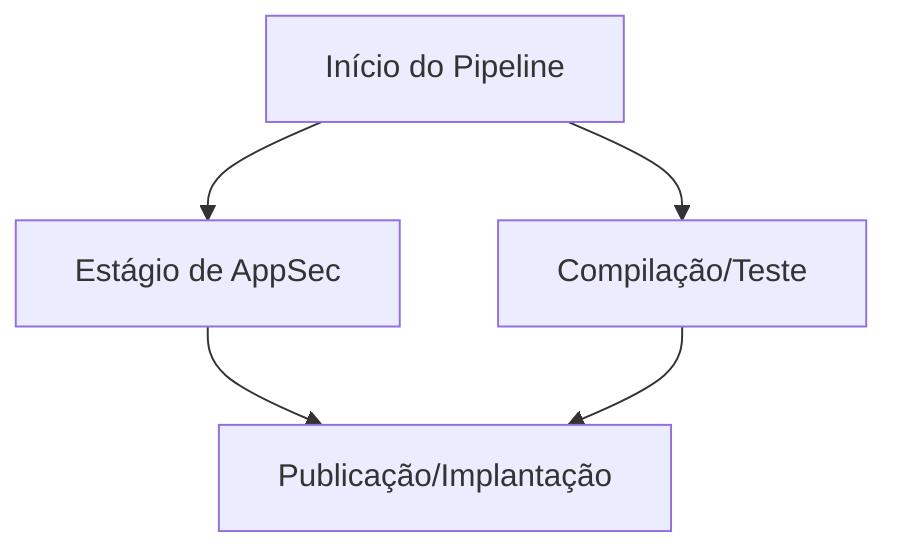
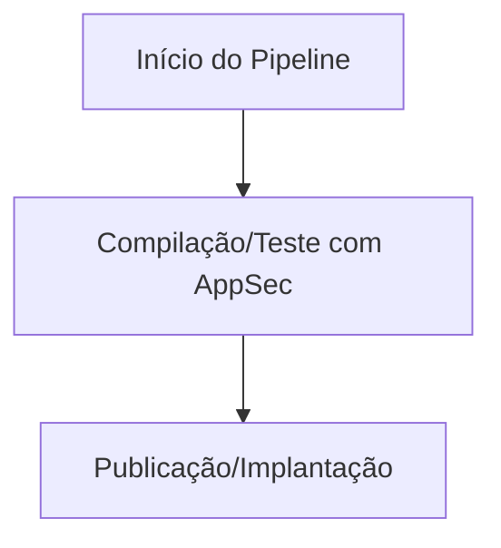
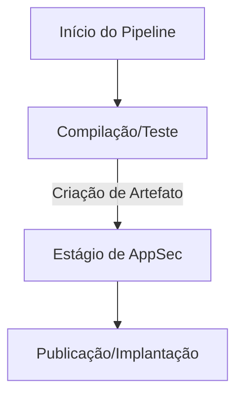

# 4. Estagios de AppSec nos pipelines

Date: 2025-11-11

## Status

Proposed

## Context

Precisamos definir os estágios de segurança de aplicações (AppSec) que serão integrados nos pipelines de desenvolvimento e entrega contínua (CI/CD) para garantir que as práticas de segurança sejam incorporadas desde o início do ciclo de vida do desenvolvimento de software segurando as melhores práticas do setor.

Existem várias formas de plugarmos os estágios de AppSec nos pipelines, incluindo:

### Estágio separado de AppSec

Estágio separado de AppSec: Um estágio dedicado no pipeline exclusivamente para verificações de segurança. Ocorre em paralelo com o estágio de compilação/teste ou após ele.

**Vantagens**:

- Mais facil de isolar problemas de segurança.
- Paralelismo com outros estágios pode acelerar o pipeline.

**Desvantagens**:

- Não tem alguns arquivos de contexto do build.
- Se a etapa de Publicação não tiver como dependência a etapa de AppSec, pode publicar código inseguro.
  
**Conclusão**: Não recomendado. Pois realmente foi constatado que em casos como node.js o syft detectou consideravelmente menos dependências quando apontado apenas para o `package-lock.json` do que quando a `node_modules` estava presente. Além disso torna-se complexo garantir que a etapa de publicação dependa da etapa de AppSec.

### Estágio de AppSec integrado

Estágio de AppSec integrado: As verificações de segurança são incorporadas diretamente nos estágios existentes do pipeline, como compilação ou teste.

**Vantagens**:

- Aproveita o contexto completo do build.
- Garante que as verificações de segurança sejam executadas antes da publicação.
- Simplifica a dependência entre etapas.

**Desvantagens**:

- Pode aumentar o tempo total do pipeline.
- Problemas de segurança podem ser misturados com falhas de build/teste.
- Os estágios podem ficar muitos longos e complexos.
- Não permite reexecuções
- Não permite paralelismo

**Conclusão**: Parcialmente Recomendado. Essa abordagem garante uma análise de segurança mais completa e integrada ao processo de desenvolvimento, facilitando a detecção precoce de vulnerabilidades. Porém, é importante gerenciar o tempo de execução do pipeline para evitar atrasos significativos.

### Estágio para AppSec com Artefato

Estágio para AppSec com Artefato: As verificações de segurança são realizadas em um estágio separado, mas utilizando artefatos gerados nos estágios anteriores (como compilação ou teste). O artefato deve conter todo o contexto necessário para a análise de segurança, como dependências instaladas.

**Vantagens**:

- Mantém isolamento de problemas de segurança.
- Garante que as verificações de segurança sejam executadas antes da publicação.
- Permite reexecuções.
- Permite paralelismo.
- Aumenta desacoplamento entre etapas.
- Possivelmente é a maneira padrão que o Core e CodePlay utilizam atualmente.
- Facilidade de troubleshooting (Time de appsec pode baixar artefato para debug).

**Desvantagens**:

- Pode aumentar o tempo total do pipeline devido à criação e uso de artefatos.
- Requer configuração adicional para gerenciar artefatos.
- Pode introduzir complexidade na gestão do pipeline.
- Requer espaço adicional para armazenar artefatos (existe limite?).
- Pode haver desafios na sincronização de artefatos entre estágios.

**Conclusão**: Recomendado. Essa abordagem equilibra a necessidade de isolamento e contexto completo, permitindo uma análise de segurança eficaz sem comprometer a integridade do pipeline. A utilização de artefatos garante que todas as dependências e contextos necessários estejam disponíveis para a análise de segurança. Embora possa aumentar o tempo total do pipeline e aumentar a complexidade, os benefícios em termos de segurança e integridade do processo superam as desvantagens.

## Decision

Decidimos adotar a abordagem de Estágio para AppSec com Artefato nos pipelines de CI/CD. Essa decisão foi tomada com base na necessidade de garantir uma análise de segurança completa e eficaz, ao mesmo tempo em que mantemos a integridade e a eficiência do processo de desenvolvimento.

Todos os pipelines de CI/CD serão configurados para incluir um estágio dedicado de AppSec que utiliza artefatos gerados nos estágios anteriores. Isso garantirá que todas as verificações de segurança sejam realizadas com o contexto completo do build, minimizando o risco de vulnerabilidades passarem despercebidas.

## Consequences

A implementação dessa decisão exigirá ajustes nos pipelines existentes para incorporar o novo estágio de AppSec com artefatos. Isso pode incluir a configuração de ferramentas de análise de segurança para trabalhar com artefatos específicos e a adaptação dos processos de build para garantir que os artefatos necessários sejam gerados corretamente.

As alterações nos pipelines devem ser feitas de maneira gradual e cuidadosamente monitoradas para garantir que não haja interrupções significativas no processo de desenvolvimento. Além disso, será necessário conectar com o tema de Capacidades, para que todos tenham clareza sobre como os estágios de AppSec funcionam e quais são as melhores práticas a serem seguidas.

Mapear possíveis casos de uso e documentar erros comuns que podem surgir durante a implementação dessa abordagem também será crucial para garantir uma transição suave e eficaz.
