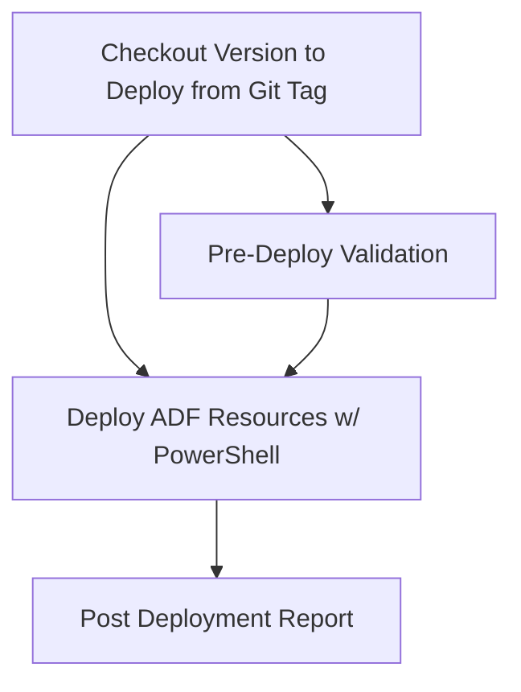

# Deploy Azure Data Factory

## 🎯 Descrição

Pipeline de deployment automatizado para projetos Azure Data Factory (ADF) utilizando Git tags. O pipeline consome código versionado via tags Git e aplica configurações no ADF do ambiente especificado com validação pré e pós-deploy, suportando múltiplos ambientes e configurações avançadas de deployment.

Tecnologia principal: PowerShell Core e a biblioteca PowerShell [azure.datafactory.tools](https://github.com/Azure-Player/azure.datafactory.tools) para automação de deployments ADF.

- [Pipeline utilizado para testes](https://dev.azure.com/telefonica-vivo-brasil/DevOps/_build?definitionId=44992)
- [Repositório de exemplo](https://dev.azure.com/telefonica-vivo-brasil/DevOps/_git/teste-deploy-adf)

## 🚀 Principais funcionalidades

- 🏷️ **Deployment baseado em Git tags** - Utiliza versionamento Git para controle de releases
- ✅ **Validação pré-deploy** - Execução opcional de validações do código ADF antes do deployment
- 🎯 **Suporte multi-ambiente** - Configuração para dev, preprod e prod com recursos específicos
- 🔧 **Modo Dry Run** - Simulação de deployment sem alterações reais
- ⚡ **Gerenciamento de Triggers** - Controle automático de parada e início de triggers durante deployment
- 🔍 **Filtros de deployment** - Suporte a arquivos de filtro para deployment seletivo de objetos
- 🔄 **Configuração por parâmetros CSV** - Suporte a arquivos de configuração específicos por ambiente para substituição de parâmetros
- 📊 **Relatórios pós-deployment** - Contagem e verificação de recursos deployados

## 🚀 Quick Start (5 minutos)

1. Configure as dependências necessárias (Veja [Dependências Externas](#-dependências-externas))
2. Crie `.azuredevops/azure-pipeline-cd.yml` na raiz do seu repositório ADF
3. Cole o código de exemplo abaixo
4. Commit e push
5. ✅ Pipeline executa automaticamente no deploy do ambiente configurado!
6. Opcional: ajuste parâmetros conforme necessidade

```yaml
# Pipeline básico para deployment de ADF
# .azuredevops/azure-pipeline-cd.yml
trigger: none

parameters:
  - name: environment
    type: string
    default: dev
    displayName: 'Ambiente de destino para deployment'
    values:
      - dev
      - preprod  
      - prod
  - name: version
    type: string
    displayName: 'Versão/Tag para deployment'
  - name: dryRun
    type: boolean
    default: false
    displayName: 'Executar em modo Dry Run (simulação)'

resources:
  repositories:
    - repository: CodePlay
      name: DevOps/Vivo.CodePlay.Pipelines
      type: git
      ref: refs/heads/master
      endpoint: CodePlay

extends:
  template: /framework/pipelines/cd/deploy-adf/pipeline.yaml@CodePlay
  parameters:
    environment: ${{ parameters.environment }}  # Ambiente de destino
    version: ${{ parameters.version }}
    dryRun: ${{ parameters.dryRun }}
```

**O que acontece com esta configuração:**

- 🏷️ Deployment da última versão Git tag disponível
- ✅ Validação pré-deploy do código ADF usando Test-AdfCode
- 🎯 Deploy no ambiente selecionado
- ⚡ Triggers do ADF são automaticamente parados antes do deploy e reiniciados após
- 🔒 Deployment job com environment resource ``deploy-<ambiente>`` para aprovações e rastreabilidade
- 📊 Relatório pós-deployment com contagem de recursos deployados

## 🏗️ Matriz de Capacidades

| Capacidade                  | Suporte | Descrição                                      |
|----------------------------|---------|------------------------------------------------|
| [Trunk Based Development](https://dvps.redecorp.azr/portal/codeplay/capacidades/catalog/trunk-based-development/) | ✅      | Utiliza Git tags para versionamento e deployment controlado |
| [Build Automatizado](#)        | ❎      | Pipeline de CD - não faz sentido habilitar essa capacidade |
| [Testes Unitários](https://dvps.redecorp.azr/portal/codeplay/capacidades/catalog/testes-unitarios/)       | ⚠️      | Validação pré-deploy opcional via ``enablePreDeployValidation`` |
| [SAST](#)                        | ❎      | Não implementado neste pipeline                |
| [SCA](#)                        | ❎      | Não implementado neste pipeline           |
| [Gates de Segurança](#)          | ✅      | Environment resources do Azure DevOps para controle de acesso   |
| [Análise de Código](#)          | ⚠️      | Validação ADF via Test-AdfCode quando habilitado   |
| [Gates de Qualidade](#)           | ✅      | Environment approvals e validações pré-deploy    |
| [Rollback de Upgrade](https://dvps.redecorp.azr/portal/codeplay/capacidades/catalog/rollback-de-upgrade/) | ⚠️  | Possível via re-deployment de tag anterior |
| [Blue/Green Deployment](#) | ❌  | Não suportado para ADF |
| [Canary Release](#)        | ❌  | Não suportado para ADF |

Legenda:
- ✅ - Suportado nativamente
- ❌ - Não suportado
- ⚠️ - Suportado com limitações ou condições
- 🚧 - Planejado / Em Construção
- ❎ - Não faz sentido habilitar essa capacidade

## 🔄 Estrutura do Pipeline

O pipeline é organizado em dois estágios sequenciais: preparação/validação seguido pelo deployment propriamente dito. O estágio de deployment utiliza deployment jobs com environments do Azure DevOps para controle de aprovações e rastreabilidade.



**Descrição dos Estágios:**

- **Preparation**: Preparação e validação pré-deploy incluindo determinação da versão, checkout do código versionado e validação opcional da estrutura de objetos do ADF.
- **Deployment**: Execução do deployment no ADF incluindo checkout da versão específica, deploy dos recursos via PowerShell e geração de relatório pós-deployment com contagem de recursos.

## ⚙️ Parâmetros Disponíveis

Configure o comportamento do pipeline através dos seguintes parâmetros.

### Configurações de Infraestrutura e Ambiente

#### agentPool

- **nome**: agentPool
- **tipo**: string
- **default**: "GeneralPurposeLinuxAgentsCD"
- **descrição**: "Agent Pool utilizado para execução de todos os jobs do pipeline de deployment. Define qual pool de agentes do Azure DevOps será usado."
- **dependências**: Agent pool configurado no Azure DevOps

#### environment

- **nome**: environment
- **tipo**: string  
- **default**: "dev"
- **opções**: ["dev", "preprod", "prod"]
- **descrição**: "Ambiente de destino para deployment. Determina qual ADF e configurações serão utilizadas."
- **dependências**: Environment resources configurados no Azure DevOps

#### variableGroupName

- **nome**: variableGroupName
- **tipo**: string
- **default**: ""
- **descrição**: "Grupo de variáveis para uso nos arquivos de configuração. Permite injetar variáveis de ambiente nas configurações."
- **dependências**: Variable group criado no Azure DevOps

#### environmentPrefix

- **nome**: environmentPrefix
- **tipo**: string
- **default**: "deploy-"
- **descrição**: "Prefixo usado para formar o nome completo do environment usado para registrar o deploy no Azure DevOps."
- **dependências**: Environments configurados seguindo convenção de nomenclatura

### Configurações de Versionamento e Projeto

#### version

- **nome**: version
- **tipo**: string
- **default**: 'getLatestVersion()'
- **descrição**: "Versão/Tag para deployment. Aceita dois formatos: (1) função ``getLatestVersion()`` (padrão) - busca automaticamente a última versão disponível via tags Git do repositório através do ``VersionManagerVivo``; (2) tag específica (ex: 'v1.2.3') - usa a versão informada. A versão determinada é utilizada para fazer checkout da tag correspondente no repositório."
- **dependências**: Para busca automática de versão com ``getLatestVersion()``, requer tags Git criadas pelo pipeline de CI no formato semântico

#### adfSourcePath

- **nome**: adfSourcePath
- **tipo**: string
- **default**: ""
- **descrição**: "Caminho da pasta do ADF no repositório. Pasta onde estão os arquivos JSON do Azure Data Factory. Normalmente não precisa ser alterado.
- **dependências**: Estrutura de pastas do projeto ADF

#### workingDirectory

- **nome**: workingDirectory
- **tipo**: string
- **default**: `"$(Build.SourcesDirectory)"`
- **descrição**: "Diretório base do projeto. Normalmente não precisa ser alterado."
- **dependências**: Nenhuma dependência adicional necessária

### Configurações de Recursos Azure por Ambiente

#### azureSubscription

- **nome**: azureSubscription
- **tipo**: object
- **default**: `{"dev": "adf-$(SIGLA)-dev", "preprod": "adf-$(SIGLA)-preprod", "prod": "adf-$(SIGLA)-prod"}`
- **descrição**: "Service Connections Azure específicas para cada ambiente do ADF."
- **dependências**: Service Connections Azure configuradas no Azure DevOps

#### adfResourceGroup

- **nome**: adfResourceGroup
- **tipo**: object
- **default**: `{"dev": "rg-adf-$(SIGLA)-brsouth-dev", "preprod": "rg-adf-$(SIGLA)-brsouth-preprod", "prod": "rg-adf-$(SIGLA)-brsouth-prod"}`
- **descrição**: "Resource Groups onde estão os ADFs por ambiente. Seguir convenção de nomenclatura da Vivo."
- **dependências**: Resource Groups criados no Azure

#### adfName

- **nome**: adfName
- **tipo**: object
- **default**: `{"dev": "adf-$(SIGLA)-brsouth-dev", "preprod": "adf-$(SIGLA)-brsouth-preprod", "prod": "adf-$(SIGLA)-brsouth-prod"}`
- **descrição**: "Nomes dos Azure Data Factory por ambiente. Seguir convenção de nomenclatura da Vivo."
- **dependências**: Instâncias ADF criadas no Azure

#### adfLocation

- **nome**: adfLocation
- **tipo**: object
- **default**: `{"dev": "brazilsouth", "preprod": "brazilsouth", "prod": "brazilsouth"}`
- **descrição**: "Localização geográfica dos ADFs por ambiente. Padrão Brazil South."
- **dependências**: Nenhuma dependência adicional necessária

### Configurações de Controle de Deploy

#### dryRun

- **nome**: dryRun
- **tipo**: boolean
- **default**: false
- **descrição**: "Executa em modo simulação sem fazer alterações reais. Útil para testar configurações."
- **dependências**: Nenhuma dependência adicional necessária

#### enablePreDeployValidation

- **nome**: enablePreDeployValidation
- **tipo**: boolean
- **default**: true
- **descrição**: "Habilita validação pré-deploy do código ADF usando Test-AdfCode. Recomendado manter habilitado."
- **dependências**: Módulo PowerShell azure.datafactory.tools

### Configurações de Gerenciamento de Triggers

Consultar documentação da biblioteca PowerShell [azure.datafactory.tools](https://github.com/Azure-Player/azure.datafactory.tools?tab=readme-ov-file#publish-options).

#### startStopTriggersForDeploy

- **nome**: startStopTriggersForDeploy
- **tipo**: boolean
- **default**: true
- **descrição**: "Para triggers antes do deploy e os reinicia após. Evita execuções durante deployment."
- **dependências**: Nenhuma dependência adicional necessária

#### doNotStopStartExcludedTriggers

- **nome**: doNotStopStartExcludedTriggers
- **tipo**: boolean
- **default**: false
- **descrição**: "Não para/inicia triggers marcados como excluídos no arquivo de filtro."
- **dependências**: Arquivo de filtro configurado adequadamente

#### triggerStopMethod

- **nome**: triggerStopMethod
- **tipo**: string
- **default**: "AllEnabled"
- **opções**: ["AllEnabled", "DeployableOnly"]
- **descrição**: "Define quais triggers parar: todos habilitados ou apenas os que serão deployados."
- **dependências**: Nenhuma dependência adicional necessária

#### triggerStartMethod

- **nome**: triggerStartMethod
- **tipo**: string
- **default**: "BasedOnSourceCode"
- **opções**: ["BasedOnSourceCode", "KeepPreviousState"]
- **descrição**: "Define quais triggers iniciar: baseado no código fonte ou manter estado anterior."
- **dependências**: Nenhuma dependência adicional necessária

### Configurações de Filtros e Arquivos de Deployment

Consultar documentação da biblioteca PowerShell [azure.datafactory.tools](https://github.com/Azure-Player/azure.datafactory.tools?tab=readme-ov-file#publish-options).

#### deploymentFilterFile

- **nome**: deploymentFilterFile
- **tipo**: string
- **default**: "rules.txt"
- **descrição**: "Arquivo com filtros para deployment seletivo. Permite incluir/excluir recursos específicos."
- **dependências**: Arquivo `rules.txt` na pasta `deployment`

#### deleteObjectsNotInSource

- **nome**: deleteObjectsNotInSource
- **tipo**: boolean
- **default**: false
- **descrição**: "Remove do ADF recursos que não existem mais no código fonte."
- **dependências**: Nenhuma dependência adicional necessária

#### doNotDeleteExcludedObjects

- **nome**: doNotDeleteExcludedObjects
- **tipo**: boolean
- **default**: true
- **descrição**: "Protege objetos marcados como excluídos de serem deletados automaticamente."
- **dependências**: Arquivo de filtro com configurações de exclusão

#### failsWhenConfigItemNotFound

- **nome**: failsWhenConfigItemNotFound
- **tipo**: boolean
- **default**: true
- **descrição**: "Falha o pipeline quando arquivo de configuração de parâmetros não existe."
- **dependências**: Arquivo `config-{environment}.csv` na pasta deployment

#### failsWhenPathNotFound

- **nome**: failsWhenPathNotFound
- **tipo**: boolean
- **default**: true
- **descrição**: "Falha o pipeline quando caminhos especificados não são encontrados."
- **dependências**: Estrutura de pastas correta no projeto

## 🔧 Dependências Externas

### Service Connections Obrigatórias

| Nome da Connection | Tipo | Descrição | Como Configurar |
|-------------------|------|-----------|-----------------|
| `adf-{SIGLA}-dev` | Azure Resource Manager | Connection para ambiente de desenvolvimento | Configurar no Azure DevOps com permissões no ADF |
| `adf-{SIGLA}-preprod` | Azure Resource Manager | Connection para ambiente de pré-produção | Configurar no Azure DevOps com permissões no ADF |
| `adf-{SIGLA}-prod` | Azure Resource Manager | Connection para ambiente de produção | Configurar no Azure DevOps com permissões no ADF |

### Recursos de Build Agent

- **PowerShell**: Necessário para execução dos scripts de deployment ADF
- **Módulo azure.datafactory.tools**: PowerShell module para deployment ADF
- **Azure CLI**: Para comandos de listagem e verificação pós-deployment

### Variable Group (opcional)

Variable Group definido na Library do projeto no Azure DevOps para uso com o parâmetro `variableGroupName`.

## 🎨 Comportamentos Customizados

:::danger
**⚠️ ATENÇÃO: CUSTOMIZAÇÕES REQUEREM RESPONSABILIDADE ⚠️**

- ✅ **Use os exemplos como ponto de partida** - Eles demonstram padrões seguros e testados
- 🧠 **"Todos somos adultos"** - Confiamos na sua expertise, mas exigimos consciência do impacto
- 📝 **Tudo fica registrado** - Seu histórico de commits é auditável e rastreável
- 🎯 **Entenda antes de modificar** - Customizações incorretas podem quebrar deployments em produção
- 🤝 **Documente suas decisões** - Facilite a manutenção futura por outros membros da equipe

**Customizar é permitido. Fazer sem entender não é.**
:::

### 📝 Deploy Específico de Versão - Deploy de Tag Específica

Para fazer deployment de uma versão específica em ambiente de produção:

```yaml
# cd-prod.yaml
resources:
  repositories:
    - repository: CodePlay
      name: DevOps/Vivo.CodePlay.Pipelines
      type: git
      ref: refs/heads/master
      endpoint: CodePlay

extends:
  template: /framework/pipelines/cd/deploy-adf/pipeline.yaml@CodePlay
  parameters:
    environment: "prod"                   # Deploy em produção
    version: "v1.2.3"                     # Versão específica
```

### 🔧 Modo Dry Run - Simulação de Deployment

Para testar configurações sem fazer alterações reais:

```yaml
# cd-dryrun.yaml
resources:
  repositories:
    - repository: CodePlay
      name: DevOps/Vivo.CodePlay.Pipelines
      type: git
      ref: refs/heads/master
      endpoint: CodePlay

extends:
  template: /framework/pipelines/cd/deploy-adf/pipeline.yaml@CodePlay
  parameters:
    dryRun: true                         # Modo simulação
    environment: "preprod"               # Ambiente de teste
    enablePreDeployValidation: true      # Validação completa
```

### ⚡ Configuração de Variable Group - Deploy com Configurações Específicas

Para ambientes com necessidades específicas:

```yaml
# cd-advanced.yaml
resources:
  repositories:
    - repository: CodePlay
      name: DevOps/Vivo.CodePlay.Pipelines
      type: git
      ref: refs/heads/master
      endpoint: CodePlay

extends:
  template: /framework/pipelines/cd/deploy-adf/pipeline.yaml@CodePlay
  parameters:
    environment: "prod"
    variableGroupName: "ADF-VARS"  # Grupo de variáveis específico
```

## � Variáveis de Ambiente

| Variável | Descrição | Valor Padrão |
|----------|-----------|--------------|
| `SIGLA` | Sigla do projeto extraída do nome do Team Project | `$[ lower(split(variables['System.TeamProject'],' ')[0]) ]` |
| `ENVIRONMENT_RESOURCE` | Nome do environment resource no Azure DevOps | `'deploy-{environment}'` |
| `ADF_FULL_PATH` | Caminho completo para os arquivos ADF | `'{workingDirectory}/{adfSourcePath}'` |
| `ADF_DEPLOYMENT_FILTER_FILE` | Caminho do arquivo de filtros | `'{workingDirectory}/deployment/{deploymentFilterFile}'` |
| `ADF_PARAMETER_CONFIG_FILE` | Caminho do arquivo de configuração | `'{workingDirectory}/deployment/config-{environment}.csv'` |

**Nota**: Configurações específicas do projeto devem ser definidas como parâmetros, não como variáveis de ambiente.

## 🔧 Configuração e Instalação

### Pré-requisitos

Antes de utilizar este pipeline, certifique-se de que os seguintes recursos estão configurados:

1. **Service Connections**: Connections Azure configuradas para cada ambiente (dev, preprod, prod)
2. **Agent Pools**: Pool GeneralPurposeLinuxAgentsCD disponível
3. **Environments**: Environment resources criados no Azure DevOps (deploy-dev, deploy-preprod, deploy-prod)
4. **Recursos Azure**: Instâncias ADF criadas nos ambientes de destino
5. **Módulo PowerShell**: azure.datafactory.tools instalado nos agents

### ⚙️ Configuração Inicial

1. **Criar Service Connections**: Configure service connections Azure com permissões adequadas nos subscriptions
2. **Configurar Environments**: Crie environment resources no Azure DevOps com aprovações necessárias
3. **Estruturar Projeto**: Organize código ADF na estrutura esperada pelo pipeline
4. **Criar Arquivos de Configuração**: Crie arquivos `rules.txt` e `config-{env}.csv` na pasta deployment, caso seja aplicável para o seu cenário
5. **Testar com Dry Run**: Execute primeiro deployment em modo simulação

## 🛠️ Solução de Problemas

### Problemas Comuns

#### ❌ Erro "ADF directory not found"

**Sintomas:**

- Pipeline falha com mensagem "Diretório ADF não encontrado"
- Erro na validação pré-deploy

**Causa Provável:**

Parâmetro adfSourcePath incorreto ou estrutura de pastas do projeto inadequada

**Solução:**

1. Verificar se o parâmetro adfSourcePath aponta para a pasta correta
2. Confirmar que a pasta contém arquivos JSON do ADF
3. Validar estrutura de pastas do projeto

**Exemplo de correção:**

```yaml
# Configuração incorreta
adfSourcePath: ""

# Configuração correta
adfSourcePath: "src/datafactory"
```

#### ❌ Falha na autenticação Azure

**Sintomas:**

- Erro de permissão durante deployment
- Falha na conexão com recursos Azure

**Causa Provável:**

Service connection não configurada ou sem permissões adequadas

**Solução:**

1. Verificar se service connection existe e está ativa
2. Validar permissões no subscription e resource group
3. Testar connection manualmente no Azure DevOps

#### ❌ Arquivo de configuração não encontrado

**Sintomas:**

- Erro "Config item not found" durante deployment
- Pipeline falha na aplicação de parâmetros

**Causa Provável:**

Arquivo `config-{environment}.csv` ausente na pasta deployment

**Solução:**

1. Criar arquivo de configuração para o ambiente específico
2. Verificar formato do arquivo CSV
3. Ou desabilitar failsWhenConfigItemNotFound se não precisar de configurações

### 🔍 Debug e Logs

#### Como ativar logs detalhados

```yaml
# .azuredevops/azure-pipeline-cd.yml
variables:
  system.debug: true

extends:
  template: /framework/pipelines/cd/deploy-adf/pipeline.yaml@CodePlay
```

#### Principais arquivos de log

- **Logs PowerShell**: Saída detalhada do módulo azure.datafactory.tools
- **Logs Azure CLI**: Resultado dos comandos de listagem pós-deployment
- **Logs Git**: Operações de checkout e branch management

## ❓ FAQ

### Onde posso encontrar mais informações sobre o CodePlay Framework?

Você pode encontrar mais informações sobre o CodePlay Framework na [documentação oficial](https://dvps.redecorp.azr/portal/codeplay/framework/).

### Onde encontro as capacidades disponíveis?

As capacidades disponíveis podem ser encontradas no [Catálogo de Capacidade](https://dvps.redecorp.azr/portal/catalog/capabilities) no Portal CodePlay.

### Como faço para customizar o pipeline?

Siga o guia de [Adoção ao CodePlay](https://dvps.redecorp.azr/portal/codeplay/roteiro/codeplay#fluxo-de-ado%C3%A7%C3%A3o-ao-codeplay).

### Quais casos de uso relevantes?

- [Integrando CICD](https://dvps.redecorp.azr/portal/code/casos-de-uso/integrando-cicd)
- Veja o [Catálogo de Casos de Uso](https://dvps.redecorp.azr/portal/catalog/casos-de-uso) para outros exemplos de casos de uso.

### Quais Erros Comuns relevantes?

- Ainda não temos nenhum erro comum documentado para este pipeline.
- Veja o [Catálogo de Erros Conhecidos](https://dvps.redecorp.azr/portal/catalog/erros-conhecidos) para outros exemplos de erros.

## 🆘 Suporte

- [Abra um chamado para Dev Support](https://dvps.redecorp.azr/portal/codeplay/roteiro/#:~:text=Abra%20um%20chamado%20para%20Dev%20Support)
- [Canal DevEx - Azure DevOps](https://teams.microsoft.com/l/channel/19%3A8fbd00946cf044d7a844182ac71e6aa1%40thread.tacv2/Azure%20DevOps?groupId=038b4415-d6dd-42ce-92e5-31a8e2a13bf8&tenantId=9744600e-3e04-492e-baa1-25ec245c6f10)

## 📝 Decisões Tomadas

### Decisão 1: Uso de Git Tags para Versionamento

- **Data**: Durante desenvolvimento do template
- **Motivador**: Necessidade de rastreabilidade e controle de releases em deployments ADF
- **Fórum Envolvido**: Equipe DevOps CodePlay Framework
- **Descrição**: Implementação de versionamento baseado em Git tags com função getLatestVersion() automática, permitindo também especificação manual de versões
- **Impacto**: Maior controle sobre releases, possibilidade de rollback via re-deployment de tags anteriores, rastreabilidade completa de deployments
- **Próximos Passos**: Documentar processo de criação de tags nos pipelines de CI
- **Referências**: Padrões de versionamento do framework CodePlay
- **Notas**: Facilita auditoria e troubleshooting ao permitir identificação exata do código deployado

### Decisão 2: Separação de Configurações por Ambiente via Objects

- **Data**: Durante desenvolvimento do template
- **Motivador**: Necessidade de suportar múltiplos ambientes com configurações específicas
- **Fórum Envolvido**: Equipe DevOps CodePlay Framework
- **Descrição**: Uso de parâmetros object para mapear configurações específicas de cada ambiente (dev, preprod, prod) incluindo service connections, resource groups e nomes de recursos
- **Impacto**: Flexibilidade para diferentes topologias de ambiente, reutilização do mesmo template, redução de duplicação de código
- **Próximos Passos**: Validar padrões de nomenclatura com governança Azure
- **Referências**: Convenções de nomenclatura Vivo para recursos Azure
- **Notas**: Permite customização específica por ambiente mantendo template único

### Decisão 3: Utilização da biblioteca PowerShell azure.datafactory.tools

- **Data**: Durante desenvolvimento do template
- **Motivador**: Necessidade de suportar CI/CD para projetos ADF ligados a repositórios Git
- **Fórum Envolvido**: Equipe DevOps CodePlay Framework
- **Descrição**: A biblioteca azure.datafactory.tools oferece diversas opções importante tais como deploy a partir de arquivo JSON (em vez de arquivos ARM), gerenciamento de objetos órfãos, maior automação em relação à estratégia padrão indicada pela Microsoft, dentre outros.
- **Impacto**: Flexibilidade no uso de branches do repositório Git e promoção entre ambientes do ADF.
- **Referências**: [Two methods of deployment Azure Data Factory](https://azureplayer.net/2021/01/two-methods-of-deployment-azure-data-factory/)
- **Notas**: A extensão "Deploy Azure Data Factory (#adftools)" do Azure DevOps, baseada na biblioteca azure.datafactory.tools, não oferece suporte ao Linux, portanto seu uso foi descartado.