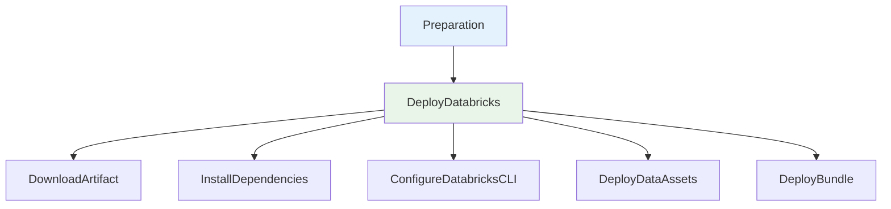

# Deploy Databricks Data Products

Pipeline de CD para deploy automatizado de produtos de dados em Databricks, incluindo ativos de dados (Data Assets) e bundles de dataflow, utilizando SDKs dedicados para cada etapa e o Databricks CLI para execução do bundle.

## 🎯 Descrição

Este pipeline automatiza o processo de deployment de produtos de dados na plataforma Databricks, contemplando tanto contratos de dados (Data Assets) quanto bundles de dataflow. Utiliza o SDK Data Assets Engine para garantir que os ativos estejam atualizados e o Databricks CLI para validar e executar o bundle no ambiente alvo.

O pipeline é composto por dois estágios principais: preparação do ambiente e deploy dos SDKs Databricks. Na preparação, é feita a descoberta da versão/tag a ser deployada, com rastreio e versionamento automático. No deploy, o pipeline realiza download do artefato Python, instala dependências, configura o Databricks CLI, aplica contratos de dados e executa o bundle via Databricks CLI. Cada etapa do deploy foi modularizada em sub-jobs para facilitar troubleshooting e reuso.

Principais benefícios:
- Versionamento automático e rastreio de deploy
- Deploy seguro e auditável via Azure DevOps
- Integração nativa com feeds PyPI do Azure Artifacts
- Instalação e configuração automatizada do Databricks CLI
- Aplicação de contratos de dados via SDK
- Deploy de bundles diretamente via Databricks CLI

- [Pipeline utilizado para testes](https://dev.azure.com/telefonica-vivo-brasil/VVIA%20-%20VIVO%20IA/_build?definitionId=42704)
- [Repositório de exemplo](https://dev.azure.com/telefonica-vivo-brasil/VVIA%20-%20VIVO%20IA/_git/pd-sample)
- [Canal de comunicação SDK/TechProduct](https://teams.microsoft.com/l/channel/19%3A617ec633e067473eb46052f823b44187%40thread.tacv2/SDK-TechProduct%20-%20Comunica%C3%A7%C3%A3o?groupId=6362a9e8-f4e8-455c-905c-8f87dd3ec2bc&tenantId=9744600e-3e04-492e-baa1-25ec245c6f10)

## 🚀 Quick Start (5 minutos)

1. Crie os arquivos necessários no seu repositório (Veja [Dependências Externas](#-dependências-externas))
2. Crie `.azuredevops/azure-pipeline-cd.yml` na raiz
3. Cole o código de exemplo
4. Commit e push
5. ✅ Pipeline executa automaticamente!
6. Opcional: ajuste triggers

```yaml
# Pipeline básico para deploy Databricks
# .azuredevops/azure-pipeline-cd.yml
resources:
  repositories:
    - repository: CodePlay
      name: DevOps/Vivo.CodePlay.Pipelines
      type: git
      ref: refs/heads/master
      endpoint: CodePlay

extends:
  template: /framework/pipelines/cd/deploy-databricks/pipeline.yaml@CodePlay
```

**O que acontece com esta configuração:**
- 🏷️ Versionamento automático e rastreio de deploy
- 📦 Download do artefato Python do feed PyPI
- 🛠️ Instalação de dependências e SDKs
- 🔒 Configuração segura do Databricks CLI
- 📄 Aplicação de contratos de dados via Data Assets Engine
- 🚀 Deploy de bundles via Databricks CLI
- 📝 Tags de build para rastreabilidade

## 🏗️ Matriz de Capacidades

| Capacidade | Suporte | Descrição |
|------------|---------|-----------|
| [Trunk Based Development](https://dvps.redecorp.azr/portal/codeplay/capacidades/catalog/trunk-based-development) | ✅ | Pipeline executa em qualquer branch, versionamento automático via VersionManager |
| [Build Automatizado](https://dvps.redecorp.azr/portal/codeplay/capacidades/catalog/build-automatizado) | ✅ | Download de artefato Python automatizado via Azure Artifacts |
| [Testes Unitários](https://dvps.redecorp.azr/portal/codeplay/capacidades/catalog/testes-unitarios) | ❌ | Não implementado. Pipeline foca em deploy e integração Databricks |
| [SAST](https://dvps.redecorp.azr/portal/codeplay/capacidades/catalog/sast) | ❌ | Não implementado neste pipeline |
| [SCA](https://dvps.redecorp.azr/portal/codeplay/capacidades/catalog/sca) | ❌ | Não implementado neste pipeline |
| [Gates de Segurança](https://dvps.redecorp.azr/portal/codeplay/capacidades/catalog/gates-de-seguranca) | ⚠️ | Token Databricks passado via parâmetro, será implementado na proxima versão |
| [Análise de Código](https://dvps.redecorp.azr/portal/codeplay/capacidades/catalog/analise-de-codigo) | ❌ | Não implementado |
| [Gates de Qualidade](https://dvps.redecorp.azr/portal/codeplay/capacidades/catalog/gate-de-qualidade) | ❌ | Não implementado |
| [Rollback de Upgrade](https://dvps.redecorp.azr/portal/codeplay/capacidades/catalog/rollback-de-upgrade) | ❎ | Pipeline de CD - rollback não implementado |
| [Blue/Green Deployment](https://dvps.redecorp.azr/portal/codeplay/capacidades/catalog/blue-green-deployment) | ❎ | Estratégias de deployment são responsabilidade do produto |
| [Canary Release](https://dvps.redecorp.azr/portal/codeplay/capacidades/catalog/canary-release) | ❎ | Estratégias de release são responsabilidade do produto |

## 🔄 Estrutura do Pipeline

O pipeline é organizado em dois estágios principais: Preparation (descoberta e definição da versão/tag a ser deployada) e DeployDatabricks (deploy dos SDKs, configuração do ambiente, aplicação de contratos e bundles). O fluxo é sequencial, garantindo que o ambiente esteja corretamente preparado antes do deploy. Todas as ações críticas são rastreadas via tags e variáveis de build. O estágio de deploy foi modularizado em sub-jobs para facilitar troubleshooting e reuso.



### Estágios do Pipeline

1. **🛠️ Preparation**
   - Descoberta da versão/tag a ser deployada via VersionManager
   - Rastreio de build e definição de variáveis
   - Determinação do ambiente alvo

2. **🚀 DeployDatabricks** (Depende do Preparation)
   - **DownloadArtifact**: Download do artefato Python do feed PyPI
   - **InstallDependencies**: Instalação de dependências e SDKs
   - **ConfigureDatabricksCLI**: Instalação e configuração do Databricks CLI
   - **DeployDataAssets**: Aplicação de contratos de dados via Data Assets Engine
   - **DeployBundle**: Deploy do bundle via Databricks CLI

## ⚙️ Parâmetros Disponíveis


### Infraestrutura e Ambiente

#### agentPool
- **nome**: agentPool
- **tipo**: string
- **default**: "GeneralPurposeLinuxAgentsCD"
- **descrição**: Pool de agentes para execução do pipeline
- **dependências**: Nenhuma

#### environment
- **nome**: environment
- **tipo**: string
- **default**: "dev"
- **descrição**: Ambiente de destino para deployment (dev ou prod)
- **dependências**: Nenhuma

---

⚠️ **ATENÇÃO**: Utilizar o parâmetro `timeoutInMinutes` apenas se for realmente necessário
#### timeoutInMinutes
- **nome**: timeoutInMinutes
- **tipo**: number
- **default**: 60
- **descrição**: Timeout em minutos para deployment
- **dependências**: Nenhuma

### Configurações de Python e Feed

#### feedName
- **nome**: feedName
- **tipo**: string
- **default**: "$(DEFAULT_FEED_NAME)"
- **descrição**: Nome do feed do Azure Artifacts para download do artefato Python
- **dependências**: Nenhuma

#### feedServiceConnection
- **nome**: feedServiceConnection
- **tipo**: string
- **default**: ""
- **descrição**: Identificador da service connection/feed para autenticação PipAuthenticate
- **dependências**: Nenhuma

#### projectScopedFeed
- **nome**: projectScopedFeed
- **tipo**: boolean
- **default**: true
- **descrição**: Define se o feed é escopo do projeto (true) ou da organização (false)
- **dependências**: Nenhuma

### Versionamento / Fonte

#### version
- **nome**: version
- **tipo**: string
- **default**: ""
- **descrição**: Versão/tag a ser utilizada no deployment. Se vazio, busca a última versão disponível.
- **dependências**: Nenhuma

### Configurações Databricks

#### databricksToken
- **nome**: databricksToken
- **tipo**: string
- **default**: ""
- **descrição**: Token de autenticação Databricks
- **dependências**: Recomenda-se uso de Azure Key Vault

### Configurações de contratos de dados

#### runDataContracts
- **nome**: runDataContracts
- **tipo**: boolean
- **default**: true
- **descrição**: Executar a aplicação de contratos de dados via Data Assets Engine, deve ser desligada apenas para casos que não possuirem essa dependencia no codigo
- **dependências**: Nenhuma

#### DATABRICKS_CLIENT_ID
- **nome**: client_id
- **tipo**: string
- **default**: ""
- **descrição**: ClientID do Service Principal utilizado pela Sigla para autenticação do Databricks, configurado através da Library: `databricks-$(environment)-authorization`
- **dependências**: Recomenda-se uso de Azure Key Vault

#### DATABRICKS_CLIENT_SECRET
- **nome**: secret
- **tipo**: string
- **default**: ""
- **descrição**: Secret do Service Principal utilizado pela Sigla para autenticação do Databricks, configurado através da Library: `databricks-$(environment)-authorization`
- **dependências**: Recomenda-se uso de Azure Key Vault

## 🔧 Dependências Externas

### Service Connections Necessárias

#### 1. Feed do Azure Artifacts
- **Nome padrão**: feedServiceConnection
- **Tipo**: Azure Artifacts
- **Uso**: Download de artefato Python
- **Permissões necessárias**:
  - Leitura no feed
- **Configurável via**: parâmetro `feedServiceConnection`

### Agent Pool Requirements

#### Pool de Agentes
- **Pool padrão**: GeneralPurposeLinuxAgentsCD
- **Sistema Operacional**: Linux
- **Ferramentas obrigatórias**:
  - Python 3.x
  - Poetry
  - Databricks CLI
  - yq
  - curl, wget, tar
- **Acesso de rede**:
  - Azure Artifacts
  - Databricks workspace

### Arquivos Obrigatórios no Repositório

#### 1. pyproject.toml
- **Localização padrão**: Raiz do artefato Python
- **Configurável via**: Não aplicável
- **Requisitos**:
  - Sintaxe válida
  - Nome do artefato definido

#### 2. databricks.yml
- **Localização padrão**: Diretório do artefato
- **Configurável via**: Não aplicável
- **Requisitos**:
  - Targets de ambiente definidos

### Integrações Externas de Segurança

#### 1. Token Databricks
- **Descrição**: Token de autenticação para CLI
- **Requisitos**:
  - Permissão de deploy no workspace
- **Opcional**: Recomenda-se uso de Key Vault

### Permissões de Repositório Git
- **Permissão de leitura** no repositório Git
- **Checkout automático**

### Azure Key Vault
- **Uso**: Armazenamento seguro do token Databricks
- **Secrets esperados**:
  - databricksToken

### Migração de Token para Service Principal
- **Descrição**: Deve ser atualizado a library `databricks-$(environment)-authorization` com as informações (client_id e secret) do Service Principal para deixar de Utilizar o PAT
- **Requisitos**: 
  - As informações devem ser armazenadas na library como "secret", evitando a exposição de dados sensíveis
  - Nenhum print deve realizado nessas variaveis dentro da pipeline
  
### Variáveis de Sistema Necessárias

| Variável | Origem | Uso |
|----------|--------|-----|
| System.TeamProject | Azure DevOps | Identificação do projeto |
| System.TeamProjectId | Azure DevOps | Identificação do projeto |
| System.AccessToken | Azure DevOps | Autenticação para feeds e tasks |

## 🎨 Comportamentos Customizados

:::danger
**⚠️ ATENÇÃO: CUSTOMIZAÇÕES REQUEREM RESPONSABILIDADE ⚠️**

- ✅ **Use os exemplos como ponto de partida** - Eles demonstram padrões seguros e testados
- 🧠 **"Todos somos adultos"** - Confiamos na sua expertise, mas exigimos consciência do impacto
- 📝 **Tudo fica registrado** - Seu histórico de commits é auditável e rastreável
- 🎯 **Entenda antes de modificar** - Customizações incorretas podem quebrar builds em produção
- 🤝 **Documente suas decisões** - Facilite a manutenção futura por outros membros da equipe

**Customizar é permitido. Fazer sem entender não é.**
:::

### Deploy Databricks com ambiente customizado

```yaml
# .azuredevops/azure-pipeline-cd.yml
resources:
  repositories:
    - repository: CodePlay
      name: DevOps/Vivo.CodePlay.Pipelines
      type: git
      ref: refs/heads/master
      endpoint: CodePlay

extends:
  template: /framework/pipelines/cd/deploy-databricks/pipeline.yaml@CodePlay
parameters:
  environment: "prod"  # Define ambiente de produção
  databricksToken: "$(seu_token)"  # Token de autenticação
```

## 🔖 Variáveis de Ambiente

As seguintes variáveis de ambiente são automaticamente configuradas pelo pipeline:

| Variável | Descrição | Valor Padrão |
|----------|-----------|--------------|
| SIGLA | Sigla do projeto | $[ lower(split(variables['System.TeamProject'],' ')[0]) ] |
| DEFAULT_FEED_NAME | Nome padrão do feed | $[ upper(variables['SIGLA']) ] |
| PROJECT_ID | ID do projeto | $(System.TeamProjectId) |

## ❓ FAQ

### Onde posso encontrar mais informações sobre o CodePlay Framework?

Você pode encontrar mais informações sobre o CodePlay Framework na [documentação oficial](https://dvps.redecorp.azr/portal/codeplay/framework/).

### Onde encontro as capacidades disponíveis?

As capacidades disponíveis podem ser encontradas no [Catálogo de Capacidade](https://dvps.redecorp.azr/portal/catalog/capabilities) no Portal CodePlay.

### Como faço para customizar o pipeline?

Siga o guia de [Adoção ao CodePlay](https://dvps.redecorp.azr/portal/codeplay/roteiro/codeplay#fluxo-de-ado%C3%A7%C3%A3o-ao-codeplay).

### Quais casos de uso relevantes?

- [Integrando CICD](https://dvps.redecorp.azr/portal/code/casos-de-uso/integrando-cicd)
- Veja o [Catálogo de Casos de Uso](https://dvps.redecorp.azr/portal/catalog/casos-de-uso) para outros exemplos de casos de uso.

### Quais Erros Comuns relevantes?

- Ainda não temos nenhum erro comum documentado para este pipeline.
- Veja o [Catálogo de Erros Conhecidos](https://dvps.redecorp.azr/portal/catalog/erros-conhecidos) para outros exemplos de erros.

## 🆘 Suporte

- [Abra um chamado para Dev Support](https://dvps.redecorp.azr/portal/codeplay/roteiro/#:~:text=Abra%20um%20chamado%20para%20Dev%20Support)
- [Canal DevEx - Azure DevOps](https://teams.microsoft.com/l/channel/19%3A8fbd00946cf044d7a844182ac71e6aa1%40thread.tacv2/Azure%20DevOps?groupId=038b4415-d6dd-42ce-92e5-31a8e2a13bf8&tenantId=9744600e-3e04-492e-baa1-25ec245c6f10)

## 📝 Decisões Tomadas

### Decisão 1: Estrutura de deploy Databricks via SDKs e CLI

- **Data**: 03/02/2026
- **Motivador**: Padronizar deploy de produtos de dados em Databricks
- **Forum Envolvido**: Time de Dados e DevOps
- **Descrição**: Implementação de pipeline CD com dois estágios, versionamento automático, integração com Azure Artifacts, aplicação de contratos de dados via SDK e deploy de bundles via Databricks CLI.
- **Notas**: Software `databricks-cli v1.2.1` homologado [RITM0900130](https://vivoit.service-now.com/vivonow?id=ticket&table=sc_req_item&sys_id=e13ca6992b2d4f14ed0dfa334391bffb&view=sp)
