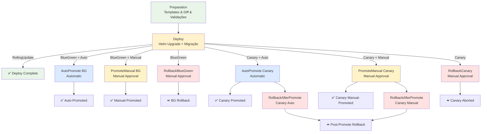

# Deploy de Helm Chart em Kubernetes

Pipeline de CD para deploy de aplicações containerizadas em clusters Kubernetes usando Helm Charts.

## 🎯 Descrição

Este pipeline automatiza o deploy de aplicações containerizadas em clusters Kubernetes através de Helm Charts, oferecendo suporte completo para múltiplos ambientes, estratégias de deployment avançadas e integração com ferramentas corporativas. O pipeline implementa as melhores práticas de CD com validação prévia, comparação de diferenças e rollback automático.

O processo inclui preparação e validação de templates Helm, registro em repositórios Helm, execução de `helm upgrade` com parâmetros otimizados, e suporte a **Blue/Green** e **Canary Deployment** através do **Argo Rollouts**. Oferece flexibilidade total para diferentes tipos de cluster (AKS com Managed Identity ou Kubeconfig para clusters on-premise/OpenShift).

Principais capacidades incluem versionamento automático de releases, substituição segura de valores via Variable Groups, comparação visual de manifests via `kubectl diff`, coleta automática de diagnósticos em falha, integração com Event Hub para rastreabilidade de deployments, **seleção de estratégia de deploy** (`RollingUpdate`, `BlueGreen`, `Canary`) com migração automática entre estratégias, e **validação de versões** do Argo Rollouts controller e Helm Chart.
 
- [Pipeline utilizado para testes](https://dev.azure.com/telefonica-vivo-brasil/DevOps/_build?definitionId=45026)
- [Repositório de exemplo](https://dev.azure.com/telefonica-vivo-brasil/DevOps/_git/teste-deploy-helm)

:::tip
Se você está buscando informações sobre como configurar os paramêtros do helm chart, acesse [aqui](https://dev.azure.com/telefonica-vivo-brasil/DevOps/_git/Vivo.Helm.Generic.Microservice?path=/values.yaml&_a=contents&version=GBmaster).
:::

## 🚀 Quick Start (5 minutos)

1. Crie os arquivos necessários no seu repositório (Veja [Dependências Externas](#-dependências-externas))
2. Crie `.azuredevops/azure-pipeline-cd.yml` na raiz
3. Cole o código de exemplo
4. Commit e push
5. ✅ Pipeline executa automaticamente!
6. Opcional: ajuste triggers

```yaml
# Deploy básico para AKS usando Helm Chart genérico
# .azuredevops/azure-pipeline-cd.yml
resources:
  repositories:
    - repository: CodePlay
      name: DevOps/Vivo.CodePlay.Pipelines
      type: git
      ref: refs/heads/master
      endpoint: CodePlay

extends:
  template: /framework/pipelines/cd/deploy-helm/pipeline.yaml@CodePlay
  parameters:
    environment: dev
    version: getLatestVersion()
# Note que alguns projetos estão fora da convenção de nome e podem precisar de ajustes manuais nos parâmetros (olhar seção de parâmetros para detalhes)
```

**O que acontece com esta configuração:**

- 🔧 **Preparação**: Valida templates Helm e mostra diff visual das mudanças
- 🏷️ **Versionamento**: Obtém automaticamente a versão mais recente do repositório
- 🔐 **Autenticação**: Login no AKS via Managed Identity usando service connection `aks-{sigla}-brsouth-dev`
- 📦 **Registro Helm**: Conecta no ACR corporativo (`acrsharedservices01.azurecr.io`)
- 🎯 **Deploy**: Executa `helm upgrade --install` com chart `generic-microservice` v1.0.26
- 🗂️ **Namespace**: Deploy realizado no namespace `{sigla}-dev`
- 📊 **Monitoramento**: Registra eventos de deploy no Event Hub para rastreabilidade
- 🔄 **Rollback**: Habilitado por padrão em caso de falha no deploy


## 🏗️ Matriz de Capacidades

| Capacidade | Suporte | Descrição |
|------------|---------|-----------|
| [Trunk Based Development](https://dvps.redecorp.azr/portal/codeplay/capacidades/catalog/trunk-based-development) | ❎ | Pipeline de CD - não faz sentido habilitar essa capacidade |
| [Build Automatizado](https://dvps.redecorp.azr/portal/codeplay/capacidades/catalog/build-automatizado) | ❎ | Pipeline de CD - não faz sentido habilitar essa capacidade |
| [Testes Unitários](https://dvps.redecorp.azr/portal/codeplay/capacidades/catalog/testes-unitarios) | ❎ | Pipeline de CD - não faz sentido habilitar essa capacidade |
| [SAST](https://dvps.redecorp.azr/portal/codeplay/capacidades/catalog/sast) | ❎ | Pipeline de CD - não faz sentido habilitar essa capacidade |
| [SCA](https://dvps.redecorp.azr/portal/codeplay/capacidades/catalog/sca) | ❎ | Pipeline de CD - não faz sentido habilitar essa capacidade |
| [Gates de Segurança](https://dvps.redecorp.azr/portal/codeplay/capacidades/catalog/gates-de-seguranca) | ❎ | Pipeline de CD - não faz sentido habilitar essa capacidade |
| [Análise de Código](https://dvps.redecorp.azr/portal/codeplay/capacidades/catalog/analise-de-codigo) | ❎ | Pipeline de CD - não faz sentido habilitar essa capacidade |
| [Gates de Qualidade](https://dvps.redecorp.azr/portal/codeplay/capacidades/catalog/gate-de-qualidade) | ❎ | Pipeline de CD - não faz sentido habilitar essa capacidade |
| [Rollback de Upgrade](https://dvps.redecorp.azr/portal/codeplay/capacidades/catalog/rollback-de-upgrade) | ✅ | Rollback automático em falha via `enableAutomaticRollback=true` (padrão habilitado). Executa `helm rollback` com `--cleanup-on-fail` |
| [Blue/Green Deployment](https://dvps.redecorp.azr/portal/codeplay/capacidades/catalog/blue-green-deployment) | ✅ | Implementado via Argo Rollouts com `deployStrategy: BlueGreen`. Suporta auto-promoção e promoção manual com environments dedicados |
| [Canary Release](https://dvps.redecorp.azr/portal/codeplay/capacidades/catalog/canary-release) | ✅ | Implementado via Argo Rollouts com `deployStrategy: Canary`. Suporta auto-promoção, promoção manual, rollback durante canary e rollback pós-promoção |

**Legenda:**

- ✅ Suportado nativamente
- ❌ Não suportado
- ⚠️ Suportado com limitações ou condições
- 🚧 Planejado / Em Construção
- ❎ Não faz sentido habilitar essa capacidade

## 🔄 Estrutura do Pipeline

O pipeline está organizado em estágios condicionais que se adaptam à estratégia de deployment escolhida via parâmetro `deployStrategy`. No modo **RollingUpdate** (padrão), executa preparação seguida de deploy com rollback opcional em falha. No modo **BlueGreen**, adiciona estágios para promoção manual/automática e rollback via Argo Rollouts. No modo **Canary**, adiciona estágios para promoção progressiva, rollback durante canary e rollback pós-promoção.

O pipeline detecta automaticamente mudanças de estratégia e realiza migração entre tipos de workload (Deployment ↔ Rollout, BlueGreen ↔ Canary).



### Estágios do Pipeline

1. **🔍 Preparation - Validação e Templates**
   - Define tags de build (helm, kubernetes, deploy-helm) para categorização
   - Realiza checkout com profundidade mínima (`fetchDepth: 1`) 
   - Determina versão através de `VersionManagerVivo` ou parâmetro customizado
   - Login condicional no cluster (AKS via Managed Identity ou Kubeconfig para on-premise/OpenShift)
   - Validação unificada de infraestrutura Argo Rollouts (quando `deployStrategy` é `BlueGreen` ou `Canary`):
     - Verifica existência do CRD `rollouts.argoproj.io`
     - Valida versão mínima do Argo Rollouts controller (`argoRolloutsMinVersion`)
     - Valida versão mínima do Helm Chart (`helmChartMinVersion`)
   - Obtém credenciais do Key Vault e registra repositório Helm
   - Configura `deploymentStrategy` no `values.yml` conforme estratégia selecionada
   - Processa substituição opcional de placeholders em values customizados
   - Gera templates Helm, executa debug de manifests e `kubectl diff` para visualização

2. **🚀 Deploy - Aplicação do Helm Chart** (Deployment Job)
   - Repete autenticação no cluster e registro do repositório Helm
   - Configura `deploymentStrategy` no `values.yml` (necessário porque `checkout: self` recarrega código do repo)
   - **Detecção e migração automática de workloads**:
     - Detecta se existe Deployment ou Rollout no cluster
     - Ao migrar de `Deployment` para `Rollout` (BlueGreen/Canary): remove Deployment existente antes do upgrade
     - Ao migrar entre `BlueGreen` ↔ `Canary`: remove Rollout existente para recriação com nova estratégia
   - Executa `helm upgrade --install` com timeout configurável
   - Para BlueGreen: aguarda Rollout entrar em estado `Paused` (Dark Environment)
   - Para Canary: aguarda Rollout atingir os steps definidos na estratégia
   - Registra evento de deploy no Event Hub para rastreabilidade
   - **Em falha**: Coleta diagnósticos (history, status, manifests, logs) e executa rollback condicional

3. **⚡ AutoPromote (BlueGreen)** (Condicional: `deployStrategy=BlueGreen` AND `blueGreenAutoPromote=true`)
   - Aguarda delay configurável antes da promoção
   - Executa validação pré-promoção customizada (opcional)
   - Realiza limpeza de anotações de migração (`codeplay/previous-strategy`)
   - Promove automaticamente Green → Stable via `kubectl-argo-rollouts promote`

4. **👤 PromoteManual (BlueGreen)** (Condicional: `deployStrategy=BlueGreen` AND `blueGreenAutoPromote=false`)
   - Requer approval manual via Environment `deploy-{env}-promote`
   - Exibe status atual do Rollout para tomada de decisão
   - Executa validação pré-promoção (opcional)
   - Realiza limpeza de anotações de migração
   - Promove Green → Stable

5. **⏪ RollbackBlueGreen** (Paralelo, disponível quando `deployStrategy=BlueGreen`)
   - Requer approval manual via Environment `deploy-{env}-rollback`
   - Detecta cenário automaticamente (antes ou após promoção)
   - Executa rollback via `undo` + `promote` para reverter Blue como Stable

6. **⚡ AutoPromoteCanary** (Condicional: `deployStrategy=Canary` AND `canaryAutoPromote=true`)
   - Aguarda delay configurável antes da promoção
   - Executa validação pré-promoção customizada (opcional)
   - Realiza limpeza de anotações de migração
   - Promove Canary → Stable via `kubectl-argo-rollouts promote`

7. **👤 PromoteManualCanary** (Condicional: `deployStrategy=Canary` AND `canaryAutoPromote=false`)
   - Requer approval manual via Environment `deploy-{env}-promote`
   - Exibe status atual do Rollout para tomada de decisão
   - Executa validação pré-promoção (opcional)
   - Realiza limpeza de anotações de migração
   - Promove Canary → Stable

8. **⏪ RollbackCanary - Abortar Canary em Andamento** (Paralelo, disponível quando `deployStrategy=Canary`)
   - Requer approval manual via Environment `deploy-{env}-rollback`
   - Aborta o Canary deployment em progresso
   - Executa rollback via `kubectl-argo-rollouts abort` + `undo`

9. **⏪ RollbackAfterPromoteCanary** (Condicional: disponível após AutoPromoteCanary ou PromoteManualCanary)
   - Requer approval manual via Environment `deploy-{env}-rollback`
   - Permite reverter APÓS a promoção do Canary ter sido concluída
   - Executa rollback via `undo` + `promote` para restaurar versão anterior como Stable

## ⚙️ Parâmetros Disponíveis

### Parâmetros Gerais de Execução

#### environment

- **nome**: environment
- **tipo**: string
- **default**: "dev"
- **descrição**: Ambiente alvo do deploy. Determina qual service connection, namespace e arquivo de values será utilizado.
- **dependências**: Configuração de chaves nos parâmetros object para cada ambiente.

#### version

- **nome**: version
- **tipo**: string
- **default**: "getLatestVersion()"
- **descrição**: Versão da imagem aplicada via `--set image.tag`. Aceita dois formatos: (1) função ``getLatestVersion()`` (padrão) - busca automaticamente a última versão disponível via tags Git do repositório através do ``VersionManagerVivo``; (2) versão específica (ex: 'v1.2.3') - usa a versão informada. A versão determinada é aplicada como image tag no Helm Chart.
- **dependências**: Para busca automática de versão com ``getLatestVersion()``, requer tags Git no formato semântico no repositório.

#### agentPool

- **nome**: agentPool
- **tipo**: string
- **default**: "GeneralPurposeLinuxAgentsCD"
- **descrição**: Pool de agentes para execução. Deve ter Helm 3+, kubectl e Azure CLI instalados.
- **dependências**: Pool configurado com ferramentas necessárias.

#### branchingStrategy

- **nome**: `branchingStrategy`
- **tipo**: string
- **default**: "trunkbased"
- **valores válidos**: `trunkbased`, `vivoflow`, `releaseflow`, `gitlabflow`, `gitlabflow-semantic`, `custom`, `monorepo`
- **descrição**: Estratégia de versionamento utilizada pelo `VersionManagerVivo` para calcular e aplicar o número de versão da release. Deve corresponder à estratégia de branching adotada pelo time.
- **dependências**: Nenhuma.

### Configuração do Helm Chart

#### helmReleaseName

- **nome**: helmReleaseName
- **tipo**: string
- **default**: "$(Build.Repository.Name)"
- **descrição**: Nome da release Helm no cluster. Usado para identificar a instalação em comandos de history, status e rollback.
- **dependências**: Nenhuma.

#### helmValuesFile

- **nome**: helmValuesFile
- **tipo**: object
- **default**: 

```yaml
dev: .azuredevops/config/dev/values.yml
esteira1: .azuredevops/config/esteira1/values.yml
esteira2: .azuredevops/config/esteira2/values.yml
preprod: .azuredevops/config/preprod/values.yml
prodlike: .azuredevops/config/prodlike/values.yml
prod: .azuredevops/config/prod/values.yml
```

- **descrição**: Mapeamento de arquivos de valores por ambiente. Arquivo principal sempre utilizado no template e upgrade.
- **dependências**: Arquivos devem existir no repositório.

### Configuração de Valores Customizados

:::warning
⚠️ **ATENÇÃO:** Esta funcionalidade é contra-indicada para dados sensíveis. Utilize o [Azure Key Vault](https://wikicorp.telefonica.com.br/spaces/AC/pages/495251243/Azure+Key+Vault+-+Autentica%C3%A7%C3%A3o+via+service+principal) (documentação interna) com o [CSI Secrets Store Driver](https://learn.microsoft.com/en-us/azure/aks/csi-secrets-store-driver) como alternativa segura.
:::

#### usePlaceholdersHelmValuesFile

- **nome**: usePlaceholdersHelmValuesFile
- **tipo**: boolean
- **default**: false
- **descrição**: Habilita substituição de tokens em arquivo values adicional. Cria cópia temporária e aplica replacement tokens.
- **dependências**: Recomendado definir placeholderVariableGroupName.

#### placeholdersHelmValuesFile
- **nome**: `placeholdersHelmValuesFile`
- **tipo**: object
- **default**:
  ```yaml
  dev: .azuredevops/config/dev/placeholders-values.yml
  esteira1: .azuredevops/config/esteira1/placeholders-values.yml
  esteira2: .azuredevops/config/esteira2/placeholders-values.yml
  preprod: .azuredevops/config/preprod/placeholders-values.yml
  prodlike: .azuredevops/config/prodlike/placeholders-values.yml
  prod: .azuredevops/config/prod/placeholders-values.yml
  ```
- **descrição**: Arquivos contendo tokens que serão substituídos antes do template / upgrade.
- **dependências**: `usePlaceholdersHelmValuesFile = true`.

#### placeholderVariableGroupName
- **nome**: `placeholderVariableGroupName`
- **tipo**: string
- **default**: ''
- **descrição**: Variable Group carregado como provider de valores para tokens. Carregado condicionalmente nas variáveis.
- **dependências**: Grupo deve existir quando informado.

#### placeholderPrefix
- **nome**: `placeholderPrefix`
- **tipo**: string
- **default**: $(
- **descrição**: Prefixo do padrão de token custom para a task `replacetokens`.
- **dependências**: `usePlaceholdersHelmValuesFile = true`.

#### placeholderSuffix
- **nome**: `placeholderSuffix`
- **tipo**: string
- **default**: )
- **descrição**: Sufixo do padrão de token custom usado pela task replacetokens para identificar variáveis a serem substituídas.
- **dependências**: `usePlaceholdersHelmValuesFile = true`.

#### helmSetFiles
- **nome**: `helmSetFiles`
- **tipo**: object
- **default**: `[]`
- **descrição**: Lista de arquivos do repositório a serem carregados via flag `--set-file` do Helm durante a geração dos templates e durante o `helm upgrade`. Cada item deve estar no formato `key=path/to/file`, onde `key` é o caminho do valor no chart (ex: `configMap.data.myconfig`) e `path/to/file` é o caminho relativo do arquivo no repositório. Útil para popular ConfigMaps com conteúdo de arquivos externos (arquivos de configuração, templates, scripts, JSON, XML, etc.) sem duplicar o conteúdo no `values.yml`.
- **dependências**: Os arquivos referenciados devem existir no repositório e o chart deve expor a estrutura de valores correspondente à `key` informada.
- **exemplo**:
  ```yaml
  helmSetFiles:
    - configMap.data.appConfig=configs/app.conf
    - configMap.data.runScript=scripts/run.sh
    - extraConfig.jsonPayload=configs/payload.json
  ```
  ```yaml
  # .azuredevops/config/dev/values.yml
  configMap:
    enabled: true
    data: {}
  ```
  ```yaml
  # Resultado no Helm
  helm template <release> <chart> --set-file configMap.data.appConfig=configs/app.conf --set-file configMap.data.runScript=scripts/run.sh
  helm upgrade --install <release> <chart> --set-file configMap.data.appConfig=configs/app.conf --set-file configMap.data.runScript=scripts/run.sh
  ```

### Repositório Helm e Chart

#### useHelmRepoFromNexus

:::warning
**⚠️ USO NÃO RECOMENDADO** — O Nexus está em obsolescência. O ACR corporativo é a opção indicada para artefatos Helm. Mantenha o valor padrão false para utilizar o ACR. Evite habilitar este parâmetro nos seus pipelines.
saiba mais: https://dvps.redecorp.azr/portal/comunicados/2026/07/27/comunicado
:::

- **nome**: `useHelmRepoFromNexus`
- **tipo**: boolean
- **default**: false
- **descrição**: **(NÃO RECOMENDADO)** Quando `true` adiciona repositório Nexus via `helm repo add`; caso contrário (padrão) usa OCI login no ACR. indicado sempre o ACR.
- **dependências**: Segredos de usuário/senha no Key Vault (Nexus ou ACR conforme fluxo).

#### helmRepoUrlNexus

:::warning
**⚠️ USO NÃO RECOMENDADO** — Relevante apenas quando `useHelmRepoFromNexus=true`; o ACR é a opção indicada.
:::

- **nome**: `helmRepoUrlNexus`
- **tipo**: string
- **default**: https://nexus.telefonica.com.br/repository
- **descrição**: **(NÃO RECOMENDADO)** URL base usada para compor o caminho completo `helmRepoUrlNexus/helmRepoName` durante `helm repo add`.
- **dependências**: `useHelmRepoFromNexus = true`.

#### helmRepoUrlACR
- **nome**: `helmRepoUrlACR`
- **tipo**: string
- **default**: acrsharedservices01.azurecr.io
- **descrição**: Registro ACR corporativo acessado via `helm registry login` (protocolo OCI). **Repositório Helm padrão e recomendado** (`useHelmRepoFromNexus=false`).
- **dependências**: `useHelmRepoFromNexus = false`.

#### helmRepoName
- **nome**: `helmRepoName`
- **tipo**: string
- **default**: helm/devops
- **descrição**: Segmento lógico usado no caminho final do chart (Nexus) ou após o host (ACR OCI).
- **dependências**: Ajustar conforme padrão de publicação dos charts.

#### helmChartName
- **nome**: `helmChartName`
- **tipo**: string
- **default**: generic-microservice
- **descrição**: Nome do chart alvo no repositório Helm usado para localizar e baixar o pacote durante operações de template e upgrade.
- **dependências**: Chart existente na versão solicitada.

#### helmChartVersion
- **nome**: `helmChartVersion`
- **tipo**: string
- **default**: 1.0.37
- **descrição**: Versão do chart passada a `--version` em template e upgrade.
- **dependências**: Versão precisa estar publicada no repositório.

#### helmTimeout
- **nome**: `helmTimeout`
- **tipo**: string
- **default**: 300s
- **descrição**: Timeout aplicado em `helm upgrade` (e em rollback). Controla janela de espera de readiness.
- **dependências**: Nenhuma.

### Configuração AKS

#### useAKSManagedIdentity
- **nome**: `useAKSManagedIdentity`
- **tipo**: boolean
- **default**: true
- **descrição**: Ativa login AKS via service connection ARM e Managed Identity.
- **dependências**: Service connection ARM configurada e cluster com MI.

#### aksServiceConnection
- **nome**: `aksServiceConnection`
- **tipo**: object
- **default**:
  ```yaml
  dev: "aks-$(SIGLA)-brsouth-dev"
  preprod: "aks-$(SIGLA)-brsouth-preprod"
  prod: "aks-$(SIGLA)-brsouth-prod"
  ```
- **descrição**: Identificadores das service connections ARM por ambiente.
- **dependências**: `useAKSManagedIdentity = true`.

#### aksResourceGroup
- **nome**: `aksResourceGroup`
- **tipo**: object
- **default**:
```yaml
  dev: "rg-aks-$(SIGLA)-brsouth-dev"
  preprod: "rg-aks-$(SIGLA)-brsouth-preprod"
  prod: "rg-aks-$(SIGLA)-brsouth-prod"
  ```
- **descrição**: Resource Groups onde os clusters AKS residem por ambiente. Usado para localizar e acessar os recursos do cluster durante operações de deploy.
- **dependências**: `useAKSManagedIdentity = true`.

#### aksClusterName
- **nome**: `aksClusterName`
- **tipo**: object
- **default**:
  ```yaml
  dev: "aks-$(SIGLA)-brsouth-dev"
  preprod: "aks-$(SIGLA)-brsouth-preprod"
  prod: "aks-$(SIGLA)-brsouth-prod"
  ```
- **descrição**: Nome do cluster AKS por ambiente usado para autenticação e operações Kubernetes. Referenciado durante o login via Managed Identity.
- **dependências**: `useAKSManagedIdentity = true`.

### Configuração Kubeconfig

#### useKubeconfig
- **nome**: `useKubeconfig`
- **tipo**: boolean
- **default**: false
- **descrição**: Quando `true`, autentica via service connection Kubernetes (kubeconfig). Alternativa a AKS MI.
- **dependências**: Service connections Kubernetes válidas.

#### kubeconfigServiceConnection
- **nome**: `kubeconfigServiceConnection`
- **tipo**: object
- **default**:
  ```yaml
  dev: "$(SIGLA)-dev"
  preprod: "$(SIGLA)-preprod"
  prod: "$(SIGLA)-prod"
  ```
- **descrição**: Nomes das service connections Kubernetes por ambiente usadas para autenticação alternativa ao AKS Managed Identity via kubeconfig.
- **dependências**: `useKubeconfig = true`.

### Configuração de Secret Docker (clusters on-premise)

> Disponível apenas quando `useKubeconfig=true`. AKS com Managed Identity já possui integração nativa com o ACR e não necessita desta configuração.

Quando a aplicação está em um cluster on-premise (sem Managed Identity), o Kubernetes precisa de credenciais explícitas para fazer pull de imagens privadas. O parâmetro `createDockerConfigSecret` instrui o pipeline a criar um `kubernetes.io/dockerconfigjson` Secret no namespace de destino antes do deploy, utilizando credenciais obtidas do Azure Key Vault compartilhado (`kv-azdevops-shared`).

O Secret é criado (ou atualizado via `--dry-run=client | kubectl apply`) durante o estágio de **Preparation**, garantindo que as credenciais estejam disponíveis antes de qualquer operação de deploy.

#### createDockerConfigSecret
- **nome**: `createDockerConfigSecret`
- **tipo**: string
- **default**: `none`
- **valores válidos**:
  | Valor | Comportamento |
  |-------|---------------|
  | `none` | Não cria o secret. Use quando o secret já existe no cluster ou quando o AKS usa Managed Identity |
  | `acr` | **(Recomendado)** Cria secret apontando para o Azure Container Registry (ACR) |
  | `nexus` | **(NÃO RECOMENDADO)** Cria secret apontando para o Nexus Docker Registry corporativo. Recomenda-se `acr` |
- **descrição**: Recomenda-se o pipeline a criar um `kubernetes.io/dockerconfigjson` Secret no namespace de destino antes do deploy. Disponível apenas quando `useKubeconfig=true`. AKS com Managed Identity não necessita desta configuração. Recomenda-se `acr`; o valor `nexus` permanece disponível, mas não é recomendado.
- **dependências**: `useKubeconfig = true`. As credenciais `DOCKER-REGISTRY-USERNAME` e `DOCKER-REGISTRY-PASSWORD` são obtidas automaticamente do Key Vault `kv-azdevops-shared`.

#### dockerRegistryACR
- **nome**: `dockerRegistryACR`
- **tipo**: string
- **default**: `acrsharedservices01.azurecr.io`
- **descrição**: URL do Azure Container Registry usado como servidor de autenticação quando `createDockerConfigSecret=acr`. O valor é referenciado no campo `server` do `dockerconfigjson`.
- **dependências**: `createDockerConfigSecret = acr`.

#### dockerRegistryNexus
- **nome**: `dockerRegistryNexus`
- **tipo**: string
- **default**: `vcr-docker.nexus.telefonica.com.br`
- **descrição**: **(NÃO RECOMENDADO)** URL do Nexus Docker Registry corporativo usado como servidor de autenticação quando `createDockerConfigSecret=nexus`. Recomenda-se `createDockerConfigSecret=acr`.
- **dependências**: `createDockerConfigSecret = nexus`.

#### dockerRegistryEmail
- **nome**: `dockerRegistryEmail`
- **tipo**: string
- **default**: `arquiteturati@telefonica.com.br`
- **descrição**: Endereço de e-mail associado às credenciais do Docker Registry. Utilizado na criação do `dockerconfigjson`. Normalmente não precisa ser alterado.
- **dependências**: `createDockerConfigSecret != none`.

### Kubernetes Namespace

> **💡 Nota sobre OpenShift:** Para clusters OpenShift, utilize `useKubeconfig=true` com Service Connection do tipo Kubernetes contendo o kubeconfig do cluster OpenShift. O pipeline é 100% compatível com OpenShift via kubectl/kubeconfig — não há necessidade de parâmetros específicos.

#### k8sNamespace
- **nome**: `k8sNamespace`
- **tipo**: object
- **default**:
  ```yaml
  dev: "$(SIGLA)-dev"
  preprod: "$(SIGLA)-preprod"
  prod: "$(SIGLA)-prod"
  ```
- **descrição**: Namespace de destino para os recursos Helm por ambiente. Define onde os objetos Kubernetes serão criados e gerenciados durante o deploy.
- **dependências**: Namespace existente.

### Capacidades Adicionais

#### enableAutomaticRollback
- **nome**: `enableAutomaticRollback`
- **tipo**: boolean
- **default**: true
- **descrição**: Ativa rollback executando `helm rollback` no bloco de falha após debug.
- **dependências**: Nenhuma.

#### bypassDiffCheck

- **nome**: `bypassDiffCheck`
- **tipo**: boolean
- **default**: true
- **descrição**: Quando `true`, força a continuidade do deploy mesmo quando nenhuma diferença de manifest é detectada pelo `kubectl diff`, ignorando mudanças de imagem. Útil para forçar redeploys sem alteração de manifests.
- **dependências**: Nenhuma.

### Dry-Run (Simulação do Deploy)

#### enableDryRun

- **nome**: `enableDryRun`
- **tipo**: boolean
- **default**: `false`
- **descrição**: Executa o pipeline em modo simulado, sem aplicar mudanças reais no cluster. Em todas as estratégias, o `helm upgrade` é executado com `--dry-run` (sem `--wait`/`--atomic`) e o registro no Event Hub é suprimido. Diferenças por estratégia: **BlueGreen** — o stage de promoção executa pre-flight checks (RBAC, conectividade, estratégia, `activeService`) sem promover de fato, stages de rollback ignorados; **Canary** — stages de promoção e rollback não foram alterados (migração para custom task em andamento) e podem falhar se executados pois nenhum recurso real é criado.
- **dependências**: Nenhuma.

### Estratégia de Deploy (Argo Rollouts)

:::tip
As estratégias **Blue/Green** e **Canary** utilizam **Argo Rollouts** para implementar implantação progressiva com zero downtime. Requerem chart Helm compatível usando `kind: Rollout` em vez de `kind: Deployment`. O pipeline detecta e migra automaticamente entre estratégias (RollingUpdate → BlueGreen/Canary, BlueGreen ↔ Canary).
:::

#### deployStrategy

- **nome**: `deployStrategy`
- **tipo**: string
- **default**: "RollingUpdate"
- **valores**: `RollingUpdate`, `BlueGreen`, `Canary`
- **descrição**: Estratégia de deploy a ser utilizada. Determina quais stages são incluídos no pipeline e como o Helm Chart é configurado:
  - **RollingUpdate** (padrão): Deploy tradicional via `helm upgrade`. Sem stages adicionais.
  - **BlueGreen**: Deploy via Argo Rollouts com promoção Green → Stable. Ativa stages AutoPromote/PromoteManual e RollbackBlueGreen.
  - **Canary**: Deploy progressivo via Argo Rollouts com steps configuráveis. Ativa stages AutoPromoteCanary/PromoteManualCanary, RollbackCanary e RollbackAfterPromoteCanary.
- **dependências**: Para `BlueGreen` ou `Canary`: Argo Rollouts Controller instalado no cluster, Chart compatível com `kind: Rollout`, Environments `deploy-{env}-promote` e `deploy-{env}-rollback` configurados com approvers.
- **migração automática**: Ao mudar a estratégia (ex: de `BlueGreen` para `Canary`), o pipeline detecta o workload existente e realiza a migração automaticamente, removendo o recurso anterior e recriando com a nova estratégia.

#### argoRolloutsMinVersion

- **nome**: `argoRolloutsMinVersion`
- **tipo**: string
- **default**: "1.8.3"
- **descrição**: Versão mínima exigida do Argo Rollouts controller instalado no cluster. Validada automaticamente durante o stage Preparation quando `deployStrategy` é `BlueGreen` ou `Canary`.
- **dependências**: `deployStrategy = BlueGreen` ou `deployStrategy = Canary`

#### helmChartMinVersion

- **nome**: `helmChartMinVersion`
- **tipo**: string
- **default**: "1.0.20"
- **descrição**: Versão mínima do Helm Chart exigida para compatibilidade com Argo Rollouts. Validada automaticamente durante o stage Preparation. Charts abaixo desta versão não possuem suporte adequado a `kind: Rollout`.
- **dependências**: `deployStrategy = BlueGreen` ou `deployStrategy = Canary`

#### helmNoWait

- **nome**: `helmNoWait`
- **tipo**: boolean
- **default**: false
- **descrição**: Desabilitar --wait no Helm upgrade (obrigatório para Blue/Green e Canary)
- **dependências**: `deployStrategy = BlueGreen` ou `deployStrategy = Canary`


### Configuração Blue/Green Deployment

#### enableBlueGreenDeployment

:::warning
**⚠️ DEPRECATED** — Use `deployStrategy: BlueGreen` em vez deste parâmetro. Mantido apenas para retrocompatibilidade. Quando `deployStrategy=RollingUpdate` (padrão) e `enableBlueGreenDeployment=true`, o pipeline trata como `BlueGreen`.
:::

- **nome**: `enableBlueGreenDeployment`
- **tipo**: boolean
- **default**: false
- **descrição**: **(DEPRECATED)** Habilita estratégia Blue/Green usando Argo Rollouts. Use `deployStrategy: BlueGreen` preferencialmente.
- **dependências**: Mesmas de `deployStrategy: BlueGreen`.

#### blueGreenAutoPromote
- **nome**: `blueGreenAutoPromote`
- **tipo**: boolean
- **default**: false
- **descrição**: Quando `true`, executa promoção automática após delay configurável (stage AutoPromote). Quando `false`, requer aprovação manual (stage PromoteManual).
- **dependências**: `deployStrategy = BlueGreen`

#### blueGreenAutoPromoteDelaySeconds
- **nome**: `blueGreenAutoPromoteDelaySeconds`
- **tipo**: number
- **default**: 60
- **descrição**: Tempo de espera (em segundos) antes da promoção automática. Janela para validações manuais, testes de fumaça ou observação de métricas no Dark Environment.
- **dependências**: `deployStrategy = BlueGreen AND blueGreenAutoPromote = true`

#### blueGreenRolloutTimeout
- **nome**: `blueGreenRolloutTimeout`
- **tipo**: string
- **default**: '300s'
- **descrição**: Timeout para operações do Argo Rollouts (aguardar estado Paused, promote, rollback). Formato: número + unidade (s, m, h).
- **dependências**: `deployStrategy = BlueGreen`

#### blueGreenRolloutStatusCheckInterval
- **nome**: `blueGreenRolloutStatusCheckInterval`
- **tipo**: number
- **default**: 5
- **descrição**: Intervalo entre verificações de status do Rollout durante operações de deploy, promote e rollback. Formato: número.
- **dependências**: `deployStrategy = BlueGreen`

#### blueGreenPrePromoteValidation
- **nome**: `blueGreenPrePromoteValidation`
- **tipo**: boolean
- **default**: false
- **descrição**: Executa validação customizada antes de promover Green → Stable (ex: testes de fumaça, health checks, validação de métricas). Se o script falhar (exit code != 0), a promoção é bloqueada.
- **dependências**: `deployStrategy = BlueGreen`

#### blueGreenPrePromoteScript
- **nome**: `blueGreenPrePromoteScript`
- **tipo**: string
- **default**: ''
- **descrição**: Caminho relativo para script bash de validação customizado. Executado antes do promote (auto ou manual). O script deve retornar exit code 0 para sucesso.
- **dependências**: `deployStrategy = BlueGreen AND blueGreenPrePromoteValidation = true`
- **exemplo**:
  ```yaml
  blueGreenPrePromoteScript: '.azuredevops/scripts/validate-preview.sh'
  ```
  ```bash
  # .azuredevops/scripts/validate-preview.sh
  #!/bin/bash
  set -e
  
  echo "Validando health do preview service..."
  curl -f https://my-app-preview.example.com/health || exit 1
  
  echo "Executando testes de fumaça..."
  pytest tests/smoke/ || exit 1
  
  echo "✅ Validações concluídas com sucesso"
  exit 0
  ```

### Configuração Canary Deployment

#### enableCanaryDeployment

:::warning
**⚠️ DEPRECATED** — Use `deployStrategy: Canary` em vez deste parâmetro. Mantido apenas para retrocompatibilidade. Quando `deployStrategy=RollingUpdate` (padrão) e `enableCanaryDeployment=true`, o pipeline trata como `Canary`.
:::

- **nome**: `enableCanaryDeployment`
- **tipo**: boolean
- **default**: false
- **descrição**: **(DEPRECATED)** Habilita estratégia Canary usando Argo Rollouts. Use `deployStrategy: Canary` preferencialmente.
- **dependências**: Mesmas de `deployStrategy: Canary`.

#### canaryAutoPromote
- **nome**: `canaryAutoPromote`
- **tipo**: boolean
- **default**: false
- **descrição**: Quando `true`, executa promoção automática do Canary após delay configurável (stage AutoPromoteCanary). Quando `false`, requer aprovação manual (stage PromoteManualCanary).
- **dependências**: `deployStrategy = Canary`

#### canaryAutoPromoteDelaySeconds
- **nome**: `canaryAutoPromoteDelaySeconds`
- **tipo**: number
- **default**: 60
- **descrição**: Tempo de espera (em segundos) antes da promoção automática do Canary. Janela para observação de métricas e validação do tráfego progressivo.
- **dependências**: `deployStrategy = Canary AND canaryAutoPromote = true`

#### canaryRolloutTimeout
- **nome**: `canaryRolloutTimeout`
- **tipo**: string
- **default**: '300s'
- **descrição**: Timeout para operações do Argo Rollouts no modo Canary (aguardar steps, promote, abort). Formato: número + unidade (s, m, h).
- **dependências**: `deployStrategy = Canary`

#### canaryRolloutStatusCheckInterval
- **nome**: `canaryRolloutStatusCheckInterval`
- **tipo**: number
- **default**: 5
- **descrição**: Intervalo (em segundos) entre verificações de status do Rollout durante operações Canary.
- **dependências**: `deployStrategy = Canary`

#### canaryPrePromoteValidation
- **nome**: `canaryPrePromoteValidation`
- **tipo**: boolean
- **default**: false
- **descrição**: Executa validação customizada antes de promover Canary → Stable. Se o script falhar (exit code != 0), a promoção é bloqueada.
- **dependências**: `deployStrategy = Canary`

#### canaryPrePromoteScript
- **nome**: `canaryPrePromoteScript`
- **tipo**: string
- **default**: ''
- **descrição**: Caminho relativo para script bash de validação customizado. Executado antes do promote Canary (auto ou manual). O script deve retornar exit code 0 para sucesso.
- **dependências**: `deployStrategy = Canary AND canaryPrePromoteValidation = true`
- **exemplo**:
  ```yaml
  canaryPrePromoteScript: '.azuredevops/scripts/validate-canary.sh'
  ```
  ```bash
  # .azuredevops/scripts/validate-canary.sh
  #!/bin/bash
  set -e
  
  echo "Verificando error rate do canary..."
  ERROR_RATE=$(curl -s "https://prometheus.example.com/api/v1/query?query=rate(http_errors[5m])" | jq '.data.result[0].value[1]')
  if (( $(echo "$ERROR_RATE > 0.01" | bc -l) )); then
    echo "❌ Error rate acima do threshold: $ERROR_RATE"
    exit 1
  fi
  
  echo "Verificando latência p99..."
  # Adicione validações específicas do seu serviço
  
  echo "✅ Validações do Canary concluídas com sucesso"
  exit 0
  ```

## 🔧 Dependências Externas

### Service Connections obrigatórias

| Nome da Connection | Tipo | Descrição | Como Configurar |
|--------------------|------|-----------|-----------------|
| DevOpsSharedResources | Azure Resource Manager | Acesso ao Key Vault `kv-azdevops-shared` para segredos de repositório Helm (ACR por padrão; Nexus não recomendado) | Criar service connection ARM com acesso ao KV compartilhado |
| CodePlay | Git (Azure Repos) | Acesso ao repositório CodePlay para checkout de templates | Criar service connection Git apontando para DevOps/Vivo.CodePlay.Pipelines |

### Environments para Argo Rollouts (Blue/Green e Canary)

Quando `deployStrategy=BlueGreen` ou `deployStrategy=Canary`, são necessários **Environments** adicionais com approvers configurados:

| Nome do Environment | Tipo | Descrição | Quando Necessário | Como Configurar |
|---------------------|------|-----------|-------------------|-----------------|
| `deploy-{env}-promote` | Approval | Environment com approvers para promoção manual (Green → Stable ou Canary → Stable) | Sempre que `deployStrategy=BlueGreen` ou `Canary` com promoção manual | Project Settings > Pipelines > Environments > New Environment > Approvals and checks |
| `deploy-{env}-rollback` | Approval | Environment com approvers para rollback (abortar canary, reverter blue/green, ou rollback pós-promoção) | Sempre que `deployStrategy=BlueGreen` ou `Canary` | Project Settings > Pipelines > Environments > New Environment > Approvals and checks |

**Exemplo de configuração de Environments (Blue/Green e Canary):**
- `deploy-dev-promote`: Approvers do time de Dev (1+ pessoas)
- `deploy-dev-rollback`: Approvers do time de Dev (1+ pessoas)
- `deploy-prod-promote`: Approvers do time de Release/Ops (2+ pessoas recomendado)
- `deploy-prod-rollback`: Approvers do time de Release/Ops (2+ pessoas recomendado)

**Nota**: Os mesmos Environments são compartilhados entre Blue/Green e Canary. O pipeline valida automaticamente via Azure DevOps REST API se os Environments existem e possuem pelo menos 1 approver configurado. Pipeline falhará na stage Preparation se validação falhar.

### Service Connections para AKS (quando `useAKSManagedIdentity=true`)

| Nome | Tipo | Descrição | Quando Necessário |
|------|------|-----------|-------------------|
| aks-$(SIGLA)-brsouth-dev | Azure Resource Manager | Cluster AKS Dev | Ambiente dev |
| aks-$(SIGLA)-brsouth-preprod | Azure Resource Manager | Cluster AKS Preprod | Ambiente preprod |
| aks-$(SIGLA)-brsouth-prod | Azure Resource Manager | Cluster AKS Prod | Ambiente prod |

### Service Connections para Kubeconfig (quando `useKubeconfig=true`)

> **💡 Para OpenShift:** Utilize este tipo de Service Connection com kubeconfig do cluster OpenShift

| Nome | Tipo | Descrição | Quando Necessário |
|------|------|-----------|-------------------|
| $(SIGLA)-dev | Kubernetes (Kubeconfig) | Acesso cluster via kubeconfig Dev | Ambiente dev |
| $(SIGLA)-preprod | Kubernetes (Kubeconfig) | Acesso cluster via kubeconfig Preprod | Ambiente preprod |
| $(SIGLA)-prod | Kubernetes (Kubeconfig) | Acesso cluster via kubeconfig Prod | Ambiente prod |

### Recursos de Build Agent

- Helm CLI >= 3.6 (recomendado 3.8+)
- Kubectl compatível com a versão do cluster (usar a mesma major.minor do servidor quando possível)
- Azure CLI (az) – versão compatível com os comandos usados no pipeline (recomendado >= 2.40)
- Azure Key Vault extension / credenciais configuradas no agente para acesso ao Key Vault compartilhado
- **kubectl-argo-rollouts** (quando `deployStrategy=BlueGreen` ou `Canary`) – plugin para gerenciar Argo Rollouts (~30MB)
- **yq** (quando `deployStrategy=BlueGreen` ou `Canary`) – processador YAML para validação de values.yml
- **jq** (quando `deployStrategy=BlueGreen` ou `Canary`) – processador JSON para chamadas Azure DevOps REST API

### Recursos de Infraestrutura (Argo Rollouts)

Quando `deployStrategy=BlueGreen` ou `deployStrategy=Canary`:

- **Argo Rollouts Controller** instalado no cluster Kubernetes (namespace `argo-rollouts` recomendado) — versão mínima: `1.8.3` (configurável via `argoRolloutsMinVersion`)
- **CRD Rollout** disponível (`rollouts.argoproj.io`)
- Chart Helm usando `kind: Rollout` em vez de `kind: Deployment` — versão mínima: `1.0.20` (configurável via `helmChartMinVersion`)
- **Variable `SYSTEM_ACCESSTOKEN`** configurada no pipeline para validação de Environments

**Observações importantes:**

- Os agentes do pool `GeneralPurposeLinuxAgentsCD` devem ter as ferramentas instaladas e no PATH. Se estiver usando agentes self-hosted, provisionar as CLIs e configurar permissões adequadas.
- `kubectl` deve ser compatível com a versão do cluster para evitar falhas em comandos como `kubectl diff`, `kubectl describe` e inspeções usadas em debug.
- `az` (Azure CLI) é necessário para login via service connection ARM e para operações de Key Vault quando o fluxo estiver configurado para recuperar segredos. Garanta que a extensão necessária (ex.: `azure-keyvault`) e permissões da service connection existam.
- Para clusters OpenShift, utilize `useKubeconfig=true` com Service Connection Kubernetes contendo o kubeconfig do cluster.

## 🚀 Exemplos de Uso

### Comportamento Padrão - Configuração Básica

Sem parâmetros explícitos: usa `environment=dev`, ACR (OCI), AKS Managed Identity, rollback automático ativo.

```yaml
# .azuredevops/azure-pipeline-cd.yml
resources:
  repositories:
    - repository: CodePlay
      name: DevOps/Vivo.CodePlay.Pipelines
      type: git
      ref: refs/heads/master
      endpoint: CodePlay

extends:
  template: /framework/pipelines/cd/deploy-helm/pipeline.yaml@CodePlay
```

**Comportamento esperado:**
- Deploy em `dev`
- Chart `generic-microservice` versão `1.0.26`
- Values `./azuredevops/config/dev/values.yml`
- Helm chart via OCI `acrsharedservices01.azurecr.io/helm/devops/generic-microservice`
- Rollback automático habilitado
- Estratégia **RollingUpdate** (deploy tradicional, sem Argo Rollouts)

### Blue/Green Deployment - Promoção Automática

```yaml
# .azuredevops/pipelines/cd-blue-green-auto.yaml
resources:
  repositories:
    - repository: CodePlay
      name: DevOps/Vivo.CodePlay.Pipelines
      type: git
      ref: refs/heads/master
      endpoint: CodePlay

variables:
  - name: SYSTEM_ACCESSTOKEN
    value: $(System.AccessToken)

extends:
  template: /framework/pipelines/cd/deploy-helm/pipeline.yaml@CodePlay
  parameters:
    environment: "dev"
    deployStrategy: BlueGreen
    blueGreenAutoPromote: true
    blueGreenAutoPromoteDelaySeconds: 120  # 2 minutos de delay
    helmChartName: "my-app-rollout"  # Chart usando kind: Rollout
    helmChartVersion: "1.0.34"
```

**Comportamento esperado:**
- Deploy cria Green Version no Dark Environment (preview)
- Aguarda 120 segundos
- Promove automaticamente Green → Stable (recebe tráfego de produção)
- Blue anterior descartado

### Blue/Green Deployment - Promoção Manual

```yaml
# .azuredevops/pipelines/cd-blue-green-manual.yaml
resources:
  repositories:
    - repository: CodePlay
      name: DevOps/Vivo.CodePlay.Pipelines
      type: git
      ref: refs/heads/master
      endpoint: CodePlay

variables:
  - name: SYSTEM_ACCESSTOKEN
    value: $(System.AccessToken)

extends:
  template: /framework/pipelines/cd/deploy-helm/pipeline.yaml@CodePlay
  parameters:
    environment: "prod"
    deployStrategy: BlueGreen
    blueGreenAutoPromote: false  # Requer aprovação manual
    helmChartName: "my-app-rollout"
    helmChartVersion: "1.0.34"
```

**Comportamento esperado:**
- Deploy cria Green Version no Dark Environment
- Pipeline aguarda aprovação manual no Environment `deploy-prod-promote`
- Operador valida Green manualmente (testes, observabilidade)
- Após aprovação, promove Green → Stable
- Também disponível stage RollbackBlueGreen (paralelo) para reversão

### Blue/Green Deployment - Com Validação Customizada

```yaml
# .azuredevops/pipelines/cd-blue-green-validation.yaml
resources:
  repositories:
    - repository: CodePlay
      name: DevOps/Vivo.CodePlay.Pipelines
      type: git
      ref: refs/heads/master
      endpoint: CodePlay

variables:
  - name: SYSTEM_ACCESSTOKEN
    value: $(System.AccessToken)

extends:
  template: /framework/pipelines/cd/deploy-helm/pipeline.yaml@CodePlay
  parameters:
    environment: "preprod"
    deployStrategy: BlueGreen
    blueGreenAutoPromote: true
    blueGreenAutoPromoteDelaySeconds: 60
    blueGreenPrePromoteValidation: true
    blueGreenPrePromoteScript: '.azuredevops/scripts/validate-preview.sh'
    helmChartName: "my-app-rollout"
    helmChartVersion: "1.0.34"
```

**Comportamento esperado:**
- Deploy cria Green Version no Dark Environment
- Aguarda 60 segundos
- Executa script `.azuredevops/scripts/validate-preview.sh`
- Se script retornar exit 0: promove automaticamente
- Se script falhar: pipeline falha, Green NÃO promovido (permanece em Dark para debug)

### Canary Deployment - Promoção Automática

```yaml
# .azuredevops/pipelines/cd-canary-auto.yaml
resources:
  repositories:
    - repository: CodePlay
      name: DevOps/Vivo.CodePlay.Pipelines
      type: git
      ref: refs/heads/master
      endpoint: CodePlay

variables:
  - name: SYSTEM_ACCESSTOKEN
    value: $(System.AccessToken)

extends:
  template: /framework/pipelines/cd/deploy-helm/pipeline.yaml@CodePlay
  parameters:
    environment: "dev"
    deployStrategy: Canary
    canaryAutoPromote: true
    canaryAutoPromoteDelaySeconds: 120
    helmChartName: "my-app-rollout"
    helmChartVersion: "2.0.0"
```

**Comportamento esperado:**
- Deploy inicia Canary progressivo conforme steps definidos no chart (ex: 10% → 30% → 60% → 100%)
- Aguarda 120 segundos após conclusão dos steps
- Promove automaticamente Canary → Stable
- Stage RollbackAfterPromoteCanary disponível para reverter mesmo após promoção

### Canary Deployment - Promoção Manual

```yaml
# .azuredevops/pipelines/cd-canary-manual.yaml
resources:
  repositories:
    - repository: CodePlay
      name: DevOps/Vivo.CodePlay.Pipelines
      type: git
      ref: refs/heads/master
      endpoint: CodePlay

variables:
  - name: SYSTEM_ACCESSTOKEN
    value: $(System.AccessToken)

extends:
  template: /framework/pipelines/cd/deploy-helm/pipeline.yaml@CodePlay
  parameters:
    environment: "prod"
    deployStrategy: Canary
    canaryAutoPromote: false  # Requer aprovação manual
    canaryPrePromoteValidation: true
    canaryPrePromoteScript: '.azuredevops/scripts/validate-canary.sh'
    helmChartName: "my-app-rollout"
    helmChartVersion: "2.0.0"
```

**Comportamento esperado:**
- Deploy inicia Canary progressivo (steps definidos no chart)
- Pipeline aguarda aprovação manual no Environment `deploy-prod-promote`
- Operador valida métricas do Canary e aprova
- Executa script de validação antes da promoção
- Promove Canary → Stable
- Stages paralelos disponíveis:
  - **RollbackCanary**: Abortar canary durante progresso
  - **RollbackAfterPromoteCanary**: Reverter após promoção

### Migração de Estratégia - BlueGreen para Canary

```yaml
# Basta alterar o deployStrategy de BlueGreen para Canary
# O pipeline detecta e migra automaticamente o workload
parameters:
  deployStrategy: Canary  # Antes era: BlueGreen
  canaryAutoPromote: true
  canaryAutoPromoteDelaySeconds: 60
```

**O que acontece automaticamente:**
- Pipeline detecta Rollout existente com estratégia BlueGreen
- Remove o Rollout antigo (marcando com anotação `codeplay/previous-strategy: bluegreen`)
- Recria como Rollout com estratégia Canary
- Limpeza da anotação de migração após promoção bem-sucedida

**Exemplo de script de validação:**
```bash
# .azuredevops/scripts/validate-preview.sh
#!/bin/bash
set -e

echo "🔍 Validando health endpoint..."
curl -f "https://$\{BLUE_GREEN_SERVICE_NAME\}.example.com/health" || exit 1

echo "🧪 Executando testes de fumaça..."
pytest tests/smoke/ --url="https://$\{BLUE_GREEN_SERVICE_NAME\}.example.com" || exit 1

echo "📊 Verificando métricas básicas..."
# Validar CPU, memória, error rate, etc.

echo "✅ Todas as validações passaram!"
exit 0
```
### Integração de CI/CD com gatilhos automáticos

Para pipelines de CI/CD desacoplados, seguindo o princípio da separação de responsabilidades, configure gatilhos de CD automáticos quando a CI for concluída com sucesso.

> 💡 **Melhor prática**: Pipelines de CI (build/teste) e CD (implantação) separados promovem melhor manutenção, reutilização e evolução independente, sem dependência de uma única tecnologia.

Para configurar a integração automatizada, os recursos de pipeline do Azure DevOps são usados ​​por meio de modelos que estendem as funcionalidades básicas:
```yaml
# .azuredevops/azure-pipeline-cd.yml
trigger: none

parameters:
- name: version
  displayName: 'Versão da aplicação'
  type: string
  default: getLatestVersion()
- name: environment
  displayName: 'Versão da aplicação'
  type: string
  default: 'dev'
  values:
    - dev
    - prod
resources:
  repositories:
    - repository: CodePlay
      name: DevOps/Vivo.CodePlay.Pipelines
      type: git
      ref: master
      endpoint: CodePlay
  pipelines:
    - pipeline: Vivo.CodePlay.Portal-ci
      source: Vivo.CodePlay.Portal-ci
      trigger:
        branches:
          include:
            - master
extends:
  template: /framework/pipelines/cd/deploy-helm/pipeline.yaml@CodePlay
  parameters:
    environment: ${{ parameters.environment }}
    version: ${{ parameters.version }}
    # Configurações específicas do projeto
```

**Pontos de Configuração Essenciais:**

⚠️ **CRÍTICO**: O parâmetro `source` no pipeline de CD deve **corresponder exatamente** ao nome do pipeline de CI. Se o nome do pipeline estiver incorreto ou se o pipeline de CI nunca tiver sido executado com sucesso, o pipeline de CD falhará.

- **Recursos do Pipeline**: Use `resources.pipelines` para referenciar o pipeline de CI
- **Gatilhos Automáticos**: Configure `trigger.branches` para especificar quais branches acionam a CD
- **Consumo de Artefatos**: Use a etapa `download` para recuperar artefatos da CI
- **Tags de Imagem**: Referencie o número da build de CI usando `$(resources.pipeline.ci-pipeline.runID)` ou `$(resources.pipeline.ci-pipeline.runName)`
- **Condições de Branch**: Use condições para implantar em ambientes específicos com base na branch de origem
**Benefícios da Separação de CI/CD:**
- ✅ **Desacoplamento**: CI e CD evoluem independentemente
- ✅ **Reutilização**: Os mesmos artefatos são implantados em vários ambientes sem recompilação
- ✅ **Responsabilidade**: CI se concentra em build/teste, CD se concentra na implantação
- ✅ **Flexibilidade**: Altere a estratégia de implantação sem afetar o processo de build
📚 **Para mais detalhes** Para obter orientações sobre a integração de CI/CD**, consulte o [Guia completo de integração de CI/CD](https://dvps.redecorp.azr/portal/code/casos-de-uso/integrando-cicd) com padrões avançados, solução de problemas e melhores práticas.

## 🔧 Dependências Externas

### Service Connections Necessárias

#### 1. Azure Resource Manager (DevOpsSharedResources)

- **Nome padrão**: `DevOpsSharedResources`
- **Tipo**: Azure Resource Manager
- **Uso**: Acesso ao Azure Key Vault compartilhado para obter credenciais dos repositórios Helm
- **Permissões necessárias**:
  - Acesso de leitura ao Key Vault `kv-azdevops-shared`
  - Capacidade de listar e obter secrets específicos (HELM-REGISTRY-*)
- **Configurável via**: Não configurável (fixo no pipeline)

#### 2. Azure Kubernetes Service (AKS) - quando useAKSManagedIdentity=true

- **Nome padrão**: `aks-{sigla}-brsouth-{env}`
- **Tipo**: Azure Resource Manager
- **Uso**: Autenticação no cluster AKS via Managed Identity
- **Permissões necessárias**:
  - Acesso ao Resource Group do cluster
  - Permissão Azure Kubernetes Service Cluster User Role
  - Permissão de criar/listar recursos no namespace configurado
- **Configurável via**: parâmetro `aksServiceConnection`

#### 3. Kubernetes Service Connection - quando useKubeconfig=true

- **Nome padrão**: `{sigla}-{env}`
- **Tipo**: Kubernetes
- **Uso**: Autenticação via kubeconfig para clusters genéricos
- **Permissões necessárias**:
  - Acesso completo ao namespace configurado
  - Capacidade de executar helm upgrade/rollback
- **Configurável via**: parâmetro `kubeconfigServiceConnection`

> **💡 Para OpenShift:** Utilize este tipo de Service Connection com kubeconfig do cluster OpenShift. O pipeline é 100% compatível.

### Agent Pool Requirements

#### Pool de Agentes

- **Pool padrão**: `GeneralPurposeLinuxAgentsCD`
- **Sistema Operacional**: Linux
- **Ferramentas obrigatórias**:
  - Helm CLI 3.0+ com suporte a OCI
  - kubectl compatível com a versão do cluster
  - Azure CLI (quando usar AKS)
  - kubectl-argo-rollouts (quando `deployStrategy=BlueGreen` ou `Canary`)
- **Acesso de rede**:
  - Conectividade com o cluster Kubernetes configurado
  - Acesso aos repositórios Helm (ACR por padrão; Nexus não recomendado)
  - Conectividade com o Azure para autenticação

### Arquivos Obrigatórios no Repositório

#### 1. Arquivo de Values por Ambiente

- **Localização padrão**: `.azuredevops/config/{env}/values.yml`
- **Configurável via**: parâmetro `helmValuesFile`
- **Requisitos**:
  - Sintaxe YAML válida
  - Compatível com o chart Helm utilizado
  - Deve existir para todos os ambientes configurados
- **Comportamento**: Se não existir, falha na geração de templates

### Integrações Externas

#### 1. Azure Key Vault (kv-azdevops-shared)

- **Descrição**: Armazena credenciais para autenticação nos repositórios Helm
- **Requisitos**:
  - Service connection `DevOpsSharedResources` configurada
  - Secrets específicos conforme tipo de repositório:
    - ACR (padrão): `HELM-REGISTRY-ACR-USERNAME`, `HELM-REGISTRY-ACR-PASSWORD`
    - Nexus (não recomendado): `HELM-REGISTRY-NEXUS-USERNAME`, `HELM-REGISTRY-NEXUS-PASSWORD`
- **Observação**: Configuração gerenciada pelo time de DevOps

#### 2. Event Hub (EVHCodeProd)

- **Descrição**: Registra eventos de deploy para rastreabilidade e métricas
- **Requisitos**:
  - Service connection configurada automaticamente
  - Dados enviados incluem versão, imagens, URLs e metadados
- **Observação**: Integração automática, não requer configuração adicional

#### 3. Argo Rollouts (para Blue/Green e Canary)

- **Descrição**: Controller para estratégias avançadas de deployment
- **Requisitos**:
  - CRDs do Argo Rollouts instalados no cluster (versão mínima: `1.8.3`)
  - Controller em execução
  - Chart deve usar `kind: Rollout` ao invés de `Deployment` (versão mínima: `1.0.20`)
  - Para Blue/Green: serviços `stable` e `preview` configurados
  - Para Canary: serviços `stable` e `canary` configurados com steps de progressão
- **Validação**: Pipeline executa verificações automáticas (CRD, controller version, chart version)

## 🎨 Comportamentos Customizados

### Cenário 1 - Deploy Básico para Desenvolvimento

```yaml
# .azuredevops/pipelines/cd-dev.yaml
resources:
  repositories:
    - repository: CodePlay
      name: DevOps/Vivo.CodePlay.Pipelines
      type: git
      ref: refs/heads/master
      endpoint: CodePlay

extends:
  template: /framework/pipelines/cd/deploy-helm/pipeline.yaml@CodePlay
  parameters:
    environment: dev
    helmChartName: generic-microservice
    helmChartVersion: 1.0.34
```

**O que acontece:**
- 🎯 Deploy no ambiente `dev` com versão automática
- 🔐 Login AKS via Managed Identity
- 📦 Chart `generic-microservice` versão 1.0.26 do ACR
- 🗂️ Namespace: `{sigla}-dev`

### Cenário 2 - Deploy Blue/Green com Auto-Promoção

```yaml
# .azuredevops/pipelines/cd-prod-bluegreen.yaml
resources:
  repositories:
    - repository: CodePlay
      name: DevOps/Vivo.CodePlay.Pipelines
      type: git
      ref: refs/heads/master
      endpoint: CodePlay

extends:
  template: /framework/pipelines/cd/deploy-helm/pipeline.yaml@CodePlay
  parameters:
    environment: prod
    deployStrategy: BlueGreen
    blueGreenAutoPromote: true
    blueGreenAutoPromoteDelaySeconds: 120
    blueGreenPrePromoteValidation: true
    blueGreenPrePromoteScript: |
      echo "🔍 Executando validações customizadas..."
      curl -f "https://app-prod.example.com/health" || exit 1
      echo "✅ Validação concluída!"
```

**O que acontece:**
- 🟢 Deploy Blue/Green com Argo Rollouts
- ⏰ Aguarda 2 minutos antes da promoção automática  
- ✅ Executa validação customizada antes de promover
- 🎯 Promove automaticamente se validação passar

### Cenário 3 - Deploy Canary com Promoção Manual

```yaml
# .azuredevops/pipelines/cd-prod-canary.yaml
resources:
  repositories:
    - repository: CodePlay
      name: DevOps/Vivo.CodePlay.Pipelines
      type: git
      ref: refs/heads/master
      endpoint: CodePlay

extends:
  template: /framework/pipelines/cd/deploy-helm/pipeline.yaml@CodePlay
  parameters:
    environment: prod
    deployStrategy: Canary
    canaryAutoPromote: false
    canaryPrePromoteValidation: true
    canaryPrePromoteScript: '.azuredevops/scripts/validate-canary.sh'
```

**O que acontece:**
- 🐤 Deploy Canary progressivo conforme steps do chart
- 👤 Aguarda aprovação manual no Environment `deploy-prod-promote`
- ✅ Executa script de validação antes de promover
- ⏪ Stages de rollback disponíveis (durante e após promoção)

### Cenário 4 - Deploy com Nexus

:::warning
**⚠️ USO NÃO RECOMENDADO** — O Nexus está em obsolescência. O ACR corporativo é a opção indicada. Este cenário é mantido apenas para retrocompatibilidade. **Para novos pipelines, utilize o ACR (padrão)** — basta não informar `useHelmRepoFromNexus`, que assume `false` e usa o ACR corporativo automaticamente.
  saiba mais: https://dvps.redecorp.azr/portal/comunicados/2026/07/27/comunicado
:::

```yaml
# .azuredevops/pipelines/cd-nexus.yaml
resources:
  repositories:
    - repository: CodePlay
      name: DevOps/Vivo.CodePlay.Pipelines
      type: git
      ref: refs/heads/master
      endpoint: CodePlay

extends:
  template: /framework/pipelines/cd/deploy-helm/pipeline.yaml@CodePlay
  parameters:
    environment: preprod
    useHelmRepoFromNexus: true
    helmRepoName: devops-helm
```

**O que acontece:**
- 📦 Repositório Helm do Nexus com autenticação
- 🔐 Credenciais obtidas automaticamente do Azure Key Vault
- 📋 Helm chart baixado do repositório Nexus corporativo

### Cenário 5 - Deploy utilizando Substituição de Valores/Secrets com Variable Group

:::warning
⚠️ **ATENÇÃO:** Esta funcionalidade é contra-indicada para dados sensíveis. Utilize o [Azure Key Vault](https://wikicorp.telefonica.com.br/spaces/AC/pages/495251243/Azure+Key+Vault+-+Autentica%C3%A7%C3%A3o+via+service+principal) (documentação interna) com o [CSI Secrets Store Driver](https://learn.microsoft.com/en-us/azure/aks/csi-secrets-store-driver) como alternativa segura.
:::

Este cenário demonstra como utilizar o mecanismo de **substituição de placeholders** em arquivos de valores do Helm usando **Variable Groups** do Azure DevOps. O pipeline realiza substituição de tokens antes do deploy, permitindo configurar valores dinâmicos sem expô-los diretamente no código.

### Cenário 6 - Deploy com Pull Secret (Nexus ou ACR)

Para clusters sem Managed Identity, use `useKubeconfig=true` combinado com `createDockerConfigSecret` para criar automaticamente as credenciais de pull de imagem. **Utilize `acr` como valor padrão**; o valor `nexus` permanece disponível, mas não é recomendado.

```yaml
# .azuredevops/azure-pipeline-cd.yml
resources:
  repositories:
    - repository: CodePlay
      name: DevOps/Vivo.CodePlay.Pipelines
      type: git
      ref: refs/heads/master
      endpoint: CodePlay

extends:
  template: /framework/pipelines/cd/deploy-helm/pipeline.yaml@CodePlay
  parameters:
    environment: dev
    useKubeconfig: true
    kubeconfigServiceConnection:
      dev: meu-cluster-dev
    createDockerConfigSecret: acr   # cria imagePullSecret para o ACR (padrão recomendado)
```

**Comportamento esperado:**
- Secret `acr` do tipo `kubernetes.io/dockerconfigjson` criado (ou atualizado) no namespace antes do deploy
- Credenciais obtidas automaticamente do Key Vault `kv-azdevops-shared`
- Adicione `imagePullSecrets: [{name: acr}]` no `values.yml` do seu chart (ver seção [Como usar o Secret no Helm chart](#como-usar-o-secret-no-helm-chart))

O pipeline cria automaticamente o Secret no namespace de destino, mas você precisa referenciar o secret no `values.yml` do chart para que o Kubernetes o utilize ao fazer pull das imagens. O nome do secret gerado corresponde ao valor de `createDockerConfigSecret` (`acr` recomendado; `nexus` disponível, mas não recomendado).

**Configuração no `values.yml`:**

```yaml
# values.yml
imagePullSecrets:
  - name: acr   # valor recomendado (use "nexus" se createDockerConfigSecret=nexus)
```

Se o chart usa a estrutura do `generic-microservice` corporativo, o campo equivalente pode ser:

```yaml
# values.yml (generic-microservice)
image:
  pullSecrets:
    - name: acr   # valor recomendado (use "nexus" se createDockerConfigSecret=nexus)
```

> **Atenção:** sem referenciar o secret via `imagePullSecrets`, o Pod será criado mas falhará com `ImagePullBackOff` ao tentar baixar a imagem do registry privado. Para confirmar o nome exato do secret criado, execute `kubectl get secret -n <namespace>` após o primeiro deploy.


#### 📋 O que o mecanismo faz:

1. **Lê um arquivo adicional de values** (`placeholders-values.yml`) contendo placeholders no formato configurado
2. **Carrega variáveis de uma Variable Group** do Azure DevOps  
3. **Substitui os placeholders** pelos valores correspondentes das variáveis
4. **Cria arquivo temporário** com valores substituídos no agent

#### 🔧 Estrutura de Arquivos:

```bash
.azuredevops/
├── config/
│   └── dev/
│       ├── values.yml                    # Valores principais (não sensíveis)
│       └── placeholders-values.yml       # Valores com placeholders

#### 📝 Exemplo de Pipeline:

```yaml
# .azuredevops/pipelines/cd-placeholders.yaml
resources:
  repositories:
    - repository: CodePlay
      name: DevOps/Vivo.CodePlay.Pipelines
      type: git
      ref: refs/heads/master
      endpoint: CodePlay

extends:
  template: /framework/pipelines/cd/deploy-helm/pipeline.yaml@CodePlay
  parameters:
    environment: dev
    # Habilitar substituição de valores
    usePlaceholdersHelmValuesFile: true
    placeholderVariableGroupName: ms-meuservico-v  # Nome da Variable Group
    # placeholderPrefix: '$('                      # Padrão: $(
    # placeholderSuffix: ')'                       # Padrão: )
```

#### 📄 Exemplo de arquivo `placeholders-values.yml`:

```yaml
# .azuredevops/config/dev/placeholders-values.yml
# Este arquivo contém placeholders que serão substituídos

secrets:
  - name: CONNECTION_STRING
    value: "$(DB_CONNECTION_STRING)"
  - name: PASSWORD
    value: "$(DB_PASSWORD)"
  - name: API_KEY
    value: "$(EXTERNAL_API_KEY)"

secretFiles: []
```

#### ⚙️ Configuração da Variable Group no Azure DevOps:

1. Acesse: **Azure DevOps** → **Pipelines** → **Library** → **+ Variable Group**
2. Nome: `ms-meuservico-v1` (mesmo nome do parâmetro `placeholderVariableGroupName`)
3. Adicione as variáveis correspondentes aos placeholders:

| Nome da Variável | Valor | Tipo |
|------------------|-------|------|
| `DB_CONNECTION_STRING` | `Server=myserver;Database=mydb;...` | Secret (🔒) |
| `DB_USERNAME` | `app_user` | Normal |
| `DB_PASSWORD` | `********` | Secret (🔒) |
| `EXTERNAL_API_KEY` | `********` | Secret (🔒) |
| `EXTERNAL_API_ENDPOINT` | `https://api.example.com/v1` | Normal |
| `FEATURE_X_ENABLED` | `true` | Normal |

**Dica:** Marque como **Secret** (🔒) as variáveis sensíveis para ocultá-las nos logs.


#### 📊 Relação entre Parâmetros:

| Configuração | Descrição | Onde é usado |
|--------------|-----------|--------------|
| `usePlaceholdersHelmValuesFile` | Habilita o mecanismo (true/false) | Controla se a substituição será executada |
| `placeholdersHelmValuesFile` | Caminho do arquivo com placeholders | Arquivo lido pelo pipeline |
| `placeholderVariableGroupName` | Nome da Variable Group | Fonte dos valores para substituição |
| `placeholderPrefix` | Prefixo dos tokens | Identifica início do placeholder |
| `placeholderSuffix` | Sufixo dos tokens  | Identifica fim do placeholder |

#### ✅ Resultado Final:

Após a substituição, o arquivo temporário terá os valores reais:

```yaml
  secrets:
  - name: CONNECTION_STRING
    value: "*************"
  - name: PASSWORD
    value: "******"
  - name: API_KEY
    value: "**************"

secretFiles: []
```

**O que acontece:**
- 🔄 Pipeline carrega Variable Group `"ms-meuservico-v1`
- 📝 Substitui tokens no formato `$(NOME)` pelos valores das variáveis
- 🔐 Valores sensíveis nunca aparecem no código-fonte
- 🎯 Deploy executa com valores aplicados dinamicamente
- 🗑️ Arquivo temporário é descartado ao final da execução


### ConfigMap com Conteúdo de Arquivos via `--set-file`

:::warning
O Helm chart deve ter a estrutura `configMap.data` definida no `values.yml` para que o pipeline possa injetar arquivos diretamente no ConfigMap. Caso contrário, o deploy falhará.
:::

```yaml
# .azuredevops/pipelines/cd-configmap-files.yaml
resources:
  repositories:
    - repository: CodePlay
      name: DevOps/Vivo.CodePlay.Pipelines
      type: git
      ref: refs/heads/master
      endpoint: CodePlay

extends:
  template: /framework/pipelines/cd/deploy-helm/pipeline.yaml@CodePlay
  parameters:
    environment: "dev"
    helmChartName: "generic-microservice"
    helmChartVersion: "1.0.37"
    helmSetFiles:
      - configMap.data.nginxConf=configs/nginx.conf
      - configMap.data.appsettingsJson=configs/appsettings.json
      - configMap.data.entrypointSh=scripts/entrypoint.sh
```

**Estrutura esperada no repositório:**

```
.
├── .azuredevops/
│   ├── pipelines/
│   │   └── cd-configmap-files.yaml
│   └── config/
│       └── dev/
│           └── values.yml
├── configs/
│   ├── nginx.conf
│   └── appsettings.json
└── scripts/
    └── entrypoint.sh
```

**Comportamento esperado:**
- O pipeline carrega o conteúdo de `configs/nginx.conf`, `configs/appsettings.json` e `scripts/entrypoint.sh`
- Durante o `helm upgrade`, adiciona as flags:
  ```bash
  --set-file configMap.data.nginxConf=configs/nginx.conf \
  --set-file configMap.data.appsettingsJson=configs/appsettings.json \
  --set-file configMap.data.entrypointSh=scripts/entrypoint.sh
  ```
- O chart Helm deve expor a estrutura `configMap.data` para receber os valores (ex: `configMap.enabled=true` e `configMap.data` como mapa no `values.yml`)
- Útil para evitar duplicação de arquivos grandes dentro do `values.yml` e manter o conteúdo versionado de forma nativa no Git
- É possivel utilizar a estratégia para gerar multiplos configMaps com diferentes arquivos, bastando criar o template correto no chart Helm e passar os arquivos via `--set-file` no pipeline.

## 🔖 Variáveis de Ambiente

| Variável | Descrição | Valor Padrão |
|----------|-----------|--------------|
| SIGLA | Sigla derivada do nome do Team Project | `lower(split(variables['System.TeamProject'], ' ')[0])` |
| ENVIRONMENT | Ambiente alvo do deploy | `parameters.environment` |
| TEMPLATES_FILE | Arquivo temporário para templates gerados | `$(Agent.TempDirectory)/templates.yaml` |
| HELM_CHART_PATH | Caminho completo do chart (varia conforme repositório) | ACR: `oci://...` / Nexus: `repo/chart` |
| VALUES_PATH | Caminho do arquivo de values principal | `$(Build.SourcesDirectory)/.../values.yml` |
| PLACEHOLDERS_VALUES_PATH | Caminho do arquivo de placeholders (quando habilitado) | `$(Build.SourcesDirectory)/.../placeholders-values.yml` |
| REPLACED_PLACEHOLDERS_VALUES_TEMP_PATH | Arquivo temporário com placeholders substituídos | `$(Agent.TempDirectory)/replaced_placeholders_values.yml` |
| DRY_RUN_LABEL | Rótulo opcional exibido nas tasks quando `enableDryRun=true` — útil para identificação visual em logs/UI | `''` (vazio) — se `enableDryRun=true` pode ser `[DRY RUN ATIVADO]` |
| HELM_SET_FILES_ARGS | Lista de arquivos a serem injetados via `--set-file` no Helm | `''` (vazio) — se `helmSetFiles` estiver configurado, será gerado automaticamente |

**Nota**: Variáveis condicionais só existem quando a funcionalidade correspondente está habilitada.

## ❓ FAQ

### Como usar versão específica ao invés da automática?

Defina o parâmetro `version` com a tag desejada:

```yaml
parameters:
  version: "2.1.0"  # ao invés de getLatestVersion()
```

### Posso usar múltiplos clusters no mesmo pipeline?

Não. Cada execução do pipeline é direcionada para um único ambiente e cluster. Para múltiplos clusters, crie pipelines separados ou use multi-stage com diferentes environments.

### Como desabilitar rollback automático?

```yaml
parameters:
  enableAutomaticRollback: false
```

### Como configurar Blue/Green sem auto-promoção?

```yaml
parameters:
  deployStrategy: BlueGreen
  blueGreenAutoPromote: false  # Requer approval manual
```

### Como configurar Canary Deployment?

```yaml
parameters:
  deployStrategy: Canary
  canaryAutoPromote: true  # ou false para promoção manual
  canaryAutoPromoteDelaySeconds: 120
```

### Qual a diferença entre `deployStrategy` e os parâmetros `enableBlueGreenDeployment`/`enableCanaryDeployment`?

O parâmetro `deployStrategy` é a forma **recomendada** e substitui os booleanos `enableBlueGreenDeployment` e `enableCanaryDeployment`, que estão **DEPRECATED**. Os booleanos antigos continuam funcionando para retrocompatibilidade: quando `deployStrategy=RollingUpdate` (padrão) e um booleano está `true`, o pipeline usa a estratégia correspondente.

### O que acontece ao mudar de Blue/Green para Canary (ou vice-versa)?

O pipeline detecta automaticamente a mudança de estratégia e realiza a migração:
1. Identifica o Rollout existente com estratégia diferente
2. Remove o Rollout antigo (marcando com anotação de migração)
3. Recria com a nova estratégia via `helm upgrade`
4. Após promoção bem-sucedida, limpa anotações de migração

### O que acontece ao usar Canary/BlueGreen pela primeira vez (migração de Deployment para Rollout)?

O pipeline detecta se existe um `Deployment` no cluster e automaticamente:
1. Remove o `Deployment` existente
2. Cria o `Rollout` com a estratégia configurada
3. Não há downtime pois o `helm upgrade` garante a criação do novo workload

### Como fazer rollback após promoção completa do Canary?

Após a promoção, os stages `RollbackAfterPromoteCanary` ficam disponíveis. Basta aprovar no Environment `deploy-{env}-rollback` e o pipeline executará `undo` + `promote` para restaurar a versão anterior.

### O que fazer se o chart não tem suporte a Blue/Green ou Canary?

O chart deve usar `kind: Rollout` ao invés de `Deployment` (versão mínima `1.0.20`). Consulte a [documentação do Argo Rollouts](https://argoproj.github.io/argo-rollouts/) para migração.

### Como debugar problemas de template?

1. Execute o pipeline com `System.Debug=true` (via UI)
2. Verifique os templates gerados em `$(Agent.TempDirectory)/templates.yaml`
3. Analise a saída do `kubectl diff` no stage Preparation

### Como fazer deploy em OpenShift?

Utilize `useKubeconfig=true` com uma Service Connection Kubernetes contendo o kubeconfig do cluster OpenShift:

```yaml
parameters:
  useAKSManagedIdentity: false
  useKubeconfig: true
  kubeconfigServiceConnection:
    dev: "openshift-myapp-dev"
```

O OpenShift é 100% compatível com kubectl/Helm via kubeconfig — não há necessidade de configuração adicional.

### Posso usar AKS e Kubeconfig simultaneamente?

Não. Use apenas uma estratégia de autenticação por execução:
- `useAKSManagedIdentity=true` para clusters AKS
- `useKubeconfig=true` para clusters on-premise, OpenShift ou Kubernetes genérico

## 🆘 Suporte

### Canais de Atendimento

- **Teams**: [Canal DevOps Soluções](https://teams.microsoft.com/l/channel/...)
- **Email**: devops-solucoes@telefonica.com
- **Jira**: Projeto DVPS - Categoria "Pipeline Framework"

### Documentação Adicional

- [Portal CodePlay](https://dvps.redecorp.azr/portal/codeplay/)
- [Guias de Blue/Green e Canary Deployment](https://wikicorp.telefonica.com.br/spaces/DVPS/pages/...)
- [Azure Key Vault - Autenticação](https://wikicorp.telefonica.com.br/spaces/AC/pages/495251243/)

### Resolução de Problemas Comuns

Para problemas recorrentes, consulte a seção [Solução de Problemas](#-solução-de-problemas) acima ou abra ticket no Jira com:

1. Link para a execução com falha
2. Logs completos do estágio com erro
3. Configuração de parâmetros utilizados
4. Ambiente e contexto (dev/preprod/prod)

## 📝 Decisões Tomadas

### Decisão 1: Mudança Bash para Custom task

- **Data**: 20/08/2025
- **Motivador**: Principio CodePlay Frameowrk (Custom Task First)
- **Forum Envolvido**: Equipe DevOps Soluções
- **Descrição**: Custom task Desenvolvida para lidar com os principas / mais extenços comandos bash.
- **Impacto**: Pode tornar um pouco menos transparente uma vez que para consultar o comando precisa ir para o repo da custom task ou analisar logs
- **Próximos Passos**: Monitorar e evoluir cenarios de testes end-to-end para garantir estabilidade.
- **Referências**: N/A

### Decisão 2: Uso de ReleaseName como padrão em nameOverride, fullnameOverride e containerName

**Data**: 27/11/2025
**Motivador**: A versão do chart `generic-microservice` foi atualizada porque, a partir desta alteração, os campos `containerName`, `nameOverride` e `fullnameOverride` passaram a usar o valor de `ReleaseName` por padrão. Assim, não é mais necessário configurar manualmente esses campos no `values.yml` para evitar nomes como `releaseName-chartName` — agora, o nome do recurso será igual ao nome da release, simplificando a configuração e padronizando o deploy.
- **Forum Envolvido**: Equipe DevOps Soluções e Equipe Plataforma
- **Descrição**: Ajuste no chart para que os nomes dos recursos Kubernetes (containerName, nameOverride, fullnameOverride) reflitam diretamente o ReleaseName, eliminando a necessidade de configuração manual desses campos no values.yml.
**Impacto**: Baixo. As pipelines do Vivo Core Pipelines já utilizam `--set` para definir esses valores quando necessário, e no framework CodePlay optou-se por padronizar o uso do ReleaseName, reduzindo a necessidade de configuração manual e mantendo compatibilidade com a maioria dos fluxos existentes.
- **Próximos Passos**: Monitorar deploys recentes para identificar possíveis impactos não previstos. Comunicar times consumidores sobre a alteração e atualizar exemplos de uso.
- **Referências**: N/A"

Link para a custom task: [K8sUtilsFromVivo](https://dev.azure.com/telefonica-vivo-brasil/DVPS%20-%20DEVOPS/_git/azdo-task-kubernetes-utils?version=GBmaster)

#### ✅ Custom Tasks (K8sUtilsFromVivo) - PROS

1. **📉 Redução Drástica da Complexidade**  
   - -82% menos linhas no pipeline (45 linhas → 8 linhas)  
   - Interface declarativa ao invés de scripts imperativos  
   - Pipelines mais legíveis e fáceis de entender  

2. **🧪 Testabilidade Superior**  
   - Testes unitários completos para cada comando  
   - Testes E2E automatizados do fluxo completo  
   - 85% cobertura de código vs 0% com Bash  
   - Validação de cenários de erro isolados  

3. **📊 Observabilidade Melhorada**  
   - Logging estruturado e padronizado  
   - Métricas de execução automáticas  
   - Debugging simplificado com saídas consistentes  
   - Rastreabilidade de operações  

4. **🎯 Padronização Corporativa**  
   - Interface consistente entre todos os pipelines  
   - Parâmetros tipados com validação automática  
   - Documentação integrada no Azure DevOps  
   - Reutilização entre múltiplos projetos  

#### ❌ Custom Tasks - CONTRAS

1. **🔧 Overhead Inicial**  
   - Precisa de ambiente de desenvolvimento e testes end-to-end complexos

2. **📚 Curva de Aprendizado**  
   - Treinamento da equipe necessário  
   - Conhecimento específico do Azure DevOps SDK  
   - Debugging mais complexo (caixa preta)  
   - Precisa olhar o codigo da task para entender detalhes em outo repositorio

3. **🔒 Dependência Externa**  
   - Versionamento adicional para gerenciar  
   - Risco de breaking changes entre versões  
   - Dependência do marketplace do Azure DevOps  

#### 📈 Métricas de Impacto

| **Métrica**           | **Bash** | **Custom Task** | **Melhoria** |
|------------------------|----------|-----------------|--------------|
| Linhas no pipeline     | 200      | 50              | **-75%**     |
| Linhas totais do pipeline     | 1593      | 916     | **-43%**     |
| Tempo desenvolvimento  | 2-3 dias | 30 min          | **-90%**     |
| Taxa de erro           | 15%      | 3%              | **-80%**     |
| Tempo debugging        | 45 min   | 10 min          | **-78%**     |
| Cobertura testes       | 0%       | 85%             | **+85%**     |
