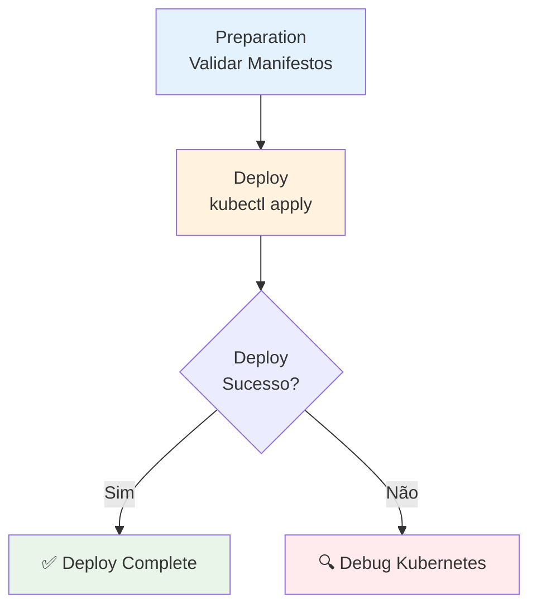

# Deploy de Manifestos Kubernetes via kubectl

Pipeline de CD para deploy de aplicações containerizadas em clusters Kubernetes usando manifestos YAML aplicados diretamente via `kubectl`.

## 🎯 Descrição

Este pipeline automatiza o deploy de aplicações containerizadas em clusters Kubernetes através de manifestos YAML, oferecendo suporte completo para múltiplos ambientes, substituição automática de versões de imagem e integração com ferramentas corporativas. O pipeline implementa as melhores práticas de CD com validação prévia, comparação de diferenças e diagnósticos automáticos em caso de falha.

O processo inclui preparação e validação de manifestos, comparação visual de mudanças via `kubectl diff`, execução de `kubectl apply` com validação prévia, e suporte a commit automático de manifestos atualizados. Oferece flexibilidade total para diferentes tipos de cluster (AKS com Managed Identity ou Kubeconfig genérico). Principais capacidades incluem versionamento automático de releases, substituição segura de tags de imagem via parâmetros, substituição de tokens em manifestos de Secret via Variable Group, coleta automática de diagnósticos em falha, e integração com Event Hub para rastreabilidade de deployments.

- [Pipeline utilizado para testes](https://dev.azure.com/telefonica-vivo-brasil/DevOps/_build?definitionId=45063)
- [Repositório de exemplo](https://dev.azure.com/telefonica-vivo-brasil/DevOps/_git/teste-deploy-kubectl)

## 🚀 Quick Start (5 minutos)

1. Crie os arquivos necessários no seu repositório (Veja [Dependências Externas](#-dependências-externas))
2. Crie `.azuredevops/azure-pipeline-cd.yml` na raiz
3. Cole o código de exemplo
4. Commit e push
5. ✅ Pipeline executa automaticamente!
6. Opcional: ajuste triggers e parâmetros

```yaml
# Deploy básico para AKS usando manifestos Kubernetes
# .azuredevops/azure-pipeline-cd.yml
resources:
  repositories:
    - repository: CodePlay
      name: DevOps/Vivo.CodePlay.Pipelines
      type: git
      ref: refs/heads/master
      endpoint: CodePlay

extends:
  template: /framework/pipelines/cd/deploy-kubectl/pipeline.yaml@CodePlay
  parameters:
    environment: dev
    version: getLatestVersion()
    manifestsPath:
      dev: infra/dev
      preprod: infra/preprod
      prod: infra/prod
```

**O que acontece com esta configuração:**

- 🔧 **Preparação**: Valida manifestos YAML e mostra diff visual das mudanças antes do deploy
- 🏷️ **Versionamento**: Obtém automaticamente a versão mais recente via `VersionManagerVivo@8`
- 🔑 **Autenticação**: Login no AKS via Managed Identity usando service connection `aks-{sigla}-brsouth-dev`
- 🖇️ **Substituição de Imagem**: Substitui automaticamente a tag de imagem pelos parâmetros `imageTagToken` e versão calculada
- 📋 **Deploy**: Executa `kubectl apply` com validação prévia (`--dry-run=client`)
- 🗂️ **Namespace**: Deploy realizado no namespace `{sigla}-dev`
- 📊 **Monitoramento**: Registra eventos de deploy no Event Hub para rastreabilidade
- 📝 **Commit Opcional**: Commit automático do manifesto atualizado se `enableManifestCommit=true`
- 🔄 **Diagnósticos**: Coleta automaticamente logs de pod, eventos e status de rollout em caso de falha

## 🏗️ Matriz de Capacidades

| Capacidade | Suporte | Descrição |
|------------|---------|-----------|
| [Trunk Based Development](https://dvps.redecorp.azr/portal/codeplay/capacidades/catalog/trunk-based-development) | ❎ | Pipeline de CD - não faz sentido habilitar essa capacidade |
| [Build Automatizado](https://dvps.redecorp.azr/portal/codeplay/capacidades/catalog/build-automatizado) | ❎ | Pipeline de CD - não faz sentido habilitar essa capacidade |
| [Testes Unitários](https://dvps.redecorp.azr/portal/codeplay/capacidades/catalog/testes-unitarios) | ❎ | Pipeline de CD - não faz sentido habilitar essa capacidade |
| [SAST](https://dvps.redecorp.azr/portal/codeplay/capacidades/catalog/sast) | ❎ | Pipeline de CD - não faz sentido habilitar essa capacidade |
| [SCA](https://dvps.redecorp.azr/portal/codeplay/capacidades/catalog/sca) | ❎ | Pipeline de CD - não faz sentido habilitar essa capacidade |
| [Gates de Segurança](https://dvps.redecorp.azr/portal/codeplay/capacidades/catalog/gates-de-seguranca) | ❎ | Pipeline de CD - não faz sentido habilitar essa capacidade |
| [Análise de Código](https://dvps.redecorp.azr/portal/codeplay/capacidades/catalog/analise-de-codigo) | ❎ | Pipeline de CD - não faz sentido habilitar essa capacidade |
| [Gates de Qualidade](https://dvps.redecorp.azr/portal/codeplay/capacidades/catalog/gate-de-qualidade) | ❎ | Pipeline de CD - não faz sentido habilitar essa capacidade |
| [Rollback de Upgrade](https://dvps.redecorp.azr/portal/codeplay/capacidades/catalog/rollback-de-upgrade) | ⚠️ | Suportado com limitações. Pipeline não implementa rollback automático, mas fornece diagnósticos em caso de falha para facilitar rollback manual via `kubectl rollout undo` |
| [Blue/Green Deployment](https://dvps.redecorp.azr/portal/codeplay/capacidades/catalog/blue-green-deployment) | ❌ | Não suportado. Para estratégias Blue/Green, utilize o pipeline `deploy-helm` com Argo Rollouts |
| [Canary Release](https://dvps.redecorp.azr/portal/codeplay/capacidades/catalog/canary-release) | ❌ | Não suportado. Estratégias de release gerenciadas via ferramentas como Flagger ou Argo Rollouts devem ser implementadas externamente |

**Legenda:**

- ✅ Suportado nativamente
- ❌ Não suportado
- ⚠️ Suportado com limitações ou condições
- 🚧 Planejado / Em Construção
- ❎ Não faz sentido habilitar essa capacidade

## 🔄 Estrutura do Pipeline

O pipeline é organizado em dois estágios principais: o estágio de `Preparation` (preparação e validação) e o estágio de `Deploy` (aplicação dos manifestos). O estágio Preparation sempre executa e realiza validações, consolidação de manifestos e comparação de diferenças. O estágio Deploy depende do sucesso do Preparation e executa o deploy efetivo via `kubectl apply`. Em caso de falha no Deploy, o pipeline executa automaticamente coleta de diagnósticos através de calls à custom task `K8sUtilsFromVivo@2` para facilitar troubleshooting e root cause analysis.



### Estágios do Pipeline

1. **🔍 Preparation - Validar Manifestos**
   - Valida existência do diretório de manifestos
   - Conta arquivos YAML encontrados
   - Substitui tags de imagem se `enableImageTagReplacement=true`
   - Se `usePlaceholdersSecretManifest=true`: cria cópia temporária do manifesto de Secret e substitui tokens via Variable Group
   - Consolida todos os manifestos em um único arquivo YAML (incluindo o Secret substituído, se habilitado)
   - Executa `kubectl diff` para mostrar mudanças antes do deploy (valores de Secret são mostrados como `[REDACTED]`)
   - Extrai imagens Docker referenciadas nos manifestos
   - Extrai URLs de acesso (se configuradas via annotations)
   - Resultado: Artifacts com manifestos consolidados prontos para deploy

2. **🚀 Deploy - Aplicar Manifestos**
   - Login no cluster Kubernetes (AKS ou via Kubeconfig)
   - Substituição final de tags de imagem
   - Se `usePlaceholdersSecretManifest=true`: substitui tokens no manifesto de Secret e aplica via `kubectl apply` (antes dos demais recursos)
   - Executa `kubectl apply` com validação prévia (`--dry-run=client`) nos manifestos principais
   - Aguarda rollout dos deployments (espera pods ficarem ready)
   - Registra evento de deploy no Event Hub
   - Resultado: Aplicação deployed no cluster

3. **🔍 Debug (em caso de falha)**
   - Login no cluster para diagnóstico
   - Executa debug automático via `K8sUtilsFromVivo@2` (logs, eventos)
   - Resultado: Informações de diagnóstico para troubleshooting

## ⚙️ Parâmetros Disponíveis

### Configuração Básica

#### `environment`

- **nome**: environment
- **tipo**: string
- **default**: "dev"
- **descrição**: Ambiente para deploy. Usado como sufixo em service connections, namespaces e nomes de recursos. Valores válidos: `dev`, `preprod`, `prod`. O ambiente é propagado em todas as lookups de valores por ambiente (manifestsPath, aksServiceConnection, etc.)
- **dependências**: Nenhuma.

#### `version`

- **nome**: version
- **tipo**: string
- **default**: "getLatestVersion()"
- **descrição**: Versão da aplicação para deploy. Aceita versão explícita (ex: `1.2.3`) ou função `getLatestVersion()` para obter automaticamente a última versão gerada pelo CI. A versão é utilizada para substituir a tag de imagem e para nomeação da build.
- **dependências**: Nenhuma.

#### `agentPool`

- **nome**: agentPool
- **tipo**: string
- **default**: "GeneralPurposeLinuxAgentsCD"
- **descrição**: Pool de agentes para execução do pipeline. Deve ser um pool Linux com Docker e kubectl instalados. Este parâmetro afeta onde o pipeline executa e quais ferramentas estão disponíveis.
- **dependências**: Pool deve ter acesso a: kubectl, git, bash, e rede para AKS/clusters Kubernetes.

#### `branchingStrategy`

- **nome**: branchingStrategy
- **tipo**: string
- **default**: `trunkbased`
- **valores válidos**: `trunkbased`, `vivoflow`, `releaseflow`, `gitlabflow`, `gitlabflow-semantic`, `custom`
- **descrição**: Estratégia de versionamento usada pelo `VersionManagerVivo@8` para interpretar a versão da aplicação durante o deploy. Deve corresponder à mesma estratégia configurada no pipeline de CI que gerou a versão. Quando `version` é definida como `getLatestVersion()`, a estratégia correta é necessária para localizar a última versão publicada no branch correto.
- **dependências**: Nenhuma. O valor deve ser consistente com a estratégia usada no pipeline de CI correspondente.

### Configuração dos Manifestos Kubernetes

#### `manifestsPath`

- **nome**: manifestsPath
- **tipo**: object
- **default**: `{'dev': 'infra/dev', 'preprod': 'infra/preprod', 'prod': 'infra/prod'}`
- **descrição**: Mapeia cada ambiente para o diretório contendo os manifestos YAML. Por exemplo, ao deploying para `dev`, o pipeline procurará arquivos YAML em `infra/dev/`. Cada diretório pode conter múltiplos arquivos `.yaml` ou `.yml`.
- **validação**: O valor para o ambiente selecionado é obrigatório, deve ser um caminho relativo dentro do repositório e não pode apontar para a raiz do repo nem conter `..`. Se estiver vazio, inválido ou ausente para o ambiente selecionado, o pipeline falha antes de consolidar/aplicar manifestos.
- **dependências**: Nenhuma.

### Substituição de Imagem/Versão

#### `enableImageTagReplacement`

- **nome**: enableImageTagReplacement
- **tipo**: boolean
- **default**: `true`
- **descrição**: Habilita substituição automática de tag de imagem nos manifestos. Quando ativo, busca ocorrências de `imageTagToken` (padrão: `__VERSION__`) e substitui pela versão calculada. Útil quando seu manifesto contém um placeholder que deve ser substituído pela versão real durante o deploy.
- **dependências**: Requer que `imageTagToken` seja definido e presente nos manifestos.

#### `imageTagToken`

- **nome**: imageTagToken
- **tipo**: string
- **default**: ''
- **descrição**: Token (placeholder) a ser substituído pela versão durante deploy. Por exemplo, se seus manifestos contêm `image: myapp:__VERSION__`, este token será substituído pela versão real (ex: `image: myapp:1.2.3`). Customize este valor conforme o placeholder usado em seus manifestos. ⚠️ **Importante:** Este parâmetro deve ser configurado explicitamente para ativar a substituição de imagem. Para segurança, considere usar Variable Groups ou KeyVault em produção.
- **dependências**: Requer `enableImageTagReplacement=true` para ter efeito.

### Substituição de Tokens em Manifesto de Secret

Permite manter um manifesto de Secret no repositório com tokens/placeholders (ex: `$(DB_PASSWORD)`) que são substituídos em runtime a partir de um Variable Group. A substituição é feita em um arquivo temporário — o arquivo original no repositório nunca é modificado, evitando commit acidental de valores sensíveis.

A substituição ocorre em ambos os estágios do pipeline:

- **Preparation**: o Secret substituído é incluído no manifesto consolidado para que o `kubectl diff` mostre o que vai mudar no cluster. Os valores reais são redatados automaticamente pelo `debug-k8s-manifests` (`[REDACTED]`).
- **Deploy**: o Secret é aplicado via `kubectl apply` **antes** dos manifestos principais, garantindo que o Secret exista quando outros recursos (Deployments, etc.) forem criados.

:::warning
**ATENÇÃO:** Esta funcionalidade é contra-indicada para configurações gerais. Use [Azure Key Vault](https://wikicorp.telefonica.com.br/spaces/AC/pages/495251243/Azure+Key+Vault+-+Autenticação+via+service+principal) quando possível. Reserve esta funcionalidade para cenários onde o Secret precisa ser gerenciado diretamente via manifesto.
:::

#### `usePlaceholdersSecretManifest`

- **nome**: usePlaceholdersSecretManifest
- **tipo**: boolean
- **default**: `false`
- **descrição**: Habilita substituição de tokens em manifesto de Secret. Quando ativo, o pipeline lê o arquivo definido em `placeholdersSecretManifestFile`, cria uma cópia temporária, substitui os tokens usando a task `replacetokens@6` e aplica o resultado via `kubectl apply` antes dos manifestos principais.
- **dependências**: Recomendado definir `placeholderVariableGroupName` com o Variable Group que contém os valores dos tokens.

#### `placeholdersSecretManifestFile`

- **nome**: placeholdersSecretManifestFile
- **tipo**: object
- **default**:

  ```yaml
  dev: .azuredevops/config/dev/secret.yaml
  preprod: .azuredevops/config/preprod/secret.yaml
  prod: .azuredevops/config/prod/secret.yaml
  ```

- **descrição**: Mapeia cada ambiente para o caminho do manifesto de Secret com tokens. O arquivo deve ser um manifesto Kubernetes válido (`kind: Secret`) contendo tokens no formato configurado por `placeholderPrefix` e `placeholderSuffix`. Caminho relativo à raiz do repositório.
- **dependências**: `usePlaceholdersSecretManifest=true`. Arquivo deve existir no repositório.

#### `placeholderVariableGroupName`

- **nome**: placeholderVariableGroupName
- **tipo**: string
- **default**: `''`
- **descrição**: Nome do Variable Group que contém os valores dos tokens a serem substituídos no manifesto de Secret. O grupo é carregado condicionalmente nas variáveis do pipeline apenas quando este parâmetro for informado. O nome de cada variável no grupo deve corresponder ao nome do token no manifesto (ex: variável `DB_PASSWORD` substitui o token `$(DB_PASSWORD)`).
- **dependências**: O Variable Group deve existir na organização Azure DevOps e o pipeline deve ter permissão de acesso. Quando não informado (`''`), nenhum Variable Group é carregado — útil quando os valores já estão disponíveis como variáveis de pipeline.

#### `placeholderPrefix`

- **nome**: placeholderPrefix
- **tipo**: string
- **default**: `$(`
- **descrição**: Prefixo do padrão de token usado pela task `replacetokens@6` para identificar tokens a serem substituídos. O padrão padrão `$(TOKEN)` é o mesmo utilizado pelo pipeline `deploy-helm`.
- **dependências**: `usePlaceholdersSecretManifest=true`.

#### `placeholderSuffix`

- **nome**: placeholderSuffix
- **tipo**: string
- **default**: `)`
- **descrição**: Sufixo do padrão de token usado pela task `replacetokens@6`. O padrão padrão `$(TOKEN)` é o mesmo utilizado pelo pipeline `deploy-helm`.
- **dependências**: `usePlaceholdersSecretManifest=true`.

### Commit do Manifesto Atualizado

#### `enableManifestCommit`

- **nome**: enableManifestCommit
- **tipo**: boolean
- **default**: `true`
- **descrição**: Habilita commit automático do manifesto com versão atualizada. Quando ativo, após deploy bem-sucedido, o pipeline fará commit dos manifestos atualizados no branch atual do repositório com mensagem configurável. Útil para manter histórico de quais versões foram deployadas.
- **dependências**: Requer que o repositório tenha permissão de escrita e `System.AccessToken` com privilégios suficientes.

#### `manifestCommitMessage`

- **nome**: manifestCommitMessage
- **tipo**: string
- **default**: `[skip ci] Update manifest with new version`
- **descrição**: Mensagem do commit que será criado quando `enableManifestCommit=true`. A versão será automaticamente adicionada ao final da mensagem. Use `[skip ci]` para evitar disparo automático de novo CI.
- **dependências**: Requer `enableManifestCommit=true`.

### Configuração AKS (Azure Kubernetes Service)

#### `useAKSManagedIdentity`

- **nome**: useAKSManagedIdentity
- **tipo**: boolean
- **default**: `true`
- **descrição**: Habilita autenticação no AKS via Managed Identity e Azure Resource Manager. Quando ativo, usa service connection Azure para obter credenciais de acesso ao cluster. Defina como `false` se estiver usando Kubeconfig genérico.
- **dependências**: Requer service connection Azure válida em `aksServiceConnection`.

#### `aksServiceConnection`

- **nome**: aksServiceConnection
- **tipo**: object
- **default**: `{ dev: aks-$(SIGLA)-brsouth-dev, preprod: aks-$(SIGLA)-brsouth-preprod, prod: aks-$(SIGLA)-brsouth-prod }`
- **descrição**: Mapeia cada ambiente para sua service connection Azure correspondente. A service connection é usada para autenticação no AKS quando `useAKSManagedIdentity=true`. Os nomes padrão seguem padrão corporativo com `$(SIGLA)` derivado do nome do Team Project.
- **dependências**: Requer `useAKSManagedIdentity=true`. Service connection deve ter permissões no resource group do AKS.

#### `aksResourceGroup`

- **nome**: aksResourceGroup
- **tipo**: object
- **default**: `{ dev: rg-aks-$(SIGLA)-brsouth-dev, preprod: rg-aks-$(SIGLA)-brsouth-preprod, prod: rg-aks-$(SIGLA)-brsouth-prod }`
- **descrição**: Mapeia cada ambiente para seu Azure Resource Group correspondente. Usado para localizar e acessar o cluster AKS quando `useAKSManagedIdentity=true`.
- **dependências**: Requer `useAKSManagedIdentity=true`.

#### `aksClusterName`

- **nome**: aksClusterName
- **tipo**: object
- **default**: `{ dev: aks-$(SIGLA)-brsouth-dev, preprod: aks-$(SIGLA)-brsouth-preprod, prod: aks-$(SIGLA)-brsouth-prod }`
- **descrição**: Mapeia cada ambiente para o nome do cluster AKS correspondente. Usado para conectar ao cluster e executar operações kubectl quando `useAKSManagedIdentity=true`.
- **dependências**: Requer `useAKSManagedIdentity=true`.

### Configuração Kubeconfig (Service Connection)

#### `useKubeconfig`

- **nome**: useKubeconfig
- **tipo**: boolean
- **default**: `false`
- **descrição**: Habilita autenticação via Kubeconfig armazenado em service connection Kubernetes. Quando ativo, usa service connection Kubernetes genérico ao invés de AKS Managed Identity. Defina como `true` se estiver usando clusters Kubernetes não-Azure ou genéricos.
- **dependências**: Requer service connection Kubernetes válida em `kubeconfigServiceConnection`.

#### `kubeconfigServiceConnection`

- **nome**: kubeconfigServiceConnection
- **tipo**: object
- **default**: `{'dev': '$(SIGLA)-dev', 'preprod': '$(SIGLA)-preprod', 'prod': '$(SIGLA)-prod'}`
- **descrição**: Mapeia cada ambiente para sua service connection Kubernetes correspondente. A service connection deve conter um kubeconfig válido para acesso ao cluster. Usado quando `useKubeconfig=true`.
- **dependências**: Requer `useKubeconfig=true`. Service connection deve do tipo "Kubernetes Service Connection".

### Configuração de Secret Docker (clusters on-premise)

> Disponível apenas quando `useKubeconfig=true`. AKS com Managed Identity já possui integração nativa com o ACR e não necessita desta configuração.

Quando a aplicação está em um cluster on-premise (sem Managed Identity), o Kubernetes precisa de credenciais explícitas para fazer pull de imagens privadas. O parâmetro `createDockerConfigSecret` instrui o pipeline a criar um `kubernetes.io/dockerconfigjson` Secret no namespace de destino, utilizando credenciais obtidas do Azure Key Vault compartilhado (`kv-azdevops-shared`).

O Secret é criado (ou atualizado) durante os estágios de **Preparation** e **Deploy**, garantindo que as credenciais estejam disponíveis antes de qualquer operação.

#### `createDockerConfigSecret`

- **nome**: createDockerConfigSecret
- **tipo**: string
- **default**: `none`
- **valores válidos**:
  | Valor | Comportamento |
  |-------|---------------|
  | `none` | Não cria o secret. Use quando o secret já existe no cluster ou quando o AKS usa Managed Identity |
  | `nexus` | Cria secret apontando para o Nexus Docker Registry corporativo |
  | `acr` | Cria secret apontando para o Azure Container Registry (ACR) |
- **dependências**: Use quando `useKubeconfig = true` ou o cluster não possui Managed Identity. As credenciais `DOCKER-REGISTRY-USERNAME` e `DOCKER-REGISTRY-PASSWORD` são obtidas automaticamente do Key Vault `kv-azdevops-shared`.

#### `dockerRegistryACR`

- **nome**: dockerRegistryACR
- **tipo**: string
- **default**: `acrsharedservices01.azurecr.io`
- **descrição**: URL do Azure Container Registry usado como servidor de autenticação quando `createDockerConfigSecret=acr`. O valor é referenciado no campo `server` do `dockerconfigjson`.
- **dependências**: `createDockerConfigSecret = acr`.

#### `dockerRegistryNexus`

- **nome**: dockerRegistryNexus
- **tipo**: string
- **default**: `vcr-docker.nexus.telefonica.com.br`
- **descrição**: URL do Nexus Docker Registry corporativo usado como servidor de autenticação quando `createDockerConfigSecret=nexus`.
- **dependências**: `createDockerConfigSecret = nexus`.

#### `dockerRegistryEmail`

- **nome**: dockerRegistryEmail
- **tipo**: string
- **default**: `arquiteturati@telefonica.com.br`
- **descrição**: Endereço de e-mail associado às credenciais do Docker Registry. Utilizado na criação do `dockerconfigjson`. Normalmente não precisa ser alterado.
- **dependências**: `createDockerConfigSecret != none`.

### Kubernetes Namespace

#### `k8sNamespace`

- **nome**: k8sNamespace
- **tipo**: object
- **default**: `{'dev': '$(SIGLA)-dev', 'preprod': '$(SIGLA)-preprod', 'prod': '$(SIGLA)-prod'}`
- **descrição**: Mapeia cada ambiente para seu namespace Kubernetes correspondente. O namespace é usado em todas as operações kubectl (login, diff, apply). Padrão corporativo usa `{sigla}-{ambiente}`.
- **dependências**: Nenhuma.

### Dry-Run (Simulação do Deploy)

#### `enableDryRun`

- **nome**: enableDryRun
- **tipo**: boolean
- **default**: `false`
- **descrição**: Executa o pipeline em modo simulado, sem aplicar mudanças reais no cluster. Quando ativo, o `kubectl apply` é executado com `--dry-run=server` (com fallback para `--dry-run=client` se o cluster não suportar server-side), o aguardo de rollout é ignorado, o commit automático de manifestos é suprimido e o registro no Event Hub é ignorado. Útil para validar manifestos e configurações antes de um deploy real.
- **dependências**: Nenhuma.

## 🔧 Dependências Externas

### Service Connections Necessárias

#### 1. Azure Resource Manager (para AKS)

- **Nome padrão**: `aks-{sigla}-brsouth-{environment}`
- **Tipo**: Azure Resource Manager
- **Uso**: Autenticação no AKS para executar operações kubectl
- **Ativação**: Quando `useAKSManagedIdentity=true` (padrão)
- **Permissões necessárias**:
  - Acesso ao Resource Group do AKS
  - Permissão para listar e acessar clusters Kubernetes
  - Permissão para obter credenciais de acesso (kubeconfig)
- **Configurável via**: Parâmetro `aksServiceConnection`

#### 2. Kubernetes Service Connection (para Kubeconfig)

- **Nome padrão**: `{sigla}-{environment}`
- **Tipo**: Kubernetes Service Connection
- **Uso**: Autenticação em clusters Kubernetes genéricos via kubeconfig
- **Ativação**: Quando `useKubeconfig=true`
- **Permissões necessárias**:
  - Kubeconfig válido com acesso ao cluster
  - Permissões RBAC para criar/atualizar recursos no namespace
- **Configurável via**: Parâmetro `kubeconfigServiceConnection`

#### 3. Event Hub (para Rastreabilidade)

- **Nome padrão**: `EVHCodeProd`
- **Tipo**: Service Connection para Event Hub
- **Uso**: Registro de eventos de deploy para auditoria e rastreabilidade
- **Ativação**: Sempre (integração obrigatória em CD)
- **Permissões necessárias**:
  - Permissão para enviar mensagens ao Event Hub
  - Namespace e chave de acesso configurados
- **Observação**: Este registro é obrigatório conforme políticas do CodePlay Framework

### Agent Pool Requirements

#### Pool de Agentes

- **Pool padrão**: `GeneralPurposeLinuxAgentsCD`
- **Sistema Operacional**: Linux
- **Ferramentas obrigatórias**:
  - `kubectl` (v1.19+) - para operações Kubernetes
  - `git` - para checkout e possível commit de manifestos
  - `bash` - para scripts de validação e consolidação
  - `sed` - para substituição de tags de imagem
  - Acesso a `System.AccessToken` para commits (quando `enableManifestCommit=true`)
- **Acesso de rede**:
  - Acesso ao Azure Container Registry (se pulling private images)
  - Acesso ao cluster Kubernetes (AKS ou on-premises via VPN)
  - Acesso ao Event Hub corporativo

### Arquivos Obrigatórios no Repositório

#### 1. Manifestos Kubernetes (YAML)

- **Localização padrão**: `infra/dev/`, `infra/preprod/`, `infra/prod/` (configurável via `manifestsPath`)
- **Configurável via**: Parâmetro `manifestsPath`
- **Requisitos**:
  - Sintaxe YAML válida
  - Recursos Kubernetes válidos (Deployment, Service, ConfigMap, etc.)
  - Se usando substituição de imagem: conter placeholder `__VERSION__` ou customizado em `imageTagToken`
- **Comportamento**: Se diretório não existir, o pipeline falhará com erro claro indicando o caminho procurado.

**Exemplo de estrutura de manifestos:**

```
infra/
├── dev/
│   ├── deployment.yaml
│   ├── service.yaml
│   └── configmap.yaml
├── preprod/
│   └── ...
└── prod/
    └── ...
```

**Exemplo de manifesto com placeholder:**

```yaml
apiVersion: apps/v1
kind: Deployment
metadata:
  name: myapp
  namespace: myapp-dev
spec:
  template:
    spec:
      containers:
      - name: app
        image: myregistry.azurecr.io/myapp:__VERSION__  # ← Será substituído
```

### Integrações Externas

#### 1. Event Hub (Rastreabilidade de Deploy)

- **Descrição**: Registro automático de todos os deployments para auditoria e análise
- **Requisitos**:
  - Connection string válida do Event Hub corporativo
  - Namespace `CodePlay` configurado
  - Tópico para receber mensagens de deploy
- **Informações registradas**:
  - Versão deployada
  - Ambiente e namespace
  - Cluster Kubernetes
  - URLs de acesso
  - Timestamp do deploy
  - Método de deploy (kubectl)
- **Observação**: Integração obrigatória conforme políticas do CodePlay Framework. Falha nesta integração não bloqueia o deploy.

### Permissões de Repositório Git

- **Permissão de escrita** no repositório Git (necessária quando `enableManifestCommit=true`)
- **Capacidade de criar commits** e fazer push
- **Checkout com `persistCredentials: true`** (configurado automaticamente quando manifests commit está habilitado)
- **Configuração automática**: O pipeline configura git com usuário `azure-pipelines@vivo.com.br` para commits automáticos

### Variáveis de Sistema Necessárias

| Variável | Origem | Uso |
|----------|--------|-----|
| `System.TeamProject` | Azure DevOps | Derivar SIGLA do projeto para valores padrão |
| `System.AccessToken` | Azure DevOps | Autenticação para commit (quando `enableManifestCommit=true`) |
| `Build.SourcesDirectory` | Azure DevOps | Localização dos sources para checkout e manifestos |
| `Build.SourceBranchName` | Azure DevOps | Branch para commit quando `enableManifestCommit=true` |
| `Agent.TempDirectory` | Azure DevOps | Diretório temporário para arquivos consolidados |

### Dependências de Custom Tasks

O pipeline utiliza as seguintes custom tasks do CodePlay Framework:

- `VersionManagerVivo@8` - Gerenciamento de versão semântica e cálculo de deploy version
- `K8sUtilsFromVivo@2` - Utilitários Kubernetes (validação, diff, apply, debug)
- `VivoEventHubTools@2` - Registro de deploy no Event Hub para rastreabilidade (obrigatório)
- `VivoUtilsFromVivo@1` - Utilitários gerais (show parameters, environment validation, tags)


## 🚀 Exemplos de Uso

### Comportamento Padrão - Configuração Básica

```yaml
# .azuredevops/azure-pipeline-cd.yml
resources:
  repositories:
    - repository: CodePlay
      name: DevOps/Vivo.CodePlay.Pipelines
      type: git
      ref: refs/heads/master
      endpoint: CodePlay

extends:
  template: /framework/pipelines/cd/deploy-kubectl/pipeline.yaml@CodePlay
```

**Comportamento esperado:**
- Deploy em `dev`
- Manifestos em `infra/dev/`
- Substituição de `__VERSION__` pela versão calculada
- Namespace padrão `$(SIGLA)-dev`

### Deploy em Cluster On-Premise com Pull Secret (Nexus)

Para clusters sem Managed Identity, use `createDockerConfigSecret` para criar automaticamente as credenciais de pull de imagem.

```yaml
# .azuredevops/azure-pipeline-cd.yml
resources:
  repositories:
    - repository: CodePlay
      name: DevOps/Vivo.CodePlay.Pipelines
      type: git
      ref: refs/heads/master
      endpoint: CodePlay

extends:
  template: /framework/pipelines/cd/deploy-kubectl/pipeline.yaml@CodePlay
  parameters:
    environment: dev
    useKubeconfig: true
    kubeconfigServiceConnection:
      dev: meu-cluster-dev
    createDockerConfigSecret: nexus   # cria imagePullSecret para Nexus
```

**Comportamento esperado:**
- Secret `nexus` do tipo `kubernetes.io/dockerconfigjson` criado (ou atualizado) no namespace antes do deploy
- Credenciais obtidas automaticamente do Key Vault `kv-azdevops-shared`
- Adicione `imagePullSecrets` no manifest do Deployment (ver seção [Como usar o Secret nos manifests Kubernetes](#cenário-4-usando-o-secret-de-pull-de-imagem-nos-manifestos-kubernetes)) para referenciar o secret criado


## 🎨 Comportamentos Customizados

:::danger
**⚠️ ATENÇÃO: CUSTOMIZAÇÕES REQUEREM RESPONSABILIDADE ⚠️**

- ✅ **Use os exemplos como ponto de partida** - Eles demonstram padrões seguros e testados
- 🧠 **"Todos somos adultos"** - Confiamos na sua expertise, mas exigimos consciência do impacto
- 📝 **Tudo fica registrado** - Seu histórico de commits é auditável e rastreável
- 🎯 **Entenda antes de modificar** - Customizações incorretas podem quebrar deploys em produção
- 🤝 **Documente suas decisões** - Facilite a manutenção futura por outros membros da equipe

**Customizar é permitido. Fazer sem entender não é.**
:::

### Cenário 1: Substituição de Tags com KeyVault

Para maior segurança, use Variable Group ou KeyVault para o token:

```yaml
# .azuredevops/azure-pipeline-cd.yml
resources:
  repositories:
    - repository: CodePlay
      name: DevOps/Vivo.CodePlay.Pipelines
      type: git
      ref: refs/heads/master
      endpoint: CodePlay

variables:
  - group: my-keyvault-variable-group  # Contém IMAGE_TAG_TOKEN

extends:
  template: /framework/pipelines/cd/deploy-kubectl/pipeline.yaml@CodePlay
  parameters:
    environment: prod
    version: getLatestVersion()
    enableImageTagReplacement: true
    imageTagToken: $(IMAGE_TAG_TOKEN)  # Referência segura
```

### Cenário 2: Estrutura Customizada de Manifestos

Use diferentes estruturas de diretórios conforme sua organização:

```yaml
# .azuredevops/azure-pipeline-cd.yml
extends:
  template: /framework/pipelines/cd/deploy-kubectl/pipeline.yaml@CodePlay
  parameters:
    environment: dev
    version: getLatestVersion()
    manifestsPath:
      dev: kubernetes/dev
      preprod: kubernetes/staging
      prod: kubernetes/production
```

### Cenário 3: Substituição de Tokens em Secret

:::warning
**ATENÇÃO:** Esta funcionalidade é contra-indicada para configurações gerais. Use [Azure Key Vault](https://wikicorp.telefonica.com.br/spaces/AC/pages/495251243/Azure+Key+Vault+-+Autenticação+via+service+principal) quando possível. Reserve esta funcionalidade para cenários onde o Secret precisa ser gerenciado diretamente via manifesto.
:::


Deploy que lê valores sensíveis de um Variable Group e os injeta em um manifesto de Secret antes do apply:

```yaml
# .azuredevops/azure-pipeline-cd.yml
resources:
  repositories:
    - repository: CodePlay
      name: DevOps/Vivo.CodePlay.Pipelines
      type: git
      ref: refs/heads/master
      endpoint: CodePlay

extends:
  template: /framework/pipelines/cd/deploy-kubectl/pipeline.yaml@CodePlay
  parameters:
    environment: dev
    version: getLatestVersion()
    manifestsPath:
      dev: infra/dev
      preprod: infra/preprod
      prod: infra/prod
    usePlaceholdersSecretManifest: true
    placeholderVariableGroupName: 'vg-myapp-secrets-dev'
    placeholdersSecretManifestFile:
      dev: infra/dev/secret.yaml
      preprod: infra/preprod/secret.yaml
      prod: infra/prod/secret.yaml
```

**O que acontece:**

- 📋 Tokens como `$(DB_PASSWORD)` no arquivo `infra/dev/secret.yaml` são substituídos pelos valores do Variable Group `vg-myapp-secrets-dev`
- 🔒 A substituição é feita em arquivo temporário — o repositório não é modificado
- 🔍 No stage Preparation, o `kubectl diff` inclui o Secret com valores `[REDACTED]`
- 🚀 No stage Deploy, o Secret é aplicado primeiro, antes dos demais manifestos de `manifestsPath`

**Exemplo de manifesto `infra/dev/secret.yaml`:**

```yaml
apiVersion: v1
kind: Secret
metadata:
  name: myapp-secrets
  namespace: myapp-dev
type: Opaque
stringData:
  DB_PASSWORD: "$(DB_PASSWORD)"
  API_KEY: "$(API_KEY)"
```

**Exemplo de Variable Group `vg-myapp-secrets-dev`:**

| Variável      | Valor      |
|---------------|------------|
| `DB_PASSWORD` | `(secret)` |
| `API_KEY`     | `(secret)` |

> **Prefixo/Sufixo customizado:** Para usar outros delimitadores (ex: `#{TOKEN}#` ou `__TOKEN__`), configure `placeholderPrefix` e `placeholderSuffix` conforme necessário.

### Cenário 4: Usando o Secret de Pull de Imagem nos Manifestos Kubernetes

O pipeline cria automaticamente o Secret no namespace de destino, mas você precisa referenciar o secret em cada recurso que faz pull de imagem privada (`Deployment`, `StatefulSet`, `DaemonSet`, `Pod`, etc.). O nome do secret gerado corresponde ao valor de `createDockerConfigSecret` (`nexus` ou `acr`).

**Adicione `imagePullSecrets` na spec do Pod:**

```yaml
# deployment.yaml
apiVersion: apps/v1
kind: Deployment
metadata:
  name: minha-app
spec:
  template:
    spec:
      imagePullSecrets:
        - name: nexus   # use "acr" se createDockerConfigSecret=acr
      containers:
        - name: minha-app
          image: vcr-docker.nexus.telefonica.com.br/minha-sigla/minha-app:1.0.0
```

O campo `imagePullSecrets` deve estar no mesmo nível de `containers`, dentro de `spec` do **Pod template**:

```yaml
spec:               # <-- spec do Deployment/StatefulSet
  template:
    spec:           # <-- spec do Pod
      imagePullSecrets:
        - name: nexus
      containers: [...]
```

> **Atenção:** sem `imagePullSecrets` no manifest, o Pod falhará com `ImagePullBackOff`. Para confirmar o nome exato do secret criado pela task, execute `kubectl get secret -n <namespace>` após o primeiro deploy ou verifique o output da task no log do pipeline.


## 🔖 Variáveis de Ambiente

As seguintes variáveis de ambiente são automaticamente configuradas pelo pipeline:

| Variável           | Descrição                                   | Valor Padrão                                                |
|--------------------|---------------------------------------------|-------------------------------------------------------------|
| `SIGLA`            | Sigla do projeto extraída do Team Project   | `$[ lower(split(variables['System.TeamProject'],' ')[0]) ]` |
| `ENVIRONMENT`      | Ambiente configurado pelo parâmetro         | Valor do parâmetro `environment`                            |
| `MANIFESTS_PATH`   | Caminho completo aos manifestos             | `$(Build.SourcesDirectory)/{manifestsPath[environment]}`    |
| `MANIFESTS_FILE`   | Arquivo consolidado com todos os manifestos | `$(Agent.TempDirectory)/manifests.yaml`                     |
| `K8S_IMAGES`       | Lista de imagens Docker referenciadas       | Extraído pela custom task `K8sUtilsFromVivo@3`              |
| `K8S_APP_URL_LIST` | Lista de URLs de acesso extraídas           | Extraído pela custom task `K8sUtilsFromVivo@3`              |
| `DRY_RUN_LABEL`    | Rótulo opcional exibido nas tasks quando `enableDryRun=true` — útil para identificação visual em logs/UI | `''` (vazio) — se `enableDryRun=true` pode ser `[DRY RUN ATIVADO]` |


## ❓ FAQ

### Onde posso encontrar mais informações sobre o CodePlay Framework?

Você pode encontrar mais informações sobre o CodePlay Framework na [documentação oficial](https://dvps.redecorp.azr/portal/codeplay/framework/).

### Onde encontro as capacidades disponíveis?

As capacidades disponíveis podem ser encontradas no [Catálogo de Capacidade](https://dvps.redecorp.azr/portal/catalog/capabilities) no Portal CodePlay.

### Como faço para customizar o pipeline?

Siga o guia de [Adoção ao CodePlay](https://dvps.redecorp.azr/portal/codeplay/roteiro/codeplay#fluxo-de-adoção-ao-codeplay).

### Quais casos de uso relevantes?

- [Integrando CI/CD](https://dvps.redecorp.azr/portal/code/casos-de-uso/integrando-cicd)
- [Deploy em Kubernetes](https://dvps.redecorp.azr/portal/code/casos-de-uso/deploy-kubernetes)
- Veja o [Catálogo de Casos de Uso](https://dvps.redecorp.azr/portal/catalog/casos-de-uso) para outros exemplos de casos de uso.

### Quais Erros Comuns relevantes?

- Ainda não temos nenhum erro comum documentado para este pipeline.
- Veja o [Catálogo de Erros Conhecidos](https://dvps.redecorp.azr/portal/catalog/erros-conhecidos) para outros exemplos de erros.

## 🆘 Suporte

- [Abra um chamado para Dev Support](https://dvps.redecorp.azr/portal/codeplay/roteiro/#:~:text=Abra%20um%20chamado%20para%20Dev%20Support)
- [Canal DevEx - Azure DevOps](https://teams.microsoft.com/l/channel/19%3A8fbd00946cf044d7a844182ac71e6aa1%40thread.tacv2/Azure%20DevOps?groupId=038b4415-d6dd-42ce-92e5-31a8e2a13bf8&tenantId=9744600e-3e04-492e-baa1-25ec245c6f10)

## 📝 Decisões Tomadas

### Decisão 1: Usar kubectl apply em vez de Helm

- **Data**: 2026-02-18
- **Motivador**: Fornecer opção simples para deployments sem necessidade de Helm charts
- **Forum Envolvido**: Arquitetura CodePlay Framework
- **Descrição**: O pipeline `deploy-kubectl` foi criado como alternativa ao `deploy-helm` para cenários onde manifestos Kubernetes simples são suficientes. Helm é mais poderoso mas requer overhead de chart management. kubectl permite deploy direto de manifestos YAML com validação prévia e diff visual, cobrindo 80% dos casos de uso. Usuários com necessidades avançadas (Blue/Green, Canary) devem usar `deploy-helm`.
