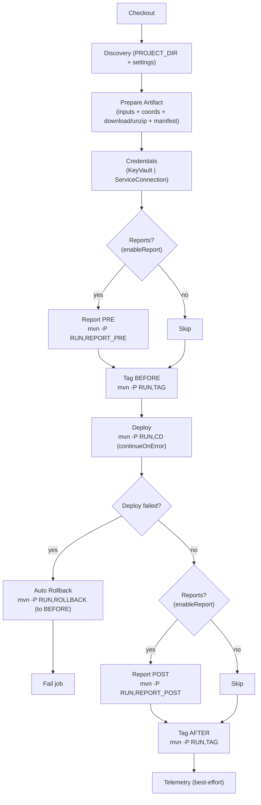
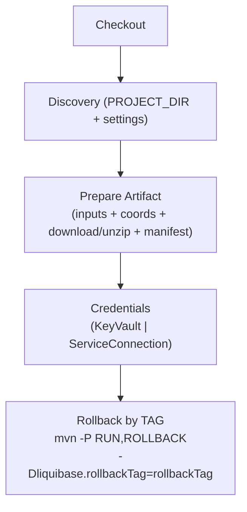

# Deploy Liquibase Project

## 🎯 Descrição

Pipeline corporativa de **CD** para executar **deploy** ou **rollback** de alterações em bancos de dados por meio de pacotes Liquibase publicados no **Azure Artifacts**.

Este pipeline consome pacotes Maven gerados pelo pipeline de CI e aplica mudanças no banco de dados do ambiente especificado (dev, test, prod, etc.). O processo inclui validação prévia, criação automática de tags, execução controlada de deployment e **auto-rollback** em caso de falha.

Se você está buscando informações sobre como estruturar changelogs Liquibase, acesse [a documentação oficial do Liquibase](https://docs.liquibase.com/concepts/changelogs/home.html).

- [Pipeline utilizado para testes](https://dev.azure.com/telefonica-vivo-brasil/DevOps/_build?definitionId=45067)
- [Repositório de exemplo](https://dev.azure.com/telefonica-vivo-brasil/DevOps/_git/teste-deploy-liquibase)


---

## ✅ O que esta pipeline faz (alto nível)

1) **Discovery/Settings**: resolve `settings.xml` e falha se não existir (via *prepare-artifact*).
2) **Context**: imprime contexto de execução (parâmetros e variáveis relevantes).
3) **Validation**: valida inputs obrigatórios (`version`, `rollbackTag` quando rollback).
4) **Coordinates**: resolve coordenadas Maven `groupId:artifactId:version:zip:bundle`.
5) **Download + Unzip**: baixa ZIP via `dependency:copy`, unzip e resolve `DEPLOY_PROJECT_DIR` + `PACKAGE_POM_FILE` (via `*/meta/manifest.json`).
6) **Manifest**: lê `meta/manifest.json` e exporta `RESOLVED_VENDOR`, `CHANGELOG_FILE`, perfis e tags.
7) **Credentials**: resolve `DATABASE_URL/USERNAME/PASSWORD` via **KeyVault** ou **ServiceConnection** (fail-fast).
8) **Deploy flow**: (opcional report-pre) + tag before + deploy (com `continueOnError`) + **auto-rollback** se falhar + (opcional report-post) + tag after.
9) **Rollback flow**: rollback por TAG informada.

---

## 🚀 Quick Start (5 minutos)

### 🏃 Execução mínima (deploy com Key Vault)

> Configure `credentialMode`, `secretEnvironment`, `keyVaultName` e flags de runtime no `.azuredevops/db-config.yaml`. O parâmetro `azureSubscription` permanece no template porque o Azure DevOps valida a autorização do `AzureKeyVault@2` antes das variáveis runtime `LQ_*` existirem.

```yaml
extends:
  template: /framework/pipelines/cd/deploy-liquibase/pipeline.yaml@VivoCodePlayPipelines
  parameters:
    projectDir: 'deploy-liquibase'
    operation: 'deploy'
    rollbackTag: ''
    version: '10.5.46'
    environment: 'dev'
    agentPool: GeneralPurposeLinuxAgentsCD
    azureSubscription: DevOpsSharedResources
    serviceConnectionName: ''
```

### 🏃 Execução mínima (deploy com Service Connection Generic)

> Configure `credentialMode=serviceConnection` no `.azuredevops/db-config.yaml` e passe `serviceConnectionName` como parâmetro literal/autorizado do template. O `azureSubscription` continua obrigatório pelo contrato do template, mas não é usado para resolver credenciais quando o modo efetivo é `serviceConnection`.

```yaml
extends:
  template: /framework/pipelines/cd/deploy-liquibase/pipeline.yaml@VivoCodePlayPipelines
  parameters:
    projectDir: 'deploy-liquibase'
    operation: 'deploy'
    rollbackTag: ''
    version: '10.5.46'
    environment: 'dev'
    agentPool: GeneralPurposeLinuxAgentsCD
    azureSubscription: DevOpsSharedResources
    serviceConnectionName: 'nome-da-service-connection-generic'
```

### 🔁 Execução mínima (rollback)

> O rollback usa os mesmos valores de runtime resolvidos pelo `.azuredevops/db-config.yaml`; apenas `operation`, `rollbackTag`, `version`, `environment` e os parâmetros de inicialização/autorização permanecem no template.

```yaml
extends:
  template: /framework/pipelines/cd/deploy-liquibase/pipeline.yaml@VivoCodePlayPipelines
  parameters:
    projectDir: 'deploy-liquibase'
    operation: 'rollback'
    rollbackTag: 'DDL-POSTGRESQL-10.5.46-BEFORE-20260302T1411'
    version: '10.5.46'
    environment: 'dev'
    agentPool: GeneralPurposeLinuxAgentsCD
    azureSubscription: DevOpsSharedResources
    serviceConnectionName: ''
```

---

## 🔄 Migração para variáveis runtime `LQ_*`

Este pipeline passou a usar variáveis `LQ_*` em runtime para as fases após o setup (`secrets`, `report`, `deploy/rollback` e `telemetry`).

- A origem dessas variáveis é a task `AzdoTaskLiquibase@2` com `command: discoverSetup` (`DiscoverSetupDeploy` e `DiscoverSetupRollback`).
- O contrato público do template mantém apenas os parâmetros necessários para inicialização, seleção de job/environment e autorização de recursos protegidos do Azure DevOps.
- Os valores de runtime removidos do template são resolvidos pela task a partir de `.azuredevops/db-config.yaml`; se o arquivo ou a chave não existir, a task usa seus defaults internos/fallbacks.
- `projectDir`, `azureSubscription` e `serviceConnectionName` continuam como parâmetros de inicialização/autorização; `serviceConnectionName` não deve ser sobrescrito pelo `db-config.yaml` enquanto a task usar `connectedService:Generic`.
- `azureSubscription` usado diretamente por `AzureKeyVault@2` precisa ser parâmetro literal/autorizado do template, pois o Azure DevOps valida Service Connections antes de qualquer variável `LQ_*` ser publicada em runtime.
- O valor de `environment` é normalizado removendo prefixo `deploy-` para uso lógico interno (`LQ_ENVIRONMENT_NAME`), enquanto o Azure Environment segue o padrão `deploy-<ambiente>`.
- Para evitar inconsistência, o pipeline agora valida `environment` no início da execução e falha cedo quando vazio ou inválido.

Variáveis `LQ_*` mais usadas no fluxo:

- `LQ_ENVIRONMENT_NAME`
- `LQ_SECRET_ENVIRONMENT`
- `LQ_CREDENTIAL_MODE`
- `LQ_KEY_VAULT_NAME`
- `LQ_KEY_VAULT_CREDENTIAL_PREFIX`
- `LQ_AZURE_SUBSCRIPTION`
- `LQ_GUARDRAILS_RUNTIME`
- `LQ_ENABLE_REPORT`
- `LQ_JAVA_VERSION`
- `LQ_MAVEN_DIRECTORY`
- `LQ_MAVEN_XMX`
- `LQ_MAVEN_DEBUG`

---

## 🏗️ Matriz de Capacidades

| Capacidade | Suporte | Descrição |
|------------|---------|-----------|
| Trunk Based Development | ❎ | Pipeline de **CD** (execução de deploy/rollback). Estratégia de branch é responsabilidade do repositório/CI. |
| Build Automatizado | ❎ | O pacote ZIP já vem versionado do **CI**; o CD apenas consome e executa. |
| Testes Unitários | ❎ | Não executa testes unitários (foco é Liquibase em banco via pacote pronto). |
| SAST | ❎ | Segurança está no CI/esteira; CD executa aplicação de mudanças no banco. |
| SCA | ❎ | Não faz análise de dependências no CD; isso pertence ao CI. |
| Gates de Segurança | ⚠️ | Governança ocorre via **Azure DevOps Environment** (aprovação/restrições). |
| Análise de Código | ❎ | Não executa análise de código no CD. |
| Gates de Qualidade | ❎ | Gates de qualidade devem ocorrer no CI; no CD há validações fail-fast e controle via Environment. |
| Rollback de Upgrade | ✅ | Suporta **rollback manual por TAG** (`operation=rollback` + `rollbackTag`) e **auto-rollback** no deploy quando o step de deploy falha (rollback para `TAG_BEFORE`). |
| Blue/Green Deployment | ❎ | Conceito aplica-se a deploy de aplicação/infra. Para banco, o pipeline executa migrações Liquibase; não há blue/green nativo. |
| Canary Release | ❎ | Em banco via Liquibase não é suportado como capacidade nativa do pipeline. |

**Legenda:** ✅ Suportado | ❌ Não suportado | ⚠️ Com limitações | ❎ Não aplicável

---

## 🔄 Estrutura do Pipeline

### Deploy (operation=deploy)



### Rollback (operation=rollback)



---

## ⚙️ Parâmetros Disponíveis

### Projeto e Operação

#### projectDir
- **nome**: projectDir
- **tipo**: string
- **default**: ""
- **descrição**: Diretório do módulo Liquibase dentro do repositório (monorepo). Quando vazio (`""`) ou `.` o pipeline usa o root do repositório para resolver `settings.xml` e `pom.xml`.
- **dependências**: Usado no setup/discovery para copiar o módulo para o working dir isolado e preparar contexto de execução.

#### dbConfigFile
- **nome**: dbConfigFile
- **tipo**: string
- **default**: ".azuredevops/db-config.yaml"
- **descrição**: Caminho do arquivo `db-config.yaml` usado pela `AzdoTaskLiquibase@2` para carregar parâmetros de CD em `cd.parameters`.
- **dependências**: Repassado para os steps da custom task que resolvem contexto, credenciais e execução Liquibase.

#### operation
- **nome**: operation
- **tipo**: string
- **default**: "deploy"
- **opções**: ["deploy", "rollback"]
- **descrição**: Define a operação de CD a ser executada. `deploy` aplica mudanças e `rollback` reverte por tag, controlando qual deployment job será disparado.
- **dependências**: Quando `operation=rollback`, o parâmetro `rollbackTag` deve ser informado.

#### rollbackTag
- **nome**: rollbackTag
- **tipo**: string
- **default**: ""
- **descrição**: Tag usada para rollback manual quando `operation=rollback` (ex.: `release_2026-03-03`). Não é utilizada no modo deploy.
- **dependências**: Obrigatório quando `operation=rollback`, sendo repassado via `-Dliquibase.rollbackTag`.

#### version
- **nome**: version
- **tipo**: string
- **default**: *(obrigatório)*
- **descrição**: Versão do pacote ZIP versionado publicado no feed Maven (Azure Artifacts), por exemplo `10.5.46`.
- **dependências**: Necessário para montar as coordenadas Maven e executar download do bundle com `maven-dependency-plugin:copy`.

### Infraestrutura e Credenciais

#### agentPool
- **nome**: agentPool
- **tipo**: string
- **default**: "GeneralPurposeLinuxAgentsCD"
- **descrição**: Pool de agentes onde o CD executa, devendo prover ambiente Linux com ferramentas necessárias para Maven, Azure CLI e utilitários do fluxo.
- **dependências**: Utilizado pelos deployment jobs de deploy e rollback.

#### environment
- **nome**: environment
- **tipo**: string
- **default**: ""
- **descrição**: Ambiente lógico de destino (`dev`, `esteira1`, `prod`) usado para resolução de contexto e credenciais no fluxo Liquibase.
- **dependências**: É normalizado sem prefixo `deploy-` para `LQ_ENVIRONMENT_NAME`; o deployment environment do Azure usa prefixo `deploy-`.

#### serviceConnectionName
- **nome**: serviceConnectionName
- **tipo**: string
- **default**: ""
- **descrição**: Nome da Service Connection do tipo Generic contendo URL/usuário/senha do banco (ou endpoint equivalente).
- **dependências**: Obrigatório quando `credentialMode=serviceConnection`.

#### azureSubscription
- **nome**: azureSubscription
- **tipo**: string
- **default**: *(obrigatório; sem default)*
- **descrição**: Subscription/Service Connection usada para autenticar no Azure e buscar secrets do Key Vault.
- **dependências**: Obrigatório quando `credentialMode=keyVault`.

### Valores Resolvidos Pelo db-config.yaml

Os campos abaixo não são mais parâmetros do template CD. Eles devem ser configurados em `.azuredevops/db-config.yaml` dentro de `cd.parameters`, preferencialmente por ambiente quando aplicável:

- `guardrailsRuntime`
- `enableReport`
- `printPreDeployEvidenceContent`
- `printPostDeployEvidenceContent`
- `javaVersion`
- `mavenDirectory`
- `mavenXmx`
- `mavenDebug`
- `secretEnvironment`
- `credentialMode`
- `keyVaultName`
- `keyVaultCredentialPrefix`

O `discoverSetup` lê esses valores, publica as variáveis `LQ_*` correspondentes e as etapas de secrets, report, deploy e rollback passam a consumir os valores resolvidos em runtime.

#### Exemplo completo de `.azuredevops/db-config.yaml`

```yaml
spec_version: '1.0'
platform: multi

cd:
  parameters:
    # Runtime / GuardRails
    guardrailsRuntime: modern
    javaVersion: openjdk-17.0.2

    # Maven
    mavenDirectory: /home/svc_devopscorp/.asdf/installs/maven/3.9.9
    mavenXmx: -Xmx3072m
    mavenDebug: false

    # Evidências PRE/POST
    enableReport: true
    printPreDeployEvidenceContent: true
    printPostDeployEvidenceContent: true

    # Credenciais por ambiente
    credentialMode:
      dev: keyVault
      preprod: keyVault
      prod: keyVault

    secretEnvironment:
      dev: DEV
      preprod: HML
      prod: PRD

    keyVaultName:
      dev: kv-azdevops-shared
      preprod: kv-azdevops-shared
      prod: kv-azdevops-shared

    keyVaultCredentialPrefix:
      dev: PG-LAKE-ECO_BRONZE
      preprod: PG-LAKE-ECO_BRONZE
      prod: PG-LAKE-ECO_BRONZE

    # Opcional: usado somente se credentialMode=serviceConnection
    serviceConnectionName:
      dev: PG-DEPLOY-DEV
      preprod: PG-DEPLOY-PREPROD
      prod: PG-DEPLOY-PROD
```

#### Exemplo usando Service Connection Generic

```yaml
spec_version: '1.0'
platform: multi

cd:
  parameters:
    credentialMode:
      dev: serviceConnection
      prod: serviceConnection

    serviceConnectionName:
      dev: PG-DEPLOY-DEV
      prod: PG-DEPLOY-PROD

    enableReport: true
    guardrailsRuntime: modern
    javaVersion: openjdk-17.0.2
    mavenDirectory: /home/svc_devopscorp/.asdf/installs/maven/3.9.9
    mavenXmx: -Xmx3072m
    mavenDebug: false
```

#### Guia curto de migração

1. Remova do `extends.parameters` os campos de runtime migrados para o `db-config.yaml`: `credentialMode`, `secretEnvironment`, `keyVaultName`, `keyVaultCredentialPrefix`, `enableReport`, `javaVersion`, `mavenDirectory`, `mavenXmx`, `mavenDebug` e flags de impressão de evidência.
2. Mantenha no template os campos necessários para iniciar/autorização: `projectDir`, `operation`, `rollbackTag`, `version`, `environment`, `agentPool`, `azureSubscription` e, se necessário como fallback, `serviceConnectionName`.
3. Crie ou atualize `.azuredevops/db-config.yaml` com `cd.parameters` e valores por ambiente (`dev`, `preprod`, `prod`, etc.).
4. Rode primeiro em ambiente não produtivo e valide nos logs do `DiscoverSetupDeploy`/`DiscoverSetupRollback` se as variáveis `LQ_*` foram publicadas com os valores esperados.
5. Execute a validação do framework com `make validate-custom PIPELINE=framework/pipelines/cd/deploy-liquibase/pipeline.yaml` antes de abrir ou atualizar a PR.

#### Segurança do db-config.yaml

O `db-config.yaml` deve conter apenas configuração e ponteiros operacionais. Nunca armazene secrets em texto puro no repositório.

- **Permitido**: nomes de Key Vault, prefixes de secrets, flags de runtime, versão de Java/Maven e nomes lógicos de ambiente.
- **Proibido**: senha de banco, usuário de banco, token, PAT, connection string sensível, valor real de secret ou qualquer dado que permita autenticação direta.
- **Onde ficam os secrets**: use Azure Key Vault quando `credentialMode=keyVault` ou Generic Service Connection quando `credentialMode=serviceConnection`.

---

## 🔧 Dependências Externas

### Service Connections Obrigatórias

| Nome da Connection | Tipo | Descrição | Como Configurar |
|-------------------|------|-----------|-----------------|
| `DevOpsSharedResources` | Azure Resource Manager | Exemplo de conexão Azure para acesso ao Key Vault | Configurar com Service Principal com permissões de leitura no Key Vault especificado |

### Service Connections Opcionais

| Nome da Connection | Tipo | Descrição | Quando Necessário |
|-------------------|------|-----------|-------------------|
| `Custom Database Connection` | Custom | Conexão personalizada para banco de dados de cada ambiente quando `serviceConnectionName` é especificado | Quando `credentialMode=serviceConnection` |

### Recursos de Build Agent

Este pipeline executa Liquibase/Maven via `AzdoTaskLiquibase@2`. Além disso, há dependências do agente para `unzip`, `Python`, e utilitários comuns usados pela custom task.

- **Java (asdf)**: conforme `javaVersion` resolvido em runtime (ex.: `openjdk-21.0.2`), disponível no agente via asdf.
- **Maven**: conforme `mavenDirectory` resolvido em runtime (ex.: instalação via asdf).
- **Permissões**:
    - `System.AccessToken` habilitado para scripts (`Allow scripts to access OAuth token`) quando a `AzdoTaskLiquibase@2` precisar acessar Azure Artifacts/Maven com token do pipeline.
    - A identidade do job (Service Principal/Managed Identity/Service Connection) precisa ter permissão de **Get** secrets no Key Vault (modo `keyVault`) e acesso ao **Azure Artifacts feed** via `settings.xml`/mirror/credentials.

## 🛠️ Comportamentos Customizados

- Monorepo com working copy isolado: copia root ou módulo para diretório dedicado e resolve settings localmente.
- Fail-fast de entrada: valida obrigatoriedades de versão e rollback tag antes de executar etapas sensíveis.
- Download em modo bundle: utiliza coordenadas Maven com classifier bundle para garantir contrato de pacote.
- Resolução por manifest: extrai perfis, vendor e tags de execução a partir do manifest do pacote.
- Credenciais excludentes: suporta modo Key Vault ou Service Connection de forma mutuamente exclusiva.
- Relatórios PRE/POST condicionais: executa evidências conforme habilitação de relatório no contexto runtime.
- Auto-rollback no deploy: em falha após marcação de tag BEFORE, dispara rollback para ponto conhecido.
- Execução governada por environment: deployment job utiliza o environment configurado no Azure DevOps.


#### 📝 Exemplo de consumidor completo com db-config.yaml

```yaml
# .azuredevops/pipeline-cd.yaml
extends:
  template: /framework/pipelines/cd/deploy-liquibase/pipeline.yaml@VivoCodePlayPipelines
  parameters:
    projectDir: deploy-liquibase
    operation: deploy
    rollbackTag: ''
    version: '10.5.46'
    environment: prod
    agentPool: GeneralPurposeLinuxAgentsCD
    azureSubscription: DevOpsSharedResources
    serviceConnectionName: ''
```

```yaml
# .azuredevops/db-config.yaml
spec_version: '1.0'
platform: multi

cd:
  parameters:
    credentialMode:
      prod: keyVault
    secretEnvironment:
      prod: PRD
    keyVaultName:
      prod: kv-azdevops-shared
    keyVaultCredentialPrefix:
      prod: PG-LAKE-ECO_BRONZE
    enableReport: true
    guardrailsRuntime: modern
    javaVersion: openjdk-17.0.2
    mavenDirectory: /home/svc_devopscorp/.asdf/installs/maven/3.9.9
    mavenXmx: -Xmx3072m
    mavenDebug: false
```

#### Pré-requisitos

Antes da primeira execução, valide os itens abaixo:

1. **Environment no Azure DevOps**:
    - O `environment` informado no pipeline deve existir (ex.: `dev`, `hml`, `prod`).
    - A pipeline precisa ter permissão de uso desse Environment.
2. **Pacote Maven disponível**:
    - A versão informada em `version` precisa existir no feed Azure Artifacts.
    - O pacote deve ser o `bundle` esperado pelo fluxo de CD.
3. **settings.xml acessível**:
    - O arquivo `.azuredevops/settings.xml` deve existir no projeto (ou módulo de `projectDir`).
4. **Credenciais de banco configuradas**:
    - `credentialMode=keyVault`: configurar `azureSubscription` no template, `keyVaultName`/`secretEnvironment` no `db-config.yaml` e permissões de leitura de secrets.
    - `credentialMode=serviceConnection`: configurar `serviceConnectionName` como parâmetro literal/autorizado do template, usando uma Generic Service Connection com dados válidos.
5. **Agent pool com runtime compatível**:
    - Java compatível com `javaVersion` resolvido em runtime.
    - Maven instalado no caminho de `mavenDirectory` resolvido em runtime.
    - Ferramentas básicas de shell e conectividade de rede com o banco.

#### Configuração Inicial

Passo a passo recomendado para onboarding:

1. **Configure o Environment de destino**:
    - Crie/valide `dev`, `hml` ou `prod` no Azure DevOps.
    - Ajuste approvals/checks conforme governança do ambiente.
2. **Valide publicação da versão pela CI**:
    - Confirme que a CI publicou o artefato na versão que será usada em `version`.
3. **Escolha e configure o modo de credencial**:
    - Use `keyVault` no `db-config.yaml` para segredo centralizado por ambiente.
    - Use `serviceConnection` no `db-config.yaml` quando houver conexão Generic dedicada.
4. **Execute primeiro deploy em ambiente não produtivo**:
    - Rode `operation=deploy` com `enableReport=true` no `db-config.yaml` para validar fluxo completo.
5. **Valide rollback manual**:
    - Rode `operation=rollback` com `rollbackTag` válido para confirmar reversão por tag.

## 🔐 Variáveis de Ambiente

Esta seção lista variáveis internas do pipeline e variáveis runtime publicadas pela `AzdoTaskLiquibase@2`.

| Variável | Valor padrão / exemplo | Onde é definida | Para que serve / como é usada |
|---|---|---|---|
| `LQ_ROOT_DIR` | `$(Pipeline.Workspace)/liquibase` | `variables:` (pipeline) | Diretório raiz isolado para package, work e evidências. |
| `PACKAGE_DIR` | `$(LQ_ROOT_DIR)/package` | `variables:` (pipeline) | Diretório onde o pacote Liquibase é baixado/descompactado pela `AzdoTaskLiquibase@2`. |
| `WORKING_ROOT_DIR` | `$(LQ_ROOT_DIR)/work` | `variables:` (pipeline) | Diretório de trabalho usado pelas tasks de setup, reports, deploy e rollback. |
| `MAVEN_CACHE_FOLDER` | `$(Pipeline.Workspace)/.m2/repository` | `variables:` (pipeline) | Cache Maven usado pela task para downloads e execução. |
| `SETTINGS_REL_PATH` | `.azuredevops/settings.xml` | `variables:` (pipeline) | Caminho relativo do `settings.xml` no repositório consumidor. |
| `PROJECT_DIR` | Caminho resolvido do projeto | `DiscoverSetupDeploy` / `DiscoverSetupRollback` | Projeto Liquibase efetivo que será usado pelas fases seguintes. |
| `MAVEN_ARTIFACT_COORDINATES` | `group:artifact:version:zip:bundle` | `DiscoverSetupDeploy` / `DiscoverSetupRollback` | Coordenada Maven do pacote versionado consumido no CD. |
| `PACKAGE_NAME` | Nome do artefato | `DiscoverSetupDeploy` / `DiscoverSetupRollback` | Nome do pacote usado para logs, evidências e resolução de credenciais. |
| `LQ_ENVIRONMENT_NAME` | `dev`, `preprod`, `prod` | `AzdoTaskLiquibase@2` | Ambiente lógico normalizado, sem prefixo `deploy-`. |
| `LQ_CREDENTIAL_MODE` | `keyVault` ou `serviceConnection` | `AzdoTaskLiquibase@2` via `db-config.yaml` | Define qual modo de credencial será usado pelas fases seguintes. |
| `LQ_SECRET_ENVIRONMENT` | `DEV`, `HML`, `PRD` | `AzdoTaskLiquibase@2` via `db-config.yaml` | Sufixo lógico para composição de nomes de secrets no Key Vault. |
| `LQ_KEY_VAULT_NAME` | `kv-azdevops-shared` | `AzdoTaskLiquibase@2` via `db-config.yaml` | Nome do Key Vault usado quando `LQ_CREDENTIAL_MODE=keyVault`. |
| `LQ_KEY_VAULT_CREDENTIAL_PREFIX` | `PG-LAKE-ECO_BRONZE` | `AzdoTaskLiquibase@2` via `db-config.yaml` | Prefixo usado para montar nomes de secrets de URL/usuário/senha. |
| `LQ_SERVICE_CONNECTION_NAME` | `PG-DEPLOY-DEV` | Parâmetro `serviceConnectionName` repassado para `AzdoTaskLiquibase@2` | Nome lógico da Generic Service Connection quando `LQ_CREDENTIAL_MODE=serviceConnection`. |
| `LQ_AZURE_SUBSCRIPTION` | `DevOpsSharedResources` | `AzdoTaskLiquibase@2` via `db-config.yaml` | Valor runtime para tasks internas; o `AzureKeyVault@2` continua usando o parâmetro `azureSubscription` por validação antecipada do Azure DevOps. |
| `LQ_ENABLE_REPORT` | `true` ou `false` | `AzdoTaskLiquibase@2` via `db-config.yaml` | Controla execução de `preDeployReport` e `postDeployReport`. |
| `LQ_JAVA_VERSION` | `openjdk-17.0.2` | `AzdoTaskLiquibase@2` via `db-config.yaml` | Versão Java usada pela execução Liquibase/Maven. |
| `LQ_MAVEN_DIRECTORY` | Caminho Maven via asdf | `AzdoTaskLiquibase@2` via `db-config.yaml` | Diretório Maven usado pela custom task. |
| `DATABASE_URL` | `jdbc:<vendor>://...` | Key Vault ou Service Connection | URL JDBC do banco destino. Sempre tratada como secret em runtime. |
| `DATABASE_USERNAME` | `<user>` | Key Vault ou Service Connection | Usuário do banco destino. Sempre tratado como secret em runtime. |
| `DATABASE_PASSWORD` | `<password>` | Key Vault ou Service Connection | Senha do banco destino. Sempre tratada como secret em runtime. |

## ❓ FAQ

### ❌ Falha na Autenticação com Key Vault

**Sintomas:**

- Erro "KeyVaultSecret task failed"
- Mensagem "Access denied to key vault"
- Pipeline falha nas etapas de setup/secrets durante o stage `Execution`

**Causa Provável:**

A service connection do Azure não tem permissões adequadas no Key Vault ou as secrets não existem com os nomes esperados.

**Solução:**

1. Verificar permissões da service connection no Key Vault (Get e List secrets)
2. Confirmar que as secrets existem no formato correto: `{PREFIX}{URL|USERNAME|PASSWORD}-{ENVIRONMENT}`
3. Validar que o campo `keyVaultName` está correto em `.azuredevops/db-config.yaml`

### ❌ Package Not Found no Feed do Azure Artifacts

**Sintomas:**

- Erro "Package not found" na task Maven
- Falha no download do artefato Liquibase
- Mensagem sobre versão não encontrada

**Causa Provável:**

O pacote não existe no feed especificado, a versão está incorreta, ou não há permissões de leitura no feed.

**Solução:**

1. Verificar se o pipeline de CI publicou o pacote corretamente
2. Confirmar que o pacote existe no Feed do Azure Artifacts
3. Validar que a versão especificada existe no feed
4. Verificar permissões de leitura no Azure Artifacts Feed

### ❌ Falha de Conectividade com Banco de Dados

**Sintomas:**

- Erro "Connection refused" nos comandos Liquibase
- Timeout na conexão com banco
- Falha nas validações de status e conectividade

**Causa Provável:**

Agent não tem conectividade de rede com o banco de dados ou as credenciais estão incorretas.

**Solução:**

1. Verificar conectividade de rede entre agent pool e banco de dados
2. Validar credenciais no Key Vault ou na Service Connection
3. Confirmar configuração de firewall do banco de dados
4. Testar conexão manualmente no agent

### ❌ Falha na Geração de Evidências PRE/POST

**Sintomas:**

- Erro nas tasks de `preDeployReport`/`postDeployReport`
- Evidências PRE/POST não geradas ou vazias
- Warnings de arquivos de evidência não encontrados

**Causa Provável:**

Problemas de conectividade com banco, credenciais inválidas ou perfil/report indisponível no pacote para execução de PRE/POST.

**Solução:**

1. Confirmar que `enableReport` está como `true` em `.azuredevops/db-config.yaml`
2. Confirmar que as credenciais de banco estão corretas e acessíveis
3. Validar se o pacote contém os perfis de report esperados para PRE/POST
4. Verificar logs detalhados das tasks `LiquibasePreDeployReport`/`LiquibasePostDeployReport`
5. Testar execução local com os mesmos parâmetros de runtime e credenciais

**Workaround temporário:**

```yaml
# .azuredevops/db-config.yaml
cd:
  parameters:
    enableReport: false
```

### 🔍 Debug e Logs

**Como ativar logs detalhados:**

Para ativar modo de debug e obter logs mais detalhados do Liquibase:

```yaml
# azure-pipelines.yml
variables:
  system.debug: true

extends:
  template: /framework/pipelines/cd/deploy-liquibase/pipeline.yaml@VivoCodePlayPipelines
```

**Principais arquivos de log:**

- **Pipeline Logs**: Logs completos disponíveis na interface do Azure DevOps
- **Liquibase Output**: Saída detalhada dos comandos Liquibase em cada step
- **Database Connection**: Logs de conectividade e autenticação com banco de dados
- **Pacote Maven**: Logs de download e validação dos artefatos

## 📞 Suporte

Para suporte e questões relacionadas a este pipeline:

- **Documentação**: Consulte esta documentação completa
- **Issues**: Reporte problemas via Azure DevOps
- **Time DevOps**: Entre em contato com o time de DevOps para suporte técnico


## 📚 Decisões Tomadas

### Decisão 1: Estrutura de Estágios com Rollback Automático

- **Data**: Baseado na análise do pipeline existente
- **Motivador**: Necessidade de garantir rollback automático em caso de falha no deployment, minimizando downtime e impacto em produção
- **Fórum Envolvido**: Definição arquitetural do pipeline
- **Descrição**: Pipeline estruturado em três estágios principais: Preparation & Validation (validações pré-deploy), Deployment Execution (deployment com aprovação), e Emergency Rollback (rollback automático em caso de falha). O rollback é executado automaticamente quando o deployment falha.
- **Impacto**: Aumenta a confiabilidade do pipeline e reduz riscos de deployments, mas adiciona complexidade na configuração de environments e aumenta o tempo total de execução
- **Próximos Passos**: Implementado no pipeline atual, requer configuração de environments específicos para rollback
- **Notas**: O rollback utiliza tags criadas automaticamente antes do deployment, garantindo ponto de restauração conhecido

### Decisão 2: Integração com Azure Key Vault para Credenciais

- **Data**: Implementado na versão atual do pipeline
- **Motivador**: Manter credenciais de banco seguras e centralizadas, reduzindo risco de exposição e padronizando governança (segurança e compliance).
- **Fórum Envolvido**: Segurança / Compliance / DevSecOps
- **Descrição**:  
  No modo `credentialMode=keyVault`, as credenciais são armazenadas no Azure Key Vault e resolvidas dinamicamente pela pipeline usando uma **taxonomia corporativa**, composta por vendor, tipo de privilégio, database, schema, tipo da credencial e ambiente.  
  A pipeline usa `azureSubscription` para autenticar a leitura de secrets no Azure Key Vault e usa `keyVaultName`/`secretEnvironment` resolvidos pelo `.azuredevops/db-config.yaml`, montando `DATABASE_URL`, `DATABASE_USERNAME` e `DATABASE_PASSWORD` como variáveis secret para execução dos comandos Maven/Liquibase.

  **Padrão de nomenclatura das secrets (canônico):**  
  `VENDOR-PRIVILEGE_LEVEL-DATABASE-SCHEMA-CREDENTIAL_TYPE-ENVIRONMENT`

  **Campos:**
    - `VENDOR`: `PG | ORA | MYSQL | MSSQL | H2 | MARIA | SQLITE | DB2`
    - `DATABASE`: nome lógico do banco (ex.: `LAKE`)
    - `SCHEMA`: nome do schema (ex.: `ECO_BRONZE`)
        - Pode ser omitido quando o componente não possui schema na taxonomia (regra do framework).
    - `CREDENTIAL_TYPE`: `URL | USR | PWD`
    - `ENVIRONMENT`: vem de `secretEnvironment` resolvido pelo `db-config.yaml` (ex.: `DEV | HML | PRD`)

  **Exemplo (PostgreSQL / DEV):**
    - `PG-LAKE-ECO_BRONZE-URL-DEV`
    - `PG-LAKE-ECO_BRONZE-USR-DEV`
    - `PG-LAKE-ECO_BRONZE-PWD-DEV`

- **Impacto**:
    - **Positivo**: melhora segurança, centraliza governança de credenciais e facilita rotação/auditoria.
    - **Custo/Complexidade**: exige configuração prévia no Key Vault (secrets no padrão), permissões de **Get secrets** para a identidade usada em `azureSubscription`, e padronização do `secretEnvironment`.
- **Próximos Passos**:
    - Manter o padrão de taxonomia e reforçar validações (fail-fast) quando uma secret obrigatória não existir.
    - Documentar exemplos por vendor (PG/ORA) e por privilege level (DDL/DML/…).
- **Referências**: Azure Key Vault (boas práticas de segurança), governança DevSecOps/CodePlay.
- **Notas**: Suporta múltiplos ambientes via `secretEnvironment` no `db-config.yaml` e múltiplos bancos/componentes via composição dos campos da taxonomia.

### Decisão 3: Utilização de Pacote Maven para Distribuição

- **Data**: Implementado na versão atual
- **Motivador**: Necessidade de versioning adequado dos artefatos Liquibase e integração com pipeline de CI
- **Fórum Envolvido**: Definição de estratégia de artefatos e distribuição
- **Descrição**: Artefatos Liquibase são empacotados como pacote Maven no Azure Artifacts e consumidos pelo pipeline de CD. Permite versionamento semântico e rastreabilidade completa dos deployments.
- **Impacto**: Facilita versionamento e rastreabilidade, integra bem com Azure DevOps, mas requer configuração de feeds e permissões adequadas
- **Próximos Passos**: Manter integração atual, documentar processo de publicação de pacotes
- **Referências**: Documentação do Azure Artifacts

### Decisão 4: Implementação de Geração e Exibição de Scripts SQL

- **Data**: Implementado em outubro de 2025
- **Motivador**: Necessidade de transparência e segurança nos deployments, permitindo que aprovadores visualizem exatamente quais comandos SQL serão executados no banco de dados
- **Fórum Envolvido**: Definição de governança e processo de aprovação de deployments
- **Descrição**: Historicamente o pipeline gerava scripts SQL de deploy e rollback durante a fase de preparação e os exibia nos logs para revisão prévia. No fluxo atual, esse comportamento foi evoluído para reports PRE/POST e evidências controladas pela `AzdoTaskLiquibase@2`, com habilitação por `enableReport` no `db-config.yaml`.
- **Impacto**: Aumenta segurança e transparência dos deployments, permite aprovação mais informada, mas adiciona tempo de execução ao pipeline e requer conectividade adicional com banco durante preparação.
- **Próximos Passos**: Monitorar adoção dos reports PRE/POST, coletar feedback dos usuários e considerar melhorias na formatação das evidências.
- **Referências**: Comandos Liquibase update-sql e future-rollback-sql
- **Notas**: A referência a `displaySQLScripts` é histórica; o contrato atual usa `enableReport`, `printPreDeployEvidenceContent` e `printPostDeployEvidenceContent` resolvidos pelo `db-config.yaml`.

### Decisão 5: Evolução de Templates Reutilizáveis para Custom Task (CD)

- **Data**: Identificado na análise atual
- **Motivador**: Reduzir repetição, garantir consistência entre ambientes e centralizar governança/validações do fluxo de deploy/rollback no framework CodePlay.
- **Fórum Envolvido**: Evolução do pipeline CD Liquibase e consolidação operacional na `AzdoTaskLiquibase@2`.
- **Descrição**: O pipeline de **CD** foi originalmente estruturado com templates reutilizáveis para as fases críticas (discovery/settings, validações, coordenadas Maven, download/unzip, leitura de manifest, resolução de credenciais e execução Maven/Liquibase). No estado atual, essa lógica foi consolidada na **custom task corporativa `AzdoTaskLiquibase@2`**, mantendo o YAML mais enxuto, reduzindo variação por consumidor e centralizando validações/logs/telemetria.
- **Impacto**:
    - **Positivo**: consistência entre squads/ambientes; fail-fast e governança centralizados; menor manutenção por repositório; troubleshooting concentrado na custom task.
    - **Risco/Custo**: mudanças na custom task impactam múltiplos consumidores; exige versionamento e validação cuidadosa antes de rollout.
    - **Estado atual**: `AzdoTaskLiquibase@2` encapsula as fases e validações, incluindo leitura de `db-config.yaml`, publicação de `LQ_*`, resolução de credenciais e execução Liquibase/Maven.
- **Próximos Passos**:
    1) Manter o contrato de inputs/outputs da `AzdoTaskLiquibase@2` documentado.
    2) Versionar mudanças comportamentais da custom task com testes de regressão.
    3) Usar templates históricos apenas como referência de compatibilidade, não como contrato operacional atual.
- **Referências**: `AzdoTaskLiquibase@2`, `framework/pipelines/cd/deploy-liquibase/pipeline.yaml`, `.azuredevops/db-config.yaml`.
- **Notas**: A custom task deve manter compatibilidade com o comportamento atual (fail-fast, leitura de manifest, credenciais excludentes, auto-rollback) e padronizar mensagens de erro e telemetria.

- **Templates históricos substituídos pela custom task no fluxo atual:**
- `/framework/templates/liquibase/cd-setup-discovery.yaml`
- `/framework/templates/liquibase/validate-pom-parent-gav.yaml`
- `/framework/templates/liquibase/cd-resolve-coordinates-from-pom.yaml`
- `/framework/templates/liquibase/cd-prepare-artifact.yaml`
- `/framework/templates/liquibase/cd-resolve-credentials.yaml`
- `/framework/templates/liquibase/mvn-run-liquibase.yaml`
- `/framework/templates/liquibase/cd-pre-deploy-report.yaml`
- `/framework/templates/liquibase/cd-post-deploy-report.yaml`


### Decisão 6: Consolidação do Estado Atual e Encerramento das Pendências Históricas

- **Data**: 2026-04-02
- **Motivador**: Necessidade de registrar, sem reescrever o histórico, quais pontos das decisões 1 a 5 já foram mantidos, evoluídos ou efetivamente concluídos no pipeline atual.
- **Fórum Envolvido**: Revisão técnica do pipeline CD e alinhamento de documentação operacional.
- **Descrição**:  
  A revisão do estado atual confirmou o seguinte:  
  1) **Decisão 1** permanece válida e implementada: rollback automático no caminho de deploy segue ativo como controle de segurança operacional.  
  2) **Decisão 2** permanece válida e implementada: integração com Key Vault segue como modo oficial de credencial, coexistindo com `serviceConnection` de forma excludente.  
  3) **Decisão 3** permanece válida e implementada: distribuição por pacote Maven (`bundle`) continua sendo o contrato de consumo do CD.  
  4) **Decisão 4** foi **evoluída**: a abordagem histórica centrada em “scripts SQL exibidos” foi substituída, no fluxo atual, por `preDeployReport`/`postDeployReport` e evidências publicadas/registradas via `AzdoTaskLiquibase@2`.  
  5) **Decisão 5** foi **concluída no escopo operacional do YAML atual**: a orquestração crítica está incorporada na custom task `AzdoTaskLiquibase@2`, reduzindo acoplamento e variação de implementação por template no pipeline consumidor.
- **Impacto**: Estabelece um baseline único e auditável do CD atual, reduz ambiguidade entre histórico e execução real e facilita manutenção/documentação sem perda de rastreabilidade das decisões anteriores.
- **Próximos Passos**: Registrar novas decisões somente para mudanças incrementais de comportamento (e não para correções de documentação histórica), mantendo este item como marco de consolidação.
- **Referências**: `framework/pipelines/cd/deploy-liquibase/pipeline.yaml`, tasks `AzdoTaskLiquibase@2` e seções de fluxo/FAQ deste README.
- **Notas**: As decisões 1 a 5 permanecem como histórico; a decisão 6 formaliza o status de resolução/evolução delas no estado atual.

### Decisão 7: Redução de Parâmetros Operacionais e Centralização no db-config.yaml

- **Data**: 2026-06-03
- **Motivador**: Necessidade de simplificar a execução manual da pipeline CD, evitando que o usuário precise informar repetidamente parâmetros operacionais que raramente mudam entre execuções.
- **Fórum Envolvido**: Revisão técnica do template CD Liquibase e padronização do consumo via `AzdoTaskLiquibase@2`.
- **Descrição**: Alguns parâmetros de runtime e comportamento operacional foram removidos da interface principal do template CD e passaram a ser resolvidos pela custom task a partir de `.azuredevops/db-config.yaml`, dentro de `cd.parameters`. A decisão mantém no template apenas os campos necessários para inicialização, autorização e seleção da execução, enquanto valores mais estáveis ficam versionados no repositório consumidor.
- **Impacto**:
    - **Positivo**: reduz esforço e risco de erro em execuções manuais, diminui ruído na tela de parâmetros do Azure DevOps e centraliza valores estáveis junto ao código versionado.
    - **Custo/Complexidade**: exige que o repositório consumidor mantenha o `db-config.yaml` atualizado e aderente ao contrato esperado pela `AzdoTaskLiquibase@2`.
- **Próximos Passos**: Manter exemplos de `db-config.yaml` atualizados e reforçar validações/fail-fast na custom task para mensagens claras quando campos obrigatórios por modo de credencial não estiverem configurados.
- **Referências**: `.azuredevops/db-config.yaml`, `framework/pipelines/cd/deploy-liquibase/pipeline.yaml`, `AzdoTaskLiquibase@2`.
- **Notas**: Parâmetros de autorização/inicialização que dependem de validação antecipada do Azure DevOps permanecem no template como âncora de execução; valores puramente runtime prevalecem a partir do `db-config.yaml` quando configurados.
