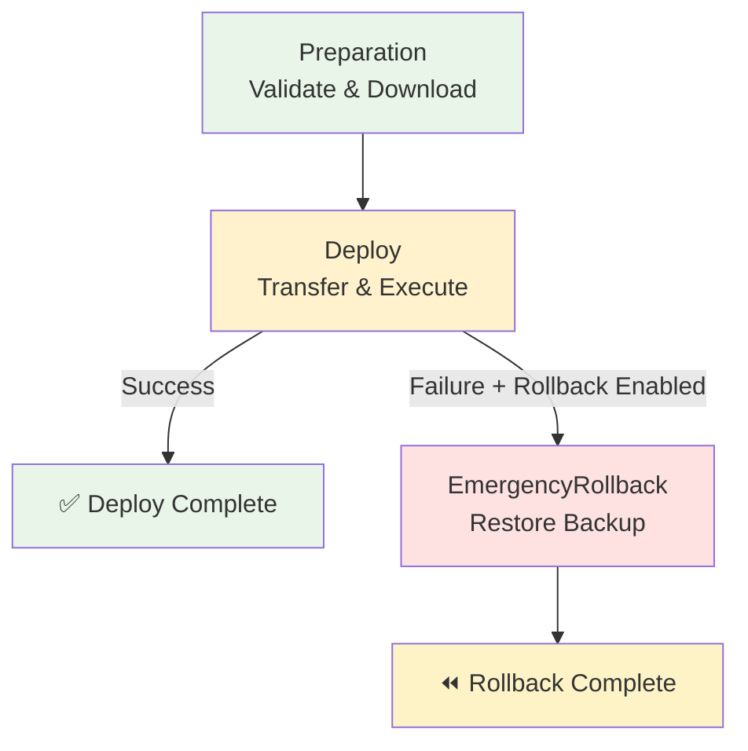

# Deploy via SSH

Pipeline de CD para deployment automatizado de aplicações em servidores remotos utilizando protocolo SSH.

## 🎯 Descrição

Este pipeline automatiza o processo de deployment de aplicações em servidores remotos através de conexões SSH seguras, oferecendo suporte completo para múltiplos ambientes, validação pré e pós-deploy, backup automático e rollback em caso de falha. O pipeline implementa as melhores práticas de deployment remoto com validação de conectividade, transferência segura de arquivos via SCP e execução controlada de scripts remotos.

O processo inclui validação de conexão SSH, download de packages do Azure Artifacts (suporte a 6 tipos: upack, maven, npm, nuget, pypi, cargo), backup opcional da versão anterior, transferência de arquivos via SCP preservando estrutura de diretórios, execução de scripts de deploy versionados no repositório e validação pós-deploy. Oferece flexibilidade total para diferentes tipos de aplicação e configurações de servidor, suportando tanto deployments simples quanto complexos com múltiplas etapas de validação.

Principais capacidades incluem versionamento de deployments com Azure Artifacts, backup automático com retenção configurável, rollback automático em falha, execução de scripts pré/pós-deploy customizáveis com suporte a estruturas hierárquicas de diretórios, validação de conectividade antes do deployment e suporte a múltiplos ambientes com configurações específicas.

- [Pipeline utilizado para testes](https://dev.azure.com/telefonica-vivo-brasil/DevOps/_build?definitionId=45079)
- [Repositório de exemplo](https://dev.azure.com/telefonica-vivo-brasil/DevOps/_git/teste-deploy-ssh)

## 🚀 Quick Start (5 minutos)

1. Configure SSH Service Connection no Azure DevOps (Veja [Dependências Externas](#-dependências-externas))
2. Crie scripts de deploy no repositório (deploy.sh e validate.sh)
3. Crie `.azuredevops/azure-pipeline-cd.yml` na raiz
4. Cole o código de exemplo
5. Commit e push
6. ✅ Pipeline executa automaticamente!

```yaml
# Deploy básico via SSH
# .azuredevops/azure-pipeline-cd.yml
resources:
  repositories:
    - repository: CodePlay
      name: DevOps/Vivo.CodePlay.Pipelines
      type: git
      ref: refs/heads/master
      endpoint: CodePlay

extends:
  template: /framework/pipelines/cd/deploy-ssh/pipeline.yaml@CodePlay
  parameters:
    environment: dev
```

**O que acontece com esta configuração:**

- 🔐 **Autenticação**: Conecta via SSH usando service connection ``ssh-{sigla}-dev``
- 📦 **Download**: Obtém artifacts da última build bem-sucedida
- ✅ **Validação**: Verifica conectividade SSH antes do deployment
- 💾 **Backup**: Cria backup da versão atual automaticamente
- 📤 **Transferência**: Copia arquivos para ``/opt/app`` no servidor remoto via SCP
- 🚀 **Deploy**: Executa script ``./deploy.sh`` no servidor
- 🔍 **Validação**: Executa ``./validate.sh`` para verificar sucesso
- 🔄 **Rollback**: Restaura backup automaticamente em caso de falha

## 🏗️ Matriz de Capacidades

| Capacidade | Suporte | Descrição |
|------------|---------|-----------|
| [Trunk Based Development](https://dvps.redecorp.azr/portal/codeplay/capacidades/catalog/trunk-based-development) | ❎ | Pipeline de CD - não faz sentido habilitar essa capacidade |
| [Build Automatizado](https://dvps.redecorp.azr/portal/codeplay/capacidades/catalog/build-automatizado) | ❎ | Pipeline de CD - não faz sentido habilitar essa capacidade |
| [Testes Unitários](https://dvps.redecorp.azr/portal/codeplay/capacidades/catalog/testes-unitarios) | ❎ | Pipeline de CD - não faz sentido habilitar essa capacidade |
| [SAST](https://dvps.redecorp.azr/portal/codeplay/capacidades/catalog/sast) | ❎ | Pipeline de CD - não faz sentido habilitar essa capacidade |
| [SCA](https://dvps.redecorp.azr/portal/codeplay/capacidades/catalog/sca) | ❎ | Pipeline de CD - não faz sentido habilitar essa capacidade |
| [Gates de Segurança](https://dvps.redecorp.azr/portal/codeplay/capacidades/catalog/gates-de-seguranca) | ✅ | Environments do Azure DevOps com aprovações manuais por ambiente via ``environmentPrefix`` |
| [Análise de Código](https://dvps.redecorp.azr/portal/codeplay/capacidades/catalog/analise-de-codigo) | ❎ | Pipeline de CD - não faz sentido habilitar essa capacidade |
| [Gates de Qualidade](https://dvps.redecorp.azr/portal/codeplay/capacidades/catalog/gate-de-qualidade) | ⚠️ | Validação pós-deploy customizável via ``validationScript`` com ``enableValidation=true`` |
| [Rollback de Upgrade](https://dvps.redecorp.azr/portal/codeplay/capacidades/catalog/rollback-de-upgrade) | ✅ | Rollback automático via restore de backup quando ``enableRollback=true`` (padrão habilitado) |
| [Blue/Green Deployment](https://dvps.redecorp.azr/portal/codeplay/capacidades/catalog/blue-green-deployment) | 🚧 | Planejado - Requer configuração de múltiplos paths de deployment |
| [Canary Release](https://dvps.redecorp.azr/portal/codeplay/capacidades/catalog/canary-release) | ❌ | Não suportado nativamente |

**Legenda:**

- ✅ Suportado nativamente
- ❌ Não suportado
- ⚠️ Suportado com limitações ou condições
- 🚧 Planejado / Em Construção
- ❎ Não faz sentido habilitar essa capacidade

## 🔄 Estrutura do Pipeline

O pipeline é organizado em três estágios sequenciais com dependências claras: Preparação valida conectividade e prepara artifacts, Deploy executa transferência e deployment com backup prévio, e Rollback restaura versão anterior automaticamente em caso de falha. A execução é otimizada com checkout mínimo e validações paralelas quando possível.



### Estágios do Pipeline

1. **🔍 Preparation - Validação e Preparação**
   - Checkout do código fonte com profundidade mínima (``fetchDepth: 1``)
   - **Determinação da versão para deployment** via ``VersionManagerVivo@8`` com comando ``setDeployVersion``
     - Se ``version`` = ``getLatestVersion()``: busca última tag Git do repositório
     - Se versão específica fornecida: usa a versão informada
     - Define variável ``DEPLOY_VERSION`` para uso nos próximos estágios
   - **Atualização de metadados do build** via script bash
     - Atualiza build number com padrão ``deploy-ssh-{VERSION}-{ENVIRONMENT}``
     - Adiciona tags: ``version-{VERSION}`` e ``environment-{ENVIRONMENT}``
   - Download de package do Azure Artifacts usando ``packageType``, ``feedName``, ``packageDefinition`` e versão determinada
   - **Verificação de artifacts baixados** com logs detalhados (tamanho, conteúdo)
   - Validação de conectividade SSH com servidor remoto
   - Verificação de permissões e existência de paths de destino

2. **🚀 Deploy - Deployment Remoto** (Deployment Job)
   - Registra deployment no environment do Azure DevOps para rastreabilidade
   - Checkout do repositório para obter scripts de deployment
   - Download do package do Azure Artifacts
   - **Visualização do estado atual do deployment** (conteúdo, tamanho) antes do backup
   - Criação de backup da versão atual no servidor com **logs detalhados** (se ``enableBackup=true``)
     - Nome do backup: ``backup-before-{VERSION}-{ENV}.tar.gz`` (contém versão ANTERIOR)
     - Lista conteúdo a ser backupeado
     - Mostra tamanho do backup criado
     - Limpeza automática de backups antigos (retenção: ``backupRetentionDays``)
     - Lista backups disponíveis após limpeza
   - **Limpeza de arquivos antigos** (se ``cleanupPattern`` definido)
     - Remove versões antigas de packages baseado em padrões glob
     - Preserva diretórios (config/, logs/, data/) e backups/
     - Mostra arquivos antes/depois da limpeza e total removido
   - Transferência de scripts do repositório preservando estrutura de diretórios (``flattenFolders: false``)
   - Transferência de arquivos do package via SCP para ``deploymentPath`` no servidor remoto
   - Ajuste recursivo de permissões de execução em todos os scripts (.sh) com ``find``
   - Execução de script pré-deploy customizável via ``bash`` (se ``preDeployScript`` fornecido)
   - Execução de script de deployment via ``bash "$SCRIPT_NAME"`` no servidor
   - Validação pós-deploy executada via ``bash`` (se ``enableValidation=true``)
   - Execução de script pós-deploy via ``bash`` (se ``postDeployScript`` fornecido)
   - **Registro de deployment no Event Hub** via ``VivoEventHubTools@2`` (``condition: always()``)
     - Registra versão deployada, artifact, tipo de ambiente, nome do ambiente
     - Captura URL de acesso configurada via ``applicationUrl`` (opcional)
     - Inclui metadados como deployment path e package type em annotations
     - Registra status do deployment (sucesso/falha) automaticamente
   - Limpeza de scripts do servidor (``condition: always()``)

3. **⏪ EmergencyRollback - Rollback Automático** (Condicional: falha no Deploy + ``enableRollback=true``)
   - Acionado automaticamente apenas em caso de falha no estágio Deploy
   - Checkout do repositório para obter scripts de validação atualizados
   - **Restauração do backup PRIMEIRO** com logs detalhados:
     - Lista backups disponíveis
     - Mostra tamanho do backup sendo restaurado
     - Exibe estado antes e depois do rollback
   - Transferência de scripts de validação e rollback para o servidor (APÓS restore)
   - **Ajuste de permissões recursivas para TODOS os scripts** via ``find`` com ``chmod +x``
   - Execução de script de rollback customizado (se ``rollbackScript`` fornecido) via ``bash``
   - Validação do rollback executado via ``bash`` com scripts atuais
   - Limpeza de scripts de validação do servidor
   - Requer approval manual via Environment ``deploy-{environment}-rollback``

## ⚙️ Parâmetros Disponíveis

### Configurações de Infraestrutura e Ambiente

#### agentPool

- **nome**: agentPool
- **tipo**: string
- **default**: "GeneralPurposeLinuxAgentsCD"
- **descrição**: Pool de agentes para execução do pipeline. Deve ter SSH client instalado e conectividade de rede com os servidores remotos de destino.
- **dependências**: Pool configurado com acesso de rede aos servidores e SSH client instalado.

#### environment

- **nome**: environment
- **tipo**: string
- **default**: "dev"
- **opções**: ["dev", "preprod", "prod"] (configurável via parâmetros object)
- **descrição**: Ambiente alvo do deployment. Determina qual service connection SSH, hostname, usuário e path de deployment será utilizado através dos mapeamentos em outros parâmetros object.
- **dependências**: Environment configurado no Azure DevOps com nome ``deploy-{environment}``.

#### environmentPrefix

- **nome**: environmentPrefix
- **tipo**: string
- **default**: "deploy-"
- **descrição**: Prefixo utilizado para construir o nome do environment resource no Azure DevOps para deployment normal. Nome final: ``{environmentPrefix}{environment}``.
- **dependências**: Environment resources configurados no Azure DevOps seguindo convenção de nomenclatura.

#### rollbackEnvironmentSuffix

- **nome**: rollbackEnvironmentSuffix
- **tipo**: string
- **default**: "-rollback"
- **descrição**: Sufixo utilizado para construir o nome do environment resource específico para operações de rollback emergencial. Combinado com environmentPrefix e environment, resulta em nomes como 'deploy-dev-rollback'. Permite configurar aprovações separadas para rollback.
- **dependências**: Environment resources de rollback configurados no Azure DevOps.

### Configurações de Conexão SSH

#### sshServiceConnection

- **nome**: sshServiceConnection
- **tipo**: object
- **default**: 
```yaml
dev: 'ssh-$(SIGLA)-dev'
preprod: 'ssh-$(SIGLA)-preprod'
prod: 'ssh-$(SIGLA)-prod'
```
- **descrição**: Mapeamento de service connections SSH por ambiente. A sigla é extraída automaticamente do nome do Team Project. Service connections devem estar configuradas com autenticação por chave SSH, hostname, porta e usuário.
- **dependências**: Service Connections SSH configuradas no Azure DevOps com permissões de acesso aos servidores.

### Configurações de Deployment

#### version

- **nome**: version
- **tipo**: string
- **default**: "getLatestVersion()"
- **descrição**: Versão da aplicação para deployment. Aceita dois formatos: (1) função `getLatestVersion()` (padrão) - busca automaticamente a última tag Git do repositório via `VersionManagerVivo`; (2) versão específica (ex: "1.2.3") - usa a versão informada. A versão determinada é armazenada na variável `DEPLOY_VERSION` para uso nos estágios subsequentes e é utilizada para baixar o package correspondente do Azure Artifacts.
- **dependências**: Para busca automática de versão com `getLatestVersion()`, requer tags Git no formato semântico no repositório. O package com essa versão deve estar publicado no feed do Azure Artifacts especificado.

### Configurações de Azure Artifacts

#### packageType

- **nome**: packageType
- **tipo**: string
- **default**: "upack"
- **opções**: ["upack", "maven", "npm", "nuget", "pypi", "cargo"]
- **descrição**: Tipo de package publicado no Azure Artifacts. Determina o formato e protocolo usado para download.
- **dependências**: Package publicado no feed do Azure Artifacts no formato especificado.

#### feedName

- **nome**: feedName
- **tipo**: string
- **default**: "DevOps"
- **descrição**: Nome do feed do Azure Artifacts onde o package está publicado.
- **dependências**: Feed criado no Azure Artifacts com permissões de leitura para o pipeline.

#### packageDefinition

- **nome**: packageDefinition
- **tipo**: string
- **default**: "$(Build.Repository.Name)"
- **descrição**: Identificação do package no feed. Formato varia por tipo: package-name (upack), @scope/package (npm), groupId:artifactId (maven).
- **dependências**: Package publicado no feed com o identificador especificado.

#### filesPattern

- **nome**: filesPattern
- **tipo**: string
- **default**: "**"
- **descrição**: Padrão glob para selecionar quais arquivos do package transferir para o servidor.
- **dependências**: Nenhuma.

### Configurações de Deployment

#### deploymentPath

- **nome**: deploymentPath
- **tipo**: object
- **default**: 
```yaml
dev: '/opt/app'
preprod: '/opt/app'
prod: '/opt/app'
```
- **descrição**: Caminho absoluto no servidor remoto onde a aplicação será deployada por ambiente. Usuário SSH deve ter permissões de escrita neste diretório.
- **dependências**: Diretório existente no servidor com permissões apropriadas.

### Configurações de Observabilidade (Opcional)

#### applicationUrl

- **nome**: applicationUrl
- **tipo**: object
- **default**: 
```yaml
dev: ''
preprod: ''
prod: ''
```
- **descrição**: URL de acesso à aplicação por ambiente para rastreabilidade e observabilidade. Usado pela task ``VivoEventHubTools@2`` para registrar o endpoint de acesso no Event Hub. Deixe vazio se a aplicação não possuir URL de acesso (ex: batch jobs, workers, scripts). Preencha apenas para aplicações web/API que têm URL HTTP/HTTPS acessível.
- **dependências**: Nenhuma (opcional).
- **📝 Exemplo de uso**:
```yaml
applicationUrl:
  dev: 'http://app-dev.vivo.com.br'
  preprod: 'https://app-preprod.vivo.com.br'
  prod: 'https://app.vivo.com.br'
```

#### deployScript

- **nome**: deployScript
- **tipo**: string
- **default**: ".azuredevops/scripts/deploy.sh"
- **descrição**: Caminho do script de deployment no repositório. Pipeline faz checkout, transfere para servidor preservando estrutura de diretórios e executa. Script deve retornar exit code 0 em sucesso.
- **dependências**: Script deve existir no repositório no caminho especificado.

#### preDeployScript

- **nome**: preDeployScript
- **tipo**: string
- **default**: ""
- **descrição**: Caminho do script pré-deploy no repositório. Executado no servidor remoto antes do deployment. Útil para parar serviços. Deixe vazio para não executar.
- **dependências**: Nenhuma (opcional).

#### postDeployScript

- **nome**: postDeployScript
- **tipo**: string
- **default**: ""
- **descrição**: Caminho do script pós-deploy no repositório. Executado no servidor remoto após deployment bem-sucedido. Útil para iniciar serviços. Deixe vazio para não executar.
- **dependências**: Nenhuma (opcional).

#### rollbackScript

- **nome**: rollbackScript
- **tipo**: string
- **default**: ""
- **descrição**: Caminho do script de rollback customizado no repositório. Executado no servidor remoto APÓS restauração do backup, durante o stage EmergencyRollback. Use para reverter mudanças em recursos externos como banco de dados (migrations), cache (Redis/Memcached), configurações externas (Consul/Vault) ou notificar sistemas integrados. O backup automático já restaura os arquivos da aplicação - este script foca em reverter o ESTADO externo. Deixe vazio se sua aplicação é stateless ou não precisa de lógica adicional de rollback.
- **dependências**: Nenhuma (opcional). Script deve existir no repositório quando fornecido.
- **📝 Nota**: Script é transferido automaticamente junto com outros scripts (``**/*.sh``), não precisa transferência separada.

### Configurações de Estrutura de Diretórios

#### workingDirectory

- **nome**: workingDirectory
- **tipo**: string
- **default**: "$(Build.SourcesDirectory)"
- **descrição**: Diretório base de trabalho no agente do Azure DevOps onde o repositório é clonado. Usado como base para localizar scriptsDirectory.
- **dependências**: Nenhuma.

#### scriptsDirectory

- **nome**: scriptsDirectory
- **tipo**: string
- **default**: ".azuredevops/scripts"
- **descrição**: Caminho relativo do diretório contendo scripts de deployment no repositório. Todos os arquivos .sh são transferidos preservando estrutura de subdiretórios.
- **dependências**: Diretório deve existir no repositório contendo scripts .sh.

### Configurações de Controle e Validação

#### enableBackup

- **nome**: enableBackup
- **tipo**: boolean
- **default**: true
- **descrição**: Habilita criação de backup da versão atual antes do deployment. Backup é armazenado em ``{deploymentPath}/backups/`` como arquivo tar.gz com timestamp. Essencial para rollback funcionar.
- **dependências**: Espaço em disco suficiente no servidor para armazenar backups.

#### enableRollback

- **nome**: enableRollback
- **tipo**: boolean
- **default**: true
- **descrição**: Habilita rollback automático em caso de falha no deployment. Quando true, restaura automaticamente o backup criado antes do deploy. Requer ``enableBackup=true`` para funcionar.
- **dependências**: Parâmetro ``enableBackup`` deve estar como true.

#### enableValidation

- **nome**: enableValidation
- **tipo**: boolean
- **default**: true
- **descrição**: Habilita execução de script de validação pós-deployment para verificar se aplicação está funcionando corretamente. Validação com falha cancela deployment e aciona rollback se habilitado.
- **dependências**: Script de validação deve existir e retornar exit code apropriado.

#### validationScript

- **nome**: validationScript
- **tipo**: string
- **default**: ".azuredevops/scripts/validate.sh"
- **descrição**: Caminho do script de validação no repositório. Pipeline transfere para servidor e executa pós-deployment. Script deve retornar exit code 0 se validação OK, exit code != 0 se falha.
- **dependências**: Script deve existir no repositório quando ``enableValidation=true``.

#### backupRetentionDays

- **nome**: backupRetentionDays
- **tipo**: number
- **default**: 7
- **descrição**: Número de dias para retenção de backups no servidor. Backups mais antigos são automaticamente removidos para economizar espaço em disco.
- **dependências**: Nenhuma.

#### cleanupPattern

- **nome**: cleanupPattern
- **tipo**: string
- **default**: "*.jar,*.war,*.ear"
- **descrição**: Padrão de arquivos para limpar antes do deploy. Remove versões antigas de packages para evitar acúmulo no diretório de deployment. Usa padrões glob separados por vírgula (ex: '*.jar,*.war'). Apenas arquivos (`-type f`) são removidos, diretórios como config/, logs/, data/ são preservados. Backups/ é sempre preservado. Deixe vazio ('') para desabilitar limpeza.
- **dependências**: Nenhuma.
- **⚠️ Atenção**: Remove apenas arquivos no nível raiz do deploymentPath (maxdepth 1), não entra em subdiretórios.

#### deploymentTimeout

- **nome**: deploymentTimeout
- **tipo**: number
- **default**: 30
- **descrição**: Timeout em minutos para execução do script de deployment. Deployment que exceder este tempo será cancelado automaticamente.
- **dependências**: Nenhuma.

#### useLegacySSH

- **nome**: useLegacySSH
- **tipo**: boolean
- **default**: false
- **descrição**: Habilita uso de tasks Legacy SSH (LegacySSH@0 e LegacyCopyFilesOverSSH@0) para compatibilidade com servidores antigos que não suportam algoritmos de criptografia modernos (SHA256+). Use apenas para servidores legados (Weblogic antigo, AIX, Solaris) que apresentam erros como "Handshake failed: no matching key exchange algorithm" ou "no matching MAC found".
- **dependências**: Servidor SSH antigo que requer algoritmos SHA1/DSS.
- **⚠️ Atenção**: Use apenas quando necessário por questões de compatibilidade. Algoritmos legados são menos seguros.

## 🔧 Dependências Externas

### Service Connections Necessárias

#### 1. SSH Service Connection

- **Nome padrão**: ``ssh-{sigla}-{environment}``
- **Tipo**: SSH
- **Uso**: Autenticação e conexão com servidor remoto para transferência de arquivos e execução de comandos
- **Permissões necessárias**:
  - Acesso SSH ao servidor remoto (porta 22 ou customizada)
  - Permissões de leitura/escrita no diretório de deployment
  - Permissões de execução de scripts
  - Permissões para criar diretórios de backup
- **Configurável via**: parâmetro ``sshServiceConnection``

### Agent Pool Requirements

#### Pool de Agentes

- **Pool padrão**: ``GeneralPurposeLinuxAgentsCD``
- **Sistema Operacional**: Linux
- **Ferramentas obrigatórias**:
  - SSH Client (openssh-client ou similar)
  - SCP (parte do openssh-client)
  - Tar (para criação de backups)
- **Acesso de rede**:
  - Conectividade SSH (porta 22 ou customizada) para servidores de destino
  - Acesso ao Azure DevOps para download de artifacts
  - Resolução DNS para hostnames dos servidores

### Arquivos Obrigatórios no Repositório

#### 1. deploy.sh

- **Localização padrão**: Raiz do artifact
- **Configurável via**: parâmetro ``deployScript``
- **Requisitos**:
  - Script executável (``chmod +x deploy.sh``)
  - Shebang válido (``#!/bin/bash`` ou similar)
  - Retorno de exit code 0 em sucesso, != 0 em falha
  - Tratamento de erros com ``set -e`` recomendado
- **Comportamento**: Script principal de deployment executado no servidor remoto após transferência de arquivos

**Exemplo básico de deploy.sh:**
```bash
#!/bin/bash
set -e

echo "Starting deployment..."
# Suas operações de deployment aqui
echo "Deployment completed successfully"
exit 0
```

#### 2. validate.sh (Opcional, requerido se ``enableValidation=true``)

- **Localização padrão**: Raiz do artifact
- **Configurável via**: parâmetro ``validationScript``
- **Requisitos**:
  - Script executável
  - Retorno exit 0 se validação OK, exit 1 se falha
  - Timeout respeitado conforme ``deploymentTimeout``
- **Comportamento**: Executado após deploy para validar que aplicação está funcionando corretamente

**Exemplo básico de validate.sh:**
```bash
#!/bin/bash

echo "Validating deployment..."
# Verificar se aplicação está rodando
# Exemplo: curl -f http://localhost:8080/health
if [ $? -eq 0 ]; then
  echo "Validation successful"
  exit 0
else
  echo "Validation failed"
  exit 1
fi
```

### Permissões de Servidor Remoto

**Permissões necessárias para o usuário SSH:**

- Leitura/escrita no ``deploymentPath``
- Criação de subdiretórios (``backups/``)
- Execução de scripts shell
- Leitura de arquivos de configuração (se necessário)

**Configuração recomendada de diretórios:**
```bash
# Estrutura no servidor remoto
/opt/app/                    # deploymentPath
├── backups/                 # Backups automáticos
│   ├── backup-20241226.tar.gz
│   └── backup-20241225.tar.gz
├── deploy.sh               # Script de deployment
├── validate.sh             # Script de validação
└── [arquivos da aplicação]
```

### Variáveis de Sistema Utilizadas

| Variável | Origem | Uso |
|----------|--------|-----|
| ``System.TeamProject`` | Azure DevOps | Extração da sigla do projeto para nomear resources |
| ``Build.BuildNumber`` | Azure DevOps | Identificação única do deployment nos backups |
| ``Build.SourcesDirectory`` | Azure DevOps | Diretório base para checkout |
| ``Pipeline.Workspace`` | Azure DevOps | Diretório de trabalho para artifacts |

## 🎨 Comportamentos Customizados

:::danger
**⚠️ ATENÇÃO: CUSTOMIZAÇÕES REQUEREM RESPONSABILIDADE ⚠️**

- ✅ **Use os exemplos como ponto de partida** - Eles demonstram padrões seguros e testados
- 🧠 **"Todos somos adultos"** - Confiamos na sua expertise, mas exigimos consciência do impacto
- 📝 **Tudo fica registrado** - Seu histórico de commits é auditável e rastreável
- 🎯 **Entenda antes de modificar** - Customizações incorretas podem quebrar deployments em produção
- 🤝 **Documente suas decisões** - Facilite a manutenção futura por outros membros da equipe

**Customizar é permitido. Fazer sem entender não é.**
:::

### Deploy com Scripts Customizados e Validação

```yaml
# .azuredevops/azure-pipeline-cd.yml
resources:
  repositories:
    - repository: CodePlay
      name: DevOps/Vivo.CodePlay.Pipelines
      type: git
      ref: refs/heads/master
      endpoint: CodePlay

extends:
  template: /framework/pipelines/cd/deploy-ssh/pipeline.yaml@CodePlay
  parameters:
    environment: prod
    deployScript: './scripts/production-deploy.sh'
    preDeployScript: 'systemctl stop myapp'  # Para serviço antes do deploy
    postDeployScript: 'systemctl start myapp && systemctl status myapp'  # Inicia e valida serviço
    validationScript: './scripts/healthcheck.sh'
    deploymentTimeout: 60  # Deploy mais complexo, timeout maior
```

### Deploy sem Backup (Ambiente de Desenvolvimento)

```yaml
# .azuredevops/pipelines/cd-dev.yaml
# Útil para ambientes de desenvolvimento onde rollback não é crítico
resources:
  repositories:
    - repository: CodePlay
      name: DevOps/Vivo.CodePlay.Pipelines
      type: git
      ref: refs/heads/master
      endpoint: CodePlay

extends:
  template: /framework/pipelines/cd/deploy-ssh/pipeline.yaml@CodePlay
  parameters:
    environment: dev
    enableBackup: false  # Sem backup em dev
    enableRollback: false  # Sem rollback automático
    enableValidation: true  # Mas mantém validação
```

### Deploy com Limpeza Customizada de Arquivos

```yaml
# .azuredevops/azure-pipeline-cd.yml
# Customizar padrões de limpeza para diferentes tipos de package
resources:
  repositories:
    - repository: CodePlay
      name: DevOps/Vivo.CodePlay.Pipelines
      type: git
      ref: refs/heads/master
      endpoint: CodePlay

extends:
  template: /framework/pipelines/cd/deploy-ssh/pipeline.yaml@CodePlay
  parameters:
    environment: prod
    cleanupPattern: '*.zip,*.tar.gz,*.war'  # Remove arquivos específicos
    # cleanupPattern: ''  # Desabilitar limpeza (mantém todas versões)
```

### Deploy com Múltiplos Servidores por Ambiente

```yaml
# .azuredevops/azure-pipeline-cd.yml
# Deploy em múltiplos servidores usando diferentes service connections
resources:
  repositories:
    - repository: CodePlay
      name: DevOps/Vivo.CodePlay.Pipelines
      type: git
      ref: refs/heads/master
      endpoint: CodePlay

extends:
  template: /framework/pipelines/cd/deploy-ssh/pipeline.yaml@CodePlay
  parameters:
    environment: prod
    sshServiceConnection:
      prod: 'ssh-myapp-prod-server1'  # Primeiro servidor
    remoteHost:
      prod: 'prod-server1.example.com'
    deploymentPath:
      prod: '/opt/myapp/cluster'
```

### Deploy com Porta SSH Customizada e Paths Diferentes

```yaml
# .azuredevops/azure-pipeline-cd.yml
resources:
  repositories:
    - repository: CodePlay
      name: DevOps/Vivo.CodePlay.Pipelines
      type: git
      ref: refs/heads/master
      endpoint: CodePlay

extends:
  template: /framework/pipelines/cd/deploy-ssh/pipeline.yaml@CodePlay
  parameters:
    environment: prod
    sshPort:
      prod: 2222  # Porta customizada
    deploymentPath:
      prod: '/var/www/myapp'  # Path customizado
    backupRetentionDays: 30  # Retenção maior em produção
```

### Deploy com Validação Estendida

```yaml
# .azuredevops/azure-pipeline-cd.yml
resources:
  repositories:
    - repository: CodePlay
      name: DevOps/Vivo.CodePlay.Pipelines
      type: git
      ref: refs/heads/master
      endpoint: CodePlay

extends:
  template: /framework/pipelines/cd/deploy-ssh/pipeline.yaml@CodePlay
  parameters:
    environment: preprod
    validationScript: './scripts/comprehensive-validation.sh'
    deploymentTimeout: 45
    postDeployScript: |
      echo "Running smoke tests..."
      ./scripts/smoke-tests.sh
      echo "Warming up application..."
      ./scripts/warmup.sh
```

### Deploy com Legacy SSH (Servidores Antigos)

```yaml
# .azuredevops/pipelines/cd-weblogic.yaml
# Para servidores antigos que não suportam algoritmos modernos de criptografia
# Exemplo: Weblogic antigo, AIX, Solaris com SSH legado
resources:
  repositories:
    - repository: CodePlay
      name: DevOps/Vivo.CodePlay.Pipelines
      type: git
      ref: refs/heads/master
      endpoint: CodePlay

extends:
  template: /framework/pipelines/cd/deploy-ssh/pipeline.yaml@CodePlay
  parameters:
    environment: prod
    useLegacySSH: true  # Habilita tasks Legacy SSH para compatibilidade
    sshServiceConnection:
      prod: 'ssh-weblogic-prod-legacy'
    deploymentPath:
      prod: '/opt/oracle/middleware'
    deployScript: './scripts/weblogic-deploy.sh'
```

### Deploy com Rollback Customizado

```yaml
# .azuredevops/azure-pipeline-cd.yml
# Para aplicações stateful que precisam reverter migrations, cache, etc.
resources:
  repositories:
    - repository: CodePlay
      type: git
      name: 'DVPS - DEVOPS/Vivo.CodePlay.Pipelines'

extends:
  template: /framework/pipelines/cd/deploy-ssh/pipeline.yaml@CodePlay
  parameters:
    deployScript: '.azuredevops/scripts/deploy.sh'
    rollbackScript: '.azuredevops/scripts/rollback.sh'  # Script customizado de rollback
    validationScript: '.azuredevops/scripts/validate.sh'
```

**⚠️ Quando usar Legacy SSH:**
- Erro: `Handshake failed: no matching key exchange algorithm`
- Erro: `no matching MAC found`
- Erro: `Unable to negotiate with server`
- Servidores: Weblogic antigo, AIX, Solaris, sistemas com SSH muito antigo

**✅ Mantenha `useLegacySSH: false` (padrão) para:**
- Servidores modernos (Ubuntu 18.04+, RHEL 7+, etc.)
- Qualquer servidor com OpenSSH 7.0+
- Segurança e performance otimizadas

## 🔖 Variáveis de Ambiente

As seguintes variáveis de ambiente são automaticamente configuradas pelo pipeline:

| Variável | Descrição | Valor Padrão |
|----------|-----------|--------------|
| ``SIGLA`` | Sigla do projeto extraída do nome do Team Project | ``$[ lower(split(variables['System.TeamProject'],' ')[0]) ]`` |
| ``ENVIRONMENT_RESOURCE`` | Nome completo do environment resource para deployment | ``{environmentPrefix}{environment}`` |
| ``ROLLBACK_ENVIRONMENT_RESOURCE`` | Nome completo do environment resource para rollback | ``{environmentPrefix}{environment}{rollbackEnvironmentSuffix}`` |
| ``DEPLOYMENT_TAG`` | Tag única para identificação do deployment | ``$(Build.BuildNumber)`` |
| ``BACKUP_FILENAME`` | Nome do arquivo de backup gerado (prefixo "before-" indica que contém versão ANTERIOR ao deploy) | ``backup-before-{BuildNumber}.tar.gz`` |
| ``DEPLOYMENT_PATH`` | Caminho de deployment no servidor por ambiente | ``{deploymentPath[environment]}`` |
| ``SSH_SERVICE_CONNECTION`` | Service connection SSH por ambiente | ``{sshServiceConnection[environment]}`` |
| ``SCRIPTS_SOURCE_PATH`` | Caminho completo dos scripts no agente | ``{workingDirectory}/{scriptsDirectory}`` |

## ❓ FAQ

### Onde posso encontrar mais informações sobre o CodePlay Framework?

Você pode encontrar mais informações sobre o CodePlay Framework na [documentação oficial](https://dvps.redecorp.azr/portal/codeplay/framework/).

### Onde encontro as capacidades disponíveis?

As capacidades disponíveis podem ser encontradas no [Catálogo de Capacidade](https://dvps.redecorp.azr/portal/catalog/capabilities) no Portal CodePlay.

### Como faço para customizar o pipeline?

Siga o guia de [Adoção ao CodePlay](https://dvps.redecorp.azr/portal/codeplay/roteiro/codeplay#fluxo-de-ado%C3%A7%C3%A3o-ao-codeplay).

### Quais casos de uso relevantes?

- [Integrando CICD](https://dvps.redecorp.azr/portal/code/casos-de-uso/integrando-cicd)
- Veja o [Catálogo de Casos de Uso](https://dvps.redecorp.azr/portal/catalog/casos-de-uso) para outros exemplos de casos de uso.

### Quais Erros Comuns relevantes?

- Ainda não temos nenhum erro comum documentado para este pipeline.
- Veja o [Catálogo de Erros Conhecidos](https://dvps.redecorp.azr/portal/catalog/erros-conhecidos) para outros exemplos de erros.

### Como configurar a service connection SSH?

No Azure DevOps, vá em Project Settings > Service Connections > New Service Connection > SSH. Configure:
- **Host name**: IP ou hostname do servidor
- **Port**: 22 (ou porta customizada)
- **User name**: usuário SSH
- **Password or SSH key**: chave SSH privada (recomendado)

### Como funciona a determinação automática de versão com getLatestVersion()?

Por padrão, o pipeline usa ``version: getLatestVersion()`` que automaticamente busca a **última tag Git** do repositório. O ``VersionManagerVivo@8`` identifica a tag mais recente em formato semântico (ex: v1.2.3, 1.2.3) e usa essa versão para:

1. **Baixar o package correspondente** do Azure Artifacts
2. **Identificar a versão** nos logs e metadados do deployment

**Fluxo de versionamento:**
- Pipeline de CI cria tag Git (ex: `v1.2.3`)
- Pipeline de CI publica package no Azure Artifacts com mesma versão
- Pipeline de CD usa `getLatestVersion()` para buscar última tag Git
- Pipeline de CD baixa package do Azure Artifacts usando a versão da tag

**Para especificar versão manualmente:**
```yaml
parameters:
  version: '1.2.3'  # Deploy de versão específica
```

**Para usar última versão (padrão):**
```yaml
parameters:
  # Não precisa especificar version - usa getLatestVersion() automaticamente
  environment: prod
```

**⚠️ Importante**: A task ``VersionManagerVivo@8`` com comando ``setDeployVersion`` resolve ``getLatestVersion()`` buscando a última tag Git do repositório. O package com essa versão deve existir no Azure Artifacts.

### Como criar scripts de deploy e validação?

Scripts devem ser executáveis shell scripts (bash, sh). Exemplo básico:

**deploy.sh:**
```bash
#!/bin/bash
set -e
echo "Deploying application..."
# Suas operações aqui
exit 0
```

**validate.sh:**
```bash
#!/bin/bash
curl -f http://localhost:8080/health
exit $?
```

### O que acontece se o deployment falhar?

Se ``enableRollback=true``, o pipeline automaticamente:
1. Detecta a falha no estágio Deploy
2. Aciona o estágio EmergencyRollback
3. Restaura o backup criado antes do deploy
4. Executa validação pós-rollback

### Como funciona a retenção de backups?

Backups são armazenados em ``{deploymentPath}/backups/`` com nome ``backup-{BuildNumber}.tar.gz``. Backups mais antigos que ``backupRetentionDays`` são automaticamente removidos em cada deployment.

### Posso desabilitar validação pós-deploy?

Sim, configure ``enableValidation: false``. Porém, não é recomendado para ambientes produtivos.

### Quando devo usar useLegacySSH?

Use ``useLegacySSH: true`` apenas quando encontrar erros de handshake SSH indicando incompatibilidade de algoritmos:
- **Erro típico**: `Handshake failed: no matching key exchange algorithm`
- **Servidores afetados**: Weblogic antigo, AIX, Solaris, sistemas com OpenSSH < 7.0
- **Solução**: Habilitar Legacy SSH para usar algoritmos SHA1/DSS

**Não use Legacy SSH** para servidores modernos - mantenha o padrão (``false``) para melhor segurança.

### Qual a diferença entre SSH@0 e LegacySSH@0?

- **SSH@0** (padrão): Usa algoritmos de criptografia modernos (SHA256, ECDSA, ED25519) - mais seguro e performático
- **LegacySSH@0**: Suporta algoritmos antigos (SHA1, DSS, 3DES) - necessário apenas para servidores legados

Ambos funcionam identicamente em termos de funcionalidade (scripts, transferência de arquivos, etc.), apenas diferem nos algoritmos de criptografia suportados.

### Por que os scripts são executados com 'bash' ao invés de './'?

O pipeline executa scripts usando `bash "$SCRIPT_NAME"` ao invés de `./script.sh` para:
- ✅ **Compatibilidade com CRLF**: Evita erros `/bin/bash^M: bad interpreter` quando scripts têm line endings Windows
- ✅ **Execução explícita**: Força uso do interpretador bash independente do shebang
- ✅ **Maior confiabilidade**: Funciona mesmo se permissões de execução falharem
- ✅ **Debugging facilitado**: Erros do bash são mais claros que erros de permissão

**Nota**: Apesar de executar com `bash`, o pipeline ainda define permissões `chmod +x` em todos os scripts via `find` para garantir compatibilidade e permitir execução direta se necessário.

### Quais logs verbosos o pipeline fornece?

O pipeline inclui logs detalhados em pontos estratégicos:
- 📦 **Download de artifacts**: Lista completa de arquivos e tamanho total
- 📁 **Estado do deployment**: Mostra conteúdo atual antes do backup
- 💾 **Backup**: Lista o que será backupeado, tamanho do backup criado, backups disponíveis
- 🧹 **Cleanup**: Mostra arquivos antes/depois da limpeza e total removido por padrão
- 🔄 **Rollback**: Lista backups disponíveis, tamanho sendo restaurado, estado antes/depois
- 📤 **Transferência de scripts**: Mostra origem, destino e arquivos transferidos

Esses logs ajudam a diagnosticar problemas sem precisar ativar `System.Debug`.

### Por que o pipeline remove versões antigas antes do deploy?

Por padrão, o pipeline limpa versões antigas de packages (JARs, WARs, EARs) antes de transferir a nova versão usando o parâmetro ``cleanupPattern``. Isso evita:
- ❌ **Acúmulo de versões**: Após 10 deploys, você teria 10 versões no servidor
- ❌ **Desperdício de espaço**: Múltiplas versões antigas ocupam disco desnecessariamente
- ❌ **Confusão**: Dificuldade em identificar qual versão está ativa

**Proteções implementadas:**
- ✅ Remove **apenas arquivos** (`-type f`) - nunca diretórios
- ✅ Preserva **backups/** automaticamente
- ✅ Preserva **config/, logs/, data/** (são diretórios)
- ✅ Padrão seguro por padrão: `*.jar,*.war,*.ear`
- ✅ Pode ser customizado ou desabilitado: `cleanupPattern: ''`

**Segurança garantida:**
Mesmo com limpeza, o **backup contém as versões antigas**, então rollback funciona normalmente!

### Por que o backup é restaurado ANTES de transferir validation scripts no rollback?

A ordem correta é crucial:
1. **Restore from Backup** PRIMEIRO - restaura a versão anterior (remove arquivos atuais)
2. **Transfer Validation Scripts** DEPOIS - copia scripts do repositório (incluindo rollback.sh se fornecido)
3. **chmod +x em TODOS os scripts** - define permissões uma única vez para todos os .sh
4. **Execute Rollback Script** - executa lógica customizada (se fornecido) sem chmod adicional
5. **Validate Rollback** - valida que rollback funcionou

Se fosse o contrário:
- ❌ Scripts seriam transferidos
- ❌ Restore apagaria TUDO (incluindo os scripts recém-transferidos)
- ❌ Validação falharia por não encontrar scripts

A ordem atual garante que scripts de validação e rollback estejam disponíveis e executáveis após o restore.

### Como configurar a URL de acesso da aplicação para observabilidade?

O pipeline registra deployments no Event Hub via task ``VivoEventHubTools@2`` para rastreabilidade centralizada. A URL de acesso é **opcional** e configurada via parâmetro ``applicationUrl``:

**Quando preencher:**
- ✅ **Aplicações web/APIs**: Configure a URL HTTP/HTTPS de acesso público
- ✅ **Diferentes URLs por ambiente**: Use object para mapear por ambiente

**Quando deixar vazio:**
- ❌ **Batch jobs**: Processos sem interface web
- ❌ **Workers**: Processadores assíncronos sem endpoint
- ❌ **Scripts**: Tarefas agendadas via cron

**Exemplo - Aplicação web:**
```yaml
parameters:
  applicationUrl:
    dev: 'http://app-dev.vivo.com.br'
    preprod: 'https://app-preprod.vivo.com.br'
    prod: 'https://app.vivo.com.br'
```

**Exemplo - Batch job (deixar vazio):**
```yaml
parameters:
  applicationUrl:
    dev: ''
    preprod: ''
    prod: ''
```

**⚠️ Importante**: No contexto SSH, **não há forma automática de descobrir a URL** (diferente de Kubernetes que extrai do Ingress/Route). Por isso a URL deve ser informada manualmente quando aplicável.

**O que é registrado no Event Hub:**
- ✅ Versão deployada (``componentVersion``)
- ✅ Artifact deployado (``deployArtifactName``)
- ✅ Tipo de package (``deployArtifactType``: upack, maven, npm, etc.)
- ✅ Ambiente (``deployEnvironmentName``: dev, preprod, prod)
- ✅ Tipo de infraestrutura (``deployEnvironmentType``: ssh)
- ✅ URL de acesso (``deployEnvironmentAccessUrl``): se configurado
- ✅ Metadados adicionais (deployment path, package type) em ``annotations``
- ✅ Status do deployment (sucesso/falha) capturado automaticamente

## 🆘 Suporte

- [Abra um chamado para Dev Support](https://dvps.redecorp.azr/portal/codeplay/roteiro/#:~:text=Abra%20um%20chamado%20para%20Dev%20Support)
- [Canal DevEx - Azure DevOps](https://teams.microsoft.com/l/channel/19%3A8fbd00946cf044d7a844182ac71e6aa1%40thread.tacv2/Azure%20DevOps?groupId=038b4415-d6dd-42ce-92e5-31a8e2a13bf8&tenantId=9744600e-3e04-492e-baa1-25ec245c6f10)

## 📝 Decisões Tomadas

### Decisão 1: Suporte a Legacy SSH via Duplicação Condicional de Tasks

- **Data**: 29/12/2024
- **Motivador**: Compatibilidade com servidores legados (Weblogic antigo, AIX, Solaris) que não suportam algoritmos modernos de criptografia
- **Forum Envolvido**: Time DevOps/CodePlay Framework
- **Descrição**: Implementar suporte dual SSH/Legacy SSH através de duplicação condicional de todas as tasks SSH@0/CopyFilesOverSSH@0 com suas versões Legacy usando template expressions ``${{ if eq(parameters.useLegacySSH, true/false) }}``. Rejeitada abordagem de templates separados por complexidade excessiva.

