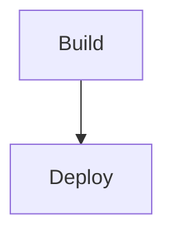

# Deploy VSIX Extension

## 🎯 Descrição

Pipeline especializado para build, empacotamento, deploy e instalação de extensões Azure DevOps no formato .vsix. Realiza o ciclo completo de desenvolvimento de extensões, desde a transpilação do código TypeScript/JavaScript até a instalação automática no marketplace corporativo da Vivo.

Este pipeline trabalha com tecnologia **Node.js** para aplicações do tipo **extensões Azure DevOps** (tasks, decorators, widgets), oferecendo suporte completo ao ciclo de vida de desenvolvimento de extensões corporativas.

**Principais características:**
- Build, empacotamento e deploy automatizados
- Suporte a múltiplos ambientes (preprod/produção)
- Validação de extensões em Pull Requests sem deploy
- Análise de qualidade com SonarQube
- Versionamento automático de múltiplos arquivos

> Desenvolvedor: Não esqueça de atualizar os links abaixo

- [Repositório de exemplo](https://dev.azure.com/telefonica-vivo-brasil/DVPS%20-%20DEVOPS/_git/azdo-task-quickstart-2)
- [Pipeline de exemplo](https://dev.azure.com/telefonica-vivo-brasil/DVPS%20-%20DEVOPS/_build?definitionId=47277)


## 🚀 Quick Start (5 minutos)

### Pré-requisitos
- Arquivo `.tool-versions` na raiz do repositório (gerenciado pelo [asdf](https://dvps.redecorp.azr/portal/code/casos-de-uso/mudando-versao))
- Arquivo `vss-extension.json` configurado
- Script `build` no `package.json`

### Configuração Mínima

Crie `.azuredevops/azure-pipeline-cd.yml`:

```yaml
resources:
  repositories:
    - repository: CodePlay
      name: DevOps/Vivo.CodePlay.Pipelines
      type: git
      ref: refs/heads/master
      endpoint: CodePlay

extends:
  template: /framework/pipelines/cd/deploy-vsix-extension/pipeline.yaml@CodePlay
```

**Resultado**: Build, testes, empacotamento e deploy automático em produção.

## 🏗️ Matriz de Capacidades

| Capacidade                  | Suporte | Descrição                                      |
|----------------------------|---------|------------------------------------------------|
| [Trunk Based Development](https://dvps-dev.redecorp.azr/portal/codeplay/capacidades/catalog/trunk-based-development) | ✅      | Suporte nativo a trunk-based com deploy por ambiente     |
| [Build Automatizado](https://dvps-dev.redecorp.azr/portal/codeplay/capacidades/catalog/build-automatizado)        | ✅      | Build Node.js automatizado com npm. Parâmetro: ``enableBuild``     |
| [Testes Unitários](https://dvps-dev.redecorp.azr/portal/codeplay/capacidades/catalog/testes-unitarios)       | ✅      | Execução de testes com publicação JUnit. Parâmetro: ``enableTest``        |
| [PR Validation](https://dvps-dev.redecorp.azr/portal/codeplay/capacidades/catalog/pr-validation)       | ✅      | Validação em Pull Request sem deploy. Parâmetro: ``prValidationOnly``        |
| [SAST](https://dvps-dev.redecorp.azr/portal/codeplay/capacidades/catalog/sast)                        | ✅      | Análise estática via SonarQube. Parâmetro: ``runQualityGate``                       |
| [Versionamento Automático](https://dvps-dev.redecorp.azr/portal/codeplay/capacidades/catalog/versionamento) | ✅      | Incremento automático de versão sempre executado. Parâmetro: ``versionFiles``                       |
| [SCA](https://dvps-dev.redecorp.azr/portal/codeplay/capacidades/catalog/sca)                        | ❌      | Não implementado para extensões VSIX           |
| [Gates de Segurança](https://dvps-dev.redecorp.azr/portal/codeplay/capacidades/catalog/gates-de-seguranca)          | ❌      | Não aplicável para extensões VSIX   |
| [Análise de Código](https://dvps-dev.redecorp.azr/portal/codeplay/capacidades/catalog/analise-de-codigo)          | ✅      | Linting e SonarQube. Parâmetros: ``enableLint``, ``runQualityGate``   |
| [Gates de Qualidade](https://dvps-dev.redecorp.azr/portal/codeplay/capacidades/catalog/gate-de-qualidade)           | ✅      | Quality Gates via SonarQube. Parâmetro: ``runQualityGate``    |
| [Rollback de Upgrade](https://dvps-dev.redecorp.azr/portal/codeplay/capacidades/catalog/rollback-de-upgrade) | ❎  | Pipeline de CD não suporta rollback automático de extensões |
| [Blue/Green Deployment](https://dvps-dev.redecorp.azr/portal/codeplay/capacidades/catalog/blue-green-deployment) | ❎  | Não aplicável para marketplace de extensões Azure DevOps |
| [Canary Release](https://dvps-dev.redecorp.azr/portal/codeplay/capacidades/catalog/canary-release)        | ❎  | Não aplicável para marketplace de extensões Azure DevOps |

Legenda:
- ✅ - Suportado nativamente
- ❌ - Não suportado
- ⚠️ - Suportado com limitações ou condições
- 🚧 - Planejado / Em Construção
- ❎ - Não faz sentido habilitar essa capacidade

## 🔄 Estrutura do Pipeline

Descrição geral de como o pipeline está organizado em estágios (somente stages — detalhes de jobs e steps são intencionalmente omitidos aqui). O pipeline possui exatamente 2 estágios sequenciais e dependentes: o artefato produzido no primeiro é consumido no segundo.



**Build**
Responsável por preparar o pacote da extensão (.vsix). Inclui internamente (fora do escopo desta seção) tarefas de qualidade, geração e empacotamento. Saída principal: artefato .vsix versionado com sufixo de ambiente (quando aplicável).

**Deploy**
Consome o artefato .vsix publicado pelo estágio anterior e executa a publicação no marketplace do ambiente alvo, valida a publicação e instala a extensão na organização correspondente. **Este stage é condicional** e só executa quando `prValidationOnly` for `false` (padrão), permitindo validação de build sem deploy.

### Notas sobre a Modelagem de Stages

- Não há paralelismo ou fan‑out/fan‑in entre múltiplos stages nesta versão.
- Qualidade (lint, testes, cobertura) ocorre dentro do stage Build; não é modelada no diagrama pois esta seção lista apenas stages.
- Promoção entre ambientes é feita por dependência direta (Build -> Deploy) reaproveitando o mesmo artefato.
- Stage de Deploy pode ser completamente ignorado ao habilitar `prValidationOnly: true`, útil para validações em Pull Requests.

## ⚙️ Parâmetros Disponíveis

Configure o comportamento do pipeline através dos seguintes parâmetros. Cada parâmetro controla aspectos específicos da execução.

### Parâmetros para Controle de Ambiente

#### environment

- **nome**: environment  
- **tipo**: string  
- **default**: "producao"  
- **opções**: ["preprod", "producao"]  
- **descrição**: Define o ambiente alvo (controla service connection e sufixo aplicado em ID/nome da extensão).  
- **dependências**: Service connections e environments correspondentes devem existir.

#### envSufixMap

- **nome**: envSufixMap  
- **tipo**: object  
- **default**: `{'preprod': '-preprod', 'producao': ''}`
- **opções**: Não aplicável (mapa fixo)  
- **descrição**: Mapeia sufixos usados para diferenciar extensão entre ambientes.  
- **dependências**: Nenhuma dependência adicional. Não alterar para manter padronização.

### Parâmetros para Capacidades (Feature Flags)

#### enableLint

- **nome**: enableLint  
- **tipo**: boolean  
- **default**: true  
- **descrição**: Executa `npm run lint` para validar padrões de código.  
- **dependências**: Script `lint` e dependências (ex: eslint) definidos em package.json.

#### enableBuild

- **nome**: enableBuild  
- **tipo**: boolean  
- **default**: true  
- **descrição**: Executa `npm run build` para transpilar/empacotar código antes do pacote VSIX.  
- **dependências**: Script `build` e toolchain (tsc/webpack/babel) instalados.

#### enableTest

- **nome**: enableTest  
- **tipo**: boolean  
- **default**: true  
- **descrição**: Executa `npm run test` (ou `coverage` se cobertura habilitada) e publica resultados JUnit (MOCHA_FILE).  
- **dependências**: Script `test`, framework (jest/mocha) e geração de JUnit configurada (jest-junit ou mocha-junit-reporter).

#### enableCoverage

- **nome**: enableCoverage  
- **tipo**: boolean  
- **default**: true  
- **descrição**: Substitui execução de testes por `npm run coverage` e publica Cobertura se `coverage/cobertura-coverage.xml` existir.  
- **dependências**: Script `coverage` (ex: jest --coverage ou nyc).

#### prValidationOnly

- **nome**: prValidationOnly  
- **tipo**: boolean  
- **default**: false  
- **descrição**: Quando habilitado (true), executa apenas o estágio de Build (lint, testes, cobertura, empacotamento) sem realizar o deploy. Útil para validação em Pull Requests ou testes de build sem publicar a extensão no marketplace.  
- **dependências**: Nenhuma dependência adicional.
- **observações**: Com este parâmetro habilitado, o stage de Deploy é completamente ignorado, permitindo validar a construção da extensão sem afetar os ambientes de preprod ou produção.

### Parâmetros de Empacotamento

#### packageFolder

- **nome**: packageFolder  
- **tipo**: string  
- **default**: "./"  
- **descrição**: Diretório base usado para gerar o pacote .vsix (conteúdo buildado/transpilado).  
- **dependências**: Diretório deve existir após o build.

#### vssExtensionFile

- **nome**: vssExtensionFile  
- **tipo**: string  
- **default**: "./vss-extension.json"  
- **descrição**: Endereço relativo do arquivo de manifesto da extensão.  
- **dependências**: Arquivo deve existir e conter metadados válidos da extensão.

### Parâmetros de Quality Gate (SonarQube)

#### runQualityGate

- **nome**: runQualityGate  
- **tipo**: boolean  
- **default**: true  
- **descrição**: Habilita execução da análise SonarQube e quality gate.  
- **dependências**: Service connection SonarQube configurada e projeto criado no SonarQube.

#### useSonarConfigFile

- **nome**: useSonarConfigFile  
- **tipo**: boolean  
- **default**: true  
- **descrição**: Utiliza arquivo de configuração do SonarQube ao invés de parâmetros inline.  
- **dependências**: Arquivo de configuração deve existir no caminho especificado.

#### sonarConfigFilePath

- **nome**: sonarConfigFilePath  
- **tipo**: string  
- **default**: ".azuredevops/sonar-project.properties"  
- **descrição**: Caminho do arquivo de configuração do SonarQube no repositório do projeto.  
- **dependências**: Arquivo deve existir quando `useSonarConfigFile` for true.

#### sonarPollingTimeoutSec

- **nome**: sonarPollingTimeoutSec  
- **tipo**: string  
- **default**: "300"  
- **descrição**: Timeout em segundos para aguardar o resultado do quality gate.  
- **dependências**: Nenhuma dependência adicional.

#### sonarJavaVersion

- **nome**: sonarJavaVersion  
- **tipo**: string  
- **default**: "openjdk-17.0.2"  
- **opções**: ["openjdk-21.0.2", "openjdk-17.0.2", "openjdk-11.0.2"]  
- **descrição**: Versão do Java utilizada para executar a análise estática do SonarQube no projeto.  
- **dependências**: Nenhuma dependência adicional.

#### sonarServiceConnection

- **nome**: sonarServiceConnection  
- **tipo**: string  
- **default**: "VIVO_SONARQUBE"  
- **descrição**: Nome da service connection configurada para SonarQube.  
- **dependências**: Service connection deve estar configurada no Azure DevOps.

#### sonarQualityGate

- **nome**: sonarQualityGate  
- **tipo**: string  
- **default**: "AzureDevOps-Default"  
- **descrição**: Nome do quality gate configurado no SonarQube que define os critérios de qualidade.  
- **dependências**: Quality gate deve existir no SonarQube.

#### sonarScannerMode

- **nome**: sonarScannerMode  
- **tipo**: string  
- **default**: "cli"  
- **opções**: ["cli", "dotnet"]  
- **descrição**: Modo do scanner SonarQube a ser utilizado para executar a análise de código.  
- **dependências**: Nenhuma dependência adicional.

#### sonarProjectKey

- **nome**: sonarProjectKey  
- **tipo**: string  
- **default**: "$(System.TeamProject)-$(Build.Repository.Name)"  
- **descrição**: Chave única do projeto no SonarQube utilizada para identificação das análises.  
- **dependências**: Projeto deve estar criado no SonarQube com esta chave.

#### sonarProjectName

- **nome**: sonarProjectName  
- **tipo**: string  
- **default**: "$(System.TeamProject)-$(Build.Repository.Name)"  
- **descrição**: Nome de exibição do projeto no SonarQube que aparece na interface web.  
- **dependências**: Nenhuma dependência adicional.

### Parâmetros de Azure App Configuration

#### useAppConfig

- **nome**: useAppConfig  
- **tipo**: boolean  
- **default**: true  
- **descrição**: Habilita uso do Azure App Configuration para configurações do SonarQube.  
- **dependências**: Azure App Configuration deve estar configurado.

### Parâmetros de Versionamento

#### versionFiles

- **nome**: versionFiles  
- **tipo**: string  
- **default**: ``  
- **descrição**: Lista de arquivos que devem ter suas versões atualizadas automaticamente. Múltiplos arquivos podem ser especificados separados por quebra de linha (`\n`) ou ponto-e-vírgula (`;`). O versionamento automático é sempre executado em toda execução do pipeline.  
- **dependências**: Arquivos especificados devem existir no repositório.
- **exemplos**:
  - Arquivo único: `'package.json'`
  - Múltiplos arquivos com quebra de linha: `'package.json\nvss-extension.json'`
  - Múltiplos arquivos com ponto-e-vírgula: `'package.json;vss-extension.json;version.txt'`
- **observações**: A task `VersionManagerVivo` irá procurar e atualizar automaticamente campos de versão nos arquivos especificados usando a estratégia `customTask`. O incremento de versão é executado em todos os builds.

#### branchingStrategy

- **nome**: branchingStrategy  
- **tipo**: string  
- **default**: "trunkbased"  
- **opções**: ["trunkbased", "vivoflow", "releaseflow", "gitlabflow", "gitlabflow-semantic", "custom"]  
- **descrição**: Define a estratégia de versionamento a ser utilizada pelo pipeline. Altera a lógica de incremento de versão conforme o fluxo de trabalho adotado pelo time/produto (ex: trunk-based, release flow, gitlab flow, etc).  
- **dependências**: Nenhuma dependência adicional.  
- **observações**: Consulte a [documentação do VersionManagerVivo](https://dev.azure.com/telefonica-vivo-brasil/DVPS%20-%20DEVOPS/_git/azdo-task-version-utils?path=/docs/TASK_INPUTS_REFERENCE.md#2-branchingstrategy) para detalhes sobre cada estratégia.

## 🔧 Dependências Externas

Documente todas as dependências externas necessárias para o funcionamento do pipeline.

### Service Connections Obrigatórias

| Nome da Connection | Tipo | Descrição | Como Configurar |
|-------------------|------|-----------|-----------------|
| `vso-telefonica-vivo-brasil-preprod` | Visual Studio Team Services | Conexão para publicação no marketplace de pré-produção | Configurar em Project Settings > Service Connections com credenciais para organização preprod |
| `vso-telefonica-vivo-brasil` | Visual Studio Team Services | Conexão para publicação no marketplace de produção | Configurar em Project Settings > Service Connections com credenciais para organização produção |

### Service Connections Opcionais

| Nome da Connection | Tipo | Descrição | Como Configurar | Observações |
|-------------------|------|-----------|-----------------|-------------|
| `VIVO_SONARQUBE` | SonarQube | Conexão para análise de qualidade de código | Configurar em Project Settings > Service Connections com credenciais do SonarQube | Usado quando `runQualityGate` = true |
| `DevOpsSharedResources` | Azure Resource Manager | Subscription para acesso ao Azure App Configuration | Configurar service connection ARM para a subscription | Usado internamente quando `useAppConfig` = true |

### Recursos de Build Agent

Liste os requisitos do build agent:

- **Node.js**: Versão especificada no arquivo `.tool-versions` do repositório (asdf)
- **NPM**: Para instalação de dependências e execução de scripts
- **TFX CLI**: Instalado automaticamente pelo pipeline para empacotamento de extensões
- **Agent Pool CI**: GeneralPurposeLinuxAgentsCI para stage de build
- **Agent Pool CD**: GeneralPurposeLinuxAgentsCD para stage de deploy
- **Acesso à internet**: Para download de dependências npm e comunicação com Azure DevOps marketplace

## 🎨 Comportamentos Customizados

### Validação sem Deploy (Build Only)

```yaml
extends:
  template: /framework/pipelines/cd/deploy-vsix-extension/pipeline.yaml@CodePlay
  parameters:
    prValidationOnly: true
```

### Desabilitar Testes para Deploy Rápido

```yaml
extends:
  template: /framework/pipelines/cd/deploy-vsix-extension/pipeline.yaml@CodePlay
  parameters:
    enableTest: false
    enableCoverage: false
```

### Deploy em Preprod

```yaml
extends:
  template: /framework/pipelines/cd/deploy-vsix-extension/pipeline.yaml@CodePlay
  parameters:
    environment: 'preprod'
```

### Versionamento de Múltiplos Arquivos

```yaml
extends:
  template: /framework/pipelines/cd/deploy-vsix-extension/pipeline.yaml@CodePlay
  parameters:
    versionFiles: 'package.json;vss-extension.json'
```

## 🚀 Exemplos de Uso

### Comportamento Padrão - Configuração Básica

Configuração mais simples para projetos que seguem as convenções padrão com deploy em ambiente de produção:

```yaml
# .azuredevops/azure-pipeline-cd.yml
resources:
  repositories:
    - repository: CodePlay
      name: DevOps/Vivo.CodePlay.Pipelines
      type: git
      ref: refs/heads/master
      endpoint: CodePlay

extends:
  template: /framework/pipelines/cd/deploy-vsix-extension/pipeline.yaml@CodePlay
```

**Comportamento esperado:**

- Deploy automático para ambiente 'producao'
- Execução de todos os passos de qualidade (lint, build, test, coverage)
- Empacotamento da pasta 'dist'
- Extensão publicada sem sufixo (produção)
- Instalação automática na organização de produção

### 🎯 Comportamento Customizado

**Exemplo de uso avançado com múltiplos parâmetros:**

```yaml
# .azuredevops/azure-pipeline-cd.yml
resources:
  repositories:
    - repository: CodePlay
      name: DevOps/Vivo.CodePlay.Pipelines
      type: git
      ref: refs/heads/master
      endpoint: CodePlay

extends:
  template: /framework/pipelines/cd/deploy-vsix-extension/pipeline.yaml@CodePlay
  parameters:
    environment: 'producao'
    enableLint: true
    enableBuild: true
    enableTest: false          # Desliga testes para ganho de tempo
    enableCoverage: false      # Desliga cobertura para ganho de tempo
    packageFolder: 'build'
```

**Comportamento esperado com essa configuração:**

- Deploy para ambiente de produção
- Execução de lint e build habilitados
- Testes e cobertura desabilitados para velocidade
- Empacotamento da pasta 'build' ao invés de 'dist'
- Extensão publicada sem sufixo (produção)

**Exemplo com configuração customizada de SonarQube:**

```yaml
# .azuredevops/azure-pipeline-cd.yml
resources:
  repositories:
    - repository: CodePlay
      name: DevOps/Vivo.CodePlay.Pipelines
      type: git
      ref: refs/heads/master
      endpoint: CodePlay

extends:
  template: /framework/pipelines/cd/deploy-vsix-extension/pipeline.yaml@CodePlay
  parameters:
    environment: 'preprod'
    runQualityGate: true
    useSonarConfigFile: false
    sonarProjectKey: 'custom-project-key'
    sonarProjectName: 'Custom Project Name'
    sonarQualityGate: 'Custom-Quality-Gate'
    sonarServiceConnection: 'CustomSonarConnection'
    useAppConfig: false
```

**Comportamento esperado com essa configuração:**

- Deploy para ambiente de preprod
- Análise SonarQube habilitada com configurações customizadas
- Projeto SonarQube com chave e nome personalizados
- Quality gate customizado
- Sem uso do Azure App Configuration

### 📋 Cenários Específicos

:::danger[Atenção]
Só modifique algum comportamento se você tiver certeza do que está fazendo. A modificação de parâmetros pode afetar o comportamento do pipeline.
:::

⚠️⚠️⚠️  Deixamos alguns exemplos de como customizar o pipeline para atender a necessidades específicas. Use-os como ponto de partida e ajuste conforme necessário. Mas lembre-se, utilizamos o conceito `todos somos adultos` então haja com responsabilidade, e lembre-se que tudo fica registrado no histórico do repositório. ⚠️ ⚠️ ⚠️

#### Trunk-based Development - Seleção Manual de Ambiente

Para projetos que usam trunk-based development com seleção manual do ambiente de deploy:

```yaml
# .azuredevops/azure-pipeline-cd.yml
name: '[$(Date:yyyyMMdd)$(Rev:.r)]'
trigger: none

parameters:
  - name: environment
    type: string
    default: preprod
    values:
      - preprod
      - producao

resources:
  repositories:
    - repository: CodePlay
      name: DevOps/Vivo.CodePlay.Pipelines
      type: git
      ref: refs/heads/master
      endpoint: CodePlay

extends:
  template: /framework/pipelines/cd/deploy-vsix-extension/pipeline.yaml@CodePlay
  parameters:
    environment: "${{parameters.environment}}"
    enableTest: true
    enableCoverage: true
```

#### GitLabFlow Development - Mapeamento Automático por Branch

Para projetos que usam GitLabFlow com deploy automático baseado na branch:

```yaml
# .azuredevops/azure-pipeline-cd.yml
name: '[$(Date:yyyyMMdd)$(Rev:.r)]'
trigger: none

parameters:
  - name: environmentBranchMap
    type: object
    default:
      master: 'producao'
      develop: 'preprod'

resources:
  repositories:
    - repository: CodePlay
      name: DevOps/Vivo.CodePlay.Pipelines
      type: git
      ref: refs/heads/master
      endpoint: CodePlay

extends:
  template: /framework/pipelines/cd/deploy-vsix-extension/pipeline.yaml@CodePlay
  parameters:
    environment: "${{ parameters.environmentBranchMap[variables['Build.SourceBranchName']] }}"
    enableTest: false
    enableCoverage: false
    packageFolder: 'dist'
```

#### Configuração Completa - Todos os Parâmetros

Exemplo abrangente mostrando todas as opções disponíveis para máximo controle:

```yaml
# .azuredevops/azure-pipeline-cd.yml
name: '[$(Date:yyyyMMdd)$(Rev:.r)]'
trigger: none

parameters:
  - name: targetEnvironment
    type: string
    default: preprod
    values:
      - preprod
      - producao

resources:
  repositories:
    - repository: CodePlay
      name: DevOps/Vivo.CodePlay.Pipelines
      type: git
      ref: refs/heads/master
      endpoint: CodePlay

extends:
  template: /framework/pipelines/cd/deploy-vsix-extension/pipeline.yaml@CodePlay
  parameters:
    environment: "${{parameters.targetEnvironment}}"
    enableLint: true
    enableBuild: true
    enableTest: true
    enableCoverage: true
    packageFolder: 'dist'
    vssExtensionFile: './vss-extension.json'
    runQualityGate: true
    useSonarConfigFile: true
    sonarConfigFilePath: '.azuredevops/sonar-project.properties'
    useAppConfig: true
```

#### Cenário: Validação em Pull Request (Build sem Deploy)

Para validar a extensão em Pull Requests sem publicar no marketplace:

```yaml
# .azuredevops/azure-pipeline-pr.yml
trigger: none

pr:
  branches:
    include:
      - master
      - develop

resources:
  repositories:
    - repository: CodePlay
      name: DevOps/Vivo.CodePlay.Pipelines
      type: git
      ref: refs/heads/master
      endpoint: CodePlay

extends:
  template: /framework/pipelines/cd/deploy-vsix-extension/pipeline.yaml@CodePlay
  parameters:
    prValidationOnly: true
    enableLint: true
    enableBuild: true
    enableTest: true
    enableCoverage: true
```

**Comportamento esperado:**
- Executa lint, build, testes e cobertura
- Gera o pacote .vsix e publica como artefato
- **NÃO** executa o stage de Deploy
- Ideal para validação de código antes do merge

#### Cenário: Preprod Rápido (somente build e pacote)

```yaml
# .azuredevops/azure-pipeline-cd.yml
resources:
  repositories:
    - repository: CodePlay
      name: DevOps/Vivo.CodePlay.Pipelines
      type: git
      ref: refs/heads/master
      endpoint: CodePlay

extends:
  template: /framework/pipelines/cd/deploy-vsix-extension/pipeline.yaml@CodePlay
  parameters:
    environment: 'preprod'
    enableLint: false
    enableBuild: true
    enableTest: false
    enableCoverage: false
    packageFolder: 'dist'
```

#### Cenário: Versionamento de Múltiplos Arquivos

Para projetos que precisam atualizar a versão em múltiplos arquivos simultaneamente:

```yaml
# .azuredevops/azure-pipeline-cd.yml
name: '[$(Date:yyyyMMdd)$(Rev:.r)]'
trigger: none

parameters:
  - name: environment
    type: string
    default: producao
    values:
      - preprod
      - producao

resources:
  repositories:
    - repository: CodePlay
      name: DevOps/Vivo.CodePlay.Pipelines
      type: git
      ref: refs/heads/master
      endpoint: CodePlay

extends:
  template: /framework/pipelines/cd/deploy-vsix-extension/pipeline.yaml@CodePlay
  parameters:
    environment: "${{parameters.environment}}"
    enableLint: true
    enableBuild: true
    enableTest: true
    enableCoverage: true
    versionFiles: 'package.json;vss-extension.json'
    runQualityGate: true
```

**Comportamento esperado:**

- Build executado com sucesso
- Versão automaticamente incrementada em `package.json` e `vss-extension.json`
- Commit automático com as alterações de versão
- Extensão publicada com versão atualizada
- Tags de build criadas com a nova versão

**Observação:** O versionamento automático é sempre executado em toda execução do pipeline. Configure o parâmetro `versionFiles` para definir quais arquivos devem ser versionados.

## 🔧 Configuração e Instalação

### Pré-requisitos

Antes de utilizar este pipeline, certifique-se de que os seguintes recursos estão configurados:

1. **Service Connections**: vso-telefonica-vivo-brasil-preprod e vso-telefonica-vivo-brasil
2. **Agent Pools**: GeneralPurposeLinuxAgentsCI e GeneralPurposeLinuxAgentsCD
3. **Variáveis de Ambiente**: Arquivo `.tool-versions` e `vss-extension.json` no repositório (Utilize o tech product para criar o repositório)
4. **Permissões**: Permissões para publicar e instalar extensões no marketplace

### ⚙️ Configuração Inicial

Instruções passo a passo para configurar o pipeline pela primeira vez:

1. **Configurar Service Connections**: Criar connections para os marketplaces de preprod e produção no Project Settings > Service Connections
2. **Preparar Ambiente**: Criar environments ``deploy-preprod`` e ``deploy-producao`` no Azure DevOps
3. **Configurar Repositório**: Garantir que existe arquivo `.tool-versions` e `vss-extension.json` no repositório
4. **Criar Pipeline**: Configurar pipeline YAML referenciando este template

## 🛠️ Solução de Problemas

### Problemas Comuns

#### ❌ Erro "No VSIX file found"

**Sintomas:**

- Pipeline falha na etapa de identificação do arquivo VSIX
- Log mostra "No VSIX file found in the current directory"

**Causa Provável:**

Build falhou ou packageFolder está incorreto, ou vss-extension.json não está no local especificado

**Solução:**

1. Verificar se o build foi executado com sucesso
2. Confirmar se o packageFolder está correto
3. Verificar se o vss-extension.json está no caminho especificado pelo parâmetro ``vssExtensionFile``

**Exemplo de correção:**

```yaml
# Configuração incorreta
packageFolder: 'build'
vssExtensionFile: './manifest.json'

# Configuração correta
packageFolder: './'
vssExtensionFile: './vss-extension.json'
```

#### ❌ Erro de autenticação com npm

**Sintomas:**

- Falha na instalação de dependências npm
- Erro de autenticação com registry privado

**Causa Provável:**

Arquivo .npmrc não configurado ou service connection incorreta

**Solução:**

1. Verificar se o arquivo .npmrc está configurado no repositório
2. Confirmar as permissões do service connection para registries npm
3. Validar credenciais de acesso ao registry

#### ❌ Falha na publicação da extensão

**Sintomas:**

- Task PublishAzureDevOpsExtension falha
- Erro de permissões ou conflito de ID

**Causa Provável:**

Service connection incorreta, environment não criado, ou extensão com mesmo ID já existe

**Solução:**

1. Verificar se o service connection está configurado corretamente
2. Confirmar se o environment está criado no Azure DevOps
3. Verificar se a extensão já existe com o mesmo ID no marketplace

#### ❌ Falha na instalação da extensão

**Sintomas:**

- Task InstallAzureDevOpsExtension falha
- Erro de permissões na organização de destino

**Causa Provável:**

Conta de destino sem permissões adequadas ou extensão não publicada

**Solução:**

1. Verificar se a conta de destino tem permissões adequadas
2. Confirmar se a extensão foi publicada com sucesso
3. Validar URL da organização de destino

### 🔍 Debug e Logs

#### Como ativar logs detalhados

Para ativar logs de debug no pipeline:

```yaml
# .azuredevops/azure-pipeline-cd.yml
variables:
  system.debug: true

extends:
  template: /framework/pipelines/cd/deploy-vsix-extension/pipeline.yaml@CodePlay
```

#### Principais arquivos de log

- **Build Logs**: Logs de compilação e testes disponíveis na aba "Logs" do pipeline
- **SonarQube Reports**: Relatórios de qualidade disponíveis no SonarQube quando ``runQualityGate`` = true
- **VSIX Package**: Artefato .vsix disponível na aba "Artifacts" após build
- **Extension Metadata**: Metadados extraídos do vss-extension.json nos logs de "Extract Extension Metadata"

## 🔧 Variáveis de Ambiente

As seguintes variáveis são utilizadas internamente pelo pipeline e extraídas automaticamente do vss-extension.json:

| Variável | Descrição | Valor Padrão |
|----------|-----------|--------------|
| `VSSEXTENSION_JSON_ID` | ID da extensão extraído do manifesto | Extraído do vss-extension.json |
| `VSSEXTENSION_JSON_NAME` | Nome da extensão extraído do manifesto | Extraído do vss-extension.json |
| `VSSEXTENSION_JSON_VERSION` | Versão da extensão extraída do manifesto | Extraído do vss-extension.json |
| `VSIX_FILE` | Caminho para o arquivo .vsix gerado | Definido dinamicamente após empacotamento |
| `MOCHA_FILE` | Caminho (JUnit) publicado nos resultados de testes | `$(parameters.workingDirectory)/test-results/junit.xml` |
| `ARTIFACTS_PATH` | Caminho dos artefatos baixados | `$(Build.ArtifactStagingDirectory)` |
| `NPM_CONFIG_USERCONFIG` | Configuração do npm para autenticação | `.npmrc` |
| `SIGLA` | Sigla do projeto extraída do nome do Team Project | `$[ lower(split(variables['System.TeamProject'],' ')[0]) ]` |

**Nota**: Configurações específicas do projeto devem ser definidas como parâmetros, não como variáveis de ambiente.

## ❓ FAQ

**Por que o versionamento é sempre executado?**
Garante rastreabilidade completa de todas as publicações no marketplace.

**Posso desabilitar o versionamento?**
Não. É obrigatório para consistência organizacional. Não inclua arquivos no `versionFiles` se não quiser versioná-los.

**Por que não posso customizar o sufixo de ambiente?**
Padronização organizacional para evitar conflitos no marketplace.

**Como faço rollback de uma versão?**
Azure Marketplace não suporta rollback. Publique nova versão com correções.

**Quanto tempo leva uma execução?**
Preprod completo: 5-8min | Produção completo: 5-8min | Preprod sem testes: 2-3min

**Como configuro outra versão do Node.js?**
Crie ou edite o arquivo `.tool-versions` na raiz do repositório usando o formato do asdf:

```
nodejs 20.11.0
```

Para descobrir versões disponíveis acesse a [doc](https://dvps.redecorp.azr/portal/code/casos-de-uso/mudando-versao). O pipeline lê esse arquivo automaticamente para selecionar a versão correta do Node.js no agente.

## 📞 Suporte

### Como Obter Ajuda

1. Consulte esta documentação e exemplos
2. Ative `system.debug: true` para logs detalhados
3. Verifique a seção "Solução de Problemas"
4. Entre em contato com a equipe DevOps da Vivo

### Documentação

- **Framework CodePlay**: https://dvps.redecorp.azr/portal/
- **Azure DevOps Marketplace**: Documentação oficial sobre extensões

## Decisões Tomadas

### Decisão 1: Uso de Sufixos Automáticos por Ambiente

- **Data**: 14/08/2025
- **Motivador**: Necessidade de diferenciar extensões entre ambientes de preprod e produção para evitar conflitos e permitir testes isolados
- **Fórum Envolvido**: Equipe DevOps Framework
- **Descrição**: Implementação de mapeamento automático de sufixos baseado no ambiente selecionado. Extensões em preprod recebem sufixo '-preprod' no ID e nome, enquanto produção mantém nome original
- **Impacto**: Permite instalação simultânea da mesma extensão em ambientes diferentes, facilita testes e reduz riscos de conflitos entre versões
- **Próximos Passos**: Manter padrão estabelecido e documentar para outras extensões
- **Referências**: Documentação interna sobre estratégias de deployment de extensões
- **Notas**: Parâmetro envSufixMap não deve ser alterado pelo usuário para manter consistência


### Decisão 2: Build e Deploy no Mesmo Pipeline

- **Data**: 14/08/2025
- **Motivador**: Azure Marketplace não suportar extensões com o mesmo nome ID em ambientes diferentes, exigindo pacotes diferentes para preprod e produção. Além disso não suporta rollback de versões.
- **Fórum Envolvido**: Equipe DevOps Framework
- **Descrição**: Implementação de pipeline único com dois estágios (Build e Deploy) para gerenciar o ciclo completo de desenvolvimento de extensões. O primeiro estágio realiza build, testes e empacotamento, enquanto o segundo publica e instala a extensão no ambiente selecionado
- **Impacto**: Não é possível versionar os pacotes `.vsix`, pois além de precisar gerar um novo pacote para cada ambiente, o Azure Marketplace não permite voltar versões.


### Decisão 3: Remover `##` dos logs dos testes

- **Data**: 08/09/2025
- **Motivador**: Mesmo com o sucesso dos testes (exit code 0), o Azure DevOps interpreta linhas que começam com `##[error]` como falhas, quebrando o estágio.
- **Fórum Envolvido**: Equipe DevOps Framework
- **Descrição**: Remoção dos ``##`` dos logs dos testes para evitar que o Azure DevOps interprete como erro. Ajuste implementado usando ``sed`` nos scripts anteriores; versão atual simplificada mantém compatibilidade (caso precise, adicionar pipe ``| sed 's/##//g'``).
- **Impacto**: Testes não são mostrados em tempo real, precisam de uma camada a mais para serem executados e validados.
- **Próximos Passos**: N/D
- **Referências**: Documentação Azure DevOps sobre logging
- **Notas**: Solução de contorno para limitação da plataforma Azure DevOps

### Decisão 4: Versionamento Automático Sempre Executado

- **Data**: 15/01/2026
- **Motivador**: Simplificar o pipeline e garantir rastreabilidade consistente de versões em todas as execuções, eliminando ambiguidade sobre quando o versionamento ocorre.
- **Fórum Envolvido**: Equipe DevOps Framework
- **Descrição**: Remoção do parâmetro `versionBump` e tornar o versionamento automático obrigatório em todas as execuções do pipeline. A task `VersionManagerVivo` é sempre executada tanto no stage de Build quanto no stage de Deploy, atualizando os arquivos especificados no parâmetro `versionFiles`.
- **Impacto**: Toda execução do pipeline resulta em incremento de versão nos arquivos configurados. Elimina inconsistências de versionamento e garante que cada deploy tenha uma versão única rastreável. Simplifica a configuração do pipeline ao remover um parâmetro opcional.
- **Próximos Passos**: Monitorar feedback dos desenvolvedores e ajustar estratégia se necessário
- **Notas**: O versionamento automático garante rastreabilidade completa de todas as publicações no marketplace, facilitando auditorias e troubleshooting


### Decisão 5: Migração de `.nvmrc` para `.tool-versions` (asdf)

- **Data**: 15/05/2026
- **Motivador**: O padrão corporativo para gerenciamento de versões de ferramentas é o asdf. Outros pipelines de node já utilizam asdf para setup do ambiente, mas este pipeline ainda exigia o arquivo `.nvmrc` para declarar a versão do Node.js, criando uma inconsistência e potencial confusão para os desenvolvedores.
- **Fórum Envolvido**: Equipe DevOps Framework
- **Descrição**: Remoção do arquivo `.nvmrc` e adoção do arquivo `.tool-versions` (padrão asdf) para declarar a versão do Node.js utilizada no projeto.
- **Impacto**: Repositórios que utilizavam `.nvmrc` precisam migrar para `.tool-versions`. O arquivo tem formato simples: uma entrada por ferramenta na forma `<ferramenta> <versão>`, por exemplo `nodejs 20.11.0`. Desenvolvedores com asdf instalado localmente se beneficiam do mesmo arquivo para configurar o ambiente local.
- **Próximos Passos**: Atualizar tech product de scaffolding para gerar `.tool-versions` ao invés de `.nvmrc`.
- **Referências**: [Documentação asdf](https://asdf-vm.com/), [Plugin asdf-nodejs](https://github.com/asdf-vm/asdf-nodejs).
- **Notas**: Caso o repositório ainda possua `.nvmrc`, o arquivo pode ser removido com segurança após adicionar o `.tool-versions`.

### Decisão 6: Depreciação do parâmetro `sonarServiceConnection` e governança SonarQube (ADR 0006)
- **Data**: 13/05/2026
- **Motivador**: Alinhar o pipeline à governança definida na ADR 0006, evitando bypass manual do controle de acesso ao Sonar VIP.
- **Fórum Envolvido**: CoE DevOps
- **Descrição**: O parâmetro `sonarServiceConnection` será depreciado em breve. Atualmente, ainda é possível referenciar manualmente o Sonar VIP ou comum, mas a escolha da instância passará a ser feita automaticamente pela custom task, baseada no arquivo `vip.json`. Isso garante que apenas projetos aprovados utilizem o Sonar VIP, conforme política definida.
- **Impacto**: Evita burla de governança, aumenta a rastreabilidade e prepara o pipeline para remoção futura do parâmetro.
- **Próximos Passos**: Depreciar o parâmetro `sonarServiceConnection` no pipeline e atualizar a lista do `vip.json` com as siglas dos projetos autorizados ao Sonar VIP.
- **Referências**: [ADR 0008 - Sonar VIP Governance](/framework/docs/adr/0008-sonar-vip-governance.md)
- **Notas**: O parâmetro permanece disponível temporariamente para retrocompatibilidade, mas será depreciado em breve.