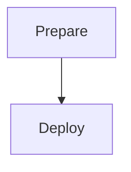

# Deploy VSIX VSCode Extension (CD)

## 🎯 Descrição

Pipeline de Entrega Contínua para extensões `.vsix` destinadas ao **Visual Studio Code Marketplace**. Consome o artefato `.vsix` publicado pelo pipeline de CI (`build-vsix-vscode-extension`) no Azure Artifacts e realiza o deploy no marketplace. Inclui gate de aprovação manual antes do deploy.

> Desenvolvedor: Não esqueça de atualizar os links abaixo

<!-- TODO: Atualizar links de exemplo para repositório e pipeline específicos deste template, não os genéricos ou de outros pipelines.
- [Repositório de exemplo](https://dev.azure.com/telefonica-vivo-brasil/DevOps/_git/teste-deploy-vsix-vscode-extension)
- [Pipeline de exemplo](MUDAR_AQUI) -->


## 🚀 Quick Start (5 minutos)

### Pré-requisitos

- Pipeline CI (`build-vsix-vscode-extension`) já configurado e executando com sucesso
- Ao menos uma versão do pacote publicada no Azure Artifacts
- Environment do Azure DevOps criado com aprovações configuradas
- Service connection do Visual Studio Marketplace configurada no projeto

### Configuração Mínima

```yaml
# .azuredevops/azure-pipeline-cd.yml
resources:
  pipelines:
    - pipeline: ci
      source: nome-do-pipeline-ci
      trigger: true

  repositories:
    - repository: CodePlay
      name: DevOps/Vivo.CodePlay.Pipelines
      type: git
      ref: refs/heads/master

extends:
  template: /framework/pipelines/cd/deploy-vsix-vscode-extension/pipeline.yaml@CodePlay
  parameters:
    environment: producao
```

**Resultado**: O pipeline baixa o `.vsix` mais recente do Azure Artifacts, aguarda aprovação manual e publica no VSCode Marketplace.


## 🏗️ Matriz de Capacidades

| Capacidade | Suporte | Descrição |
|---|---|---|
| [Deploy Controlado por Versão](https://dvps-dev.redecorp.azr/portal/codeplay/capacidades/catalog/deploy) | ✅ | Parâmetro: `version` (default: última versão) |
| [Gate de Aprovação](https://dvps-dev.redecorp.azr/portal/codeplay/capacidades/catalog/aprovacao) | ✅ | Job de deployment com environment do Azure DevOps |
| [Multi-ambiente](https://dvps-dev.redecorp.azr/portal/codeplay/capacidades/catalog/ambientes) | ✅ | Parâmetros: `environment`, `envSufixMap` |
| [Registro de Deploy (EventHub)](https://dvps-dev.redecorp.azr/portal/codeplay/capacidades/catalog/eventhub) | ✅ | Sempre executado via `VivoEventHubTools@3` |
| [Rollback via Re-deploy](https://dvps-dev.redecorp.azr/portal/codeplay/capacidades/catalog/rollback) | ✅ | Especificar versão anterior no parâmetro `version` |

Legenda: ✅ Suportado | ❌ Não suportado | ⚠️ Com limitações | ❎ Não aplicável


## 🔄 Estrutura do Pipeline



| Stage | Job | Descrição |
|---|---|---|
| **Prepare** | `prepare` | Resolve versão, baixa `.vsix` do Artifacts, extrai metadados do `package.json` |
| **Deploy** | `deployVSIXExtension` | Deployment job com aprovação → publica no VSCode Marketplace → registra no EventHub |

> O stage `Deploy` usa um deployment job com environment do Azure DevOps, habilitando gate de aprovação manual.


## ⚙️ Parâmetros Disponíveis

Configure o comportamento do pipeline através dos seguintes parâmetros. Cada parâmetro controla aspectos específicos da execução.

### Deploy e Ambiente

#### environment

- **nome**: environment
- **tipo**: string
- **default**: "producao"
- **opções**: ["preprod", "producao"]
- **descrição**: Define o ambiente de destino do deploy. Controla qual environment do Azure DevOps será utilizado (com suas aprovações configuradas) e qual sufixo de ambiente será aplicado ao nome da extensão no marketplace.
- **dependências**: O environment deve estar criado em Project Settings > Environments no Azure DevOps com as aprovações e checks configurados.

#### version

- **nome**: version
- **tipo**: string
- **default**: "getLatestVersion()"
- **descrição**: Versão do pacote `.vsix` a ser baixada do Azure Artifacts para deploy. Use `getLatestVersion()` para obter automaticamente a última versão publicada, ou especifique uma versão como `1.2.3` para deploy de versão específica (rollback).
- **dependências**: A versão especificada deve existir no feed `feedName` como Universal Package. Se não existir, o stage `Prepare` falhará com erro de pacote não encontrado.

#### envSufixMap

- **nome**: envSufixMap
- **tipo**: object
- **default**: `{ preprod: '-preprod', producao: '' }`
- **descrição**: Mapeamento de sufixos de nome por ambiente. Para `preprod`, o sufixo `-preprod` é concatenado ao ID da extensão no marketplace, permitindo manter uma versão separada para testes sem afetar produção. Não deve ser alterado salvo em casos excepcionais.
- **dependências**: Os ambientes listados devem corresponder aos valores válidos do parâmetro `environment`. Uma extensão com o sufixo correspondente deve estar pré-criada no marketplace para o ambiente `preprod`.

### Infraestrutura e Ambiente

#### agentPool

- **nome**: agentPool
- **tipo**: string
- **default**: "GeneralPurposeLinuxAgentsCD"
- **descrição**: Define o agent pool utilizado para execução de todos os stages do pipeline CD. Deve ser um pool Linux com acesso ao Azure Artifacts e ao Visual Studio Marketplace.
- **dependências**: O pool informado deve existir e ter agentes disponíveis com as ferramentas necessárias (Node.js, npm, tfx-cli).

### Configuração do Azure Artifacts

#### feedName

- **nome**: feedName
- **tipo**: string
- **default**: "3d53bc62-8749-4931-ae46-a443b73bc87a"
- **descrição**: Nome ou ID do feed de Universal Packages no Azure Artifacts de onde o arquivo `.vsix` será baixado para deploy. Deve coincidir exatamente com o `feedName` configurado no pipeline de CI.
- **dependências**: O feed deve existir no Azure Artifacts e o pipeline deve ter permissão de Reader para baixar pacotes. Deve ser o mesmo feed usado pelo CI para publicar.

#### packageName

- **nome**: packageName
- **tipo**: string
- **default**: "$(Build.Repository.Name)"
- **descrição**: Nome do pacote Universal no Azure Artifacts de onde o `.vsix` será baixado. Identifica unicamente o artefato no feed e deve coincidir exatamente com o `packageName` configurado no pipeline de CI.
- **dependências**: O pacote deve existir no feed especificado em `feedName` e ter ao menos uma versão publicada pelo pipeline CI antes da execução do CD.

#### projectScopedFeed

- **nome**: projectScopedFeed
- **tipo**: boolean
- **default**: false
- **descrição**: Quando verdadeiro, o feed tem escopo de projeto (`{projeto}/{feed}`); quando falso, tem escopo de organização. O feed padrão da organização é de escopo organizacional — manter `false`.
- **dependências**: Deve coincidir com o escopo real do feed e com o valor configurado no pipeline de CI. Configuração incorreta resulta em erro de feed não encontrado ao tentar baixar o pacote.


## 🔧 Dependências Externas

### Service Connections Obrigatórias

| Nome | Tipo | Uso |
|---|---|---|
| `vso-telefonica-vivo-brasil` | Visual Studio Marketplace | Publicação no VSCode Marketplace (producao) |
| `vso-telefonica-vivo-brasil-preprod` | Visual Studio Marketplace | Publicação no VSCode Marketplace (preprod) |

### Agent Pool

| Pool | Uso |
|---|---|
| `GeneralPurposeLinuxAgentsCD` | Todos os stages (default) |

### Environments do Azure DevOps

| Environment | Uso |
|---|---|
| `deploy-producao` | Deploy em produção (aprovação obrigatória) |
| `deploy-preprod` | Deploy em pré-produção (aprovação obrigatória) |

> Os environments devem ser criados em Project Settings > Environments com os approvals e checks necessários.


## 🎨 Comportamentos Customizados

### Deploy de Versão Específica (Rollback)

```yaml
extends:
  template: /framework/pipelines/cd/deploy-vsix-vscode-extension/pipeline.yaml@CodePlay
  parameters:
    environment: producao
    version: '1.2.3'
```

### Deploy em Ambiente de Pré-Produção

```yaml
extends:
  template: /framework/pipelines/cd/deploy-vsix-vscode-extension/pipeline.yaml@CodePlay
  parameters:
    environment: preprod
```

### Feed Customizado

```yaml
extends:
  template: /framework/pipelines/cd/deploy-vsix-vscode-extension/pipeline.yaml@CodePlay
  parameters:
    environment: producao
    feedName: 'meu-feed-customizado'
    packageName: 'minha-extensao-vscode'
```


## 🚀 Exemplos de Uso

### Comportamento Padrão — Trigger Automático pelo CI

```yaml
# .azuredevops/azure-pipeline-cd.yml
resources:
  pipelines:
    - pipeline: ci
      source: hercules-agents-vscode-extension-ci
      trigger:
        branches:
          include:
            - master

  repositories:
    - repository: CodePlay
      name: DevOps/Vivo.CodePlay.Pipelines
      type: git
      ref: refs/heads/master

extends:
  template: /framework/pipelines/cd/deploy-vsix-vscode-extension/pipeline.yaml@CodePlay
  parameters:
    environment: producao
```

### Deploy Manual com Seleção de Versão

```yaml
parameters:
  - name: version
    displayName: 'Versão para publicar'
    type: string
    default: getLatestVersion()
  - name: environment
    displayName: 'Ambiente'
    type: string
    default: producao
    values:
      - preprod
      - producao

extends:
  template: /framework/pipelines/cd/deploy-vsix-vscode-extension/pipeline.yaml@CodePlay
  parameters:
    environment: ${{ parameters.environment }}
    version: ${{ parameters.version }}
```


## 🔧 Variáveis de Ambiente

As seguintes variáveis são utilizadas internamente pelo pipeline e não devem ser sobrescritas pelo usuário:

| Variável | Descrição | Valor |
|---|---|---|
| `SIGLA` | Sigla do projeto extraída do Team Project | `$[ lower(split(variables['System.TeamProject'],' ')[0]) ]` |
| `DEPLOY_VERSION` | Versão resolvida pelo `setDeployVersion` | Definido dinamicamente no stage Prepare |
| `VSIX_FILE` | Caminho do arquivo `.vsix` baixado do Artifacts | Definido dinamicamente após o download |
| `EXTENSION_ID` | ID da extensão extraído do `package.json` | Campo `name` (+ sufixo de ambiente) |
| `EXTENSION_NAME` | Nome da extensão extraído do `package.json` | Campo `displayName` (+ sufixo de ambiente) |
| `EXTENSION_PUBLISHER` | Publisher da extensão extraído do `package.json` | Campo `publisher` |


## 🛠️ Solução de Problemas

### ❌ "Package not found" no stage Prepare

- Verifique se o CI publicou com sucesso ao menos uma versão no feed
- Confirme que `feedName` e `packageName` são idênticos nos pipelines CI e CD
- Se especificou `version` manualmente, verifique se essa versão existe no feed

### ❌ "Publisher not found" ao publicar no marketplace

- Confirme que a service connection está configurada corretamente
- Verifique se o `publisher` no `package.json` existe no VSCode Marketplace
- Para ambiente `preprod`, a extensão com sufixo `-preprod` deve estar pré-criada no marketplace

### ❌ Deploy bem-sucedido mas extensão não aparece no marketplace

- O marketplace VSCode pode demorar alguns minutos para indexar e disponibilizar a nova versão
- Aguarde a propagação no CDN (pode levar até 10 minutos)

### ❌ Erro "Artifact not found" no stage Deploy ao baixar vsix-deploy

- O artefato `vsix-deploy` é criado no stage Prepare e consumido no Deploy
- Se o Prepare falhar, o Deploy não terá o artefato. Verifique os logs do Prepare.


## ❓ FAQ

**Qual a diferença entre este pipeline e o CI?**
O CI (`build-vsix-vscode-extension`) compila, testa e publica o `.vsix` no Azure Artifacts. O CD (`deploy-vsix-vscode-extension`) apenas baixa o artefato já produzido e o publica no VSCode Marketplace. São independentes — o mesmo `.vsix` pode ser implantado múltiplas vezes sem rebuild.

**Posso fazer rollback com este pipeline?**
Sim. Especifique a versão anterior no parâmetro `version: '1.2.3'`. O pipeline baixará exatamente aquela versão do Azure Artifacts e a publicará no marketplace.

**Por que o gate de aprovação não aparece?**
O environment do Azure DevOps deve estar criado em Project Settings > Environments com approvals configurados. Sem approvals configurados, o deploy avança automaticamente.

**O que é o `envSufixMap`?**
Um mapeamento que define o sufixo adicionado ao ID da extensão por ambiente. Em `preprod` o sufixo é `-preprod`, permitindo manter uma versão separada para testes sem afetar a versão de produção no marketplace.


## 📞 Suporte

1. Consulte esta documentação e a seção de troubleshooting
2. Ative `system.debug: true` para logs detalhados
3. Entre em contato com a equipe DevOps da Vivo

- **Framework CodePlay**: https://dvps.redecorp.azr/portal/
- **Portal de Capacidades**: https://dvps.redecorp.azr/portal/codeplay/capacidades/


## Decisões Tomadas

### Decisão 1: Pipeline exclusivo para VSCode

- **Data**: 2026
- **Motivador**: O pipeline original `deploy-vsix-extension` suportava tanto Azure DevOps quanto VSCode com blocos condicionais. A segregação elimina o parâmetro `extensionTarget` e simplifica a lógica de deploy.
- **Descrição**: Criação de pipelines dedicados: `deploy-vsix-vscode-extension` para extensões VSCode e `deploy-vsix-extension` para extensões Azure DevOps. Cada pipeline publica no marketplace correto sem condicionais.
- **Impacto**: Pipeline mais simples, sem parâmetro `extensionTarget`, sem `vssExtensionFile`, metadados sempre extraídos do `package.json`.

### Decisão 2: Deployment Job com Environment

- **Data**: 2026
- **Motivador**: Deploy no VSCode Marketplace é uma operação de alto impacto que requer aprovação humana explícita.
- **Descrição**: O stage `Deploy` usa um deployment job (`deployVSIXExtension`) associado a um environment do Azure DevOps, habilitando gates de aprovação configuráveis por ambiente sem precisar de scripts customizados.
- **Impacto**: Aprovação obrigatória antes de qualquer publicação no marketplace. Histórico de deploys registrado no environment do Azure DevOps.

### Decisão 3: Registro obrigatório via VivoEventHubTools

- **Data**: 2026
- **Motivador**: Rastreabilidade centralizada de deploys é obrigatória para todos os pipelines de CD do framework CodePlay.
- **Descrição**: O step `VivoEventHubTools@3` é sempre executado ao final do deployment job, registrando metadados do deploy com `deployArtifactType: 'vscode-extension'` e `deployEnvironmentType: 'vscode-marketplace'`.
- **Impacto**: Conformidade com o framework CodePlay. Histórico de deploys disponível no portal de rastreabilidade.
