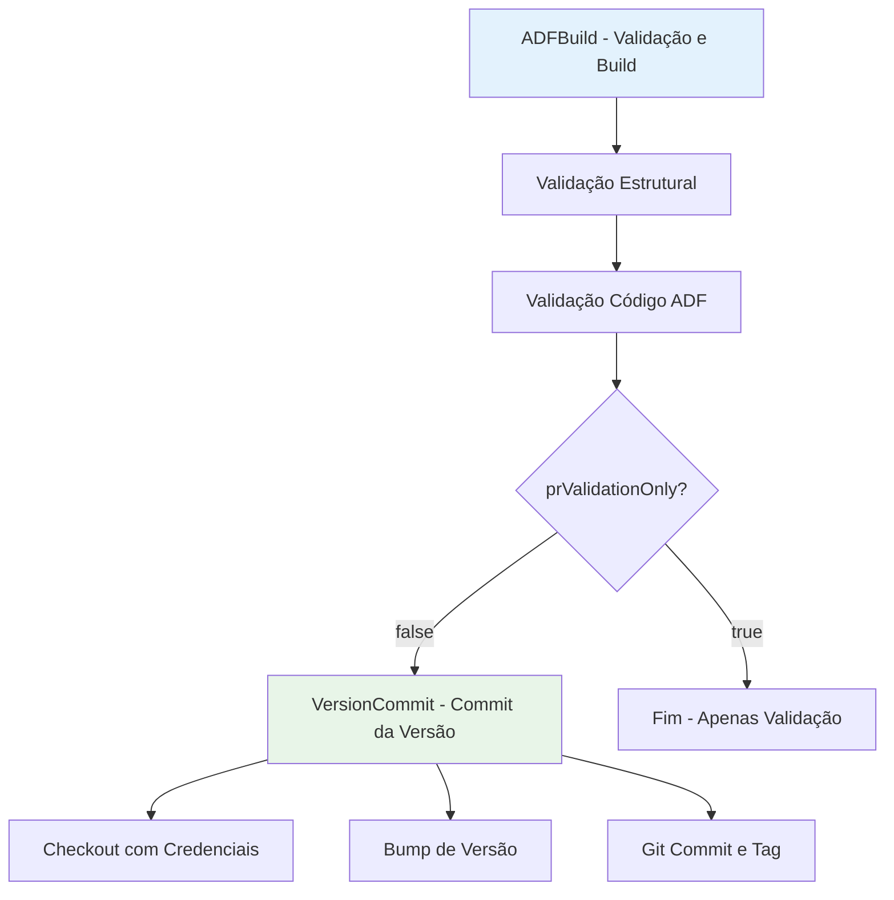

# Build Azure Data Factory

Pipeline de CI/CD para automação do ciclo de build e validação de projetos Azure Data Factory.

## 🎯 Descrição

Pipeline especializado para projetos Azure Data Factory (ADF) que automatiza o ciclo de build e validação, incluindo verificação estrutural, análise de código e versionamento semântico em preparação para deployment em múltiplos ambientes através do pipeline de CD.

Este pipeline utiliza o módulo PowerShell azure.datafactory.tools, garantindo consistência antes do deployment. Suporta diferentes estratégias de versionamento, incluindo Conventional Commits, e oferece modo especial para validação de Pull Requests sem geração de versões.

Ideal para times que trabalham com Azure Data Factory em modelo Git-first, permitindo integração contínua com validações automatizadas e controle de versão eficiente para múltiplos ambientes (dev, staging, produção).

- [Pipeline utilizado para testes](https://dev.azure.com/telefonica-vivo-brasil/DevOps/_build?definitionId=44854)
- [Repositório de exemplo](https://dev.azure.com/telefonica-vivo-brasil/DevOps/_git/teste-build-adf)

## 🚀 Quick Start (5 minutos)

1. Certifique-se de ter um projeto Azure Data Factory no repositório
2. Crie `.azuredevops/azure-pipeline-ci.yml` na raiz
3. Cole o código de exemplo abaixo
4. Commit e push
5. ✅ Pipeline executa automaticamente!
6. Opcional: ajuste triggers conforme necessário

```yaml
# Pipeline básico para build ADF
# .azuredevops/azure-pipeline-ci.yml
resources:
  repositories:
    - repository: CodePlay
      name: DevOps/Vivo.CodePlay.Pipelines
      type: git
      ref: refs/heads/master
      endpoint: CodePlay

extends:
  template: /framework/pipelines/ci/build-adf/pipeline.yaml@CodePlay
```

**O que acontece com esta configuração:**

- 🔍 Validação estrutural automática do projeto ADF
- ✅ Análise de código via Test-AdfCode (PowerShell)
- 🏷️ Versionamento semântico automático (incremento patch)
- 📝 Criação de Git tag com a versão gerada
- 💾 Commit automático do arquivo de versão
- 🚀 Preparação para pipeline de deployment subsequente

### 🚀 Próximos Passos Continuous Deployment (CD)

Após a conclusão bem-sucedida deste pipeline de CI, o próximo passo é realizar o deployment do Azure Data Factory nos ambientes desejados. O CodePlay Framework oferece o pipeline de CD especializado para esta finalidade:

### Pipeline de CD Recomendado

#### [deploy-adf](../../cd/deploy-adf/README.md) - Deploy Azure Data Factory

**Quando usar:** Pipeline especializado para deployment automatizado de projetos ADF em múltiplos ambientes.

**Principais recursos:**
- ✅ Deployment baseado em Git tags geradas por este pipeline de CI
- 🎯 Suporte a múltiplos ambientes (dev, preprod, prod)
- 🔧 Validação pré-deploy com Test-AdfCode
- ⚡ Gerenciamento automático de triggers (parada/reinício)
- 🔍 Suporte a deployment seletivo via filtros
- 🔄 Configuração por parâmetros CSV específicos por ambiente
- 🔒 Aprovações via Azure DevOps Environments

**Exemplo de uso:**
```yaml
# .azuredevops/azure-pipeline-cd.yml
trigger: none

parameters:
- name: version
  displayName: 'Versão da aplicação'
  type: string
  default: getLatestVersion()
- name: environment
  displayName: 'Versão da aplicação'
  type: string
  default: 'dev'
  values:
    - dev
    - prod
resources:
  repositories:
    - repository: CodePlay
      name: DevOps/Vivo.CodePlay.Pipelines
      type: git
      ref: refs/heads/master
      endpoint: CodePlay
  pipelines:
    - pipeline: <nome-exato-do-pipeline-ci>
      source: <nome-exato-do-pipeline-ci>
      trigger:
        branches:
          include:
            - master
            - <outras-branches-que-gostaria-que-iniciem-o-cd>

extends:
  template: /framework/pipelines/cd/deploy-adf/pipeline.yaml@CodePlay
  parameters:
    environment: ${{ parameters.environment }}
    version: ${{ parameters.version }} # usa última tag Git criada pelo CI
```
**Saiba mais:** Consulte a [documentação completa do deploy-adf](../../cd/deploy-adf/README.md) para configuração detalhada e parâmetros avançados.

**Saiba mais:** Consulte a [documentação completa da integração CI/CD ](https://dvps.redecorp.azr/portal/code/casos-de-uso/integrando-cicd#%EF%B8%8F-estrutura-da-integra%C3%A7%C3%A3o) para configuração detalhada e parâmetros avançados.

## 🏗️ Matriz de Capacidades

| Capacidade | Suporte | Descrição |
|------------|---------|-----------|
| [Trunk Based Development](https://dvps.redecorp.azr/portal/codeplay/capacidades/catalog/trunk-based-development) | ✅ | Suportado através de Git branching strategy e versionamento automático. Pipeline pode executar em qualquer branch. Commit de versão condicional via ``prValidationOnly``. |
| [Build Automatizado](https://dvps.redecorp.azr/portal/codeplay/capacidades/catalog/build-automatizado) | ✅ | Validação e preparação automática do projeto ADF com análise de código PowerShell. |
| [Testes Unitários](https://dvps.redecorp.azr/portal/codeplay/capacidades/catalog/testes-unitarios) | ⚠️ | Validação estrutural e de código ADF via Test-AdfCode. Não executa testes unitários tradicionais mas valida sintaxe e estrutura JSON. |
| [SAST](https://dvps.redecorp.azr/portal/codeplay/capacidades/catalog/sast) | ❌ | Não implementado para projetos ADF. Análise de segurança em projetos ADF requer ferramentas específicas não cobertas atualmente. |
| [SCA](https://dvps.redecorp.azr/portal/codeplay/capacidades/catalog/sca) | ❌ | Não aplicável para projetos Azure Data Factory (não possui dependências de pacotes tradicionais). |
| [Gates de Segurança](https://dvps.redecorp.azr/portal/codeplay/capacidades/catalog/gates-de-seguranca) | ❌ | Não implementado. Pipeline foca em validação estrutural e funcional do ADF. |
| [Análise de Código](https://dvps.redecorp.azr/portal/codeplay/capacidades/catalog/analise-de-codigo) | ⚠️ | Test-AdfCode para validação de código ADF (sintaxe, estrutura, boas práticas). Não inclui análise estática tradicional. |
| [Gates de Qualidade](https://dvps.redecorp.azr/portal/codeplay/capacidades/catalog/gate-de-qualidade) | ✅ | Validação estrutural obrigatória e análise de código. Pipeline falha se validações não passarem. |
| [Rollback de Upgrade](https://dvps.redecorp.azr/portal/codeplay/capacidades/catalog/rollback-de-upgrade) | ❎ | Pipeline de CI - não faz sentido habilitar essa capacidade |
| [Blue/Green Deployment](https://dvps.redecorp.azr/portal/codeplay/capacidades/catalog/blue-green-deployment) | ❎ | Pipeline de CI - estratégias de deployment são responsabilidade do CD |
| [Canary Release](https://dvps.redecorp.azr/portal/codeplay/capacidades/catalog/canary-release) | ❎ | Pipeline de CI - estratégias de release são responsabilidade do CD |

**Legenda:**

- ✅ Suportado nativamente
- ❌ Não suportado
- ⚠️ Suportado com limitações ou condições
- 🚧 Planejado / Em Construção
- ❎ Não faz sentido habilitar essa capacidade

## 🔄 Estrutura do Pipeline

O pipeline está organizado em 2 estágios principais, onde o segundo é condicional baseado no parâmetro ``prValidationOnly``. Esta arquitetura permite usar o mesmo template tanto para validação de Pull Requests (apenas validações) quanto para builds de produção (validações + versionamento). O primeiro estágio executa sempre, realizando todas as validações necessárias, enquanto o segundo só executa quando não está em modo de validação de PR, realizando o commit da versão gerada.



### Estágios do Pipeline

1. **🔍 ADFBuild**
   - Validação estrutural do projeto Azure Data Factory
   - Execução de Test-AdfCode para análise de código
   - Verificação de sintaxe e estrutura dos arquivos JSON

2. **🏷️ VersionCommit** (Condicional - apenas quando ``prValidationOnly=false``)
   - Checkout do repositório com credenciais persistidas
   - Bump de versão semântica (patch, minor ou major)
   - Commit e tag Git da versão gerada

## ⚙️ Parâmetros Disponíveis

### Infraestrutura e Ambiente

#### agentPool

- **nome**: agentPool
- **tipo**: string
- **default**: "GeneralPurposeLinuxAgentsCI"
- **descrição**: Define o pool de agentes que será utilizado para execução do pipeline. Deve ser um pool Linux com PowerShell e módulo azure.datafactory.tools instalado.
- **dependências**: Pool de agentes deve estar configurado e disponível no Azure DevOps com PowerShell habilitado.

### Configurações do Projeto ADF

#### workingDirectory

- **nome**: workingDirectory
- **tipo**: string
- **default**: "$(Build.SourcesDirectory)"
- **descrição**: Diretório raiz onde está localizado o projeto ADF. Por padrão usa o diretório de fontes do build, mas pode ser customizado para projetos em subpastas específicas.
- **dependências**: Nenhuma.

#### adfSourcePath

- **nome**: adfSourcePath
- **tipo**: string
- **default**: ""
- **descrição**: Caminho da pasta que contém os artefatos do Azure Data Factory dentro do repositório. Pode ser vazio se estiver na raiz do projeto. Exemplos: ``'adf'``, ``'datafactory'``, ``'src/adf'``. Este caminho é relativo ao ``workingDirectory``.
- **dependências**: Estrutura de pasta do projeto ADF deve existir no caminho especificado.

### Configurações de Versionamento e Controle de Fluxo

#### versionFile

- **nome**: versionFile
- **tipo**: string
- **default**: "version.txt"
- **descrição**: Nome do arquivo onde será armazenada a versão do projeto. O arquivo deve estar na raiz do ``workingDirectory``.
- **dependências**: Nenhuma.

#### branchingStrategy

- **nome**: branchingStrategy
- **tipo**: string
- **default**: "trunkbased"
- **descrição**: Estratégia de branching e versionamento utilizada pelo projeto. Define como o VersionManager irá calcular e gerenciar as versões.
- **valores possíveis**:
  - ``trunkbased``: Trunk Based Development (padrão)
  - ``vivoflow``: Vivo Flow (estratégia customizada Vivo)
  - ``releaseflow``: Release Flow
  - ``gitlabflow``: GitLab Flow
  - ``gitlabflow-semantic``: GitLab Flow com semantic versioning
  - ``custom``: Estratégia customizada
- **dependências**: Nenhuma.

#### prValidationOnly

- **nome**: prValidationOnly
- **tipo**: boolean
- **default**: false
- **descrição**: Quando ``true``, executa apenas validações sem gerar versão ou fazer commits. Ideal para validação em Pull Requests onde queremos apenas verificar se o código está correto. Quando ``false``, executa fluxo completo incluindo versionamento e commit.
- **dependências**: Nenhuma.

#### useConventionalCommits

- **nome**: useConventionalCommits
- **tipo**: boolean
- **default**: false
- **descrição**: Habilita o uso de Conventional Commits para determinação automática do tipo de bump de versão (patch, minor, major). Quando ``false``, sempre incrementa patch. Analisa mensagens de commit desde a última tag para determinar o tipo de mudança.
- **dependências**: Mensagens de commit devem seguir padrão Conventional Commits quando habilitado (feat:, fix:, BREAKING CHANGE:).

## 🔧 Dependências Externas

### Agent Pool Requirements

#### Pool de Agentes

- **Pool padrão**: `GeneralPurposeLinuxAgentsCI`
- **Sistema Operacional**: Linux
- **Ferramentas obrigatórias**:
  - PowerShell Core (para execução de validações ADF)
  - Git (para checkout e operações de versionamento)
  - Módulo PowerShell: azure.datafactory.tools
- **Acesso de rede**:
  - Acesso ao repositório Git do Azure DevOps
  - Acesso ao proxy corporativo se necessário

### Arquivos Obrigatórios no Repositório

#### 1. Projeto Azure Data Factory

- **Localização padrão**: Raiz do repositório ou caminho especificado em ``adfSourcePath``
- **Configurável via**: parâmetro ``adfSourcePath``
- **Requisitos**:
  - Estrutura válida de projeto Azure Data Factory
  - Arquivos JSON com sintaxe correta
  - Pastas padrão do ADF (pipeline, dataset, linkedService, etc.)
- **Comportamento**: Pipeline falha se estrutura não for válida

#### 2. Arquivo de Versão

- **Localização padrão**: ``version.txt`` na raiz do ``workingDirectory``
- **Configurável via**: parâmetro ``versionFile``
- **Requisitos**:
  - Formato de versão semântica (X.Y.Z)
- **Comportamento**: Se não existir, será criado automaticamente com versão ``0.0.1``

### Service Connections Necessárias

Nenhuma service connection é necessária para este pipeline. As operações Git utilizam as credenciais do pipeline automaticamente.

### Permissões de Repositório Git

- **Permissão de escrita** no repositório Git (quando ``prValidationOnly=false``)
- **Capacidade de criar tags** Git
- **Checkout com ``persistCredentials: true``** (configurado automaticamente no estágio VersionCommit)

### Dependências de Templates Internos

O pipeline utiliza os seguintes templates do CodePlay Framework:

- Nenhum template adicional é utilizado - pipeline implementa lógica diretamente

## 🎨 Comportamentos Customizados

:::danger
**⚠️ ATENÇÃO: CUSTOMIZAÇÕES REQUEREM RESPONSABILIDADE ⚠️**

- ✅ **Use os exemplos como ponto de partida** - Eles demonstram padrões seguros e testados
- 🧠 **"Todos somos adultos"** - Confiamos na sua expertise, mas exigimos consciência do impacto
- 📝 **Tudo fica registrado** - Seu histórico de commits é auditável e rastreável
- 🎯 **Entenda antes de modificar** - Customizações incorretas podem quebrar builds em produção
- 🤝 **Documente suas decisões** - Facilite a manutenção futura por outros membros da equipe

**Customizar é permitido. Fazer sem entender não é.**
:::

### 📝 Validação de Pull Request - Modo Somente Validação

Para usar em Pull Requests onde não queremos gerar versões nem commits:

```yaml
# .azuredevops/pipelines/pr-validation.yaml
resources:
  repositories:
    - repository: CodePlay
      name: DevOps/Vivo.CodePlay.Pipelines
      type: git
      ref: refs/heads/master
      endpoint: CodePlay

extends:
  template: /framework/pipelines/ci/build-adf/pipeline.yaml@CodePlay
  parameters:
    prValidationOnly: true               # Executa apenas validações
    adfSourcePath: "datafactory"         # ADF está em subpasta
```

### 🔧 Projeto ADF em Subpasta com Conventional Commits

Para projetos organizados em subpastas com versionamento automático baseado em commits:

```yaml
# .azuredevops/azure-pipeline-ci.yml
resources:
  repositories:
    - repository: CodePlay
      name: DevOps/Vivo.CodePlay.Pipelines
      type: git
      ref: refs/heads/master
      endpoint: CodePlay

extends:
  template: /framework/pipelines/ci/build-adf/pipeline.yaml@CodePlay
  parameters:
    adfSourcePath: 'src/datafactory'      # ADF em subpasta específica
    useConventionalCommits: true          # Usa conventional commits para bump automático
    versionFile: 'version'                # Arquivo de versão customizado (sem extensão)
```

## 🔖 Variáveis de Ambiente

As seguintes variáveis de ambiente são automaticamente configuradas pelo pipeline:

| Variável | Descrição | Valor Padrão |
|----------|-----------|--------------|
| `SIGLA` | Sigla do projeto extraída automaticamente do nome do Team Project | `$[ lower(split(variables['System.TeamProject'],' ')[0]) ]` |
| `ADF_FULL_PATH` | Caminho completo para a pasta do ADF combinando workingDirectory e adfSourcePath | `${{ parameters.workingDirectory }}/${{ parameters.adfSourcePath }}` |

**Nota**: Estas variáveis são calculadas dinamicamente e não devem ser sobrescritas manualmente.

## ❓ FAQ

### Onde posso encontrar mais informações sobre o CodePlay Framework?

Você pode encontrar mais informações sobre o CodePlay Framework na [documentação oficial](https://dvps.redecorp.azr/portal/codeplay/framework/).

### Onde encontro as capacidades disponíveis?

As capacidades disponíveis podem ser encontradas no [Catálogo de Capacidade](https://dvps.redecorp.azr/portal/catalog/capabilities) no Portal CodePlay.

### Como faço para customizar o pipeline?

Siga o guia de [Adoção ao CodePlay](https://dvps.redecorp.azr/portal/codeplay/roteiro/codeplay#fluxo-de-ado%C3%A7%C3%A3o-ao-codeplay).

### Quais casos de uso relevantes?

- Veja o [Catálogo de Casos de Uso](https://dvps.redecorp.azr/portal/catalog/casos-de-uso) para exemplos de casos de uso.

### Quais Erros Comuns relevantes?

- Ainda não temos nenhum erro comum documentado para este pipeline.
- Veja o [Catálogo de Erros Conhecidos](https://dvps.redecorp.azr/portal/catalog/erros-conhecidos) para outros exemplos de erros.

## 🆘 Suporte

- [Abra um chamado para Dev Support](https://dvps.redecorp.azr/portal/codeplay/roteiro/#:~:text=Abra%20um%20chamado%20para%20Dev%20Support)
- [Canal DevEx - Azure DevOps](https://teams.microsoft.com/l/channel/19%3A8fbd00946cf044d7a844182ac71e6aa1%40thread.tacv2/Azure%20DevOps?groupId=038b4415-d6dd-42ce-92e5-31a8e2a13bf8&tenantId=9744600e-3e04-492e-baa1-25ec245c6f10)

## 📝 Decisões Tomadas

### Decisão 1: Uso de Dois Estágios Separados

- **Data**: Implementação inicial do template
- **Motivador**: Necessidade de separar validação (que pode rodar em PRs) do versionamento (que só deve rodar em branches principais)
- **Fórum Envolvido**: Equipe de DevOps CodePlay Framework
- **Descrição**: Separação do pipeline em dois estágios: ADFBuild (sempre executa) e VersionCommit (condicional). O parâmetro ``prValidationOnly`` controla se o segundo estágio deve executar, permitindo usar o mesmo template tanto para validação de PRs quanto para builds de produção, evitando duplicação de código.

### Decisão 2: Validação Estrutural Flexível

- **Data**: Implementação inicial do template
- **Motivador**: Diferentes organizações de projetos ADF nos repositórios
- **Fórum Envolvido**: Análise de projetos ADF existentes na organização
- **Descrição**: Implementação de validação estrutural que aceita diferentes padrões de organização, verificando presença de arquivos essenciais sem forçar estrutura rígida demais, balanceando validação rigorosa com flexibilidade de adoção.

### Decisão 3: Utilização da biblioteca PowerShell azure.datafactory.tools

- **Data**: Durante desenvolvimento do template
- **Motivador**: Necessidade de suportar CI/CD para projetos ADF ligados a repositórios Git
- **Fórum Envolvido**: Equipe DevOps CodePlay Framework
- **Descrição**: A biblioteca azure.datafactory.tools oferece diversas opções importante tais como deploy a partir de arquivo JSON (em vez de arquivos ARM), gerenciamento de objetos órfãos, maior automação em relação à estratégia padrão indicada pela Microsoft, dentre outros. A extensão "Deploy Azure Data Factory (#adftools)" do Azure DevOps, baseada na biblioteca azure.datafactory.tools, não oferece suporte ao Linux, portanto seu uso foi descartado. Referência: [Two methods of deployment Azure Data Factory](https://azureplayer.net/2021/01/two-methods-of-deployment-azure-data-factory/).