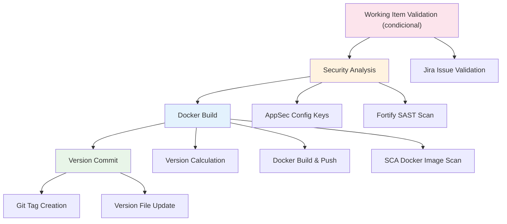

# Build Docker

Pipeline de CI para construção e publicação de imagens Docker.

## 🎯 Descrição

Pipeline de CI/CD para construção e publicação de imagens Docker. Este pipeline automatiza o processo de build de imagens Docker a partir de um repositório de código, incluindo versionamento automático, análise de segurança opcional e publicação no Azure Container Registry (ACR). O pipeline é ideal para aplicações que precisam ser containerizadas e distribuídas através de imagens Docker.

- [Pipeline utilizado para testes](https://dev.azure.com/telefonica-vivo-brasil/DevOps/_build?definitionId=44855)
- [Repositório de exemplo](https://dev.azure.com/telefonica-vivo-brasil/DevOps/_git/teste-build-docker)

## 🚀 Quick Start (5 minutos)

1. Crie os arquivos necessários no seu repositório (Veja [Dependências Externas](#-dependências-externas))
2. Crie `.azuredevops/azure-pipeline-ci.yml` na raiz
3. Cole o código de exemplo
4. Commit e push
5. ✅ Pipeline executa automaticamente!
6. Opcional: ajuste triggers

```yaml
# .azuredevops/azure-pipeline-ci.yml
# Pipeline básico para build Docker
resources:
  repositories:
    - repository: CodePlay
      name: DevOps/Vivo.CodePlay.Pipelines
      type: git
      ref: refs/heads/master
      endpoint: CodePlay

extends:
  template: /framework/pipelines/ci/build-docker/pipeline.yaml@CodePlay
```

**O que acontece com esta configuração:**

- 🔐 Obtenção de feature flags AppSec via Azure App Configuration
- 🔒 Análise SAST (Fortify) condicional baseada em configuração
- 🐳 Build da imagem Docker usando o Dockerfile na raiz
- 🔍 Análise SCA da imagem Docker via Dependency Track (condicional)
- 📋 Nome da imagem: `{sigla}/{nome-repositorio}`
- 🏷️ Versionamento automático (incremento patch)
- 📤 Push para ACR usando service connection "ACR-DEVOPS"
- 📝 Commit automático da nova versão

### 🚀 Próximos Passos Continuous Deployment (CD)

Após o build e publicação da imagem Docker no Azure Container Registry, o próximo passo é realizar o deployment da aplicação nos ambientes desejados. O CodePlay Framework oferece múltiplas opções de CD dependendo da sua infraestrutura:

### Pipelines de CD Disponíveis

#### [deploy-helm](../../cd/deploy-helm/README.md) - Deploy via Kubernetes/Helm

**Quando usar:** Para aplicações containerizadas em clusters Kubernetes (AKS, OpenShift ou genéricos).

**Principais recursos:**
- ☸️ Deploy automatizado via Helm Charts
- 🎯 Suporte a múltiplos ambientes e clusters
- 🔄 Rollback automático em falha
- 📊 Comparação visual de mudanças (kubectl diff)
- 🔵 Blue/Green Deployment via Argo Rollouts
- 🔒 Aprovações via Azure DevOps Environments

**Exemplo de uso:**
```yaml
# .azuredevops/azure-pipeline-cd.yml

trigger: none

parameters:
- name: version
  displayName: 'Versão da aplicação'
  type: string
  default: getLatestVersion()
- name: environment
  displayName: 'Versão da aplicação'
  type: string
  default: 'dev'
  values:
    - dev
    - prod
resources:
  repositories:
    - repository: CodePlay
      name: DevOps/Vivo.CodePlay.Pipelines
      type: git
      ref: refs/heads/master
      endpoint: CodePlay

extends:
  template: /framework/pipelines/cd/deploy-helm/pipeline.yaml@CodePlay
  parameters:
    environment: dev
    version: getLatestVersion()
    helmChartName: generic-microservice
    helmChartVersion: 1.0.26
```

#### [deploy-ssh](../../cd/deploy-ssh/README.md) - Deploy via SSH

**Quando usar:** Para servidores tradicionais sem Kubernetes, ou aplicações que rodam diretamente em VMs.

**Principais recursos:**
- 🔐 Deployment via SSH seguro
- 📦 Download automático de artifacts
- 💾 Backup automático da versão anterior
- 📤 Transferência via SCP
- 🔄 Rollback automático em falha
- 🔍 Validação pós-deploy customizável

**Exemplo de uso:**
```yaml
# .azuredevops/azure-pipeline-cd.yml
resources:
  repositories:
    - repository: CodePlay
      name: DevOps/Vivo.CodePlay.Pipelines
      type: git
      ref: refs/heads/master
      endpoint: CodePlay
  pipelines:
    - pipeline: <nome-exato-do-pipeline-ci>
      source: <nome-exato-do-pipeline-ci>
      trigger:
        branches:
          include:
            - master
            - <outras-branches-que-gostaria-que-iniciem-o-cd>

extends:
  template: /framework/pipelines/cd/deploy-ssh/pipeline.yaml@CodePlay
  parameters:
    environment: dev

```
**Saiba mais:** Consulte a documentação completa de cada pipeline de CD para configuração detalhada e parâmetros avançados.

**Saiba mais:** Consulte a [documentação completa da integração CI/CD ](https://dvps.redecorp.azr/portal/code/casos-de-uso/integrando-cicd#%EF%B8%8F-estrutura-da-integra%C3%A7%C3%A3o) para configuração detalhada e parâmetros avançados.

## 🏗️ Matriz de Capacidades

| Capacidade | Suporte | Descrição |
|------------|---------|-----------|
| [Trunk Based Development](https://dvps.redecorp.azr/portal/codeplay/capacidades/catalog/trunk-based-development) | ✅ | Pipeline executado em qualquer branch. Commit de versão condicional via `prValidationOnly` |
| [Validação de Working Item (Jira)](https://dvps.redecorp.azr/portal/codeplay/capacidades/catalog/working-item-validation) | ⚠️ | Verificação de vínculo com issue Jira em commits, branches e PRs. Habilitado via `enableWorkingItemValidation=true`. Configurável com restrição de projetos, tipos de issue e status via `jiraAllowedProjects`, `jiraAllowedIssueTypes` e `jiraAllowedStatuses`. |
| [Build Automatizado](https://dvps.redecorp.azr/portal/codeplay/capacidades/catalog/build-automatizado) | ✅ | Build Docker com BuildKit e push para ACR configurável via `registryServiceConnection` |
| [Testes Unitários](https://dvps.redecorp.azr/portal/codeplay/capacidades/catalog/testes-unitarios) | ❌ | Não implementado. Pipeline focado em build e segurança |
| [SAST](https://dvps.redecorp.azr/portal/codeplay/capacidades/catalog/sast) | ✅ | Fortify ScanCentral condicional via Azure App Configuration. Exclusões via `enableFortifyExclusions` |
| [SCA](https://dvps.redecorp.azr/portal/codeplay/capacidades/catalog/sca) | ✅ | Análise de imagem Docker condicional via feature flag `USE_DT_DOCKER`. Integrada ao template docker-build-and-push via Dependency Track |
| [Gates de Segurança](https://dvps.redecorp.azr/portal/codeplay/capacidades/catalog/gates-de-seguranca) | ✅ | Controlados pela equipe de AppSec |
| [Análise de Código](https://dvps.redecorp.azr/portal/codeplay/capacidades/catalog/analise-de-codigo) | ✅ | SAST via Fortify e SCA via Dependency Track |
| [Gates de Qualidade](https://dvps.redecorp.azr/portal/codeplay/capacidades/catalog/gate-de-qualidade) | ❌ | Não implementado. Pipeline não valida cobertura ou métricas de código |
| [Rollback de Upgrade](https://dvps.redecorp.azr/portal/codeplay/capacidades/catalog/rollback-de-upgrade) | ❎ | Pipeline de CI - não aplicável para rollback de deploy |
| [Blue/Green Deployment](https://dvps.redecorp.azr/portal/codeplay/capacidades/catalog/blue-green-deployment) | ❎ | Pipeline de CI - estratégias de deployment são responsabilidade do CD |
| [Canary Release](https://dvps.redecorp.azr/portal/codeplay/capacidades/catalog/canary-release) | ❎ | Pipeline de CI - estratégias de release são responsabilidade do CD |

**Legenda:**

- ✅ Suportado nativamente
- ❌ Não suportado
- ⚠️ Suportado com limitações ou condições
- 🚧 Planejado / Em Construção
- ❎ Não faz sentido habilitar essa capacidade

## 🔄 Estrutura do Pipeline

O pipeline é organizado em até quatro estágios sequenciais: o estágio condicional WorkItemValidation executa primeiro quando habilitado, depois SecurityAnalysis valida segurança, seguido pelo DockerBuild e finalmente o VersionCommit:



### Estágios do Pipeline

1. **🎫 Working Item Validation** (Condicional - apenas quando `enableWorkingItemValidation=true`)
   - Verificação de presença de chave de issue Jira em commits, branches e/ou PRs
   - Validação de projeto, tipo de issue e status permitidos
   - Falha rápida antes das etapas de segurança e build em caso inválido
   - Comportamento em falha configurável: interromper (`fail`) ou apenas avisar (`warn`)

2. **🔍 Security Analysis**
   - Obtenção de configurações AppSec via Azure App Configuration (feature flags)
   - Execução condicional de análise SAST (Fortify) baseada em feature flags
   - Exporta variáveis de segurança para stages subsequentes

3. **🐳 Docker Build** (Depende do Security Analysis)
   - Cálculo automático da próxima versão semântica
   - Construção da imagem Docker com BuildKit
   - Execução de análise SCA na imagem Docker via template `run_sca_scan_docker.yml` (chamado pelo `docker-build-and-push.yaml`)
   - Publicação no Azure Container Registry

4. **📝 Version Commit** (Condicional - apenas quando `prValidationOnly=false`)
   - Commit da nova versão no arquivo de versão
   - Criação de tag Git com a versão gerada


## ⚙️ Parâmetros Disponíveis

### Infraestrutura e Ambiente

#### agentPool

- **nome**: agentPool
- **tipo**: string
- **default**: "GeneralPurposeLinuxAgentsCI"
- **descrição**: Pool de agentes Azure DevOps onde o pipeline será executado. Deve ter Docker e Git instalados.
- **dependências**: Acesso ao pool de agentes especificado no Azure DevOps.

#### useNetworkProxy

- **nome**: useNetworkProxy
- **tipo**: boolean
- **default**: false
- **descrição**: Configurar proxy de rede para acesso externo. Deve ser `true` para pipelines executados em pools de agentes on-premises como "VivoOnPremDevAgents", "VivoOnPremHmlAgents" e "VivoOnPremPrdAgents".
- **dependências**: Nenhuma.

#### workingDirectory

- **nome**: workingDirectory
- **tipo**: string
- **default**: '$(Build.SourcesDirectory)'
- **descrição**: Diretório de trabalho usado pelo pipeline para localizar código e arquivos (ex.: `version.txt`).
- **dependências**: Caminho deve existir no agente.

### Configurações de Docker

#### imageName

- **nome**: imageName
- **tipo**: string
- **default**: `$(SIGLA)/$(Build.Repository.Name)`
- **descrição**: Nome da imagem Docker que será criada. Segue o padrão `sigla/repositorio` para organização.
- **dependências**: Nenhuma.

#### dockerfilePath

- **nome**: dockerfilePath
- **tipo**: string
- **default**: "Dockerfile"
- **descrição**: Caminho relativo para o Dockerfile a partir da raiz do repositório.
- **dependências**: Dockerfile deve existir no caminho especificado.

#### registryServiceConnection

- **nome**: registryServiceConnection
- **tipo**: string
- **default**: "ACR-DEVOPS"
- **descrição**: Nome da service connection do Azure Container Registry onde a imagem será publicada.
- **dependências**: Service connection configurada no Azure DevOps com permissões de push para o ACR.

#### loginRegistryServiceConnections

- **nome**: loginRegistryServiceConnections
- **tipo**: object (lista)
- **default**: `[ACR-DEVOPS]`
- **descrição**: Lista de service connections usadas para autenticação (`docker login`) em registries adicionais durante o build. O uso é recomendado apenas em cenários especiais, como pull de imagem base em registry externo.
- **dependências**: Cada service connection informada deve existir no projeto Azure DevOps e possuir permissão de autenticação no respectivo registry.
- **observação**: Conforme a política de proveniência de imagens, o padrão corporativo é utilizar imagens presentes no `acrsharedservices01.azurecr.io (ACR-DEVOPS)`: [Image Provenance](https://dvps.redecorp.azr/portal/code/policies/catalog/image-provenance)

### Configurações de Capacidades

#### enableFortifyExclusions

- **nome**: enableFortifyExclusions
- **tipo**: boolean
- **default**: false
- **descrição**: Habilita o checkout do repositório de exclusões Fortify durante a análise SAST. Quando ativado, permite usar configurações de exclusão personalizadas.
- **dependências**: Repositório de exclusões deve existir quando habilitado.
- **observação**: Procure o time de AppSec para mais detalhes sobre a integração.

#### convisoCompany

- **nome**: convisoCompany
- **tipo**: string
- **default**: `'430'`
- **descrição**: Identificador da empresa no Conviso utilizado pelas integrações de AppSec durante as análises de segurança.
- **dependências**: Integração Conviso habilitada e chaves/capacidades de segurança configuradas via AppSec para o projeto.

### Configurações de Validação de Working Item (Jira)

#### enableWorkingItemValidation

- **nome**: enableWorkingItemValidation
- **tipo**: boolean
- **default**: false
- **descrição**: Habilita o estágio `WorkItemValidation`, que executa antes da análise de segurança e verifica se commits, branches e/ou PRs contêm referência a uma issue Jira válida. Quando ativado, o pipeline falha rapidamente caso nenhuma chave Jira seja encontrada ou a issue não atenda aos critérios configurados.
- **dependências**: Service connection `jiraServiceConnection` configurada no projeto Azure DevOps.

#### jiraAllowedProjects

- **nome**: jiraAllowedProjects
- **tipo**: string
- **default**: `''` (sem restrição de projeto)
- **descrição**: Lista separada por vírgulas das chaves de projetos Jira aceitos (ex: `PROJ,CORE,PLAT`). Quando preenchido, apenas issues pertencentes a esses projetos são consideradas válidas. Deixe vazio para aceitar issues de qualquer projeto.
- **dependências**: `enableWorkingItemValidation: true`

#### jiraAllowedIssueTypes

- **nome**: jiraAllowedIssueTypes
- **tipo**: string
- **default**: `''` (sem restrição de tipo)
- **descrição**: Lista separada por vírgulas dos tipos de issue Jira aceitos (ex: `Story,Bug,Task`). Quando preenchido, apenas issues desses tipos são consideradas válidas. Deixe vazio para aceitar qualquer tipo.
- **dependências**: `enableWorkingItemValidation: true`

#### jiraAllowedStatuses

- **nome**: jiraAllowedStatuses
- **tipo**: string
- **default**: `''` (sem restrição de status)
- **descrição**: Lista separada por vírgulas dos status de issue Jira aceitos (ex: `In Progress,In Review`). Quando preenchido, apenas issues com esses status são consideradas válidas. Útil para garantir que apenas issues ativas sejam associadas a commits e branches.
- **dependências**: `enableWorkingItemValidation: true`

#### jiraOnValidationFailure

- **nome**: jiraOnValidationFailure
- **tipo**: string
- **default**: `'fail'`
- **valores possíveis**:
  - `fail`: Interrompe o pipeline com erro quando a validação Jira falha (padrão recomendado)
  - `warn`: Emite um aviso no log mas continua a execução normalmente
- **descrição**: Define o comportamento do pipeline quando a validação Jira não passa. Use `warn` para adoção gradual em projetos existentes, garantindo visibilidade dos problemas sem bloquear o pipeline.
- **dependências**: `enableWorkingItemValidation: true`

#### jiraCheckMode

- **nome**: jiraCheckMode
- **tipo**: string
- **default**: `'all'`
- **valores possíveis**:
  - `all`: Verifica commit, branch e título/descrição do PR (padrão)
  - `commit`: Apenas a mensagem do commit
  - `branch`: Apenas o nome da branch
  - `pr`: Apenas o título ou descrição do Pull Request
  - `commit+branch`: Commit e branch, sem verificar PR
  - `commit+pr`: Commit e PR, sem verificar branch
  - `branch+pr`: Branch e PR, sem verificar commit
- **descrição**: Define em quais artefatos do ciclo de vida Git a chave de issue Jira deve ser buscada. Permite controle granular sobre onde a rastreabilidade é exigida.
- **dependências**: `enableWorkingItemValidation: true`

### Configurações de Versionamento

#### versionFile

- **nome**: versionFile
- **tipo**: string
- **default**: "version.txt"
- **descrição**: Nome do arquivo onde a versão atual será lida e a nova versão será salva.
- **dependências**: Arquivo deve conter uma versão válida no formato SemVer (ex: 1.0.0).

#### branchingStrategy

- **nome**: branchingStrategy
- **tipo**: string
- **default**: "trunkbased"
- **descrição**: Estratégia de branching e versionamento utilizada pelo projeto. Define como o VersionManager irá calcular e gerenciar as versões.
- **valores possíveis**:
  - ``trunkbased``: Trunk Based Development (padrão)
  - ``vivoflow``: Vivo Flow (estratégia customizada Vivo)
  - ``releaseflow``: Release Flow
  - ``gitlabflow``: GitLab Flow
  - ``gitlabflow-semantic``: GitLab Flow com semantic versioning
  - ``custom``: Estratégia customizada
- **dependências**: Nenhuma.

#### prValidationOnly

- **nome**: prValidationOnly
- **tipo**: boolean
- **default**: false
- **descrição**: Quando `true`, o pipeline executa apenas validações (ex.: PR validation) e NÃO publica nem gera versão nem realiza commit da versão. Uso típico: validações em branches de PR.
- **dependências**: Para commit de versão ou push é necessário `persistCredentials: true` em checkout e permissões de push no repositório.


## 🔧 Dependências Externas

### Service Connections Necessárias

#### 1. Azure Container Registry (ACR)

- **Nome padrão**: `ACR-DEVOPS`
- **Tipo**: Docker Registry
- **Uso**: Publicação de imagens Docker
- **Permissões necessárias**:
  - Push de imagens
  - Pull de imagens (para cache)
- **Configurável via**: parâmetro `registryServiceConnection`
- **Política corporativa**: O padrão é utilizar imagens presentes no `ACR-DEVOPS`, conforme política de proveniência: [Image Provenance](https://dvps.redecorp.azr/portal/code/policies/catalog/image-provenance)

#### 2. Jira (Validação de Working Item)

- **Nome fixo**: `jiraServiceConnection`
- **Tipo**: Jira (serviço genérico ou extensão Jira no Azure DevOps)
- **Uso**: Autenticação na API Jira para consulta de issues durante o estágio `WorkItemValidation`
- **Permissões necessárias**: Leitura de issues nos projetos a serem validados
- **Obrigatório apenas quando**: `enableWorkingItemValidation: true`
- **Observação**: O nome da service connection é fixo (`jiraServiceConnection`) e deve ser criado com exatamente esse nome no projeto Azure DevOps.

### Agent Pool Requirements

#### Pool de Agentes

- **Pool padrão**: `GeneralPurposeLinuxAgentsCI`
- **Sistema Operacional**: Linux
- **Ferramentas obrigatórias**:
  - Docker Engine (com BuildKit habilitado)
  - Git (para checkout e operações de versionamento)
  - Azure CLI (para autenticação com ACR)
- **Acesso de rede**:
  - Acesso ao Azure Container Registry
  - Acesso ao proxy corporativo: `10.240.58.39:3128`
  - Acesso ao Azure Key Vault: `kv-azdevops-shared`

### Arquivos Obrigatórios no Repositório

#### 1. Dockerfile

- **Localização padrão**: Raiz do repositório
- **Configurável via**: parâmetro `dockerfilePath`
- **Requisitos**:
  - Sintaxe válida do Dockerfile
  - Compatível com BuildKit
  - Suporte a build args: `APPLICATION_NAME`, `APP_VERSION`, `VERSION`

#### 2. version.txt (Opcional)

- **Localização padrão**: Raiz do repositório
- **Configurável via**: parâmetro `versionFile`
- **Formato**: Semantic Versioning (ex: `1.0.0`)
- **Comportamento**: Se não existir, será criado automaticamente com versão `0.0.1`

### Integrações Externas de Segurança

#### 1. Azure App Configuration

- **Descrição**: Centraliza feature flags e configurações de segurança (AppSec)
- **Requisitos**:
  - Service connection `DevOpsSharedResources` configurada
  - Acesso ao endpoint: `https://appcs-azdevops-shared.azconfig.io`
- **Feature Flags gerenciadas**:
  - `USE_FORTIFY`: Habilita/desabilita análise Fortify SAST
  - `USE_CONVISO`: Habilita integração com Conviso
  - `USE_DT_DOCKER`: Habilita análise SCA de imagem Docker
  - `SKIP_SECURITY_GATE`: Controla execução de gates de segurança
  - `SKIP_SECURITY_GATE_SCA`: Controla gate específico de SCA

#### 2. Fortify ScanCentral (SAST)

- **Descrição**: Análise estática de código para identificação de vulnerabilidades
- **Requisitos**:
  - Acesso ao servidor Fortify ScanCentral
  - Credenciais configuradas no Azure Key Vault (`kv-azdevops-shared`)
- **Condicional**: Executado apenas se feature flag `USE_FORTIFY = true`
- **Opcional**: Repositório de exclusões Fortify
  - Configurável via: `enableFortifyExclusions`
  - Permite customizar regras de análise

#### 3. Dependency Track (SCA)

- **Descrição**: Análise de composição de software para identificação de vulnerabilidades em imagens Docker
- **Requisitos**:
  - Acesso ao servidor Dependency Track (`https://sca.redecorp.br/api`)
  - Credenciais configuradas no Azure Key Vault (`DEPENDENCY-TRACK-TOKEN`, `CONVISO-API-KEY`)
  - Syft instalado para geração de SBOM
- **Condicional**: Executado via template `run_sca_scan_docker.yml` (chamado pelo `docker-build-and-push.yaml`) apenas se feature flag `USE_DT_DOCKER = true`

### Permissões de Repositório Git

Para o estágio de **Version Commit**:

- **Permissão de escrita** no repositório Git
- **Capacidade de criar tags**
- **Checkout com `persistCredentials: true`** (configurado automaticamente quando `prValidationOnly = false`)

### Azure Key Vault

#### kv-azdevops-shared

- **Uso**: Armazenamento de secrets para integrações de segurança
- **Secrets esperados**:
  - Credenciais Fortify ScanCentral
  - Credenciais Dependency Track
  - Tokens de integração com Conviso (se aplicável)

### Variáveis de Sistema Necessárias

| Variável | Origem | Uso |
|----------|--------|-----|
| `System.TeamProject` | Azure DevOps | Geração automática da SIGLA |
| `Build.SourcesDirectory` | Azure DevOps | Diretório de trabalho padrão |
| `Build.Repository.Name` | Azure DevOps | Nome da imagem Docker |

### Dependências de Templates Internos

O pipeline utiliza os seguintes templates do CodePlay Framework:

- `/security/get_appconfig_keys.yml` - Obtenção de feature flags AppSec
- `/security/define_appsec_app_version.yml` - Definição de versão para AppSec
- `/security/run_fortify_scan.yml` - Análise Fortify SAST
- `/security/run_sca_scan_docker.yml` - Análise SCA de imagem Docker (chamado via template docker-build-and-push)
- `/framework/templates/docker-build-and-push.yaml` - Build e push de imagens Docker

## 🎨 Comportamentos Customizados

:::danger
**⚠️ ATENÇÃO: CUSTOMIZAÇÕES REQUEREM RESPONSABILIDADE ⚠️**

- ✅ **Use os exemplos como ponto de partida** - Eles demonstram padrões seguros e testados
- 🧠 **"Todos somos adultos"** - Confiamos na sua expertise, mas exigimos consciência do impacto
- 📝 **Tudo fica registrado** - Seu histórico de commits é auditável e rastreável
- 🎯 **Entenda antes de modificar** - Customizações incorretas podem quebrar builds em produção
- 🤝 **Documente suas decisões** - Facilite a manutenção futura por outros membros da equipe

**Customizar é permitido. Fazer sem entender não é.**
:::

### Docker Registry Personalizado


```yaml
# .azuredevops/azure-pipeline-ci.yml
resources:
  repositories:
    - repository: CodePlay
      name: DevOps/Vivo.CodePlay.Pipelines
      type: git
      ref: refs/heads/master
      endpoint: CodePlay

extends:
  template: /framework/pipelines/ci/build-docker/pipeline.yaml@CodePlay
parameters:
  registryServiceConnection: "ACR-PRODUCAO" # Registry diferente
  imageName: "minha-empresa/minha-aplicacao" # Nome customizado
  dockerfilePath: "docker/Dockerfile" # Dockerfile em subdiretório
```

### Sem Commit de Versão

```yaml
# .azuredevops/azure-pipeline-ci.yml
resources:
  repositories:
    - repository: CodePlay
      name: DevOps/Vivo.CodePlay.Pipelines
      type: git
      ref: refs/heads/master
      endpoint: CodePlay

extends:
  template: /framework/pipelines/ci/build-docker/pipeline.yaml@CodePlay
parameters:
  prValidationOnly: true # Executa apenas validações (não publica, não gera versão nem faz commit)
```

### Pool de Agentes Específico

```yaml
# .azuredevops/azure-pipeline-ci.yml
resources:
  repositories:
    - repository: CodePlay
      name: DevOps/Vivo.CodePlay.Pipelines
      type: git
      ref: refs/heads/master
      endpoint: CodePlay

extends:
  template: /framework/pipelines/ci/build-docker/pipeline.yaml@CodePlay
  parameters:
    agentPool: "MeuPoolPersonalizado" # Pool específico para Docker
```

### Análise SAST com Exclusões Customizadas

```yaml
# .azuredevops/azure-pipeline-ci.yml
resources:
  repositories:
    - repository: CodePlay
      name: DevOps/Vivo.CodePlay.Pipelines
      type: git
      ref: refs/heads/master
      endpoint: CodePlay
    - repository: FortifyExclusion
      name: DevOps/Vivo.Fortify.Exclusions
      type: git
      ref: refs/heads/master
      endpoint: CorePipelines

extends:
  template: /framework/pipelines/ci/build-docker/pipeline.yaml@CodePlay
  parameters:
    enableFortifyExclusions: true # Habilita checkout de exclusões Fortify
```

### Validação de Working Item Jira - Ativação Básica

Habilita o estágio de validação Jira com todas as configurações padrão. Verifica se o commit, a branch e o PR contêm uma chave de issue Jira (qualquer projeto, tipo ou status).

```yaml
# .azuredevops/azure-pipeline-ci.yml
resources:
  repositories:
    - repository: CodePlay
      name: DevOps/Vivo.CodePlay.Pipelines
      type: git
      ref: refs/heads/master
      endpoint: CodePlay

extends:
  template: /framework/pipelines/ci/build-docker/pipeline.yaml@CodePlay
  parameters:
    enableWorkingItemValidation: true
```

**Comportamento esperado:** O pipeline executa um estágio `WorkItemValidation` antes de qualquer build ou análise de segurança. Se nenhuma chave Jira for encontrada no commit, branch ou PR, o pipeline falha imediatamente.

---

### Validação de Working Item Jira - Apenas Projeto e Tipo Específicos

Restringe a validação para aceitar somente issues dos projetos `PLAT` e `CORE`, do tipo `Story` ou `Task`, sem restrição de status.

```yaml
# .azuredevops/azure-pipeline-ci.yml
resources:
  repositories:
    - repository: CodePlay
      name: DevOps/Vivo.CodePlay.Pipelines
      type: git
      ref: refs/heads/master
      endpoint: CodePlay

extends:
  template: /framework/pipelines/ci/build-docker/pipeline.yaml@CodePlay
  parameters:
    enableWorkingItemValidation: true
    jiraAllowedProjects: 'PLAT,CORE'       # Apenas issues desses projetos
    jiraAllowedIssueTypes: 'Story,Task'    # Apenas Story ou Task
```

**Comportamento esperado:** Uma chave como `BUG-123` ou `OUTRO-456` será rejeitada. Somente `PLAT-123` ou `CORE-456` do tipo Story ou Task passarão na validação.

---

### Validação de Working Item Jira - Apenas Issues em Andamento

Garante que apenas issues com status `In Progress` ou `In Review` possam ser associadas a commits. Útil para evitar referências a issues que ainda não foram iniciadas ou já foram concluídas.

```yaml
# .azuredevops/azure-pipeline-ci.yml
resources:
  repositories:
    - repository: CodePlay
      name: DevOps/Vivo.CodePlay.Pipelines
      type: git
      ref: refs/heads/master
      endpoint: CodePlay

extends:
  template: /framework/pipelines/ci/build-docker/pipeline.yaml@CodePlay
  parameters:
    enableWorkingItemValidation: true
    jiraAllowedStatuses: 'In Progress,In Review'  # Apenas issues ativas
```

**Comportamento esperado:** Commits que referenciam uma issue com status `To Do` ou `Done` serão bloqueados.

---

### Validação de Working Item Jira - Verificar Apenas Branch e PR (sem commit)

Verifica a chave Jira somente no nome da branch e no título do PR, sem exigir que cada mensagem de commit contenha a chave. Indicado para times que utilizam squash merge ou que não querem restringir a granularidade dos commits individuais.

```yaml
# .azuredevops/azure-pipeline-ci.yml
resources:
  repositories:
    - repository: CodePlay
      name: DevOps/Vivo.CodePlay.Pipelines
      type: git
      ref: refs/heads/master
      endpoint: CodePlay

extends:
  template: /framework/pipelines/ci/build-docker/pipeline.yaml@CodePlay
  parameters:
    enableWorkingItemValidation: true
    jiraCheckMode: 'branch+pr'   # Ignora mensagens de commit individuais
```

**Comportamento esperado:** A branch `feat/PROJ-42-nova-funcionalidade` e um PR com título `[PROJ-42] Nova funcionalidade` passarão na validação. Um commit com mensagem `fix typo` não será verificado.

---

### Validação de Working Item Jira - Modo Aviso (Adoção Gradual)

Habilita a validação sem bloquear o pipeline em caso de falha. Ideal para a fase de adoção em projetos já existentes, permitindo que o time se adapte antes de ativar o bloqueio.

```yaml
# .azuredevops/azure-pipeline-ci.yml
resources:
  repositories:
    - repository: CodePlay
      name: DevOps/Vivo.CodePlay.Pipelines
      type: git
      ref: refs/heads/master
      endpoint: CodePlay

extends:
  template: /framework/pipelines/ci/build-docker/pipeline.yaml@CodePlay
  parameters:
    enableWorkingItemValidation: true
    jiraOnValidationFailure: 'warn'  # Não bloqueia, apenas avisa no log
```

**Comportamento esperado:** Se nenhuma chave Jira for encontrada, o pipeline registra um aviso no log e continua normalmente. O build e o push da imagem não são afetados.

---

### Validação de Working Item Jira - Configuração Completa

Exemplo com todas as opções de Jira configuradas simultaneamente, combinando restrição máxima com verificação somente em commit e branch.

```yaml
# .azuredevops/azure-pipeline-ci.yml
resources:
  repositories:
    - repository: CodePlay
      name: DevOps/Vivo.CodePlay.Pipelines
      type: git
      ref: refs/heads/master
      endpoint: CodePlay

extends:
  template: /framework/pipelines/ci/build-docker/pipeline.yaml@CodePlay
  parameters:
    enableWorkingItemValidation: true
    jiraAllowedProjects: 'PROJ,PLAT'            # Apenas esses projetos
    jiraAllowedIssueTypes: 'Story,Bug,Task'     # Apenas esses tipos
    jiraAllowedStatuses: 'In Progress'          # Apenas issues ativas
    jiraCheckMode: 'commit+branch'              # Verifica commit e branch, ignora PR
    jiraOnValidationFailure: 'fail'             # Bloqueia o pipeline em falha
```

**Comportamento esperado:** O pipeline falha se: a issue não pertencer a `PROJ` ou `PLAT`; o tipo não for `Story`, `Bug` ou `Task`; ou o status não for `In Progress`. A validação ocorre nas mensagens de commit e no nome da branch, mas não no título do PR.

## 🔖 Variáveis de Ambiente

As seguintes variáveis de ambiente são automaticamente configuradas pelo pipeline:

| Variável | Descrição | Valor Padrão |
|----------|-----------|--------------|
| `SIGLA` | Sigla do projeto extraída do nome do Team Project | `$[ lower(split(variables['System.TeamProject'],' ')[0]) ]` |
| `DOCKER_BUILDKIT` | Habilita BuildKit para builds otimizados | `1` |
| `BUILDKIT_PROGRESS` | Formato de saída do BuildKit | `plain` |
| `CACORP_LOCATION` | Localização do certificado corporativo CA | `$(Agent.HomeDirectory)/../../certs/CACORP.pem` |
| `FORTIFY_APP_DEFAULT_VERSION` | Versão padrão da aplicação no Fortify | `DevSecOps` |
| `APP_LANGUAGE` | Linguagem da aplicação para análise de segurança | `other` |
| `DOCKER_SERVICE_CONNECTION` | Service connection Docker para análise de segurança | `${{ parameters.registryServiceConnection }}` |
| `AKV_DEVOPS_NAME` | Nome do Azure Key Vault para configurações de segurança | `kv-azdevops-shared` |
| `PROXY_SQUID_SERVER` | Servidor proxy corporativo para acesso externo | `10.240.58.39:3128` |
| `PROXY_AGENT_HTTP` | Configuração proxy HTTP para agentes | `http://$(PROXY_SQUID_SERVER)` |
| `PROXY_AGENT_HTTPS` | Configuração proxy HTTPS para agentes | `http://$(PROXY_SQUID_SERVER)` |
| `PROXY_AGENT_NO_PROXY` | Exclusões do proxy para acessos internos | `localhost,0.0.0.0,127.0.0.1,10.244.0.0/16,192.168.0.0/16,...` |

## ❓ FAQ

### Onde posso encontrar mais informações sobre o CodePlay Framework?

Você pode encontrar mais informações sobre o CodePlay Framework na [documentação oficial](https://dvps.redecorp.azr/portal/codeplay/framework/).

### Onde encontro as capacidades disponíveis?

As capacidades disponíveis podem ser encontradas no [Catálogo de Capacidade](https://dvps.redecorp.azr/portal/catalog/capabilities) no Portal CodePlay.

### Como faço para customizar o pipeline?

Siga o guia de [Adoção ao CodePlay](https://dvps.redecorp.azr/portal/codeplay/roteiro/codeplay#fluxo-de-ado%C3%A7%C3%A3o-ao-codeplay).

### Quais casos de uso relevantes?

- [Docker Build Mais Rapido](https://dvps.redecorp.azr/portal/code/casos-de-uso/docker-build-mais-rapido)
- [Integrando CICD](https://dvps.redecorp.azr/portal/code/casos-de-uso/integrando-cicd)
- [Pipeline de Validação de PR](https://dvps.redecorp.azr/portal/code/casos-de-uso/pipeline-validacao-pr)
- Veja o [Catálogo de Casos de Uso](https://dvps.redecorp.azr/portal/catalog/casos-de-uso) para outros exemplos de casos de uso.

### Quais Erros Comuns relevantes?

- Ainda não temos nenhum erro comum documentado para este pipeline.
- Veja o [Catálogo de Erros Conhecidos](https://dvps.redecorp.azr/portal/catalog/erros-conhecidos) para outros exemplos de erros.

## 🆘 Suporte

- [Abra um chamado para Dev Support](https://dvps.redecorp.azr/portal/codeplay/roteiro/#:~:text=Abra%20um%20chamado%20para%20Dev%20Support)
- [Canal DevEx - Azure DevOps](https://teams.microsoft.com/l/channel/19%3A8fbd00946cf044d7a844182ac71e6aa1%40thread.tacv2/Azure%20DevOps?groupId=038b4415-d6dd-42ce-92e5-31a8e2a13bf8&tenantId=9744600e-3e04-492e-baa1-25ec245c6f10)

## 📝 Decisões Tomadas

### Decisão 1: Uso de templates

- **Data**: 31/07/2025
- **Motivador**: Ainda não foi definido o processo de criação simplificado de custom tasks
- **Forum Envolvido**: Equipe DevOps Soluções
- **Descrição**: Utilizar templates para padronizar a criação de pipelines de CI/CD, permitindo reutilização e consistência entre diferentes projetos.
- **Impacto**: Não faz uso do principio `Custom Tasks First`, mas permite uma abordagem mais rápida e padronizada para a criação de pipelines.
- **Próximos Passos**: Criação de custom tasks para lidar com o versionamento.
- **Referências**: N/A
- **Notas**: N/A

### Decisão 2: Padronização do Estágio AppSec com Artefato
- **Data**: 14/11/2025
- **Motivador**: Garantir contexto completo e isolamento das verificações de segurança, alinhando o framework às melhores práticas recomendadas pela equipe de AppSec.
- **Fórum Envolvido**: Equipe AppSec, DevOps Soluções
- **Descrição**: Adotar a abordagem de estágio dedicado de AppSec utilizando artefatos gerados nos estágios anteriores (build/teste). O estágio de AppSec consome esses artefatos para realizar as análises de segurança, garantindo contexto completo e permitindo paralelismo, reexecução e troubleshooting facilitado.
- **Impacto**: Exige ajustes nos pipelines para geração e consumo de artefatos, mas aumenta a eficácia e rastreabilidade das análises de segurança.
- **Próximos Passos**: Adaptar templates e pipelines para garantir que o estágio AppSec sempre utilize artefatos completos do build.
- **Referências**: [ADR 0004 - Estágios de AppSec nos pipelines](/framework/docs/adr/0004-estagios-de-appsec-nos-pipelines.md)
- **Notas**: Recomendado como padrão para todos os pipelines do framework.

### Decisão 3: Adoção do Template Padrão AppSec
- **Data**: 14/11/2025
- **Motivador**: Alinhar o framework às diretrizes e práticas recomendadas pela equipe de AppSec, promovendo padronização e facilidade de manutenção.
- **Fórum Envolvido**: Equipe AppSec, DevOps Soluções
- **Descrição**: Adotar o template padrão definido pela equipe de AppSec para integração das verificações de segurança nos pipelines do framework. A custom task desenvolvida internamente será avaliada e integrada de forma gradual, sem exigir mudanças nos arquivos `.azuredevops/pipelines.yml` dos projetos consumidores.
- **Impacto**: Todos os pipelines do framework passam a incorporar o template AppSec, garantindo consistência e alinhamento com as melhores práticas. A custom task será evoluída em paralelo, em colaboração com AppSec.
- **Próximos Passos**: Atualizar templates do framework para uso do template AppSec e iniciar avaliação da custom task para integração futura.
- **Referências**: [ADR 0005 - Uso de template para AppSec](/framework/docs/adr/0005-uso-de-template-para-appsec.md)
- **Notas**: Mudança planejada para não exigir alterações nos pipelines dos projetos já existentes.