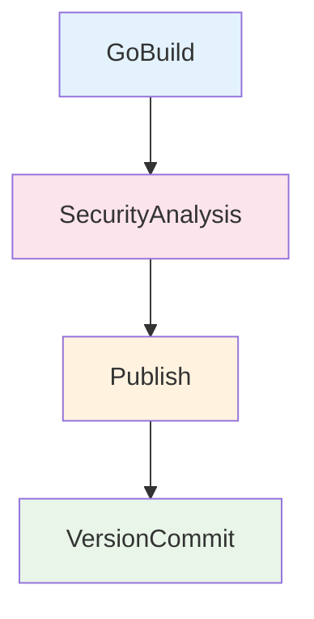

# Build Golang Binary

Pipeline de CI completo para compilação, testes, análise de qualidade, segurança e publicação de binários Golang versionados.

## 🎯 Descrição

Este pipeline automatiza o ciclo completo de integração contínua para aplicações Go: versionamento semântico (`VersionManagerVivo@8`), testes unitários com cobertura, análise estática (`golangci-lint`), quality gate (`SonarAnalysisFromVivo@2`), análise de segurança SAST (`Fortify`), compilação cross-platform e publicação dos binários no Azure Artifacts (`UniversalPackages@0`).

A principal tecnologia utilizada é Golang com suporte a cross-compilation via variáveis `GOOS` e `GOARCH`. O pipeline suporta tanto execução single target quanto multi-plataforma no mesmo run, permitindo gerar binários para Linux, macOS e Windows com um único disparo.

Benefícios principais: padronização corporativa, versionamento automático, quality gates integrados, segurança SAST embarcada, cache de módulos para performance e facilidade de uso plug-and-play.

- [Pipeline utilizado para testes](https://dev.azure.com/telefonica-vivo-brasil/DevOps/_build?definitionId=44859)
- [Repositório de exemplo](https://dev.azure.com/telefonica-vivo-brasil/DevOps/_git/teste-build-golang-binary)

## 🚀 Quick Start (5 minutos)

1. Crie os arquivos necessários no seu repositório (Veja [Dependências Externas](#-dependências-externas))
2. Crie `.azuredevops/azure-pipeline-ci.yml` na raiz
3. Cole o código de exemplo
4. Commit e push
5. ✅ Pipeline executa automaticamente!
6. Opcional: ajuste triggers

```yaml
# Pipeline básico para publicação de binário Golang
# .azuredevops/azure-pipeline-ci.yml
resources:
  repositories:
    - repository: CodePlay
      name: DevOps/Vivo.CodePlay.Pipelines
      type: git
      ref: refs/heads/master
      endpoint: CodePlay

extends:
  template: /framework/pipelines/ci/build-golang-binary/pipeline.yaml@CodePlay
```

**O que acontece com esta configuração:**

- 🔢 Calcula automaticamente a próxima versão semântica com `VersionManagerVivo@8`
- 📦 Cache de módulos Go para performance (`enableCache: true` por padrão)
- 🧱 Faz download e validação dos módulos Go (`go mod download` e `go mod verify`)
- 🧪 Executa testes unitários com detecção de race conditions (`enableTest: true` por padrão)
- 🐹 Compila o binário Go em `bin/<os>-<arch>/` com `ldflags` padrão
- 🌍 Gera binários para `linux/amd64`, `darwin/amd64` e `windows/amd64` por padrão
- 📊 Executa Quality Gate SonarQube (`runQualityGate: true` por padrão)
- 📦 Publica cada plataforma como Pipeline Artifact individual (`go-binary-linux-amd64`, `go-binary-darwin-amd64`, etc.) e no Azure Artifacts via `UniversalPackages@0`
- 🔒 Executa análise de segurança SAST (Fortify) via AppSec Config
- 🏷️ Realiza commit e tag da versão no repositório

## 🏗️ Matriz de Capacidades

| Capacidade | Suporte | Descrição |
|------------|---------|-----------|
| [Trunk Based Development](https://dvps.redecorp.azr/portal/codeplay/capacidades/catalog/trunk-based-development) | ✅ | Suporta versionamento com `VersionManagerVivo@8` e estratégia configurável por `branchingStrategy`. |
| [Build Automatizado](https://dvps.redecorp.azr/portal/codeplay/capacidades/catalog/build-automatizado) | ✅ | Compila automaticamente binários Go com suporte a single target e multi-target (`publishMultiPlatform` e `targetPlatforms`). |
| [Testes Unitários](https://dvps.redecorp.azr/portal/codeplay/capacidades/catalog/testes-unitarios) | ✅ | Executa `go test` com suporte a race detection (`-race`) e cobertura (`-cover`). Controlado por `enableTest`. |
| [SAST](https://dvps.redecorp.azr/portal/codeplay/capacidades/catalog/sast) | ✅ | Análise estática de segurança via Fortify ScanCentral no stage `SecurityAnalysis`. Controlado pelo AppSec via AppConfig. |
| [SCA](https://dvps.redecorp.azr/portal/codeplay/capacidades/catalog/sca) | ❌ | Não há integração de análise de composição/dependências para segurança neste pipeline. |
| [Gates de Segurança](https://dvps.redecorp.azr/portal/codeplay/capacidades/catalog/gates-de-seguranca) | ✅ | Gates de segurança configurados via AppSec AppConfig (`USE_FORTIFY`, `SKIP_SECURITY_GATE`). |
| [Análise de Código](https://dvps.redecorp.azr/portal/codeplay/capacidades/catalog/analise-de-codigo) | ✅ | Lint via `golangci-lint` (`enableLint`) e análise SonarQube (`runQualityGate`). |
| [Gates de Qualidade](https://dvps.redecorp.azr/portal/codeplay/capacidades/catalog/gate-de-qualidade) | ✅ | Quality Gate SonarQube via `SonarAnalysisFromVivo@2`. Controlado por `runQualityGate`. |
| [Rollback de Upgrade](https://dvps.redecorp.azr/portal/codeplay/capacidades/catalog/rollback-de-upgrade) | ❎ | Pipeline de CI - não aplicável para rollback de deploy |
| [Blue/Green Deployment](https://dvps.redecorp.azr/portal/codeplay/capacidades/catalog/blue-green-deployment) | ❎ | Pipeline de CI - estratégias de deployment são responsabilidade do CD |
| [Canary Release](https://dvps.redecorp.azr/portal/codeplay/capacidades/catalog/canary-release) | ❎ | Pipeline de CI - estratégias de release são responsabilidade do CD |

**Legenda:**

- ✅ Suportado nativamente
- ❌ Não suportado
- ⚠️ Suportado com limitações ou condições
- 🚧 Planejado / Em Construção
- ❎ Não faz sentido habilitar essa capacidade

## 🔄 Estrutura do Pipeline

O pipeline é organizado em quatro stages sequenciais. O stage `GoBuild` concentra versionamento, cache, testes, lint, build e quality gate (SonarQube). O stage `SecurityAnalysis` executa análise SAST (Fortify) controlada pelo AppSec via AppConfig. O stage `Publish` publica os binários aprovados no Azure Artifacts como Universal Package. Finalmente, `VersionCommit` consolida a versão com commit e tag no Git.

A execução multi-plataforma ocorre no mesmo job de build via loop sobre `targetPlatforms`, com nomenclatura explícita por sistema operacional e arquitetura para facilitar consumo downstream.



### Estágios do Pipeline

1. **🐹 GoBuild**
   - Debug: exibe parâmetros com `VivoUtilsFromVivo@1` (quando `System.Debug=true`)
   - Autenticação Nexus via Azure Key Vault (quando `useNexusProxy=true`)
   - Cache de módulos e build Go (`enableCache`)
   - Calcula a próxima versão semântica (com `passthroughVersion` em modo PR)
   - Prepara ambiente Go e configura GOPROXY
   - Download e verificação de módulos
   - Lint com `golangci-lint` (`enableLint`)
   - Compila binários single target ou multi-plataforma (um step por plataforma)
   - Executa testes unitários com race detection e cobertura (`enableTest`)
   - Quality Gate SonarQube (`runQualityGate`)
   - Publica artefatos de binário como Pipeline Artifact individual por plataforma (`go-binary-<os>-<arch>`) para próximos stages

2. **🔒 SecurityAnalysis** (Depende do Estágio GoBuild)
   - Obtém configuração AppSec via Azure App Configuration
   - Executa análise SAST Fortify (condicional: `USE_FORTIFY=true`)
   - Controle de exclusões Fortify (`enableFortifyExclusions`)

3. **📦 Publish** (Depende do Estágio SecurityAnalysis)
   - Baixa artefatos do stage GoBuild via `DownloadPipelineArtifact@2` (um por plataforma em modo multi-plataforma)
   - Recalcula versão para referência
   - Publica binários no Azure Artifacts como Universal Package (`UniversalPackages@0`), um pacote por plataforma (ex: `meu-app-linux-amd64`)

4. **🏷️ VersionCommit** (Depende do Estágio Publish)
   - Recalcula versão com a mesma estratégia
   - Executa commit do arquivo de versão
   - Cria e envia tag Git da versão

## ⚙️ Parâmetros Disponíveis

### Infraestrutura e Ambiente

#### agentPool

- **nome**: agentPool
- **tipo**: string
- **default**: "GeneralPurposeLinuxAgentsCI"
- **descrição**: Define o pool de agentes Azure DevOps que executará todo o pipeline, incluindo build, publicação de artefatos e commit/tag de versão.
- **dependências**: O agente deve possuir Go instalado/configurável por `ASDF_GOLANG_VERSION`, acesso ao repositório Git e permissões para publicar artefatos.

### Infraestrutura e Rede

#### useNetworkProxy

- **nome**: useNetworkProxy
- **tipo**: boolean
- **default**: false
- **descrição**: Configura proxy de rede (NSKP/Squid) para acesso externo nos templates de segurança.
- **dependências**: Usado pelos templates de segurança (`get_appconfig_keys_framework.yml`).

### Controle de Fluxo e Capacidades

#### prValidationOnly

- **nome**: prValidationOnly
- **tipo**: boolean
- **default**: false
- **descrição**: Quando `true`, executa somente validações de CI (build, testes, lint, SonarQube), sem publicar artefatos, commit/tag de versão ou rodar Fortify. O `VersionManagerVivo` usa `passthroughVersion` para gerar versão sem efeitos colaterais.
- **dependências**: Recomendado para execução em Pull Requests.

#### enableCache

- **nome**: enableCache
- **tipo**: boolean
- **default**: true
- **descrição**: Habilita cache de módulos Go (`go-mod`) e cache de build (`go-build`) via `Cache@2`, acelerando builds subsequentes.
- **dependências**: Baseado no hash de `go.sum` para invalidação.

#### enableTest

- **nome**: enableTest
- **tipo**: boolean
- **default**: true
- **descrição**: Executa testes unitários Go (`go test ./...`) com suporte a cobertura e race detection.
- **dependências**: Testes devem seguir convenções Go (`*_test.go`).

#### enableRaceDetection

- **nome**: enableRaceDetection
- **tipo**: boolean
- **default**: true
- **descrição**: Habilita flag `-race` nos testes para detecção de race conditions. Requer `CGO_ENABLED=1` quando ativado.
- **dependências**: Funciona apenas em `GOOS=linux`. Requer `enableTest: true`.

#### enableLint

- **nome**: enableLint
- **tipo**: boolean
- **default**: false
- **descrição**: Executa análise estática com `golangci-lint v1.55.2`. Gera relatório em formato checkstyle.
- **dependências**: Se não estiver instalado no agente, será baixado automaticamente.

#### enableCoverage

- **nome**: enableCoverage
- **tipo**: boolean
- **default**: false
- **descrição**: Habilita flag `-cover` nos testes para gerar relatório de cobertura nativa do Go.
- **dependências**: Requer `enableTest: true`.

#### runQualityGate

- **nome**: runQualityGate
- **tipo**: boolean
- **default**: true
- **descrição**: Executa análise e quality gate SonarQube via `SonarAnalysisFromVivo@2`.
- **dependências**: Requer Service Connection SonarQube configurada e projeto registrado.

### Configurações de Go

#### goVersion

- **nome**: goVersion
- **tipo**: string
- **default**: ""
- **descrição**: Define a versão do Go para o build por meio da variável `ASDF_GOLANG_VERSION`. Quando vazio, o ambiente do agente/padrão do projeto é utilizado.
- **dependências**: O agente deve suportar resolução da versão informada.

#### workingDirectory

- **nome**: workingDirectory
- **tipo**: string
- **default**: "$(Build.SourcesDirectory)"
- **descrição**: Diretório base do projeto Go contendo `go.mod`, usado nas etapas de setup, download de dependências e compilação.
- **dependências**: Caminho deve existir no checkout e conter o código Go.

#### mainPackage

- **nome**: mainPackage
- **tipo**: string
- **default**: "main.go"
- **descrição**: Define o pacote/arquivo de entrada compilado no comando `go build`.
- **dependências**: Deve apontar para um pacote/arquivo válido de entrada da aplicação.

#### binaryName

- **nome**: binaryName
- **tipo**: string
- **default**: "$(Build.Repository.Name)"
- **descrição**: Prefixo utilizado no nome dos binários gerados. Em multi-plataforma, o pipeline adiciona sufixos `<os>-<arch>` automaticamente.
- **dependências**: Nome deve ser compatível com nomes de arquivo dos sistemas alvo.

### Configurações de GOPROXY e Nexus

#### useNexusProxy

- **nome**: useNexusProxy
- **tipo**: boolean
- **default**: false
- **descrição**: Quando `true`, configura o Nexus como GOPROXY e busca credenciais no Azure Key Vault (`NEXUS-DEPS-USR`, `NEXUS-DEPS-PSW`).
- **dependências**: Requer Azure Key Vault `kv-azdevops-shared` com secrets `NEXUS-DEPS-USR` e `NEXUS-DEPS-PSW`. Requer Service Connection `DevOpsSharedResources`.

#### goproxyUrl

- **nome**: goproxyUrl
- **tipo**: string
- **default**: "https://proxy.golang.org,direct"
- **descrição**: URL do GOPROXY. Quando `useNexusProxy=true`, deve apontar para o Nexus (ex: `https://nexus.telefonica.com.br/repository/go-proxy/`).
- **dependências**: URL deve ser acessível pelo agente.

### Configurações de Build

#### buildTags

- **nome**: buildTags
- **tipo**: string
- **default**: ""
- **descrição**: Permite informar tags de build Go para habilitar compilação condicional.
- **dependências**: Tags devem existir no código fonte e ser válidas para o compilador Go.

#### ldflags

- **nome**: ldflags
- **tipo**: string
- **default**: "-s -w"
- **descrição**: Define linker flags base aplicadas no build. O pipeline acrescenta automaticamente `-X` para injetar `Version`, `BuildTime` e `GitCommit` via `versionLdFlag`. Flags adicionais como `-s` (strip symbol table) e `-w` (strip DWARF) são mantidas por padrão.
- **dependências**: Variáveis alvo no binário devem existir quando utilizadas com `-X`.

#### versionLdFlag

- **nome**: versionLdFlag
- **tipo**: string
- **default**: "main.Version"
- **descrição**: Caminho completo da variável Go que receberá a versão via `ldflags -X` em tempo de compilação (ex: `main.Version`, `mymodule/cmd.Version`). O pipeline injeta automaticamente `-X '<versionLdFlag>=<versão>'` junto com `main.BuildTime` e `main.GitCommit`.
- **dependências**: A variável Go informada deve existir no código fonte (ex: `var Version = "dev"` em `main.go` ou no pacote especificado).

#### cgoEnabled

- **nome**: cgoEnabled
- **tipo**: boolean
- **default**: false
- **descrição**: Liga/desliga CGO durante a compilação, impactando suporte a bibliotecas nativas no binário.
- **dependências**: Quando `true`, o agente precisa de toolchain C compatível para os targets escolhidos.

#### targetOS

- **nome**: targetOS
- **tipo**: string
- **default**: "linux"
- **descrição**: Sistema operacional alvo quando `publishMultiPlatform=false`.
- **dependências**: Usado em conjunto com `targetArch` no modo single target.

#### targetArch

- **nome**: targetArch
- **tipo**: string
- **default**: "amd64"
- **descrição**: Arquitetura alvo quando `publishMultiPlatform=false`.
- **dependências**: Usado em conjunto com `targetOS` no modo single target.

#### publishMultiPlatform

- **nome**: publishMultiPlatform
- **tipo**: boolean
- **default**: true
- **descrição**: Quando habilitado, compila e publica múltiplos binários no mesmo run usando `targetPlatforms`. Cada plataforma gera um step de build, um Pipeline Artifact e um Universal Package individuais.
- **dependências**: Requer `targetPlatforms` no formato correto (lista de objetos com `os` e `arch`).

#### targetPlatforms

- **nome**: targetPlatforms
- **tipo**: object
- **default**: `{'platforms': [{'os': 'linux', 'arch': 'amd64'}, {'os': 'linux', 'arch': 'arm64'}, {'os': 'darwin', 'arch': 'amd64'}, {'os': 'darwin', 'arch': 'arm64'}, {'os': 'windows', 'arch': 'amd64'}]}`
- **descrição**: Lista de plataformas para cross-compilation no modo multi-plataforma. Cada item é um objeto com `os` (sistema operacional) e `arch` (arquitetura). Cada plataforma gera um artefato individual para download separado.
- **dependências**: Cada combinação `os/arch` deve ser compatível com o compilador Go.

### Configurações de Publicação (Azure Artifacts)

#### feedName

- **nome**: feedName
- **tipo**: string
- **default**: `$(DEFAULT_FEED_NAME)`
- **descrição**: Nome do feed Azure Artifacts (Universal Packages) onde os binários serão publicados.
- **dependências**: O feed deve existir no projeto/organização Azure DevOps. O agente precisa de permissão de escrita no feed.

#### packageName

- **nome**: packageName
- **tipo**: string
- **default**: "$(Build.Repository.Name)"
- **descrição**: Nome do pacote Universal Package publicado no Azure Artifacts.
- **dependências**: Nome deve seguir convenções de nomenclatura do Azure Artifacts Universal Packages.

#### projectScopedFeed

- **nome**: projectScopedFeed
- **tipo**: boolean
- **default**: true
- **descrição**: Quando `true`, publica no feed com escopo do projeto. Quando `false`, usa feed com escopo da organização.
- **dependências**: O feed correspondente deve existir no escopo selecionado.

### Configurações de Segurança

#### enableFortifyExclusions

- **nome**: enableFortifyExclusions
- **tipo**: boolean
- **default**: false
- **descrição**: Faz checkout do repositório `FortifyExclusion` para excluir diretórios/arquivos da análise Fortify.
- **dependências**: Repositório `FortifyExclusion` deve estar acessível.

### Configurações do SonarQube

#### useSonarConfigFile

- **nome**: useSonarConfigFile
- **tipo**: boolean
- **default**: true
- **descrição**: Usa arquivo de configuração do SonarQube ao invés de configuração inline.
- **dependências**: Arquivo deve existir no caminho `sonarConfigFilePath`.

#### sonarConfigFilePath

- **nome**: sonarConfigFilePath
- **tipo**: string
- **default**: ".azuredevops/sonar-project.properties"
- **descrição**: Caminho do arquivo de configuração do SonarQube no repositório do projeto.
- **dependências**: Requer `useSonarConfigFile: true`.

#### sonarPollingTimeoutSec

- **nome**: sonarPollingTimeoutSec
- **tipo**: string
- **default**: "300"
- **descrição**: Timeout em segundos para polling do resultado do Quality Gate.
- **dependências**: Requer `runQualityGate: true` para que o polling seja executado.

#### sonarJavaVersion

- **nome**: sonarJavaVersion
- **tipo**: string
- **default**: "openjdk-17.0.2"
- **descrição**: Versão do Java utilizada pelo scanner do SonarQube para análise de código.
- **valores**: `openjdk-21.0.2`, `openjdk-17.0.2`, `openjdk-11.0.2`
- **dependências**: Requer `runQualityGate: true` para que a análise SonarQube seja executada.

#### sonarServiceConnection

- **nome**: sonarServiceConnection
- **tipo**: string
- **default**: "VIVO_SONARQUBE"
- **descrição**: Service Connection do SonarQube configurada no projeto Azure DevOps.
- **dependências**: Requer `runQualityGate: true` e a Service Connection criada no Azure DevOps.

#### sonarQualityGate

- **nome**: sonarQualityGate
- **tipo**: string
- **default**: "AzureDevOps-Default"
- **descrição**: Nome do Quality Gate a ser utilizado na análise do SonarQube.
- **dependências**: Requer `runQualityGate: true` e o Quality Gate cadastrado no servidor SonarQube.

#### sonarScannerMode

- **nome**: sonarScannerMode
- **tipo**: string
- **default**: "cli"
- **descrição**: Modo de execução do scanner SonarQube (`cli` para projetos Go, `dotnet` para .NET).
- **valores**: `cli`, `dotnet`
- **dependências**: Requer `runQualityGate: true` para que o scanner seja executado.

#### sonarProjectKey

- **nome**: sonarProjectKey
- **tipo**: string
- **default**: "$(System.TeamProject)-$(Build.Repository.Name)"
- **descrição**: Chave única do projeto no SonarQube, usada para identificação da análise.
- **dependências**: Requer `runQualityGate: true` e o projeto previamente criado no SonarQube.

#### sonarProjectName

- **nome**: sonarProjectName
- **tipo**: string
- **default**: "$(System.TeamProject)-$(Build.Repository.Name)"
- **descrição**: Nome de exibição do projeto no painel do SonarQube para consulta e navegação.
- **dependências**: Requer `runQualityGate: true` e o projeto previamente criado no SonarQube.

### Configurações de App Configuration

#### useAppConfig

- **nome**: useAppConfig
- **tipo**: boolean
- **default**: true
- **descrição**: Usa Azure App Configuration para obter configurações dinâmicas do SonarQube (Quality Gate, exclusões, etc.).
- **dependências**: Requer Service Connection `DevOpsSharedResources` e endpoint `https://appcs-azdevops-shared.azconfig.io`.

### Configurações de Versionamento

#### versionFile

- **nome**: versionFile
- **tipo**: string
- **default**: "VERSION"
- **descrição**: Arquivo utilizado pelo `VersionManagerVivo@8` para leitura/escrita da versão semântica.
- **dependências**: Repositório deve permitir escrita do arquivo e push para commit/tag.

#### branchingStrategy

- **nome**: branchingStrategy
- **tipo**: string
- **default**: "trunkbased"
- **descrição**: Estratégia de versionamento semântico aplicada pelo `VersionManagerVivo@8`.
- **dependências**: Deve ser um valor suportado pela task (`trunkbased`, `vivoflow`, `releaseflow`, `gitlabflow`, `gitlabflow-semantic`, `custom`).


## 🔧 Dependências Externas

### Service Connections Necessárias

#### 1. CodePlay (repositório de templates)

- **Nome padrão**: `CodePlay`
- **Tipo**: Azure Repos Git Service Connection
- **Uso**: Referenciar o template do pipeline no bloco `extends` dos consumidores.
- **Permissões necessárias**:
  - Leitura do repositório `DevOps/Vivo.CodePlay.Pipelines`
  - Acesso ao projeto Azure DevOps onde o pipeline está cadastrado
- **Configurável via**: Não aplicável

#### 2. SonarQube

- **Nome padrão**: `VIVO_SONARQUBE`
- **Tipo**: SonarQube Service Connection
- **Uso**: Análise de qualidade e quality gate via `SonarAnalysisFromVivo@2`.
- **Configurável via**: parâmetro `sonarServiceConnection`

#### 3. DevOpsSharedResources

- **Nome padrão**: `DevOpsSharedResources`
- **Tipo**: Azure Resource Manager Service Connection
- **Uso**: Acesso ao Azure Key Vault (`kv-azdevops-shared`) para secrets Nexus e Azure App Configuration.
- **Configurável via**: Não aplicável

### Agent Pool Requirements

#### Pool de Agentes

- **Pool padrão**: `GeneralPurposeLinuxAgentsCI`
- **Sistema Operacional**: Linux
- **Ferramentas obrigatórias**:
  - Go toolchain (ou suporte a `ASDF_GOLANG_VERSION`)
  - Git
  - Shell Bash
- **Acesso de rede**:
  - Acesso ao Azure DevOps para checkout, artifacts, commit e tag
  - Acesso ao repositório de origem

### Arquivos Obrigatórios no Repositório

#### 1. go.mod

- **Localização padrão**: Diretório definido em `workingDirectory`
- **Configurável via**: parâmetro `workingDirectory`
- **Requisitos**:
  - Arquivo Go Modules válido
  - Dependências resolvíveis via `go mod download`
- **Comportamento**: Se não existir, as etapas de dependência e build falham.

#### 2. Arquivo de entrada da aplicação

- **Localização padrão**: `main.go`
- **Configurável via**: parâmetro `mainPackage`
- **Requisitos**:
  - Pacote/arquivo compilável pelo comando `go build`
- **Comportamento**: Se inválido, o stage `GoBuild` falha.

#### 3. Arquivo de versionamento

- **Localização padrão**: `VERSION`
- **Configurável via**: parâmetro `versionFile`
- **Requisitos**:
  - Arquivo acessível para leitura e escrita
- **Comportamento**: Usado para cálculo, commit e tag da versão.

### Integrações Externas de Segurança

#### 1. Fortify SAST (ScanCentral + SSC)

- **Descrição**: Análise estática de segurança executada no stage `SecurityAnalysis`, controlada pelo AppSec via Azure App Configuration.
- **Requisitos**:
  - Azure App Configuration configurado com flags AppSec (`USE_FORTIFY`, `USE_CONVISO`, `SKIP_SECURITY_GATE`)
  - Templates de segurança: `/security/get_appconfig_keys_framework.yml`, `/security/define_appsec_app_version.yml`, `/security/run_fortify_scan.yml`
- **Opcional**: `enableFortifyExclusions` para excluir diretórios da análise
- **Observação**: O pipeline remove a pasta `vendor` antes da análise Fortify.

### Permissões de Repositório Git

- **Permissão de escrita** no repositório Git
- **Capacidade de criar tags**
- **Checkout com `persistCredentials: true`** (configurado automaticamente quando executa o stage `VersionCommit`)

### Azure Key Vault

#### kv-azdevops-shared

- **Uso**: Armazena credenciais para autenticação no Nexus (quando `useNexusProxy=true`).
- **Secrets esperados**:
  - `NEXUS-DEPS-USR`: Usuário para autenticação no Nexus
  - `NEXUS-DEPS-PSW`: Senha para autenticação no Nexus
- **Service Connection**: `DevOpsSharedResources`

### Variáveis de Sistema Necessárias

| Variável | Origem | Uso |
|----------|--------|-----|
| `System.TeamProject` | Azure DevOps | Compor variável `SIGLA` |
| `Build.SourcesDirectory` | Azure DevOps | Diretório padrão do projeto |
| `Build.Repository.Name` | Azure DevOps | Nome padrão do binário |
| `Pipeline.Workspace` | Azure DevOps | Cache/diretórios auxiliares |
| `Build.BuildId` | Azure DevOps | Identificação da execução |

### Dependências de Templates Internos

O pipeline utiliza os seguintes templates do CodePlay Framework:

- `/security/get_appconfig_keys_framework.yml` - Obtém configurações AppSec do Azure App Configuration
- `/security/define_appsec_app_version.yml` - Define versão da aplicação para Fortify
- `/security/run_fortify_scan.yml` - Executa análise SAST Fortify ScanCentral

## 🎨 Comportamentos Customizados

:::danger
**⚠️ ATENÇÃO: CUSTOMIZAÇÕES REQUEREM RESPONSABILIDADE ⚠️**

- ✅ **Use os exemplos como ponto de partida** - Eles demonstram padrões seguros e testados
- 🧠 **"Todos somos adultos"** - Confiamos na sua expertise, mas exigimos consciência do impacto
- 📝 **Tudo fica registrado** - Seu histórico de commits é auditável e rastreável
- 🎯 **Entenda antes de modificar** - Customizações incorretas podem quebrar builds em produção
- 🤝 **Documente suas decisões** - Facilite a manutenção futura por outros membros da equipe

**Customizar é permitido. Fazer sem entender não é.**
:::

### Multi-plataforma no mesmo run

Cada plataforma gera um Pipeline Artifact individual (`go-binary-linux-amd64`, `go-binary-darwin-amd64`, etc.) e um Universal Package separado no Azure Artifacts, permitindo download por OS.

```yaml
# .azuredevops/azure-pipeline-ci.yml
resources:
  repositories:
    - repository: CodePlay
      name: DevOps/Vivo.CodePlay.Pipelines
      type: git
      ref: refs/heads/master
      endpoint: CodePlay

extends:
  template: /framework/pipelines/ci/build-golang-binary/pipeline.yaml@CodePlay
  parameters:
    publishMultiPlatform: true
    targetPlatforms:
      - os: linux
        arch: amd64
      - os: darwin
        arch: amd64
      - os: windows
        arch: amd64
    binaryName: "meu-app"
```

**Resultado nos artefatos:**

| Pipeline Artifact | Conteúdo | Universal Package |
|---|---|---|
| `go-binary-linux-amd64` | `meu-app` | `meu-app-linux-amd64` |
| `go-binary-darwin-amd64` | `meu-app` | `meu-app-darwin-amd64` |
| `go-binary-windows-amd64` | `meu-app.exe` | `meu-app-windows-amd64` |

### Build single target para Linux ARM64

```yaml
# .azuredevops/azure-pipeline-ci.yml
resources:
  repositories:
    - repository: CodePlay
      name: DevOps/Vivo.CodePlay.Pipelines
      type: git
      ref: refs/heads/master
      endpoint: CodePlay

extends:
  template: /framework/pipelines/ci/build-golang-binary/pipeline.yaml@CodePlay
parameters:
  publishMultiPlatform: false
  targetOS: "linux"
  targetArch: "arm64"
  binaryName: "meu-app"
```

## 🔖 Variáveis de Ambiente

As seguintes variáveis de ambiente são automaticamente configuradas pelo pipeline:

| Variável | Descrição | Valor Padrão |
|----------|-----------|--------------|
| `SIGLA` | Sigla derivada do Team Project (`System.TeamProject`) | `lower(split(System.TeamProject,' ')[0])` |
| `DEFAULT_FEED_NAME` | Nome padrão do feed Azure Artifacts (= SIGLA) | `lower(split(System.TeamProject,' ')[0])` |
| `VERSION_FILE_PATH` | Caminho completo do arquivo de versão | `${workingDirectory}/${versionFile}` |
| `GO_CACHE_FOLDER` | Diretório de cache de módulos Go | `$(Pipeline.Workspace)/.go/pkg/mod` |
| `GO_BUILD_CACHE` | Diretório de cache de build Go | `$(Pipeline.Workspace)/.go/build-cache` |
| `GOMODCACHE` | Cache de módulos Go (quando `enableCache=true`) | `$(GO_CACHE_FOLDER)` |
| `GOCACHE` | Cache de build Go (quando `enableCache=true`) | `$(GO_BUILD_CACHE)` |
| `CGO_ENABLED` | Define se CGO está ativo (0/1) | `0` |
| `GOOS` | Sistema operacional alvo (single target) | `linux` |
| `GOARCH` | Arquitetura alvo (single target) | `amd64` |
| `CACORP_LOCATION` | Caminho do certificado corporativo | `$(Agent.HomeDirectory)/../../certs/CACORP.pem` |
| `FORTIFY_APP_DEFAULT_VERSION` | Versão padrão AppSec Fortify | `DevSecOps` |
| `APP_LANGUAGE` | Linguagem da aplicação para Fortify | `go` |
| `AKV_DEVOPS_NAME` | Nome do Azure Key Vault compartilhado | `kv-azdevops-shared` |
| `PROXY_NSKP_SERVER` | Endereço do proxy NSKP | `nskp.redecorp.br:8080` |
| `PROXY_SQUID_SERVER` | Endereço do proxy Squid | `10.240.58.39:3128` |

## ❓ FAQ

### Onde posso encontrar mais informações sobre o CodePlay Framework?

Você pode encontrar mais informações sobre o CodePlay Framework na [documentação oficial](https://dvps.redecorp.azr/portal/codeplay/framework/).

### Onde encontro as capacidades disponíveis?

As capacidades disponíveis podem ser encontradas no [Catálogo de Capacidade](https://dvps.redecorp.azr/portal/catalog/capabilities) no Portal CodePlay.

### Como faço para customizar o pipeline?

Siga o guia de [Adoção ao CodePlay](https://dvps.redecorp.azr/portal/codeplay/roteiro/codeplay#fluxo-de-ado%C3%A7%C3%A3o-ao-codeplay).

### Quais casos de uso relevantes?

- [Integrando CICD](https://dvps.redecorp.azr/portal/code/casos-de-uso/integrando-cicd)
- Veja o [Catálogo de Casos de Uso](https://dvps.redecorp.azr/portal/catalog/casos-de-uso) para outros exemplos de casos de uso.

### Quais Erros Comuns relevantes?

- Ainda não temos nenhum erro comum documentado para este pipeline.
- Veja o [Catálogo de Erros Conhecidos](https://dvps.redecorp.azr/portal/catalog/erros-conhecidos) para outros exemplos de erros.

## 🆘 Suporte

- [Abra um chamado para Dev Support](https://dvps.redecorp.azr/portal/codeplay/roteiro/#:~:text=Abra%20um%20chamado%20para%20Dev%20Support)
- [Canal DevEx - Azure DevOps](https://teams.microsoft.com/l/channel/19%3A8fbd00946cf044d7a844182ac71e6aa1%40thread.tacv2/Azure%20DevOps?groupId=038b4415-d6dd-42ce-92e5-31a8e2a13bf8&tenantId=9744600e-3e04-492e-baa1-25ec245c6f10)

## 📝 Decisões Tomadas

### Decisão 1: Suporte multi-plataforma por padrão

- **Data**: 06/03/2026
- **Motivador**: Necessidade de publicar binários para Linux, macOS e Windows no mesmo pipeline.
- **Forum Envolvido**: Definição técnica no contexto de evolução do pipeline `build-golang-binary`.
- **Descrição**: O pipeline foi estruturado para executar cross-compilation com `targetPlatforms` por padrão e manter modo single target para cenários específicos.


### Decisão 2: Version Injection via ldflags
- **Data**: 06/03/2026
- **Motivador**: Necessidade de incluir informações de versão, build time e git commit no binário compilado.
- **Forum Envolvido**: DevOps
- **Descrição**: A versão é injetada no binário em tempo de compilação usando `go build -ldflags "-X '<var>=<valor>"`. O parâmetro `versionLdFlag` (default: `main.Version`) permite customizar o caminho da variável Go. Além da versão, `main.BuildTime` e `main.GitCommit` são sempre injetados. Essa abordagem é idiomática em Go, não modifica o código fonte e funciona com qualquer estrutura de pacotes.

### Decisão 3: Depreciação do parâmetro `sonarServiceConnection` e governança SonarQube (ADR 0006)
- **Data**: 13/05/2026
- **Motivador**: Alinhar o pipeline à governança definida na ADR 0006, evitando bypass manual do controle de acesso ao Sonar VIP.
- **Fórum Envolvido**: CoE DevOps
- **Descrição**: O parâmetro `sonarServiceConnection` será depreciado em breve. Atualmente, ainda é possível referenciar manualmente o Sonar VIP ou comum, mas a escolha da instância passará a ser feita automaticamente pela custom task, baseada no arquivo `vip.json`. Isso garante que apenas projetos aprovados utilizem o Sonar VIP, conforme política definida.
- **Impacto**: Evita burla de governança, aumenta a rastreabilidade e prepara o pipeline para remoção futura do parâmetro.
- **Próximos Passos**: Depreciar o parâmetro `sonarServiceConnection` no pipeline e atualizar a lista do `vip.json` com as siglas dos projetos autorizados ao Sonar VIP.
- **Referências**: [ADR 0008 - Sonar VIP Governance](/framework/docs/adr/0008-sonar-vip-governance.md)
- **Notas**: O parâmetro permanece disponível temporariamente para retrocompatibilidade, mas será depreciado em breve.