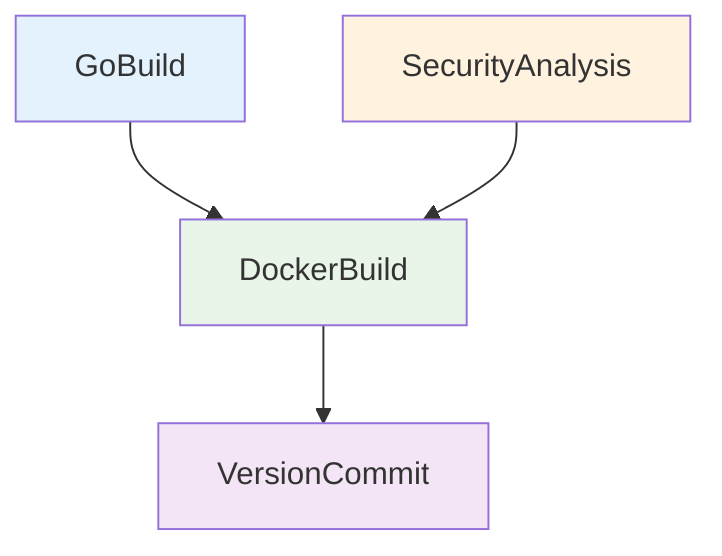

# Pipeline Golang Docker CI

Pipeline de CI para aplicações Go containerizadas com análises de segurança.

## 🎯 Descrição

Pipeline completo de CI/CD para aplicações Go que gera imagens Docker, com análises de segurança paralelas e versionamento automatizado.

O pipeline automatiza todo o processo de construção, teste e publicação de aplicações Go containerizadas. Utiliza Go modules para gestão de dependências, testes nativos do Go com cobertura, golangci-lint para análise estática, Fortify para análise SAST e Dependency Track para análise SCA. As imagens Docker são construídas com BuildKit e publicadas no Azure Container Registry (ACR).

O pipeline suporta múltiplas versões de Go (gerenciadas via `.tool-versions` do ASDF), oferece cache inteligente de módulos e build, detecção de race conditions, execução paralela de análises de segurança para otimização de tempo, e versionamento semântico automático. Ideal para microserviços, APIs REST, CLIs e aplicações cloud-native que seguem práticas DevSecOps.


- [Pipeline utilizado para testes](https://dev.azure.com/telefonica-vivo-brasil/DevOps/_build?definitionId=44846)
- [Repositório de exemplo](https://dev.azure.com/telefonica-vivo-brasil/DevOps/_git/teste-build-golang-docker)


## 🚀 Quick Start (5 minutos)

1. **Pré-requisitos**: Tenha pronto seu projeto Go com `go.mod` e `Dockerfile` na raiz
2. **Crie o arquivo**: `.azuredevops/azure-pipeline-ci.yml` na raiz do repositório
3. **Cole o código**: Use o exemplo abaixo
4. **Commit e push**: `git add . && git commit -m "Add CI pipeline" && git push`
5. ✅ **Pipeline executa automaticamente!**
6. **Opcional**: Ajuste triggers conforme necessário

```yaml
# Pipeline básico para build Go + Docker com análises de segurança
# .azuredevops/azure-pipeline-ci.yml
resources:
  repositories:
    - repository: CodePlay
      name: DevOps/Vivo.CodePlay.Pipelines
      type: git
      ref: refs/heads/master
      endpoint: CodePlay

extends:
  template: /framework/pipelines/ci/build-golang-docker/pipeline.yaml@CodePlay
```

:::warning
Certifique-se de que o arquivo `go.mod` está configurado corretamente e que os testes unitários estão implementados seguindo as convenções Go (`*_test.go`).
:::

**O que acontece com esta configuração:**

- 🐹 Build com Go 1.22 (versão padrão)
- ✅ Execução de testes unitários nativos do Go
- 📊 Relatório de cobertura de código
- 🔍 Análise estática com golangci-lint
- 🔒 Análise SAST (Fortify) e SCA (Dependency Track) em paralelo
- ⚡ Cache inteligente de módulos Go
- 📈 Análise de qualidade de código com SonarQube
- 🐳 Build da imagem Docker: `{sigla}/{nome-repositorio}:versao`
- 🏷️ Versionamento semântico automático (incremento patch)
- 📤 Push para Azure Container Registry via service connection "ACR-DEVOPS"
- 🔖 Criação de tag Git e commit de versão (apenas branch master)

### 🚀 Próximos Passos Continuous Deployment (CD)

Após o build e publicação da imagem Docker no Azure Container Registry, o próximo passo é realizar o deployment da aplicação Go nos ambientes desejados. O CodePlay Framework oferece múltiplas opções de CD dependendo da sua infraestrutura:

### Pipelines de CD Disponíveis

#### [deploy-helm](../../cd/deploy-helm/README.md) - Deploy via Kubernetes/Helm

**Quando usar:** Para aplicações Go containerizadas em clusters Kubernetes (AKS, OpenShift ou genéricos).

**Principais recursos:**
- ☸️ Deploy automatizado via Helm Charts
- 🎯 Suporte a múltiplos ambientes e clusters
- 🔄 Rollback automático em falha
- 📊 Comparação visual de mudanças (kubectl diff)
- 🔵 Blue/Green Deployment via Argo Rollouts
- 🔒 Aprovações via Azure DevOps Environments

**Exemplo de uso:**
```yaml
# .azuredevops/azure-pipeline-cd.yml
trigger: none

parameters:
- name: version
  displayName: 'Versão da aplicação'
  type: string
  default: getLatestVersion()
- name: environment
  displayName: 'Versão da aplicação'
  type: string
  default: 'dev'
  values:
    - dev
    - prod
resources:
  repositories:
    - repository: CodePlay
      name: DevOps/Vivo.CodePlay.Pipelines
      type: git
      ref: refs/heads/master
      endpoint: CodePlay

extends:
  template: /framework/pipelines/cd/deploy-helm/pipeline.yaml@CodePlay
  parameters:
    environment: dev
    version: getLatestVersion()
    helmChartName: generic-microservice
    helmChartVersion: 1.0.26
```

#### [deploy-ssh](../../cd/deploy-ssh/README.md) - Deploy via SSH

**Quando usar:** Para servidores tradicionais sem Kubernetes, ou aplicações Go que rodam diretamente em VMs.

**Principais recursos:**
- 🔐 Deployment via SSH seguro
- 📦 Download automático de artifacts
- 💾 Backup automático da versão anterior
- 📤 Transferência de binários Go via SCP
- 🔄 Rollback automático em falha
- 🔍 Validação pós-deploy customizável

**Exemplo de uso:**
```yaml
# .azuredevops/azure-pipeline-cd.yml
resources:
  repositories:
    - repository: CodePlay
      name: DevOps/Vivo.CodePlay.Pipelines
      type: git
      ref: refs/heads/master
      endpoint: CodePlay
  pipelines:
    - pipeline: <nome-exato-do-pipeline-ci>
      source: <nome-exato-do-pipeline-ci>
      trigger:
        branches:
          include:
            - master
            - <outras-branches-que-gostaria-que-iniciem-o-cd>

extends:
  template: /framework/pipelines/cd/deploy-ssh/pipeline.yaml@CodePlay
  parameters:
    environment: dev

```

**Saiba mais:** Consulte a documentação completa de cada pipeline de CD para configuração detalhada e parâmetros avançados.

**Saiba mais:** Consulte a [documentação completa da integração CI/CD ](https://dvps.redecorp.azr/portal/code/casos-de-uso/integrando-cicd#%EF%B8%8F-estrutura-da-integra%C3%A7%C3%A3o) para configuração detalhada e parâmetros avançados.

## 🏗️ Matriz de Capacidades

| Capacidade | Suporte | Descrição |
|------------|---------|-----------|
| [Trunk Based Development](https://dvps.redecorp.azr/portal/codeplay/capacidades/catalog/trunk-based-development) | ✅ | Pipeline executado em qualquer branch. Commit de versão e push Docker condicionais via `prValidationOnly=false` (padrão). |
| [Build Automatizado](https://dvps.redecorp.azr/portal/codeplay/capacidades/catalog/build-automatizado) | ✅ | Build Go automatizado com `go build`, gestão de dependências via Go modules, cache inteligente (`enableCache`), e suporte a múltiplas versões Go via ASDF. |
| [Testes Unitários](https://dvps.redecorp.azr/portal/codeplay/capacidades/catalog/testes-unitarios) | ✅ | Execução de testes com `go test`, publicação de resultados no Azure DevOps, detecção de race conditions (`enableRaceDetection`). Habilitado via `enableTest=true` (padrão). |
| [Cobertura de Código](https://dvps.redecorp.azr/portal/codeplay/capacidades/catalog/cobertura-de-codigo) | ✅ | Análise de cobertura nativa do Go (`-coverprofile`), conversão para Cobertura XML, publicação de relatórios HTML. |
| [SAST](https://dvps.redecorp.azr/portal/codeplay/capacidades/catalog/sast) | ✅ | Análise estática de código com Fortify ScanCentral e SSC, integração com Conviso. Exclusões customizadas via `enableFortifyExclusions=true`. |
| [SCA](https://dvps.redecorp.azr/portal/codeplay/capacidades/catalog/sca) | ✅ | Análise de composição de software com Dependency Track. Controlado pelo time de AppSec via AppConfig. |
| [Gates de Segurança](https://dvps.redecorp.azr/portal/codeplay/capacidades/catalog/gates-de-seguranca) | ✅ | Controle via chaves do AppConfig corporativo (`SKIP_SECURITY_GATE`, `SKIP_SECURITY_GATE_SCA`). |
| [Análise de Código](https://dvps.redecorp.azr/portal/codeplay/capacidades/catalog/analise-de-codigo) | ✅ | Análise com SonarQube + golangci-lint, integração com cobertura Go. Habilitado via `runQualityGate=true` e `enableLint=true`. |
| [Gates de Qualidade](https://dvps.redecorp.azr/portal/codeplay/capacidades/catalog/gate-de-qualidade) | ✅ | Quality Gate do SonarQube com validação automática. Configurável via `sonarQualityGate`. |

**Legenda:**

- ✅ Suportado nativamente
- ❌ Não suportado
- ⚠️ Suportado com limitações
- ❎ Não aplicável para este tipo de pipeline

## 🔄 Estrutura do Pipeline

O pipeline é organizado em quatro estágios principais: **GoBuild** executa o build, lint e testes da aplicação; **SecurityAnalysis** roda a análise SAST (Fortify); **DockerBuild** constrói e publica a imagem Docker e executa SCA; e **VersionCommit** cria tags Git e commit de versionamento.



### Estágios do Pipeline

1. **🐹 GoBuild - Build & Test Go Application**
   - Configuração do ambiente Go (ASDF) e GOPROXY
   - Cache inteligente de módulos e build (`enableCache`)
   - Download e verificação de módulos (`go mod download && go mod verify`)
   - Análise estática com golangci-lint (`enableLint`)
   - Build com ldflags para otimização e injeção de versão
   - Execução de testes com cobertura (`enableTest`)
   - Detecção de race conditions (`enableRaceDetection`)
   - Análise SonarQube com quality gate (`runQualityGate`)
   - Publicação de artefatos binários

2. **🔒 SecurityAnalysis - Security Analysis**
   - **Job 1 - AppSecConfigKeys**: Recupera chaves do AppConfig corporativo
   - **Job 2 - FortifyScan**: Análise SAST com Fortify, integração Conviso

3. **🐳 DockerBuild - Docker Build** (Depende de GoBuild + SecurityAnalysis)
   - Download de artefatos binários
   - Build da imagem Docker com BuildKit
   - Análise SCA (Dependency Track) sobre a imagem
   - Push para ACR (apenas quando `prValidationOnly=false`)

4. **🔖 VersionCommit - Commit Version** (Condicional)
   - Commit automático de alterações no arquivo de versão
   - Criação de tag Git com a versão de release

## Parâmetros Disponíveis

### Infraestrutura e Ambiente

#### agentPool

- **nome**: agentPool
- **tipo**: string
- **default**: "GeneralPurposeLinuxAgentsCI"
- **descrição**: "Pool de agentes Azure DevOps para execução do pipeline. Define onde o build será executado. Deve ser um pool com agentes Linux configurados com Go e Docker."
- **dependências**: Pool de agentes com Go (via ASDF), Docker e acesso ao Azure Container Registry

#### useNetworkProxy

- **nome**: useNetworkProxy
- **tipo**: boolean
- **default**: false
- **descrição**: Configurar proxy de rede para acesso externo. Deve ser `true` para pipelines executados em pools de agentes on-premises como "VivoOnPremDevAgents", "VivoOnPremHmlAgents" e "VivoOnPremPrdAgents".
- **dependências**: Nenhuma.

### Configurações de Go

#### goVersion

- **nome**: goVersion
- **tipo**: string
- **default**: ""
- **descrição**: "Versão do Go a ser utilizada no build. Por padrão, a versão é lida do arquivo `.tool-versions` do repositório (padrão ASDF). Se o arquivo não existir ou o parâmetro for especificado, usa o valor informado. Versões suportadas nos agentes: 1.19.x, 1.20.x, 1.21.x, 1.22.x, 1.23.x."
- **dependências**: Arquivo `.tool-versions` na raiz do repositório com linha `golang <versão>`, ou versão Go instalada nos agentes via ASDF

#### workingDirectory

- **nome**: workingDirectory
- **tipo**: string
- **default**: "$(Build.SourcesDirectory)"
- **descrição**: "Diretório raiz do projeto Go onde está localizado o arquivo go.mod. Usado como base para todos os comandos de build, teste e análise."
- **dependências**: Arquivo go.mod válido no diretório especificado

#### mainPackage

- **nome**: mainPackage
- **tipo**: string
- **default**: "main.go"
- **descrição**: "Caminho relativo do pacote principal (main package) que contém a função main() para compilação. Pode apontar para arquivo ou diretório."
- **dependências**: Depende de workingDirectory para resolução do caminho completo

#### binaryName

- **nome**: binaryName
- **tipo**: string
- **default**: "$(Build.Repository.Name)"
- **descrição**: "Nome do binário executável gerado após a compilação. Será usado no Dockerfile e artefatos. Convenção utiliza nome do repositório."
- **dependências**: Nenhuma dependência adicional necessária

#### useNexusProxy

- **nome**: useNexusProxy
- **tipo**: boolean
- **default**: false
- **descrição**: "Habilita o uso do Nexus como proxy de módulos Go (GOPROXY). Útil em ambientes com restrições de rede externa ou para cache corporativo."
- **dependências**: Requer goproxyUrl configurado com URL válida do Nexus quando habilitado

#### goproxyUrl

- **nome**: goproxyUrl
- **tipo**: string
- **default**: "https://proxy.golang.org,direct"
- **descrição**: "URL do GOPROXY para download de módulos Go. Pode apontar para proxy público ou Nexus corporativo. Formato suporta fallback (URL,direct)."
- **dependências**: Nenhuma dependência adicional necessária; requer useNexusProxy=true para usar Nexus

### Configurações de Build

#### buildTags

- **nome**: buildTags
- **tipo**: string
- **default**: ""
- **descrição**: "Build tags do Go para compilação condicional. Permite incluir/excluir código baseado em tags. Exemplo: netgo,osusergo para build estático."
- **dependências**: Nenhuma dependência adicional necessária

#### ldflags

- **nome**: ldflags
- **tipo**: string
- **default**: "-s -w -X main.Version=$(VersionManagerVivo.VERSION)"
- **descrição**: "Flags do linker Go para otimização e injeção de variáveis em tempo de compilação. -s -w remove símbolos de debug reduzindo tamanho do binário."
- **dependências**: Nenhuma dependência adicional necessária

#### cgoEnabled

- **nome**: cgoEnabled
- **tipo**: boolean
- **default**: false
- **descrição**: "Habilita CGO para compilação com código C. Necessário para algumas bibliotecas nativas como sqlite. Pode impactar cross-compilation e tamanho do binário."
- **dependências**: Bibliotecas C disponíveis no agente quando habilitado; pode conflitar com cross-compilation

#### targetOS

- **nome**: targetOS
- **tipo**: string
- **default**: "linux"
- **opções**: ["linux", "darwin", "windows"]
- **descrição**: "Sistema operacional alvo para cross-compilation. Define a variável GOOS durante o build. Usado para gerar binários para diferentes plataformas."
- **dependências**: Nenhuma dependência adicional necessária

#### targetArch

- **nome**: targetArch
- **tipo**: string
- **default**: "amd64"
- **opções**: ["amd64", "arm64", "arm"]
- **descrição**: "Arquitetura do processador alvo para cross-compilation. Define a variável GOARCH durante o build. Usado para gerar binários para diferentes arquiteturas."
- **dependências**: Nenhuma dependência adicional necessária

### Configurações de Docker

#### imageName

- **nome**: imageName
- **tipo**: string
- **default**: "$(SIGLA)/$(Build.Repository.Name)"
- **descrição**: "Nome completo da imagem Docker no formato sigla/nome. Será usado no push para o registry. Utiliza convenção baseada na sigla do projeto."
- **dependências**: Variável SIGLA recuperada do AppConfig corporativo

#### dockerfilePath

- **nome**: dockerfilePath
- **tipo**: string
- **default**: "Dockerfile"
- **descrição**: "Caminho relativo do Dockerfile a partir do workingDirectory. Suporta subdiretórios para projetos com múltiplos Dockerfiles ou estrutura complexa."
- **dependências**: Dockerfile válido no caminho especificado; depende de workingDirectory para resolução

#### registryServiceConnection

- **nome**: registryServiceConnection
- **tipo**: string
- **default**: "ACR-DEVOPS"
- **descrição**: "Nome da Service Connection do Azure DevOps para autenticação no Container Registry onde a imagem será armazenada e versionada."
- **dependências**: Service Connection do tipo Azure Container Registry configurada no projeto Azure DevOps

### Controle de Fluxo

#### prValidationOnly

- **nome**: prValidationOnly
- **tipo**: boolean
- **default**: false
- **descrição**: "Executa apenas a validação do código (build, testes, análises), sem publicar imagem Docker nem gerar versão/tag. Ideal para Pull Requests."
- **dependências**: Nenhuma dependência adicional necessária

#### enableCache

- **nome**: enableCache
- **tipo**: boolean
- **default**: true
- **descrição**: "Habilita cache inteligente de módulos Go e build para acelerar execuções subsequentes. Cache baseado no hash do arquivo go.sum."
- **dependências**: Arquivo go.sum deve existir no repositório para funcionamento adequado do cache

#### enableTest

- **nome**: enableTest
- **tipo**: boolean
- **default**: true
- **descrição**: "Habilita execução de testes unitários com go test e geração de relatório de cobertura. Publica resultados no Azure DevOps via PublishTestResults."
- **dependências**: Testes unitários implementados seguindo convenções Go (*_test.go)

#### enableRaceDetection

- **nome**: enableRaceDetection
- **tipo**: boolean
- **default**: true
- **descrição**: "Habilita detecção de race conditions durante testes usando flag -race. Identifica problemas de concorrência em tempo de teste."
- **dependências**: Requer enableTest=true; pode conflitar com cross-compilation em algumas plataformas

#### enableLint

- **nome**: enableLint
- **tipo**: boolean
- **default**: false
- **descrição**: "Habilita análise estática de código com golangci-lint para verificar qualidade, padrões e possíveis bugs. Configurável via .golangci.yml."
- **dependências**: Nenhuma dependência adicional necessária; configuração via .golangci.yml é opcional

#### enableCoverage

- **nome**: enableCoverage
- **tipo**: boolean
- **default**: false
- **descrição**: "Habilita geração de relatório de cobertura de código durante os testes. Usa flag -coverprofile do go test e converte para formato Cobertura XML."
- **dependências**: Requer enableTest=true para ser utilizado; cobertura publicada como artefato e relatório HTML
- **Observação**: Existe um bug interno do Go 1.21+ onde mesmo com -covermode=count, Go tenta carregar covdata em certos cenários fazendo o build falhar.

#### runQualityGate

- **nome**: runQualityGate
- **tipo**: boolean
- **default**: true
- **descrição**: "Habilita análise de código com SonarQube e validação do Quality Gate. Não executa em Pull Requests por padrão para evitar duplicação."
- **dependências**: Parâmetros sonar* devem estar configurados; Service Connection SonarQube disponível

### Configurações de Segurança

#### enableFortifyExclusions

- **nome**: enableFortifyExclusions
- **tipo**: boolean
- **default**: false
- **descrição**: "Habilita o checkout do repositório de exclusões Fortify durante a análise SAST. Permite usar configurações de exclusão para falsos positivos conhecidos."
- **dependências**: Repositório de exclusões Fortify deve existir e estar acessível quando habilitado

### Configurações de Versionamento

#### versionFile

- **nome**: versionFile
- **tipo**: string
- **default**: "VERSION"
- **descrição**: "Arquivo utilizado para gerenciar a versão da aplicação. Usado pelo VersionManager para leitura e atualização automática da versão semântica."
- **dependências**: Arquivo deve existir no repositório; suporta go.mod ou version.txt

#### branchingStrategy

- **nome**: branchingStrategy
- **tipo**: string
- **default**: "trunkbased"
- **opções**: ["trunkbased", "vivoflow", "releaseflow", "gitlabflow", "gitlabflow-semantic", "custom"]
- **descrição**: "Estratégia de branching e versionamento. Define como o VersionManager calcula e incrementa versões baseado no fluxo de branches."
- **dependências**: Nenhuma dependência adicional necessária

### Configurações do SonarQube

#### useSonarConfigFile

- **nome**: useSonarConfigFile
- **tipo**: boolean
- **default**: true
- **descrição**: "Utiliza arquivo de configuração externo para o SonarQube ao invés de parâmetros inline. Permite configuração mais detalhada e versionada."
- **dependências**: Arquivo sonarConfigFilePath deve existir quando habilitado

#### sonarConfigFilePath

- **nome**: sonarConfigFilePath
- **tipo**: string
- **default**: ".azuredevops/sonar-project.properties"
- **descrição**: "Caminho do arquivo de configuração do SonarQube com propriedades do projeto. Define sources, exclusions, cobertura e outras configurações."
- **dependências**: Requer useSonarConfigFile=true; arquivo deve existir no caminho especificado

#### sonarPollingTimeoutSec

- **nome**: sonarPollingTimeoutSec
- **tipo**: string
- **default**: "300"
- **descrição**: "Tempo máximo em segundos para aguardar o resultado do Quality Gate do SonarQube. Aumentar para projetos grandes com análise demorada."
- **dependências**: Requer runQualityGate=true para ser utilizado

#### sonarJavaVersion

- **nome**: sonarJavaVersion
- **tipo**: string
- **default**: "openjdk-17.0.2"
- **opções**: ["openjdk-21.0.2", "openjdk-17.0.2", "openjdk-11.0.2"]
- **descrição**: "Versão do Java utilizada pelo scanner SonarQube. O scanner requer Java para executar mesmo em projetos não-Java como Go."
- **dependências**: Requer runQualityGate=true; versão Java disponível via ASDF nos agentes

#### sonarServiceConnection

- **nome**: sonarServiceConnection
- **tipo**: string
- **default**: "VIVO_SONARQUBE"
- **descrição**: "Nome da Service Connection do Azure DevOps para autenticação no servidor SonarQube corporativo. Permite comunicação segura com o servidor."
- **dependências**: Requer runQualityGate=true; Service Connection configurada no projeto Azure DevOps

#### sonarQualityGate

- **nome**: sonarQualityGate
- **tipo**: string
- **default**: "AzureDevOps-Default"
- **descrição**: "Nome do Quality Gate configurado no SonarQube para validação de métricas de qualidade. Define thresholds de cobertura, bugs e vulnerabilidades."
- **dependências**: Requer runQualityGate=true; Quality Gate deve existir no servidor SonarQube

#### sonarProjectKey

- **nome**: sonarProjectKey
- **tipo**: string
- **default**: "$(System.TeamProject)-$(Build.Repository.Name)"
- **descrição**: "Chave única do projeto no SonarQube. Identifica o projeto para armazenamento de métricas e histórico de análises no servidor."
- **dependências**: Requer runQualityGate=true para ser utilizado

#### sonarProjectName

- **nome**: sonarProjectName
- **tipo**: string
- **default**: "$(System.TeamProject)-$(Build.Repository.Name)"
- **descrição**: "Nome de exibição do projeto no dashboard do SonarQube para fácil identificação. Aparece na interface web e relatórios."
- **dependências**: Requer runQualityGate=true para ser utilizado

#### sonarScannerMode

- **nome**: sonarScannerMode
- **tipo**: string
- **default**: "CLI"
- **descrição**: "Modo de execução do scanner SonarQube. CLI para projetos Go e linguagens genéricas. MSBuild para projetos .NET. Maven para projetos Java."
- **dependências**: Requer runQualityGate=true para ser utilizado

#### useAppConfig

- **nome**: useAppConfig
- **tipo**: boolean
- **default**: true
- **descrição**: "Habilita integração com Azure App Configuration para recuperar chaves de configuração corporativas como SIGLA, gates de segurança e feature flags."
- **dependências**: Configuração do AppConfig corporativo disponível; chaves como SIGLA devem estar definidas

## 📦 Estrutura do Projeto Recomendada

```
my-go-app/
├── .azuredevops/
│   ├── pipelines/
│   │   └── ci.yaml              # Pipeline CI
│   └── sonar-project.properties # Config SonarQube (opcional)
├── .tool-versions               # Versão Go gerenciada pelo ASDF
├── cmd/
│   └── main.go                  # Entrypoint da aplicação
├── internal/                    # Código interno
│   ├── handler/
│   └── service/
├── pkg/                         # Código público/reutilizável
├── test/                        # Testes de integração
├── bin/                         # Binários compilados (gitignore)
├── go.mod                       # Definição de módulo
├── go.sum                       # Checksums de dependências
├── Dockerfile                   # Multi-stage build
├── version.txt                  # Arquivo de versão
└── README.md
```

### Arquivo `.tool-versions`

O pipeline utiliza o arquivo `.tool-versions` do ASDF para determinar a versão do Go:

```
# .tool-versions
golang 1.22.0
```

Isso garante que a mesma versão de Go usada localmente pelos desenvolvedores seja utilizada no pipeline de CI, evitando inconsistências.

## 🐳 Dockerfile Recomendado

```dockerfile
# Multi-stage build para Go
FROM golang:1.22-alpine AS builder

WORKDIR /app

# Copia dependências primeiro para cache
COPY go.mod go.sum ./
RUN go mod download

# Copia código fonte
COPY . .

# Build (se não usar binário pré-compilado)
# ARG VERSION
# RUN CGO_ENABLED=0 GOOS=linux GOARCH=amd64 go build \
#     -ldflags="-s -w -X main.Version=${VERSION}" \
#     -o /app/bin/app ./cmd/main.go

# Imagem final mínima
FROM gcr.io/distroless/static:nonroot

WORKDIR /app

# Copia binário pré-compilado pelo pipeline
ARG BINARY_NAME
COPY bin/${BINARY_NAME} /app/app

USER nonroot:nonroot

EXPOSE 8080

ENTRYPOINT ["/app/app"]
```

## 📝 Exemplo de sonar-project.properties

```properties
# .azuredevops/sonar-project.properties
sonar.sources=.
sonar.exclusions=**/*_test.go,**/vendor/**,**/testdata/**,**/bin/**
sonar.tests=.
sonar.test.inclusions=**/*_test.go
sonar.go.coverage.reportPaths=test-results/coverage.out
sonar.go.tests.reportPaths=test-results/junit.xml
```

## 🔧 Configuração do golangci-lint (Opcional)

Crie `.golangci.yml` na raiz do projeto para customizar a análise:

```yaml
# .golangci.yml
run:
  timeout: 5m
  modules-download-mode: readonly

linters:
  enable:
    - errcheck
    - gosimple
    - govet
    - ineffassign
    - staticcheck
    - unused
    - gofmt
    - goimports
    - misspell
    - gosec
    - bodyclose
    - noctx
    - sqlclosecheck

linters-settings:
  errcheck:
    check-type-assertions: true
  govet:
    check-shadowing: true
  gosec:
    excludes:
      - G104 # Audit errors not checked

issues:
  exclude-rules:
    - path: _test\.go
      linters:
        - gosec
        - errcheck
```

## 🔀 Exemplos de Uso Avançado

### Build com CGO habilitado

```yaml
extends:
  template: /framework/pipelines/ci/build-golang-docker/pipeline.yaml@CodePlay
  parameters:
    cgoEnabled: true
    targetOS: linux
    targetArch: amd64
```

### Build com tags customizadas

```yaml
extends:
  template: /framework/pipelines/ci/build-golang-docker/pipeline.yaml@CodePlay
  parameters:
    buildTags: 'netgo,osusergo'
    ldflags: '-s -w -extldflags "-static"'
```

### Projeto em subdiretório

```yaml
extends:
  template: /framework/pipelines/ci/build-golang-docker/pipeline.yaml@CodePlay
  parameters:
    workingDirectory: $(Build.SourcesDirectory)/services/api
    mainPackage: './cmd/api/main.go'
    binaryName: 'api-service'
```

### Usando Nexus como GOPROXY

```yaml
extends:
  template: /framework/pipelines/ci/build-golang-docker/pipeline.yaml@CodePlay
  parameters:
    useNexusProxy: true
    goproxyUrl: 'https://nexus.telefonica.com.br/repository/go-proxy/,direct'
```

### PR Validation (sem push)

```yaml
extends:
  template: /framework/pipelines/ci/build-golang-docker/pipeline.yaml@CodePlay
  parameters:
    prValidationOnly: true
```

## 🐛 Troubleshooting

### Erro: "go: module lookup disabled by GOPROXY=off"

**Solução**: Verifique se o agente tem acesso à internet ou configure `useNexusProxy: true` com URL válida do Nexus.

### Erro: "race detection not supported on this OS/arch"

**Solução**: Race detection requer CGO. Se estiver fazendo cross-compilation, desabilite com `enableRaceDetection: false`.

### Erro no golangci-lint

**Solução**: Crie um arquivo `.golangci.yml` para ajustar as regras ou use `enableLint: false` temporariamente.

### Cache não está funcionando

**Solução**: Verifique se `go.sum` existe no repositório. O cache é baseado neste arquivo.

## 📚 Referências

- [Go Modules Reference](https://go.dev/ref/mod)
- [Effective Go](https://go.dev/doc/effective_go)
- [golangci-lint](https://golangci-lint.run/)
- [SonarQube Go Plugin](https://docs.sonarqube.org/latest/analysis/languages/go/)
- [Distroless Go Images](https://github.com/GoogleContainerTools/distroless)

## 🔗 Dependências Externas

### Serviços Necessários

| Serviço | Descrição | Obrigatório | Configuração |
|---------|-----------|-------------|--------------|
| **Azure Container Registry (ACR)** | Registry para armazenamento das imagens Docker | Sim | Service Connection `ACR-DEVOPS` |
| **SonarQube** | Análise de qualidade de código e cobertura | Não | Service Connection `VIVO_SONARQUBE` |
| **Fortify ScanCentral** | Análise SAST de segurança | Não | Controlado via AppConfig |
| **Dependency Track** | Análise SCA de dependências | Não | Controlado via AppConfig |
| **Azure App Configuration** | Configurações centralizadas de segurança | Não | Habilitado via `useAppConfig` |
| **Nexus Repository** | Proxy de módulos Go (opcional) | Não | Configurado via `goproxyUrl` |

### Tasks Azure DevOps Utilizadas

- `VersionManager@1` - Gerenciamento de versão semântica
- `SonarQubePrepare@5` - Preparação da análise SonarQube
- `SonarQubeAnalyze@5` - Execução da análise SonarQube
- `SonarQubePublish@5` - Publicação dos resultados
- `Docker@2` - Build e push de imagens Docker
- `PublishTestResults@2` - Publicação de resultados de teste
- `PublishCodeCoverageResults@2` - Publicação de cobertura de código

### Repositórios de Templates

| Repositório | Uso | Ref |
|-------------|-----|-----|
| `DevOps/Vivo.CodePlay.Pipelines` | Templates de CI/CD | `refs/heads/master` |
| `DevOps/Fortify-Exclusions` | Exclusões de falsos positivos Fortify | `refs/heads/master` |

## ⚙️ Comportamentos Customizados

### Cache Inteligente

O pipeline implementa cache em duas camadas:
1. **Cache de Módulos Go** (`~/go/pkg/mod`): Persiste dependências baixadas entre execuções
2. **Cache de Build** (`~/.cache/go-build`): Persiste artefatos de compilação intermediários

O cache é baseado no hash do arquivo `go.sum`. Se as dependências mudarem, o cache é invalidado automaticamente.

### Versionamento Automático

O `VersionManager` incrementa automaticamente a versão seguindo Semantic Versioning:
- **Patch**: Commits regulares incrementam o patch (1.0.0 → 1.0.1)
- **Minor**: Commits com `[minor]` ou `feat:` incrementam minor (1.0.0 → 1.1.0)
- **Major**: Commits com `[major]` ou `BREAKING CHANGE` incrementam major (1.0.0 → 2.0.0)

### Execução Paralela de Segurança

Os estágios `GoBuild` e `SecurityAnalysis` executam em paralelo para otimizar tempo:
- `GoBuild`: Compila, testa e analisa qualidade
- `SecurityAnalysis`: Executa Fortify SAST simultaneamente

O estágio `DockerBuild` aguarda ambos antes de prosseguir.

### Injeção de Versão no Binário

O parâmetro `ldflags` injeta a versão no binário durante a compilação:
```bash
go build -ldflags="-s -w -X main.Version=$(VERSION)"
```
Acesse em runtime com `main.Version` (declare `var Version string` no main.go).

## 🌍 Variáveis de Ambiente

### Variáveis Definidas pelo Pipeline

| Variável | Descrição | Exemplo |
|----------|-----------|---------|
| `GOPROXY` | URL do proxy de módulos Go | `https://proxy.golang.org,direct` |
| `GOPATH` | Caminho do workspace Go | `/home/vsts/go` |
| `GOOS` | Sistema operacional alvo | `linux` |
| `GOARCH` | Arquitetura alvo | `amd64` |
| `CGO_ENABLED` | Habilita/desabilita CGO | `0` ou `1` |
| `GOPRIVATE` | Módulos privados (bypass proxy) | `*.redecorp.azr` |

### Variáveis do Azure DevOps Utilizadas

| Variável | Descrição |
|----------|-----------|
| `$(Build.SourcesDirectory)` | Diretório raiz do checkout |
| `$(Build.Repository.Name)` | Nome do repositório |
| `$(System.TeamProject)` | Nome do projeto Azure DevOps |
| `$(SIGLA)` | Sigla do produto (AppConfig) |
| `$(VersionManagerVivo.VERSION)` | Versão gerada pelo VersionManager |

### Variáveis do AppConfig

| Chave | Descrição | Valores |
|-------|-----------|---------|
| `SKIP_SECURITY_GATE` | Ignora falhas do Fortify | `true`/`false` |
| `SKIP_SECURITY_GATE_SCA` | Ignora falhas do SCA | `true`/`false` |
| `SIGLA` | Sigla do produto no ACR | String |

## ❓ FAQ

### Por que meu build Go está lento?

**Causa provável**: Cache desabilitado ou invalidado.

**Solução**: Verifique se `enableCache: true` e se o arquivo `go.sum` está versionado. Primeira execução sempre será mais lenta.

### Como desabilitar análises de segurança temporariamente?

**Via AppConfig** (recomendado): Solicite ao time de AppSec para configurar `SKIP_SECURITY_GATE=true` temporariamente.

**Via pipeline**: Não é possível desabilitar diretamente. As análises são controladas centralmente.

### Posso usar Go 1.23 ou versão mais recente?

**Sim!** A versão do Go é definida pelo arquivo `.tool-versions` do seu repositório. Basta adicionar a versão desejada:

```
# .tool-versions
golang 1.23.0
```

A versão precisa estar instalada nos agentes via ASDF. Caso a versão não esteja disponível, solicite ao time de DevOps a inclusão.

### Como configurar módulos privados?

Configure `GOPRIVATE` no Dockerfile ou adicione autenticação no `.netrc`. Para repositórios internos, use:
```yaml
extends:
  template: /framework/pipelines/ci/build-golang-docker/pipeline.yaml@CodePlay
  parameters:
    useNexusProxy: true
    goproxyUrl: 'https://nexus.telefonica.com.br/repository/go-proxy/,direct'
```

### O SonarQube não encontra meu código

**Causa provável**: Arquivo `sonar-project.properties` mal configurado.

**Solução**: Verifique se `sonar.sources` aponta para os diretórios corretos e se `sonar.exclusions` não está excluindo código válido.

### Race detection falha em cross-compilation

**Causa**: Race detector requer CGO e não suporta todas as combinações OS/arch.

**Solução**: Desabilite com `enableRaceDetection: false` para cross-compilation.

## 📞 Suporte

### Canais de Suporte

| Canal | Uso | SLA |
|-------|-----|-----|
| **Teams - DevOps Platform** | Dúvidas gerais sobre o pipeline | 4h (horário comercial) |
| **Teams - AppSec** | Questões sobre Fortify/SCA | 8h (horário comercial) |
| **Azure DevOps Boards** | Bugs e melhorias no pipeline | Conforme prioridade |
| **Wiki CodePlay** | Documentação e guias | N/A |

### Informações para Abertura de Chamado

Ao reportar problemas, inclua:
1. Link do build com falha
2. Logs relevantes (stage e job específico)
3. Parâmetros utilizados no pipeline
4. Versão do Go e dependências principais
5. Descrição do comportamento esperado vs. observado

### Mantenedores

- **Time DevOps Platform** - Manutenção do pipeline
- **Time AppSec** - Configurações de segurança
- **Time Architecture** - Decisões de design

## 📋 Decisões Tomadas

### ADR-001: Go Modules como Padrão

**Contexto**: Necessidade de padronizar gerenciamento de dependências Go.

**Decisão**: Usar Go Modules (`go.mod`) como único método de gerenciamento de dependências. GOPATH mode não é suportado.

**Consequências**: Projetos legados precisam migrar para Go Modules antes de usar este pipeline.

### ADR-002: Cache Baseado em go.sum

**Contexto**: Necessidade de otimizar tempo de build sem comprometer consistência.

**Decisão**: Usar hash do `go.sum` como chave de cache. Mudanças em dependências invalidam automaticamente.

**Consequências**: Arquivo `go.sum` deve estar sempre versionado. Builds sem `go.sum` não utilizam cache.

### ADR-003: Versão via go.mod

**Contexto**: Projetos Go não possuem arquivo `version.txt` padrão.

**Decisão**: Usar `go.mod` como arquivo de versionamento padrão, permitindo override via `versionFile`.

**Consequências**: VersionManager extrai/atualiza versão do `go.mod`. Projetos podem usar `version.txt` se preferirem.

### ADR-004: Análises de Segurança em Paralelo

**Contexto**: Análises Fortify e SonarQube aumentam significativamente o tempo de build.

**Decisão**: Executar `GoBuild` e `SecurityAnalysis` em paralelo. `DockerBuild` aguarda ambos.

**Consequências**: Redução de ~40% no tempo total. Falhas em um estágio não bloqueiam o outro imediatamente.

### ADR-005: golangci-lint como Linter Padrão

**Contexto**: Necessidade de análise estática padronizada para Go.

**Decisão**: Usar `golangci-lint` com configuração customizável via `.golangci.yml`.

**Consequências**: Projetos podem customizar regras. Configuração padrão aplicada se arquivo não existir.

### ADR-006: Depreciação do parâmetro sonarServiceConnection e governança SonarQube

**Contexto**: Alinhar o pipeline à governança definida na ADR 0006, evitando bypass manual do controle de acesso ao Sonar VIP. (Data: 13/05/2026 — Fórum: CoE DevOps)

**Decisão**: Depreciar o parâmetro `sonarServiceConnection`. A seleção da instância Sonar (VIP ou comum) passará a ser feita automaticamente pela custom task, baseada no arquivo `vip.json`, permitindo o uso do Sonar VIP apenas para projetos autorizados listados em `vip.json`.

**Consequências**: Evita burla da governança, aumenta a rastreabilidade e prepara o pipeline para remoção futura do parâmetro. O parâmetro permanecerá disponível temporariamente para retrocompatibilidade; é necessário atualizar o `vip.json` com as siglas dos projetos autorizados ao Sonar VIP.

**Referências**: [ADR 0008 - Sonar VIP Governance](/framework/docs/adr/0008-sonar-vip-governance.md)
