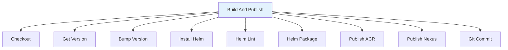

# Build Helm Chart

Pipeline de CI para empacotamento e publicação de Helm Charts.

## 🎯 Descrição

Pipeline completo de CI para Helm Charts que automatiza validação, empacotamento e publicação em repositórios corporativos (ACR OCI e Nexus).

O pipeline automatiza todo o processo de validação (`helm lint`), empacotamento e publicação de Helm Charts. Suporta publicação em Azure Container Registry via Helm OCI e Nexus via API HTTP, com versionamento semântico automático e integração com Azure Key Vault para gestão segura de credenciais.

Ideal para projetos Kubernetes que utilizam Helm Charts, oferece validação de sintaxe, versionamento automático no `Chart.yaml`, publicação paralela em múltiplos repositórios (ACR e Nexus), e commit automático de versão. Perfeito para equipes que precisam distribuir charts Helm de forma segura e automatizada seguindo práticas DevOps.

- [Pipeline utilizado para testes](https://dev.azure.com/telefonica-vivo-brasil/DevOps/_build?definitionId=44874)
- [Repositório de exemplo](https://dev.azure.com/telefonica-vivo-brasil/DevOps/_git/teste-build-helm)

## 🚀 Quick Start (5 minutos)

1. **Pré-requisitos**: Tenha pronto seu Helm Chart (Segundo o padrão do Helm)
2. **Crie o arquivo**: `.azuredevops/azure-pipeline-ci.yml` na raiz do repositório
3. **Cole o código**: Use o exemplo abaixo
4. **Commit e push**: `git add . && git commit -m "Add CI pipeline" && git push`
5. ✅ **Pipeline executa automaticamente!**
6. **Opcional**: Ajuste triggers conforme necessário

```yaml
# Pipeline básico para build e publicação de Helm Chart
# .azuredevops/azure-pipeline-ci.yml
resources:
  repositories:
    - repository: CodePlay
      name: DevOps/Vivo.CodePlay.Pipelines
      type: git
      ref: refs/heads/master
      endpoint: CodePlay

extends:
  template: /framework/pipelines/ci/build-helm/pipeline.yaml@CodePlay
```

**O que acontece com esta configuração:**

- ☸️ Validação do chart com `helm lint`
- 📦 Empacotamento do Helm Chart (`.tgz`)
- 🏷️ Nome do chart: ``{nome-repositorio}``
- 🔢 Versionamento semântico automático (incremento patch no `Chart.yaml`)
- 🔒 Credenciais seguras via Azure Key Vault
- 📤 Publicação no ACR (OCI) via service connection "DevOpsSharedResources"
- 📤 Publicação no Nexus via API HTTP
- 🔄 Commit automático da nova versão (apenas branches `master` ou `main`)

### 🚀 Próximos Passos Continuous Deployment (CD)

Após a publicação do Helm Chart nos repositórios corporativos (ACR e/ou Nexus), o próximo passo é realizar o deployment da aplicação em clusters Kubernetes. O CodePlay Framework oferece o pipeline de CD especializado para esta finalidade:

### Pipeline de CD Recomendado

#### [deploy-helm](../../cd/deploy-helm/README.md) - Deploy via Kubernetes/Helm

**Quando usar:** Para realizar o deployment de aplicações em clusters Kubernetes utilizando os Helm Charts publicados por este pipeline de CI.

**Principais recursos:**
- ☸️ Deploy automatizado via `helm upgrade --install`
- 🎯 Suporte a múltiplos ambientes e clusters (AKS, OpenShift, genéricos)
- 📊 Validação e comparação visual de mudanças (kubectl diff)
- 🔄 Rollback automático em falha
- 🔵 Blue/Green Deployment via Argo Rollouts
- 🔒 Aprovações via Azure DevOps Environments
- 📈 Registro de eventos no Event Hub para rastreabilidade
- 🗂️ Suporte a múltiplos namespaces e configurações

**Exemplo de uso:**
```yaml
# .azuredevops/azure-pipeline-cd.yml
trigger: none

parameters:
- name: version
  displayName: 'Versão da aplicação'
  type: string
  default: getLatestVersion()
- name: environment
  displayName: 'Versão da aplicação'
  type: string
  default: 'dev'
  values:
    - dev
    - prod
resources:
  repositories:
    - repository: CodePlay
      name: DevOps/Vivo.CodePlay.Pipelines
      type: git
      ref: refs/heads/master
      endpoint: CodePlay
  pipelines:
    - pipeline: <nome-exato-do-pipeline-ci>
      source: <nome-exato-do-pipeline-ci>
      trigger:
        branches:
          include:
            - master
            - <outras-branches-que-gostaria-que-iniciem-o-cd>

extends:
  template: /framework/pipelines/cd/deploy-helm/pipeline.yaml@CodePlay
  parameters:
    environment: dev
    version: getLatestVersion()
    helmChartName: $(Build.Repository.Name)  # usa o chart publicado pelo CI
    helmChartVersion: getLatestVersion()  # usa a versão publicada pelo CI

```

**💡 Dica:** O pipeline `deploy-helm` pode consumir tanto Helm Charts publicados por este pipeline quanto charts genéricos do repositório corporativo. Configure o parâmetro `helmChartName` de acordo com o nome do seu chart.

**Saiba mais:** Consulte a [documentação completa do deploy-helm](../../cd/deploy-helm/README.md) para configuração detalhada, estratégias de deployment avançadas e integração com Argo Rollouts.

**Saiba mais:** Consulte a [documentação completa da integração CI/CD ](https://dvps.redecorp.azr/portal/code/casos-de-uso/integrando-cicd#%EF%B8%8F-estrutura-da-integra%C3%A7%C3%A3o) para configuração detalhada e parâmetros avançados.

## 🏗️ Matriz de Capacidades

| Capacidade | Suporte | Descrição |
|------------|---------|-----------|
| [Trunk Based Development](https://dvps.redecorp.azr/portal/codeplay/capacidades/catalog/trunk-based-development) | ✅ | Pipeline executado em qualquer branch. Publicação e commit de versão condicionais apenas para branches `master` ou `main`. Branches de feature executam validação e empacotamento sem publicação. |
| [Build Automatizado](https://dvps.redecorp.azr/portal/codeplay/capacidades/catalog/build-automatizado) | ⚠️ | Empacotamento automatizado com `helm package`, validação com `helm lint`, Mudar versionamento para VersionManager. Artefatos gerados em ``$(Build.ArtifactStagingDirectory)/helm/package``. |
| [Testes Unitários](https://dvps.redecorp.azr/portal/codeplay/capacidades/catalog/testes-unitarios) | ❌ | Não aplicável para Helm Charts. Pipeline focado em validação de sintaxe e empacotamento. |
| [SAST](https://dvps.redecorp.azr/portal/codeplay/capacidades/catalog/sast) | ❌ | Não implementado. Pipeline focado em build e publicação de charts. |
| [SCA](https://dvps.redecorp.azr/portal/codeplay/capacidades/catalog/sca) | ❌ | Não implementado. Análise de dependências de charts pode ser adicionada futuramente. |
| [Gates de Segurança](https://dvps.redecorp.azr/portal/codeplay/capacidades/catalog/gates-de-seguranca) | ❌ | Não implementado. Credenciais seguras via Key Vault, mas sem gates de aprovação. |
| [Análise de Código](https://dvps.redecorp.azr/portal/codeplay/capacidades/catalog/analise-de-codigo) | ✅ | Validação de sintaxe e boas práticas com `helm lint`. Verifica estrutura do chart, templates válidos, e conformidade com padrões Helm. Execução obrigatória antes do empacotamento. |
| [Gates de Qualidade](https://dvps.redecorp.azr/portal/codeplay/capacidades/catalog/gate-de-qualidade) | ⚠️ | Parcialmente implementado via `helm lint`. Pipeline falha se lint detectar erros, mas não valida métricas de qualidade adicionais. Gates customizados devem ser configurados externamente. |
| [Rollback de Upgrade](https://dvps.redecorp.azr/portal/codeplay/capacidades/catalog/rollback-de-upgrade) | ❎ | Pipeline de CI - não aplicável para rollback de deploy. Rollback de releases Helm é responsabilidade do CD. |
| [Blue/Green Deployment](https://dvps.redecorp.azr/portal/codeplay/capacidades/catalog/blue-green-deployment) | ❎ | Pipeline de CI - estratégias de deployment são responsabilidade do CD. |
| [Canary Release](https://dvps.redecorp.azr/portal/codeplay/capacidades/catalog/canary-release) | ❎ | Pipeline de CI - estratégias de release são responsabilidade do CD. |

**Legenda:**

- ✅ Suportado nativamente
- ❌ Não suportado
- ⚠️ Suportado com limitações ou condições
- 🚧 Planejado / Em Construção
- ❎ Não faz sentido habilitar essa capacidade

## 🔄 Estrutura do Pipeline

O pipeline é organizado em um único estágio `BuildAndPublish` que executa todas as operações sequencialmente. As publicações no ACR e Nexus são condicionais baseadas nos parâmetros `useACRToPublish` e `useNexusToPublish`, e todas as operações de publicação são restritas às branches `master` ou `main`.



### Estágios do Pipeline

1. **☸️ Build And Publish**
   - Checkout do código fonte
   - Leitura e incremento da versão no `Chart.yaml`
   - Instalação do Helm via `HelmInstaller@1`
   - Validação com `helm lint`
   - Empacotamento com `helm package` gerando `.tgz`
   - Publicação condicional no ACR via `helm registry login` e `helm push` (OCI)
   - Publicação condicional no Nexus via curl/API HTTP
   - Commit e tag da nova versão no Git (apenas `master`/`main`)

## ⚙️ Parâmetros Disponíveis

### Infraestrutura e Ambiente

#### agentPool

- **nome**: agentPool
- **tipo**: string
- **default**: "GeneralPurposeLinuxAgentsCI"
- **descrição**: Pool de agentes Linux onde o job será executado. Deve ter Helm, `yq` (v4+) e ferramentas Git disponíveis. O pool padrão é otimizado para builds de CI com suporte a containers.
- **dependências**: Pool deve existir na organização e ter ferramentas necessárias instaladas.

### Publicação no ACR (Helm OCI)

#### useACRToPublish

- **nome**: useACRToPublish
- **tipo**: boolean
- **default**: true
- **descrição**: Habilita publicação do chart no Azure Container Registry via protocolo OCI. Quando habilitado, o pipeline recupera credenciais do Azure Key Vault (``HELM-REGISTRY-ACR-PUBLISH-USERNAME`` e ``HELM-REGISTRY-ACR-PUBLISH-PASSWORD``) e executa `helm registry login` seguido de `helm push`.
- **dependências**: Requer service connection `DevOpsSharedResources` com acesso ao Key Vault `kv-azdevops-shared` contendo os segredos especificados.

#### acrUrlChartRepository

- **nome**: acrUrlChartRepository
- **tipo**: string
- **default**: "oci://acrsharedservices01.azurecr.io/helm/$(SIGLA)"
- **descrição**: URL completa do repositório OCI no ACR onde o chart será publicado. A variável ``$(SIGLA)`` é automaticamente calculada a partir do nome do projeto (``System.TeamProject``). O pipeline extrai o host do registry desta URL para executar o login.
- **dependências**: URL deve apontar para um ACR acessível com as credenciais do Key Vault. Formato: ``oci://<acr-host>/helm/<namespace>``.

### Publicação no Nexus (API HTTP)

#### useNexusToPublish

- **nome**: useNexusToPublish
- **tipo**: boolean
- **default**: true
- **descrição**: Habilita publicação do chart no Nexus corporativo via upload HTTP. Quando habilitado, o pipeline recupera credenciais do Azure Key Vault (``HELM-REGISTRY-NEXUS-USERNAME`` e ``HELM-REGISTRY-NEXUS-PASSWORD``) e executa `curl` com upload do arquivo `.tgz`.
- **dependências**: Requer service connection `DevOpsSharedResources` com acesso ao Key Vault `kv-azdevops-shared` contendo os segredos especificados.

#### nexusUrlChartRepository

- **nome**: nexusUrlChartRepository
- **tipo**: string
- **default**: "https://nexus.telefonica.com.br/repository"
- **descrição**: URL base do Nexus corporativo onde os charts são armazenados. O pipeline constrói a URL completa de upload combinando esta base com o `nexusRepositoryNamespace` e a ``$(SIGLA)`` do projeto.
- **dependências**: Deve ser acessível a partir do agent pool com as credenciais do Key Vault.

#### nexusRepositoryNamespace

- **nome**: nexusRepositoryNamespace
- **tipo**: string
- **default**: "devops-helm"
- **descrição**: Namespace/repositório dentro do Nexus onde o chart será armazenado. O caminho final de upload será construído como ``{nexusUrlChartRepository}/{nexusRepositoryNamespace}/$(SIGLA)``.
- **dependências**: Namespace deve existir no Nexus e permitir uploads com as credenciais configuradas.

### Configuração do Helm Chart

#### helmChartName

- **nome**: helmChartName
- **tipo**: string
- **default**: "$(Build.Repository.Name)"
- **descrição**: Nome do Helm Chart conforme definido no `Chart.yaml`. Usado para construir o nome do arquivo empacotado (``{helmChartName}-{version}.tgz``). Por padrão, usa o nome do repositório Git.
- **dependências**: Deve corresponder ao campo `name` no arquivo `Chart.yaml` do repositório.

#### helmChartPath

- **nome**: helmChartPath
- **tipo**: string
- **default**: `$(Build.SourcesDirectory)`
- **descrição**: Caminho absoluto para o diretório raiz do Helm Chart que contém o arquivo `Chart.yaml`. O pipeline usa este caminho para executar `helm lint` e `helm package`.
- **dependências**: Diretório deve conter um `Chart.yaml` válido e a estrutura padrão de um Helm Chart (templates, values.yaml, etc.).

### Configurações de Versionamento

#### helmToolVersion

- **nome**: helmToolVersion
- **tipo**: string
- **default**: "3.19.2"
- **descrição**: Versão do Helm a ser instalada no agente para executar operações de lint, package e push. Define qual versão do binário Helm será baixada e configurada via task `HelmInstaller@1`. Recomenda-se usar versões 3.x para compatibilidade com OCI registries.
- **dependências**: Versão deve estar disponível no repositório oficial do Helm. Consulte [Helm Releases](https://github.com/helm/helm/releases) para versões válidas.

#### versionFile

- **nome**: versionFile
- **tipo**: string
- **default**: "Chart.yaml"
- **descrição**: Nome do arquivo de versionamento do Helm Chart onde o campo `version` será lido e atualizado. Por padrão, aponta para `Chart.yaml` na raiz do `helmChartPath`. O pipeline incrementa automaticamente o campo `version` deste arquivo seguindo a estratégia definida em `branchingStrategy`.
- **dependências**: Arquivo deve existir no caminho `{helmChartPath}/{versionFile}` e conter um campo `version` válido em formato semântico (ex: `1.0.0`).

#### branchingStrategy

- **nome**: branchingStrategy
- **tipo**: string
- **default**: "trunkbased"
- **descrição**: Estratégia de branching e versionamento semântico utilizada para calcular a próxima versão do chart. Define como o pipeline interpreta branches e incrementa a versão no arquivo `Chart.yaml`.
- **valores possíveis**:
  - ``trunkbased``: Trunk Based Development (padrão)
  - ``vivoflow``: Vivo Flow (estratégia customizada Vivo)
  - ``releaseflow``: Release Flow
  - ``gitlabflow``: GitLab Flow
  - ``gitlabflow-semantic``: GitLab Flow com semantic versioning
  - ``custom``: Estratégia customizada
- **dependências**: Utilizada pela task `VersionManagerVivo@8` para calcular a próxima versão. A estratégia escolhida deve ser compatível com o modelo de branching do repositório.

## 🔧 Dependências Externas

### Service Connections Necessárias

#### 1. Azure Resource Manager (DevOpsSharedResources)

- **Nome padrão**: `DevOpsSharedResources`
- **Tipo**: Azure Resource Manager
- **Uso**: Acesso ao Azure Key Vault para recuperação de credenciais de publicação (ACR e Nexus)
- **Permissões necessárias**:
  - Permissão de leitura (Get) no Key Vault `kv-azdevops-shared`
  - Permissão de leitura em segredos específicos (veja seção Azure Key Vault)
- **Configurável via**: Não configurável - service connection obrigatória

### Agent Pool Requirements

#### Pool de Agentes

- **Pool padrão**: `GeneralPurposeLinuxAgentsCI`
- **Sistema Operacional**: Linux
- **Ferramentas obrigatórias**:
  - Helm (instalado automaticamente via `HelmInstaller@1` se não disponível)
  - `yq` v4+ (para manipulação do `Chart.yaml`)
  - Git (para checkout e commit de versão)
  - `curl` (para publicação no Nexus)
  - Bash/Shell (para execução de scripts)
- **Acesso de rede**:
  - Acesso ao Azure Container Registry especificado em `acrUrlChartRepository`
  - Acesso ao Nexus corporativo: `https://nexus.telefonica.com.br`
  - Acesso ao Azure DevOps para Git operations

### Arquivos Obrigatórios no Repositório

#### 1. Chart.yaml

- **Localização padrão**: Raiz do repositório (ou conforme `helmChartPath`)
- **Configurável via**: parâmetro `helmChartPath`
- **Requisitos**:
  - Sintaxe YAML válida
  - Campo `name` correspondente ao `helmChartName`
  - Campo `version` em formato semântico (ex: `1.0.0`)
  - Conformidade com especificação Helm Chart v3
- **Comportamento**: Pipeline incrementa automaticamente o campo `version` (patch) e faz commit da nova versão

#### 2. Estrutura do Helm Chart

- **Localização padrão**: Raiz do repositório
- **Configurável via**: parâmetro `helmChartPath`
- **Requisitos**:
  - Diretório `templates/` com manifests Kubernetes válidos
  - Arquivo `values.yaml` (opcional mas recomendado)
  - Sintaxe válida para `helm lint`
- **Comportamento**: Pipeline valida toda a estrutura com `helm lint` antes do empacotamento

### Integrações Externas de Segurança

#### 1. Azure Key Vault (kv-azdevops-shared)

- **Descrição**: Armazenamento seguro de credenciais para publicação em registries externos
- **Requisitos**:
  - Service connection `DevOpsSharedResources` configurada
  - Permissões de leitura para o pipeline
- **Segredos para ACR** (quando `useACRToPublish=true`):
  - `HELM-REGISTRY-ACR-PUBLISH-USERNAME`
  - `HELM-REGISTRY-ACR-PUBLISH-PASSWORD`
- **Segredos para Nexus** (quando `useNexusToPublish=true`):
  - `HELM-REGISTRY-NEXUS-USERNAME`
  - `HELM-REGISTRY-NEXUS-PASSWORD`
- **Observação**: Procure o time DevOps Support para configuração e acesso aos segredos

### Permissões de Repositório Git

O pipeline requer permissões especiais para operações Git:

- **Permissão de escrita** no repositório Git (para commit de versão)
- **Capacidade de criar tags** Git (para taggeamento de versões)
- **Checkout com `persistCredentials: true`** (configurado automaticamente)
- **Restrição**: Operações Git (commit/tag) são executadas apenas em branches `master` ou `main`

### Variáveis de Sistema Necessárias

| Variável | Origem | Uso |
|----------|--------|-----|
| `Build.Repository.Name` | Azure DevOps | Nome padrão do chart quando `helmChartName` não especificado |
| `Build.SourcesDirectory` | Azure DevOps | Diretório padrão do chart quando `helmChartPath` não especificado |
| `Build.ArtifactStagingDirectory` | Azure DevOps | Diretório base para armazenamento do arquivo `.tgz` empacotado |
| `System.TeamProject` | Azure DevOps | Usado para calcular ``$(SIGLA)`` do projeto (primeiro termo em lowercase) |
| `Build.SourceBranch` | Azure DevOps | Validação de branch para publicação (apenas `master`/`main`) |


## 🎨 Comportamentos Customizados

:::danger
**⚠️ ATENÇÃO: CUSTOMIZAÇÕES REQUEREM RESPONSABILIDADE ⚠️**

- ✅ **Use os exemplos como ponto de partida** - Eles demonstram padrões seguros e testados
- 🧠 **"Todos somos adultos"** - Confiamos na sua expertise, mas exigimos consciência do impacto
- 📝 **Tudo fica registrado** - Seu histórico de commits é auditável e rastreável
- 🎯 **Entenda antes de modificar** - Customizações incorretas podem quebrar builds em produção
- 🤝 **Documente suas decisões** - Facilite a manutenção futura por outros membros da equipe

**Customizar é permitido. Fazer sem entender não é.**
:::

### Publicação Apenas no ACR

```yaml
# .azuredevops/azure-pipeline-ci.yml
resources:
  repositories:
    - repository: CodePlay
      name: DevOps/Vivo.CodePlay.Pipelines
      type: git
      ref: refs/heads/master
      endpoint: CodePlay

extends:
  template: /framework/pipelines/ci/build-helm/pipeline.yaml@CodePlay
  parameters:
    helmChartName: 'my-application-chart'
    useACRToPublish: true                              # Habilita ACR
    useNexusToPublish: false                           # Desabilita Nexus
    acrUrlChartRepository: 'oci://acrsharedservices01.azurecr.io/helm/myteam'
```

### Publicação Apenas no Nexus

```yaml
# .azuredevops/azure-pipeline-ci.yml
resources:
  repositories:
    - repository: CodePlay
      name: DevOps/Vivo.CodePlay.Pipelines
      type: git
      ref: refs/heads/master
      endpoint: CodePlay

extends:
  template: /framework/pipelines/ci/build-helm/pipeline.yaml@CodePlay
  parameters:
    helmChartName: 'my-application-chart'
    useACRToPublish: false                              # Desabilita ACR
    useNexusToPublish: true                             # Habilita Nexus
    nexusUrlChartRepository: 'https://nexus.telefonica.com.br/repository'
    nexusRepositoryNamespace: 'devops-helm'
```

### Validação Sem Publicação (CI para PRs)

```yaml
# .azuredevops/azure-pipeline-ci.yml
resources:
  repositories:
    - repository: CodePlay
      name: DevOps/Vivo.CodePlay.Pipelines
      type: git
      ref: refs/heads/master
      endpoint: CodePlay

extends:
  template: /framework/pipelines/ci/build-helm/pipeline.yaml@CodePlay
  parameters:
    useACRToPublish: false                              # Desabilita publicação
    useNexusToPublish: false                            # Desabilita publicação
    # Pipeline executa apenas lint e package para validação
```

### Chart em Subdiretório com Pool Customizado

```yaml
# .azuredevops/azure-pipeline-ci.yml
resources:
  repositories:
    - repository: CodePlay
      name: DevOps/Vivo.CodePlay.Pipelines
      type: git
      ref: refs/heads/master
      endpoint: CodePlay

extends:
  template: /framework/pipelines/ci/build-helm/pipeline.yaml@CodePlay
  parameters:
    agentPool: 'CustomLinuxPool'                        # Pool específico
    helmChartName: 'my-microservice'
    helmChartPath: '$(Build.SourcesDirectory)/charts/my-microservice'  # Chart em subdiretório
    useACRToPublish: true
    acrUrlChartRepository: 'oci://acrsharedservices01.azurecr.io/helm/microservices'
```

### Publicação Dual (ACR + Nexus)

```yaml
# .azuredevops/azure-pipeline-ci.yml
resources:
  repositories:
    - repository: CodePlay
      name: DevOps/Vivo.CodePlay.Pipelines
      type: git
      ref: refs/heads/master
      endpoint: CodePlay

extends:
  template: /framework/pipelines/ci/build-helm/pipeline.yaml@CodePlay
  parameters:
    helmChartName: 'enterprise-app'
    useACRToPublish: true                               # Publica no ACR
    useNexusToPublish: true                             # Publica no Nexus
    acrUrlChartRepository: 'oci://acrsharedservices01.azurecr.io/helm/enterprise'
    nexusUrlChartRepository: 'https://nexus.telefonica.com.br/repository'
    nexusRepositoryNamespace: 'devops-helm'
```

## 🔖 Variáveis de Ambiente

As seguintes variáveis de ambiente são automaticamente configuradas pelo pipeline:

| Variável | Descrição | Valor Padrão |
|----------|-----------|--------------|
| `HELM_ARTIFACTS_DIR` | Diretório onde o pacote `.tgz` é armazenado após empacotamento | ``$(Build.ArtifactStagingDirectory)/helm/package`` |
| `VERSION_FILE` | Caminho completo para o arquivo `Chart.yaml` que será versionado | ``${{ parameters.helmChartPath }}/Chart.yaml`` |
| `SIGLA` | Sigla do projeto extraída do ``System.TeamProject`` (primeiro termo em lowercase) | Calculada: ``lower(split(variables['System.TeamProject'],' ')[0])`` |
| `ACR_USERNAME` | Username para autenticação no ACR (recuperado do Key Vault quando `useACRToPublish=true`) | Segredo do Key Vault |
| `ACR_PASSWORD` | Password para autenticação no ACR (recuperado do Key Vault quando `useACRToPublish=true`) | Segredo do Key Vault |
| `NEXUS_USERNAME` | Username para autenticação no Nexus (recuperado do Key Vault quando `useNexusToPublish=true`) | Segredo do Key Vault |
| `NEXUS_PASSWORD` | Password para autenticação no Nexus (recuperado do Key Vault quando `useNexusToPublish=true`) | Segredo do Key Vault |

## ❓ FAQ

### Onde posso encontrar mais informações sobre o CodePlay Framework?

Você pode encontrar mais informações sobre o CodePlay Framework na [documentação oficial](https://dvps.redecorp.azr/portal/codeplay/framework/).

### Onde encontro as capacidades disponíveis?

As capacidades disponíveis podem ser encontradas no [Catálogo de Capacidade](https://dvps.redecorp.azr/portal/catalog/capabilities) no Portal CodePlay.

### Como faço para customizar o pipeline?

Siga o guia de [Adoção ao CodePlay](https://dvps.redecorp.azr/portal/codeplay/roteiro/codeplay#fluxo-de-ado%C3%A7%C3%A3o-ao-codeplay).

### Quais casos de uso relevantes?

- Ainda não temos casos de uso específicos documentados para este pipeline.
- Veja o [Catálogo de Casos de Uso](https://dvps.redecorp.azr/portal/catalog/casos-de-uso) para outros exemplos de casos de uso.

### Quais Erros Comuns relevantes?

- Ainda não temos erros comuns documentados para este pipeline.
- Veja o [Catálogo de Erros Conhecidos](https://dvps.redecorp.azr/portal/catalog/erros-conhecidos) para outros exemplos de erros.

### Por que meu chart não está sendo publicado?

O pipeline só publica charts em branches `master` ou `main`. Se você está executando o pipeline em uma branch de feature ou PR, o chart será apenas validado e empacotado, mas não publicado. Verifique também se os parâmetros `useACRToPublish` ou `useNexusToPublish` estão habilitados.

### Como configurar credenciais no Key Vault?

Entre em contato com o time DevOps Support para configurar os segredos necessários no Key Vault `kv-azdevops-shared`. Os segredos obrigatórios são:

- Para ACR: `HELM-REGISTRY-ACR-PUBLISH-USERNAME` e `HELM-REGISTRY-ACR-PUBLISH-PASSWORD`
- Para Nexus: `HELM-REGISTRY-NEXUS-USERNAME` e `HELM-REGISTRY-NEXUS-PASSWORD`

### O pipeline falhou com "Pacote .tgz não encontrado"

Verifique se:

1. O `helmChartName` corresponde ao campo `name` no seu `Chart.yaml`
2. O `helmChartPath` aponta para o diretório correto contendo o `Chart.yaml`
3. O `helm lint` passou com sucesso (erros de lint impedem o empacotamento)
4. O arquivo `Chart.yaml` está formatado corretamente


## 🆘 Suporte

- [Abra um chamado para Dev Support](https://dvps.redecorp.azr/portal/codeplay/roteiro/#:~:text=Abra%20um%20chamado%20para%20Dev%20Support)
- [Canal DevEx - Azure DevOps](https://teams.microsoft.com/l/channel/19%3A8fbd00946cf044d7a844182ac71e6aa1%40thread.tacv2/Azure%20DevOps?groupId=038b4415-d6dd-42ce-92e5-31a8e2a13bf8&tenantId=9744600e-3e04-492e-baa1-25ec245c6f10)

## 📝 Decisões Tomadas

### Decisão 1: Versionamento via Scripts Bash

- **Data**: 20/08/2025
- **Motivador**: VersionManager (custom task) ainda não foi criado
- **Forum Envolvido**: Equipe DevOps Soluções
- **Descrição**: Versionamento implementado com scripts bash (`yq` e `semver-bump`) e templates devido à indisponibilidade do VersionManager. Deve ser migrado para custom task quando disponível para seguir o princípio "Custom Tasks First" do framework.
- **Impacto**: Não segue o princípio "Custom Tasks First". Lógica de versionamento distribuída em múltiplos scripts bash reduz reutilização e padronização.
- **Próximos Passos**: Criar custom task VersionManager que encapsule lógica de leitura, incremento e atualização de versões em diferentes formatos de arquivo (Chart.yaml, package.json, pom.xml, etc.).
- **Referências**: N/A

### Decisão 2: Validação de Branch para Publicação

- **Data**: 08/09/2025
- **Motivador**: Controle de quando charts são publicados em registries corporativos
- **Forum Envolvido**: Equipe DevOps Soluções
- **Descrição**: Implementada validação inline nos scripts bash para publicação apenas em branches `master` ou `main`. Esta lógica deveria ser responsabilidade do VersionManager custom task, mas foi implementada temporariamente em scripts para suportar trunk-based development de forma segura.
- **Impacto**: Não segue o princípio "Custom Tasks First". Lógica de validação de branch duplicada em múltiplos pontos do pipeline (ACR e Nexus publish).
- **Próximos Passos**: Migrar validação de branch para VersionManager custom task, que deve retornar informações sobre qual branch está sendo executada e se deve ou não publicar/commitar.
- **Referências**: N/A

### Decisão 3: Publicação Dual (ACR OCI + Nexus HTTP)

- **Data**: 08/09/2025
- **Motivador**: Diferentes equipes e ambientes utilizam diferentes repositórios de charts (ACR vs Nexus)
- **Forum Envolvido**: Equipe DevOps Soluções
- **Descrição**: Pipeline suporta publicação simultânea em ACR (via Helm OCI) e Nexus (via API HTTP) através de parâmetros booleanos independentes (`useACRToPublish` e `useNexusToPublish`). Permite flexibilidade para equipes que precisam distribuir charts em múltiplos repositórios ou migrar gradualmente de Nexus para ACR.
- **Impacto**: Aumenta tempo de execução do pipeline quando ambos estão habilitados. Requer manutenção de credenciais em dois sistemas diferentes.
- **Próximos Passos**: Avaliar consolidação em um único repositório corporativo padrão após período de migração.
- **Referências**: N/A
