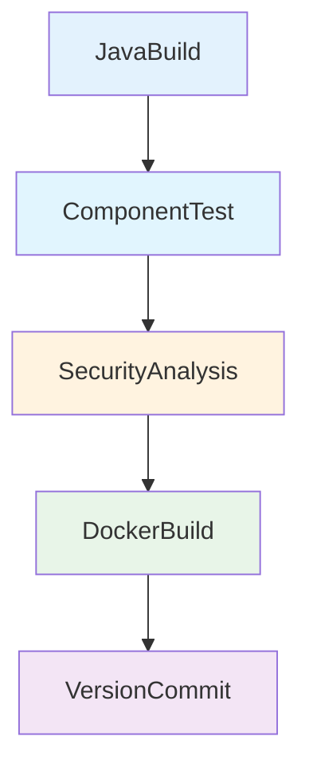

# Pipeline Java Docker CI

Pipeline de CI para aplicações Java containerizadas com análises de segurança.

## 🎯 Descrição

Pipeline completo de CI para aplicações Java que gera imagens Docker, com análises de qualidade e segurança e versionamento automatizado.

O pipeline automatiza todo o processo de construção, teste e publicação de aplicações Java containerizadas. Utiliza Maven para build, JUnit e JaCoCo para testes e cobertura, Fortify para análise SAST, e imagens Docker com BuildKit publicadas no Azure Container Registry (ACR).

O pipeline resolve automaticamente a versão de Java via ASDF com base no arquivo `.tool-versions` do projeto (no `workingDirectory`), oferece cache inteligente de dependências Maven e versionamento semântico automático. Ideal para projetos Java Spring Boot, microserviços, APIs REST e aplicações corporativas que seguem práticas DevSecOps.

- [Pipeline utilizado para testes](https://dev.azure.com/telefonica-vivo-brasil/DevOps/_build?definitionId=44875)
- [Repositório de exemplo](https://dev.azure.com/telefonica-vivo-brasil/DevOps/_git/teste-build-java-docker)

## 🚀 Quick Start (5 minutos)

1. **Pré-requisitos**: Tenha pronto seu projeto Java com `pom.xml` e `Dockerfile` na raiz (Com as devidas configurações)
2. **Crie o arquivo**: `.azuredevops/azure-pipeline-ci.yml` na raiz do repositório
3. **Cole o código**: Use o exemplo abaixo
4. **Commit e push**: `git add . && git commit -m "Add CI pipeline" && git push`
5. ✅ **Pipeline executa automaticamente!**
6. **Opcional**: Ajuste triggers conforme necessário

```yaml
# Pipeline básico para build Java + Docker com análises de segurança
# .azuredevops/azure-pipeline-ci.yml
resources:
  repositories:
    - repository: CodePlay
      name: DevOps/Vivo.CodePlay.Pipelines
      type: git
      ref: refs/heads/master
      endpoint: CodePlay

extends:
  template: /framework/pipelines/ci/build-java-docker/pipeline.yaml@CodePlay
```

:::warning
Certifique-se de que o arquivo `pom.xml` está configurado corretamente com os plugins necessários para testes e cobertura de código, como o JaCoCo e o Surefire. Além disso, valide que os testes unitários estão corretamente implementados.
Veja o [Repositório de exemplo](https://dev.azure.com/telefonica-vivo-brasil/DevOps/_git/teste-build-java-docker) para mais detalhes.
:::


**O que acontece com esta configuração:**

- ☕ Build com Java resolvido via ASDF (`.tool-versions`) e Maven 3.9.9
- ✅ Execução de testes unitários com JUnit
- 📊 Relatório de cobertura de código com JaCoCo
- 🔒 Análise SAST (Fortify) e SCA (Dependency Track) em paralelo
- ⚡ Cache inteligente de dependências Maven
- 📈 Análise de qualidade de código com SonarQube
- 🝳 Build da imagem Docker: `{sigla}/{nome-repositorio}:versao`
- 🝷︝ Versionamento semântico automático (incremento patch)
- 📤 Push para Azure Container Registry via service connection "ACR-DEVOPS"
- 📡 Publicação do evento de build no Event Hub para rastreabilidade corporativa
- 🔖 Criação de tag Git e commit de versão (apenas branch master)

### 🚀 Próximos Passos Continuous Deployment (CD)

Após o build e publicação da imagem Docker no Azure Container Registry, o próximo passo é realizar o deployment da aplicação Java nos ambientes desejados. O CodePlay Framework oferece múltiplas opções de CD dependendo da sua infraestrutura:

### Pipelines de CD Disponíveis

#### [deploy-helm](../../cd/deploy-helm/README.md) - Deploy via Kubernetes/Helm

**Quando usar:** Para aplicações Java (Spring Boot, microserviços) em clusters Kubernetes (AKS, OpenShift ou genéricos).

**Principais recursos:**
- ☸︝ Deploy automatizado via Helm Charts
- 🎯 Suporte a múltiplos ambientes e clusters
- 🔄 Rollback automático em falha
- 📊 Comparação visual de mudanças (kubectl diff)
- 🔵 Blue/Green Deployment via Argo Rollouts
- 🔒 Aprovações via Azure DevOps Environments

**Exemplo de uso:**
```yaml
# .azuredevops/azure-pipeline-cd.yml
trigger: none

parameters:
- name: version
  displayName: 'Versão da aplicação'
  type: string
  default: getLatestVersion()
- name: environment
  displayName: 'Versão da aplicação'
  type: string
  default: 'dev'
  values:
    - dev
    - prod
resources:
  repositories:
    - repository: CodePlay
      name: DevOps/Vivo.CodePlay.Pipelines
      type: git
      ref: refs/heads/master
      endpoint: CodePlay

extends:
  template: /framework/pipelines/cd/deploy-helm/pipeline.yaml@CodePlay
  parameters:
    environment: dev
    version: getLatestVersion()
    helmChartName: generic-microservice
    helmChartVersion: 1.0.34
```

**Saiba mais:** Consulte a documentação completa de cada pipeline de CD para configuração detalhada e parâmetros avançados.

**Saiba mais:** Consulte a [documentação completa da integração CI/CD ](https://dvps.redecorp.azr/portal/code/casos-de-uso/integrando-cicd#%EF%B8%8F-estrutura-da-integra%C3%A7%C3%A3o) para configuração detalhada e parâmetros avançados.
https://dvps.redecorp.azr/portal/codeplay/roteiro/azure-pipelines/azure-devops-agents#hostnames--ips

## 🝗︝ Matriz de Capacidades

| Capacidade | Suporte | Descrição |
|------------|---------|-----------|
| [Trunk Based Development](https://dvps.redecorp.azr/portal/codeplay/capacidades/catalog/trunk-based-development) | ✅ | Pipeline executado em qualquer branch. Commit de versão e push Docker condicionais via `prValidationOnly=false` (padrão). PRs podem usar `prValidationOnly=true` para validação completa sem publicação. |
| [Build Automatizado](https://dvps.redecorp.azr/portal/codeplay/capacidades/catalog/build-automatizado) | ✅ | Build Maven automatizado com compilação (`clean compile package`), gestão de dependências via Nexus/Azure Artifacts (`useNexusToAuth`), cache inteligente de dependências (`enableCache`), e suporte a múltiplas versões Java via ASDF. |
| [Testes Unitários](https://dvps.redecorp.azr/portal/codeplay/capacidades/catalog/testes-unitarios) | ✅ | Execução de testes JUnit com Maven (`test`), publicação de resultados no Azure DevOps via `PublishTestResults@2`, e falha do pipeline em caso de testes falhados. Habilitado via `enableTest=true` (padrão). |
| [Testes de Integração](https://dvps.redecorp.azr/portal/codeplay/capacidades/catalog/testes-de-integracao) | ✅ | Testes de componente com Docker Compose, execução isolada com serviços auxiliares (DB, cache, filas), coleta de logs e resultados. Habilitado via `runComponentTest=true`. Requer arquivo docker-compose configurado. |
| [Cobertura de Código](https://dvps.redecorp.azr/portal/codeplay/capacidades/catalog/cobertura-de-codigo) | ✅ | Análise de cobertura com JaCoCo (`jacoco:report`), publicação de relatórios HTML/XML via `PublishCodeCoverageResults@2`, integração com SonarQube. Habilitado via Requer plugin JaCoCo no pom.xml. |
| [SAST](https://dvps.redecorp.azr/portal/codeplay/capacidades/catalog/sast) | ✅ | Análise estática de código com Fortify ScanCentral e SSC, execução em paralelo ao build Java, integração com Conviso para gestão de vulnerabilidades. Sempre habilitado. Exclusões customizadas via `enableFortifyExclusions=true`. |
| [SCA](https://dvps.redecorp.azr/portal/codeplay/capacidades/catalog/sca) | ✅ | Análise de composição de software com Dependency Track, detecção de vulnerabilidades em dependências. **A execução e o controle do SCA são realizados pelo time de AppSec.** Suporta projetos Maven/Gradle. |
| [Gates de Segurança](https://dvps.redecorp.azr/portal/codeplay/capacidades/catalog/gates-de-seguranca) | ✅ | O controle dos gates de segurança (bloqueio ou não do pipeline) é realizado pelo time de AppSec via chaves de configuração recuperadas do AppConfig corporativo (`SKIP_SECURITY_GATE`, `SKIP_SECURITY_GATE_SCA` etc). |
| [Análise de Código](https://dvps.redecorp.azr/portal/codeplay/capacidades/catalog/analise-de-codigo) | ✅ | Análise estática completa com SonarQube (qualidade de código, code smells, bugs, vulnerabilidades), integração com JaCoCo para cobertura, quality gate configurável. Habilitado via `runQualityGate=true` (padrão). Configuração via `sonar-project.properties` ou Azure App Configuration. |
| [Gates de Qualidade](https://dvps.redecorp.azr/portal/codeplay/capacidades/catalog/gate-de-qualidade) | ✅ | Quality Gate do SonarQube com validação automática de métricas (cobertura, duplicação, complexidade, bugs, vulnerabilidades). Quality Gate configurável via `sonarQualityGate`. Timeout ajustável via `sonarPollingTimeoutSec` (padrão 300s). |
| [Rollback de Upgrade](https://dvps.redecorp.azr/portal/codeplay/capacidades/catalog/rollback-de-upgrade) | ❎ | Pipeline de CI - não aplicável para rollback de deploy |
| [Blue/Green Deployment](https://dvps.redecorp.azr/portal/codeplay/capacidades/catalog/blue-green-deployment) | ❎ | Pipeline de CI - estratégias de deployment são responsabilidade do CD |
| [Canary Release](https://dvps.redecorp.azr/portal/codeplay/capacidades/catalog/canary-release) | ❎ | Pipeline de CI - estratégias de release são responsabilidade do CD |

**Legenda:**

- ✅ Suportado nativamente
- ❌ Não suportado
- ⚠︝ Suportado com limitações ou condições
- 🚧 Planejado / Em Construção
- ❎ Não aplicável para este tipo de pipeline

## 🔄 Estrutura do Pipeline

O pipeline é organizado em quatro estágios principais em fluxo sequencial: **JavaBuild** executa o build e testes da aplicação; **SecurityAnalysis** roda a análise SAST (Fortify) após o build; **DockerBuild** executa após `SecurityAnalysis` para construir e publicar a imagem Docker; e **VersionCommit** executa quando `prValidationOnly=false` para criar tags Git e commit de versionamento.

Esta arquitetura prioriza rastreabilidade e controle de segurança entre estágios, com gates gerenciados pelo AppSec.



### Estágios do Pipeline

1. **☕ JavaBuild - Build & Test Java Application**
   - Configuração do ambiente Java (ASDF) e Maven
   - Autenticação opcional no Nexus via Azure Key Vault (`useNexusToAuth`)
   - Cache inteligente de dependências Maven (`enableCache`)
   - Build Maven com compilação e empacotamento (`clean compile package`)
   - Execução condicional de testes unitários JUnit (`enableTest`)
   - Geração de relatório de cobertura JaCoCo
   - Análise de qualidade SonarQube com quality gate (`runQualityGate`)
   - Publicação de artefatos JAR para próximos stages

2. **🧪 ComponentTest - Component Tests** (Condicional - apenas quando `runComponentTest=true`)
   - Download de artefatos JAR do stage JavaBuild
   - Execução de testes de integração com componentes externos via Docker Compose
   - Suporte a banco de dados, cache, filas e outros serviços
   - Coleta e publicação de resultados de testes
   - Salvamento de logs de containers para troubleshooting
   - Limpeza automática de containers após execução

3. **🔒 SecurityAnalysis - Security Analysis**
   - **Job 1 - AppSecConfigKeys**: Recupera chaves de configuração do AppSec via AppConfig corporativo
   - **Job 2 - FortifyScan**: Análise SAST com Fortify ScanCentral, checkout opcional de exclusões (`enableFortifyExclusions`) controle via AppSec, integração com Conviso

4. **🝳 DockerBuild - Docker Build** (Depende de JavaBuild + ComponentTest + SecurityAnalysis)
   - Download de artefatos JAR do stage JavaBuild
   - Cópia de JARs para contexto Docker
   - Build da imagem Docker com BuildKit (template `docker-build-and-push`)
   - Recebe variáveis de controle de segurança para decisões de gate no estágio (`USE_DT_DOCKER`, `SKIP_SECURITY_GATE_SCA`)
   - Push condicional para ACR (apenas quando `prValidationOnly=false`)

5. **🔖 VersionCommit - Commit Version** (Condicional - apenas quando `prValidationOnly=false`)
   - Checkout com credenciais persistentes (`persistCredentials: true`)
   - Reafirmação da versão semântica
   - Commit automático de alterações no `pom.xml`
   - Criação de tag Git com a versão de release
   - Publicação do evento de build no Event Hub via `VivoEventHubTools@3`


### Lógica Condicional de Publicação Docker

O pipeline implementa uma lógica condicional inteligente para controlar quando imagens Docker devem ser publicadas:

**Comportamentos:**
- **`prValidationOnly=false`**: ✅ Publica imagem (cenário padrão de produção)
- **`prValidationOnly=true`**: ❌ Não publica (validação de PR)

Esta abordagem garante que Pull Requests nunca publiquem imagens acidentalmente, enquanto permite execução de todas as validações necessárias.

**Nota**: Configurações específicas do projeto devem ser definidas como parâmetros, não como variáveis de ambiente.

## Parâmetros Disponíveis

Configure o comportamento do pipeline através dos seguintes parâmetros. Para cada parâmetro, documente claramente seu propósito e impacto.

#### agentPool

- **nome**: agentPool
- **tipo**: string
- **default**: "GeneralPurposeLinuxAgentsCI"
- **descrição**: "Define o pool de agentes Azure DevOps para execução do pipeline. Deve ser um pool com agentes Linux configurados com ferramentas Java e Docker."
- **dependências**: Pool de agentes com Java (via ASDF), Maven, Docker e acesso ao Azure Container Registry

#### useNetworkProxy

- **nome**: useNetworkProxy
- **tipo**: boolean
- **default**: false
- **descrição**: Configurar proxy de rede para acesso externo. Deve ser `true` para pipelines executados em pools de agentes on-premises como "VivoOnPremDevAgents", "VivoOnPremHmlAgents" e "VivoOnPremPrdAgents".
- **dependências**: Nenhuma.

#### useNexusToAuth

- **nome**: useNexusToAuth
- **tipo**: boolean
- **default**: false
- **descrição**: "Usar autenticação com o Nexus (true) além do Azure Artifacts para dependências Maven via arquivo settings.xml."
- **dependências**: Service Connection DevOpsSharedResources configurada

#### workingDirectory

- **nome**: workingDirectory
- **tipo**: string
- **default**: `$(Build.SourcesDirectory)`
- **descrição**: "Diretório do projeto Java onde está o pom.xml. Permite especificar subdiretórios para projetos multi-módulo."
- **dependências**: Arquivo pom.xml válido no diretório especificado

#### useMavenCustomSettings

- **nome**: useMavenCustomSettings
- **tipo**: boolean
- **default**: true
- **descrição**: "Afirma o uso de um settings.xml personalizado pelo parâmetro **mavenCustomSettings**"
- **dependências**: Arquivo settings.xml configurado no repositório


#### mavenCustomSettings

- **nome**: mavenCustomSettings
- **tipo**: string
- **default**: ".azuredevops/settings.xml"
- **descrição**: "Caminho para o settings.xml customizado do Maven utilizado durante o build. Permite customizar repositórios, proxies e configurações específicas do Maven para cada projeto. Atenção: este parâmetro é considerado apenas se **useMavenCustomSettings** for verdadeiro."
- **dependências**: Arquivo settings.xml válido no caminho especificado


#### imageName

- **nome**: imageName
- **tipo**: string
- **default**: `$(SIGLA)/$(Build.Repository.Name)`
- **descrição**: "Nome da imagem Docker a ser criada. Utiliza convenção baseada na sigla do projeto e nome do repositório."
- **dependências**: Nenhuma dependência adicional necessária

#### dockerfilePath

- **nome**: dockerfilePath
- **tipo**: string
- **default**: "Dockerfile"
- **descrição**: "Caminho relativo para o arquivo Dockerfile a partir da raiz do repositório."
- **dependências**: Dockerfile válido no caminho especificado

#### registryServiceConnection

- **nome**: registryServiceConnection
- **tipo**: string
- **default**: "ACR-DEVOPS"
- **descrição**: "Nome da Service Connection configurada para autenticação no Azure Container Registry onde a imagem será armazenada."
- **dependências**: Service Connection do tipo Azure Container Registry configurada no projeto

#### prValidationOnly

- **nome**: prValidationOnly
- **tipo**: boolean
- **default**: false
- **descrição**: "Executa apenas a validação do código (build, testes, análises), sem publicar imagem Docker nem gerar versão/tag. Ideal para Pull Requests."
- **dependências**: Nenhuma dependência adicional necessária

#### enableCache

- **nome**: enableCache
- **tipo**: boolean
- **default**: true
- **descrição**: "Habilita cache inteligente de dependências Maven baseado no hash dos arquivos pom.xml, melhorando significativamente a performance do pipeline."
- **dependências**: Nenhuma dependência adicional necessária

#### enableTest

- **nome**: enableTest
- **tipo**: boolean
- **default**: true
- **descrição**: "Executa testes unitários e gera relatórios de cobertura de código usando JaCoCo. Publica resultados no Azure DevOps."
- **dependências**: Testes configurados no projeto, plugins JaCoCo e Surefire no pom.xml

#### runComponentTest

- **nome**: runComponentTest
- **tipo**: boolean
- **default**: false
- **descrição**: "Executa testes de integração/componente usando Docker Compose. Permite testar a aplicação com serviços auxiliares (banco de dados, cache, filas, etc.) em containers isolados."
- **dependências**: Arquivo docker-compose configurado, serviços Docker disponíveis no agent

#### componentTestsComposeProjectName

- **nome**: componentTestsComposeProjectName
- **tipo**: string
- **default**: `$(Build.BuildId)`
- **descrição**: "Nome do projeto Docker Compose para isolamento de containers. Usar BuildId garante que cada execução do pipeline tenha containers únicos."
- **dependências**: Nenhuma

#### componentTestsComposeMainService

- **nome**: componentTestsComposeMainService
- **tipo**: string
- **default**: "app-under-test"
- **descrição**: "Nome do serviço principal no docker-compose que executa os testes. O pipeline aguarda a conclusão deste serviço e usa seu exit code para determinar sucesso/falha."
- **dependências**: Serviço deve estar definido no arquivo docker-compose especificado

#### componentTestsComposeFilePath

- **nome**: componentTestsComposeFilePath
- **tipo**: string
- **default**: `$(Build.SourcesDirectory)/docker-compose.test.yml`
- **descrição**: "Caminho relativo para o arquivo docker-compose usado nos testes de componente. Define todos os serviços necessários (app, DB, cache, etc.)."
- **dependências**: Arquivo docker-compose válido no caminho especificado

#### componentTestsResultDirectory

- **nome**: componentTestsResultDirectory
- **tipo**: string
- **default**: `$(Build.SourcesDirectory)/component-tests/results`
- **descrição**: "Diretório onde os resultados dos testes de componente serão salvos (relatórios, logs, evidências). Criado automaticamente se não existir."
- **dependências**: Nenhuma (criado automaticamente)

#### enableFortifyExclusions

- **nome**: enableFortifyExclusions
- **tipo**: boolean
- **default**: false
- **descrição**: "Habilita o checkout do repositório de exclusões Fortify durante a análise SAST. Quando ativado, permite usar configurações de exclusão personalizadas."
- **dependências**: Repositório de exclusões deve existir quando habilitado

#### runQualityGate

- **nome**: runQualityGate
- **tipo**: boolean
- **default**: true
- **descrição**: "Executa análise estática de código no SonarQube com quality gate. Não executa em Pull Requests por padrão."
- **dependências**: Service Connection 'SonarQube' configurada, projeto configurado no SonarQube

#### versionFile

- **nome**: versionFile
- **tipo**: string
- **default**: "pom.xml"
- **descrição**: "Arquivo de versionamento do projeto. Define qual arquivo será utilizado para controle de versão automático."
- **dependências**: Arquivo de versionamento válido no diretório de trabalho

#### branchingStrategy

- **nome**: branchingStrategy
- **tipo**: string
- **default**: "trunkbased"
- **descrição**: "Estratégia de branching e versionamento utilizada pelo projeto. Define como o VersionManager irá calcular e gerenciar as versões."
- **valores possíveis**:
  - ``trunkbased``: Trunk Based Development (padrão)
  - ``vivoflow``: Vivo Flow (estratégia customizada Vivo)
  - ``releaseflow``: Release Flow
  - ``gitlabflow``: GitLab Flow
  - ``gitlabflow-semantic``: GitLab Flow com semantic versioning
  - ``custom``: Estratégia customizada
- **dependências**: Nenhuma

#### useSonarConfigFile

- **nome**: useSonarConfigFile
- **tipo**: boolean
- **default**: true
- **descrição**: "Usar arquivo de configuração do SonarQube? Permite definir se o pipeline deve utilizar um arquivo customizado de propriedades do SonarQube durante a análise."
- **dependências**: Arquivo de configuração válido no caminho especificado por `sonarConfigFilePath`

#### sonarConfigFilePath

- **nome**: sonarConfigFilePath
- **tipo**: string
- **default**: ".azuredevops/sonar-project.properties"
- **descrição**: "Caminho do arquivo de configuração do SonarQube. Informe o caminho relativo do arquivo de propriedades do SonarQube a ser utilizado na análise."
- **dependências**: Arquivo de propriedades do SonarQube presente no repositório (apenas se `useSonarConfigFile` = true)

#### sonarPollingTimeoutSec

- **nome**: sonarPollingTimeoutSec
- **tipo**: string
- **default**: "300"
- **descrição**: "Timeout em segundos para aguardar o resultado do Quality Gate do SonarQube."
- **dependências**: Nenhuma dependência adicional necessária

#### sonarJavaVersion

- **nome**: sonarJavaVersion
- **tipo**: string
- **default**: "openjdk-17.0.2"
- **opções**: ["openjdk-21.0.2", "openjdk-17.0.2", "openjdk-11.0.2"]
- **descrição**: "Versão do Java específica para análise SonarQube. Pode ser diferente da versão usada para build."
- **dependências**: Versão Java instalada nos agentes via ASDF

#### sonarServiceConnection

- **nome**: sonarServiceConnection
- **tipo**: string
- **default**: "VIVO_SONARQUBE"
- **descrição**: "Nome da Service Connection configurada para acesso ao servidor SonarQube."
- **dependências**: Service Connection do tipo SonarQube configurada no projeto

#### sonarQualityGate

- **nome**: sonarQualityGate
- **tipo**: string
- **default**: "AzureDevOps-Default"
- **descrição**: "Nome do Quality Gate configurado no SonarQube para validação da qualidade do código."
- **dependências**: Quality Gate configurado no servidor SonarQube

#### sonarScannerMode

- **nome**: sonarScannerMode
- **tipo**: string
- **default**: "cli"
- **opções**: ["cli", "dotnet"]
- **descrição**: "Modo do scanner SonarQube a ser utilizado para análise do código."
- **dependências**: Nenhuma dependência adicional necessária

#### sonarProjectKey

- **nome**: sonarProjectKey
- **tipo**: string
- **default**: `$(System.TeamProject)-$(Build.Repository.Name)`
- **descrição**: "Chave única do projeto no SonarQube. Utiliza convenção baseada no Team Project e nome do repositório."
- **dependências**: Projeto configurado no SonarQube com a chave especificada

#### sonarProjectName

- **nome**: sonarProjectName
- **tipo**: string
- **default**: `$(System.TeamProject)-$(Build.Repository.Name)`
- **descrição**: "Nome amigável do projeto no SonarQube para exibição na interface."
- **dependências**: Nenhuma dependência adicional necessária

#### useAppConfig

- **nome**: useAppConfig
- **tipo**: boolean
- **default**: true
- **descrição**: "Habilita uso do Azure App Configuration para centralizar configurações do SonarQube."
- **dependências**: Azure App Configuration configurado com as chaves necessárias

#### convisoCompany

- **nome**: convisoCompany
- **tipo**: string
- **default**: "430"
- **descrição**: "Define o identificador da company na Conviso usado pela análise SAST/Fortify para integração com a gestão de vulnerabilidades. Altere apenas quando o projeto precisar reportar para uma company diferente da padrão corporativa."
- **dependências**: Integração Conviso habilitada pelo AppSec e company ID válido para o projeto

## Dependências Externas

Este pipeline requer configurações específicas no Azure DevOps e recursos externos para funcionamento adequado.

### Service Connections Obrigatórias

| Nome da Connection | Tipo | Descrição | Como Configurar |
|-------------------|------|-----------|-----------------|
| `ACR-DEVOPS` | Azure Container Registry | Acesso ao registro de containers para push de imagens Docker | Configurar no projeto: Project Settings > Service Connections > New > Docker Registry > Azure Container Registry |
| `DevOpsSharedResources` | Azure Resource Manager | Acesso ao Azure Key Vault compartilhado para secrets | Configurar no projeto: Project Settings > Service Connections > New > Azure Resource Manager |
| `EVHCodeProd` | Event Hub | Publicação do evento de build para rastreabilidade corporativa | Configurar no projeto a conexão usada pela task `VivoEventHubTools@3` |
| `azdo-artifacts-prod` | Generic | Endpoint para autenticação no Azure Artifacts para dependências Maven | Configurar usando task LoadEndpointFromVivo@4 |

### Service Connections Opcionais

| Nome da Connection | Tipo | Descrição | Quando Necessário |
|-------------------|------|-----------|-------------------|
| `VIVO_SONARQUBE` | SonarQube | Conexão com servidor SonarQube para análise de qualidade | Necessário quando parâmetro `runQualityGate` = true |
| **Customizada** | SonarQube | Connection customizada configurável via parâmetro `sonarServiceConnection` | Alternativa ao `VIVO_SONARQUBE` para configurações específicas |

### Recursos de Build Agent

Os agentes devem ter as seguintes ferramentas pré-instaladas:

- **ASDF**: Gerenciador de versões para Java e Maven
- **Java**: Versões instaladas via ASDF conforme necessidade do projeto (resolução por `.tool-versions`)
- **Maven 3.9.9**: Instalado via ASDF para build das aplicações
- **Docker**: Engine Docker para build e push de imagens
- **Git**: Para operações de versionamento e checkout
- **Acesso de rede**: Conectividade com Azure Container Registry, Azure Artifacts e SonarQube

## 🎨 Comportamentos Customizados

:::danger
**⚠︝ ATENÇÃO: CUSTOMIZAÇÕES REQUEREM RESPONSABILIDADE ⚠︝**

- ✅ Use os exemplos como ponto de partida — demonstram padrões seguros e testados.
- 🧠 "Todos somos adultos" — confie na sua expertise, mas tenha consciência do impacto.
- 📝 Tudo fica registrado — histórico de commits é auditável e rastreável.
- 🎯 Entenda antes de modificar — customizações incorretas podem quebrar builds em produção.
- 🤝 Documente suas decisões — facilite a manutenção futura por outros membros da equipe.

**Customizar é permitido. Fazer sem entender não é.**
:::

## Exemplos de Uso

### Comportamento Padrão - Configuração Básica

Pipeline básico para aplicações Java com configurações padrão otimizadas:

```yaml
# .azuredevops/azure-pipeline-ci.yml
# azure-pipeline.yml
resources:
  repositories:
    - repository: CodePlay
      name: DevOps/Vivo.CodePlay.Pipelines
      type: git
      ref: refs/heads/master
      endpoint: CodePlay

extends:
  template: /framework/pipelines/ci/build-java-docker/pipeline.yaml@CodePlay
```

**Comportamento esperado:**
- Build com Java resolvido via ASDF (`.tool-versions`) e Maven
- Execução de testes unitários com cobertura JaCoCo
- Análise de segurança SAST (Fortify) e SCA com controles de AppSec
- Cache de dependências Maven habilitado
- Build de imagem Docker e push para ACR-DEVOPS
- Commit automático de versão na branch main

### Aplicação sem SonarQube

Para aplicações que não executam análise SonarQube:

```yaml
# .azuredevops/azure-pipeline-ci.yml
resources:
  repositories:
    - repository: CodePlay
      name: DevOps/Vivo.CodePlay.Pipelines
      type: git
      ref: refs/heads/master
      endpoint: CodePlay

extends:
  template: /framework/pipelines/ci/build-java-docker/pipeline.yaml@CodePlay
  parameters:
    runQualityGate: false                     # Sem SonarQube
```

### Pipeline Completo - Todas as Validações

Para projetos críticos que requerem todas as validações disponíveis:

```yaml
# .azuredevops/azure-pipeline-ci.yml
resources:
  repositories:
    - repository: CodePlay
      name: DevOps/Vivo.CodePlay.Pipelines
      type: git
      ref: refs/heads/master
      endpoint: CodePlay

extends:
  template: /framework/pipelines/ci/build-java-docker/pipeline.yaml@CodePlay
  parameters:
    runQualityGate: true                     # Análise SonarQube
    runComponentTest: true                   # Testes de integração
    registryServiceConnection: "ACR-PROD"     # Registry de produção
    imageName: "mycompany/myapp"             # Nome customizado
```

**Nota**: Security gate manual não está disponível (funcionalidade desabilitada).

### Pull Request Validation - Validação sem Publicação

Para Pull Requests que devem executar todas as validações sem publicar imagens:

```yaml
# .azuredevops/azure-pipeline-ci.yml
resources:
  repositories:
    - repository: CodePlay
      name: DevOps/Vivo.CodePlay.Pipelines
      type: git
      ref: refs/heads/master
      endpoint: CodePlay

extends:
  template: /framework/pipelines/ci/build-java-docker/pipeline.yaml@CodePlay
  parameters:
    prValidationOnly: true                   # ✅ Modo validação apenas
    runQualityGate: true                     # ✅ Mantém análise SonarQube
```

**Comportamento esperado**: Executa build, testes, SonarQube e análises de segurança, mas não publica imagem Docker nem cria tags de versão.

### Análise de Segurança com Exclusões Customizadas

Para projetos que requerem exclusões específicas na análise Fortify SAST:

```yaml
# .azuredevops/azure-pipeline-ci.yml
resources:
  repositories:
    - repository: CodePlay
      name: DevOps/Vivo.CodePlay.Pipelines
      type: git
      ref: refs/heads/master
      endpoint: CodePlay

extends:
  template: /framework/pipelines/ci/build-java-docker/pipeline.yaml@CodePlay
  parameters:
    enableFortifyExclusions: true            # ✅ Habilita exclusões Fortify
    convisoCompany: "430"            # Company ID enviado para integração com a Conviso
```

**Comportamento esperado**: Executa build completo com análise SAST personalizada usando exclusões específicas do projeto e envia os resultados para a company configurada na Conviso.

Use `convisoCompany` quando o projeto precisar sobrescrever o company ID padrão (`430`) adotado pelo framework.

### Testes de Integração com Docker Compose

Para aplicações que necessitam testar integração com componentes externos (banco de dados, cache, filas):

```yaml
# .azuredevops/azure-pipeline-ci.yml
resources:
  repositories:
    - repository: CodePlay
      name: DevOps/Vivo.CodePlay.Pipelines
      type: git
      ref: refs/heads/master
      endpoint: CodePlay

extends:
  template: /framework/pipelines/ci/build-java-docker/pipeline.yaml@CodePlay
  parameters:
    runComponentTest: true                           # ✅ Habilita testes de componente
    componentTestsComposeFilePath: 'docker-compose.test.yml'
    componentTestsComposeMainService: 'integration-tests'
    componentTestsResultDirectory: '$(Build.SourcesDirectory)/test-results'
```

**Exemplo de docker-compose.test.yml:**

```yaml
version: '3.8'

services:
  integration-tests:
    build:
      context: .
      dockerfile: Dockerfile.test
    depends_on:
      - postgres
      - redis
    environment:
      DB_HOST: postgres
      DB_PORT: 5432
      REDIS_HOST: redis
      REDIS_PORT: 6379
    volumes:
      - ./target:/app/target
      - ./test-results:/app/test-results

  postgres:
    image: postgres:15-alpine
    environment:
      POSTGRES_DB: testdb
      POSTGRES_USER: testuser
      POSTGRES_PASSWORD: testpass

  redis:
    image: redis:7-alpine
```

**Comportamento esperado**: 
- Baixa artefatos JAR do stage JavaBuild
- Sobe todos os serviços definidos no docker-compose
- Executa testes no serviço principal (`integration-tests`)
- Coleta logs de todos os containers
- Publica resultados de testes
- Limpa containers automaticamente

### SonarQube Configuração Completa - Análise Personalizada

Para projetos que requerem configuração completa do SonarQube:

```yaml
# .azuredevops/azure-pipeline-ci.yml
resources:
  repositories:
    - repository: CodePlay
      name: DevOps/Vivo.CodePlay.Pipelines
      type: git
      ref: refs/heads/master
      endpoint: CodePlay

extends:
  template: /framework/pipelines/ci/build-java-docker/pipeline.yaml@CodePlay
  parameters:
    runQualityGate: true                     # Habilita SonarQube
    sonarServiceConnection: "VIVO_SONARQUBE" # Service Connection customizada
    sonarQualityGate: "Enterprise-Strict"    # Quality Gate rigoroso
    sonarScannerMode: "cli"                  # Modo CLI
    sonarProjectKey: "meu-projeto-java"      # Chave customizada
    sonarProjectName: "Meu Projeto Java"     # Nome amigável
    sonarJavaVersion: "openjdk-17.0.2"       # Java 17 para análise
    sonarPollingTimeoutSec: "600"           # Timeout estendido
    useSonarConfigFile: true                 # Usar arquivo de config
    sonarConfigFilePath: ".sonar/sonar-project.properties" # Config customizada
```

### Azure App Configuration - Configuração Centralizada

Para projetos que utilizam configuração centralizada via Azure App Configuration:

```yaml
# .azuredevops/azure-pipeline-ci.yml
resources:
  repositories:
    - repository: CodePlay
      name: DevOps/Vivo.CodePlay.Pipelines
      type: git
      ref: refs/heads/master
      endpoint: CodePlay

extends:
  template: /framework/pipelines/ci/build-java-docker/pipeline.yaml@CodePlay
  parameters:
    runQualityGate: true                     # Habilita SonarQube
    useAppConfig: true                       # ✅ Usar App Configuration
    sonarServiceConnection: "SONAR-PROD"     # Configurado no App Config
```

**Benefícios**: Configurações centralizadas no Azure App Configuration, facilitando gestão de múltiplos projetos e ambientes.

### Configuração Completa - Todos os Parâmetros

Exemplo abrangente mostrando todas as opções disponíveis:

```yaml
# .azuredevops/azure-pipeline-ci.yml
resources:
  repositories:
    - repository: CodePlay
      name: DevOps/Vivo.CodePlay.Pipelines
      type: git
      ref: refs/heads/master
      endpoint: CodePlay

extends:
  template: /framework/pipelines/ci/build-java-docker/pipeline.yaml@CodePlay
  parameters:
    # Infraestrutura
    agentPool: "GeneralPurposeLinuxAgents"    # Pool de agentes
    
    # Java e Maven
    workingDirectory: "$(Build.SourcesDirectory)" # Diretório do projeto
    mavenCustomSettings: ".azuredevops/settings.xml" # Settings customizado
    
    # Docker
    imageName: "$(SIGLA)/$(Build.Repository.Name)" # Nome da imagem
    dockerfilePath: "Dockerfile"              # Caminho Dockerfile
    registryServiceConnection: "ACR-DEVOPS"   # Service Connection
    
    # Controle de Fluxo
    prValidationOnly: false                   # Não é validação apenas
    enableCache: true                         # Cache Maven
    enableTest: true                          # Testes unitários
    
    # Capacidades
    runQualityGate: true                      # SonarQube
    
    # SonarQube Completo
    sonarServiceConnection: "VIVO_SONARQUBE" 
    sonarQualityGate: "AzureDevOps-Default"
    sonarScannerMode: "cli"
    sonarProjectKey: "$(System.TeamProject)-$(Build.Repository.Name)"
    sonarProjectName: "$(System.TeamProject)-$(Build.Repository.Name)"
    sonarJavaVersion: "openjdk-17.0.2"
    sonarPollingTimeoutSec: "300"
    useSonarConfigFile: true
    sonarConfigFilePath: ".azuredevops/sonar-project.properties"
    
    # App Configuration
    useAppConfig: true

    # Segurança
    enableFortifyExclusions: false
    convisoCompany: "430"
```

## 🔖 Variáveis de Ambiente

As seguintes variáveis são utilizadas internamente pelo pipeline para configuração automática e otimização:

| Variável | Descrição | Valor Padrão |
|----------|-----------|--------------|
| `SIGLA` | Sigla do projeto extraída do nome do Team Project | `$[ lower(split(variables['System.TeamProject'],' ')[0]) ]` |
| `POM_FILE_PATH` | Caminho completo para o arquivo pom.xml do projeto | `${{ parameters.workingDirectory }}/${{ parameters.versionFile }}` |
| `MAVEN_CACHE_FOLDER` | Diretório de cache das dependências Maven | `$(Pipeline.Workspace)/.m2/repository` |
| `MAVEN_OPTS` | Opções JVM para execução do Maven | `-Dmaven.repo.local=$(MAVEN_CACHE_FOLDER)` |
| `MAVEN_CUSTOM_SETTINGS` | Caminho completo para o settings.xml customizado | `${{ parameters.workingDirectory }}/${{ parameters.mavenCustomSettings }}` |
| `JAVA_HOME_ASDF` | Caminho do Java resolvido no runtime via ASDF (`asdf where java`) | Definido em tempo de execução no stage `JavaBuild` |
| `MAVEN_REPO_LOCAL` | Diretório local do repositório Maven, configurado com ou sem cache | `$(Pipeline.Workspace)/.m2/repository` ou `/home/svc_devopscorp/.m2/repository` |
| `DOCKER_BUILDKIT` | Habilita BuildKit para builds Docker otimizados | `1` |
| `BUILDKIT_PROGRESS` | Formato de output do BuildKit | `plain` |
| `CACORP_LOCATION` | Caminho para o certificado CA corporativo utilizado para comunicação segura com endpoints internos (ex: Fortify, Nexus) | `$(Agent.HomeDirectory)/../../certs/CACORP.pem` |
| `FORTIFY_APP_DEFAULT_VERSION` | Valor padrão de versão para Fortify/segurança | `DevSecOps` |
| `APP_LANGUAGE` | Linguagem da aplicação para templates de segurança | `java` |
| `DOCKER_SERVICE_CONNECTION` | Service Connection utilizada para Docker Registry no template de segurança | `${{ parameters.registryServiceConnection }}` |
| `AKV_DEVOPS_NAME` | Nome do Azure Key Vault para configurações de segurança | `kv-azdevops-shared` |
| `PROXY_SQUID_SERVER` | Servidor proxy corporativo para acesso externo | `10.240.58.39:3128` |
| `PROXY_AGENT_HTTP` | Configuração proxy HTTP para agentes | `http://$(PROXY_SQUID_SERVER)` |
| `PROXY_AGENT_HTTPS` | Configuração proxy HTTPS para agentes | `http://$(PROXY_SQUID_SERVER)` |
| `PROXY_AGENT_NO_PROXY` | Lista de domínios/endereços ignorados pelo proxy | `localhost,0.0.0.0,127.0.0.1,10.244.0.0/16,192.168.0.0/16,10.129.178.173,nexus.telefonica.com.br,acrsharedservices01.azurecr.io,appcs-azdevops-shared.azconfig.io,scm.azurewebsites.net` |


## ❓ FAQ

### Onde posso encontrar mais informações sobre o CodePlay Framework?

Você pode encontrar mais informações sobre o CodePlay Framework na [documentação oficial](https://dvps.redecorp.azr/portal/codeplay/framework/).

### Onde encontro as capacidades disponíveis?

As capacidades disponíveis podem ser encontradas no [Catálogo de Capacidade](https://dvps.redecorp.azr/portal/catalog/capabilities) no Portal CodePlay.

### Como faço para customizar o pipeline?

Siga o guia de [Adoção ao CodePlay](https://dvps.redecorp.azr/portal/codeplay/roteiro/codeplay#fluxo-de-ado%C3%A7%C3%A3o-ao-codeplay).

### Quais casos de uso relevantes?

- [Docker Build Mais Rapido](https://dvps.redecorp.azr/portal/code/casos-de-uso/docker-build-mais-rapido)
- [Integrando CICD](https://dvps.redecorp.azr/portal/code/casos-de-uso/integrando-cicd)
- [Pipeline de Validação de PR](https://dvps.redecorp.azr/portal/code/casos-de-uso/pipeline-validacao-pr)
- Veja o [Catálogo de Casos de Uso](https://dvps.redecorp.azr/portal/catalog/casos-de-uso) para outros exemplos de casos de uso.

### Quais Erros Comuns relevantes?

- Ainda não temos nenhum erro comum documentado para este pipeline.
- Veja o [Catálogo de Erros Conhecidos](https://dvps.redecorp.azr/portal/catalog/erros-conhecidos) para outros exemplos de erros.

## 🆘 Suporte

- [Abra um chamado para Dev Support](https://dvps.redecorp.azr/portal/codeplay/roteiro/#:~:text=Abra%20um%20chamado%20para%20Dev%20Support)
- [Canal DevEx - Azure DevOps](https://teams.microsoft.com/l/channel/19%3A8fbd00946cf044d7a844182ac71e6aa1%40thread.tacv2/Azure%20DevOps?groupId=038b4415-d6dd-42ce-92e5-31a8e2a13bf8&tenantId=9744600e-3e04-492e-baa1-25ec245c6f10)

## Melhorias Recentes

### Parametrização Completa do SonarQube

A análise de qualidade de código agora oferece controle total através de parâmetros dedicados:

- **Service Connection customizável**: `sonarServiceConnection`
- **Quality Gate configurável**: `sonarQualityGate`
- **Modo de scanner**: `sonarScannerMode` (CLI ou DotNet)
- **Chaves de projeto**: `sonarProjectKey` e `sonarProjectName`
- **Versão Java específica**: `sonarJavaVersion`
- **Timeout configurável**: `sonarPollingTimeoutSec`

### Integração com Azure App Configuration

Centralize configurações do SonarQube e outros serviços através do Azure App Configuration:

- **Habilitação**: `useAppConfig` (padrão: true)

Esta integração permite gestão centralizada de configurações entre múltiplos projetos e ambientes.

### Lógica Condicional Inteligente

Implementação de controle granular para publicação de imagens Docker:

- **Validação de PR**: `prValidationOnly=true` impede publicação de imagens
- **Controle de execução**: Permite execução de todas as validações sem publicar
- **Lógica simplificada**: Usa apenas `prValidationOnly` para decisões de publicação

### Documentação Padronizada

Comentários padronizados em todo o pipeline seguindo padrão consistente:

- **Seções categorizadas**: [Configuração], [Build], [SonarQube], [Publicação]
- **Capacidades documentadas**: Cada funcionalidade com documentação completa
- **Contexto claro**: Explicação detalhada de cada stage e job

## Decisões Tomadas

### Decisão 1: Uso de templates

- **Data**: 31/07/2025
- **Motivador**: Ainda não foi definido o processo de criação simplificado de custom tasks
- **Forum Envolvido**: Equipe DevOps Soluções
- **Descrição**: Utilizar templates para padronizar a criação de pipelines de CI/CD, permitindo reutilização e consistência entre diferentes projetos.
- **Impacto**: Não faz uso do principio `Custom Tasks First`, mas permite uma abordagem mais rápida e padronizada para a criação de pipelines.
- **Próximos Passos**: Criação de custom tasks para lidar com o versionamento.
- **Referências**: N/A
- **Notas**: N/A

### Decisão 2: Custom Settings Dentro do Repositório
- **Data**: 12/09/2025
- **Motivador**: Flexibilidade para diferentes projetos, feeds e registries
- **Fórum Envolvido**: Soluções DevOps
- **Descrição**: Permitir configuração customizada de `settings.xml` no repositório do projeto, para trazer mais flexibilidade e transparência para autenticação maven.
- **Impacto**: Adaptação fácil a diferentes necessidades sem alterar o pipeline, quebra um pouco o conceito de plug and play, pois esse arquivo precisa ser criado.
- **Próximos Passos**: Documentar o uso do arquivo `settings.xml` e fornecer exemplos de casos de uso.
- **Referências**: Parâmetro `mavenCustomSettings`
- **Notas**: Flexibilidade para múltiplos feeds e repositórios.

### Decisão 3: Usuário somente de leitura no Nexus (DEPS)
- **Data**: 12/09/2025
- **Motivador**: A ideia é desmotivar o uso do nexus para publicação de artefatos, e incentivar o uso do Azure Artifacts. A utilização do nexus fica restrita a apenas baixar dependências, pois alguns projetos ainda podem ter dependências legadas.
- **Fórum Envolvido**: Soluções DevOps
- **Descrição**: O usuário utilizado para autenticação no Nexus (DEPS) terá apenas permissão de leitura.
- **Impacto**: A publicação de artefatos em Nexus não será possível, forçando o uso do Azure Artifacts.
- **Próximos Passos**: Monitorar o uso do Nexus e incentivar a migração para Azure Artifacts.
- **Referências**: Parâmetro `useNexusToAuth`
- **Notas**: N/D

### Decisão 4: Sanitização Automática de Propriedades SonarQube
- **Data**: 01/10/2025
- **Motivador**: Problemas recorrentes com espaços em branco no `sonar.projectKey` causando falhas na análise SonarQube
- **Fórum Envolvido**: Equipe DevOps Soluções
- **Descrição**: Implementar sanitização automática de espaços em branco nas propriedades do SonarQube, especialmente no `sonar.projectKey`, eliminando a necessidade de tratamento manual nos pipelines.
- **Impacto**: Redução de falhas por configuração incorreta, melhoria na experiência do desenvolvedor, padronização automática de chaves de projeto.
- **Próximos Passos**: Monitorar eficácia da sanitização e considerar expansão para outras propriedades críticas.
- **Referências**: Função `parseScannerExtraProperties` no arquivo `azdo-api-utils.ts` do repositório [azdo-task-sonar-utils](https://dev.azure.com/telefonica-vivo-brasil/DVPS%20-%20DEVOPS/_git/azdo-task-sonar-utils)
- **Notas**: Implementado na VIVO SonarQube Task v2.5.1

### Decisão 5: Unificação de Parâmetros SonarQube
- **Data**: 03/10/2025
- **Motivador**: Duplicação de parâmetros (`sonarProjectKey`/`sonarProjectName` vs parâmetros oficiais) causava confusão e inconsistências
- **Fórum Envolvido**: Equipe DevOps Soluções
- **Descrição**: Remover parâmetros duplicados e utilizar exclusivamente os parâmetros oficiais das tasks SonarQube (`projectKey`, `cliProjectKey`, `projectName`, `cliProjectName`) com valores padrão baseados em variáveis do Azure DevOps.
- **Impacto**: Simplificação da configuração de pipelines, eliminação de duplicação, comportamento mais consistente entre diferentes modos de scanner, melhor alinhamento com tasks oficiais.
- **Próximos Passos**: Atualizar documentação de pipelines existentes e migrar configurações que usavam parâmetros antigos.
- **Referências**: Parâmetros `task.json`, arquivo `Scanner.ts`, todos os arquivos de teste do repositório [azdo-task-sonar-utils](https://dev.azure.com/telefonica-vivo-brasil/DVPS%20-%20DEVOPS/_git/azdo-task-sonar-utils)
- **Notas**: Implementado na VIVO SonarQube Task v2.5.2

### Decisão 6: Padronização do Estágio AppSec com Artefato
- **Data**: 14/11/2025
- **Motivador**: Garantir contexto completo e isolamento das verificações de segurança, alinhando o framework às melhores práticas recomendadas pela equipe de AppSec.
- **Fórum Envolvido**: Equipe AppSec, DevOps Soluções
- **Descrição**: Adotar a abordagem de estágio dedicado de AppSec utilizando artefatos gerados nos estágios anteriores (build/teste). O estágio de AppSec consome esses artefatos para realizar as análises de segurança, garantindo contexto completo e permitindo paralelismo, reexecução e troubleshooting facilitado.
- **Impacto**: Exige ajustes nos pipelines para geração e consumo de artefatos, mas aumenta a eficácia e rastreabilidade das análises de segurança.
- **Próximos Passos**: Adaptar templates e pipelines para garantir que o estágio AppSec sempre utilize artefatos completos do build.
- **Referências**: [ADR 0004 - Estágios de AppSec nos pipelines](/framework/docs/adr/0004-estagios-de-appsec-nos-pipelines.md)
- **Notas**: Recomendado como padrão para todos os pipelines do framework.

### Decisão 7: Adoção do Template Padrão AppSec
- **Data**: 14/11/2025
- **Motivador**: Alinhar o framework às diretrizes e práticas recomendadas pela equipe de AppSec, promovendo padronização e facilidade de manutenção.
- **Fórum Envolvido**: Equipe AppSec, DevOps Soluções
- **Descrição**: Adotar o template padrão definido pela equipe de AppSec para integração das verificações de segurança nos pipelines do framework. A custom task desenvolvida internamente será avaliada e integrada de forma gradual, sem exigir mudanças nos arquivos `.azuredevops/pipelines.yml` dos projetos consumidores.
- **Impacto**: Todos os pipelines do framework passam a incorporar o template AppSec, garantindo consistência e alinhamento com as melhores práticas. A custom task será evoluída em paralelo, em colaboração com AppSec.
- **Próximos Passos**: Atualizar templates do framework para uso do template AppSec e iniciar avaliação da custom task para integração futura.
- **Referências**: [ADR 0005 - Uso de template para AppSec](/framework/docs/adr/0005-uso-de-template-para-appsec.md)
- **Notas**: Mudança planejada para não exigir alterações nos pipelines dos projetos já existentes.

### Decisão 8: Uso de Template Externo para Testes de Componente
- **Data**: 13/04/2026
- **Motivador**: Manter o pipeline principal (`pipeline.yaml`) com tamanho gerenciável e promover reutilização da lógica de testes de componente entre diferentes pipelines do framework.
- **Fórum Envolvido**: Equipe DevOps Soluções
- **Descrição**: Os testes de componente (Component Tests) foram extraídos para um template dedicado (`/framework/templates/component_test.yml`) em vez de serem implementados inline no stage ComponentTest. Esta abordagem quebra a convenção do framework de manter toda a lógica nos arquivos `pipeline.yaml`, mas traz benefícios significativos: (1) Reduz a complexidade e tamanho do pipeline principal; (2) Permite reutilização em múltiplos pipelines CI (Java, NodeJS, Python, etc.); (3) Facilita manutenção centralizada da lógica de testes de componente; (4) Melhora legibilidade do pipeline principal.
- **Impacto**: O stage ComponentTest no `pipeline.yaml` agora apenas orquestra o fluxo (download de artefatos, criação do TAR, publicação e chamada do template). A lógica completa de execução dos testes (Docker Compose, coleta de logs, publicação de resultados, cleanup) está encapsulada no template `component_test.yml`. Esta decisão facilita a evolução futura dos testes de componente sem impactar diretamente os pipelines individuais.
- **Próximos Passos**: Avaliar a criação de uma Custom Task dedicada para testes de componente, alinhando-se ao princípio "Custom Tasks First" do framework.
- **Referências**: Template `/framework/templates/component_test.yml`, Parâmetro `runComponentTest`
- **Notas**: Template usa nomenclatura camelCase para parâmetros (`componentTestsWorkingDirectory`, `componentTestsJarExtractPath`, etc.) para manter consistência com padrões do framework. O fluxo TAR (compactar/descompactar) foi mantido por questões de performance na transferência de artefatos entre stages.

### Decisão 9: Depreciação do parâmetro `sonarServiceConnection` e governança SonarQube (ADR 0006)
- **Data**: 13/05/2026
- **Motivador**: Alinhar o pipeline à governança definida na ADR 0006, evitando bypass manual do controle de acesso ao Sonar VIP.
- **Fórum Envolvido**: CoE DevOps
- **Descrição**: O parâmetro `sonarServiceConnection` será depreciado em breve. Atualmente, ainda é possível referenciar manualmente o Sonar VIP ou comum, mas a escolha da instância passará a ser feita automaticamente pela custom task, baseada no arquivo `vip.json`. Isso garante que apenas projetos aprovados utilizem o Sonar VIP, conforme política definida.
- **Impacto**: Evita burla de governança, aumenta a rastreabilidade e prepara o pipeline para remoção futura do parâmetro.
- **Próximos Passos**: Depreciar o parâmetro `sonarServiceConnection` no pipeline e atualizar a lista do `vip.json` com as siglas dos projetos autorizados ao Sonar VIP.
- **Referências**: [ADR 0008 - Sonar VIP Governance](/framework/docs/adr/0008-sonar-vip-governance.md)
- **Notas**: O parâmetro permanece disponível temporariamente para retrocompatibilidade, mas será depreciado em breve.