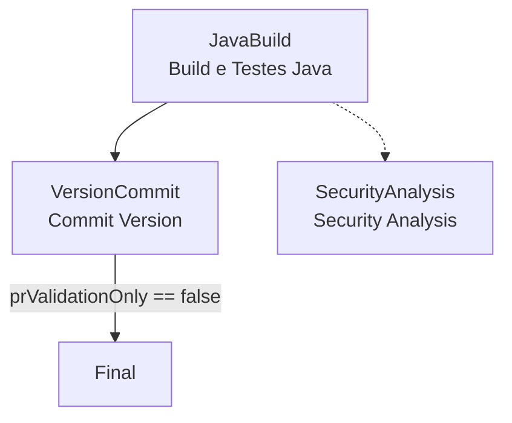

# CI Build Java Library

## 📋 Descrição

Pipeline de Integração Contínua para bibliotecas Java corporativas usando Maven. Realiza compilação, empacotamento, execução opcional de testes (JUnit) com geração de cobertura (JaCoCo), publicação condicional de artefatos e versionamento. Suporta modo somente validação para Pull Requests (sem deploy e sem commit/tag).

Tecnologia principal: Java (Maven). Tipo de entrega: Biblioteca (artefato Maven interno).

- [Pipeline de testes](https://dev.azure.com/telefonica-vivo-brasil/DevOps/_build?definitionId=44877)
- [Repositório teste](https://dev.azure.com/telefonica-vivo-brasil/DevOps/_git/teste-build-java-lib)

**🚀 Principais funcionalidades:**

- Build Maven com `clean compile package` (skip de testes na fase principal para otimizar tempo)
- Execução opcional de testes unitários com publicação de resultados JUnit
- Geração e publicação de cobertura JaCoCo
- Cache condicional de dependências Maven para acelerar builds
- Publicação de artefatos em Azure Artifacts (ou Nexus via Key Vault opcional)
- Commit e tag de versão em stage dedicado e condicional
- Controle de fluxo para execução somente validação (`prValidationOnly`)
- Seleção de versão de JDK pré-instalada no agente
- Uso do versionManager para definição de versão

## 🚀 Quick Start (5 minutos)

Configure rapidamente o pipeline de CI para bibliotecas Java Maven seguindo estes passos:

1. Crie os arquivos necessários no seu repositório (Veja [Dependências Externas](#-dependências-externas))
2. Crie `.azuredevops/azure-pipeline-ci.yml` na raiz
3. Cole o código de exemplo
4. Commit e push
5. ✅ Pipeline executa automaticamente!
6. Opcional: ajuste triggers

```yaml
# .azuredevops/azure-pipeline-ci.yml
resources:
  repositories:
    - repository: CodePlay
      name: DevOps/Vivo.CodePlay.Pipelines
      type: git
      ref: refs/heads/master
      endpoint: CodePlay

extends:
  template: /framework/pipelines/ci/build-java-lib/pipeline.yaml@CodePlay
```


**Pré-requisitos:**

- Repositório com `pom.xml` válido
- Arquivo `.azuredevops/settings.xml` configurado
- Service Connection `DevOpsSharedResources` (se usar Nexus para baixar libs)

**Comportamentos Padrão:**

- ✅ Build Maven com testes e cobertura
- ✅ Publicação no Azure Artifacts
- ✅ Análises de segurança (Fortify + SCA)
- ✅ Quality Gate SonarQube

### 🚀 Próximos Passos Continuous Deployment (CD)

Bibliotecas Java (artefatos Maven) **não necessitam de um pipeline de deployment tradicional**. Este pipeline de CI já realiza a publicação do artefato no Azure Artifacts (ou Nexus), tornando-o disponível para consumo por outras aplicações.

### Como Consumir Esta Biblioteca

Após a execução bem-sucedida deste pipeline:

1. **Biblioteca publicada** no Azure Artifacts feed (ex: `DVPS` feed)
2. **Versão versionada** automaticamente no `pom.xml` e tag Git criada
3. **Pronto para consumo** por outros projetos Maven/Gradle

### Exemplo de Consumo em Outro Projeto

```xml
<!-- pom.xml do projeto consumidor -->
<dependencies>
  <dependency>
    <groupId>br.com.vivo</groupId>
    <artifactId>br.com.tlf.hbpo:lib-features-flags</artifactId>
    <version>1.2.3</version>  <!-- versão publicada pelo CI -->
  </dependency>
</dependencies>
```

### 🎯 Aplicações Que Usam Esta Biblioteca

Aplicações que dependem desta biblioteca (Spring Boot, microserviços Java) têm seus próprios pipelines de CI/CD:

- **[build-java-docker](../build-java-docker/README.md)** - Para aplicações Java containerizadas
- **[deploy-helm](../../cd/deploy-helm/README.md)** - Para deployment em Kubernetes
- **[deploy-ssh](../../cd/deploy-ssh/README.md)** - Para deployment em servidores tradicionais

Estes pipelines automaticamente baixam e utilizam a versão publicada desta biblioteca durante o build.

## 🏗️ Matriz de Capacidades

| Capacidade                  | Suporte | Descrição                                      |
|----------------------------|---------|------------------------------------------------|
| [Trunk Based Development](https://dvps.redecorp.azr/portal/codeplay/capacidades/catalog/trunk-based-development) | ✅      | Suportado com estratégia de branches configurável via `VersionManagerVivo@8`    |
| [Build Automatizado](https://dvps.redecorp.azr/portal/codeplay/capacidades/catalog/build-automatizado)        | ✅      | Build automático Maven com clean compile package     |
| [Testes Unitários](https://dvps.redecorp.azr/portal/codeplay/capacidades/catalog/testes-unitarios)       | ✅      | Habilitado por padrão, controlado pelo parâmetro `enableTest`        |
| [SAST](https://dvps.redecorp.azr/portal/codeplay/capacidades/catalog/sast)                        | ✅      | Análise estática de código via Fortify no estágio SecurityAnalysis executado após o build.                       |
| [SCA](https://dvps.redecorp.azr/portal/codeplay/capacidades/catalog/sca)                        | ✅      | Análise de composição de software via template run-sca-scan.yaml no estágio SecurityAnalysis.           |
| [Gates de Segurança](https://dvps.redecorp.azr/portal/codeplay/capacidades/catalog/gates-de-seguranca)          | ✅      | O controle dos gates de segurança (bloqueio ou não do pipeline) é realizado pelo time de AppSec via chaves de configuração recuperadas do AppConfig corporativo (`SKIP_SECURITY_GATE`, `SKIP_SECURITY_GATE_SCA` etc).   |
| [Análise de Código](https://dvps.redecorp.azr/portal/codeplay/capacidades/catalog/analise-de-codigo)          | ✅      | SonarQube completo com quality gate - parâmetro `runQualityGate`   |
| [Gates de Qualidade](https://dvps.redecorp.azr/portal/codeplay/capacidades/catalog/gate-de-qualidade)           | ✅      | SonarQube Quality Gate - parâmetro `runQualityGate`    |
| [Rollback de Upgrade](https://dvps.redecorp.azr/portal/codeplay/capacidades/catalog/rollback-de-upgrade) | ❎  | Pipeline de CI não faz sentido habilitar essa capacidade |
| [Blue/Green Deployment](https://dvps.redecorp.azr/portal/codeplay/capacidades/catalog/blue-green-deployment) | ❎  | Pipeline de CI não faz sentido habilitar essa capacidade |
| [Canary Release](https://dvps.redecorp.azr/portal/codeplay/capacidades/catalog/canary-release)        | ❎  | Pipeline de CI não faz sentido habilitar essa capacidade |

Legenda:
- ✅ - Suportado nativamente
- ❌ - Não suportado
- ⚠️ - Suportado com limitações ou condições
- 🚧 - Planejado / Em Construção
- ❎ - Não faz sentido habilitar essa capacidade

## ⚙️ Estrutura do Pipeline

Pipeline com estágios sequenciais e paralelos. O primeiro estágio (JavaBuild) realiza build, testes e (se aplicável) deploy do artefato. O estágio SecurityAnalysis executa em paralelo para análises de segurança. O terceiro estágio (VersionCommit) é condicional e efetua confirmação da versão e criação de tag apenas quando não é execução de validação de PR.



**Descrição dos Estágios:**

- **JavaBuild**: Executa checkout, resolve autenticação (Azure Artifacts ou Key Vault/Nexus), aplica cache (se habilitado), define versão, compila o projeto, executa testes e cobertura (se habilitado) e publica artefato quando não está em modo de validação.
- **SecurityAnalysis**: Estágio executado em paralelo ao JavaBuild. Contém jobs para análise de segurança SAST (FortifyScan) e SCA (SCAScan).
- **VersionCommit**: Reexecuta lógica de versionamento e realiza commit + tag da versão. Executado apenas quando `prValidationOnly` é false.

## 📋 Parâmetros Disponíveis

Configure o comportamento do pipeline através dos seguintes parâmetros. Para cada parâmetro, o propósito e impacto são descritos.

## Parâmetros para Infraestrutura e Ambiente

#### agentPool

- **nome**: agentPool
- **tipo**: string
- **default**: "GeneralPurposeLinuxAgentsCI"
- **opções**: Não aplicável
- **descrição**: Define o pool de agentes onde a pipeline será executada. Necessário conter JDKs e Maven instalados.
- **dependências**: Pool configurado com versões suportadas de JDK e Maven.

#### useNetworkProxy

- **nome**: useNetworkProxy
- **tipo**: boolean
- **default**: false
- **descrição**: Configurar proxy de rede para acesso externo. Deve ser `true` para pipelines executados em pools de agentes on-premises como "VivoOnPremDevAgents", "VivoOnPremHmlAgents" e "VivoOnPremPrdAgents".
- **dependências**: Nenhuma.

## Parâmetros para Configurações de Java e Feed

#### getDependenciesFromNexus

- **nome**: getDependenciesFromNexus
- **tipo**: boolean
- **default**: "false"
- **opções**: true, false
- **descrição**: Controla origem das credenciais Maven. Quando `true` usa Key Vault (Nexus). Quando `false` usa Azure Artifacts com `System.AccessToken`.
- **dependências**: Service connection `DevOpsSharedResources` + Key Vault `kv-azdevops-shared` (se true).
- **Observação**: Olhar decisão 3 no final do documento.

#### workingDirectory

- **nome**: workingDirectory
- **tipo**: string
- **default**: "$(Build.SourcesDirectory)"
- **opções**: Não aplicável
- **descrição**: Diretório raiz do projeto onde está localizado o arquivo `pom.xml` principal do Maven.
- **dependências**: Estrutura do repositório alinhada.

#### buildArtifactName

- **nome**: buildArtifactName
- **tipo**: string
- **default**: "$(Build.Repository.Name)"
- **opções**: Não aplicável
- **descrição**: nome do repositório. Irá ser utilizado na task DownloadBuildArtifacts@1 no template /security/run_sca_scan.yml.
- **dependências**: Utilizado pelo template /security/run_sca_scan.yml.


#### javaVersion

- **nome**: javaVersion
- **tipo**: string
- **default**: "openjdk-21.0.2"
- **opções**: ["openjdk-21.0.2", "openjdk-17.0.2", "openjdk-11.0.2", "adoptopenjdk-8.0.352+8", "sapmachine-17.0.10"]
- **descrição**: Seleciona versão do JDK (pré-provisionada via ASDF no agente) usada nas tasks Maven.
- **dependências**: Versões instaladas conforme playbook de agentes.

#### mavenCustomSettings

- **nome**: mavenCustomSettings
- **tipo**: string
- **default**: ".azuredevops/settings.xml"
- **opções**: Não aplicável
- **descrição**: Caminho relativo (a partir de `workingDirectory`) para o `settings.xml` customizado que define servidores e repositórios.
- **dependências**: Arquivo presente no repositório.

##### 🔐 Autenticação Maven (Azure Artifacts / Nexus)

Para usar Nexus a service connection `DevOpsSharedResources` deve estar criada e possuir acesso ao Key Vault `kv-azdevops-shared` contendo os segredos `NEXUS-DEPS-USR` e `NEXUS-DEPS-PSW`.

Método default de autenticação (quando `getDependenciesFromNexus=false`): Azure Artifacts via `System.AccessToken` (exposto à pipeline com permissão "Allow scripts to access OAuth token").

Exemplo de `settings.xml` esperado (usando `AZURE_DEVOPS_PAT` ou `System.AccessToken`):

```xml
<settings xmlns="http://maven.apache.org/SETTINGS/1.0.0"
    xmlns:xsi="http://www.w3.org/2001/XMLSchema-instance" xsi:schemaLocation="http://maven.apache.org/SETTINGS/1.0.0 https://maven.apache.org/xsd/settings-1.0.0.xsd">
    <mirrors>
        <mirror>
            <!-- Baixar pacotes Maven do Azure Artifacts-->
            <id>DevOps</id>
            <name>Mirror Maven Central</name>
            <url>https://pkgs.dev.azure.com/telefonica-vivo-brasil/_packaging/DevOps/maven/v1</url>
            <mirrorOf>central</mirrorOf>
        </mirror>
    </mirrors>
    <profiles>
        <profile>
            <id>devops</id>
            <repositories>
                <repository>
                    <id>DevOps</id>
                    <url>https://pkgs.dev.azure.com/telefonica-vivo-brasil/_packaging/DevOps/maven/v1</url>
                    <releases>
                        <enabled>true</enabled>
                    </releases>
                    <snapshots>
                        <enabled>true</enabled>
                    </snapshots>
                </repository>
            </repositories>
        </profile>
    </profiles>
    <activeProfiles>
        <activeProfile>devops</activeProfile>
    </activeProfiles>
    <servers>
        <server>
            <id>[AZURE ARTIFACTS FEED NAME]</id>
            <username>telefonica-vivo-brasil</username>
            <password>${AZURE_DEVOPS_PAT}</password>
        </server>
        <server>
            <!-- Feed global no Azure DevOps para dependências compartilhadas -->
            <id>DevOps</id>
            <username>telefonica-vivo-brasil</username>
            <password>${AZURE_DEVOPS_PAT}</password>
        </server>
    </servers>
</settings>
```

Veja o arquivo do repositório de testes: [settings.xml](https://dev.azure.com/telefonica-vivo-brasil/DevOps/_git/teste-build-java-lib?version=GBmaster&path=/.azuredevops/settings.xml)

no `pom.xml`, referenciar o seguinte trecho para deploy em Azure Artifacts:

```xml
    <distributionManagement>
        <repository>
            <id>[AZURE ARTIFACTS FEED NAME]</id>
            <url>[AZURE ARTIFACTS FEED URL]</url>
        </repository>
        <snapshotRepository>
            <id>[AZURE ARTIFACTS FEED NAME]</id>
            <url>[AZURE ARTIFACTS FEED URL]</url>
        </snapshotRepository>
    </distributionManagement>
    <repositories>
        <repository>
            <id>DVPS</id>
            <url>[AZURE ARTIFACTS FEED URL]</url>
            <releases>
                <enabled>true</enabled>
            </releases>
            <snapshots>
                <enabled>true</enabled>
            </snapshots>
        </repository>
    </repositories>
```

Veja o arquivo do repositório de testes: [pom.xml](https://dev.azure.com/telefonica-vivo-brasil/DevOps/_git/teste-build-java-lib?version=GBmaster&path=/pom.xml)

:::warning[Atenção]
Substitua `[AZURE ARTIFACTS FEED NAME]` e `[AZURE ARTIFACTS FEED URL]` pelos valores reais do seu feed. 
:::

## Parâmetros para Configurações de Versionamento

#### versionFile

- **nome**: versionFile
- **tipo**: string
- **default**: "pom.xml"
- **opções**: Não aplicável
- **descrição**: Arquivo alvo para leitura e atualização de versão pela task VersionManager.
- **dependências**: Arquivo de versionamento válido no diretório de trabalho

#### branchingStrategy

- **nome**: branchingStrategy
- **tipo**: string
- **default**: "trunkbased"
- **opções**: ["trunkbased", "vivoflow", "releaseflow", "gitlabflow", "gitlabflow-semantic", "custom"]
- **descrição**: Define a estratégia de versionamento utilizada pelo Version Manager para cálculo de versão. **trunkbased**: Branch única (dev/main). **vivoflow**: 6 estágios (dev→esteira1→esteira2→preprod→prodlike→prod). **releaseflow**: 3 estágios (develop→staging→main). **gitlabflow**: GitLab Flow com commit hash (branch-commit). **gitlabflow-semantic**: GitLab Flow com versão semântica (branch-x.y.z). **custom**: Estratégia customizada.
- **dependências**: Utilizado pela task VersionManagerVivo@8 em todos os estágios de versionamento.
- **referência**: [Documentação completa do VersionManagerVivo](https://dev.azure.com/telefonica-vivo-brasil/DVPS%20-%20DEVOPS/_git/azdo-task-version-utils?path=/docs/TASK_INPUTS_REFERENCE.md#2-branchingstrategy)

## Parâmetros para Controle de Fluxo e Capacidades

#### prValidationOnly

- **nome**: prValidationOnly
- **tipo**: boolean
- **default**: "false"
- **opções**: true, false
- **descrição**: Se `true`, executa somente validações (build/testes) sem publicar artefatos e sem executar commit/tag.
- **dependências**: As [politicas de branch](https://learn.microsoft.com/pt-br/azure/devops/pipelines/repos/azure-repos-git?view=azure-devops&tabs=yaml#pr-triggers) devem ser configuradas para exigir builds de PR.

#### enableTest

- **nome**: enableTest
- **tipo**: boolean
- **default**: "true"
- **opções**: true, false
- **descrição**: Habilita ou desabilita a execução dos testes unitários e publicação dos resultados + cobertura.
- **dependências**: Plugins Surefire e JaCoCo configurados no `pom.xml` para relatórios completos.

#### enableCache

- **nome**: enableCache
- **tipo**: boolean
- **default**: "true"
- **opções**: true, false
- **descrição**: Ativa caching de dependências Maven para acelerar builds subsequentes. Se `false`, usa repositório local fixo.
- **dependências**: Task `Cache@2` e armazenamento disponível.

#### enableCoverage

- **nome**: enableCoverage
- **tipo**: boolean
- **default**: "true"
- **opções**: true, false
- **descrição**: Indica intenção de gerar cobertura. Atualmente a execução depende de `enableTest`; condicionamento específico adicional é melhoria futura.
- **dependências**: Plugin JaCoCo configurado.

#### runQualityGate

- **nome**: runQualityGate
- **tipo**: boolean
- **default**: "true"
- **opções**: true, false
- **descrição**: Habilita ou desabilita a execução da análise de qualidade de código com SonarQube.
- **dependências**: Service Connection SonarQube configurada e projeto configurado no SonarQube.

## Parâmetros para Configurações de Segurança

#### enableFortifyExclusions

- **nome**: enableFortifyExclusions
- **tipo**: boolean
- **default**: "false"
- **opções**: true, false
- **descrição**: Habilita o checkout do repositório de exclusões Fortify durante análise SAST.
- **dependências**: Repositório FortifyExclusion configurado e acessível durante checkout.

## Parâmetros para Configurações do SonarQube

#### useSonarConfigFile

- **nome**: useSonarConfigFile
- **tipo**: boolean
- **default**: "true"
- **opções**: true, false
- **descrição**: Usar arquivo de configuração do SonarQube? Permite definir se o pipeline deve utilizar um arquivo customizado de propriedades do SonarQube durante a análise.
- **dependências**: Arquivo de configuração válido no caminho especificado por `sonarConfigFilePath`.

#### sonarConfigFilePath

- **nome**: sonarConfigFilePath
- **tipo**: string
- **default**: ".azuredevops/sonar-project.properties"
- **opções**: Não aplicável
- **descrição**: Caminho do arquivo de configuração do SonarQube. Informe o caminho relativo do arquivo de propriedades do SonarQube a ser utilizado na análise.
- **dependências**: Arquivo de propriedades do SonarQube presente no repositório (apenas se `useSonarConfigFile` = true).

#### sonarPollingTimeoutSec

- **nome**: sonarPollingTimeoutSec
- **tipo**: string
- **default**: "300"
- **opções**: Não aplicável
- **descrição**: Timeout em segundos para aguardar o resultado do Quality Gate do SonarQube.
- **dependências**: Nenhuma dependência adicional necessária.

#### sonarJavaVersion

- **nome**: sonarJavaVersion
- **tipo**: string
- **default**: "openjdk-17.0.2"
- **opções**: ["openjdk-21.0.2", "openjdk-17.0.2", "openjdk-11.0.2"]
- **descrição**: Versão do Java específica para análise SonarQube. Pode ser diferente da versão usada para build.
- **dependências**: Versão Java instalada nos agentes via ASDF.

#### sonarServiceConnection

- **nome**: sonarServiceConnection
- **tipo**: string
- **default**: "VIVO_SONARQUBE"
- **opções**: Não aplicável
- **descrição**: Nome da Service Connection configurada para acesso ao servidor SonarQube.
- **dependências**: Service Connection do tipo SonarQube configurada no projeto.

#### sonarQualityGate

- **nome**: sonarQualityGate
- **tipo**: string
- **default**: "AzureDevOps-Default"
- **opções**: Não aplicável
- **descrição**: Nome do Quality Gate configurado no SonarQube para validação da qualidade do código.
- **dependências**: Quality Gate configurado no servidor SonarQube.

#### sonarScannerMode

- **nome**: sonarScannerMode
- **tipo**: string
- **default**: "cli"
- **opções**: ["cli", "dotnet"]
- **descrição**: Modo do scanner SonarQube a ser utilizado para análise do código.
- **dependências**: Nenhuma dependência adicional necessária.

#### sonarProjectKey

- **nome**: sonarProjectKey
- **tipo**: string
- **default**: "$(System.TeamProject)-$(Build.Repository.Name)"
- **opções**: Não aplicável
- **descrição**: Chave única do projeto no SonarQube. Utiliza convenção baseada no Team Project e nome do repositório.
- **dependências**: Projeto configurado no SonarQube com a chave especificada.

#### sonarProjectName

- **nome**: sonarProjectName
- **tipo**: string
- **default**: "$(System.TeamProject)-$(Build.Repository.Name)"
- **opções**: Não aplicável
- **descrição**: Nome amigável do projeto no SonarQube para exibição na interface.
- **dependências**: Nenhuma dependência adicional necessária.

#### useAppConfig

- **nome**: useAppConfig
- **tipo**: boolean
- **default**: "true"
- **opções**: true, false
- **descrição**: Habilita uso do Azure App Configuration para centralizar configurações do SonarQube.
- **dependências**: Azure App Configuration configurado com as chaves necessárias.

## 🔧 Dependências Externas

### Service Connections Obrigatórias

| Nome da Connection | Tipo | Descrição | Como Configurar |
|-------------------|------|-----------|-----------------|
| DevOpsSharedResources | Azure Service Connection | Necessária para acessar Key Vault e recuperar segredos Nexus quando `getDependenciesFromNexus=true` | Criar connection com permissões ao Key Vault `kv-azdevops-shared` e habilitar acesso a secrets |

### Service Connections Opcionais

| Nome da Connection | Tipo | Descrição | Quando Necessário |
|-------------------|------|-----------|-------------------|
| VIVO_SONARQUBE | SonarQube | Conexão com servidor SonarQube para análise de qualidade | Necessário quando parâmetro `runQualityGate` = true |
| **Customizada** | SonarQube | Connection customizada configurável via parâmetro `sonarServiceConnection` | Alternativa ao `VIVO_SONARQUBE` para configurações específicas |

### Recursos de Build Agent

- **JDKs pré-instalados**: Versões listadas no parâmetro `javaVersion`
- **Maven 3.9.9**: Disponível via ASDF em `/home/svc_devopscorp/.asdf/installs/maven/3.9.9`
- **Suporte a Cache**: Task `Cache@2` habilitada
- **Git com OAuth Token**: Necessário para commit/tag (persistCredentials)
- **Acesso a System.AccessToken**: Publicação em Azure Artifacts


## 🎨 Comportamentos Customizados

:::danger
**⚠️ ATENÇÃO: CUSTOMIZAÇÕES REQUEREM RESPONSABILIDADE ⚠️**

- ✅ Use os exemplos como ponto de partida — demonstram padrões seguros e testados.
- 🧠 "Todos somos adultos" — confie na sua expertise, mas tenha consciência do impacto.
- 📝 Tudo fica registrado — histórico de commits é auditável e rastreável.
- 🎯 Entenda antes de modificar — customizações incorretas podem quebrar builds em produção.
- 🤝 Documente suas decisões — facilite a manutenção futura por outros membros da equipe.

**Customizar é permitido. Fazer sem entender não é.**
:::


### Validação de Pull Request (sem deploy)

Executa build e testes sem publicar artefato nem gerar commit/tag de versão.

```yaml
# .azuredevops/azure-pipeline-ci.yml
resources:
  repositories:
    - repository: CodePlay
      name: DevOps/Vivo.CodePlay.Pipelines
      type: git
      ref: refs/heads/master
      endpoint: CodePlay

extends:
  template: /framework/pipelines/ci/build-java-lib/pipeline.yaml@CodePlay
  parameters:
    prValidationOnly: true                # Evita deploy e stage VersionCommit
    enableTest: true                      # Garante execução de testes e cobertura
```

### Nexus + Java 17 sem Cache

Configuração usando autenticação via Key Vault (Nexus), alterando JDK e desabilitando cache para diagnóstico.

```yaml
# .azuredevops/azure-pipeline-ci.yml
resources:
  repositories:
    - repository: CodePlay
      name: DevOps/Vivo.CodePlay.Pipelines
      type: git
      ref: refs/heads/master
      endpoint: CodePlay

extends:
  template: /framework/pipelines/ci/build-java-lib/pipeline.yaml@CodePlay
  parameters:
    getDependenciesFromNexus: true                  # Obtém segredos de Nexus
    javaVersion: 'openjdk-17.0.2'         # Usa JDK 17
    enableCache: false                    # Desativa cache de dependências
    enableTest: true                      # Mantém testes
```

#### Instalação de `jar` local no pacote final
Configuração do plugin `maven-install-plugin` para instalar `jar` terceiros ao pacote final.

```xml
<plugin>
    <groupId>org.apache.maven.plugins</groupId>
    <artifactId>maven-install-plugin</artifactId>
    <version>2.5.1</version>
    <executions>
        <execution>
            <id>install-third-jar</id>
            <goals>
                <goal>install-file</goal>
            </goals>
            <phase>validate</phase>
            <configuration>
                <groupId>[group.id]</groupId>
                <artifactId>[artifact.id]</artifactId>
                <version>[version]</version>
                <packaging>jar</packaging>
                <file>${basedir}/[jar_file.jarq]</file>
                <generatePom>true</generatePom>
            </configuration>
        </execution>
    </executions>
</plugin>
```

## 🔖 Variáveis de Ambiente

| Variável | Descrição | Valor Padrão |
|----------|-----------|--------------|
| SIGLA | Derivada do nome do Team Project (primeira palavra em minúsculas) | `lower(split(variables['System.TeamProject'],' ')[0])` |
| POM_FILE_PATH | Caminho completo para o arquivo de versão (`pom.xml`) | `${workingDirectory}/${versionFile}` |
| MAVEN_CACHE_FOLDER | Diretório de cache local Maven no workspace | `$(Pipeline.Workspace)/.m2/repository` |
| MAVEN_OPTS | Opções Maven definindo repositório local | `-Dmaven.repo.local=$(MAVEN_CACHE_FOLDER)` |
| MAVEN_CUSTOM_SETTINGS | Caminho efetivo do settings customizado | `${workingDirectory}/${mavenCustomSettings}` |
| MAVEN_REPO_LOCAL | Repositório local Maven efetivo (condicional) | `$(MAVEN_CACHE_FOLDER)` ou `/home/svc_devopscorp/.m2/repository` |
| AKV_DEVOPS_NAME | Nome do Azure Key Vault para configurações de segurança | `kv-azdevops-shared` |
| PROXY_SQUID_SERVER | Servidor proxy Squid para conexões de rede | `10.240.58.39:3128` |
| PROXY_AGENT_HTTP | Configuração de proxy HTTP para o agente | `http://$(PROXY_SQUID_SERVER)` |
| PROXY_AGENT_HTTPS | Configuração de proxy HTTPS para o agente | `http://$(PROXY_SQUID_SERVER)` |
| PROXY_AGENT_NO_PROXY | Lista de hosts que não devem usar proxy | `localhost,0.0.0.0,127.0.0.1,10.244.0.0/16,192.168.0.0/16,10.129.178.173,nexus.telefonica.com.br,acrsharedservices01.azurecr.io,appcs-azdevops-shared.azconfig.io,scm.azurewebsites.net` |
| CACORP_LOCATION | Localização do certificado CA corporativo | `$(Agent.HomeDirectory)/../../certs/CACORP.pem` |
| APP_LANGUAGE | Linguagem da aplicação usada pelos templates de segurança | `java` |
| FORTIFY_APP_DEFAULT_VERSION | Versão padrão da aplicação para análise Fortify | `DevSecOps` |

**Nota**: Configurações específicas do projeto devem ser definidas como parâmetros, não como variáveis de ambiente.

## ❓ FAQ

### Onde posso encontrar mais informações sobre o CodePlay Framework?

Você pode encontrar mais informações sobre o CodePlay Framework na [documentação oficial](https://dvps.redecorp.azr/portal/codeplay/framework/).

### Onde encontro as capacidades disponíveis?

As capacidades disponíveis podem ser encontradas no [Catálogo de Capacidade](https://dvps.redecorp.azr/portal/catalog/capabilities) no Portal CodePlay.

### Como faço para customizar o pipeline?

Siga o guia de [Adoção ao CodePlay](https://dvps.redecorp.azr/portal/codeplay/roteiro/codeplay#fluxo-de-ado%C3%A7%C3%A3o-ao-codeplay).

### Quais casos de uso relevantes?

- [Docker Build Mais Rapido](https://dvps.redecorp.azr/portal/code/casos-de-uso/docker-build-mais-rapido)
- [Integrando CICD](https://dvps.redecorp.azr/portal/code/casos-de-uso/integrando-cicd)
- [Pipeline de Validação de PR](https://dvps.redecorp.azr/portal/code/casos-de-uso/pipeline-validacao-pr)
- Veja o [Catálogo de Casos de Uso](https://dvps.redecorp.azr/portal/catalog/casos-de-uso) para outros exemplos de casos de uso.

### Quais Erros Comuns relevantes?

- Ainda não temos nenhum erro comum documentado para este pipeline.
- Veja o [Catálogo de Erros Conhecidos](https://dvps.redecorp.azr/portal/catalog/erros-conhecidos) para outros exemplos de erros.

### Cobertura não está sendo exibida

**Sintomas:**

- Relatório de cobertura ausente
- Task de publicação de cobertura sem arquivos

**Causa Provável:**

Plugin JaCoCo não configurado corretamente no `pom.xml`.

**Solução:**

1. Incluir `jacoco-maven-plugin` com execuções `prepare-agent` e `report`
2. Verificar diretório `target/site/jacoco/`
3. Reexecutar pipeline com `enableTest: true`

**Exemplo de correção:**

```xml
<plugin>
  <groupId>org.jacoco</groupId>
  <artifactId>jacoco-maven-plugin</artifactId>
  <version>0.8.8</version>
  <executions>
    <execution><goals><goal>prepare-agent</goal></goals></execution>
    <execution><id>report</id><phase>test</phase><goals><goal>report</goal></goals></execution>
  </executions>
</plugin>
```


## 🆘 Suporte

- [Abra um chamado para Dev Support](https://dvps.redecorp.azr/portal/codeplay/roteiro/#:~:text=Abra%20um%20chamado%20para%20Dev%20Support)
- [Canal DevEx - Azure DevOps](https://teams.microsoft.com/l/channel/19%3A8fbd00946cf044d7a844182ac71e6aa1%40thread.tacv2/Azure%20DevOps?groupId=038b4415-d6dd-42ce-92e5-31a8e2a13bf8&tenantId=9744600e-3e04-492e-baa1-25ec245c6f10)


## 🚀 Decisões Tomadas

### Decisão 1: RESOLVIDO: Uso de Template Central para Versionamento

> RESOLVIDO

- **Data**: 12/09/2025 (update 06/11/2025)
- **Status**: Removido do código para uso do Version Manager
- **Motivador**: Padronizar cálculo e persistência de versão
- **Fórum Envolvido**: Soluções DevOps
- **Impacto**: Consistência entre bibliotecas e redução de erros manuais
- **Próximos Passos**: DONE: Evoluir para Version Manager conforme TODO
- **Referências**: Comentários do cabeçalho do pipeline
- **Notas**: Facilita auditoria e automação de tagging


### Decisão 2: Custom Settings Dentro do Repositório
- **Data**: 12/09/2025
- **Motivador**: Flexibilidade para diferentes projetos, feeds e registries
- **Fórum Envolvido**: Soluções DevOps
- **Descrição**: Permitir configuração customizada de `settings.xml` no repositório do projeto, para trazer mais flexibilidade e transparência para autenticação maven.
- **Impacto**: Adaptação fácil a diferentes necessidades sem alterar o pipeline, quebra um pouco o conceito de plug and play, pois esse arquivo precisa ser criado.
- **Próximos Passos**: Documentar o uso do arquivo `settings.xml` e fornecer exemplos de casos de uso.
- **Referências**: Parâmetro `mavenCustomSettings`
- **Notas**: Flexibilidade para múltiplos feeds e repositórios.

### Decisão 3: Usuário somente de leitura no Nexus (DEPS)
- **Data**: 12/09/2025
- **Motivador**: A ideia é desmotivar o uso do nexus para publicação de artefatos, e incentivar o uso do Azure Artifacts. A utilização do nexus fica restrita a apenas baixar dependências, pois alguns projetos ainda podem ter dependências legadas.
- **Fórum Envolvido**: Soluções DevOps
- **Descrição**: O usuário utilizado para autenticação no Nexus (DEPS) terá apenas permissão de leitura.
- **Impacto**: A publicação de artefatos em Nexus não será possível, forçando o uso do Azure Artifacts.
- **Próximos Passos**: Monitorar o uso do Nexus e incentivar a migração para Azure Artifacts.
- **Referências**: Parâmetro `getDependenciesFromNexus`
- **Notas**: N/D

### Decisão 4: Adicionar variável SYSTEM_ACCESSTOKEN e não apenas AZURE_DEVOPS_PAT
- **Data**: 14/10/2025
- **Motivador**: Algumas documentações sugerem a criação de uma variável de ambiente chamada `SYSTEM_ACCESSTOKEN` para realizar a autenticação em Azure Artifacts.
- **Fórum Envolvido**: Soluções DevOps
- **Descrição**: Adicionar a variável de ambiente `SYSTEM_ACCESSTOKEN` com o valor de `$(System.AccessToken)` para garantir compatibilidade com documentações e práticas recomendadas. Não tem impacto deixar as duas variáveis, pois ambas apontam para o mesmo token.
- **Impacto**: Melhora a clareza e compatibilidade com documentações externas.

### Decisão 5: Inserção de biblioteca `jar` ao pacote final
- **Data**: 16/10/2025
- **Motivador**: Adicionar bibliotecas `jar` ao projeto na etapa de validação com a finalidade de inserir no pacote final
- **Fórum Envolvido**: Soluções DevOps
- **Descrição**: Permiti inserir bibliotecas que não estão nos repositórios públicos ao pacote final do projeto
- **Impacto**: Para projetos que possuem bibliotecas internas no projeto, as bibliotecas estarão presentes no pacote `jar` com todos as dependências. Caso contrário, é executado apenas a validação do `pom.xml`
- **Próximos Passos**: N/D
- **Referências**: [Instalação de `jars` terceiros](https://maven.apache.org/guides/mini/guide-3rd-party-jars-local.html)
- **Notas**: Possibilidade de inserção de pacote `jar` local do projeto no pacote final

### Decisão 6: Padronização do Estágio AppSec com Artefato
- **Data**: 14/11/2025
- **Motivador**: Garantir contexto completo e isolamento das verificações de segurança, alinhando o framework às melhores práticas recomendadas pela equipe de AppSec.
- **Fórum Envolvido**: Equipe AppSec, DevOps Soluções
- **Descrição**: Adotar a abordagem de estágio dedicado de AppSec utilizando artefatos gerados nos estágios anteriores (build/teste). O estágio de AppSec consome esses artefatos para realizar as análises de segurança, garantindo contexto completo e permitindo paralelismo, reexecução e troubleshooting facilitado.
- **Impacto**: Exige ajustes nos pipelines para geração e consumo de artefatos, mas aumenta a eficácia e rastreabilidade das análises de segurança.
- **Próximos Passos**: Adaptar templates e pipelines para garantir que o estágio AppSec sempre utilize artefatos completos do build.
- **Referências**: [ADR 0004 - Estágios de AppSec nos pipelines](/framework/docs/adr/0004-estagios-de-appsec-nos-pipelines.md)
- **Notas**: Recomendado como padrão para todos os pipelines do framework.

### Decisão 7: Adoção do Template Padrão AppSec
- **Data**: 14/11/2025
- **Motivador**: Alinhar o framework às diretrizes e práticas recomendadas pela equipe de AppSec, promovendo padronização e facilidade de manutenção.
- **Fórum Envolvido**: Equipe AppSec, DevOps Soluções
- **Descrição**: Adotar o template padrão definido pela equipe de AppSec para integração das verificações de segurança nos pipelines do framework. A custom task desenvolvida internamente será avaliada e integrada de forma gradual, sem exigir mudanças nos arquivos `.azuredevops/pipelines.yml` dos projetos consumidores.
- **Impacto**: Todos os pipelines do framework passam a incorporar o template AppSec, garantindo consistência e alinhamento com as melhores práticas. A custom task será evoluída em paralelo, em colaboração com AppSec.
- **Próximos Passos**: Atualizar templates do framework para uso do template AppSec e iniciar avaliação da custom task para integração futura.
- **Referências**: [ADR 0005 - Uso de template para AppSec](/framework/docs/adr/0005-uso-de-template-para-appsec.md)
- **Notas**: Mudança planejada para não exigir alterações nos pipelines dos projetos já existentes.

### Decisão 8: Depreciação do parâmetro `sonarServiceConnection` e governança SonarQube (ADR 0006)
- **Data**: 13/05/2026
- **Motivador**: Alinhar o pipeline à governança definida na ADR 0006, evitando bypass manual do controle de acesso ao Sonar VIP.
- **Fórum Envolvido**: CoE DevOps
- **Descrição**: O parâmetro `sonarServiceConnection` será depreciado em breve. Atualmente, ainda é possível referenciar manualmente o Sonar VIP ou comum, mas a escolha da instância passará a ser feita automaticamente pela custom task, baseada no arquivo `vip.json`. Isso garante que apenas projetos aprovados utilizem o Sonar VIP, conforme política definida.
- **Impacto**: Evita burla de governança, aumenta a rastreabilidade e prepara o pipeline para remoção futura do parâmetro.
- **Próximos Passos**: Depreciar o parâmetro `sonarServiceConnection` no pipeline e atualizar a lista do `vip.json` com as siglas dos projetos autorizados ao Sonar VIP.
- **Referências**: [ADR 0008 - Sonar VIP Governance](/framework/docs/adr/0008-sonar-vip-governance.md)
- **Notas**: O parâmetro permanece disponível temporariamente para retrocompatibilidade, mas será depreciado em breve.