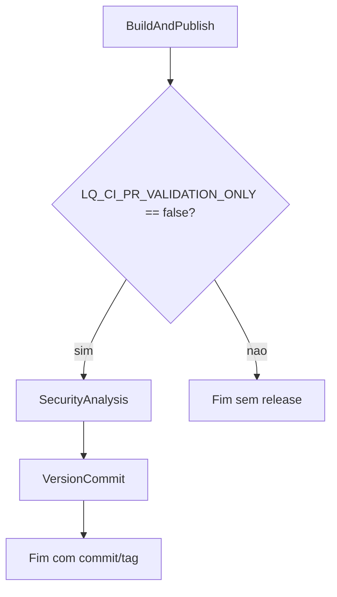

# Build Liquibase Project

## Descrição
Pipeline padrao de CI para projetos Liquibase (GuardRails). O fluxo executa build offline, validacoes tecnicas, empacotamento em ZIP versionado com `meta/manifest.json`, publicacao condicional no feed Maven e versionamento com commit/tag quando aplicavel.

- [Pipeline de testes](https://dev.azure.com/telefonica-vivo-brasil/DevOps/_build?definitionId=44879)
- [Repositorio teste](https://dev.azure.com/telefonica-vivo-brasil/DevOps/_git/teste-build-liquibase)

Objetivos principais:
- Gerar bundle ZIP versionado para consumo no CD.
- Validar contrato tecnico do projeto Liquibase em modo fail-fast.
- Publicar bundle no Azure Artifacts apenas em execucoes de release.
- Garantir que commit/tag de versao ocorra somente fora de PR validation.

## Quick Start (5 minutos)
```yaml
resources:
  repositories:
    - repository: CodePlay
      name: DevOps/Vivo.CodePlay.Pipelines
      type: git
      ref: refs/heads/master
      endpoint: CodePlay

extends:
  template: /framework/pipelines/ci/build-liquibase/pipeline.yaml@CodePlay
  parameters:
    prValidationOnly: false
    guardrailsRuntime: modern
    javaVersion: openjdk-17.0.2
    projectDir: build-liquibase
    dbConfigFile: .azuredevops/db-config.yaml
    enableCache: true
    sqlGateValidate: true
```

## Matriz de Capacidades
| Capacidade | Suporte | Descricao |
|------------|---------|-----------|
| Trunk Based Development | ⚠️ | Compativel com politicas de trunk, mas a estrategia de branch e definida pelo repositorio consumidor. |
| Build Automatizado | ✅ | Executa build Maven e gera pacote Liquibase ZIP versionado para consumo no CD. |
| Testes Unitarios | ❎ | Nao aplicavel para a maioria dos projetos DDL/DML; o foco e validacao estrutural do bundle. |
| SAST | ❌ | Nao executa SAST nativamente; depende de integracao externa da esteira. |
| SCA | ❌ | Nao executa SCA nativamente; depende de integracao externa da esteira. |
| Gates de Seguranca | ⚠️ | Pode ser atendido por politicas e checks externos, fora do escopo nativo deste template. |
| Analise de Codigo | ❌ | Nao roda analise de codigo (ex.: Sonar) de forma nativa neste template. |
| Gates de Qualidade | ⚠️ | Executa validacoes tecnicas e fail-fast, mas quality gates formais dependem de ferramentas externas. |
| Rollback de Upgrade | ❎ | Capacidade de rollback e de CD; este template de CI apenas gera e valida artefatos. |
| Blue/Green Deployment | ❎ | Capacidade de CD/deploy de aplicacao; nao se aplica ao fluxo de CI do Liquibase. |
| Canary Release | ❎ | Capacidade de CD/deploy de aplicacao; nao se aplica ao fluxo de CI do Liquibase. |

## Estrutura do Pipeline
### Stage 1: BuildAndPublish
1. `[Checkout] Repository`
2. `[Debug] Show Parameters` (apenas com `System.Debug=true`)
3. `[Setup] Prepare Context`
4. `[Cache] Restore Dependencies` (quando `LQ_CI_ENABLE_CACHE=true`)
5. `[Version] Next Version`
6. `[Discover] Resolve Metadata`
7. `[Discover] Export Variables`
8. `[Build] Package Bundle (Offline)`
9. `[Gate] Resolve Vendor/Profile Matrix` (quando `LQ_CI_SQL_GATE_VALIDATE=true`)
10. `[Gate] SQL Gate Validate` (quando `LQ_CI_SQL_GATE_VALIDATE=true`)
11. `[Evidence] Print Preview SQL`
12. `[Stage] Stage ZIP and CI Output`
13. `[Publish] Release ZIP Bundle` (quando `LQ_CI_PR_VALIDATION_ONLY=false`)

### Stage 2: SecurityAnalysis
Executa jobs de seguranca conforme flags resolvidas por `get_appconfig_keys_framework.yml`.

### Stage 3: VersionCommit (condicional)
Executa somente quando o fluxo nao e PR validation e os estagios dependentes concluem com sucesso.



## ⚙️ Parâmetros Disponíveis
### Controle de Execução

#### prValidationOnly
- **nome**: prValidationOnly
- **tipo**: boolean
- **default**: false
- **descrição**: Controla o modo da execucao; quando `true`, o pipeline valida e empacota sem publicar no Maven e sem efetivar commit/tag de versao no repositorio.
- **dependências**: Governa publicacao de release e condicao de entrada do stage `VersionCommit`.

### Runtime e Ambiente

#### agentPool
- **nome**: agentPool
- **tipo**: string
- **default**: "GeneralPurposeLinuxAgentsCI"
- **descrição**: Define o pool de agentes de CI onde o job principal e os jobs de versionamento serao executados, impactando ferramentas disponiveis e capacidade de processamento.
- **dependências**: Utilizado em `BuildAndPublish`, `SecurityAnalysis` e `VersionCommit`.

#### guardrailsRuntime
- **nome**: guardrailsRuntime
- **tipo**: string
- **default**: "modern"
- **opções**: ["modern", "legacy"]
- **descrição**: Define o runtime de execucao do GuardRails para discovery, validacoes e empacotamento, influenciando perfis de build e comportamento do processo.
- **dependências**: Usado em `discoverSetup`, `discover`, `package` e em variaveis `LQ_CI_*` de runtime.

#### javaVersion
- **nome**: javaVersion
- **tipo**: string
- **default**: "openjdk-17.0.2"
- **descrição**: Seleciona a versao de Java usada pelo processo Maven/Liquibase no agente, devendo estar disponivel no ambiente de execucao configurado.
- **dependências**: Consumido por `AzdoTaskLiquibase@2` e `Maven@4` (via `ASDF_JAVA_VERSION`).

### Projeto e Performance

#### projectDir
- **nome**: projectDir
- **tipo**: string
- **default**: ""
- **descrição**: Informa o modulo Liquibase em cenarios de monorepo; quando vazio, o pipeline assume a raiz do repositorio para resolver `pom.xml` e `settings.xml`.
- **dependências**: Afeta `PROJECT_DIR`, `POM_FILE_PATH` e resolucao de artefatos.

#### dbConfigFile
- **nome**: dbConfigFile
- **tipo**: string
- **default**: ".azuredevops/db-config.yaml"
- **descrição**: Caminho do arquivo `db-config.yaml` usado pela `AzdoTaskLiquibase@2` para carregar parâmetros de CI em `ci.parameters`.
- **dependências**: Repassado para as chamadas da custom task que resolvem contexto, runtime, empacotamento, SQL Gate e evidências.

#### enableCache
- **nome**: enableCache
- **tipo**: boolean
- **default**: true
- **descrição**: Habilita uso de cache Maven para acelerar builds recorrentes, reduzindo tempo de download de dependencias quando a chave de cache e reaproveitada.
- **dependências**: Alimenta `LQ_CI_ENABLE_CACHE` e condicao da task `Cache@2`.

#### mavenDebug
- **nome**: mavenDebug
- **tipo**: boolean
- **default**: false
- **descrição**: Ativa logs detalhados no empacotamento Maven/Liquibase para facilitar troubleshooting de falhas de build, perfis e resolucao de plugins.
- **dependências**: Repassado para `AzdoTaskLiquibase@2` no comando `package`.

#### sqlGateValidate
- **nome**: sqlGateValidate
- **tipo**: boolean
- **default**: true
- **descrição**: Controla a execucao das etapas de SQL Gate (resolve matrix, sobe compose, valida scripts e desmonta ambiente), reforcando validacao de qualidade SQL no CI.
- **dependências**: Alimenta `LQ_CI_SQL_GATE_VALIDATE` e condicionais das tasks `[Gate]`.

## Dependências Externas
- Azure Artifacts com permissao de leitura/escrita para publicacao do bundle em modo release.
- Agent pool Linux com Java e Maven compativeis com os defaults definidos no template.
- Permissao de `System.AccessToken` para operacoes Maven e versionamento em execucoes de release.
- Docker/Compose no agente quando `sqlGateValidate=true` para ciclo do SQL Gate.

## Comportamentos Customizados
- Modo PR: quando `prValidationOnly=true`, nao publica no Maven e nao executa commit/tag.
- Modo release: quando `prValidationOnly=false`, publica artefato e habilita `VersionCommit`.
- Cache condicional: `Cache@2` roda apenas quando `LQ_CI_ENABLE_CACHE=true`.
- SQL Gate condicional: etapas de SQL Gate rodam apenas quando `LQ_CI_SQL_GATE_VALIDATE=true`.
- Runtime configuravel: `guardrailsRuntime` permite alternar contexto `modern` e `legacy`.

Exemplo PR validation:
```yaml
extends:
  template: /framework/pipelines/ci/build-liquibase/pipeline.yaml@CodePlay
  parameters:
    prValidationOnly: true
    projectDir: build-liquibase
    dbConfigFile: .azuredevops/db-config.yaml
    guardrailsRuntime: modern
    javaVersion: openjdk-17.0.2
    enableCache: true
    sqlGateValidate: true
```

Exemplo release com SQL Gate desabilitado:
```yaml
extends:
  template: /framework/pipelines/ci/build-liquibase/pipeline.yaml@CodePlay
  parameters:
    prValidationOnly: false
    projectDir: build-liquibase
    dbConfigFile: .azuredevops/db-config.yaml
    guardrailsRuntime: legacy
    javaVersion: openjdk-17.0.2
    enableCache: false
    sqlGateValidate: false
```

## Variáveis de Ambiente
Variaveis relevantes resolvidas no fluxo:
- `LQ_CI_GUARDRAILS_RUNTIME`
- `LQ_CI_JAVA_VERSION`
- `LQ_CI_ENABLE_CACHE`
- `LQ_CI_MAVEN_DEBUG`
- `LQ_CI_SQL_GATE_VALIDATE`
- `LQ_CI_PR_VALIDATION_ONLY`
- `PROJECT_DIR`
- `POM_FILE_PATH`

## FAQ
### A pipeline conecta no banco durante o CI?
Nao. O build e executado em modo offline para gerar e validar o pacote.

### Quando ocorre commit/tag de versao?
Somente em modo release, quando `prValidationOnly=false` e os estagios dependentes estao verdes.

### Como desabilitar validacao SQL Gate temporariamente?
Defina `sqlGateValidate: false` nos parametros de execucao.

## Suporte
- Time: CodePlay Framework
- Daily: [Daily - Code Play | Meeting Chat | Microsoft Teams](https://teams.microsoft.com/l/chat/19:meeting_YTcyMGEwNjktYTgyZC00ODA2LThjMjEtYzlkZDkzZGU2MDFm@thread.v2/conversations?context=%7B%22contextType%22%3A%22chat%22%7D)
- Guia geral: [GUIDELINES.md](../../../../GUIDELINES.md)

## Decisões Tomadas
- Manter build Liquibase em modo offline no CI para padronizacao e reprodutibilidade.
- Concentrar publicacao e versionamento apenas no modo release para reduzir risco em PR.
- Manter SQL Gate ativo por padrao (`sqlGateValidate=true`) como controle preventivo de qualidade.
