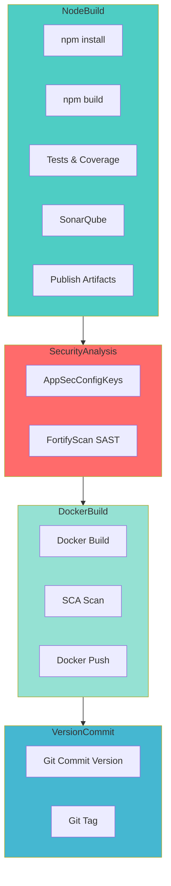

# Build NodeJS Docker

## 🎯 Descrição

Pipeline CI/CD completo para build, teste e publicação de imagens Docker de aplicações Node.js com suporte a versionamento automático, testes unitários, cobertura de código, análises de segurança e qualidade de código usando Azure DevOps e Azure Container Registry.

Tecnologia principal: **Node.js** com suporte a **TypeScript/JavaScript** para aplicações containerizadas (APIs, microserviços, aplicações web).

- [Repositório de exemplo](https://dev.azure.com/telefonica-vivo-brasil/DevOps/_git/teste-build-nodejs-docker)
- [Pipeline de exemplo](https://dev.azure.com/telefonica-vivo-brasil/DevOps/_build?definitionId=44881)

**🚀 Principais funcionalidades:**

- 🔨 **Build automatizado** com npm/yarn e cache inteligente de dependências
- 🧪 **Execução de testes unitários** com Jest e publicação de relatórios JUnit
- 📊 **Cobertura de código** com geração de relatórios LCOV para JavaScript/TypeScript
- 🔍 **Análise de qualidade** com SonarQube e Quality Gates configuráveis
- 🛡️ **Análises de segurança** SAST (Fortify) e SCA (Dependency Track)
- 🐳 **Build e publicação Docker** no Azure Container Registry com tags automáticas
- 🏷️ **Versionamento automático** com Semantic Versioning e Git tagging
- 🔄 **Suporte a feeds** Azure Artifacts e Nexus para dependências legadas
- ⚡ **Execução otimizada** com cache de dependências e estágios paralelos

## 🚀 Quick Start (5 minutos)

1. Crie os arquivos necessários no seu repositório (Veja [Dependências Externas](#-dependências-externas))
2. Crie `.azuredevops/azure-pipeline-ci.yml` na raiz
3. Cole o código de exemplo
4. Commit e push
5. ✅ Pipeline executa automaticamente!
6. Opcional: ajuste triggers

```yaml
# Pipeline básico para build Docker
# .azuredevops/azure-pipeline-ci.yml
resources:
  repositories:
    - repository: CodePlay
      name: DevOps/Vivo.CodePlay.Pipelines
      type: git
      ref: refs/heads/master
      endpoint: CodePlay

extends:
  template: /framework/pipelines/ci/build-nodejs-docker/pipeline.yaml@CodePlay
```

**O que acontece com esta configuração:**

- 🐳 Build da imagem Docker usando o Dockerfile na raiz
- 📋 Nome da imagem: `{sigla}/{nome-repositorio}`
- 🏷️ Versionamento automático (incremento patch)
- 🔒 Análise de segurança (SAST e SCA)
- 📤 Push para ACR usando service connection "ACR-DEVOPS"

### 🚀 Próximos Passos Continuous Deployment (CD)

Após o build e publicação da imagem Docker no Azure Container Registry, o próximo passo é realizar o deployment da aplicação Node.js nos ambientes desejados. O CodePlay Framework oferece múltiplas opções de CD dependendo da sua infraestrutura:

### Pipelines de CD Disponíveis

#### [deploy-helm](../../cd/deploy-helm/README.md) - Deploy via Kubernetes/Helm

**Quando usar:** Para aplicações Node.js (APIs REST, microserviços, apps web) em clusters Kubernetes (AKS, OpenShift ou genéricos).

**Principais recursos:**
- ☸️ Deploy automatizado via Helm Charts
- 🎯 Suporte a múltiplos ambientes e clusters
- 🔄 Rollback automático em falha
- 📊 Comparação visual de mudanças (kubectl diff)
- 🔵 Blue/Green Deployment via Argo Rollouts
- 🔒 Aprovações via Azure DevOps Environments

**Exemplo de uso:**
```yaml
# .azuredevops/azure-pipeline-cd.yml
trigger: none

parameters:
- name: version
  displayName: 'Versão da aplicação'
  type: string
  default: getLatestVersion()
- name: environment
  displayName: 'Versão da aplicação'
  type: string
  default: 'dev'
  values:
    - dev
    - prod

resources:
  repositories:
    - repository: CodePlay
      name: DevOps/Vivo.CodePlay.Pipelines
      type: git
      ref: refs/heads/master
      endpoint: CodePlay

extends:
  template: /framework/pipelines/cd/deploy-helm/pipeline.yaml@CodePlay
  parameters:
    environment: dev
    version: getLatestVersion()
    helmChartName: generic-microservice
    helmChartVersion: 1.0.26
```

**Saiba mais:** Consulte a documentação completa de cada pipeline de CD para configuração detalhada e parâmetros avançados.

**Saiba mais:** Consulte a [documentação completa da integração CI/CD ](https://dvps.redecorp.azr/portal/code/casos-de-uso/integrando-cicd#%EF%B8%8F-estrutura-da-integra%C3%A7%C3%A3o) para configuração detalhada e parâmetros avançados.

## 🏗️ Matriz de Capacidades

| Capacidade                  | Suporte | Descrição                                      |
|----------------------------|---------|------------------------------------------------|
| [Trunk Based Development](https://dvps.redecorp.azr/portal/codeplay/capacidades/catalog/trunk-based-development) | ✅      | Suporte nativo com estratégia de branching 'stb' |
| [Build Automatizado](https://dvps.redecorp.azr/portal/codeplay/capacidades/catalog/build-automatizado)        | ✅      | Build npm com cache e versionamento automático     |
| [Testes Unitários](https://dvps.redecorp.azr/portal/codeplay/capacidades/catalog/testes-unitarios)       | ✅      | Jest com relatórios JUnit - parâmetro ``enableTest``        |
| [SAST](https://dvps.redecorp.azr/portal/codeplay/capacidades/catalog/sast) | ✅ | Análise estática de código com Fortify ScanCentral e SSC, integração com Conviso para gestão de vulnerabilidades. Sempre habilitado. Exclusões customizadas via `enableFortifyExclusions=true`. |
| [SCA](https://dvps.redecorp.azr/portal/codeplay/capacidades/catalog/sca) | ✅ | Análise de composição de software com Dependency Track, detecção de vulnerabilidades em dependências. **A execução e o controle do SCA são realizados pelo time de AppSec.** |
| [Gates de Segurança](https://dvps.redecorp.azr/portal/codeplay/capacidades/catalog/gates-de-seguranca)          | ✅      | Controlados pela equipe de AppSec   |
| [Análise de Código](https://dvps.redecorp.azr/portal/codeplay/capacidades/catalog/analise-de-codigo)          | ✅      | SonarQube com LCOV para Node.js   |
| [Gates de Qualidade](https://dvps.redecorp.azr/portal/codeplay/capacidades/catalog/gate-de-qualidade)           | ✅      | SonarQube Quality Gate - parâmetro ``runQualityGate``    |
| [Rollback de Upgrade](https://dvps.redecorp.azr/portal/codeplay/capacidades/catalog/rollback-de-upgrade) | ❎  | Pipeline de CI não faz sentido habilitar essa capacidade |
| [Blue/Green Deployment](https://dvps.redecorp.azr/portal/codeplay/capacidades/catalog/blue-green-deployment) | ❎  | Pipeline de CI não faz sentido habilitar essa capacidade |
| [Canary Release](https://dvps.redecorp.azr/portal/codeplay/capacidades/catalog/canary-release)        | ❎  | Pipeline de CI não faz sentido habilitar essa capacidade |

Legenda:
- ✅ - Suportado nativamente
- ❌ - Não suportado
- ⚠️ - Suportado com limitações ou condições
- 🚧 - Planejado / Em Construção
- ❎ - Não faz sentido habilitar essa capacidade

## 🔄 Estrutura do Pipeline

O pipeline está organizado em 4 estágios principais com execução sequencial: build e testes Node.js primeiro, análise SAST (Fortify), build Docker com análise SCA (Dependency Track) e finalização com versionamento.



**Descrição dos Estágios:**

- **NodeBuild**: Build principal com npm install, npm build, execução de testes unitários, cobertura de código e análise de qualidade SonarQube
- **SecurityAnalysis**: Obtém configurações de AppSec e executa análise SAST com Fortify
- **DockerBuild**: Constrói a imagem Docker, executa análise SCA (Dependency Track) na imagem e publica no Azure Container Registry
- **VersionCommit**: Finalização com commit da nova versão no repositório e criação de Git tags (apenas para builds principais, não PRs)

## ⚙️ Parâmetros Disponíveis

Configure o comportamento do pipeline através dos seguintes parâmetros. Para cada parâmetro, documente claramente seu propósito e impacto.

### Parâmetros de Infraestrutura e Ambiente

#### agentPool

- **nome**: agentPool
- **tipo**: string
- **default**: "GeneralPurposeLinuxAgentsCI"
- **opções**: Qualquer agent pool configurado no Azure DevOps
- **descrição**: Define o pool de agentes onde o pipeline será executado. Use pools específicos para requisitos especiais de hardware ou software.
- **dependências**: Agent pool deve estar configurado no Azure DevOps

#### useNetworkProxy

- **nome**: useNetworkProxy
- **tipo**: boolean
- **default**: false
- **descrição**: Configurar proxy de rede para acesso externo. Deve ser `true` para pipelines executados em pools de agentes on-premises como "VivoOnPremDevAgents", "VivoOnPremHmlAgents" e "VivoOnPremPrdAgents".
- **dependências**: Nenhuma.

### Parâmetros de NodeJS e Feed

#### getDependenciesFromNexus

- **nome**: getDependenciesFromNexus
- **tipo**: boolean
- **default**: false
- **opções**: [true, false]
- **descrição**: Controla se as dependências serão baixadas do Nexus (legacy) ou Azure Artifacts. Use true apenas para projetos legados que ainda não migraram.
- **dependências**: Se true, requer credenciais NEXUS-DEPS-USR e NEXUS-DEPS-PSW no Key Vault

#### workingDirectory

- **nome**: workingDirectory
- **tipo**: string
- **default**: "$(Build.SourcesDirectory)"
- **opções**: Qualquer caminho válido relativo ao repositório
- **descrição**: Diretório onde estão localizados os arquivos do projeto Node.js (package.json, src/, etc.). Útil para monorepos.
- **dependências**: Diretório deve conter package.json e estrutura válida de projeto Node.js

### Parâmetros de Versionamento e Validação

#### versionFile

- **nome**: versionFile
- **tipo**: string
- **default**: "package.json"
- **opções**: Qualquer arquivo de versionamento válido
- **descrição**: Arquivo onde a versão do projeto está definida. Para Node.js, sempre será package.json.
- **dependências**: Arquivo deve existir no workingDirectory

#### branchingStrategy

- **nome**: branchingStrategy
- **tipo**: string
- **default**: "trunkbased"
- **opções**: ["trunkbased", "vivoflow", "releaseflow", "gitlabflow", "gitlabflow-semantic", "custom"]
- **descrição**: Estratégia de branching e versionamento utilizada pelo projeto. Define como o VersionManager irá calcular e gerenciar as versões.
- **dependências**: Nenhuma dependência adicional necessária.

#### prValidationOnly

- **nome**: prValidationOnly
- **tipo**: boolean
- **default**: false
- **opções**: [true, false]
- **descrição**: Quando true, executa apenas validações (build, teste, análises) sem publicar imagem ou gerar nova versão. Ideal para Pull Requests.
- **dependências**: Nenhuma dependência adicional necessária.

### Parâmetros de Docker / Imagem

#### imageName

- **nome**: imageName
- **tipo**: string
- **default**: `$(SIGLA)/$(Build.Repository.Name)`
- **opções**: Qualquer nome válido de imagem Docker
- **descrição**: Nome da imagem Docker que será gerada. Usa automaticamente a sigla do projeto e nome do repositório.
- **dependências**: Variável SIGLA deve estar configurada

#### dockerfilePath

- **nome**: dockerfilePath
- **tipo**: string
- **default**: "Dockerfile"
- **opções**: Qualquer caminho válido para Dockerfile
- **descrição**: Caminho relativo ao workingDirectory onde está localizado o Dockerfile.
- **dependências**: Dockerfile deve existir no caminho especificado

#### registryServiceConnection

- **nome**: registryServiceConnection
- **tipo**: string
- **default**: "ACR-DEVOPS"
- **opções**: Qualquer service connection de container registry
- **descrição**: Service connection do Azure Container Registry onde a imagem será publicada.
- **dependências**: Service connection deve estar configurada no Azure DevOps

### Parâmetros de Capacidades

#### enableTest

- **nome**: enableTest
- **tipo**: boolean
- **default**: true
- **opções**: [true, false]
- **descrição**: Habilita ou desabilita a execução de testes unitários e publicação de relatórios.
- **dependências**: Projeto deve ter scripts de teste configurados no package.json

### Parâmetros de Publicação de Testes e Cobertura

#### testResultsFormat

- **nome**: testResultsFormat
- **tipo**: string
- **default**: "JUnit"
- **opções**: ["JUnit", "NUnit", "VSTest", "XUnit", "CTest"]
- **descrição**: Formato dos arquivos de resultados de testes. Para projetos Node.js com Jest, use 'JUnit'.
- **dependências**: O relatório de testes deve ser gerado no formato especificado.

#### testResultsFiles

- **nome**: testResultsFiles
- **tipo**: string
- **default**: "test-results/junit.xml"
- **opções**: Qualquer caminho relativo válido (suporta glob patterns)
- **descrição**: Caminho relativo ao workingDirectory dos arquivos de resultados de testes.
- **dependências**: O framework de testes deve gerar o arquivo no caminho especificado.

#### failTaskOnFailedTests

- **nome**: failTaskOnFailedTests
- **tipo**: boolean
- **default**: true
- **opções**: [true, false]
- **descrição**: Quando true, a task falha se houver testes com resultado 'failed' no relatório.
- **dependências**: Nenhuma dependência adicional necessária.

#### mergeTestResults

- **nome**: mergeTestResults
- **tipo**: boolean
- **default**: true
- **opções**: [true, false]
- **descrição**: Quando true, mescla os resultados de todos os arquivos em um único test run no Azure DevOps.
- **dependências**: Nenhuma dependência adicional necessária.

#### coverageSummaryFile

- **nome**: coverageSummaryFile
- **tipo**: string
- **default**: "test-results/coverage/clover.xml"
- **opções**: Qualquer caminho relativo válido para arquivo de cobertura (suporta formatos .xml, .lcov, .coverage, etc.)
- **descrição**: Caminho relativo ao workingDirectory do arquivo de resumo de cobertura de código.
- **dependências**: O framework de testes deve gerar o arquivo de cobertura no caminho especificado.

#### failIfCoverageEmpty

- **nome**: failIfCoverageEmpty
- **tipo**: boolean
- **default**: false
- **opções**: [true, false]
- **descrição**: Quando true, a task falha se não houver resultados de cobertura para publicar.
- **dependências**: Nenhuma dependência adicional necessária.

#### publishAllureReport

- **nome**: publishAllureReport
- **tipo**: boolean
- **default**: false
- **opções**: [true, false]
- **descrição**: Quando true, publica o relatório Allure. Os resultados do Allure são gerados durante a execução de `npm run test` (não há mais um comando dedicado). O relatório é gerado via `npx allure generate` e publicado como artefato de pipeline (`PublishPipelineArtifact@1`). Independente do parâmetro `enableTest`.
- **dependências**: O script de teste (`npm run test`) deve estar configurado para gerar resultados Allure no diretório `testAllureResultsDir`; Dependências npm: reporter Allure (ex: `jest-allure`, `mocha-allure-reporter`); Requer `npx` disponível no agente (incluído no Node.js).

> **Exemplo de configuração no `package.json`:**
> ```json
> "scripts": {
>   "test": "jest --reporters=default --reporters=jest-allure"
> },
> "devDependencies": {
>   "allure-commandline": "^2.36.0",
>   "jest-allure": "^0.1.x"
> }
> ```

#### testAllureResultsDir

- **nome**: testAllureResultsDir
- **tipo**: string
- **default**: `$(Pipeline.Workspace)/allure-results`
- **opções**: Qualquer caminho absoluto válido no agente
- **descrição**: Diretório onde o Allure coleta os resultados de testes para geração do relatório. Use prefixos como `$(Pipeline.Workspace)` ou `$(Build.ArtifactStagingDirectory)` — evite `$(Build.SourcesDirectory)` para não misturar artefatos com código-fonte.
- **dependências**: Requer `publishAllureReport=true`. O framework de testes deve ser configurado para gerar resultados Allure neste caminho.

#### enableCache

- **nome**: enableCache
- **tipo**: boolean
- **default**: true
- **opções**: [true, false]
- **descrição**: Habilita cache de dependências npm para acelerar builds subsequentes.
- **dependências**: Nenhuma dependência adicional necessária.

#### runQualityGate

- **nome**: runQualityGate
- **tipo**: boolean
- **default**: true
- **opções**: [true, false]
- **descrição**: Habilita análise de qualidade de código com SonarQube e Quality Gate.
- **dependências**: Service connection SonarQube e projeto configurado no SonarQube

### Parâmetros de Publicação de Artefatos

#### artifactPaths

- **nome**: artifactPaths
- **tipo**: string
- **default**: 
  ```
  **/*
  !.git/**/*
  ```
- **opções**: Qualquer padrão glob válido (um por linha)
- **descrição**: Define quais arquivos serão publicados como artefatos de build para uso no estágio DockerBuild. Por padrão publica o repositório completo exceto .git/. Útil para otimizar tamanho do artifact ou incluir apenas arquivos específicos (ex: dist/, build/, package.json).
- **dependências**: Nenhuma dependência adicional necessária.

Adicione ao `.azuredevops/azure-pipeline-ci.yml`:

```yaml
# .azuredevops/azure-pipeline-ci.yml
resources:
  repositories:
    - repository: CodePlay
      name: DevOps/Vivo.CodePlay.Pipelines
      type: git
      ref: refs/heads/master
      endpoint: CodePlay

extends:
  template: /framework/pipelines/ci/build-nodejs-docker/pipeline.yaml@CodePlay
  parameters:
    artifactPaths: |
      dist/**/*
      build/**/*
      package.json
      package-lock.json
      !node_modules/**/*
```

### Parâmetros de Segurança

#### enableFortifyExclusions

- **nome**: enableFortifyExclusions
- **tipo**: boolean
- **default**: false
- **opções**: [true, false]
- **descrição**: Habilita checkout do repositório de exclusões Fortify para aplicar filtros específicos.
- **dependências**: Repositório de exclusões deve existir quando habilitado

#### convisoCompany

- **nome**: convisoCompany
- **tipo**: string
- **default**: "430"
- **opções**: Qualquer identificador válido de empresa no Conviso/Fortify.
- **descrição**: Identificador da empresa utilizado pela integração de segurança para correlacionar findings do scan Fortify com o tenant correto no fluxo corporativo.
- **dependências**: Deve corresponder ao cadastro esperado pelas tasks de segurança corporativas quando a análise Fortify estiver habilitada.

Adicione ao `.azuredevops/azure-pipeline-ci.yml`:

```yaml
# .azuredevops/azure-pipeline-ci.yml
resources:
  repositories:
    - repository: CodePlay
      name: DevOps/Vivo.CodePlay.Pipelines
      type: git
      ref: refs/heads/master
      endpoint: CodePlay
    - repository: FortifyExclusion
      name: DevOps/Vivo.Fortify.Exclusions
      type: git
      ref: refs/heads/master
      endpoint: CorePipelines

extends:
  template: /framework/pipelines/ci/build-nodejs-docker/pipeline.yaml@CodePlay
  parameters:
    enableFortifyExclusions: true            # ✅ Habilita exclusões Fortify
```

### Parâmetros do SonarQube

#### useSonarConfigFile

- **nome**: useSonarConfigFile
- **tipo**: boolean
- **default**: true
- **opções**: [true, false]
- **descrição**: Define se o SonarQube deve usar arquivo de configuração customizado ao invés de configuração automática.
- **dependências**: Se true, arquivo sonar-project.properties deve existir

#### sonarConfigFilePath

- **nome**: sonarConfigFilePath
- **tipo**: string
- **default**: ".azuredevops/sonar-project.properties"
- **opções**: Qualquer caminho válido
- **descrição**: Caminho para o arquivo de configuração do SonarQube quando useSonarConfigFile é true.
- **dependências**: Arquivo deve existir no caminho especificado

#### sonarPollingTimeoutSec

- **nome**: sonarPollingTimeoutSec
- **tipo**: string
- **default**: "300"
- **opções**: Qualquer valor numérico em segundos
- **descrição**: Timeout em segundos para aguardar o resultado do Quality Gate do SonarQube.
- **dependências**: Nenhuma dependência adicional necessária.

#### sonarJavaVersion

- **nome**: sonarJavaVersion
- **tipo**: string
- **default**: "openjdk-17.0.2"
- **opções**: ["openjdk-21.0.2", "openjdk-17.0.2", "openjdk-11.0.2"]
- **descrição**: Versão do Java utilizada para executar a análise do SonarQube. O SonarQube Scanner requer Java.
- **dependências**: Versão deve estar disponível no agent pool

#### sonarServiceConnection

- **nome**: sonarServiceConnection
- **tipo**: string
- **default**: "VIVO_SONARQUBE"
- **opções**: Qualquer service connection do SonarQube
- **descrição**: Service connection configurada para conectar ao servidor SonarQube.
- **dependências**: Service connection deve estar configurada no Azure DevOps

#### sonarQualityGate

- **nome**: sonarQualityGate
- **tipo**: string
- **default**: "AzureDevOps-Default"
- **opções**: Qualquer Quality Gate configurado no SonarQube
- **descrição**: Nome do Quality Gate que será aplicado na análise de qualidade.
- **dependências**: Quality Gate deve estar configurado no SonarQube

#### sonarScannerMode

- **nome**: sonarScannerMode
- **tipo**: string
- **default**: "cli"
- **opções**: ["cli", "dotnet"]
- **descrição**: Modo do scanner SonarQube. Para Node.js, sempre use "cli".
- **dependências**: Nenhuma dependência adicional necessária.

#### sonarProjectKey

- **nome**: sonarProjectKey
- **tipo**: string
- **default**: `$(System.TeamProject)-$(Build.Repository.Name)`
- **opções**: Qualquer chave válida
- **descrição**: Chave única do projeto no SonarQube. Gerada automaticamente baseada no Team Project e nome do repositório.
- **dependências**: Projeto deve estar configurado no SonarQube com essa chave

#### sonarProjectName

- **nome**: sonarProjectName
- **tipo**: string
- **default**: `$(System.TeamProject)-$(Build.Repository.Name)`
- **opções**: Qualquer nome válido
- **descrição**: Define o nome amigável e descritivo do projeto que será exibido na interface do SonarQube para facilitar a identificação.
- **dependências**: Nenhuma dependência adicional necessária.

#### useAppConfig

- **nome**: useAppConfig
- **tipo**: boolean
- **default**: true
- **opções**: [true, false]
- **descrição**: Habilita uso do Azure App Configuration para obter configurações do SonarQube dinamicamente.
- **dependências**: Azure App Configuration deve estar configurado e acessível

## 🔧 Dependências Externas

### Service Connections Obrigatórias

| Nome da Connection | Tipo | Descrição | Como Configurar |
|-------------------|------|-----------|-----------------|
| `ACR-DEVOPS` | Azure Container Registry | Conexão para publicação de imagens Docker | Configure no Project Settings > Service Connections |
| `VIVO_SONARQUBE` | SonarQube | Conexão para análise de qualidade de código | Configure com URL e token do SonarQube |
| `DevOpsSharedResources` | Azure Resource Manager | Acesso ao Azure App Configuration e Key Vault | Configure com service principal |

### Service Connections Opcionais

| Nome da Connection | Tipo | Descrição | Quando Necessário |
|-------------------|------|-----------|-------------------|
| `CodePlay` | Git | Acesso aos templates do framework | Quando usar templates externos |

### Configuração do arquivo .npmrc

Para projetos que utilizam Azure Artifacts como feed de dependências npm, é necessário criar um arquivo `.npmrc` na raiz do projeto. O pipeline injeta automaticamente as credenciais em tempo de execução através da variável `B64_AZURE_DEVOPS_PAT` (já no formato Base64).

#### Exemplo de .npmrc para a sigla DVPS

```ini
@dvps:registry=https://pkgs.dev.azure.com/telefonica-vivo-brasil/2775aacd-f72a-43ca-afa7-bc7d0ff21411/_packaging/DVPS/npm/registry/                  
registry=https://pkgs.dev.azure.com/telefonica-vivo-brasil/_packaging/DevOps/npm/registry/ 
                        
always-auth=true

; begin auth token
//pkgs.dev.azure.com/telefonica-vivo-brasil/_packaging/DevOps/npm/registry/:username=telefonica-vivo-brasil
//pkgs.dev.azure.com/telefonica-vivo-brasil/_packaging/DevOps/npm/registry/:_password=${B64_AZURE_DEVOPS_PAT}
//pkgs.dev.azure.com/telefonica-vivo-brasil/_packaging/DevOps/npm/registry/:email=npm requires email to be set but doesn't use the value
//pkgs.dev.azure.com/telefonica-vivo-brasil/_packaging/DevOps/npm/:username=telefonica-vivo-brasil
//pkgs.dev.azure.com/telefonica-vivo-brasil/_packaging/DevOps/npm/:_password=${B64_AZURE_DEVOPS_PAT}
//pkgs.dev.azure.com/telefonica-vivo-brasil/_packaging/DevOps/npm/:email=npm requires email to be set but doesn't use the value

//pkgs.dev.azure.com/telefonica-vivo-brasil/2775aacd-f72a-43ca-afa7-bc7d0ff21411/_packaging/DVPS/npm/registry/:username=telefonica-vivo-brasil
//pkgs.dev.azure.com/telefonica-vivo-brasil/2775aacd-f72a-43ca-afa7-bc7d0ff21411/_packaging/DVPS/npm/registry/:_password=${B64_AZURE_DEVOPS_PAT}
//pkgs.dev.azure.com/telefonica-vivo-brasil/2775aacd-f72a-43ca-afa7-bc7d0ff21411/_packaging/DVPS/npm/registry/:email=npm requires email to be set but doesn't use the value
//pkgs.dev.azure.com/telefonica-vivo-brasil/2775aacd-f72a-43ca-afa7-bc7d0ff21411/_packaging/DVPS/npm/:username=telefonica-vivo-brasil
//pkgs.dev.azure.com/telefonica-vivo-brasil/2775aacd-f72a-43ca-afa7-bc7d0ff21411/_packaging/DVPS/npm/:_password=${B64_AZURE_DEVOPS_PAT}
//pkgs.dev.azure.com/telefonica-vivo-brasil/2775aacd-f72a-43ca-afa7-bc7d0ff21411/_packaging/DVPS/npm/:email=npm requires email to be set but doesn't use the value
; end auth token
```

#### Importante sobre a variável B64_AZURE_DEVOPS_PAT

O pipeline já fornece automaticamente a variável `B64_AZURE_DEVOPS_PAT` no formato correto (Base64). **Não é necessário** criar ou converter essa variável manualmente no pipeline - ela é injetada automaticamente durante a execução.

Para uso local durante o desenvolvimento, você pode gerar o valor da variável com:

```bash
B64_AZURE_DEVOPS_PAT=$(echo -n $AZURE_DEVOPS_PAT | base64)
```

#### Como obter as instruções específicas do seu feed

Para encontrar as configurações corretas de `.npmrc` para o feed do seu projeto:

1. Acesse o **Azure DevOps** do seu projeto
2. No menu lateral, clique em **Artifacts**
3. Selecione o feed desejado
4. Clique no botão **Connect to feed**
5. Selecione **npm** na lista de tipos de conexão
6. Selecione **Other** na seção de Project setup
7. Copie as instruções exibidas e adapte conforme o exemplo acima

**URL de exemplo para acessar as instruções:**
```
https://dev.azure.com/telefonica-vivo-brasil/{NOME_DO_PROJETO}/_artifacts/feed/{SIGLA_DO_FEED}/connect
```

Substitua:
- `{NOME_DO_PROJETO}` pelo nome do seu Team Project (ex: `DVPS%20-%20DEVOPS`)
- `{SIGLA_DO_FEED}` pelo nome do feed (ex: `DevOps`, `DVPS`)

### Recursos de Build Agent

- **Node.js**: Versão especificada no arquivo .tool-versions (asdf)
- **Docker**: Para build e push de imagens
- **Java**: OpenJDK para execução do SonarQube Scanner
- **Git**: Para operações de versionamento e tagging
- **npm/yarn**: Para gerenciamento de dependências

## 🎨 Comportamentos Customizados

:::danger
**⚠️ ATENÇÃO: CUSTOMIZAÇÕES REQUEREM RESPONSABILIDADE ⚠️**

- ✅ **Use os exemplos como ponto de partida** - Eles demonstram padrões seguros e testados
- 🧠 **"Todos somos adultos"** - Confiamos na sua expertise, mas exigimos consciência do impacto
- 📝 **Tudo fica registrado** - Seu histórico de commits é auditável e rastreável
- 🎯 **Entenda antes de modificar** - Customizações incorretas podem quebrar builds em produção
- 🤝 **Documente suas decisões** - Facilite a manutenção futura por outros membros da equipe

**Customizar é permitido. Fazer sem entender não é.**
:::

### [Nome do Cenário 1 - ex: Docker Registry Personalizado]

```yaml
# .azuredevops/pipelines/[categoria].yaml
resources:
  repositories:
    - repository: CodePlay
      name: DevOps/Vivo.CodePlay.Pipelines
      type: git
      ref: refs/heads/master
      endpoint: CodePlay

extends:
  template: /framework/pipelines/[categoria]/[nome-do-pipeline]/pipeline.yaml@CodePlay
parameters:
  [parametro1]: "[valor]"  # [Comentário explicativo]
  [parametro2]: [valor]    # [Comentário explicativo]
```

### [Nome do Cenário 2]

[Continue com outros cenários relevantes baseados no pipeline]

### Projeto Monorepo - Build de Subprojeto

```yaml
# .azuredevops/azure-pipeline-ci.yml
resources:
  repositories:
    - repository: CodePlay
      name: DevOps/Vivo.CodePlay.Pipelines
      type: git
      ref: refs/heads/master
      endpoint: CodePlay

extends:
  template: /framework/pipelines/ci/build-nodejs-docker/pipeline.yaml@CodePlay
parameters:
  workingDirectory: "$(Build.SourcesDirectory)/apps/frontend"  # Subdiretório do projeto
  dockerfilePath: "apps/frontend/Dockerfile"                  # Dockerfile no subdiretório
  imageName: "$(SIGLA)/$(Build.Repository.Name)-frontend"     # Nome específico da imagem
```

### Validação de Pull Request

```yaml
# .azuredevops/pipelines/pr.yaml
resources:
  repositories:
    - repository: CodePlay
      name: DevOps/Vivo.CodePlay.Pipelines
      type: git
      ref: refs/heads/master
      endpoint: CodePlay

extends:
  template: /framework/pipelines/ci/build-nodejs-docker/pipeline.yaml@CodePlay
parameters:
  prValidationOnly: true          # Apenas validação, sem publicar
  useAppConfig: false            # Usa configuração local do SonarQube
```

### Projeto Legacy com Nexus

```yaml
# .azuredevops/azure-pipeline-ci.yml
resources:
  repositories:
    - repository: CodePlay
      name: DevOps/Vivo.CodePlay.Pipelines
      type: git
      ref: refs/heads/master
      endpoint: CodePlay

extends:
  template: /framework/pipelines/ci/build-nodejs-docker/pipeline.yaml@CodePlay
parameters:
  getDependenciesFromNexus: true                   # Habilita Nexus para dependências
  registryServiceConnection: 'ACR-LEGACY'         # Registry específico para legacy
  sonarQualityGate: 'Legacy-QualityGate'          # Quality Gate específico
```

### Configuração Completa Customizada

```yaml
# .azuredevops/azure-pipeline-ci.yml
resources:
  repositories:
    - repository: CodePlay
      name: DevOps/Vivo.CodePlay.Pipelines
      type: git
      ref: refs/heads/master
      endpoint: CodePlay

extends:
  template: /framework/pipelines/ci/build-nodejs-docker/pipeline.yaml@CodePlay
parameters:
  # Configurações de projeto
  workingDirectory: "$(Build.SourcesDirectory)/services/api"
  imageName: "$(SIGLA)/microservice-api"
  dockerfilePath: "services/api/Dockerfile.production"
  
  # Configurações de capacidades
  enableCache: true
  enableTest: true
  runQualityGate: true
  
  # Configurações de Publicação de Artefatos
  artifactPaths: |
    dist/**/*
    package.json
    package-lock.json
    !node_modules/**/*
  
  # Configurações SonarQube
  useSonarConfigFile: false
  sonarPollingTimeoutSec: "600"
  sonarJavaVersion: "openjdk-21.0.2"
  sonarQualityGate: "Production-QualityGate"
  
  # Configurações de Segurança
  enableFortifyExclusions: false
  
  # Infraestrutura
  agentPool: "HighPerformanceAgents"
  registryServiceConnection: "ACR-PRODUCTION"
```

## 🔖 Variáveis de Ambiente

| Variável | Descrição | Valor Padrão |
|----------|-----------|--------------|
| `SIGLA` | Sigla do projeto extraída do Team Project | `$[ lower(split(variables['System.TeamProject'],' ')[0]) ]` |
| `NODE_CACHE_FOLDER` | Diretório para cache das dependências npm | `$(Pipeline.Workspace)/.npm` |
| `CACORP_LOCATION` | Localização do certificado CA corporativo | `$(Agent.HomeDirectory)/../../certs/CACORP.pem` |
| `FORTIFY_APP_DEFAULT_VERSION` | Versão padrão da aplicação no Fortify | `DevSecOps` |
| `APP_LANGUAGE` | Linguagem da aplicação para análises de segurança | `nodejs` |
| `DOCKER_SERVICE_CONNECTION` | Service connection do Docker Registry | `${{ parameters.registryServiceConnection }}` |
| `AKV_DEVOPS_NAME` | Nome do Azure Key Vault compartilhado | `kv-azdevops-shared` |
| `PROXY_SQUID_SERVER` | Servidor proxy Squid para acesso externo | `10.240.58.39:3128` |
| `PROXY_AGENT_HTTP` | URL do proxy HTTP | `http://$(PROXY_SQUID_SERVER)` |
| `PROXY_AGENT_HTTPS` | URL do proxy HTTPS | `http://$(PROXY_SQUID_SERVER)` |
| `PROXY_AGENT_NO_PROXY` | Lista de exceções do proxy | `localhost,0.0.0.0,127.0.0.1,10.244.0.0/16,192.168.0.0/16,10.129.178.173,nexus.telefonica.com.br,acrsharedservices01.azurecr.io,appcs-azdevops-shared.azconfig.io,scm.azurewebsites.net` |

**Nota**: Configurações específicas do projeto devem ser definidas como parâmetros, não como variáveis de ambiente.

## ❓ FAQ

### Onde posso encontrar mais informações sobre o CodePlay Framework?

Você pode encontrar mais informações sobre o CodePlay Framework na [documentação oficial](https://dvps.redecorp.azr/portal/codeplay/framework/).

### Onde encontro as capacidades disponíveis?

As capacidades disponíveis podem ser encontradas no [Catálogo de Capacidade](https://dvps.redecorp.azr/portal/catalog/capabilities) no Portal CodePlay.

### Como faço para customizar o pipeline?

Siga o guia de [Adoção ao CodePlay](https://dvps.redecorp.azr/portal/codeplay/roteiro/codeplay#fluxo-de-ado%C3%A7%C3%A3o-ao-codeplay).

### Quais casos de uso relevantes?

[Liste casos de uso específicos para este pipeline com links reais, por exemplo:]
- [Docker Build Mais Rapido](https://dvps.redecorp.azr/portal/code/casos-de-uso/docker-build-mais-rapido)
- [Integrando CICD](https://dvps.redecorp.azr/portal/code/casos-de-uso/integrando-cicd)
- Veja o [Catálogo de Casos de Uso](https://dvps.redecorp.azr/portal/catalog/casos-de-uso) para outros exemplos de casos de uso.

### Quais Erros Comuns relevantes?

[Se houver erros comuns documentados, liste aqui com links. Caso contrário:]
- Ainda não temos nenhum erro comum documentado para este pipeline.
- Veja o [Catálogo de Erros Conhecidos](https://dvps.redecorp.azr/portal/catalog/erros-conhecidos) para outros exemplos de erros.

### Como configurar o arquivo .npmrc corretamente?

Veja a seção [Configuração do arquivo .npmrc](#configuração-do-arquivo-npmrc) para detalhes completos sobre como configurar o arquivo .npmrc para o seu projeto.

## 🆘 Suporte

- [Abra um chamado para Dev Support](https://dvps.redecorp.azr/portal/codeplay/roteiro/#:~:text=Abra%20um%20chamado%20para%20Dev%20Support)
- [Canal DevEx - Azure DevOps](https://teams.microsoft.com/l/channel/19%3A8fbd00946cf044d7a844182ac71e6aa1%40thread.tacv2/Azure%20DevOps?groupId=038b4415-d6dd-42ce-92e5-31a8e2a13bf8&tenantId=9744600e-3e04-492e-baa1-25ec245c6f10)

## 📝 Decisões Tomadas

### Decisão 1: Configuração do Feed via .npmrc

- **Data**: 25/09/2025
- **Motivador**: Padronização de acesso aos registros npm
- **Fórum Envolvido**: DevOps Soluções
- **Descrição**: O arquivo .npmrc deve estar no repositório para configurar o feed npm. O pipeline utiliza este arquivo e injeta credenciais em tempo de execução. A ideia é dar transparência para o desenvolvedor.
- **Impacto**: Simplifica a configuração e não requer parametrização adicional no pipeline, porém exige que o desenvolvedor mantenha o arquivo atualizado e com risco de configurar incorretamente credenciais neste arquivo.
- **Próximos Passos**: Documentar padrões de .npmrc para Azure Artifacts e Nexus.
- **Referências**: Documentação interna de padrões npm.
- **Notas**: Esta abordagem permite que os desenvolvedores usem o mesmo arquivo para desenvolvimento local.

### Decisão 2: Usuário somente de leitura no Nexus (DEPS)
- **Data**: 25/09/2025
- **Motivador**: A ideia é desmotivar o uso do nexus para publicação de artefatos, e incentivar o uso do Azure Artifacts. A utilização do nexus fica restrita a apenas baixar dependências, pois alguns projetos ainda podem ter dependências legadas.
- **Fórum Envolvido**: Soluções DevOps
- **Descrição**: O usuário utilizado para autenticação no Nexus (DEPS) terá apenas permissão de leitura.
- **Impacto**: A publicação de artefatos em Nexus não será possível, forçando o uso do Azure Artifacts.
- **Próximos Passos**: Monitorar o uso do Nexus e incentivar a migração para Azure Artifacts.
- **Referências**: Parâmetro `getDependenciesFromNexus`
- **Notas**: N/D

### Decisão 3: Adicionar variável SYSTEM_ACCESSTOKEN e não apenas AZURE_DEVOPS_PAT
- **Data**: 14/10/2025
- **Motivador**: Algumas documentações sugerem a criação de uma variável de ambiente chamada `SYSTEM_ACCESSTOKEN` para realizar a autenticação em Azure Artifacts.
- **Fórum Envolvido**: Soluções DevOps
- **Descrição**: Adicionar a variável de ambiente `SYSTEM_ACCESSTOKEN` com o valor de `$(System.AccessToken)` para garantir compatibilidade com documentações e práticas recomendadas. Não tem impacto deixar as duas variáveis, pois ambas apontam para o mesmo token.
- **Impacto**: Melhora a clareza e compatibilidade com documentações externas.

### Decisão 4: Padronização do Estágio AppSec com Artefato
- **Data**: 14/11/2025
- **Motivador**: Garantir contexto completo e isolamento das verificações de segurança, alinhando o framework às melhores práticas recomendadas pela equipe de AppSec.
- **Fórum Envolvido**: Equipe AppSec, DevOps Soluções
- **Descrição**: Adotar a abordagem de estágio dedicado de AppSec utilizando artefatos gerados nos estágios anteriores (build/teste). O estágio de AppSec consome esses artefatos para realizar as análises de segurança, garantindo contexto completo e permitindo paralelismo, reexecução e troubleshooting facilitado.
- **Impacto**: Exige ajustes nos pipelines para geração e consumo de artefatos, mas aumenta a eficácia e rastreabilidade das análises de segurança.
- **Próximos Passos**: Adaptar templates e pipelines para garantir que o estágio AppSec sempre utilize artefatos completos do build.
- **Referências**: [ADR 0004 - Estágios de AppSec nos pipelines](/framework/docs/adr/0004-estagios-de-appsec-nos-pipelines.md)
- **Notas**: Recomendado como padrão para todos os pipelines do framework.

### Decisão 5: Adoção do Template Padrão AppSec
- **Data**: 14/11/2025
- **Motivador**: Alinhar o framework às diretrizes e práticas recomendadas pela equipe de AppSec, promovendo padronização e facilidade de manutenção.
- **Fórum Envolvido**: Equipe AppSec, DevOps Soluções
- **Descrição**: Adotar o template padrão definido pela equipe de AppSec para integração das verificações de segurança nos pipelines do framework. A custom task desenvolvida internamente será avaliada e integrada de forma gradual, sem exigir mudanças nos arquivos `.azuredevops/pipelines.yml` dos projetos consumidores.
- **Impacto**: Todos os pipelines do framework passam a incorporar o template AppSec, garantindo consistência e alinhamento com as melhores práticas. A custom task será evoluída em paralelo, em colaboração com AppSec.
- **Próximos Passos**: Atualizar templates do framework para uso do template AppSec e iniciar avaliação da custom task para integração futura.
- **Referências**: [ADR 0005 - Uso de template para AppSec](/framework/docs/adr/0005-uso-de-template-para-appsec.md)
- **Notas**: Mudança planejada para não exigir alterações nos pipelines dos projetos já existentes.

### Decisão 6: Depreciação do parâmetro `sonarServiceConnection` e governança SonarQube (ADR 0006)
- **Data**: 13/05/2026
- **Motivador**: Alinhar o pipeline à governança definida na ADR 0006, evitando bypass manual do controle de acesso ao Sonar VIP.
- **Fórum Envolvido**: CoE DevOps
- **Descrição**: O parâmetro `sonarServiceConnection` será depreciado em breve. Atualmente, ainda é possível referenciar manualmente o Sonar VIP ou comum, mas a escolha da instância passará a ser feita automaticamente pela custom task, baseada no arquivo `vip.json`. Isso garante que apenas projetos aprovados utilizem o Sonar VIP, conforme política definida.
- **Impacto**: Evita burla de governança, aumenta a rastreabilidade e prepara o pipeline para remoção futura do parâmetro.
- **Próximos Passos**: Depreciar o parâmetro `sonarServiceConnection` no pipeline e atualizar a lista do `vip.json` com as siglas dos projetos autorizados ao Sonar VIP.
- **Referências**: [ADR 0008 - Sonar VIP Governance](/framework/docs/adr/0008-sonar-vip-governance.md)
- **Notas**: O parâmetro permanece disponível temporariamente para retrocompatibilidade, mas será depreciado em breve.