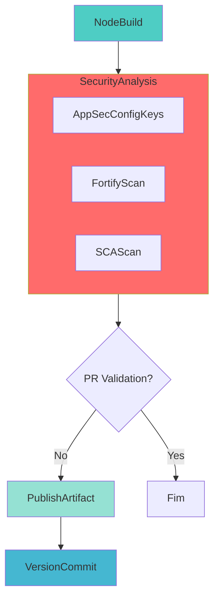

# Pipeline de Build de Biblioteca NodeJS

## 🎯 Descrição

Pipeline de CI para construção, teste e publicação de bibliotecas Node.js no registro de pacotes npm (Azure Artifacts).

- O pipeline automatiza o processo de build, testes unitários, geração de relatórios de cobertura, análises de segurança e publicação automática de bibliotecas Node.js
- As tecnologias principais utilizadas incluem Node.js, npm/yarn, Jest para testes, SonarQube para análise de qualidade, Fortify para SAST e Dependency Track para SCA
- Suporta projetos de bibliotecas e componentes reutilizáveis em JavaScript e TypeScript
- Principais benefícios incluem versionamento automático com Semantic Versioning, análises de segurança paralelas para otimização de tempo, cache inteligente de dependências e suporte a feeds Azure Artifacts e Nexus para dependências legadas.

- [Pipeline utilizado para testes](https://dev.azure.com/telefonica-vivo-brasil/DevOps/_build?definitionId=44919)
- [Repositório de exemplo](https://dev.azure.com/telefonica-vivo-brasil/DevOps/_git/teste-build-nodejs-lib?path=/javascript)


## 🚀 Quick Start (5 minutos)

1. Crie os arquivos necessários no seu repositório (Veja [Dependências Externas](#-dependências-externas))
2. Crie `.azuredevops/azure-pipeline-ci.yml` na raiz
3. Cole o código de exemplo
4. Commit e push
5. ✅ Pipeline executa automaticamente!
6. Opcional: ajuste triggers

```yaml
# Pipeline básico para build de biblioteca Node.js
# .azuredevops/azure-pipeline-ci.yml
resources:
  repositories:
    - repository: CodePlay
      name: DevOps/Vivo.CodePlay.Pipelines
      type: git
      ref: refs/heads/master
      endpoint: CodePlay

extends:
  template: /framework/pipelines/ci/build-nodejs-lib/pipeline.yaml@CodePlay
```

**O que acontece com esta configuração:**

- 🔨 Build da biblioteca Node.js usando npm/yarn
- 🧪 Execução de testes unitários com Jest
- 📊 Geração de relatórios de cobertura
- 🔍 Análise de qualidade com SonarQube
- 🛡️ Análises de segurança SAST (Fortify) e SCA em paralelo
- 📦 Publicação automática no registro npm (Azure Artifacts)
- 🏷️ Versionamento automático com Semantic Versioning
- 🔄 Suporte a feeds Azure Artifacts e Nexus para dependências

### 🚀 Próximos Passos Continuous Deployment (CD)

Bibliotecas Node.js (pacotes npm) **não necessitam de um pipeline de deployment tradicional**. Este pipeline de CI já realiza a publicação do pacote no Azure Artifacts (feed npm), tornando-o disponível para consumo por outras aplicações.

### Como Consumir Esta Biblioteca

Após a execução bem-sucedida deste pipeline:

1. **Pacote publicado** no Azure Artifacts feed npm (ex: `DVPS` feed)
2. **Versão versionada** automaticamente no `package.json` e tag Git criada
3. **Pronto para consumo** por outros projetos Node.js/TypeScript

### Exemplo de Consumo em Outro Projeto

```bash
# Instalar a biblioteca publicada
npm install @hbpo/lib-features-flags

# Ou adicionar ao package.json
```

```json
{
  "dependencies": {
    "@hbpo/lib-features-flags": "^1.2.3"
  }
}
```

### 🎯 Aplicações Que Usam Esta Biblioteca

Aplicações que dependem desta biblioteca (APIs Node.js, microserviços, apps web) têm seus próprios pipelines de CI/CD:

- **[build-nodejs-docker](../build-nodejs-docker/README.md)** - Para aplicações Node.js containerizadas
- **[deploy-helm](../../cd/deploy-helm/README.md)** - Para deployment em Kubernetes
- **[deploy-ssh](../../cd/deploy-ssh/README.md)** - Para deployment em servidores tradicionais

Estes pipelines automaticamente baixam e utilizam a versão publicada desta biblioteca durante o `npm install` do build.

## 🏗️ Matriz de Capacidades

| Capacidade                  | Suporte | Descrição                                      |
|----------------------------|---------|------------------------------------------------|
| [Trunk Based Development](https://dvps.redecorp.azr/portal/codeplay/capacidades/catalog/trunk-based-development) | ✅      | Suportado com estratégia de branches configurável via `VersionManagerVivo@8`    |
| [Build Automatizado](https://dvps.redecorp.azr/portal/codeplay/capacidades/catalog/build-automatizado)        | ✅      | Build automático usando npm     |
| [Testes Unitários](https://dvps.redecorp.azr/portal/codeplay/capacidades/catalog/testes-unitarios)       | ✅      | Habilitado por padrão, controlado pelo parâmetro `enableTest`        |
| [SAST](https://dvps.redecorp.azr/portal/codeplay/capacidades/catalog/sast)                        | ✅      | Análise estática de código via Fortify no estágio SecurityAnalysis executado após o build.                       |
| [SCA](https://dvps.redecorp.azr/portal/codeplay/capacidades/catalog/sca)                        | ✅      | Análise de composição de software via template run-sca-scan.yaml no estágio SecurityAnalysis.           |
| [Gates de Segurança](https://dvps.redecorp.azr/portal/codeplay/capacidades/catalog/gates-de-seguranca)          | ✅      | O controle dos gates de segurança (bloqueio ou não do pipeline) é realizado pelo time de AppSec via chaves de configuração recuperadas do AppConfig corporativo (`SKIP_SECURITY_GATE`, `SKIP_SECURITY_GATE_SCA` etc).   |
| [Análise de Código](https://dvps.redecorp.azr/portal/codeplay/capacidades/catalog/analise-de-codigo)          | ✅      | SonarQube com LCOV para Node.js - parâmetro `runQualityGate`   |
| [Gates de Qualidade](https://dvps.redecorp.azr/portal/codeplay/capacidades/catalog/gate-de-qualidade)           | ✅      | SonarQube Quality Gate - parâmetro `runQualityGate`    |
| [Rollback de Upgrade](https://dvps.redecorp.azr/portal/codeplay/capacidades/catalog/rollback-de-upgrade) | ❎  | Pipeline de CI não faz sentido habilitar essa capacidade |
| [Blue/Green Deployment](https://dvps.redecorp.azr/portal/codeplay/capacidades/catalog/blue-green-deployment) | ❎  | Pipeline de CI não faz sentido habilitar essa capacidade |
| [Canary Release](https://dvps.redecorp.azr/portal/codeplay/capacidades/catalog/canary-release)        | ❎  | Pipeline de CI não faz sentido habilitar essa capacidade |

Legenda:
- ✅ - Suportado nativamente
- ❌ - Não suportado
- ⚠️ - Suportado com limitações ou condições
- 🚧 - Planejado / Em Construção
- ❎ - Não faz sentido habilitar essa capacidade

## 🔄 Estrutura do Pipeline

O pipeline é organizado em quatro estágios principais. O NodeBuild executa primeiro, seguido pelo SecurityAnalysis. Se não for validação de PR, executa PublishArtifact e, por fim, VersionCommit.



### Estágios do Pipeline

1. **🔨 NodeBuild**
   - Realiza checkout do código, configuração do ambiente Node.js e cache de dependências
   - Executa build da biblioteca, testes unitários (quando habilitado) e geração de relatórios
   - Executa análise de qualidade com SonarQube (quando habilitado)
   - Prepara e publica artefatos de build para análises de segurança

2. **🛡️ SecurityAnalysis**
   - **AppSecConfigKeys**: Recupera configurações de segurança do Azure App Configuration
   - **FortifyScan**: Executa análise SAST via Fortify ScanCentral (condicional)
   - **SCAScan**: Executa análise SCA via Dependency Track (condicional)
   - Jobs executam em paralelo quando aplicável para otimizar o tempo total

3. **📦 PublishArtifact** (Condicional - apenas quando `prValidationOnly=false`)
   - Baixa os artefatos buildados e testados
   - Calcula a próxima versão usando Semantic Versioning
   - Publica o pacote npm no registro configurado (Azure Artifacts ou Nexus)

4. **🏷️ VersionCommit** (Condicional - apenas quando `prValidationOnly=false`)
   - Calcula a próxima versão usando Semantic Versioning
   - Commit da nova versão no package.json e criação de tag Git
   - Rastreabilidade completa das versões publicadas

## 📋 Parâmetros Disponíveis

Configure o comportamento do pipeline através dos seguintes parâmetros:

### Infraestrutura e Ambiente

#### agentPool

- **nome**: agentPool
- **tipo**: string
- **default**: "GeneralPurposeLinuxAgentsCI"
- **opções**: Qualquer pool de agentes disponível
- **descrição**: "Define o pool de agentes onde o pipeline será executado"
- **dependências**: O pool especificado deve existir na organização Azure DevOps

#### useNetworkProxy

- **nome**: useNetworkProxy
- **tipo**: boolean
- **default**: false
- **descrição**: Configurar proxy de rede para acesso externo. Deve ser `true` para pipelines executados em pools de agentes on-premises como "VivoOnPremDevAgents", "VivoOnPremHmlAgents" e "VivoOnPremPrdAgents".
- **dependências**: Nenhuma.

### Configurações de NodeJS e Feed

#### getDependenciesFromNexus

- **nome**: getDependenciesFromNexus
- **tipo**: boolean
- **default**: false
- **opções**: true/false
- **descrição**: "Define se a autenticação de pacotes será feita via Nexus (true) ou Azure Artifacts (false). Quando true, recupera credenciais do Azure Key Vault."
- **dependências**: Se true, requer uma conexão "DevOpsSharedResources" para Azure Key Vault e acesso ao KeyVault "kv-azdevops-shared"

#### workingDirectory

- **nome**: workingDirectory
- **tipo**: string
- **default**: "$(Build.SourcesDirectory)"
- **opções**: Qualquer caminho relativo dentro do repositório
- **descrição**: "Diretório base onde se encontra o projeto Node.js, contendo o package.json"
- **dependências**: Nenhuma dependência adicional necessária

#### buildArtifactName

- **nome**: buildArtifactName
- **tipo**: string
- **default**: "$(Build.Repository.Name)"
- **opções**: Não aplicável
- **descrição**: Nome do artefato de build publicado. Utilizado na task DownloadPipelineArtifact@2 no template /security/run_sca_scan.yml para análise de segurança SCA.
- **dependências**: Utilizado pelo template /security/run_sca_scan.yml no estágio SecurityAnalysis.

### Configurações de Versionamento e Validação

#### versionFile

- **nome**: versionFile
- **tipo**: string
- **default**: "package.json"
- **opções**: Geralmente package.json ou outro arquivo contendo informação de versão
- **descrição**: "Arquivo que contém a informação de versão a ser atualizada pelo pipeline"
- **dependências**: O arquivo deve existir no diretório de trabalho especificado

#### branchingStrategy

- **nome**: branchingStrategy
- **tipo**: string
- **default**: "trunkbased"
- **opções**: ["trunkbased", "vivoflow", "releaseflow", "gitlabflow", "gitlabflow-semantic", "custom"]
- **descrição**: "Estratégia de branching e versionamento utilizada pelo projeto. Define como o VersionManager irá calcular e gerenciar as versões."
- **dependências**: Nenhuma dependência adicional necessária

#### prValidationOnly

- **nome**: prValidationOnly
- **tipo**: boolean
- **default**: false
- **opções**: true/false
- **descrição**: "Quando true, executa apenas a validação (build e testes) sem publicar pacotes ou gerar novas versões"
- **dependências**: Nenhuma dependência adicional necessária

#### branchingStrategy

- **nome**: branchingStrategy
- **tipo**: string
- **default**: "trunkbased"
- **opções**: 
  - `trunkbased` - Desenvolvimento baseado em trunk (padrão)
  - `vivoflow` - Fluxo de branches customizado Vivo
  - `releaseflow` - Estratégia baseada em branches de release
  - `gitlabflow` - GitLab Flow
  - `gitlabflow-semantic` - GitLab Flow com versionamento semântico
  - `custom` - Estratégia customizada
- **descrição**: "Define a estratégia de versionamento e branching utilizada pelo VersionManagerVivo. A estratégia escolhida afeta como as versões são calculadas baseado no branch e histórico de commits."
- **dependências**: Utilizado pela task VersionManagerVivo@8 para cálculo de versionamento

#### artifactPaths

- **nome**: artifactPaths
- **tipo**: string
- **default**: 
  ```
  **/*
  !.git/**/*
  !.vscode/**/*
  !.idea/**/*
  ```
- **descrição**: "Padrões de arquivos para publicar no artefato de build (glob patterns, um por linha). Define quais arquivos serão incluídos no artefato para análise de segurança SAST/SCA. Por padrão, inclui todos os arquivos exceto diretórios de controle de versão e IDEs."
- **dependências**: Utilizado pela task CopyFiles@2 para preparar artefatos antes da análise de segurança.

### Configurações de Build e Teste

#### enableTest

- **nome**: enableTest
- **tipo**: boolean
- **default**: true
- **opções**: true/false
- **descrição**: "Habilita ou desabilita a execução de testes unitários durante o build"
- **dependências**: Para uso efetivo, o projeto deve ter testes configurados e deve gerar relatórios no formato JUnit XML

### Configurações de Publicação de Testes e Cobertura

#### testResultsFormat

- **nome**: testResultsFormat
- **tipo**: string
- **default**: "JUnit"
- **opções**: ["JUnit", "NUnit", "VSTest", "XUnit", "CTest"]
- **descrição**: "Formato dos arquivos de resultados de testes. Para projetos Node.js com Jest, use 'JUnit'."
- **dependências**: O relatório de testes deve ser gerado no formato especificado.

#### testResultsFiles

- **nome**: testResultsFiles
- **tipo**: string
- **default**: "test-results/junit.xml"
- **opções**: Qualquer caminho relativo válido (suporta glob patterns)
- **descrição**: "Caminho relativo ao workingDirectory dos arquivos de resultados de testes."
- **dependências**: O framework de testes deve gerar o arquivo no caminho especificado.

#### failTaskOnFailedTests

- **nome**: failTaskOnFailedTests
- **tipo**: boolean
- **default**: true
- **opções**: true/false
- **descrição**: "Quando true, a task falha se houver testes com resultado 'failed' no relatório."
- **dependências**: Nenhuma dependência adicional necessária.

#### mergeTestResults

- **nome**: mergeTestResults
- **tipo**: boolean
- **default**: true
- **opções**: true/false
- **descrição**: "Quando true, mescla os resultados de todos os arquivos em um único test run no Azure DevOps."
- **dependências**: Nenhuma dependência adicional necessária.

#### coverageSummaryFile

- **nome**: coverageSummaryFile
- **tipo**: string
- **default**: "test-results/coverage/clover.xml"
- **opções**: Qualquer caminho relativo válido para arquivo de cobertura (suporta formatos .xml, .lcov, .coverage, etc.)
- **descrição**: "Caminho relativo ao workingDirectory do arquivo de resumo de cobertura de código."
- **dependências**: O framework de testes deve gerar o arquivo de cobertura no caminho especificado.

#### failIfCoverageEmpty

- **nome**: failIfCoverageEmpty
- **tipo**: boolean
- **default**: false
- **opções**: true/false
- **descrição**: "Quando true, a task falha se não houver resultados de cobertura para publicar."
- **dependências**: Nenhuma dependência adicional necessária.

#### publishAllureReport

- **nome**: publishAllureReport
- **tipo**: boolean
- **default**: false
- **opções**: true/false
- **descrição**: Quando true, publica o relatório Allure. Os resultados do Allure são gerados durante a execução de `npm run test` (não há mais um comando dedicado). O relatório é gerado via `npx allure generate` e publicado como artefato de pipeline (`PublishPipelineArtifact@1`). Independente do parâmetro `enableTest`.
- **dependências**:
  - O script de teste (`npm run test`) deve estar configurado para gerar resultados Allure no diretório `testAllureResultsDir`.
  - Dependências npm: reporter Allure (ex: `jest-allure`, `mocha-allure-reporter`).
  - Requer `npx` disponível no agente (incluído no Node.js).

> **Exemplo de configuração no `package.json`:**
> ```json
> "scripts": {
>   "test": "jest --reporters=default --reporters=jest-allure"
> },
> "devDependencies": {
>   "allure-commandline": "^2.36.0",
>   "jest-allure": "^0.1.x"
> }
> ```

#### testAllureResultsDir

- **nome**: testAllureResultsDir
- **tipo**: string
- **default**: `$(Pipeline.Workspace)/allure-results`
- **opções**: Qualquer caminho absoluto válido no agente
- **descrição**: Diretório onde o Allure coleta os resultados de testes para geração do relatório. Use prefixos como `$(Pipeline.Workspace)` ou `$(Build.ArtifactStagingDirectory)` — evite `$(Build.SourcesDirectory)` para não misturar artefatos com código-fonte.
- **dependências**: Requer `publishAllureReport=true`. O framework de testes deve ser configurado para gerar resultados Allure neste caminho.

#### enableCache

- **nome**: enableCache
- **tipo**: boolean
- **default**: true
- **opções**: true/false
- **descrição**: "Habilita ou desabilita o cache de dependências npm para otimizar o tempo de build"
- **dependências**: Nenhuma dependência adicional necessária

#### runQualityGate

- **nome**: runQualityGate
- **tipo**: boolean
- **default**: true
- **opções**: true/false
- **descrição**: "Habilita ou desabilita a execução da análise de qualidade de código com SonarQube."
- **dependências**: Service Connection SonarQube configurada e projeto configurado no SonarQube.

### Configurações de Segurança

#### enableFortifyExclusions

- **nome**: enableFortifyExclusions
- **tipo**: boolean
- **default**: false
- **opções**: true/false
- **descrição**: "Habilita checkout do repositório de exclusões Fortify para aplicar filtros específicos durante análise SAST."
- **dependências**: Repositório FortifyExclusion configurado e acessível durante checkout.

### Parâmetros do SonarQube

#### useSonarConfigFile

- **nome**: useSonarConfigFile
- **tipo**: boolean
- **default**: true
- **opções**: true/false
- **descrição**: "Define se o SonarQube deve usar arquivo de configuração customizado ao invés de configuração automática."
- **dependências**: Se true, arquivo sonar-project.properties deve existir no caminho especificado.

#### sonarConfigFilePath

- **nome**: sonarConfigFilePath
- **tipo**: string
- **default**: ".azuredevops/sonar-project.properties"
- **opções**: Qualquer caminho válido
- **descrição**: "Caminho para o arquivo de configuração do SonarQube quando useSonarConfigFile é true."
- **dependências**: Arquivo deve existir no caminho especificado.

#### sonarPollingTimeoutSec

- **nome**: sonarPollingTimeoutSec
- **tipo**: string
- **default**: "300"
- **opções**: Qualquer valor numérico em segundos
- **descrição**: "Timeout em segundos para aguardar o resultado do Quality Gate do SonarQube."
- **dependências**: Nenhuma dependência adicional necessária.

#### sonarJavaVersion

- **nome**: sonarJavaVersion
- **tipo**: string
- **default**: "openjdk-17.0.2"
- **opções**: ["openjdk-21.0.2", "openjdk-17.0.2", "openjdk-11.0.2"]
- **descrição**: "Versão do Java utilizada para executar a análise do SonarQube. O SonarQube Scanner requer Java."
- **dependências**: Versão deve estar disponível no agent pool.

#### sonarServiceConnection

- **nome**: sonarServiceConnection
- **tipo**: string
- **default**: "VIVO_SONARQUBE"
- **opções**: Qualquer service connection do SonarQube
- **descrição**: "Service connection configurada para conectar ao servidor SonarQube."
- **dependências**: Service connection deve estar configurada no Azure DevOps.

#### sonarQualityGate

- **nome**: sonarQualityGate
- **tipo**: string
- **default**: "AzureDevOps-Default"
- **opções**: Qualquer Quality Gate configurado no SonarQube
- **descrição**: "Nome do Quality Gate que será aplicado na análise de qualidade."
- **dependências**: Quality Gate deve estar configurado no SonarQube.

#### sonarScannerMode

- **nome**: sonarScannerMode
- **tipo**: string
- **default**: "cli"
- **opções**: ["cli", "dotnet"]
- **descrição**: "Modo do scanner SonarQube. Para Node.js, sempre use 'cli'."
- **dependências**: Nenhuma dependência adicional necessária.

#### sonarProjectKey

- **nome**: sonarProjectKey
- **tipo**: string
- **default**: "$(System.TeamProject)-$(Build.Repository.Name)"
- **opções**: Qualquer chave válida
- **descrição**: "Chave única do projeto no SonarQube. Gerada automaticamente baseada no Team Project e nome do repositório."
- **dependências**: Projeto deve estar configurado no SonarQube com essa chave.

#### sonarProjectName

- **nome**: sonarProjectName
- **tipo**: string
- **default**: "$(System.TeamProject)-$(Build.Repository.Name)"
- **opções**: Qualquer nome válido
- **descrição**: "Nome amigável e descritivo do projeto no SonarQube, exibido na interface do usuário. Deve ser único e identificável para facilitar a localização do projeto."
- **dependências**: Nenhuma dependência adicional necessária.

#### useAppConfig

- **nome**: useAppConfig
- **tipo**: boolean
- **default**: true
- **opções**: true/false
- **descrição**: "Habilita uso do Azure App Configuration para obter configurações do SonarQube dinamicamente."
- **dependências**: Azure App Configuration deve estar configurado e acessível.

## 🔧 Dependências Externas

### Service Connections Necessárias

#### 1. DevOpsSharedResources

- **Nome padrão**: `DevOpsSharedResources`
- **Tipo**: Azure Resource Manager
- **Uso**: Acesso ao Azure Key Vault para credenciais Nexus quando `getDependenciesFromNexus=true`
- **Permissões necessárias**:
  - Acesso ao Key Vault `kv-azdevops-shared`
  - Permissões de leitura para secrets `NEXUS-DEPS-USR` e `NEXUS-DEPS-PSW`
- **Configurável via**: parâmetro `getDependenciesFromNexus`

### Agent Pool Requirements

#### Pool de Agentes

- **Pool padrão**: `GeneralPurposeLinuxAgentsCI`
- **Sistema Operacional**: Linux
- **Ferramentas obrigatórias**:
  - Node.js (instalado via task ou no agente)
  - Git (para checkout e operações de versionamento)
  - npm/yarn (gerenciadores de pacotes Node.js)
- **Acesso de rede**:
  - Acesso aos feeds npm, Azure Artifacts ou Nexus
  - Acesso ao proxy corporativo: `10.240.58.39:3128`

### Arquivos Obrigatórios no Repositório

#### 1. .npmrc

- **Localização padrão**: Raiz do repositório
- **Configurável via**: parâmetro `workingDirectory`
- **Requisitos**:
  - Configurado para o feed npm adequado (Azure Artifacts ou Nexus)
  - Não deve conter credenciais hardcoded
  - Deve usar variáveis de ambiente para autenticação
- **Comportamento**: Credenciais são injetadas em tempo de execução

Veja mais detalhes na seção [Configuração do arquivo .npmrc](#configuração-do-arquivo-npmrc)

#### 2. package.json

- **Localização padrão**: Diretório de trabalho (configurável via `workingDirectory`)
- **Requisitos**:
  - Scripts de build e test configurados
  - Dependências listadas corretamente
  - Campo version presente para versionamento automático

### Integrações Externas de Segurança

#### 1. Fortify ScanCentral (SAST)

- **Descrição**: Análise estática de código para identificação de vulnerabilidades
- **Requisitos**:
  - Service connection para Fortify (se aplicável)
  - Repositório de exclusões configurado quando `enableFortifyExclusions=true`
- **Opcional**: Exclusões customizadas via `fortifyExclusion`

#### 2. Dependency Track (SCA)

- **Descrição**: Análise de composição de software para vulnerabilidades em dependências
- **Requisitos**:
  - Configuração do Dependency Track no ambiente
- **Observação**: Executa em paralelo ao build principal

### Permissões de Repositório Git

- **Permissão de escrita** no repositório Git (para versionamento automático)
- **Capacidade de criar tags** (para tags de versão)
- **Checkout com `persistCredentials: true`** (configurado automaticamente quando `prValidationOnly=false`)

### Configuração do arquivo .npmrc

Para projetos que utilizam Azure Artifacts como feed de dependências npm, é necessário criar um arquivo `.npmrc` na raiz do projeto. O pipeline injeta automaticamente as credenciais em tempo de execução através da variável `B64_AZURE_DEVOPS_PAT` (já no formato Base64).

#### Exemplo de .npmrc para a sigla DVPS

```ini
@dvps:registry=https://pkgs.dev.azure.com/telefonica-vivo-brasil/2775aacd-f72a-43ca-afa7-bc7d0ff21411/_packaging/DVPS/npm/registry/                  
registry=https://pkgs.dev.azure.com/telefonica-vivo-brasil/_packaging/DevOps/npm/registry/ 
                        
always-auth=true

; begin auth token
//pkgs.dev.azure.com/telefonica-vivo-brasil/_packaging/DevOps/npm/registry/:username=telefonica-vivo-brasil
//pkgs.dev.azure.com/telefonica-vivo-brasil/_packaging/DevOps/npm/registry/:_password=${B64_AZURE_DEVOPS_PAT}
//pkgs.dev.azure.com/telefonica-vivo-brasil/_packaging/DevOps/npm/registry/:email=npm requires email to be set but doesn't use the value
//pkgs.dev.azure.com/telefonica-vivo-brasil/_packaging/DevOps/npm/:username=telefonica-vivo-brasil
//pkgs.dev.azure.com/telefonica-vivo-brasil/_packaging/DevOps/npm/:_password=${B64_AZURE_DEVOPS_PAT}
//pkgs.dev.azure.com/telefonica-vivo-brasil/_packaging/DevOps/npm/:email=npm requires email to be set but doesn't use the value

//pkgs.dev.azure.com/telefonica-vivo-brasil/2775aacd-f72a-43ca-afa7-bc7d0ff21411/_packaging/DVPS/npm/registry/:username=telefonica-vivo-brasil
//pkgs.dev.azure.com/telefonica-vivo-brasil/2775aacd-f72a-43ca-afa7-bc7d0ff21411/_packaging/DVPS/npm/registry/:_password=${B64_AZURE_DEVOPS_PAT}
//pkgs.dev.azure.com/telefonica-vivo-brasil/2775aacd-f72a-43ca-afa7-bc7d0ff21411/_packaging/DVPS/npm/registry/:email=npm requires email to be set but doesn't use the value
//pkgs.dev.azure.com/telefonica-vivo-brasil/2775aacd-f72a-43ca-afa7-bc7d0ff21411/_packaging/DVPS/npm/:username=telefonica-vivo-brasil
//pkgs.dev.azure.com/telefonica-vivo-brasil/2775aacd-f72a-43ca-afa7-bc7d0ff21411/_packaging/DVPS/npm/:_password=${B64_AZURE_DEVOPS_PAT}
//pkgs.dev.azure.com/telefonica-vivo-brasil/2775aacd-f72a-43ca-afa7-bc7d0ff21411/_packaging/DVPS/npm/:email=npm requires email to be set but doesn't use the value
; end auth token
```

#### Importante sobre a variável B64_AZURE_DEVOPS_PAT

O pipeline já fornece automaticamente a variável `B64_AZURE_DEVOPS_PAT` no formato correto (Base64). **Não é necessário** criar ou converter essa variável manualmente no pipeline - ela é injetada automaticamente durante a execução.

Para uso local durante o desenvolvimento, você pode gerar o valor da variável com:

```bash
B64_AZURE_DEVOPS_PAT=$(echo -n $AZURE_DEVOPS_PAT | base64)
```

#### Como obter as instruções específicas do seu feed

Para encontrar as configurações corretas de `.npmrc` para o feed do seu projeto:

1. Acesse o **Azure DevOps** do seu projeto
2. No menu lateral, clique em **Artifacts**
3. Selecione o feed desejado
4. Clique no botão **Connect to feed**
5. Selecione **npm** na lista de tipos de conexão
6. Selecione **Other** na seção de Project setup
7. Copie as instruções exibidas e adapte conforme o exemplo acima

**URL de exemplo para acessar as instruções:**
```
https://dev.azure.com/telefonica-vivo-brasil/{NOME_DO_PROJETO}/_artifacts/feed/{SIGLA_DO_FEED}/connect
```

Substitua:
- `{NOME_DO_PROJETO}` pelo nome do seu Team Project (ex: `DVPS%20-%20DEVOPS`)
- `{SIGLA_DO_FEED}` pelo nome do feed (ex: `DevOps`, `DVPS`)

### Azure Key Vault

#### kv-azdevops-shared

- **Uso**: Armazenamento de secrets para integrações de segurança (Nexus)
- **Secrets esperados**:
  - `NEXUS-DEPS-USR`: Usuário para autenticação Nexus (somente leitura)
  - `NEXUS-DEPS-PSW`: Senha para autenticação Nexus

### Variáveis de Sistema Necessárias

| Variável | Origem | Uso |
|----------|--------|-----|
| `System.TeamProject` | Azure DevOps | Extração da sigla do projeto |
| `Build.Repository.Name` | Azure DevOps | Nome do repositório para chaves SonarQube |
| `System.AccessToken` | Azure DevOps | Autenticação Git e feeds |

## 🔧 Variáveis de Ambiente

As seguintes variáveis são definidas e utilizadas internamente pelo pipeline para padronização.

| Variável | Descrição | Valor Padrão |
|----------|-----------|------------|
| `SIGLA` | Derivada do nome do Team Project (primeira palavra em minúsculas) | `lower(split(variables['System.TeamProject'],' ')[0])` |
| `NODE_CACHE_FOLDER` | Diretório de cache local npm no workspace | `$(Pipeline.Workspace)/.npm` |
| `AKV_DEVOPS_NAME` | Nome do Azure Key Vault para configurações de segurança | `kv-azdevops-shared` |
| `PROXY_SQUID_SERVER` | Servidor proxy Squid para conexões de rede | `10.240.58.39:3128` |
| `PROXY_AGENT_HTTP` | Configuração de proxy HTTP para o agente | `http://$(PROXY_SQUID_SERVER)` |
| `PROXY_AGENT_HTTPS` | Configuração de proxy HTTPS para o agente | `http://$(PROXY_SQUID_SERVER)` |
| `PROXY_AGENT_NO_PROXY` | Lista de hosts que não devem usar proxy | `localhost,0.0.0.0,127.0.0.1,10.244.0.0/16,192.168.0.0/16,10.129.178.173,nexus.telefonica.com.br,acrsharedservices01.azurecr.io,appcs-azdevops-shared.azconfig.io,scm.azurewebsites.net` |
| `CACORP_LOCATION` | Localização do certificado CA corporativo | `$(Agent.HomeDirectory)/../../certs/CACORP.pem` |
| `APP_LANGUAGE` | Linguagem da aplicação usada pelos templates de segurança | `nodejs` |
| `FORTIFY_APP_DEFAULT_VERSION` | Versão padrão da aplicação para análise Fortify | `DevSecOps` |

**Nota**: Configurações específicas do projeto devem ser definidas como parâmetros, não como variáveis de ambiente.

### Dependências de Templates Internos

O pipeline utiliza os seguintes templates do CodePlay Framework:

- `/framework/templates/docker-build-and-push.yaml` - Não aplicável (pipeline Node.js)
- `/framework/templates/run-sast-scan.yaml` - Análise SAST com Fortify
- `/framework/templates/run-sca-scan.yaml` - Análise SCA com Dependency Track

Teste com:  `npm test`

## 🎨 Comportamentos Customizados

:::danger
**⚠️ ATENÇÃO: CUSTOMIZAÇÕES REQUEREM RESPONSABILIDADE ⚠️**

- ✅ **Use os exemplos como ponto de partida** - Eles demonstram padrões seguros e testados
- 🧠 **"Todos somos adultos"** - Confiamos na sua expertise, mas exigimos consciência do impacto
- 📝 **Tudo fica registrado** - Seu histórico de commits é auditável e rastreável
- 🎯 **Entenda antes de modificar** - Customizações incorretas podem quebrar builds em produção
- 🤝 **Documente suas decisões** - Facilite a manutenção futura por outros membros da equipe

**Customizar é permitido. Fazer sem entender não é.**
:::

#### Configuração de Diretório Personalizado - Monorepo

Configuração para projetos dentro de um monorepo, onde a biblioteca está em um subdiretório:

```yaml
# .azuredevops/azure-pipeline-ci.yml
resources:
  repositories:
    - repository: CodePlay
      name: DevOps/Vivo.CodePlay.Pipelines
      type: git
      ref: refs/heads/master
      endpoint: CodePlay

extends:
  template: /framework/pipelines/ci/build-nodejs-lib/pipeline.yaml@CodePlay
  parameters:
    workingDirectory: '$(Build.SourcesDirectory)/packages/my-library'  # Caminho para o subdiretório onde está a biblioteca
```

#### Validação de PR - Apenas Build e Testes

Configuração para validação de Pull Requests, sem publicar pacotes:

```yaml
# .azuredevops/azure-pipeline-ci.yml
resources:
  repositories:
    - repository: CodePlay
      name: DevOps/Vivo.CodePlay.Pipelines
      type: git
      ref: refs/heads/master
      endpoint: CodePlay

extends:
  template: /framework/pipelines/ci/build-nodejs-lib/pipeline.yaml@CodePlay
  parameters:
    prValidationOnly: true                # Apenas validação, sem publicação
    enableTest: true                      # Executa testes para validar a PR
    agentPool: 'LinuxPool'                # Pool de agentes específico para PRs
```

#### Publicação com Nexus - Biblioteca Privada

Configuração para publicação em repositório Nexus privado:

```yaml
# .azuredevops/azure-pipeline-ci.yml
resources:
  repositories:
    - repository: CodePlay
      name: DevOps/Vivo.CodePlay.Pipelines
      type: git
      ref: refs/heads/master
      endpoint: CodePlay

extends:
  template: /framework/pipelines/ci/build-nodejs-lib/pipeline.yaml@CodePlay
  parameters:
    getDependenciesFromNexus: true                  # Usa Nexus para autenticação
    enableCache: true                     # Habilita cache para melhorar performance
```

#### Configuração com Análises de Segurança Customizadas

Configuração avançada com análises de segurança específicas:

```yaml
# .azuredevops/azure-pipeline-ci.yml
resources:
  repositories:
    - repository: CodePlay
      name: DevOps/Vivo.CodePlay.Pipelines
      type: git
      ref: refs/heads/master
      endpoint: CodePlay

extends:
  template: /framework/pipelines/ci/build-nodejs-lib/pipeline.yaml@CodePlay
  parameters:
    fortifyExclusion: 'MyFortifyExclusion'  # Repositório personalizado de exclusões
    enableTest: true                      # Mantém testes habilitados
```

## 🔖 Variáveis de Ambiente

As seguintes variáveis são utilizadas internamente no pipeline:

| Variável | Descrição | Valor Padrão |
|----------|-----------|--------------|
| `SIGLA` | Sigla do projeto em lowercase, extraída do nome do Team Project | Derivado de `variables['System.TeamProject']` |
| `NODE_CACHE_FOLDER` | Pasta onde o cache do npm será armazenado | `$(Pipeline.Workspace)/.npm` |
| `AKV_DEVOPS_NAME` | Nome do Azure Key Vault para configurações de segurança | `kv-azdevops-shared` |
| `PROXY_SQUID_SERVER` | Servidor proxy Squid para conexões de rede | `10.240.58.39:3128` |
| `PROXY_AGENT_HTTP` | Configuração de proxy HTTP para o agente | `http://$(PROXY_SQUID_SERVER)` |
| `PROXY_AGENT_HTTPS` | Configuração de proxy HTTPS para o agente | `http://$(PROXY_SQUID_SERVER)` |

**Nota**: Configurações específicas do projeto devem ser definidas como parâmetros, não como variáveis de ambiente.


## ❓ FAQ

### Onde posso encontrar mais informações sobre o CodePlay Framework?

Você pode encontrar mais informações sobre o CodePlay Framework na [documentação oficial](https://dvps.redecorp.azr/portal/codeplay/framework/).

### Onde encontro as capacidades disponíveis?

As capacidades disponíveis podem ser encontradas no [Catálogo de Capacidade](https://dvps.redecorp.azr/portal/catalog/capabilities) no Portal CodePlay.

### Como faço para customizar o pipeline?

Siga o guia de [Adoção ao CodePlay](https://dvps.redecorp.azr/portal/codeplay/roteiro/codeplay#fluxo-de-ado%C3%A7%C3%A3o-ao-codeplay).

### Quais casos de uso relevantes?

- [Mudando Versão do Node.js](https://dvps.redecorp.azr/portal/code/casos-de-uso/mundando-versao)
- Veja o [Catálogo de Casos de Uso](https://dvps.redecorp.azr/portal/catalog/casos-de-uso) para outros exemplos de casos de uso.

### Quais Erros Comuns relevantes?

Ainda não temos nenhum erro comum documentado para este pipeline.
Veja o [Catálogo de Erros Conhecidos](https://dvps.redecorp.azr/portal/catalog/erros-conhecidos) para outros exemplos de erros.

### Como configurar o arquivo .npmrc corretamente?

Veja a seção [Configuração do arquivo .npmrc](#configuração-do-arquivo-npmrc) para detalhes completos sobre como configurar o arquivo .npmrc para o seu projeto.

#### Erro de Autenticação com Nexus

**Sintomas:**
- Erro 401 (Unauthorized) durante npm install ou publish
- Falhas com mensagem "unable to authenticate, need: Basic realm"

**Causa Provável:**
Credenciais do Nexus não estão disponíveis ou estão incorretas.

**Solução:**
1. Verifique se getDependenciesFromNexus está definido como true
2. Verifique se a service connection DevOpsSharedResources está configurada corretamente
3. Verifique se os segredos NEXUS-DEPS-USR e NEXUS-DEPS-PSW existem no Key Vault

**Exemplo de correção:**
```yaml
# Configuração incorreta
getDependenciesFromNexus: false

# Configuração correta
getDependenciesFromNexus: true
```

#### Falha nos Testes Unitários

**Sintomas:**
- O pipeline falha com erros nos testes
- Relatórios de teste não são encontrados

**Causa Provável:**
Configuração incorreta de testes ou caminhos para relatórios incorretos.

**Solução:**
1. Verifique se os testes estão configurados corretamente
2. Confirme que o relatório JUnit está sendo gerado no caminho `test-results/junit.xml`
3. Se necessário, desabilite temporariamente os testes com enableTest: false

#### Como ativar logs detalhados

Ative diretamente na UI do Azure DevOps:
1. Vá para a execução do pipeline
2. Clique em "Run pipeline"
3. Marque a opção "Enable system diagnostics"
4. Execute o pipeline


## 🆘 Suporte

- [Abra um chamado para Dev Support](https://dvps.redecorp.azr/portal/codeplay/roteiro/#:~:text=Abra%20um%20chamado%20para%20Dev%20Support)
- [Canal DevEx - Azure DevOps](https://teams.microsoft.com/l/channel/19%3A8fbd00946cf044d7a844182ac71e6aa1%40thread.tacv2/Azure%20DevOps?groupId=038b4415-d6dd-42ce-92e5-31a8e2a13bf8&tenantId=9744600e-3e04-492e-baa1-25ec245c6f10)


## Decisões Tomadas

### Decisão 1: Configuração do Feed via .npmrc

- **Data**: 25/09/2025
- **Motivador**: Padronização de acesso aos registros npm
- **Fórum Envolvido**: DevOps Soluções
- **Descrição**: O arquivo .npmrc deve estar no repositório para configurar o feed npm. O pipeline utiliza este arquivo e injeta credenciais em tempo de execução. A ideia é dar transparência para o desenvolvedor.
- **Impacto**: Simplifica a configuração e não requer parametrização adicional no pipeline, porém exige que o desenvolvedor mantenha o arquivo atualizado e com risco de configurar incorretamente credenciais neste arquivo.
- **Próximos Passos**: Documentar padrões de .npmrc para Azure Artifacts e Nexus.
- **Referências**: Documentação interna de padrões npm.
- **Notas**: Esta abordagem permite que os desenvolvedores usem o mesmo arquivo para desenvolvimento local.

### Decisão 2: Ususario somene de leitura no Nexus (DEPS)
- **Data**: 25/09/2025
- **Motivador**: A ideia é desmotivar o uso do nexus para publicação de artefatos, e incentivar o uso do Azure Artifacts. A utilização do nexus fica restrita a apenas baixar dependências, pois alguns projetos ainda podem ter dependências legadas.
- **Fórum Envolvido**: Soluções DevOps
- **Descrição**: O usuário utilizado para autenticação no Nexus (DEPS) terá apenas permissão de leitura.
- **Impacto**: A publicação de artefatos em Nexus não será possível, forçando o uso do Azure Artifacts.
- **Próximos Passos**: Monitorar o uso do Nexus e incentivar a migração para Azure Artifacts.
- **Referências**: Parâmetro `getDependenciesFromNexus`
- **Notas**: N/D

### Decisão 3: Adicionar variável SYSTEM_ACCESSTOKEN e não apenas AZURE_DEVOPS_PAT
- **Data**: 14/10/2025
- **Motivador**: Algumas documentações sugerem a criação de uma variável de ambiente chamada `SYSTEM_ACCESSTOKEN` para realizar a autenticação em Azure Artifacts.
- **Fórum Envolvido**: Soluções DevOps
- **Descrição**: Adicionar a variável de ambiente `SYSTEM_ACCESSTOKEN` com o valor de `$(System.AccessToken)` para garantir compatibilidade com documentações e práticas recomendadas. Não tem impacto deixar as duas variáveis, pois ambas apontam para o mesmo token.
- **Impacto**: Melhora a clareza e compatibilidade com documentações externas.

### Decisão 4: Padronização do Estágio AppSec com Artefato
- **Data**: 14/11/2025
- **Motivador**: Garantir contexto completo e isolamento das verificações de segurança, alinhando o framework às melhores práticas recomendadas pela equipe de AppSec.
- **Fórum Envolvido**: Equipe AppSec, DevOps Soluções
- **Descrição**: Adotar a abordagem de estágio dedicado de AppSec utilizando artefatos gerados nos estágios anteriores (build/teste). O estágio de AppSec consome esses artefatos para realizar as análises de segurança, garantindo contexto completo e permitindo paralelismo, reexecução e troubleshooting facilitado.
- **Impacto**: Exige ajustes nos pipelines para geração e consumo de artefatos, mas aumenta a eficácia e rastreabilidade das análises de segurança.
- **Próximos Passos**: Adaptar templates e pipelines para garantir que o estágio AppSec sempre utilize artefatos completos do build.
- **Referências**: [ADR 0004 - Estágios de AppSec nos pipelines](/framework/docs/adr/0004-estagios-de-appsec-nos-pipelines.md)
- **Notas**: Recomendado como padrão para todos os pipelines do framework.

### Decisão 5: Adoção do Template Padrão AppSec
- **Data**: 14/11/2025
- **Motivador**: Alinhar o framework às diretrizes e práticas recomendadas pela equipe de AppSec, promovendo padronização e facilidade de manutenção.
- **Fórum Envolvido**: Equipe AppSec, DevOps Soluções
- **Descrição**: Adotar o template padrão definido pela equipe de AppSec para integração das verificações de segurança nos pipelines do framework. A custom task desenvolvida internamente será avaliada e integrada de forma gradual, sem exigir mudanças nos arquivos `.azuredevops/pipelines.yml` dos projetos consumidores.
- **Impacto**: Todos os pipelines do framework passam a incorporar o template AppSec, garantindo consistência e alinhamento com as melhores práticas. A custom task será evoluída em paralelo, em colaboração com AppSec.
- **Próximos Passos**: Atualizar templates do framework para uso do template AppSec e iniciar avaliação da custom task para integração futura.
- **Referências**: [ADR 0005 - Uso de template para AppSec](/framework/docs/adr/0005-uso-de-template-para-appsec.md)
- **Notas**: Mudança planejada para não exigir alterações nos pipelines dos projetos já existentes.

### Decisão 6: Depreciação do parâmetro `sonarServiceConnection` e governança SonarQube (ADR 0006)
- **Data**: 13/05/2026
- **Motivador**: Alinhar o pipeline à governança definida na ADR 0006, evitando bypass manual do controle de acesso ao Sonar VIP.
- **Fórum Envolvido**: CoE DevOps
- **Descrição**: O parâmetro `sonarServiceConnection` será depreciado em breve. Atualmente, ainda é possível referenciar manualmente o Sonar VIP ou comum, mas a escolha da instância passará a ser feita automaticamente pela custom task, baseada no arquivo `vip.json`. Isso garante que apenas projetos aprovados utilizem o Sonar VIP, conforme política definida.
- **Impacto**: Evita burla de governança, aumenta a rastreabilidade e prepara o pipeline para remoção futura do parâmetro.
- **Próximos Passos**: Depreciar o parâmetro `sonarServiceConnection` no pipeline e atualizar a lista do `vip.json` com as siglas dos projetos autorizados ao Sonar VIP.
- **Referências**: [ADR 0008 - Sonar VIP Governance](/framework/docs/adr/0008-sonar-vip-governance.md)
- **Notas**: O parâmetro permanece disponível temporariamente para retrocompatibilidade, mas será depreciado em breve.