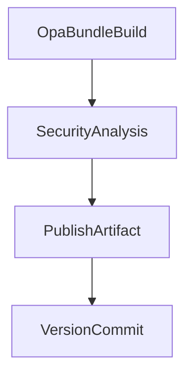

# Build OPA Bundle

Pipeline de CI para validação, teste, versionamento e publicação de bundles OPA (tar.gz).

## 🎯 Descrição

Pipeline que automatiza a validação (`opa fmt`), execução de testes (`opa test`), empacotamento e publicação de bundles OPA. O bundle gerado contém `policies/` e, opcionalmente, `waivers/` e arquivos de `data/`. O versionamento é gerenciado por `VersionManagerVivo` e a publicação pode ocorrer como pipeline artifact e como Universal Package no Azure Artifacts.

- Tecnologia principal: Open Policy Agent (Rego).
- Tipo de entrega: Bundle OPA (tar.gz) com `.manifest` e `version.txt`.
- Link do template do pipeline: `framework/pipelines/ci/build-opa-bundle/pipeline.yaml`
- Pipeline de testes: Não aplicável
- Repositório de exemplo: Não aplicável

- [Pipeline de testes](https://dev.azure.com/telefonica-vivo-brasil/DevOps/_build?definitionId=51379)
- [Repositório teste](https://dev.azure.com/telefonica-vivo-brasil/DevOps/_git/teste-build-opa-bundle)

## 🚀 Quick Start (5 minutos)

1. Crie `.azuredevops/azure-pipeline-ci.yml` na raiz do repositório.
2. Estenda o template do CodePlay:

```yaml
# .azuredevops/azure-pipeline-ci.yml
resources:
  repositories:
    - repository: CodePlay
      name: DevOps/Vivo.CodePlay.Pipelines
      type: git
      ref: refs/heads/master
      endpoint: CodePlay

extends:
  template: /framework/pipelines/ci/build-opa-bundle/pipeline.yaml@CodePlay
  parameters:
    prValidationOnly: false
    buildArtifactName: 'my-artifact-name'
    artifactFeed: 'my-opa-feed'
```

O que acontece com esta configuração:

- ✅ `opa fmt` é executado para formatar as policies.
- ✅ `opa test` é executado (quando `enableTest=true`).
- 📦 É gerado um bundle tar.gz com `policies/` (+ `waivers/` se habilitado) e um arquivo `.manifest`.
- 📤 O bundle é publicado como pipeline artifact com nome definido por `buildArtifactName`.
- 📦 Quando `artifactFeed` estiver configurado, o bundle também é publicado como Universal Package no Azure Artifacts.
- 🏷️ Versionamento é calculado por `VersionManagerVivo` e pode ser commitado/tagado quando `prValidationOnly=false`.

## 🏗️ Matriz de Capacidades

| Capacidade                  | Suporte | Descrição                                      |
|----------------------------|---------|------------------------------------------------|
| [Trunk Based Development](https://dvps.redecorp.azr/portal/codeplay/capacidades/catalog/trunk-based-development) | ✅      | Suportado com estratégia de branches configurável via `VersionManagerVivo@8`    |
| [Build Automatizado](https://dvps.redecorp.azr/portal/codeplay/capacidades/catalog/build-automatizado)        | ✅      | Gera bundle OPA (policies + waivers) dentro do pipeline     |
| [Testes Unitários](https://dvps.redecorp.azr/portal/codeplay/capacidades/catalog/testes-unitarios)       | ✅      | Habilitado por padrão, controlado pelo parâmetro `enableTest`        |
| [SAST](https://dvps.redecorp.azr/portal/codeplay/capacidades/catalog/sast)                        | ✅      | Análise estática de código via Fortify no estágio SecurityAnalysis executado após o build.                       |
| [SCA](https://dvps.redecorp.azr/portal/codeplay/capacidades/catalog/sca)                        | ✅      | Análise de composição de software via template run-sca-scan.yaml no estágio SecurityAnalysis.           |
| [Gates de Segurança](https://dvps.redecorp.azr/portal/codeplay/capacidades/catalog/gates-de-seguranca)          | ✅      | O controle dos gates de segurança (bloqueio ou não do pipeline) é realizado pelo time de AppSec via chaves de configuração recuperadas do AppConfig corporativo (`SKIP_SECURITY_GATE`, `SKIP_SECURITY_GATE_SCA` etc).   |
| [Análise de Código](https://dvps.redecorp.azr/portal/codeplay/capacidades/catalog/analise-de-codigo) | ✅ | SAST via Fortify e SCA via Dependency Track; lint opcional executado dentro de `OpaBundleBuild` quando `enableLint=true` |
| [Gates de Qualidade](https://dvps.redecorp.azr/portal/codeplay/capacidades/catalog/gate-de-qualidade) | ❌ | Não implementado. Pipeline não valida cobertura ou métricas de código |
| [Rollback de Upgrade](https://dvps.redecorp.azr/portal/codeplay/capacidades/catalog/rollback-de-upgrade) | ❎  | Pipeline de CI não faz sentido habilitar essa capacidade |
| [Blue/Green Deployment](https://dvps.redecorp.azr/portal/codeplay/capacidades/catalog/blue-green-deployment) | ❎  | Pipeline de CI não faz sentido habilitar essa capacidade |
| [Canary Release](https://dvps.redecorp.azr/portal/codeplay/capacidades/catalog/canary-release)        | ❎  | Pipeline de CI não faz sentido habilitar essa capacidade |

Legenda: ✅ - Suportado nativamente; ⚠️ - suportado com dependências ou limitações.

## 🔄 Estrutura do Pipeline

O pipeline possui quatro stages principais, com `SecurityAnalysis` dependendo de `OpaBundleBuild` e os stages de publicação/versionamento condicionais a `prValidationOnly`.



### Estágios do Pipeline

1. **OpaBundleBuild**
   - Descrição: Formata (`opa fmt`), executa testes (`opa test`), calcula versão (`VersionManagerVivo`), monta o bundle e publica como pipeline artifact.
   - Ação principal: `VersionManagerVivo@8` (nextVersion), build inline do tar.gz, `PublishPipelineArtifact@1`.
   - Resultado: Artefato publicado com nome `buildArtifactName` e `.manifest` com `name`, `version` e timestamp.

2. **SecurityAnalysis** (depende de `OpaBundleBuild`)
   - Descrição: Obtém flags de AppConfig (`/security/get_appconfig_keys_framework.yml`) e executa SAST (Fortify) e SCA quando habilitado.
   - Ação principal: templates `/security/run_fortify_scan.yml` e `/security/run_sca_scan.yml` (condicionais conforme flags retornadas).
   - Resultado: Artefatos e variáveis exportadas para avaliação de gates.

3. **PublishArtifact** (condicional: `prValidationOnly == false`)
   - Descrição: Baixa o pipeline artifact (`DownloadPipelineArtifact@2`), recalcula versão (`VersionManagerVivo@8`), restaura arquivos (`CopyFiles@2`) e publica via `UniversalPackages@0`.
   - Resultado: Bundle publicado no feed definido por `artifactFeed` com `packageName` = `buildArtifactName` e `packageVersion` = `$(VersionManagerVivo.VERSION)`.

4. **VersionCommit** (condicional: `prValidationOnly == false`)
   - Descrição: Faz checkout com credenciais, reafirma versão e executa `commitVersion` (cria tag e push) via `VersionManagerVivo@8`.
   - Resultado: `version.txt` atualizado, commit e tag no repositório.

## ⚙️ Parâmetros Disponíveis

### Infraestrutura e Ambiente

#### agentPool

- **nome**: agentPool
- **tipo**: string
- **default**: "GeneralPurposeLinuxAgentsCI"
- **descrição**: Define o pool de agentes Azure DevOps que executará todo o pipeline, incluindo build, publicação de artefatos e commit/tag de versão.
- **dependências**: O agente deve possuir as ferramentas necessárias (`opa` CLI se `enableTest=true`, `tar`, `bash`) e permissões para acessar repositório e publicar artefatos.

### Infraestrutura e Rede

#### useNetworkProxy

- **nome**: useNetworkProxy
- **tipo**: boolean
- **default**: false
- **descrição**: Configura proxy de rede (NSKP/Squid) para acesso externo nas tasks e templates de segurança.
- **dependências**: Usado pelos templates de segurança (`get_appconfig_keys_framework.yml`) e por tasks que suportam proxy.

### Controle de Fluxo e Capacidades

#### prValidationOnly

- **nome**: prValidationOnly
- **tipo**: boolean
- **default**: false
- **descrição**: Quando `true`, executa apenas validações (format, lint, tests), sem publicar artefatos, commit/tag de versão ou publicar Universal Packages. `VersionManagerVivo` roda em modo passthrough para calcular versão sem efeitos colaterais.
- **dependências**: Recomendado para execução em Pull Requests.

#### enableLint

- **nome**: enableLint
- **tipo**: boolean
- **default**: true
- **descrição**: Quando `true`, executa um lint padrão baseado em OPA antes do build: `opa fmt` (formatação) e `opa vet` (checagens estáticas) quando disponível.
- **dependências**: Requer `opa` CLI instalado no agente quando `enableLint=true`.

#### enableTest

- **nome**: enableTest
- **tipo**: boolean
- **default**: true
- **descrição**: Executa `opa test` durante o `OpaBundleBuild` quando `true`.
- **dependências**: Requer `opa` CLI instalada no agente.

### Conteúdo do Bundle

#### policiesPath

- **nome**: policiesPath
- **tipo**: string
- **default**: `policies`
- **descrição**: Caminho relativo à raiz do repositório onde estão as policies Rego.
- **dependências**: Diretório deve existir e conter arquivos `.rego`.

#### testsPath

- **nome**: testsPath
- **tipo**: string
- **default**: `tests`
- **descrição**: Caminho relativo à raiz do repositório onde estão localizados os testes unitários das policies OPA executados durante a etapa de validação.
- **dependências**: Necessário se `enableTest=true` e houver testes.

#### waiversPath

- **nome**: waiversPath
- **tipo**: string
- **default**: `waivers`
- **descrição**: Diretório opcional com waivers que podem ser incluídos no bundle.
- **dependências**: Incluído no bundle apenas se `useWaivers=true` e o diretório existir.

#### useWaivers

- **nome**: useWaivers
- **tipo**: boolean
- **default**: true
- **descrição**: Controla se o diretório de waivers será incluído no bundle OPA durante a etapa de empacotamento.
- **dependências**: O diretório definido em `waiversPath` deve existir para que os waivers sejam adicionados ao bundle.

#### bundleAdditionalIncludes

- **nome**: bundleAdditionalIncludes
- **tipo**: object
- **default**: `{'items': []}`
- **descrição**: Lista de arquivos ou diretórios adicionais, relativos à raiz do repositório, que serão incluídos no bundle além do conteúdo de `policiesPath`.
- **dependências**: Cada item informado deve existir no repositório para ser incluído.

#### bundleExcludePatterns

- **nome**: bundleExcludePatterns
- **tipo**: object
- **default**: `{'items': ['README.md', '*_test.rego']}`
- **descrição**: Lista de padrões (glob) utilizados para excluir arquivos da cópia do diretório definido em `policiesPath` durante a geração do bundle.
- **dependências**: Os padrões são aplicados apenas aos arquivos copiados a partir de `policiesPath`.

### Versionamento e Publicação

#### versionFile

- **nome**: versionFile
- **tipo**: string
- **default**: `version.txt`
- **descrição**: Arquivo lido/atualizado pelo `VersionManagerVivo` para controle de versão.
- **dependências**: Repositório deve permitir escrita para commit/tag quando `prValidationOnly=false`.

#### branchingStrategy

- **nome**: branchingStrategy
- **tipo**: string
- **default**: `trunkbased`
- **descrição**: Estratégia de versionamento usada por `VersionManagerVivo`.
- **dependências**: Valores suportados: `trunkbased`, `vivoflow`, `releaseflow`, `gitlabflow`, `gitlabflow-semantic`, `custom`, `monorepo`.

#### enableFortifyExclusions

- **nome**: enableFortifyExclusions
- **tipo**: boolean
- **default**: false
- **descrição**: Quando `true`, faz checkout do repositório `FortifyExclusion` para excluir paths da análise Fortify.
- **dependências**: Repositório de exclusões Fortify deve existir e estar acessível quando habilitado.

#### artifactFeed

- **nome**: artifactFeed
- **tipo**: string
- **default**: `$(DEFAULT_FEED_NAME)`
- **descrição**: Feed Azure Artifacts (Universal Packages) onde o bundle será publicado. Pode ser um feed com escopo de projeto (recomendado) ou um feed de organização.
- **dependências**: O feed deve existir no Azure Artifacts e o pipeline deve possuir permissão de publicação nesse feed.

#### buildArtifactName

- **nome**: buildArtifactName
- **tipo**: string
- **default**: `$(Build.Repository.Name)`
- **descrição**: Nome do pipeline artifact gerado no estágio `OpaBundleBuild` e consumido por `SecurityAnalysis`.
- **dependências**: Usado como `artifactName` nas tasks de publish/download.

#### projectScopedFeed
- **nome**: projectScopedFeed
- **tipo**: boolean
- **default**: `true`
- **descrição**: Quando `true` usa um feed com escopo de projeto (recomendado: `$(System.TeamProject)/<feed-name>`). Quando `false` usa o valor literal de `artifactFeed` (útil para feeds organizacionais compartilhados).
- **dependências**: Requer a configuração do parâmetro `artifactFeed`.

#### workingDirectory

- **nome**: workingDirectory
- **tipo**: string
- **default**: "$(Build.SourcesDirectory)"
- **descrição**: Diretório de trabalho onde arquivos são restaurados antes da publicação.
- **dependências**: Deve existir após o checkout e ser gravável pelo pipeline.

## 🔧 Dependências Externas

### Service Connections Necessárias

#### 1. CodePlay (repositório de templates)

- **Nome padrão**: `CodePlay`
- **Tipo**: Azure Repos Git Service Connection
- **Uso**: Referenciar o template do pipeline no bloco `extends` dos consumidores.
- **Permissões necessárias**:
  - Leitura do repositório `DevOps/Vivo.CodePlay.Pipelines`
  - Acesso ao projeto Azure DevOps onde o pipeline é executado
- **Configurável via**: Não aplicável

#### 2. DevOpsSharedResources

- **Nome padrão**: `DevOpsSharedResources`
- **Tipo**: Azure Resource Manager Service Connection
- **Uso**: Acesso ao Azure Key Vault (`kv-azdevops-shared`) para secrets Nexus e Azure App Configuration.
- **Configurável via**: Não aplicável

### Agent Pool Requirements

#### Pool de Agentes

- **Pool padrão**: `GeneralPurposeLinuxAgentsCI`
- **Sistema Operacional**: Linux
- **Ferramentas obrigatórias**:
  - Go toolchain (ou suporte a `ASDF_GOLANG_VERSION`) — quando aplicável
  - `git`
  - `bash` shell
- **Acesso de rede**:
  - Acesso ao Azure DevOps para checkout, artifacts, commit e tag
  - Acesso ao repositório de origem

### Arquivos Obrigatórios no Repositório

#### 1. `policies/`

- **Localização padrão**: `policies`
- **Configurável via**: parâmetro `policiesPath`
- **Requisitos**:
  - Contém arquivos Rego (`.rego`) válidos
  - Estrutura de pacotes compatível com `opa test`
- **Comportamento**: Diretório copiado para o bundle como `policies/`; necessário para o build, pipeline falha se ausente.

#### 2. `version.txt`

- **Localização padrão**: `version.txt`
- **Configurável via**: parâmetro `versionFile`
- **Requisitos**:
  - Arquivo acessível para leitura e escrita se for usado para persistir versão
- **Comportamento**: Lido pelo `VersionManagerVivo` para determinar/atualizar versão; se ausente, o pipeline usa timestamp como versão e pode criar/atualizar este arquivo quando `prValidationOnly=false`.

#### 3. `tests/`

- **Localização padrão**: `tests`
- **Configurável via**: parâmetro `testsPath`
- **Requisitos**:
  - Contém testes OPA (ex.: arquivos `_test.rego`)
- **Comportamento**: Usado quando `enableTest=true`; execução de `opa test` falhará se houver erros nos testes.

#### 4. `waivers/`

- **Localização padrão**: `waivers`
- **Configurável via**: parâmetro `waiversPath`
- **Requisitos**:
  - Contém arquivos de waiver em formato aceito pela sua política/fluxo
- **Comportamento**: Incluído no bundle quando `useWaivers=true`; caso não exista e `useWaivers=true`, é ignorado sem falhar o pipeline (cópia é condicionada).

Observações:

- Os paths acima são relativos à raiz do repositório e podem ser alterados via parâmetros do template (`policiesPath`, `testsPath`, `waiversPath`, `versionFile`).
- O agente que executa o pipeline precisa ter o `opa` CLI disponível quando `enableTest=true`. O `enableLint` utiliza OPA (`opa fmt` e `opa vet` quando disponível), portanto OPA também é necessário se `enableLint=true`.

### Integrações Externas de Segurança

#### 1. Fortify SAST (ScanCentral + SSC)

- **Descrição**: Análise estática de segurança executada no stage `SecurityAnalysis`, controlada pelo AppSec via Azure App Configuration.
- **Requisitos**:
  - Azure App Configuration configurado com flags AppSec (`USE_FORTIFY`, `USE_CONVISO`, `SKIP_SECURITY_GATE`)
  - Templates de segurança: `/security/get_appconfig_keys_framework.yml`, `/security/define_appsec_app_version.yml`, `/security/run_fortify_scan.yml`
- **Opcional**: `enableFortifyExclusions` para excluir diretórios da análise
- **Observação**: O pipeline remove a pasta `vendor` antes da análise Fortify.

### Permissões de Repositório Git

- **Permissão de escrita** no repositório Git
- **Capacidade de criar tags**
- **Checkout com `persistCredentials: true`** (configurado automaticamente quando executa o stage `VersionCommit`)

### Azure Key Vault

#### kv-azdevops-shared

- **Uso**: Armazena credenciais para autenticação no Nexus (quando `useNexusProxy=true`).
- **Secrets esperados**:
  - `NEXUS-DEPS-USR`: Usuário para autenticação no Nexus
  - `NEXUS-DEPS-PSW`: Senha para autenticação no Nexus
- **Service Connection**: `DevOpsSharedResources`

### Variáveis de Sistema Necessárias

| Variável | Origem | Uso |
|----------|--------|-----|
| `System.TeamProject` | Azure DevOps | Compor variável `SIGLA` |
| `Build.SourcesDirectory` | Azure DevOps | Diretório padrão do projeto |
| `Build.Repository.Name` | Azure DevOps | Nome padrão do binário |
| `Pipeline.Workspace` | Azure DevOps | Cache/diretórios auxiliares |
| `Build.BuildId` | Azure DevOps | Identificação da execução |

### Dependências de Templates Internos

O pipeline utiliza os seguintes templates do CodePlay Framework:

- `/security/get_appconfig_keys_framework.yml` - Obtém configurações AppSec do Azure App Configuration
- `/security/define_appsec_app_version.yml` - Define versão da aplicação para Fortify
- `/security/run_fortify_scan.yml` - Executa análise SAST Fortify ScanCentral

## 🎨 Comportamentos Customizados

O pipeline inclui opções para adaptar execução em PRs (`prValidationOnly`), inclusão de waivers e publicação condicional. Customize parâmetros no `extends` do pipeline.

### Cenário: Validação de Pull Request (sem deploy)

```yaml
extends:
  template: /framework/pipelines/ci/build-opa-bundle/pipeline.yaml@CodePlay
  parameters:
    prValidationOnly: true
    enableTest: true
```


### Cenário: Feed com escopo do projeto (padrão)

```yaml
extends:
  template: /framework/pipelines/ci/build-opa-bundle/pipeline.yaml@CodePlay
  parameters:
    prValidationOnly: false
    # usa projectScopedFeed=true (default) e artifactFeed padrão ($(DEFAULT_FEED_NAME))
    projectScopedFeed: true
    artifactFeed: 'my-project-feed' # opcional: nome do feed no projeto
    buildArtifactName: 'my-opa-bundle-artifact'
```

### Cenário: Feed organizacional / compartilhado

```yaml
extends:
  template: /framework/pipelines/ci/build-opa-bundle/pipeline.yaml@CodePlay
  parameters:
    prValidationOnly: false
    projectScopedFeed: false
    artifactFeed: 'OrgSharedFeedName' # nome do feed organizacional
    buildArtifactName: 'my-opa-bundle-artifact'
```

## 🔖 Variáveis de Ambiente

| Variável | Descrição |
|---|---|
| `SIGLA` | Derivada de `System.TeamProject` (lowercase primeira palavra) |
| `DEFAULT_FEED_NAME` | Nome padrão do feed Azure Artifacts derivado de `System.TeamProject` |
| `BUNDLE_NAME` | Valor de `buildArtifactName` (usado para nomear o tar.gz) |
| `CACORP_LOCATION` | Local do certificado corporativo no agente |
| `FORTIFY_APP_DEFAULT_VERSION` | Versão padrão utilizada por Fortify |
| `APP_LANGUAGE` | Linguagem da aplicação para AppSec (aqui: `other`) |
| `AKV_DEVOPS_NAME` | Nome do Key Vault usado para segredos (`kv-azdevops-shared`) |
| `PROXY_NSKP_SERVER` | Endereço NSKP usado para proxy (ex: nskp.redecorp.br:8080) |
| `PROXY_SQUID_SERVER` | Endereço Squid usado para proxy (ex: 10.240.58.39:3128) |
| `PROXY_AGENT_HTTP` | URL HTTP do proxy configurado para agentes (ex: http://$(PROXY_NSKP_SERVER)) |
| `PROXY_AGENT_HTTPS` | URL HTTPS do proxy configurado para agentes (ex: http://$(PROXY_NSKP_SERVER)) |
| `PROXY_AGENT_NO_PROXY` | Lista de hosts/hosts CIDR que devem ignorar o proxy |
| `VersionManagerVivo.VERSION` | Versão calculada/definida pelo `VersionManagerVivo@8` (exposta após a task `nextVersion`) |

## 🚑 Troubleshooting

- `opa test` com parse error: execute `opa test ./policies ./tests -v` localmente para identificar o arquivo e a linha.
- `rego_unsafe_var_error`: revisar regras Rego para variáveis não ligadas.
- Falha ao publicar Universal Package: confirme `artifactFeed`, permissões e disponibilidade da task `UniversalPackages@0`.

## ❓ FAQ

### Onde posso encontrar mais informações sobre o CodePlay Framework?

Você pode encontrar mais informações sobre o CodePlay Framework na [documentação oficial](https://dvps.redecorp.azr/portal/codeplay/framework/).

### Onde encontro as capacidades disponíveis?

As capacidades disponíveis podem ser encontradas no [Catálogo de Capacidade](https://dvps.redecorp.azr/portal/catalog/capabilities) no Portal CodePlay.

### Como faço para customizar o pipeline?

Siga o guia de [Adoção ao CodePlay](https://dvps.redecorp.azr/portal/codeplay/roteiro/codeplay#fluxo-de-ado%C3%A7%C3%A3o-ao-codeplay).

### Quais casos de uso relevantes?

- [Pipeline de Validação de PR](https://dvps.redecorp.azr/portal/code/casos-de-uso/pipeline-validacao-pr)
- Veja o [Catálogo de Casos de Uso](https://dvps.redecorp.azr/portal/catalog/casos-de-uso) para outros exemplos de casos de uso.

### Quais Erros Comuns relevantes?

- Ainda não temos nenhum erro comum documentado para este pipeline.
- Veja o [Catálogo de Erros Conhecidos](https://dvps.redecorp.azr/portal/catalog/erros-conhecidos) para outros exemplos de erros.

## 🆘 Suporte

- [Abra um chamado para Dev Support](https://dvps.redecorp.azr/portal/codeplay/roteiro/#:~:text=Abra%20um%20chamado%20para%20Dev%20Support)
- [Canal DevEx - Azure DevOps](https://teams.microsoft.com/l/channel/19%3A8fbd00946cf044d7a844182ac71e6aa1%40thread.tacv2/Azure%20DevOps?groupId=038b4415-d6dd-42ce-92e5-31a8e2a13bf8&tenantId=9744600e-3e04-492e-baa1-25ec245c6f10)

## 📝 Decisões Tomadas

### Decisão 1: Pipeline dedicado para geração do OPA bundle (artefato de políticas)

- **Data**: 2026-07-24
- **Motivador**: Este pipeline foi criado especificamente para validar, versionar e publicar bundles OPA que serão consumidos por tasks de compliance/validação (ex.: `VivoDevOpsConfigCompliance@1`). Centralizar a geração do bundle garante versões imutáveis, rastreabilidade e consistência entre consumidores.
- **Descrição**: Sempre que houver políticas corporativas ou bundles OPA compartilhados, a geração e publicação desse bundle deverá ocorrer por pipelines dedicados como este, em vez de deixá-la dispersa em pipelines de aplicação. A task de compliance consome o bundle publicado por este pipeline.
