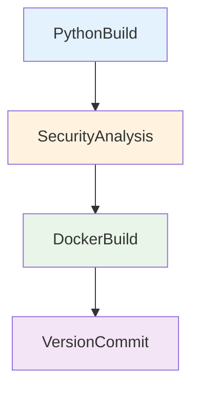

# CI Build Python Docker

## 🎯 Descrição

Pipeline de CI para bibliotecas/projetos Python que realiza build, execução de testes com Pytest, coleta de cobertura de código e, quando configurado, construção e publicação de imagem Docker.

Tecnologia principal: Python (Poetry ou UV). Tipo de artefato: Python e imagem Docker.

- [Repositório de exemplo](https://dev.azure.com/telefonica-vivo-brasil/DevOps/_git/teste-build-python-docker)
- [Pipeline de exemplo](https://dev.azure.com/telefonica-vivo-brasil/DevOps/_build?definitionId=44928)

Veja também o [caso de uso no portal CodePlay](https://dvps.redecorp.azr/portal/code/casos-de-uso/libs-internas-python) para mais detalhes sobre configuração de feeds e autenticação com Poetry.

## 🚀 Quick Start (5 minutos)

```yaml
# .azuredevops/azure-pipeline-ci.yml
resources:
  repositories:
    - repository: CodePlay
      name: DevOps/Vivo.CodePlay.Pipelines
      type: git
      ref: refs/heads/master

extends:
  template: /framework/pipelines/ci/build-python-docker/pipeline.yaml@CodePlay
```

**Pré-requisitos mínimos:**

- Projeto Python com `pyproject.toml` na raiz
- `Dockerfile` na raiz do repositório
- Service Connection `ACR-DEVOPS` configurada
- Service Connection `VIVO_SONARQUBE` configurada

**Principais diferenças:**

| Aspecto | Poetry | UV |
|---------|--------|-----|
| Performance | Boa | Excelente (10-100x mais rápido) |
| Maturidade | Amplamente adotado | Mais recente, em rápida evolução |
| Compatibilidade | `pyproject.toml` padrão | `pyproject.toml` compatível |
| Autenticação Azure Artifacts | Via `POETRY_HTTP_BASIC_*` | Via `UV_INDEX_URL` |

**Quando usar UV:**
- Pipelines com muitas dependências que precisam de builds mais rápidos
- Projetos novos que querem adotar tecnologia de ponta
- Quando a velocidade de instalação de dependências é crítica

**Quando usar Poetry:**
- Projetos existentes já configurados com Poetry
- Quando necessita de recursos específicos do Poetry
- Ambiente de produção estável com ferramentas maduras

### 🚀 Próximos Passos Continuous Deployment (CD)

Após o build e publicação da imagem Docker no Azure Container Registry, o próximo passo é realizar o deployment da aplicação Python nos ambientes desejados. O CodePlay Framework oferece múltiplas opções de CD dependendo da sua infraestrutura:

### Pipelines de CD Disponíveis

#### [deploy-helm](../../cd/deploy-helm/README.md) - Deploy via Kubernetes/Helm

**Quando usar:** Para aplicações Python (APIs Flask/FastAPI, microserviços, web apps Django) em clusters Kubernetes (AKS, OpenShift ou genéricos).

**Principais recursos:**
- ☸️ Deploy automatizado via Helm Charts
- 🎯 Suporte a múltiplos ambientes e clusters
- 🔄 Rollback automático em falha
- 📊 Comparação visual de mudanças (kubectl diff)
- 🔵 Blue/Green Deployment via Argo Rollouts
- 🔒 Aprovações via Azure DevOps Environments

**Exemplo de uso:**
```yaml
# .azuredevops/azure-pipeline-cd.yml
trigger: none

parameters:
- name: version
  displayName: 'Versão da aplicação'
  type: string
  default: getLatestVersion()
- name: environment
  displayName: 'Versão da aplicação'
  type: string
  default: 'dev'
  values:
    - dev
    - prod
resources:
  repositories:
    - repository: CodePlay
      name: DevOps/Vivo.CodePlay.Pipelines
      type: git
      ref: refs/heads/master

extends:
  template: /framework/pipelines/cd/deploy-helm/pipeline.yaml@CodePlay
  parameters:
    environment: dev
    version: getLatestVersion()
    helmChartName: generic-microservice
    helmChartVersion: 1.0.26
```

**Saiba mais:** Consulte a documentação completa de cada pipeline de CD para configuração detalhada e parâmetros avançados.

**Saiba mais:** Consulte a [documentação completa da integração CI/CD ](https://dvps.redecorp.azr/portal/code/casos-de-uso/integrando-cicd#%EF%B8%8F-estrutura-da-integra%C3%A7%C3%A3o) para configuração detalhada e parâmetros avançados.

## Matriz de Capacidades

| Capacidade                  | Suporte | Descrição                                      |
|----------------------------|---------|------------------------------------------------|
| [Trunk Based Development](https://dvps.redecorp.azr/portal/codeplay/capacidades/catalog/trunk-based-development) | ✅      | Pipeline de CI projetado para execução em branch principal/repositório.     |
| [Build Automatizado](https://dvps.redecorp.azr/portal/codeplay/capacidades/catalog/build-automatizado)        | ✅      | Build automatizado e empacotamento via Poetry e template Docker.     |
| [Testes Unitários](https://dvps.redecorp.azr/portal/codeplay/capacidades/catalog/testes-unitarios)          | ✅      | Executa Pytest e publica resultados JUnit - parâmetro ``runUnitTest``.        |
| [SAST](https://dvps.redecorp.azr/portal/codeplay/capacidades/catalog/sast)                      | ✅      | Análise estática de código com Fortify ScanCentral e SSC, integração com Conviso para gestão de vulnerabilidades. Sempre habilitado. Exclusões customizadas via `enableFortifyExclusions=true`.                       |
| [SCA](https://dvps.redecorp.azr/portal/codeplay/capacidades/catalog/sca) | ✅ | Análise de composição de software com Dependency Track, detecção de vulnerabilidades em dependências. **A execução e o controle do SCA são realizados pelo time de AppSec.**    |
| [Gates de Segurança](https://dvps.redecorp.azr/portal/codeplay/capacidades/catalog/gates-de-seguranca)          | ✅      | Controlados pela equipe de AppSec   |
| [Análise de Código](https://dvps.redecorp.azr/portal/codeplay/capacidades/catalog/analise-de-codigo)         | ✅      | SonarQube integrado com análise completa de qualidade.   |
| [Gates de Qualidade](https://dvps.redecorp.azr/portal/codeplay/capacidades/catalog/gate-de-qualidade)        | ✅      | Quality Gate do SonarQube configurado e funcional.    |
| [Rollback de Upgrade](https://dvps.redecorp.azr/portal/codeplay/capacidades/catalog/rollback-de-upgrade)       | ❎  | Pipeline de CI (não aplicável para rollback de deploy). |
| [Blue/Green Deployment](https://dvps.redecorp.azr/portal/codeplay/capacidades/catalog/blue-green-deployment)     | ❎  | Pipeline de CI (não aplicável). |
| [Canary Release](https://dvps.redecorp.azr/portal/codeplay/capacidades/catalog/canary-release)            | ❎  | Pipeline de CI (não aplicável).        |


## 🔄 Estrutura do Pipeline

O pipeline é organizado em estágios sequenciais. O fluxo principal é:



**Descrição dos Estágios:**

- **PythonBuild**: Instala ferramentas (pip, Poetry), instala dependências do projeto, executa testes com Pytest e publica resultados (JUnit e cobertura). Executa SonarQube se habilitado. Publica artefatos da aplicação (código-fonte validado) para uso no estágio DockerBuild.
- **SecurityAnalysis**: Executa análise de segurança estática (SAST) com Fortify ScanCentral. Gates de segurança são controlados pelo AppSec via Azure App Configuration.
- **DockerBuild**: Baixa artefatos da aplicação, constrói imagem Docker e publica no Azure Container Registry. Executa análise SCA (Dependency Track) se habilitado pelo AppSec.
- **VersionCommit**: Estágio condicional executado quando `prValidationOnly` é falso. Atualiza versão no pyproject.toml, cria commit e tag Git.

## ⚙️ Parâmetros Disponíveis

Os parâmetros estão agrupados conforme aparente no pipeline:

### Parâmetros de Controle de Fluxo e Capacidades

#### runUnitTest

- **nome**: `runUnitTest`
- **tipo**: boolean
- **default**: `true`
- **opções**: `true`, `false`
- **descrição**: Controla se os testes unitários serão executados durante o build. Quando habilitado, executa pytest com cobertura de código.
- **dependências**: Requer pytest e pytest-cov instalados no projeto.

#### runQualityGate

- **nome**: `runQualityGate`
- **tipo**: boolean
- **default**: `true`
- **opções**: `true`, `false`
- **descrição**: Controla se a análise de qualidade com SonarQube será executada. Inclui análise estática e verificação de quality gate.
- **dependências**: Requer service connection do SonarQube configurada e projeto registrado no SonarQube.

#### prValidationOnly

- **nome**: `prValidationOnly`
- **tipo**: boolean
- **default**: `false`
- **opções**: `true`, `false`
- **descrição**: Se verdadeiro, o pipeline executa apenas validações (não constrói/publica imagem Docker e não comita versão). Controla execução dos stages `DockerBuild` e `VersionCommit`.
- **dependências**: Nenhuma adicional; usado para controlar fluxo do pipeline em Pull Requests.

### Parâmetros para Infraestrutura e Execução

#### agentPool

- **nome**: `agentPool`
- **tipo**: string
- **default**: `GeneralPurposeLinuxAgentsCI`
- **opções**: `Qualquer pool registrado no Azure DevOps`
- **descrição**: Pool onde os jobs serão executados. Deve apontar para um pool Linux com ferramentas necessárias.
- **dependências**: Agent Pool configurado com Python e ferramentas mínimas.

#### useNetworkProxy

- **nome**: useNetworkProxy
- **tipo**: boolean
- **default**: false
- **descrição**: Configurar proxy de rede para acesso externo. Deve ser `true` para pipelines executados em pools de agentes on-premises como "VivoOnPremDevAgents", "VivoOnPremHmlAgents" e "VivoOnPremPrdAgents".
- **dependências**: Nenhuma.

### Parâmetros para Configurações de Python / Projeto

#### packageManager

- **nome**: `packageManager`
- **tipo**: string
- **default**: `poetry`
- **opções**: `poetry`, `uv`
- **descrição**: Define qual gerenciador de pacotes Python será utilizado para instalar dependências, executar testes e construir o projeto. Poetry é o padrão e mais amplamente adotado. UV é uma alternativa mais rápida escrita em Rust.
- **dependências**: Projeto deve ter `pyproject.toml` configurado de forma compatível com o gerenciador escolhido.
- **exemplo de uso**:
```yaml
extends:
  template: /framework/pipelines/ci/build-python-docker/pipeline.yaml@CodePlay
  parameters:
    packageManager: 'uv'  # Usa UV ao invés de Poetry
```

#### workingDirectory

- **nome**: `workingDirectory`
- **tipo**: string
- **default**: `$(Build.SourcesDirectory)`
- **opções**: Caminho relativo no repositório onde está o projeto Python
- **descrição**: Diretório do projeto usado para executar comandos (instalação, testes, relatórios). Normalmente raiz do repositório ou subpasta contendo `pyproject.toml`.
- **dependências**: `pyproject.toml` presente neste diretório para que o template de versionamento e o Poetry funcionem.

#### coverageSource

- **nome**: `coverageSource`
- **tipo**: string
- **default**: `src`
- **opções**: Path para diretório fonte a ser incluído na cobertura (ex.: `src`)
- **descrição**: Diretório usado pelo pytest/coverage para calcular cobertura.
- **dependências**: Estrutura de código compatível com pytest.
- **observação**: Se mal configurado, pode resultar em coberturas adulteradas.

#### testSetupScript

- **nome**: `testSetupScript`
- **tipo**: string
- **default**: `''` (vazio)
- **opções**: Caminho relativo ao workingDirectory (ex.: `src/helper/dev_start.sh`)
- **descrição**: Script shell opcional executado antes dos testes unitários. Útil para configurar PYTHONPATH, variáveis de ambiente ou outras preparações necessárias para execução dos testes.
- **dependências**: Arquivo deve existir no repositório.
- **exemplo de uso**:
```yaml
extends:
  template: /framework/pipelines/ci/build-python-docker/pipeline.yaml@CodePlay
  parameters:
    testSetupScript: 'src/helper/dev_start.sh'
```

#### publishAllureReport

- **nome**: `publishAllureReport`
- **tipo**: boolean
- **default**: `false`
- **descrição**: Habilita a geração e publicação do relatório Allure. Quando `true`, o pipeline adiciona automaticamente a flag `--alluredir=<testAllureResultsDir>` à execução do pytest (Poetry ou UV) e publica o relatório. Requer apenas que o projeto tenha o plugin `allure-pytest` declarado nas dependências (`pyproject.toml`).
- **dependências**: Extensão Allure instalada na organização Azure DevOps (task `PublishAllureReport@2`). Dependência `allure-pytest` configurada no projeto.
- **exemplo de uso**:
```yaml
extends:
  template: /framework/pipelines/ci/build-python-docker/pipeline.yaml@CodePlay
  parameters:
    publishAllureReport: true
    testAllureResultsDir: '$(Pipeline.Workspace)/allure-results'
```

#### testAllureResultsDir

- **nome**: `testAllureResultsDir`
- **tipo**: string
- **default**: `$(Pipeline.Workspace)/allure-results`
- **descrição**: Diretório onde os resultados do Allure são gerados (via `--alluredir`) durante os testes e de onde são lidos para publicação. O diretório é criado automaticamente pelo pipeline. Evite usar `$(Build.SourcesDirectory)` para prevenir conflitos com o código-fonte.
- **dependências**: `publishAllureReport` deve ser `true` para que este parâmetro tenha efeito.


### Parâmetros para Configurações de Docker / Imagem

#### imageName

- **nome**: `imageName`
- **tipo**: string
- **default**: `'$(SIGLA)/$(Build.Repository.Name)'`
- **opções**: Qualquer nome válido de imagem/container registry (ex: `sigla/my-repo`)
- **descrição**: Nome da imagem Docker a ser construída e possivelmente publicada.
- **dependências**: `docker-build-and-push.yaml` template e `registryServiceConnection` configurados.

#### dockerfilePath

- **nome**: `dockerfilePath`
- **tipo**: string
- **default**: `Dockerfile`
- **descrição**: Caminho para o Dockerfile relativo ao `workingDirectory`.
- **dependências**: Arquivo Dockerfile presente no repositório.

#### registryServiceConnection

- **nome**: `registryServiceConnection`
- **tipo**: string
- **default**: `ACR-DEVOPS`
- **descrição**: Service Connection para o registro (Azure Container Registry ou outro) usado pelo template de build/push.
- **dependências**: Service Connection configurada no projeto Azure DevOps.

### Parâmetros para Versionamento e Controle de Fluxo

#### versionFile

- **nome**: `versionFile`
- **tipo**: string
- **default**: `pyproject.toml`
- **descrição**: Arquivo usado pelo template `define-version-toml.yaml` para extrair/definir versão.
- **dependências**: Presença do arquivo `pyproject.toml` com versão configurada.

#### branchingStrategy

- **nome**: `branchingStrategy`
- **tipo**: string
- **default**: `trunkbased`
- **opções**: [`trunkbased`, `vivoflow`, `releaseflow`, `gitlabflow`, `gitlabflow-semantic`, `custom`, `monorepo`]
- **descrição**: Estratégia de branching e versionamento utilizada pelo projeto. Define como o VersionManager irá calcular e gerenciar as versões.
- **dependências**: Nenhuma dependência adicional necessária.

### Parâmetros de Configurações do SonarQube

#### useSonarConfigFile

- **nome**: `useSonarConfigFile`
- **tipo**: boolean
- **default**: `true`
- **opções**: `true`, `false`
- **descrição**: Define se o SonarQube deve usar um arquivo de configuração específico ou configuração via parâmetros.
- **dependências**: Se true, o arquivo especificado em `sonarConfigFilePath` deve existir.

#### sonarConfigFilePath

- **nome**: `sonarConfigFilePath`
- **tipo**: string
- **default**: `".azuredevops/sonar-project.properties"`
- **opções**: N/A
- **descrição**: Caminho para o arquivo de configuração do SonarQube quando `useSonarConfigFile` é true.
- **dependências**: Arquivo deve existir no repositório se `useSonarConfigFile` for true.

#### sonarPollingTimeoutSec

- **nome**: `sonarPollingTimeoutSec`
- **tipo**: string
- **default**: `"300"`
- **opções**: N/A
- **descrição**: Timeout em segundos para aguardar o resultado do quality gate do SonarQube.
- **dependências**: Valor deve ser numérico representado como string.

#### sonarJavaVersion

- **nome**: `sonarJavaVersion`
- **tipo**: string
- **default**: `"openjdk-17.0.2"`
- **opções**: `"openjdk-21.0.2"`, `"openjdk-17.0.2"`, `"openjdk-11.0.2"`
- **descrição**: Versão do Java a ser usada pelo scanner do SonarQube.
- **dependências**: A versão especificada deve estar disponível no agente de build.

#### sonarServiceConnection

> ⚠️ **DEPRECIADO**: Este parâmetro será removido em breve. A escolha da instância SonarQube passará a ser automática via custom task e `vip.json`.

- **nome**: `sonarServiceConnection`
- **tipo**: string
- **default**: `"VIVO_SONARQUBE"`
- **opções**: N/A
- **descrição**: **(DEPRECATED)** Nome da service connection do SonarQube configurada no Azure DevOps. Mantido temporariamente para retrocompatibilidade.
- **dependências**: Service connection deve existir e ter permissões adequadas.

#### sonarQualityGate

- **nome**: `sonarQualityGate`
- **tipo**: string
- **default**: `"AzureDevOps-Default"`
- **opções**: N/A
- **descrição**: Nome do quality gate configurado no SonarQube para validação.
- **dependências**: Quality gate deve existir no projeto SonarQube.

#### sonarScannerMode

- **nome**: `sonarScannerMode`
- **tipo**: string
- **default**: `"cli"`
- **opções**: `"cli"`, `"dotnet"`
- **descrição**: Modo de execução do scanner SonarQube. Para projetos Python, recomenda-se usar 'cli' que oferece melhor compatibilidade.
- **dependências**: Para projetos Python, recomenda-se usar 'cli'.

#### sonarProjectKey

- **nome**: `sonarProjectKey`
- **tipo**: string
- **default**: `"$(System.TeamProject)-$(Build.Repository.Name)"`
- **opções**: N/A
- **descrição**: Chave única do projeto no SonarQube, formada pela combinação do nome do projeto e do repositório no Azure DevOps.
- **dependências**: Projeto deve ser registrado no SonarQube com esta chave.

#### sonarProjectName

- **nome**: `sonarProjectName`
- **tipo**: string
- **default**: `"$(System.TeamProject)-$(Build.Repository.Name)"`
- **opções**: N/A
- **descrição**: Nome do projeto no SonarQube usado para identificação e visualização na interface do SonarQube.
- **dependências**: Projeto deve existir no SonarQube.

#### useAppConfig

- **nome**: `useAppConfig`
- **tipo**: boolean
- **default**: `true`
- **opções**: `true`, `false`
- **descrição**: Define se deve usar Azure App Configuration para obter configurações do SonarQube.
- **dependências**: Requer acesso ao Azure App Configuration especificado.

### Parâmetros de Configurações de Segurança

#### enableFortifyExclusions

- **nome**: `enableFortifyExclusions`
- **tipo**: boolean
- **default**: `false`
- **descrição**: Controla se deve fazer checkout do repositório de exclusões Fortify antes da análise SAST. Quando habilitado, permite aplicar regras customizadas de exclusão específicas do projeto. O template `run_fortify_scan.yml` gerencia automaticamente o checkout do repositório `FortifyExclusion` quando este parâmetro é true.
- **dependências**: Nenhuma adicional; gerenciado automaticamente pelo template de segurança.

## 🔧 Dependências Externas

### Service Connections Obrigatórias

| Nome da Connection | Tipo | Descrição | Como Configurar |
|-------------------|------|-----------|-----------------|
| `ACR-DEVOPS` | Azure Resource Manager / ACR | Service Connection usado para publicar imagens Docker via template `docker-build-and-push.yaml` | Configurar ACR Service Connection no projeto Azure DevOps com permissões de push/pull |
| `VIVO_SONARQUBE` | SonarQube | Conexão com o servidor SonarQube para análise de qualidade de código. | Deve ser configurada no nível do projeto/organização para apontar para o servidor SonarQube corporativo. |
| `DevOpsSharedResources` | Azure Resource Manager | Conexão com a subscription Azure para acessar o App Configuration. | Service connection deve ter permissões para ler o Azure App Configuration especificado. |

### Recursos de Build Agent

- **GeneralPurposeLinuxAgentsCI**: Recomendado. Deve conter Python 3.x, pip, Poetry e Docker (para construção de imagens).
- **Permissões necessárias**: acesso para `System.AccessToken` (token do pipeline) para autenticação com Azure Artifacts durante instalação de dependências via Poetry.


## 🎨 Comportamentos Customizados

:::danger
**⚠️ ATENÇÃO: CUSTOMIZAÇÕES REQUEREM RESPONSABILIDADE ⚠️**

- ✅ **Use os exemplos como ponto de partida** - Eles demonstram padrões seguros e testados
- 🧠 **"Todos somos adultos"** - Confiamos na sua expertise, mas exigimos consciência do impacto
- 📝 **Tudo fica registrado** - Seu histórico de commits é auditável e rastreável
- 🎯 **Entenda antes de modificar** - Customizações incorretas podem quebrar builds em produção
- 🤝 **Documente suas decisões** - Facilite a manutenção futura por outros membros da equipe

**Customizar é permitido. Fazer sem entender não é.**
:::

### Desabilitar publicação de imagem em PRs

Para validar PRs sem publicar imagens:

```yaml
extends:
  template: /framework/pipelines/ci/build-python-docker/pipeline.yaml@CodePlay
  parameters:
    prValidationOnly: true
```

### Customizar nome da imagem Docker

```yaml
extends:
  template: /framework/pipelines/ci/build-python-docker/pipeline.yaml@CodePlay
  parameters:
    imageName: 'meu-projeto/minha-app'
    dockerfilePath: 'docker/Dockerfile'
```

### Desabilitar análise de qualidade (SonarQube)

Para ambientes de desenvolvimento ou testes rápidos:

```yaml
extends:
  template: /framework/pipelines/ci/build-python-docker/pipeline.yaml@CodePlay
  parameters:
    runQualityGate: false
```

**Nota:** Análises de segurança (SAST/SCA) são controladas pelo AppSec via Azure App Configuration e não podem ser desabilitadas via parâmetros.

### Ajustar diretório de cobertura

Para projetos com estrutura customizada:

```yaml
extends:
  template: /framework/pipelines/ci/build-python-docker/pipeline.yaml@CodePlay
  parameters:
    coverageSource: 'app'  # ou 'src' ou outro diretório
    workingDirectory: $(Build.SourcesDirectory)/backend
```

### Publicar relatório Allure

Para projetos que utilizam `allure-pytest` para gerar relatórios de testes detalhados:

```yaml
extends:
  template: /framework/pipelines/ci/build-python-docker/pipeline.yaml@CodePlay
  parameters:
    publishAllureReport: true
    testAllureResultsDir: '$(Pipeline.Workspace)/allure-results'
```

**Pré-requisitos:**
- Dependência `allure-pytest` no projeto (em `pyproject.toml`)
- Configuração do pytest para gerar resultados Allure (ex: `--alluredir=$(Pipeline.Workspace)/allure-results`)
- Extensão Allure instalada na organização Azure DevOps

### 🐍 Escolha do Gerenciador de Pacotes (Poetry ou UV)

Por padrão, o pipeline utiliza **Poetry** como gerenciador de pacotes Python. Você pode optar por usar [**UV**](https://github.com/astral-sh/uv) - um gerenciador de pacotes Python extremamente rápido escrito em Rust - através do parâmetro `packageManager`.

```yaml
# .azuredevops/azure-pipeline-ci.yml - Usando UV
extends:
  template: /framework/pipelines/ci/build-python-docker/pipeline.yaml@CodePlay
  parameters:
    packageManager: 'uv'  # Opções: 'poetry' (padrão) ou 'uv'
```

## 🔧 Variáveis de Ambiente

As seguintes variáveis são utilizadas internamente no pipeline:

| Variável | Descrição | Valor Padrão |
|----------|-----------|--------------|
| `SIGLA` | Sigla do projeto extraída de `System.TeamProject` em lowercase | Calculada via `lower(split(variables['System.TeamProject'],' ')[0])` |
| `DEFAULT_FEED_NAME` | Nome do feed em uppercase derivado de `SIGLA` | Calculada via `upper(variables['SIGLA'])` |
| `CACORP_LOCATION` | Caminho para o certificado CA corporativo usado em conexões seguras | `$(Agent.HomeDirectory)/../../certs/CACORP.pem` |
| `FORTIFY_APP_DEFAULT_VERSION` | Versão padrão da aplicação para análise Fortify quando não especificada | `DevSecOps` |
| `APP_LANGUAGE` | Linguagem da aplicação para análise de segurança | `other` |
| `DOCKER_SERVICE_CONNECTION` | Service connection do Docker/ACR (derivada do parâmetro) | `${{ parameters.registryServiceConnection }}` |
| `AKV_DEVOPS_NAME` | Nome do Azure Key Vault para configurações de segurança | `kv-azdevops-shared` |
| `UV_CACHE_DIR` | Diretório de cache do UV | `$(Agent.TempDirectory)/uv` |
| `UV_PROJECT_ENVIRONMENT` | Localização do ambiente virtual gerenciado pelo UV | `.venv` |
| `PROXY_NSKP_SERVER` | Servidor proxy NSKP (proxy principal para acesso externo) | `nskp.redecorp.br:8080` |
| `PROXY_SQUID_SERVER` | Servidor proxy Squid (referência legada, mantido para compatibilidade) | `10.240.58.39:3128` |
| `PROXY_AGENT_HTTP` | Configuração de proxy HTTP para o agente | `http://$(PROXY_NSKP_SERVER)` |
| `PROXY_AGENT_HTTPS` | Configuração de proxy HTTPS para o agente | `http://$(PROXY_NSKP_SERVER)` |
| `PROXY_AGENT_NO_PROXY` | Lista de hosts que não devem usar proxy | `localhost,0.0.0.0,127.0.0.1,10.244.0.0/16,192.168.0.0/16,10.129.178.173,nexus.telefonica.com.br,acrsharedservices01.azurecr.io,appcs-azdevops-shared.azconfig.io,scm.azurewebsites.net` |
| `AZDO_FEED_PASSWORD` | Variável usada para popular `POETRY_HTTP_BASIC_<FEED>_PASSWORD` durante instalação do Poetry | Valor definido como `$(System.AccessToken)` no bloco `env` do step |
| `POETRY_HTTP_BASIC_<FEED>_USERNAME` | Nome de usuário fixo (`AzureDevOps`) para autenticação Poetry no feed | Definido dinamicamente no script de instalação |
| `POETRY_HTTP_BASIC_<FEED>_PASSWORD` | Senha para acesso ao feed (setada a partir de `AZDO_FEED_PASSWORD`) | Setada no step de instalação via `export` |
| `POETRY_CACHE_DIR` | Diretório de cache do Poetry (pacotes baixados). Usa o diretório temporário oficial do Azure DevOps (`Agent.TempDirectory`), evitando uso de `~/` ou `/tmp` do SO | `$(Agent.TempDirectory)/poetry` |
| `TMPDIR` | Sobrescreve o diretório temporário do SO usado pelo Python internamente (ex: `tempfile.mkdtemp()`). Impede que o Poetry use `/tmp` do sistema operacional durante operações intermediárias | `$(Agent.TempDirectory)` |

**Nota:** Variáveis relacionadas a autenticação com Poetry dependem do feed configurado e do uso do `System.AccessToken` com permissão de leitura no feed. Leia o caso de uso disponível no [portal](https://dvps.redecorp.azr/portal/code/casos-de-uso/libs-internas-python) para mais detalhes.


## ❓ FAQ

### P: Como configurar autenticação com feeds privados do Azure Artifacts?

**R:** O pipeline usa `System.AccessToken` automaticamente. Certifique-se de:
1. Habilitar "Allow scripts to access the OAuth token" nas configurações do pipeline
2. Conceder permissão "Reader" ao Build Service no feed
3. Configurar o feed no `pyproject.toml` com o formato correto

Veja mais detalhes no [caso de uso do portal](https://dvps.redecorp.azr/portal/code/casos-de-uso/libs-internas-python).

### P: Por que meu Dockerfile não está sendo encontrado?

**R:** Verifique:
1. O parâmetro `dockerfilePath` está correto (padrão: `Dockerfile` na raiz)
2. O arquivo está commitado no repositório
3. O `workingDirectory` está configurado corretamente

### P: Como desabilitar o commit automático de versão?

**R:** Use `prValidationOnly: true` para pular o estágio de commit:

```yaml
parameters:
  prValidationOnly: true
```

O pipeline ainda executará build, testes e análises de qualidade.

### P: Como configurar o SonarQube com arquivo customizado?

**R:** Crie o arquivo `.azuredevops/sonar-project.properties` e configure:

```yaml
parameters:
  useSonarConfigFile: true
  sonarConfigFilePath: '.azuredevops/sonar-project.properties'
```

### P: O que fazer se os testes falharem mas eu quiser continuar?

**R:** O pipeline é projetado para falhar em caso de testes com falhas (fail-fast). Para desenvolvimento/debug, considere:
1. Desabilitar temporariamente: `runUnitTest: false`
2. Corrigir os testes localmente antes do push
3. Usar `prValidationOnly: true` para validar sem publicar artefatos

### P: Como usar exclusões customizadas do Fortify?

**R:** Habilite o checkout do repositório de exclusões:

```yaml
parameters:
  enableFortifyExclusions: true
```

## 📞 Suporte

### Canais de Suporte

- **Portal CodePlay**: [https://dvps.redecorp.azr/portal/codeplay](https://dvps.redecorp.azr/portal/codeplay)
- **Equipe DevOps**: Entre em contato via Teams ou ServiceNow
- **Documentação**: Consulte o [repositório de exemplos](https://dev.azure.com/telefonica-vivo-brasil/DevOps/_git/teste-build-python-docker)

### Reportar Problemas

1. Verifique a seção de **Solução de Problemas** acima
2. Consulte o **FAQ**
3. Se o problema persistir, abra uma issue no repositório do CodePlay com:
   - Link para o pipeline com falha
   - Logs relevantes
   - Configuração de parâmetros utilizada

## 📚 Decisões Tomadas

### Decisão 1: Uso de Poetry

- **Data**: 30/09/2025
- **Motivador**: Controle de versões, versionamento e outras facilitações para projetos Python modernos.
- **Descrição**: Adoção do Poetry como ferramenta padrão para gerenciamento de dependências e build de pacotes Python.
- **Impacto**: Simplifica o gerenciamento de dependências e build, mas requer familiaridade com Poetry. Porem adiciona uma dependência externa.
- **Notas**: Olhar proxima decisão.

### Decisão 2: Autenticação via variáveis de ambiente

- **Data**: 30/09/2025
- **Motivador**: Necessidade de autenticação segura ao baixar pacotes do feed do azure artifacts.
- **Descrição**: Uso de variáveis de ambiente para passar credenciais ao Poetry durante instalação.
- **Impacto**: Melhora segurança e flexibilidade, mas requer configuração correta do token.
- **Notas**: Veja o [repositório de exemplo](https://dev.azure.com/telefonica-vivo-brasil/DevOps/_git/teste-build-python-docker) e o casos de uso do [portal](https://dvps.redecorp.azr/portal/code/casos-de-uso/libs-internas-python) para mais detalhes.

### Decisão 3: Padronização do Estágio AppSec com Artefato
- **Data**: 14/11/2025
- **Motivador**: Garantir contexto completo e isolamento das verificações de segurança, alinhando o framework às melhores práticas recomendadas pela equipe de AppSec.
- **Fórum Envolvido**: Equipe AppSec, DevOps Soluções
- **Descrição**: Adotar a abordagem de estágio dedicado de AppSec utilizando artefatos gerados nos estágios anteriores (build/teste). O estágio de AppSec consome esses artefatos para realizar as análises de segurança, garantindo contexto completo e permitindo paralelismo, reexecução e troubleshooting facilitado.
- **Impacto**: Exige ajustes nos pipelines para geração e consumo de artefatos, mas aumenta a eficácia e rastreabilidade das análises de segurança.
- **Próximos Passos**: Adaptar templates e pipelines para garantir que o estágio AppSec sempre utilize artefatos completos do build.
- **Referências**: [ADR 0004 - Estágios de AppSec nos pipelines](/framework/docs/adr/0004-estagios-de-appsec-nos-pipelines.md)
- **Notas**: Recomendado como padrão para todos os pipelines do framework.

### Decisão 4: Adoção do Template Padrão AppSec
- **Data**: 14/11/2025
- **Motivador**: Alinhar o framework às diretrizes e práticas recomendadas pela equipe de AppSec, promovendo padronização e facilidade de manutenção.
- **Fórum Envolvido**: Equipe AppSec, DevOps Soluções
- **Descrição**: Adotar o template padrão definido pela equipe de AppSec para integração das verificações de segurança nos pipelines do framework. A custom task desenvolvida internamente será avaliada e integrada de forma gradual, sem exigir mudanças nos arquivos `.azuredevops/pipelines.yml` dos projetos consumidores.
- **Impacto**: Todos os pipelines do framework passam a incorporar o template AppSec, garantindo consistência e alinhamento com as melhores práticas. A custom task será evoluída em paralelo, em colaboração com AppSec.
- **Próximos Passos**: Atualizar templates do framework para uso do template AppSec e iniciar avaliação da custom task para integração futura.
- **Referências**: [ADR 0005 - Uso de template para AppSec](/framework/docs/adr/0005-uso-de-template-para-appsec.md)
- **Notas**: Mudança planejada para não exigir alterações nos pipelines dos projetos já existentes.

### Decisão 5: Depreciação do parâmetro `sonarServiceConnection` e governança SonarQube (ADR 0006)
- **Data**: 13/05/2026
- **Motivador**: Alinhar o pipeline à governança definida na ADR 0006, evitando bypass manual do controle de acesso ao Sonar VIP.
- **Fórum Envolvido**: CoE DevOps
- **Descrição**: O parâmetro `sonarServiceConnection` será depreciado em breve. Atualmente, ainda é possível referenciar manualmente o Sonar VIP ou comum, mas a escolha da instância passará a ser feita automaticamente pela custom task, baseada no arquivo `vip.json`. Isso garante que apenas projetos aprovados utilizem o Sonar VIP, conforme política definida.
- **Impacto**: Evita burla de governança, aumenta a rastreabilidade e prepara o pipeline para remoção futura do parâmetro.
- **Próximos Passos**: Depreciar o parâmetro `sonarServiceConnection` no pipeline e atualizar a lista do `vip.json` com as siglas dos projetos autorizados ao Sonar VIP.
- **Referências**: [ADR 0008 - Sonar VIP Governance](/framework/docs/adr/0008-sonar-vip-governance.md)
- **Notas**: O parâmetro permanece disponível temporariamente para retrocompatibilidade, mas será depreciado em breve.

### Decisão 6: Uso de configurações globais do Poetry para virtualenvs em vez de variável de ambiente `POETRY_VIRTUALENVS_IN_PROJECT`
- **Data**: 30/07/2026
- **Motivador**: A variável de ambiente `POETRY_VIRTUALENVS_IN_PROJECT` apresentou comportamento inconsistente em determinados agentes Azure DevOps: em alguns ambientes ela era ignorada pelo Poetry devido a hierarquia de configurações do Poetry, ocasionamento o não uso de virtualenvs.
- **Descrição**: Substituiu-se o uso da variável de ambiente `POETRY_VIRTUALENVS_IN_PROJECT=true` pelos comandos de configuração global do Poetry executados explicitamente antes do `poetry install`:
  ```bash
  poetry config virtualenvs.create true
  poetry config virtualenvs.in-project true
  ```
  Esses comandos escrevem as configurações no arquivo de configuração global do Poetry (`config.toml`), garantindo que o virtualenv seja sempre criado dentro do diretório do projeto (`.venv/`), independentemente do ambiente do agente.
- **Impacto**: Maior previsibilidade e portabilidade do pipeline entre diferentes pools de agentes. O virtualenv fica em `${{ parameters.workingDirectory }}/.venv`, facilitando inspeção e cache.
- **Próximos Passos**: Avaliar se ocorrem sobrescritas desses valores no TOML de projeto, exigindo talvez checagem e alerta dentro do pipeline para alertar desenvolvedor.