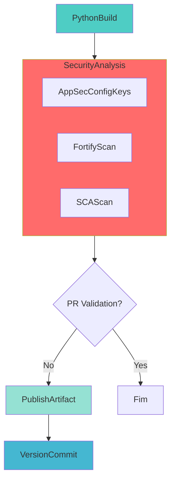

# CI Build Python Library

## 🎯 Descrição

Este pipeline é projetado para a integração contínua (CI) de bibliotecas Python. Ele automatiza o processo de build, teste, versionamento e publicação, garantindo a qualidade e a distribuição eficiente do pacote.

A tecnologia principal utilizada é **Python**, com o gerenciamento de dependências e empacotamento feito pela ferramenta **Poetry** (padrão) ou **UV**.

- [Repositório de exemplo](https://dev.azure.com/telefonica-vivo-brasil/DevOps/_git/teste-build-python-lib)
- [Pipeline de exemplo](https://dev.azure.com/telefonica-vivo-brasil/DevOps/_build?definitionId=44991)

**🚀 Principais funcionalidades:**

- **Build Automatizado**: Utiliza Poetry ou UV para construir a biblioteca de forma consistente.
- **Execução de Testes**: Roda testes unitários com `pytest` e gera relatórios de resultados.
- **Análise de Cobertura de Código**: Calcula a cobertura de testes com `pytest-cov` e publica os resultados mesmo em falha (condição `succeededOrFailed`).
- **Análise de Qualidade (SonarQube)**: Executa análise estática de código e quality gate configurável.
- **Versionamento Automático Condicional**: Lê / atualiza a versão no `pyproject.toml`; o commit da nova versão só ocorre quando `prValidationOnly = false`.
- **Publicação Condicional de Pacotes**: Publica no Azure Artifacts apenas quando `prValidationOnly = false`.
- **Flexibilidade**: Parâmetros (`prValidationOnly`, `runUnitTest`, `runQualityGate`) controlam capacidades específicas do pipeline.

## 🚀 Quick Start (5 minutos)

### Configuração Básica

Este é o uso mais simples do pipeline. Crie o arquivo `.azuredevops/azure-pipeline-ci.yml` no seu repositório:

```yaml
# .azuredevops/azure-pipeline-ci.yml
resources:
  repositories:
    - repository: CodePlay
      name: DevOps/Vivo.CodePlay.Pipelines
      type: git
      ref: refs/heads/master
      endpoint: CodePlay

extends:
  template: /framework/pipelines/ci/build-python-lib/pipeline.yaml@CodePlay
```

### Pré-requisitos

1. **Projeto Python com Poetry**: Seu repositório deve ter um arquivo `pyproject.toml` configurado.
2. **Service Connection**: Conexão `CodePlay` configurada no Azure DevOps.
3. **Azure Artifacts Feed**: Feed com o nome baseado na sigla do projeto (ex: `DVPS` para projeto "DVPS - DevOps").
4. **Permissões**: Build Service precisa de permissão "Contribute" no repositório e no feed.

### 🐍 Escolha do Gerenciador de Pacotes (Poetry ou UV)

Por padrão, o pipeline utiliza **Poetry** como gerenciador de pacotes Python. Você pode optar por usar [**UV**](https://github.com/astral-sh/uv) - um gerenciador de pacotes Python extremamente rápido escrito em Rust - through do parâmetro `packageManager`.

```yaml
# .azuredevops/azure-pipeline-ci.yml - Usando UV
extends:
  template: /framework/pipelines/ci/build-python-lib/pipeline.yaml@CodePlay
  parameters:
    packageManager: 'uv'  # Opções: 'poetry' (padrão) ou 'uv'
```

**Principais diferenças:**

| Aspecto | Poetry | UV |
|---------|--------|-----|
| Performance | Boa | Excelente (10-100x mais rápido) |
| Maturidade | Amplamente adotado | Mais recente, em rápida evolução |
| Compatibilidade | `pyproject.toml` padrão | `pyproject.toml` compatível |
| Build | `poetry build` | `uv build` |
| Autenticação Azure Artifacts | Via `POETRY_HTTP_BASIC_*` | Via `UV_INDEX_URL` |

**Quando usar UV:**
- Pipelines com muitas dependências que precisam de builds mais rápidos
- Projetos novos que querem adotar tecnologia de ponta
- Quando a velocidade de instalação de dependências é crítica

**Quando usar Poetry:**
- Projetos existentes já configurados com Poetry
- Quando necessita de recursos específicos do Poetry
- Ambiente de produção estável com ferramentas maduras

### Próximos Passos

Após criar o arquivo, configure o pipeline no Azure DevOps e execute. Para customizações avançadas, consulte a seção [Comportamentos Customizados](#-comportamentos-customizados).

### 🚀 Próximos Passos Continuous Deployment (CD)

Bibliotecas Python não necessitam de deployment tradicional, pois são publicadas em registries de pacotes (Azure Artifacts PyPI feed) e consumidas por outros projetos via `pip install` ou Poetry. No entanto, existem casos específicos onde o deployment pode ser necessário:

### Caso de Uso: Data Products no Databricks

Se sua biblioteca Python faz parte de um **Data Product** que será deployado no Databricks, você pode utilizar:

#### [deploy-databricks](../../cd/deploy-databricks/README.md) - Deploy Databricks Data Products

**Quando usar:** Para bibliotecas Python que fazem parte de Data Products Databricks com contratos de dados (Data Assets) e bundles de dataflow.

**Principais recursos:**
- 🏷️ Versionamento e rastreio automático de deploy
- 📦 Download automático de pacotes PyPI do Azure Artifacts
- 🔧 Instalação e configuração do Databricks CLI
- 📝 Aplicação de contratos de dados via Data Assets Engine
- 🚀 Deploy de bundles via Databricks CLI
- 🔒 Deployment seguro e auditável via Azure DevOps

**Exemplo de uso:**
```yaml
trigger: none

parameters:
- name: version
  displayName: 'Versão da aplicação'
  type: string
  default: getLatestVersion()
- name: environment
  displayName: 'Versão da aplicação'
  type: string
  default: 'dev'
  values:
    - dev
    - prod

# .azuredevops/azure-pipeline-cd.yml
resources:
  repositories:
    - repository: CodePlay
      name: DevOps/Vivo.CodePlay.Pipelines
      type: git
      ref: refs/heads/master
      endpoint: CodePlay
extends:
  template: /framework/pipelines/cd/deploy-databricks/pipeline.yaml@CodePlay
  parameters:
    environment: dev
    pythonPackageName: $(Build.Repository.Name)
    pythonPackageVersion: getLatestVersion()
    databricksToken: $(DATABRICKS_TOKEN)
```

**💡 Nota Importante:** Este pipeline é específico para Data Products. Bibliotecas Python comuns não requerem CD - elas são simplesmente publicadas no Azure Artifacts e consumidas como dependências em outros projetos.

**Saiba mais:** Consulte a [documentação completa do deploy-databricks](../../cd/deploy-databricks/README.md) para configuração detalhada de Data Products.

## 🏗️ Matriz de Capacidades

| Capacidade                  | Suporte | Descrição                                      |
|----------------------------|---------|------------------------------------------------|
| [Trunk Based Development](https://dvps.redecorp.azr/portal/codeplay/capacidades/catalog/trunk-based-development) | ✅      | Suportado com estratégia de branches configurável via `VersionManagerVivo@8`    |
| [Build Automatizado](https://dvps.redecorp.azr/portal/codeplay/capacidades/catalog/build-automatizado)        | ✅      | Build automático via Poetry com empacotamento wheel/tar.gz     |
| [Testes Unitários](https://dvps.redecorp.azr/portal/codeplay/capacidades/catalog/testes-unitarios)       | ✅      | Habilitado por padrão, controlado pelo parâmetro `runUnitTest`        |
| [SAST](https://dvps.redecorp.azr/portal/codeplay/capacidades/catalog/sast)                        | ✅      | Análise estática de código via Fortify no estágio SecurityAnalysis executado após o build.                       |
| [SCA](https://dvps.redecorp.azr/portal/codeplay/capacidades/catalog/sca)                        | ✅      | Análise de composição de software via template run-sca-scan.yaml no estágio SecurityAnalysis.           |
| [Gates de Segurança](https://dvps.redecorp.azr/portal/codeplay/capacidades/catalog/gates-de-seguranca)          | ✅      | O controle dos gates de segurança (bloqueio ou não do pipeline) é realizado pelo time de AppSec via chaves de configuração recuperadas do AppConfig corporativo (`SKIP_SECURITY_GATE`, `SKIP_SECURITY_GATE_SCA` etc).   |
| [Análise de Código](https://dvps.redecorp.azr/portal/codeplay/capacidades/catalog/analise-de-codigo)          | ✅      | SonarQube integrado com análise completa - parâmetro `runQualityGate`   |
| [Gates de Qualidade](https://dvps.redecorp.azr/portal/codeplay/capacidades/catalog/gate-de-qualidade)           | ✅      | SonarQube Quality Gate - parâmetro `runQualityGate`    |
| [Rollback de Upgrade](https://dvps.redecorp.azr/portal/codeplay/capacidades/catalog/rollback-de-upgrade) | ❎  | Pipeline de CI não faz sentido habilitar essa capacidade |
| [Blue/Green Deployment](https://dvps.redecorp.azr/portal/codeplay/capacidades/catalog/blue-green-deployment) | ❎  | Pipeline de CI não faz sentido habilitar essa capacidade |
| [Canary Release](https://dvps.redecorp.azr/portal/codeplay/capacidades/catalog/canary-release)        | ❎  | Pipeline de CI não faz sentido habilitar essa capacidade |

Legenda:
- ✅ - Suportado nativamente
- ❌ - Não suportado
- ⚠️ - Suportado com limitações ou condições
- 🚧 - Planejado / Em Construção
- ❎ - Não faz sentido habilitar essa capacidade

## 🔄 Estrutura do Pipeline

O pipeline é organizado em quatro estágios principais. O PythonBuild executa primeiro, seguido pelo SecurityAnalysis. Se não for validação de PR, executa PublishArtifact e, por fim, VersionCommit.



**Descrição dos Estágios:**

1. **🔨 PythonBuild**
   - Define a versão do build usando VersionManagerVivo
   - Instala as dependências com Poetry
   - Executa os testes com Pytest e publica resultados de teste e cobertura
     - Pytest executa com o parâmetro `-s` quando a pipeline é executada em modo debug para facilitar a depuração
   - Executa análise SonarQube (quando habilitada)
   - Constrói o pacote da biblioteca (poetry build)
   - Prepara e publica artefatos de build para análises de segurança

2. **🛡️ SecurityAnalysis**
   - **AppSecConfigKeys**: Recupera configurações de segurança do Azure App Configuration
   - **FortifyScan**: Executa análise SAST via Fortify ScanCentral (condicional)
   - **SCAScan**: Executa análise SCA via Dependency Track (condicional)
   - Jobs executam em paralelo quando aplicável para otimizar o tempo total

3. **📦 PublishArtifact** (Condicional - apenas quando `prValidationOnly=false`)
   - Baixa os artefatos buildados e testados
   - Calcula a próxima versão usando Semantic Versioning
   - Publica o pacote Python no feed do Azure Artifacts usando Twine

4. **🏷️ VersionCommit** (Condicional - apenas quando `prValidationOnly=false`)
   - Realiza checkout com credenciais para push
   - Calcula a próxima versão usando Semantic Versioning
   - Commit da nova versão no pyproject.toml e criação de tag Git
   - Rastreabilidade completa das versões publicadas

Observação técnica: a versão é calculada através da task `VersionManagerVivo@8` (executada tanto em `PythonBuild` quanto em `VersionCommit`) que roda o comando `nextVersion` para calcular/atualizar o arquivo de versão (`pyproject.toml`).

Os artefatos de teste e cobertura são gerados dentro de um diretório `test-results` no `workingDirectory`:

- Test results (JUnit XML): `${{ parameters.workingDirectory }}/test-results/junit.xml`
- Coverage (XML): `${{ parameters.workingDirectory }}/test-results/coverage.xml`

## ⚙️ Parâmetros Disponíveis

Configure o comportamento do pipeline através dos seguintes parâmetros.

#### runUnitTest

- **nome**: `runUnitTest`
- **tipo**: boolean
- **default**: `true`
- **descrição**: Controla se os testes unitários serão executados durante o build. Quando habilitado, executa pytest com cobertura de código.
- **dependências**: Requer pytest e pytest-cov instalados no projeto.

#### runQualityGate

- **nome**: `runQualityGate`
- **tipo**: boolean
- **default**: `true`
- **descrição**: Controla se a análise de qualidade com SonarQube será executada. Inclui análise estática e verificação de quality gate.
- **dependências**: Requer service connection do SonarQube configurada e projeto registrado no SonarQube.

#### prValidationOnly

- **nome**: `prValidationOnly`
- **tipo**: boolean
- **default**: `false`
- **descrição**: Se definido como `true`, o pipeline executa apenas as etapas de build e teste, sem publicar o artefato no feed ou fazer o commit da versão. Ideal para validação de Pull Requests.
- **dependências**: As [politicas de branch](https://learn.microsoft.com/pt-br/azure/devops/pipelines/repos/azure-repos-git?view=azure-devops&tabs=yaml#pr-triggers) devem ser configuradas para exigir builds de PR.

#### runPreBuild

- **nome**: `runPreBuild`
- **tipo**: boolean
- **default**: `false`
- **descrição**: Se definido como `true`, o pipeline copia o código fonte dos pacotes definidos no `tool.poetry.include` com o formato `wheel` para o diretório do projeto a fim de inserir no pacote `wheel` do projeto
- **dependências**: a biblioteca do pacote deve estar nas dependências do grupo de desenvolvimento do projeto

#### ymlCoverage

- **nome**: `ymlCoverage`
- **tipo**: boolean
- **default**: `false`
- **descrição**: possui dependência do parâmetro `runUnitTest`. Se ambos estiverem definidos como `true`, os arquivos `yml` estarão disponíveis para o pytest gerar um relatório de cobertura específico para os arquivos `yml` utilizando o parâmetro `--yml-cov`. O relatório de cobertura dos arquivos `yml` será gerado no formato XML em `test-results/yml-coverage.xml`.
- **dependências**: requer pytest e coverage_engine instalados no projeto.

#### agentPool

- **nome**: `agentPool`
- **tipo**: string
- **default**: `"GeneralPurposeLinuxAgentsCI"`
- **descrição**: Especifica o pool de agentes do Azure DevOps onde os jobs serão executados. O padrão é um pool de agentes Linux para CI.
- **dependências**: O pool de agentes especificado deve existir na organização do Azure DevOps.

#### useNetworkProxy

- **nome**: useNetworkProxy
- **tipo**: boolean
- **default**: false
- **descrição**: Configurar proxy de rede para acesso externo. Deve ser `true` para pipelines executados em pools de agentes on-premises como "VivoOnPremDevAgents", "VivoOnPremHmlAgents" e "VivoOnPremPrdAgents".
- **dependências**: Nenhuma.

#### packageManager

- **nome**: `packageManager`
- **tipo**: string
- **default**: `poetry`
- **opções**: `poetry`, `uv`
- **descrição**: Define qual gerenciador de pacotes Python será utilizado para instalar dependências, executar testes e construir o pacote da biblioteca. Poetry é o padrão e mais amplamente adotado. UV é uma alternativa mais rápida escrita em Rust que oferece performance significativamente superior.
- **dependências**: Projeto deve ter `pyproject.toml` configurado de forma compatível com o gerenciador escolhido. Para UV, requer que o comando `uv build` esteja disponível (versão 0.4.0+).
- **exemplo de uso**:
```yaml
extends:
  template: /framework/pipelines/ci/build-python-lib/pipeline.yaml@CodePlay
  parameters:
    packageManager: 'uv'  # Usa UV ao invés de Poetry
```

#### feedName

- **nome**: `feedName`
- **tipo**: string
- **default**: `$(DEFAULT_FEED_NAME)`
- **descrição**: Nome do feed do Azure Artifacts onde a biblioteca Python será publicada. Por padrão, utiliza o nome derivado da sigla do projeto.
- **dependências**: Um feed do Azure Artifacts com o nome correspondente deve existir.

#### projectScopedFeed

- **nome**: `projectScopedFeed`
- **tipo**: boolean
- **default**: `true`
- **descrição**: Define se o feed usado para publicação tem escopo de projeto (`true`) ou de organização (`false`). Controla a construção da URL utilizada pelo `twine upload`. Mantenha `true` para feeds criados dentro de um projeto específico a fim de isolar permissões. Use `false` apenas se o feed existir no nível da organização.
- **dependências**: O feed referenciado por `feedName` deve existir no escopo selecionado. Caso o escopo não corresponda, a etapa de publicação falhará com erro 403 ou 404. O Build Service Account deve ter as permissões adequadas no feed (Contributor).

> **Dica**: Se ao migrar um feed entre escopos você começar a receber 404, valide se este parâmetro está alinhado com o novo escopo.

#### workingDirectory

- **nome**: `workingDirectory`
- **tipo**: string
- **default**: `$(Build.SourcesDirectory)`
- **descrição**: O diretório de trabalho onde os comandos do projeto (como `poetry install` e `poetry build`) serão executados. O padrão é a raiz do repositório.
- **dependências**: O caminho deve ser válido e conter o arquivo `pyproject.toml`.

#### buildArtifactName

- **nome**: `buildArtifactName`
- **tipo**: string
- **default**: `$(Build.Repository.Name)`
- **opções**: Não aplicável
- **descrição**: Nome do artefato de build publicado. Utilizado na task DownloadPipelineArtifact@2 no template /security/run_sca_scan.yml para análise de segurança SCA.
- **dependências**: Utilizado pelo template /security/run_sca_scan.yml no estágio SecurityAnalysis.

#### twinePublishPattern

- **nome**: `twinePublishPattern`
- **tipo**: string
- **default**: `'dist/*.whl dist/*.tar.gz'`
- **descrição**: Padrão de arquivos para publicar com Twine. Define explicitamente os formatos mais comuns (wheel e source distribution) para evitar falhas com arquivos não suportados. Pode ser customizado para incluir outros formatos se necessário.
- **dependências**: Os arquivos especificados pelo padrão devem existir no diretório após o `poetry build`.

#### twineVersion

- **nome**: `twineVersion`
- **tipo**: string
- **default**: `'>=6.0.0'`
- **descrição**: Especifica a versão do Twine a ser instalada para publicação no Azure Artifacts. O padrão (`>=6.0.0`) garante suporte a Metadata-Version 2.4 (PEP 639), necessário para pacotes que utilizam os novos campos de licença do Python. Pode ser customizado para versões específicas se houver incompatibilidades.
- **dependências**: A versão especificada deve estar disponível no PyPI. Versões anteriores a 6.0.0 não suportam Metadata-Version 2.4 e podem falhar com erro `InvalidDistribution`.

> **Dica**: Se você encontrar o erro `InvalidDistribution: Invalid distribution metadata. This version of twine supports Metadata-Version 1.0, 1.1, 1.2, 2.0, 2.1, 2.2, and 2.3`, atualize para `twineVersion: '>=6.0.0'` ou superior.

#### coverageSource

- **nome**: `coverageSource`
- **tipo**: string
- **default**: `.`
- **descrição**: Diretório raiz usado pelo pytest-cov para calcular a cobertura (`--cov=<path>`). Por padrão utiliza a raiz do projeto. Ajuste para `src` ou o diretório de código-fonte se necessário.
- **dependências**: O caminho deve existir dentro do `workingDirectory` e conter o código-fonte a ser analisado.

#### ymlCoverageSource

- **nome**: `ymlCoverageSource`
- **tipo**: string
- **default**: `dags,data_contracts`
- **descrição**: Diretório usado pelo `coverage_engine` para calcular a cobertura de arquivos YML (`--yml-cov-source=<path>`). Por padrão utiliza os diretórios `dags` e `data_contracts`. Ajuste conforme necessário. Deve ser utilizado `,` para separar múltiplos diretórios.
- **dependências**: O caminho deve existir dentro do `workingDirectory` e conter os arquivos YML a serem analisados.

#### ymlCoverageFailUnder

- **nome**: `ymlCoverageFailUnder`
- **tipo**: number
- **default**: 80
- **descrição**: Limite mínimo de cobertura para arquivos YML. Se a cobertura estiver abaixo deste valor, o pipeline falhará.
- **dependências**: `ymlCoverage` deve estar habilitado para que este parâmetro seja aplicado.

#### publishAllureReport

- **nome**: `publishAllureReport`
- **tipo**: boolean
- **default**: `false`
- **descrição**: Habilita a geração e publicação do relatório Allure. Quando `true`, o pipeline adiciona automaticamente a flag `--alluredir=<testAllureResultsDir>` à execução do pytest (Poetry ou UV) e publica o relatório. Requer apenas que o projeto tenha o plugin `allure-pytest` declarado nas dependências (`pyproject.toml`).
- **dependências**: Extensão Allure instalada na organização Azure DevOps (task `PublishAllureReport@2`). Dependência `allure-pytest` configurada no projeto.
- **exemplo de uso**:
```yaml
extends:
  template: /framework/pipelines/ci/build-python-lib/pipeline.yaml@CodePlay
  parameters:
    publishAllureReport: true
    testAllureResultsDir: '$(Pipeline.Workspace)/allure-results'
```

#### testAllureResultsDir

- **nome**: `testAllureResultsDir`
- **tipo**: string
- **default**: `$(Pipeline.Workspace)/allure-results`
- **descrição**: Diretório onde os resultados do Allure são gerados (via `--alluredir`) durante os testes e de onde são lidos para publicação. O diretório é criado automaticamente pelo pipeline. Evite usar `$(Build.SourcesDirectory)` para prevenir conflitos com o código-fonte.
- **dependências**: `publishAllureReport` deve ser `true` para que este parâmetro tenha efeito.

#### testSetupScript

- **nome**: `testSetupScript`
- **tipo**: string
- **default**: `''` (vazio)
- **descrição**: Caminho opcional para um script de setup executado (via `source`) antes dos testes unitários. Útil para inicializar serviços auxiliares, configurar variáveis de ambiente ou preparar o ambiente de testes. Se o arquivo não existir, um warning é emitido mas o pipeline continua.
- **dependências**: `runUnitTest` deve ser `true` para que este parâmetro tenha efeito. O script deve existir no caminho informado dentro do repositório.
- **exemplo de uso**:
```yaml
extends:
  template: /framework/pipelines/ci/build-python-lib/pipeline.yaml@CodePlay
  parameters:
    testSetupScript: 'src/helper/dev_start.sh'
```

#### versionFile

- **nome**: `versionFile`
- **tipo**: string
- **default**: `"pyproject.toml"`
- **descrição**: Nome do arquivo que contém a versão do projeto. Usado para ler e atualizar a versão da biblioteca.
- **dependências**: O arquivo deve existir no `workingDirectory`.

#### branchingStrategy

- **nome**: `branchingStrategy`
- **tipo**: string
- **default**: `"trunkbased"`
- **opções**: 
  - `trunkbased` - Desenvolvimento baseado em trunk (padrão)
  - `vivoflow` - Fluxo de branches customizado Vivo
  - `releaseflow` - Estratégia baseada em branches de release
  - `gitlabflow` - GitLab Flow
  - `gitlabflow-semantic` - GitLab Flow com versionamento semântico
  - `custom` - Estratégia customizada
  - `monorepo` - Estratégia para repositórios monorepo
- **descrição**: "Define a estratégia de versionamento e branching utilizada pelo VersionManagerVivo. A estratégia escolhida afeta como as versões são calculadas baseado no branch e histórico de commits."
- **dependências**: Utilizado pela task VersionManagerVivo@8 para cálculo de versionamento

#### useSonarConfigFile

- **nome**: `useSonarConfigFile`
- **tipo**: boolean
- **default**: `true`
- **descrição**: Define se o SonarQube deve usar um arquivo de configuração específico ou configuração via parâmetros.
- **dependências**: Se true, o arquivo especificado em `sonarConfigFilePath` deve existir.

#### sonarConfigFilePath

- **nome**: `sonarConfigFilePath`
- **tipo**: string
- **default**: `".azuredevops/sonar-project.properties"`
- **descrição**: Caminho para o arquivo de configuração do SonarQube quando `useSonarConfigFile` é true.
- **dependências**: Arquivo deve existir no repositório se `useSonarConfigFile` for true.

#### sonarPollingTimeoutSec

- **nome**: `sonarPollingTimeoutSec`
- **tipo**: string
- **default**: `"300"`
- **descrição**: Timeout em segundos para aguardar o resultado do quality gate do SonarQube.
- **dependências**: Valor deve ser numérico representado como string.

#### sonarJavaVersion

- **nome**: `sonarJavaVersion`
- **tipo**: string
- **default**: `"openjdk-17.0.2"`
- **descrição**: Versão do Java a ser usada pelo scanner do SonarQube.
- **dependências**: A versão especificada deve estar disponível no agente de build.

#### sonarServiceConnection

> ⚠️ **DEPRECIADO**: Este parâmetro será removido em breve. A escolha da instância SonarQube passará a ser automática via custom task e `vip.json`. Consulte a [Decisão 6](#decisão-6-depreciação-do-parâmetro-sonarserviceconnection-e-governança-sonarqube-adr-0006) para detalhes.

- **nome**: `sonarServiceConnection`
- **tipo**: string
- **default**: `"VIVO_SONARQUBE"`
- **descrição**: **(DEPRECATED)** Nome da service connection do SonarQube configurada no Azure DevOps. Mantido temporariamente para retrocompatibilidade.
- **dependências**: Service connection deve existir e ter permissões adequadas.

#### sonarQualityGate

- **nome**: `sonarQualityGate`
- **tipo**: string
- **default**: `"AzureDevOps-Default"`
- **descrição**: Nome do quality gate configurado no SonarQube para validação.
- **dependências**: Quality gate deve existir no projeto SonarQube.

#### sonarScannerMode

- **nome**: `sonarScannerMode`
- **tipo**: string
- **default**: `"cli"`
- **descrição**: Modo de execução do scanner SonarQube. Para projetos Python, recomenda-se usar 'cli' que oferece melhor compatibilidade.
- **dependências**: Para projetos Python, recomenda-se usar 'cli'.

#### sonarProjectKey

- **nome**: `sonarProjectKey`
- **tipo**: string
- **default**: `"$(System.TeamProject)-$(Build.Repository.Name)"`
- **descrição**: Chave única do projeto no SonarQube, formada pela combinação do nome do projeto e do repositório no Azure DevOps.
- **dependências**: Projeto deve ser registrado no SonarQube com esta chave.

#### sonarProjectName

- **nome**: `sonarProjectName`
- **tipo**: string
- **default**: `"$(System.TeamProject)-$(Build.Repository.Name)"`
- **descrição**: Nome do projeto no SonarQube usado para identificação e visualização na interface do SonarQube.
- **dependências**: Projeto deve existir no SonarQube.

#### useAppConfig

- **nome**: `useAppConfig`
- **tipo**: boolean
- **default**: `true`
- **descrição**: Define se deve usar Azure App Configuration para obter configurações do SonarQube.
- **dependências**: Requer acesso ao Azure App Configuration especificado.

#### enableFortifyExclusions

- **nome**: `enableFortifyExclusions`
- **tipo**: boolean
- **default**: `false`
- **descrição**: Controla se deve fazer checkout do repositório de exclusões Fortify antes da análise SAST. Quando habilitado, permite aplicar regras customizadas de exclusão específicas do projeto. O template `run-sast-scan.yaml` gerencia automaticamente o checkout do repositório `FortifyExclusion` quando este parâmetro é true.
- **dependências**: Repositório FortifyExclusion configurado e acessível durante checkout.

## 🔧 Dependências Externas

### Service Connections Obrigatórias

| Nome da Connection | Tipo | Descrição | Como Configurar |
|-------------------|------|-----------|-----------------|
| `System.AccessToken` | Interna | Token de acesso do Azure DevOps usado para autenticar no feed do Azure Artifacts e para fazer commit no repositório Git. | Conceda permissão de "Contribute" à identidade de build do projeto no repositório e permissão de "Feed and Upstream Reader" (e superior) no feed de artefatos. |
| `VIVO_SONARQUBE` | SonarQube | Conexão com o servidor SonarQube para análise de qualidade de código. | Deve ser configurada no nível do projeto/organização para apontar para o servidor SonarQube corporativo. |
| `DevOpsSharedResources` | Azure Resource Manager | Conexão com a subscription Azure para acessar o App Configuration. | Service connection deve ter permissões para ler o Azure App Configuration especificado. |
| `CodePlay` (Exemplo) | git | Conexão com o repositório onde os templates do pipeline estão localizados. | Deve ser configurada no nível do projeto/organização para apontar para o repositório `DevOps/Vivo.CodePlay.Pipelines`. |

### Recursos de Build Agent

O agente de build deve ter as seguintes capacidades:

- **Python**: Versão compatível com o projeto.
- **Poetry**: Ferramenta de gerenciamento de dependências Python.
- **Git**: Para realizar o checkout e commit do código.

Credenciais e variáveis usadas durante a publicação:

- O pipeline exporta variáveis de ambiente para autenticar o Poetry/Twine contra o feed do Azure Artifacts:
  - `POETRY_HTTP_BASIC_<FEED>_USERNAME` é definido como `AzureDevOps` no job.
  - `POETRY_HTTP_BASIC_<FEED>_PASSWORD` é carregado a partir da variável `AZDO_FEED_PASSWORD`, que no pipeline é atribuída ao `$(System.AccessToken)` para operações internas.

- Para o passo de upload com `twine` o pipeline usa também as variáveis de ambiente definidas no job: `SYSTEM_ACCESSTOKEN`, `FEED_NAME`, `PROJECT_SCOPED_FEED` e `PROJECT_ID` (essas são utilizadas na construção da URL de upload). Certifique-se de que a identidade de build tem permissões adequadas no feed e no repositório.

## 🎨 Comportamentos Customizados

:::danger
**⚠️ ATENÇÃO: CUSTOMIZAÇÕES REQUEREM RESPONSABILIDADE ⚠️**

- ✅ **Use os exemplos como ponto de partida** - Eles demonstram padrões seguros e testados
- 🧠 **"Todos somos adultos"** - Confiamos na sua expertise, mas exigimos consciência do impacto
- 📝 **Tudo fica registrado** - Seu histórico de commits é auditável e rastreável
- 🎯 **Entenda antes de modificar** - Customizações incorretas podem quebrar builds em produção
- 🤝 **Documente suas decisões** - Facilite a manutenção futura por outros membros da equipe

**Customizar é permitido. Fazer sem entender não é.**
:::

### Cenário 1 - Validação de Pull Request

Use este cenário para rodar o pipeline apenas para validação, sem publicar artefatos ou fazer commit da versão. É o ideal para gatilhos de Pull Request.

```yaml
# .azuredevops/azure-pipeline-ci.yml
resources:
  repositories:
    - repository: CodePlay
      name: DevOps/Vivo.CodePlay.Pipelines
      type: git
      ref: refs/heads/master
      endpoint: CodePlay

extends:
  template: /framework/pipelines/ci/build-python-lib/pipeline.yaml@CodePlay
  parameters:
    prValidationOnly: true               # Executa apenas build e testes.
```

### Cenário 2 - Configuração Completa

Este exemplo mostra como customizar todos os parâmetros disponíveis para um ambiente específico.

```yaml
# .azuredevops/azure-pipeline-ci.yml
resources:
  repositories:
    - repository: CodePlay
      name: DevOps/Vivo.CodePlay.Pipelines
      type: git
      ref: refs/heads/master
      endpoint: CodePlay

extends:
  template: /framework/pipelines/ci/build-python-lib/pipeline.yaml@CodePlay
  parameters:
    agentPool: 'MyCustomLinuxPool'
    feedName: 'MyProject-Python-Feed'
    projectScopedFeed: true
    workingDirectory: 'src/my-python-lib'
    versionFile: 'pyproject.toml'
    twinePublishPattern: 'dist/*.whl dist/*.tar.gz'
    prValidationOnly: false              # (opcional, false já é o default)
```

### Cenário 3 - Publicação de Formatos Específicos

Este exemplo mostra como customizar os formatos de arquivo publicados.

```yaml
# .azuredevops/azure-pipeline-ci.yml
resources:
  repositories:
    - repository: CodePlay
      name: DevOps/Vivo.CodePlay.Pipelines
      type: git
      ref: refs/heads/master
      endpoint: CodePlay

extends:
  template: /framework/pipelines/ci/build-python-lib/pipeline.yaml@CodePlay
  parameters:
    twinePublishPattern: 'dist/*.whl'     # Publica apenas wheels
    # ou
    # twinePublishPattern: 'dist/*'       # Publica todos os arquivos (cuidado com formatos não suportados)
```

### Cenário 4 - Configuração com Análises de Segurança Customizadas

Configuração avançada com análises de segurança específicas:

```yaml
# .azuredevops/azure-pipeline-ci.yml
resources:
  repositories:
    - repository: CodePlay
      name: DevOps/Vivo.CodePlay.Pipelines
      type: git
      ref: refs/heads/master
      endpoint: CodePlay

extends:
  template: /framework/pipelines/ci/build-python-lib/pipeline.yaml@CodePlay
  parameters:
    fortifyExclusion: 'MyFortifyExclusion'  # Repositório personalizado de exclusões
    runUnitTest: true                     # Mantém testes habilitados
    runQualityGate: true                  # Mantém SonarQube habilitado
```

### Cenário 5 - Publicar Relatório Allure

Para projetos que utilizam `allure-pytest` para gerar relatórios de testes detalhados:

```yaml
# .azuredevops/azure-pipeline-ci.yml
resources:
  repositories:
    - repository: CodePlay
      name: DevOps/Vivo.CodePlay.Pipelines
      type: git
      ref: refs/heads/master
      endpoint: CodePlay

extends:
  template: /framework/pipelines/ci/build-python-lib/pipeline.yaml@CodePlay
  parameters:
    publishAllureReport: true
    testAllureResultsDir: '$(Pipeline.Workspace)/allure-results'
```

**Pré-requisitos:**
- Dependência `allure-pytest` no projeto (em `pyproject.toml`)
- Configuração do pytest para gerar resultados Allure (ex: `--alluredir=$(Pipeline.Workspace)/allure-results`)
- Extensão Allure instalada na organização Azure DevOps

## 🔧 Variáveis de Ambiente

As seguintes variáveis são definidas e utilizadas internamente pelo pipeline para padronização.

| Variável | Descrição | Valor Padrão |
|----------|-----------|--------------|
| `SIGLA` | Extrai a sigla do projeto a partir do nome do projeto no Azure DevOps. | `lower(split(variables['System.TeamProject'],' ')[0])` |
| `DEFAULT_FEED_NAME` | Define o nome do feed padrão do Azure Artifacts usando a sigla do projeto em maiúsculas. | `upper(variables['SIGLA'])` |
| `AKV_DEVOPS_NAME` | Nome do Azure Key Vault para configurações de segurança | `kv-azdevops-shared` |
| `PROXY_NSKP_SERVER` | Servidor proxy NSKP (proxy principal para acesso externo) | `nskp.redecorp.br:8080` |
| `PROXY_SQUID_SERVER` | Servidor proxy Squid (referência legada, mantido para compatibilidade) | `10.240.58.39:3128` |
| `PROXY_AGENT_HTTP` | Configuração de proxy HTTP para o agente | `http://$(PROXY_NSKP_SERVER)` |
| `PROXY_AGENT_HTTPS` | Configuração de proxy HTTPS para o agente | `http://$(PROXY_NSKP_SERVER)` |
| `PROXY_AGENT_NO_PROXY` | Lista de hosts que não devem usar proxy | `localhost,0.0.0.0,127.0.0.1,10.244.0.0/16,192.168.0.0/16,10.129.178.173,nexus.telefonica.com.br,acrsharedservices01.azurecr.io,appcs-azdevops-shared.azconfig.io,scm.azurewebsites.net` |
| `CACORP_LOCATION` | Localização do certificado CA corporativo | `$(Agent.HomeDirectory)/../../certs/CACORP.pem` |
| `APP_LANGUAGE` | Linguagem da aplicação usada pelos templates de segurança | `other` |
| `FORTIFY_APP_DEFAULT_VERSION` | Versão padrão da aplicação para análise Fortify | `DevSecOps` |
| `POETRY_CACHE_DIR` | Diretório de cache do Poetry (pacotes baixados). Usa o diretório temporário oficial do Azure DevOps (`Agent.TempDirectory`), evitando uso de `~/` ou `/tmp` do SO | `$(Agent.TempDirectory)/poetry` |
| `UV_CACHE_DIR` | Diretório de cache do UV. Equivalente ao `POETRY_CACHE_DIR` para o gerenciador UV | `$(Agent.TempDirectory)/uv` |
| `UV_PROJECT_ENVIRONMENT` | Localização do ambiente virtual criado pelo UV. Garante que o `.venv` fique dentro do diretório do projeto | `.venv` |
| `TMPDIR` | Sobrescreve o diretório temporário do SO usado pelo Python internamente (ex: `tempfile.mkdtemp()`). Impede que o Poetry use `/tmp` do sistema operacional durante operações intermediárias | `$(Agent.TempDirectory)` |

**Nota**: Configurações específicas do projeto devem ser definidas como parâmetros, não como variáveis de ambiente.

## ❓ FAQ

### Falha no estágio VersionCommit

**Sintomas:**

- O estágio `VersionCommit` falha com um erro de permissão negada ao tentar fazer `git push`.

**Causa Provável:**

A identidade de serviço de build não tem permissão para fazer commit no repositório.

**Solução:**

1. Navegue até **Project Settings** > **Repositories**.
2. Selecione o seu repositório.
3. Vá para a aba **Security**.
4. Procure pelo usuário `[Nome do Projeto] Build Service ([Nome da Organização])`.
5. Defina a permissão **Contribute** como **Allow**.

### Falha ao publicar no Azure Artifacts

**Sintomas:**

- A tarefa de `twine upload` falha com um erro 403 (Forbidden) ou 404 (Not Found).

**Causa Provável:**

- O feed especificado em `feedName` não existe.
- A identidade de build não tem permissão para publicar no feed.

**Solução:**

1. Verifique se o nome do feed em `feedName` está correto.
2. Navegue até o feed no Azure Artifacts.
3. Clique em **Feed settings** (ícone de engrenagem).
4. Vá para a aba **Permissions**.
5. Adicione o usuário `[Nome do Projeto] Build Service ([Nome da Organização])` com a role de **Contributor** ou superior.


### Falha na publicação de arquivos específicos

**Sintomas:**

- A tarefa de `twine upload` falha com erro indicando formatos de arquivo não suportados.

**Causa Provável:**

- O padrão `twinePublishPattern` está incluindo arquivos que o Twine não consegue processar.

**Solução:**

1. Ajuste o parâmetro `twinePublishPattern` para incluir apenas formatos suportados:

   ```yaml
   parameters:
     twinePublishPattern: 'dist/*.whl dist/*.tar.gz'  # Apenas wheel e source dist
   ```

2. Para depuração, ative logs detalhados com `system.debug: true`.
3. Verifique os arquivos gerados pelo `poetry build` no diretório `dist/`.

## 🆘 Suporte

Para questões, problemas ou sugestões relacionadas a este pipeline:

- **Equipe CodePlay Framework**: Entre em contato através dos canais oficiais do projeto DevOps
- **Documentação Adicional**: Consulte o [repositório do CodePlay](https://dev.azure.com/telefonica-vivo-brasil/DevOps/_git/Vivo.CodePlay.Pipelines)
- **Issues**: Reporte problemas através do sistema de trabalho do Azure DevOps

## Decisões Tomadas

### Decisão 1: Uso do Poetry

- **Data**: 03/09/2025
- **Motivador**: Necessidade de uma ferramenta moderna e unificada para gerenciamento de dependências, ambiente virtual e empacotamento em projetos Python.
- **Descrição**: Adotou-se o Poetry como ferramenta padrão para todos os projetos Python. Ele substitui a combinação de `pip`, `venv` e `setuptools`, simplificando o `pyproject.toml`.
- **Impacto**: Simplifica a configuração do pipeline, pois os comandos `poetry install` e `poetry build` cuidam de todas as etapas de dependência e construção do pacote.
- **Notas**: Software `poetry v2.2.1` homologado [RITM0892044](https://vivoit.service-now.com/vivonow?id=ticket&table=sc_req_item&sys_id=3c6b25a69711c7184491b386f053afb2&view=sp)

### Decisão 2: Commit de Versão Condicional (controle via prValidationOnly)

- **Data**: 03/09/2025
- **Motivador**: Permitir que o pipeline seja usado tanto para validação (sem alterar o repositório) quanto para releases oficiais (que precisam de commit de versão).
- **Descrição**: A estratégia foi simplificada usando apenas o parâmetro `prValidationOnly`. Quando `prValidationOnly=true`, o pipeline funciona em modo de validação (sem publicar/commitar). Quando `false`, efetua publicação e commit.
- **Impacto**: Maior clareza operacional (um único parâmetro), evitando duplicidade conceitual entre “enableVersionCommit” e modos de validação.

> Nota de migração: referências antigas a `enableVersionCommit` devem ser substituídas por lógica inversa com `prValidationOnly` (ex.: `enableVersionCommit: true` -> `prValidationOnly: false`).

### Decisão 3: Pré-build para inserir código-fonte de dependências no pacote wheel do projeto

- **Data**: 07/09/2025
- **Motivador**: Permitir que o código-fonte de pacotes privados do Azure Artifacts sejam inseridos no pacote do projeto para não precisar configurar o token do Azure Devops para leitura de pacotes no Azure Artifacts no Databricks para ser utilizado em cada inicialização de cluster
- **Descrição**: A estratégia foi simplificada usando apenas o parâmetro `runPreBuild`. Quando `runPreBuild=true`, o pipeline identifica o diretório do ambiente virtual criado pelo Poetry; identifica o diretório `site-packages` onde estão os códigos-fontes das dependências; e obtém as bibliotecas que são necessárias copiar para o projeto no `pyproject.toml` na seção `tool.poetry.include` com formato `wheel` para realizar o `poetry build`
- **Impacto**: Simplifica a configuração do Databricks, pois não será necessário configurar o token de acesso ao Azure DevOps para cada workspace.

### Decisão 4: Padronização do Estágio AppSec com Artefato
- **Data**: 14/11/2025
- **Motivador**: Garantir contexto completo e isolamento das verificações de segurança, alinhando o framework às melhores práticas recomendadas pela equipe de AppSec.
- **Fórum Envolvido**: Equipe AppSec, DevOps Soluções
- **Descrição**: Adotar a abordagem de estágio dedicado de AppSec utilizando artefatos gerados nos estágios anteriores (build/teste). O estágio de AppSec consome esses artefatos para realizar as análises de segurança, garantindo contexto completo e permitindo paralelismo, reexecução e troubleshooting facilitado.
- **Impacto**: Exige ajustes nos pipelines para geração e consumo de artefatos, mas aumenta a eficácia e rastreabilidade das análises de segurança.
- **Próximos Passos**: Adaptar templates e pipelines para garantir que o estágio AppSec sempre utilize artefatos completos do build.
- **Referências**: [ADR 0004 - Estágios de AppSec nos pipelines](/framework/docs/adr/0004-estagios-de-appsec-nos-pipelines.md)
- **Notas**: Recomendado como padrão para todos os pipelines do framework.

### Decisão 5: Adoção do Template Padrão AppSec
- **Data**: 14/11/2025
- **Motivador**: Alinhar o framework às diretrizes e práticas recomendadas pela equipe de AppSec, promovendo padronização e facilidade de manutenção.
- **Fórum Envolvido**: Equipe AppSec, DevOps Soluções
- **Descrição**: Adotar o template padrão definido pela equipe de AppSec para integração das verificações de segurança nos pipelines do framework. A custom task desenvolvida internamente será avaliada e integrada de forma gradual, sem exigir mudanças nos arquivos `.azuredevops/pipelines.yml` dos projetos consumidores.
- **Impacto**: Todos os pipelines do framework passam a incorporar o template AppSec, garantindo consistência e alinhamento com as melhores práticas. A custom task será evoluída em paralelo, em colaboração com AppSec.
- **Próximos Passos**: Atualizar templates do framework para uso do template AppSec e iniciar avaliação da custom task para integração futura.
- **Referências**: [ADR 0005 - Uso de template para AppSec](/framework/docs/adr/0005-uso-de-template-para-appsec.md)
- **Notas**: Mudança planejada para não exigir alterações nos pipelines dos projetos já existentes.

### Decisão 6: Depreciação do parâmetro `sonarServiceConnection` e governança SonarQube (ADR 0006)
- **Data**: 13/05/2026
- **Motivador**: Alinhar o pipeline à governança definida na ADR 0006, evitando bypass manual do controle de acesso ao Sonar VIP.
- **Fórum Envolvido**: CoE DevOps
- **Descrição**: O parâmetro `sonarServiceConnection` será depreciado em breve. Atualmente, ainda é possível referenciar manualmente o Sonar VIP ou comum, mas a escolha da instância passará a ser feita automaticamente pela custom task, baseada no arquivo `vip.json`. Isso garante que apenas projetos aprovados utilizem o Sonar VIP, conforme política definida.
- **Impacto**: Evita burla de governança, aumenta a rastreabilidade e prepara o pipeline para remoção futura do parâmetro.
- **Próximos Passos**: Depreciar o parâmetro `sonarServiceConnection` no pipeline e atualizar a lista do `vip.json` com as siglas dos projetos autorizados ao Sonar VIP.
- **Referências**: [ADR 0008 - Sonar VIP Governance](/framework/docs/adr/0008-sonar-vip-governance.md)
- **Notas**: O parâmetro permanece disponível temporariamente para retrocompatibilidade, mas será depreciado em breve.

### Decisão 7: Uso de configurações globais do Poetry para virtualenvs em vez de variável de ambiente `POETRY_VIRTUALENVS_IN_PROJECT`
- **Data**: 30/07/2026
- **Motivador**: A variável de ambiente `POETRY_VIRTUALENVS_IN_PROJECT` apresentou comportamento inconsistente em determinados agentes Azure DevOps: em alguns ambientes ela era ignorada pelo Poetry devido a hierarquia de configurações do Poetry, ocasionamento o não uso de virtualenvs.
- **Descrição**: Substituiu-se o uso da variável de ambiente `POETRY_VIRTUALENVS_IN_PROJECT=true` pelos comandos de configuração global do Poetry executados explicitamente antes do `poetry install`:
  ```bash
  poetry config virtualenvs.create true
  poetry config virtualenvs.in-project true
  ```
  Esses comandos escrevem as configurações no arquivo de configuração global do Poetry (`config.toml`), garantindo que o virtualenv seja sempre criado dentro do diretório do projeto (`.venv/`), independentemente do ambiente do agente.
- **Impacto**: Maior previsibilidade e portabilidade do pipeline entre diferentes pools de agentes. O virtualenv fica em `${{ parameters.workingDirectory }}/.venv`, facilitando inspeção e cache.
- **Próximos Passos**: Avaliar se ocorrem sobrescritas desses valores no TOML de projeto, exigindo talvez checagem e alerta dentro do pipeline para alertar desenvolvedor.


