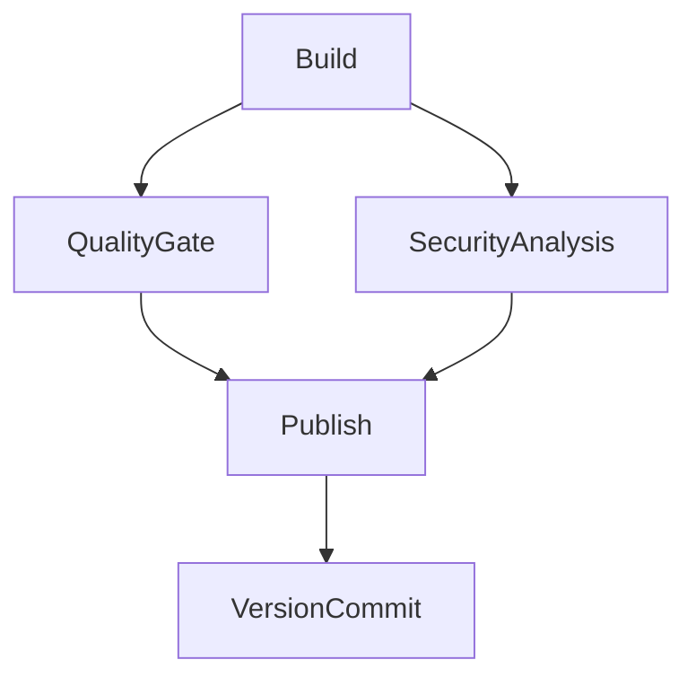

# Build VSIX VSCode Extension (CI)

## 🎯 Descrição

Pipeline de Integração Contínua para extensões `.vsix` destinadas ao **Visual Studio Code Marketplace**. Realiza build, testes, análise de qualidade, análise de segurança, empacotamento via `vsce` e publicação do artefato `.vsix` no Azure Artifacts, de onde o pipeline de CD (`deploy-vsix-vscode-extension`) irá consumi-lo para fazer o deploy no marketplace.

> Desenvolvedor: Não esqueça de atualizar os links abaixo

<!-- TODO: Atualizar links de exemplo para repositório e pipeline específicos deste template, não os genéricos ou de outros pipelines.
- [Repositório de exemplo](https://dev.azure.com/telefonica-vivo-brasil/DevOps/_git/teste-build-vsix-vscode-extension)
- [Pipeline de exemplo](MUDAR_AQUI) -->


## 🚀 Quick Start (5 minutos)

### Pré-requisitos

- Arquivo `.nvmrc` na raiz do repositório
- Arquivo `.npmrc` configurado para autenticação com o feed npm
- `package.json` com campos `name`, `displayName` e `publisher`
- Scripts `build`, `test` (e opcionalmente `lint`, `coverage`) no `package.json`

### Configuração Mínima

```yaml
# .azuredevops/azure-pipeline-ci.yml
trigger:
  branches:
    include:
      - master

resources:
  repositories:
    - repository: CodePlay
      name: DevOps/Vivo.CodePlay.Pipelines
      type: git
      ref: refs/heads/master

extends:
  template: /framework/pipelines/ci/build-vsix-vscode-extension/pipeline.yaml@CodePlay
```

**Resultado**: Build, testes, quality gate, análise de segurança, empacotamento `.vsix` e publicação no Azure Artifacts com versionamento automático.


## 🏗️ Matriz de Capacidades

| Capacidade | Suporte | Descrição |
|---|---|---|
| [Trunk Based Development](https://dvps-dev.redecorp.azr/portal/codeplay/capacidades/catalog/trunk-based-development) | ✅ | Suporte nativo. Parâmetro: `branchingStrategy` |
| [Build Automatizado](https://dvps-dev.redecorp.azr/portal/codeplay/capacidades/catalog/build-automatizado) | ✅ | `npm run build`. Parâmetro: `enableBuild` |
| [Lint](https://dvps-dev.redecorp.azr/portal/codeplay/capacidades/catalog/lint) | ✅ | `npm run lint`. Parâmetro: `enableLint` |
| [Testes Unitários](https://dvps-dev.redecorp.azr/portal/codeplay/capacidades/catalog/testes-unitarios) | ✅ | `npm run test`. Parâmetro: `enableTest` |
| [Cobertura de Código](https://dvps-dev.redecorp.azr/portal/codeplay/capacidades/catalog/cobertura) | ✅ | `npm run coverage`. Parâmetro: `enableCoverage` |
| [Quality Gate (SonarQube)](https://dvps-dev.redecorp.azr/portal/codeplay/capacidades/catalog/quality-gate) | ✅ | Paralelo à Segurança. Parâmetro: `runQualityGate` |
| [SAST (Fortify)](https://dvps-dev.redecorp.azr/portal/codeplay/capacidades/catalog/sast) | ✅ | Condicional via App Configuration |
| [SCA (Dependency Track)](https://dvps-dev.redecorp.azr/portal/codeplay/capacidades/catalog/sca) | ✅ | Condicional via App Configuration |
| [Versionamento Automático](https://dvps-dev.redecorp.azr/portal/codeplay/capacidades/catalog/versionamento) | ✅ | Sempre executado. Parâmetros: `versionFiles`, `branchingStrategy` |
| [Publicação no Azure Artifacts](https://dvps-dev.redecorp.azr/portal/codeplay/capacidades/catalog/artifacts) | ✅ | Universal Package. Parâmetros: `feedName`, `packageName` |

Legenda: ✅ Suportado | ❌ Não suportado | ⚠️ Com limitações | ❎ Não aplicável


## 🔄 Estrutura do Pipeline



| Stage | Descrição |
|---|---|
| **Build** | Lint, build, testes, cobertura, empacotamento `.vsix` via `vsce`, publicação do artefato |
| **QualityGate** | Análise SonarQube (paralelo à Segurança). Skip se `runQualityGate=false` |
| **SecurityAnalysis** | Fortify SAST + SCA (paralelo ao QualityGate). Condicional via App Configuration |
| **Publish** | Publicação do `.vsix` como Universal Package no Azure Artifacts |
| **VersionCommit** | Commit e tag da versão no repositório |

> `Publish` e `VersionCommit` são pulados quando `prValidationOnly=true`.


## ⚙️ Parâmetros Disponíveis

Configure o comportamento do pipeline através dos seguintes parâmetros. Cada parâmetro controla aspectos específicos da execução.

### Infraestrutura e Ambiente

#### agentPool

- **nome**: agentPool
- **tipo**: string
- **default**: "GeneralPurposeLinuxAgentsCI"
- **descrição**: Define o agent pool utilizado para execução de todos os stages do pipeline CI. Deve ser um pool Linux com acesso ao Azure Artifacts e internet.
- **dependências**: O pool informado deve existir e ter agentes disponíveis com as ferramentas necessárias (Node.js, npm).

### Capacidades (Feature Flags)

#### enableLint

- **nome**: enableLint
- **tipo**: boolean
- **default**: true
- **descrição**: Habilita a execução do linter via `npm run lint` para validação de padrões e qualidade estática do código-fonte da extensão.
- **dependências**: Script `lint` definido no `package.json` e dependências de linting instaladas (ex: eslint, tslint).

#### enableBuild

- **nome**: enableBuild
- **tipo**: boolean
- **default**: true
- **descrição**: Habilita a execução do build via `npm run build` para transpilar e empacotar o código TypeScript/JavaScript antes do empacotamento VSIX.
- **dependências**: Script `build` definido no `package.json` e toolchain de build instalado (ex: tsc, webpack, esbuild).

#### enableTest

- **nome**: enableTest
- **tipo**: boolean
- **default**: true
- **descrição**: Habilita a execução dos testes unitários via `npm run test` e a publicação dos resultados no formato JUnit para rastreabilidade no Azure DevOps.
- **dependências**: Script `test` no `package.json`, framework de testes (jest/mocha) e geração de relatório JUnit configurada.

#### enableCoverage

- **nome**: enableCoverage
- **tipo**: boolean
- **default**: true
- **descrição**: Habilita a coleta e publicação de cobertura de código via `npm run coverage`. Substitui a execução de `test` por `coverage` quando habilitado junto com `enableTest`.
- **dependências**: Script `coverage` no `package.json` configurado para gerar relatório `lcov.info` (ex: jest --coverage ou nyc).

#### prValidationOnly

- **nome**: prValidationOnly
- **tipo**: boolean
- **default**: false
- **descrição**: Quando verdadeiro, executa apenas lint, build, testes e quality gate sem publicar o artefato no Azure Artifacts nem versionar o repositório. Ideal para validação em Pull Requests.
- **dependências**: Nenhuma dependência adicional. Os stages `Publish` e `VersionCommit` são automaticamente ignorados.

### Publicação no Azure Artifacts

#### feedName

- **nome**: feedName
- **tipo**: string
- **default**: "3d53bc62-8749-4931-ae46-a443b73bc87a"
- **descrição**: Nome ou ID do feed de Universal Packages no Azure Artifacts onde o arquivo `.vsix` gerado será publicado. Deve coincidir com o `feedName` configurado no pipeline de CD.
- **dependências**: O feed deve existir no Azure Artifacts e o pipeline deve ter permissão de Contributor para publicar pacotes.

#### packageName

- **nome**: packageName
- **tipo**: string
- **default**: "$(Build.Repository.Name)"
- **descrição**: Nome do pacote Universal no Azure Artifacts. Identifica unicamente o artefato no feed e deve coincidir com o `packageName` configurado no pipeline de CD.
- **dependências**: Nenhuma dependência adicional. O nome é criado automaticamente na primeira publicação.

#### projectScopedFeed

- **nome**: projectScopedFeed
- **tipo**: boolean
- **default**: false
- **descrição**: Quando verdadeiro, o feed tem escopo de projeto (`{projeto}/{feed}`); quando falso, tem escopo de organização. O feed padrão da organização é de escopo organizacional — manter `false`.
- **dependências**: Deve coincidir com o escopo real do feed configurado no Azure Artifacts. Configuração incorreta resulta em erro de feed não encontrado.

### Configurações do SonarQube

#### runQualityGate

- **nome**: runQualityGate
- **tipo**: boolean
- **default**: true
- **descrição**: Habilita a execução da análise SonarQube e do quality gate após o build. O stage QualityGate é executado em paralelo com SecurityAnalysis e bloqueia o Publish se falhar.
- **dependências**: Service connection `VIVO_SONARQUBE` (ou outro valor configurado em `sonarServiceConnection`) deve estar disponível no projeto Azure DevOps.

#### sonarServiceConnection

- **nome**: sonarServiceConnection
- **tipo**: string
- **default**: "VIVO_SONARQUBE"
- **descrição**: Nome da service connection do SonarQube configurada no Azure DevOps para autenticação com o servidor de análise de qualidade de código.
- **dependências**: Service connection deve estar configurada em Project Settings > Service Connections com tipo SonarQube e credenciais válidas.

#### sonarQualityGate

- **nome**: sonarQualityGate
- **tipo**: string
- **default**: "AzureDevOps-Default"
- **descrição**: Nome do quality gate configurado no SonarQube que define os critérios mínimos de qualidade que o projeto deve atender para que o pipeline avance para publicação.
- **dependências**: O quality gate deve existir no SonarQube. Se não existir, a análise falhará com erro de gate não encontrado.

#### useSonarConfigFile

- **nome**: useSonarConfigFile
- **tipo**: boolean
- **default**: true
- **descrição**: Quando verdadeiro, utiliza o arquivo de configuração do SonarQube ao invés de parâmetros inline. Recomendado para manter as configurações versionadas junto ao código.
- **dependências**: O arquivo especificado em `sonarConfigFilePath` deve existir no repositório quando este parâmetro for `true`.

#### sonarConfigFilePath

- **nome**: sonarConfigFilePath
- **tipo**: string
- **default**: ".azuredevops/sonar-project.properties"
- **descrição**: Caminho do arquivo de configuração do SonarQube no repositório. Usado apenas quando `useSonarConfigFile` é verdadeiro para configurar o projeto no SonarQube.
- **dependências**: Arquivo deve existir no repositório quando `useSonarConfigFile: true`. Caso contrário, a análise usará os parâmetros inline do pipeline.

#### sonarProjectKey

- **nome**: sonarProjectKey
- **tipo**: string
- **default**: "$(System.TeamProject)-$(Build.Repository.Name)"
- **descrição**: Chave única que identifica o projeto no SonarQube. Usada para correlacionar análises ao longo do tempo e exibir histórico de qualidade no dashboard do SonarQube.
- **dependências**: O projeto deve estar criado no SonarQube com esta chave. A chave é criada automaticamente na primeira análise se o SonarQube permitir auto-provisioning.

#### sonarProjectName

- **nome**: sonarProjectName
- **tipo**: string
- **default**: "$(System.TeamProject)-$(Build.Repository.Name)"
- **descrição**: Nome de exibição do projeto no dashboard do SonarQube. Utilizado apenas para fins de identificação visual e não afeta a correlação de análises.
- **dependências**: Nenhuma dependência adicional. Pode ser qualquer string descritiva do projeto.

#### sonarPollingTimeoutSec

- **nome**: sonarPollingTimeoutSec
- **tipo**: string
- **default**: "300"
- **descrição**: Tempo máximo em segundos que o pipeline aguarda o resultado do quality gate no SonarQube antes de considerar a análise como falha por timeout.
- **dependências**: Nenhuma dependência adicional. Projetos grandes ou servidores lentos podem necessitar de valores maiores.

#### sonarJavaVersion

- **nome**: sonarJavaVersion
- **tipo**: string
- **default**: "openjdk-17.0.2"
- **opções**: ["openjdk-21.0.2", "openjdk-17.0.2", "openjdk-11.0.2"]
- **descrição**: Versão do Java utilizada pelo scanner do SonarQube para executar a análise estática. O scanner SonarQube requer Java mesmo para projetos Node.js/TypeScript.
- **dependências**: Nenhuma dependência adicional. A versão do Java é gerenciada pelo agente via asdf (`.tool-versions`).

#### sonarScannerMode

- **nome**: sonarScannerMode
- **tipo**: string
- **default**: "cli"
- **opções**: ["cli", "dotnet"]
- **descrição**: Modo de execução do scanner SonarQube. Use `cli` para projetos Node.js/TypeScript (padrão). Use `dotnet` apenas para projetos .NET que usam o MSBuild scanner.
- **dependências**: Nenhuma dependência adicional para `cli`. Para `dotnet`, requer SDK .NET instalado no agente.

#### useAppConfig

- **nome**: useAppConfig
- **tipo**: boolean
- **default**: true
- **descrição**: Habilita o uso do Azure App Configuration para obter configurações dinâmicas do SonarQube (endpoint, quality gate). Recomendado para centralizar configurações entre pipelines.
- **dependências**: Service connection `DevOpsSharedResources` deve estar configurada. Azure App Configuration `appcs-azdevops-shared.azconfig.io` deve estar acessível.

### Segurança (SAST/SCA)

#### enableFortifyExclusions

- **nome**: enableFortifyExclusions
- **tipo**: boolean
- **default**: false
- **descrição**: Quando verdadeiro, realiza checkout do repositório `FortifyExclusion` contendo listas de arquivos e padrões a serem excluídos da análise estática do Fortify ScanCentral.
- **dependências**: Repositório `FortifyExclusion` deve estar configurado como resource no pipeline e acessível pela service connection configurada.

#### useNetworkProxy

- **nome**: useNetworkProxy
- **tipo**: boolean
- **default**: false
- **descrição**: Configura proxy de rede para o stage de Security Analysis permitir acesso a endpoints externos como Fortify SSC e Dependency Track via proxy corporativo.
- **dependências**: Proxy corporativo deve estar acessível a partir do agente. Configurado automaticamente via variáveis do template `get_appconfig_keys_framework.yml`.

#### buildArtifactName

- **nome**: buildArtifactName
- **tipo**: string
- **default**: "$(Build.Repository.Name)"
- **descrição**: Nome do artefato de pipeline publicado pelo stage Build e consumido tanto pelo QualityGate (relatórios de cobertura lcov.info) quanto pelo SCAScan via `run_sca_scan.yml`.
- **dependências**: O nome deve ser único dentro do pipeline. O template `run_sca_scan.yml` busca este artefato pelo nome exato para realizar a análise de composição de software.

### Versionamento

#### branchingStrategy

- **nome**: branchingStrategy
- **tipo**: string
- **default**: "trunkbased"
- **opções**: ["trunkbased", "vivoflow", "releaseflow", "gitlabflow", "gitlabflow-semantic", "custom", "monorepo"]
- **descrição**: Define a estratégia de versionamento semântico utilizada pelo `VersionManagerVivo` para calcular a próxima versão com base no histórico de commits e branches do repositório.
- **dependências**: Nenhuma dependência adicional. Consulte a [documentação do VersionManagerVivo](https://dev.azure.com/telefonica-vivo-brasil/DVPS%20-%20DEVOPS/_git/azdo-task-version-utils?path=/docs/TASK_INPUTS_REFERENCE.md) para detalhes de cada estratégia.

#### versionFiles

- **nome**: versionFiles
- **tipo**: string
- **default**: ""
- **descrição**: Lista de arquivos que terão a versão atualizada automaticamente. Separados por ponto-e-vírgula (`;`) ou quebra de linha. Quando vazio, usa `package.json` por padrão.
- **dependências**: Arquivos especificados devem existir no repositório. O `VersionManagerVivo` busca e atualiza campos de versão nesses arquivos usando a estratégia `customTask`.
- **exemplos**:
  - `'package.json'` — arquivo único
  - `'package.json;CHANGELOG.md'` — múltiplos arquivos


## 🔧 Dependências Externas

### Service Connections Obrigatórias

| Nome | Tipo | Uso |
|---|---|---|
| `DevOpsSharedResources` | Azure Resource Manager | Azure App Configuration (SonarQube + AppSec flags) |

### Service Connections Opcionais

| Nome | Tipo | Uso | Condição |
|---|---|---|---|
| `VIVO_SONARQUBE_VIP` | SonarQube | Análise de qualidade de código | `runQualityGate=true` |

### Agent Pool

| Pool | Uso |
|---|---|
| `GeneralPurposeLinuxAgentsCI` | Todos os stages (default) |


## 🎨 Comportamentos Customizados

### Desabilitar Testes para Build Rápido

```yaml
extends:
  template: /framework/pipelines/ci/build-vsix-vscode-extension/pipeline.yaml@CodePlay
  parameters:
    enableTest: false
    enableCoverage: false
```

### PR Validation (sem publicar)

```yaml
extends:
  template: /framework/pipelines/ci/build-vsix-vscode-extension/pipeline.yaml@CodePlay
  parameters:
    prValidationOnly: true
```

### GitLabFlow com Múltiplos Arquivos de Versão

```yaml
extends:
  template: /framework/pipelines/ci/build-vsix-vscode-extension/pipeline.yaml@CodePlay
  parameters:
    branchingStrategy: gitlabflow
    versionFiles: 'package.json;CHANGELOG.md'
```

### SonarQube com Configuração Customizada

```yaml
extends:
  template: /framework/pipelines/ci/build-vsix-vscode-extension/pipeline.yaml@CodePlay
  parameters:
    runQualityGate: true
    useSonarConfigFile: false
    sonarProjectKey: 'meu-projeto-key'
    sonarProjectName: 'Meu Projeto VSCode Extension'
    sonarQualityGate: 'Custom-Gate'
```


## 🚀 Exemplos de Uso

### Comportamento Padrão — Trunk Based Development

```yaml
# .azuredevops/azure-pipeline-ci.yml
trigger:
  branches:
    include:
      - master

resources:
  repositories:
    - repository: CodePlay
      name: DevOps/Vivo.CodePlay.Pipelines
      type: git
      ref: refs/heads/master

extends:
  template: /framework/pipelines/ci/build-vsix-vscode-extension/pipeline.yaml@CodePlay
```

### GitLabFlow com Trigger em develop e master

```yaml
trigger:
  branches:
    include:
      - master
      - develop

extends:
  template: /framework/pipelines/ci/build-vsix-vscode-extension/pipeline.yaml@CodePlay
  parameters:
    branchingStrategy: gitlabflow
```

### Sem Quality Gate

```yaml
extends:
  template: /framework/pipelines/ci/build-vsix-vscode-extension/pipeline.yaml@CodePlay
  parameters:
    runQualityGate: false
    enableTest: false
    enableCoverage: false
```


## 🔧 Variáveis de Ambiente

As seguintes variáveis são utilizadas internamente pelo pipeline e não devem ser sobrescritas pelo usuário:

| Variável | Descrição | Valor |
|---|---|---|
| `SIGLA` | Sigla do projeto extraída do Team Project | `$[ lower(split(variables['System.TeamProject'],' ')[0]) ]` |
| `AKV_DEVOPS_NAME` | Nome do Key Vault compartilhado de DevOps | `kv-azdevops-shared` |
| `CACORP_LOCATION` | Caminho do certificado corporativo no agente | `$(Agent.HomeDirectory)/../../certs/CACORP.pem` |
| `APP_LANGUAGE` | Linguagem da aplicação para o Fortify | `nodejs` |
| `FORTIFY_APP_DEFAULT_VERSION` | Versão padrão do app no Fortify SSC | `DevSecOps` |
| `VSIX_FILE` | Caminho do arquivo `.vsix` gerado | Definido dinamicamente após o empacotamento |
| `VSSEXTENSION_JSON_ID` | ID da extensão extraído do `package.json` | Campo `name` |
| `VSSEXTENSION_JSON_NAME` | Nome da extensão extraído do `package.json` | Campo `displayName` |
| `VSSEXTENSION_JSON_PUBLISHER` | Publisher da extensão extraído do `package.json` | Campo `publisher` |


## 🛠️ Solução de Problemas

### ❌ "No VSIX file found"

- `package.json` deve conter os campos `name`, `displayName` e `publisher`
- Verifique se o `vsce` está disponível (instalado via `npx --yes @vscode/vsce`)

### ❌ Versão errada no marketplace após deploy

O `vsce package` atualiza o `package.json` no disco durante o empacotamento. O `package.json` é excluído do artefato `build-output` deliberadamente para evitar drift no `nextVersion` do QualityGate.

### ❌ Falha na publicação no Azure Artifacts

- Confirme que o feed existe e o pipeline tem permissão de **Contributor**
- Verifique se `projectScopedFeed` está correto (`false` para o feed padrão da organização)
- Um pacote com a mesma versão já publicada não pode ser sobrescrito (imutável)

### ❌ SCA Scan falha com "Artifact not found"

O `run_sca_scan.yml` busca um artefato com o nome `${{ parameters.buildArtifactName }}`. Certifique-se de que `buildArtifactName` bate com o nome do repositório ou configure-o explicitamente.


## ❓ FAQ

**Por que o versionamento é sempre executado?**
Garante rastreabilidade — cada artefato no feed corresponde exatamente a uma versão no repositório.

**QualityGate e SecurityAnalysis são paralelos?**
Sim. Ambos dependem apenas do `Build` e são independentes entre si. O `Publish` aguarda os dois.

**O que acontece quando `prValidationOnly=true`?**
Os stages `Publish` e `VersionCommit` são pulados. Build, testes, quality gate e segurança executam normalmente.


## 📞 Suporte

1. Consulte esta documentação e a seção de troubleshooting
2. Ative `system.debug: true` para logs detalhados
3. Entre em contato com a equipe DevOps da Vivo

- **Framework CodePlay**: https://dvps.redecorp.azr/portal/
- **Portal de Capacidades**: https://dvps.redecorp.azr/portal/codeplay/capacidades/


## Decisões Tomadas

### Decisão 1: Pipeline exclusivo para VSCode

- **Data**: 2026
- **Motivador**: O pipeline original `build-vsix-extension` suportava tanto Azure DevOps quanto VSCode, mas a lógica de empacotamento é fundamentalmente diferente (tfx vs vsce). A segregação simplifica o pipeline e elimina condicionais desnecessárias.
- **Descrição**: Criação de pipelines dedicados: `build-vsix-vscode-extension` para extensões VSCode (vsce) e `build-vsix-extension` para extensões Azure DevOps (tfx). Cada pipeline tem apenas a lógica relevante para seu tipo.
- **Impacto**: Pipelines mais simples, sem parâmetro `extensionTarget`, sem condicionais por tipo de extensão.

### Decisão 2: `package.json` excluído do `build-output`

- **Data**: 2026
- **Motivador**: O `vsce package` atualiza o `package.json` no disco com a nova versão. Se esse arquivo fosse capturado no artefato e restaurado no QualityGate, o `nextVersion` calcularia uma versão errada (drift).
- **Descrição**: `package.json` é excluído via `CopyFiles` antes de publicar o artefato. O VersionCommit faz checkout limpo e calcula o bump a partir do estado original do repositório.

### Decisão 3: Artefato único `buildArtifactName`

- **Data**: 2026
- **Motivador**: O `run_sca_scan.yml` esperava um artefato com o nome do repositório. Um único `PublishPipelineArtifact` com `artifactName: '${{ parameters.buildArtifactName }}'` é reutilizado por QualityGate (lcov.info) e SCA Scan.

### Decisão 4: Remoção do `--no-update-package-json` no vsce

- **Data**: 2026
- **Motivador**: Com `--no-update-package-json`, o `vsce` usa a versão antiga do `package.json` para o manifesto interno do `.vsix`, causando rejeição no marketplace com "version already exists".
- **Descrição**: A flag foi removida. O `vsce` atualiza `package.json` em memória e gera `name-VERSION.vsix` com manifesto correto. O `package.json` é excluído do artefato para evitar drift (ver Decisão 2).

### Decisão 5: Depreciação do parâmetro `sonarServiceConnection` e governança SonarQube (ADR 0006)
- **Data**: 13/05/2026
- **Motivador**: Alinhar o pipeline à governança definida na ADR 0006, evitando bypass manual do controle de acesso ao Sonar VIP.
- **Fórum Envolvido**: CoE DevOps
- **Descrição**: O parâmetro `sonarServiceConnection` será depreciado em breve. Atualmente, ainda é possível referenciar manualmente o Sonar VIP ou comum, mas a escolha da instância passará a ser feita automaticamente pela custom task, baseada no arquivo `vip.json`. Isso garante que apenas projetos aprovados utilizem o Sonar VIP, conforme política definida.
- **Impacto**: Evita burla de governança, aumenta a rastreabilidade e prepara o pipeline para remoção futura do parâmetro.
- **Próximos Passos**: Depreciar o parâmetro `sonarServiceConnection` no pipeline e atualizar a lista do `vip.json` com as siglas dos projetos autorizados ao Sonar VIP.
- **Referências**: [ADR 0008 - Sonar VIP Governance](/framework/docs/adr/0008-sonar-vip-governance.md)
- **Notas**: O parâmetro permanece disponível temporariamente para retrocompatibilidade, mas será depreciado em breve.