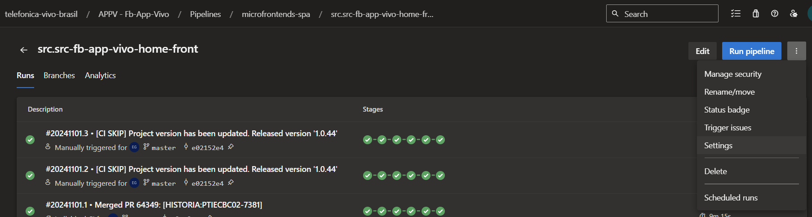
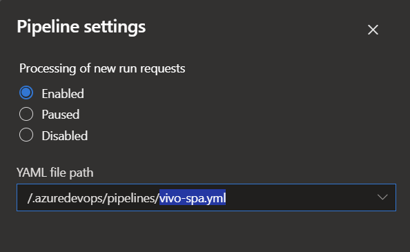
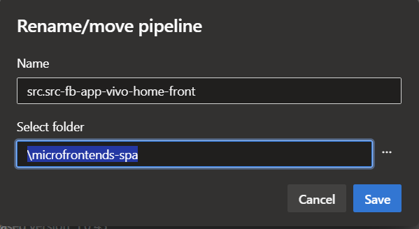

# Migração de pipeline buildpack para SPA
Nesta documentação você irá encontrar informações sobre como migrar uma pipeline de buildpack para uma pipeline de SPA.

Normalmente a pipeline pode ser migrada em 3 passos com a ajuda de outro projeto já migrado como referencia.

Para mais informações sobre a pipeline dos microfrontends SPA, visite a documentação [aqui](https://dev.azure.com/telefonica-vivo-brasil/MIGR-Framework-Brasil/_git/FrameworkBrasil.Pipelines?path=%2Ftech_products%2Fappv_node_vivo_spa%2FREADME.md&version=GBmaster&_a=preview) ou na [Wikicorp](https://wikicorp.telefonica.com.br/display/D4/Pipeline+modelo+Microfrontend+SPA)
## Alterar arquivo .yml da pipeline
Dentro da pasta ``.azuredevops`` localizada no repositório do projeto, altere o arquivo ``buildpack.yml``, substituindo seu conteúdo pelo referente a nova pipeline de SPA.

Renomeie o arquivo para ``vivo-spa.yml``

[Referência](https://dev.azure.com/telefonica-vivo-brasil/APPV%20-%20Fb-App-Vivo/_git/src.src-fb-app-vivo-home-front?version=GBmaster&path=/.azuredevops/pipelines/vivo-spa.yml)

## Adicionar váriaveis na Library
Adicione as variáveis necessárias para a pipeline no grupo de variáveis referente ao projeto.

[Referência](https://dev.azure.com/telefonica-vivo-brasil/APPV%20-%20Fb-App-Vivo/_library?itemType=VariableGroups&view=VariableGroupView&variableGroupId=11494&path=src.src-fb-app-vivo-home-front)

## Alterar a configuração da pipeline existente
No dashboard da pipeline a ser migrada, selecione ``Settings`` no menu adicional ao lado de ``Run pipeline``.

Na tela de configuração, altere o caminho do arquivo para ``vivo-spa.yml`` e salve.

No mesmo menu anterior, selecione ``Rename/move`` e altere a pasta da pipeline para ``\microfrontends-spa``.

