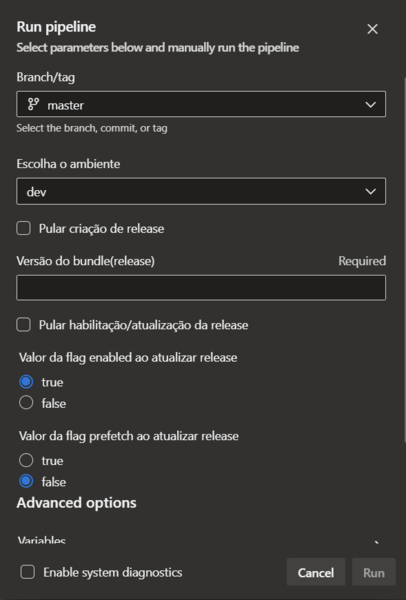
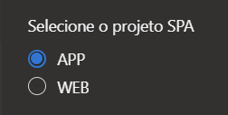
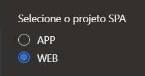
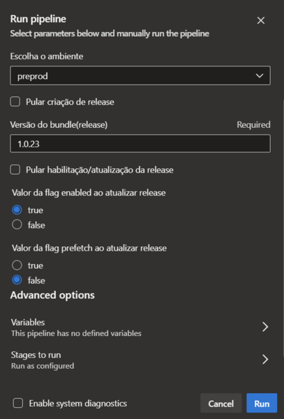
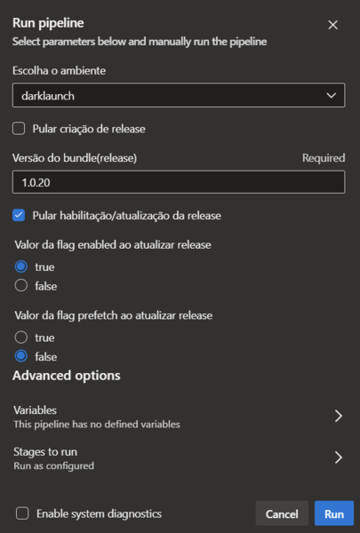
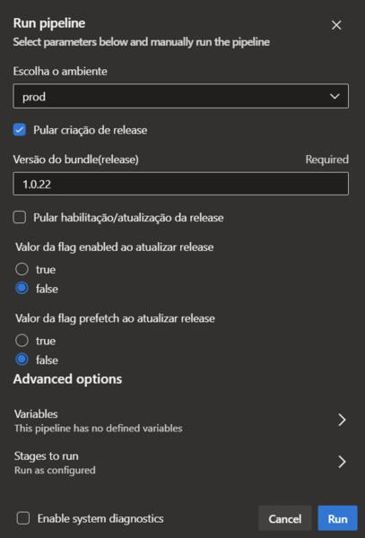

# Pipeline modelo Microfrontend SPA

Pipelines no modelo SPA diferem das demais ao incluir em seus stages a criação de módulo de microfrontend e release na API Route Orchestrator.

## Stages

Quando modificações são feitas na branch principal os stages da pipeline irão executar o fluxo completo automaticamente em ambiente dev.

### Build

No stage de **Build**, caso a pipeline seja executada devido a modificações na branch principal, o projeto terá sua versão acrescida no arquivo `package.json`. Em seguida é executado o build do projeto, gerando o bundle do Webpack. Além disso, pode ser executado os testes.

### Publish

No stage de **Publish**, o bundle gerado no **Build** será empacotado e publicado no repositório Nexus. O stage só será executado no fluxo automático, quando houver modificações na branch principal.

### Keycloak Auth

Neste stage, a pipeline fará uma requisição na API Keycloak para gerar um token JWT de autenticação. O token será usado para autenticar as requisições ao Route Orchestrator.

### Publish Release

No stage de **Publish Release**, o pacote salvo no repositório Nexus será baixado, desempacotado e seus arquivos serão salvos no Armazenamento de Blobs da Azure (Blob Storage) em um caminho referente a versão do bundle.

### Register Release

Neste stage, inicialmente ocorre a criação do módulo de microfrontend no Route Orchestrator. Caso o módulo já exista será usado o módulo existente.

A seguir, é criada uma release referente a versão do bundle. As releases são criadas desabilitadas por padrão. Por último, a release recém-criada é habilitada.

## Grupo de variáveis

O grupo de variáveis é o local onde são armazenadas as variáveis de ambiente e secrets que serão usadas na pipeline. As variáveis são usadas para armazenar valores que serão usados na execução da pipeline.

Cada repositório possui seu próprio grupo de variáveis listados na seção Library do Azure DevOps.

### Variáveis necessárias

Estas são as variáveis especificas para a execução da pipeline do modelo vivo SPA.

#### BUNDLE_NAME

Nome do bundle. É definido como o nome do projeto, seguindo o padrão de nomenclatura.

Exemplo: `framework-brasil-archetype-spa-front`, `fb-app-vivo-consumption-detail-front`.

#### BUNDLE_NEXUS_REPOSITORY

Nome do repositório Nexus onde o bundle será publicado. Valor padrão: `framework-brasil-npm` ou `fb-app-vivo-npm`.

#### BUNDLE_NEXUS_COMPONENT_GROUP

Nome do grupo de componentes do Nexus referente ao grupo do projeto. Valor padrão: `framework-brasil` ou `fb-app-vivo`.

#### KEYCLOAK_CLIENT_ID

ID do cliente Keycloak referente a pipeline. Valor padrão: `azure-pipeline`.

#### AZURE_STORAGE_CONTAINER_NAME

Nome do container do Azure Storage onde os bundles serão armazenados. Valor padrão: `fb-core`.

#### AZURE_STORAGE_CONTAINER_PREFIX_PATH

Prefixo do caminho onde os bundles serão armazenados. Valor padrão: `microfrontends`.

### Secrets necessários

Estas são os secrets necessários para a execução da pipeline do modelo vivo SPA.

#### KEYCLOAK_CLIENT_SECRET

Secret do cliente Keycloak. Cada ambiente possui uma variável de secret diferente.

##### KEYCLOAK_CLIENT_SECRET_DEV

##### KEYCLOAK_CLIENT_SECRET_PREPROD

##### KEYCLOAK_CLIENT_SECRET_DARKLAUNCH

##### KEYCLOAK_CLIENT_SECRET_PROD

#### AZURE_STORAGE_ACCOUNT_NAME

Nome da conta de armazenamento do Azure. Os ambientes de homologação(dev e preprod) e de produção(darklaunch e prod) possuem uma variável de secret diferente.

##### AZURE_STORAGE_ACCOUNT_NAME_PREPROD

##### AZURE_STORAGE_ACCOUNT_NAME_PROD

#### AZURE_STORAGE_ACCOUNT_KEY

Chave de acesso da conta de armazenamento do Azure. Os ambientes de homologação(dev e preprod) e de produção(darklaunch e prod) possuem uma variável de secret diferente.

##### AZURE_STORAGE_ACCOUNT_KEY_PREPROD

##### AZURE_STORAGE_ACCOUNT_KEY_PROD

## Variáveis de ambiente
As variáveis de ambiente ficam localizadas em arquivos no repositório do projeto, na pasta `envs`. 
Os arquivos são separados por ambiente: `.env.dev`, `.env.preprod`, `.env.darklaunch`, `.env.prod`.

### Parâmetros de query
Os parâmetros de query de uma release são definidos através de uma variável de ambiente em seu respectivo arquivo. Seu nome é `QUERY_PARAMS` e seu valor deve ser uma string, separando os parâmetros por vírgula (",").

Exemplo: `QUERY_PARAMS: "param1,param2"`, `QUERY_PARAMS: "param1"`.

## Exemplo de módulo microfrontend com release

<details>
<summary>Release habilitada</summary>
<br>

```json
{
  "_id": "66509b8895e94262fac91453",
  "name": "framework-brasil-archetype-spa-front",
  "path": "/archetype-spa/*",
  "static_files_repository": "https://preframeworkbrasilsa.telefonicabigdata.com/fb-core/microfrontends/framework-brasil-archetype-spa-front",
  "createdAt": "2024-05-24T13:52:08.291Z",
  "updatedAt": "2024-05-24T13:52:08.291Z",
  "__v": 0,
  "releases": [
    {
      "_id": "6686f1913a22a1f6971bcc7c",
      "microfrontend_id": "66509b8895e94262fac91453",
      "version": "1.0.19",
      "remote_entry_fileName": "framework_brasil_archetype_spa_frontRemoteEntry.617638306.js",
      "scope": "framework_brasil_archetype_spa_front",
      "module_expose": "./App",
      "cache": false,
      "enabled": true,
      "prefetch": false,
      "params": ["param1", "param2"],
      "files": [
        "https://preframeworkbrasilsa.telefonicabigdata.com/fb-core/microfrontends/framework-brasil-archetype-spa-front/1.0.19/198.framework_brasil_archetype_spa_front.281f9eddc.js",
        "https://preframeworkbrasilsa.telefonicabigdata.com/fb-core/microfrontends/framework-brasil-archetype-spa-front/1.0.19/212.framework_brasil_archetype_spa_front.4b506c021.js",
        "https://preframeworkbrasilsa.telefonicabigdata.com/fb-core/microfrontends/framework-brasil-archetype-spa-front/1.0.19/212.framework_brasil_archetype_spa_front.5efa399d1.css",
        "https://preframeworkbrasilsa.telefonicabigdata.com/fb-core/microfrontends/framework-brasil-archetype-spa-front/1.0.19/355.framework_brasil_archetype_spa_front.4466d06bb.css",
        "https://preframeworkbrasilsa.telefonicabigdata.com/fb-core/microfrontends/framework-brasil-archetype-spa-front/1.0.19/355.framework_brasil_archetype_spa_front.d7fea64f0.js",
        "https://preframeworkbrasilsa.telefonicabigdata.com/fb-core/microfrontends/framework-brasil-archetype-spa-front/1.0.19/framework_brasil_archetype_spa_front.db4c76be6.js",
        "https://preframeworkbrasilsa.telefonicabigdata.com/fb-core/microfrontends/framework-brasil-archetype-spa-front/1.0.19/framework_brasil_archetype_spa_frontRemoteEntry.617638306.js"
      ],
      "envs": {
        "NODE_ENV": "production",
        "ROUTER_BASE_URL": "/vivo-spa/archetype-spa",
        "BFF_BASE_URL": "https://dev-app.vivo.com.br/bff/archetype-spa",
        "FAKE_API": "https://jsonplaceholder.typicode.com/photos",
        "SESSION_COOKIE_NAME": "fbSessionIdDev",
        "CALLBACK_URL_COOKIE_NAME": "fbCallbackUrlDev",
        "TEST": "1.0.19",
        "QUERY_PARAMS":"param1,param2"
      },
      "createdAt": "2024-07-04T19:01:37.980Z",
      "updatedAt": "2024-07-04T19:01:51.919Z",
      "__v": 0
    }
  ]
}
```

</details>

## Execução manual

Ao executar a pipeline manualmente é possível selecionar quais stages serão executados através dos parâmetros. Particularmente util caso precise executar partes individuais da pipeline ou em outro ambiente.



Parâmetros padrão da pipeline.

### Parâmetros

Parâmetros usados na execução da pipeline.

#### Projeto SPA

Seleção do projeto SPA em que o microfrontend será criado. `WEB` ou `APP`.

Caso o parametro não esteja presente no painel, a pipeline usará o valor padrão `APP`.

#### Ambiente

Escolha do ambiente onde será executada a pipeline. O ambiente selecionado irá definir as variáveis de ambiente e secrets que serão usadas na execução da pipeline. Por padrão, a pipeline é executada no ambiente dev.

#### Pular criação de release

Quando habilitado, a pipeline não irá realizar o stage de **Publish Release** e a criação da release no stage **Register Release**

#### Versão do bundle(release)

Parâmetro onde é inserido a versão do bundle/release. Para execuções que envolvem criar ou atualizar releases é necessário inserir a versão a ser utilizada.

#### Pular habilitação/atualização da release

Quando habilitado, a pipeline não irá realizar a habilitação da release no stage **Register Release**

#### Valor da flag enabled ao atualizar release

Este parâmetro é usado para escolher o valor da propriedade `enabled` no objeto da release. É usado para habilitar ou desabilitar a release. Por padrão, o valor é `true`.

#### Valor da flag prefetch ao atualizar release

Este parâmetro é usado para escolher o valor da propriedade `prefetch` no objeto da release. Por padrão, o valor é `false`.

### Exemplos de execução manual
***IMPORTANTE**: Sempre certifique-se de que o fluxo automático foi executado com sucesso e a versão do bundle foi publicada no Nexus antes de executar a pipeline manualmente em outros ambientes.*

#### Criação de release no SPA (APP)
Para criar uma release no Vivo-SPA do App, selecione `APP` no campo `Selecione o projeto SPA`.



#### Criação de release no SPA (WEB)
Para criar uma release no Vivo-SPA do Web Essentials, selecione `WEB` no campo `Selecione o projeto SPA`.



#### Criação de release em outros ambientes
Para criar uma release em determinado ambiente, é necessário selecionar o ambiente desejado e inserir a versão do bundle/release.



#### Habilitação/atualização de release já existente
Para habilitar ou atualizar uma release já existente, é necessário selecionar o ambiente desejado, inserir a versão do bundle/release e desabilitar a criação de release marcando o campo `Pular criação de release`. Para que a release seja habilitada, o `Valor da flag enabled ao atualizar release` deve ser `true`.


#### Criação de release sem habilitação
Para criar uma release sem habilitá-la, é necessário selecionar o ambiente desejado, inserir a versão do bundle/release e desabilitar a habilitação da release marcando o campo `Pular habilitação/atualização da release`. Nesse caso, ambos os campos `Valor da flag enabled ao atualizar release` e `Valor da flag prefetch ao atualizar release` não fazem diferença na execução da pipeline.



#### Desabilitar uma release
Para desabilitar uma release, é necessário selecionar o ambiente desejado, inserir a versão do bundle/release e desabilitar a criação de release marcando o campo `Pular criação de release`. Para desabilitar a release, o `Valor da flag enabled ao atualizar release` deve ser `false`.

