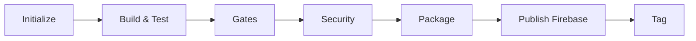
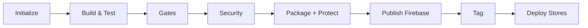

# Pipelines CI/CD para Flutter - Vivo+

## Introdução
Este repositório contém definições de pipelines do Azure DevOps para compilar, testar, proteger e implantar aplicações Flutter para Vivo+. As pipelines suportam as plataformas Android e iOS em múltiplos ambientes (preprod e producao) e incluem scanners de segurança, proteção do app e publicação em lojas.

## Iniciando
Estas pipelines foram projetadas para compilar e implantar aplicações Flutter por meio de um processo completo de CI/CD. Para utilizá-las no seu projeto Flutter:

1. Configure os grupos de variáveis correspondentes no Azure DevOps
2. Adicione a referência ao YAML da pipeline no seu repositório

## Arquitetura da Pipeline

A pipeline Flutter está organizada em **8 stages principais**, cada um com responsabilidades específicas:

### 📋 1. Initialize (Inicialização)
- **Propósito**: Configuração inicial da pipeline e definição de variáveis de ambiente
- **Funcionalidades**:
  - Carregamento de variáveis específicas do ambiente (preprod e producao)
  - Configuração de parâmetros globais da aplicação
  - Validação de pré-requisitos

### 🔨 2. Build & Test (Compilação e Testes)
- **Propósito**: Compilação do código Flutter e execução de testes unitários
- **Funcionalidades**:
  - Configuração do ambiente Flutter (versão específica ou última disponível)
  - Resolução de dependências (`flutter pub get`)
  - Execução de testes unitários e de integração
  - Análise de cobertura de código
  - Geração de relatórios de build

### 🚪 3. Gates (Portões de Qualidade)
- **Propósito**: Validação de critérios de qualidade antes do prosseguimento
- **Funcionalidades**:
  - Validação de cobertura de testes mínima
  - Verificação de breaking changes
  - Aprovações manuais quando necessário
  - Validação de compliance corporativo

### 🔒 4. Security (Segurança)
- **Propósito**: Análise de segurança e vulnerabilidades
- **Funcionalidades**:
  - Scan de vulnerabilidades com Fortify
  - Análise de dependências
  - Verificação de secrets expostos
  - Validação de configurações de segurança

### 📦 5. Package (Empacotamento)
Este é o stage mais complexo, responsável pela geração dos pacotes para distribuição:

#### **Android Packaging**
- **APK Generation**: 
  - Configuração de ambiente específico (preprod e producao)
  - Download de certificados e keystores seguros
  - Build do APK com `flutter build apk`
  - Assinatura digital com certificados da Vivo+

- **Configuração dos arquivos para publicação Firebase (Android)**:
  - Configuração dos arquivos para publicação firebase (preprod e producao):
    - google-services.json
    - firebase_options.dart
  - Recuperação dos arquivos da Library (Secure File)
  - Definição de variáveis de ambiente necessárias para a publicação

- **Proteção Arxan (Android)**:
  - Aplicação da proteção Arxan quando `skip_protect = False`
  - Download e configuração do Arxan protect-android v6.3.0
  - Configuração de blueprint específico por ambiente
  - Geração de APK protegido com ofuscação avançada
  - Re-assinatura do APK protegido

- **AAB Generation** (para Google Play):
  - Build do Android App Bundle (`flutter build appbundle`)
  - Assinatura com certificados de produção
  - Otimização para distribuição na Google Play Store

#### **iOS Packaging**
- **IPA Generation**:
  - Configuração de certificados Apple Developer
  - Configuração de Provisioning Profiles
  - Build com `flutter build ios`
  - Assinatura manual com Xcode

- **Configuração de arquivos para publicação Firebase (iOS)**:
  - Configuração dos arquivos para publicação firebase (preprod e producao)
    - firebase_app_id_file.json
    - GoogleService-Info.plist
    - firebase_options.dart
  - Recuperação dos arquivos da Library (Secure File)
  - Definição de variáveis de ambiente necessárias para a publicação

- **Proteção EnsureIT (iOS)**:
  - Aplicação da proteção EnsureIT quando habilitada
  - Configuração de GUARD_SPEC_SETTINGS
  - Aplicação de flags de compilação específicas (ENSUREIT_COMPILE_FLAG)
  - Configuração de Release.xcconfig protegido
  - Proteção contra reverse engineering e tampering

- **Archive e Export**:
  - Criação de arquivo .xcarchive
  - Export para IPA assinado para distribuição

### 📤 6. Publish (Publicação Firebase)
- **Propósito**: Distribuição para testes via Firebase App Distribution
- **Funcionalidades Android**:
  - Upload de APK/AAB para Firebase App Distribution
  - Configuração de grupos de testadores Android
  - Geração automática de release notes
  - Notificação para testadores

- **Funcionalidades iOS**:
  - Upload de IPA para Firebase App Distribution  
  - Configuração de grupos de testadores iOS
  - Integração com TestFlight para testes internos

### 🏷️ 7. Tag (Marcação)
- **Propósito**: Criação de tags Git para controle de versão
- **Funcionalidades**:
  - Criação automática de tags baseadas no build number
  - Marcação de releases de produção
  - Histórico de versões para rollback

### 🚀 8. Deploy (Implantação em Lojas)
Stage final responsável pela publicação nas lojas oficiais:

#### **Google Play Store (Android)**
- **Internal Track**: Upload automático do AAB para track interno
- **Promoção BSIM**: Promoção automática para grupos de testadores externos quando `skip_promote = False`
- **Configuração**: Usa service connection 'GooglePlay' configurada no Azure DevOps
- **Requisitos**: Executa apenas para environments 'release' e 'producao' com tags apropriadas

#### **Apple App Store (iOS)**
- **TestFlight**: Upload automático do IPA para TestFlight
- **External Testing**: Distribuição para testadores externos quando habilitado
- **API Integration**: Usa App Store Connect API para automação completa
- **Configuração**: Requer API Key, Issuer ID e App Specific ID configurados

## Tipos de Pacotes Gerados

### 📱 **Android**
1. **APK (Firebase)**: Para distribuição via Firebase App Distribution
   - Arquivo: `{APP_FILE_NAME_ANDROID}.apk`
   - Com/sem proteção Arxan dependendo da configuração
   - Usado para testes internos e homologação

2. **AAB (Google Play)**: Para publicação na Google Play Store
   - Arquivo: `{APP_FILE_NAME_ANDROID}.aab` 
   - Sempre com proteção Arxan em produção
   - Formato otimizado para distribuição na loja

### 🍎 **iOS**
1. **IPA (Firebase)**: Para distribuição via Firebase App Distribution
   - Arquivo: `{APP_FILE_NAME_IOS}.ipa`
   - Com/sem proteção EnsureIT dependendo da configuração
   - Usado para testes internos

2. **IPA (App Store)**: Para publicação na Apple App Store
   - Arquivo: `{APP_FILE_NAME_IOS}.ipa`
   - Sempre com proteção EnsureIT em produção
   - Upload automático para TestFlight

## Proteções de Segurança

### 🛡️ **Arxan (Android)**
- **Quando aplicada**: Ambientes release e producao, ou quando `skip_protect = False`
- **Funcionalidades**:
  - Ofuscação avançada de código
  - Proteção contra reverse engineering
  - Anti-tampering e anti-debugging
  - Detecção de ambiente comprometido (root/emulação)

### 🔐 **EnsureIT (iOS)**
- **Quando aplicada**: Ambientes release e producao
- **Funcionalidades**:
  - Proteção de runtime da aplicação
  - Anti-tampering e jailbreak detection
  - Proteção de APIs críticas
  - Ofuscação de strings e métodos sensíveis

## Ambientes Suportados

A pipeline suporte 2 ambientes distintos:

| Ambiente | Descrição | Proteção | Distribuição |
|----------|-----------|----------|--------------|
| **preprod** | Pré-produção/Homologação | Opcional | Firebase + TestFlight |
| **producao** | Produção | Sempre | Firebase + Lojas |

### Exemplo de Configuração de Pipeline Flutter App

```yaml
# Exemplo de pipeline para um App Flutter

trigger:
  branches:
    include:
      - develop
      - release
      - master
      - main
  paths:
    include:
      - "*"
    exclude:
      - config/*
      - .azuredevops/*
      - docs/*
      - catalog-info.yaml

parameters:
  - name: qa_environment
    displayName: Escolha a esteira de QA para para deploy
    type: string
    default: preprod
    values:
      - preprod
      - release
      - producao

  - name: target
    displayName: Escolha o target para deploy
    type: string
    default: both
    values:
      - android
      - ios
      - both

  - name: firebase_groups_android
    displayName: Escolha o grupo de testadores Android no firebase
    values:
      - "android"
      - "mobilidade-android"
    default: "android"

  - name: firebase_groups_ios
    displayName: Escolha o grupo de testadores iOS no firebase
    values:
      - "ios"
      - "mobilidade-ios"
    default: "ios"

  - name: skip_signing
    displayName: Skip Signing para a branch develop?
    values:
      - True
      - False
    default: False

  - name: skip_protect
    displayName: Skip Proteção Arxan?
    values:
      - True
      - False
    default: True

  - name: skip_promote
    displayName: Skip Promoção BSIM?
    values:
      - True
      - False
    default: True

  - name: use_flutter_version_latest
    displayName: Usar Última Versão Flutter?
    values:
      - True
      - False
    default: True

  - name: release_notes
    displayName: Descreva um resumo da release
    default: "Resumo das mudanças: \n - Nova funcionalidade X.\n - Correção de bug Y."

resources:
  repositories:
    - repository: CodePlayPipelines
      name: DevOps/Vivo.CodePlay.Pipelines
      type: git
      ref: refs/heads/feature/appv-flutter-app
      #ref: master
      endpoint: CodePlay

extends:
  template: /tech_products/appv/flutter/pipeline_flutter_app.yml@CodePlayPipelines
  parameters:
    qa_environment: "${{parameters.qa_environment}}"
    target: "${{parameters.target}}"
    release_notes: "${{parameters.release_notes}}"
    firebase_groups_android: "${{parameters.firebase_groups_android}}"
    firebase_groups_ios: "${{parameters.firebase_groups_ios}}"
    skip_signing: "${{parameters.skip_signing}}"
    skip_protect: "${{parameters.skip_protect}}"
    skip_promote: "${{parameters.skip_promote}}"
    use_flutter_version_latest: "${{parameters.use_flutter_version_latest}}"

```

## Parâmetros da Pipeline

A pipeline aceita os seguintes parâmetros de configuração:

### 🎯 **qa_environment**
- **Descrição**: Define o ambiente de destino da pipeline
- **Valores**: `preprod`, `release`, `producao`
- **Padrão**: `preprod`
- **Impacto**: Determina configurações de build, certificados e destinos de deploy

### 📱 **target** 
- **Descrição**: Define quais plataformas serão buildadas
- **Valores**: `android`, `ios`, `both`
- **Padrão**: `both`
- **Impacto**: Controla execução dos jobs de packaging para cada plataforma

### 👥 **firebase_groups_android/ios**
- **Descrição**: Grupos de testadores no Firebase App Distribution
- **Valores Android**: `android`, `mobilidade-android`
- **Valores iOS**: `ios`, `mobilidade-ios`
- **Padrão**: `android`/`ios`
- **Impacto**: Define quem receberá notificações de novas versões

### ✍️ **skip_signing**
- **Descrição**: Pula assinatura de código (apenas para develop/branches de feature)
- **Valores**: `True`, `False`
- **Padrão**: `False`
- **Impacto**: Build em modo profile ao invés de release

### 🛡️ **skip_protect**
- **Descrição**: Pula aplicação das proteções Arxan/EnsureIT
- **Valores**: `True`, `False`
- **Padrão**: `True`
- **Impacto**: Controla aplicação de proteções de segurança

### 🚀 **skip_promote**
- **Descrição**: Pula promoção automática para testadores externos (BSIM)
- **Valores**: `True`, `False`
- **Padrão**: `True`
- **Impacto**: Controla distribuição para grupos de teste externos

### 🔄 **use_flutter_version_latest**
- **Descrição**: Usa a versão mais recente do Flutter disponível
- **Valores**: `True`, `False`
- **Padrão**: `True`
- **Impacto**: Define se usa Flutter latest ou versão fixa (3.35)

### 📝 **release_notes**
- **Descrição**: Notas da release para distribuição
- **Tipo**: String multilinha
- **Padrão**: Template padrão com funcionalidades e correções
- **Impacto**: Texto exibido em Firebase e TestFlight

## Fluxo de Execução por Ambiente

### 🧪 **Preprod (Testes)**


### 🚀 **Release/Producao (Lojas)**


## Variáveis de Ambiente Requeridas

### 🔐 **Azure Key Vault**
- `ANDROID-SIGNING-KEY-JKS`: Keystore Android
- `ANDROID-SIGNING-KEY-PASSWORD`: Senha da chave Android
- `ANDROID-SIGNING-STORE-PASSWORD`: Senha do keystore Android
- `IOS-TESTFLIGHT-API-KEY-ID`: ID da chave App Store Connect
- `IOS-TESTFLIGHT-API-ISSUER`: Issuer ID App Store Connect
- `IOS-TESTFLIGHT-API-TOKEN`: Token da API App Store Connect

### 📄 **Secure Files**
- `key.properties`: Propriedades da chave Android
- `key.jks`: Keystore Android
- Certificados por ambiente (cert.crt, private.pem)
- Firebase configuration files
- Provisioning profiles iOS
- Certificados P12 iOS

### 🏪 **Service Connections**
- `GooglePlay`: Conexão com Google Play Console
- `DevOpsSharedResources`: Azure subscription para Key Vault

## Troubleshooting

### ❌ **Problemas Comuns**

#### Build Falha no Android
- **Sintoma**: Erro de assinatura ou keystore não encontrado
- **Solução**: Verificar se secure files estão configurados corretamente
- **Comando**: Verificar logs de download dos secure files

#### Build Falha no iOS  
- **Sintoma**: Certificate/Provisioning profile inválido
- **Solução**: Renovar certificados no Apple Developer Portal
- **Comando**: Verificar UUID do provisioning profile

#### Proteção Arxan Falha
- **Sintoma**: License token inválido ou blueprint não encontrado
- **Solução**: Verificar configuração ARXAN_LICENSE_TOKEN
- **Comando**: Verificar logs do protect-android

#### Firebase Upload Falha
- **Sintoma**: App ID não encontrado ou credenciais inválidas  
- **Solução**: Verificar FIREBASE_KEY_FILE_NAME e App IDs
- **Comando**: Validar arquivo de credenciais Firebase

## Monitoramento e Métricas

A pipeline inclui métricas de performance para otimização:

- **Cache Effectiveness**: Eficiência do cache de dependências
- **Build Duration**: Duração de cada stage
- **Agent Performance**: Utilização de recursos do agent
- **Success Rate**: Taxa de sucesso por ambiente

## Suporte

Para dúvidas ou problemas com a pipeline:

1. **Documentação Técnica**: Consulte os templates individuais em `/tech_products/appv/flutter/templates/`
2. **Logs**: Analise os logs detalhados de cada stage no Azure DevOps
3. **Suporte**: Entre em contato com a equipe Appv

---

*Última atualização: Dezembro 2024*
*Versão da documentação: 2.0*

### Exemplo de Configuração de Pipeline Lib Flutter

```yaml
# Exemplo de pipeline para uma lib Flutter

trigger:
  branches:
```yaml
# Exemplo de pipeline para uma lib Flutter

trigger:
  branches:
    include:
    - master
    - feature/*
    - fix/*
    - refactor/*
  paths:
    exclude:
    - .azuredevops/*
    - CHANGELOG.md
    
pr:
- master

parameters:
- name: bump_version
  displayName: Informe a versão
  type: string
  default: "1.0.0"

- name: bump_message
  displayName: Informe a mensagem dessa versão
  type: string
  default: "feat!: Message"

- name: use_flutter_version_latest
  displayName: Usar Última Versão Flutter?
  values:
    - True
    - False
  default: True

resources:
  repositories:
    - repository: CodePlayPipelines
      name: DevOps/Vivo.CodePlay.Pipelines
      type: git
      # ref: master
      ref: refs/heads/feature/appv-flutter-lib
      endpoint: CodePlay

extends:
  template: /tech_products/appv/flutter/pipeline_flutter_lib.yml@CodePlayPipelines
  parameters:
    bump_version: "${{parameters.bump_version}}"
    bump_message: "${{parameters.bump_message}}"
    use_flutter_version_latest: "${{parameters.use_flutter_version_latest}}"

```

### Exemplo de Configuração de Pipeline Flutter Web

```yaml
# Exemplo de pipeline para um web Flutter

trigger:
  branches:
    include:
    - master
    - feature/*
    - fix/*
    - refactor/*
  paths:
    exclude:
    - .azuredevops/*
    - CHANGELOG.md
    
pr:
- master

parameters:
- name: bump_version
  displayName: Informe a versão
  type: string
  default: "1.0.0"

- name: bump_message
  displayName: Informe a mensagem dessa versão
  type: string
  default: "feat!: Message"

- name: use_flutter_version_latest
  displayName: Usar Última Versão Flutter?
  values:
    - True
    - False
  default: True

resources:
  repositories:
    - repository: CodePlayPipelines
      name: DevOps/Vivo.CodePlay.Pipelines
      type: git
      #ref: master
      ref: refs/heads/feature/appv-flutter-web
      endpoint: CodePlay

extends:
  template: /tech_products/appv/flutter/pipeline_flutter_web.yml@CodePlayPipelines
  parameters:
    bump_version: "${{parameters.bump_version}}"
    bump_message: "${{parameters.bump_message}}"  
    use_flutter_version_latest: "${{parameters.use_flutter_version_latest}}"

```

## Estrutura de Pastas
A seguir a estrutura principal de diretórios e arquivos deste projeto:

```
.
├── README.md
├── CONTRIBUTING.md
├── tech_products
│   ├── appv
│   │   ├── README.md
│   │   ├── CONTRIBUTING.md
│   │   ├── pipeline_flutter_app.yml
│   │   ├── pipeline_flutter_lib.yml
│   │   ├── pipeline_flutter_lib_tag.yml
│   │   ├── pipeline_flutter_web.yml
│   │   ├── initialize
│   │   │   ├── pipeline_init_flutter_app.yml
│   │   │   ├── pipeline_init_flutter_web.yml
│   │   │   ├── variables_flutter_app.yml
│   │   │   ├── variables_flutter_lib.yml
│   │   │   ├── variables_flutter_web.yml
│   │   │   └── variables_global.yml
│   │   └── templates
│   │       ├── cd
│   │       │   └── cd_deploy_flutter_app.yml
│   │       └── ci
│   │           ├── ci_build_flutter_app.yml
│   │           ├── ci_build_flutter_lib.yml
│   │           ├── ci_build_flutter_web.yml
│   │           ├── ci_gates_flutter_app.yml
│   │           ├── ci_gates_flutter_lib.yml
│   │           ├── ci_gates_flutter_web.yml
│   │           ├── ci_package_flutter_app.yml
│   │           ├── ci_package_flutter_web.yml
│   │           ├── ci_publish_flutter_app.yml
│   │           ├── ci_publish_flutter_web.yml
│   │           ├── ci_security_flutter_app.yml
│   │           ├── ci_security_flutter_lib.yml
│   │           ├── ci_security_flutter_web.yml
│   │           └── ci_tag_flutter_app.yml
│   │           └── ci_tag_flutter_lib.yml
│   │           └── ci_tag_flutter_web.yml

```

## Contribuir
Para informações mais detalhadas sobre como contribuir para este projeto, consulte nosso arquivo [CONTRIBUTING.md](CONTRIBUTING.md).

Para mais informações sobre como criar bons arquivos README, consulte as [diretrizes](https://docs.microsoft.com/azure/devops/repos/git/create-a-readme?view=azure-devops). 