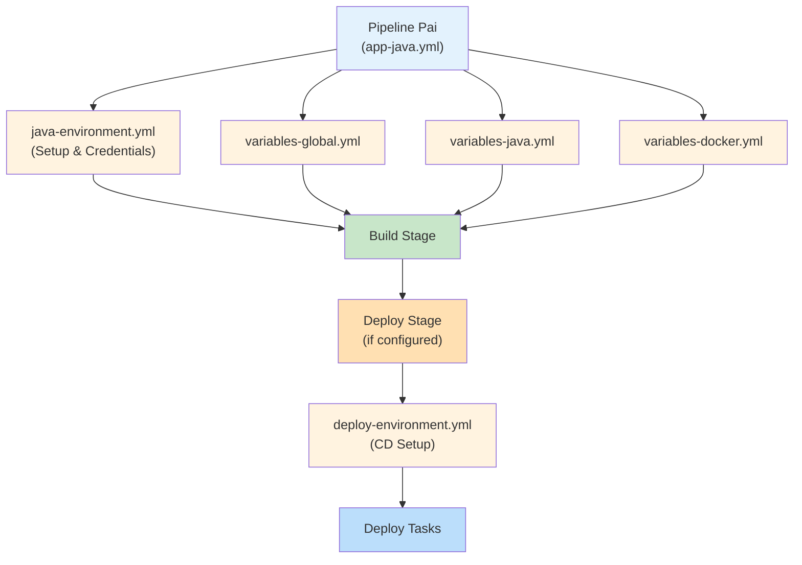

# Initialize - Templates de Configuração e Inicialização

Templates reutilizáveis para configuração de ambientes, variáveis e inicialização de pipelines CI/CD do AppV.

## 🎯 Descrição

O diretório `initialize` contém templates de **configuração inicial** e **setup de ambiente** utilizados por todos os pipelines da arquitetura AppV. Inclui:

- **Templates de Stage**: Estágios de inicialização para CI e CD que configuram credenciais, variáveis e ambiente
- **Templates de Variáveis**: Arquivos de variáveis reutilizáveis que definem configurações específicas por tecnologia e ambiente
- **Deploy Environment**: Configurações de ambiente para deploy em diferentes contexts
- **Nomeação e Tagging**: Convenções de nomenclatura e tags de build

Todos os templates seguem o padrão **template-based** do Azure DevOps, permitindo composição limpa e reutilização em múltiplos pipelines.

---

## 📋 Templates Disponíveis

### 🔧 Environment Initialization Stages

Estes templates definem estágios completos de inicialização que devem ser incluídos **no início** dos pipelines.

#### `java-environment.yml`

**Tipo**: Stage de inicialização CI
**Propósito**: Prepara ambiente específico para builds Java

**Responsabilidades**:
- 🔧 Checkout do código-fonte com submodules
- 🔐 Recuperação de credenciais Nexus do Azure Key Vault
- 📝 Inicialização de variáveis Nexus
- 🏷️ Setup de configurações Catalog-Info
- ✅ Validação de credenciais

**Inclusão no Pipeline**:
```yaml
stages:
- template: /tech_products/appv/global/initialize/java-environment.yml
```

**Saída de Variáveis**:
- `NEXUS_DEPS_USR`: Usuário para download de dependências
- `NEXUS_DEPS_PSW`: Senha para download de dependências  
- `NEXUS_DEFAULT_USR`: Usuário para upload de artefatos
- `NEXUS_DEFAULT_PSW`: Senha para upload de artefatos

#### `nodejs-environment.yml`

**Tipo**: Stage de inicialização CI
**Propósito**: Prepara ambiente específico para builds Node.js

**Responsabilidades**:
- 🔧 Checkout do código-fonte
- 🔐 Recuperação de credenciais Nexus e NPM do Azure Key Vault
- 📝 Inicialização de variáveis NPM
- ✅ Validação de ferramentas Node.js

**Inclusão no Pipeline**:
```yaml
stages:
- template: /tech_products/appv/global/initialize/nodejs-environment.yml
```

#### `deploy-environment.yml`

**Tipo**: Stage de inicialização CD (non-prod)
**Propósito**: Configura ambiente de deploy para ambientes não-produção

**Responsabilidades**:
- 🔐 Recuperação de credenciais Helm (Nexus ou ACR)
- 🐳 Recuperação de credenciais Docker Registry
- 📝 Mapeamento de credenciais para variáveis de ambiente
- ✅ Validação de acesso a registries

**Inclusão no Pipeline**:
```yaml
stages:
- template: /tech_products/appv/global/initialize/deploy-environment.yml
```

**Credenciais Recuperadas**:
- Helm Registry (Nexus ou ACR conforme `HELM_REGISTRY_ACR_ENABLED`)
- Docker Registry

#### `deploy-environment_prod.yml`

**Tipo**: Stage de inicialização CD (prod)
**Propósito**: Configura ambiente de deploy para produção com segurança reforçada

**Responsabilidades**:
- 🔐 Recuperação de credenciais Helm para produção
- 🐳 Recuperação de credenciais Docker Registry produção
- 📝 Mapeamento de credenciais com isSecret=true
- ✅ Validação de acesso com retry automático

**Inclusão no Pipeline**:
```yaml
stages:
- template: /tech_products/appv/global/initialize/deploy-environment_prod.yml
```

**Diferenças vs deploy-environment.yml**:
- ✅ Credenciais marcadas como secretas no output
- ✅ Configuração específica para produção
- ⚠️ Sem checkout (pull-only mode)

#### `gates-environment.yml`

**Tipo**: Stage de inicialização CD
**Propósito**: Configura environment para gates de validação e segurança

**Responsabilidades**:
- 🔒 Setup de gates de qualidade
- 🔐 Recuperação de credenciais para ferramentas de gates
- 📊 Configuração de thresholds de validação

**Inclusão no Pipeline**:
```yaml
stages:
- template: /tech_products/appv/global/initialize/gates-environment.yml
```

---

### 📦 Variable Templates

Templates de variáveis que definem constantes e configurações reutilizáveis.

#### `variables-global.yml`

**Propósito**: Variáveis compartilhadas por todos os pipelines AppV

**Variáveis Principais**:

| Variável | Valor | Uso |
|----------|-------|-----|
| `DEFAULT_WORKDIR_ARTIFACTS` | `$(System.ArtifactsDirectory)/extracted_tars` | Diretório padrão para artefatos extraídos |
| `DEFAULT_WORKDIR_DOCKER_ARTIFACTS` | `$(System.ArtifactsDirectory)/docker` | Diretório para artefatos Docker |
| `DEFAULT_MAX_MEMORY_BUILD` | `4096m` | Limite máximo de memória para build |
| `NEXUS_ENDPOINT_API_REPOSITORY` | `https://nexus.telefonica.com.br/service/rest/v1` | Endpoint API do Nexus |
| `NEXUS_REPOSITORY_URL` | `https://nexus.telefonica.com.br/repository` | Base URL do Nexus |
| `SENTINELS_ENDPOINT_URL` | `https://pre-framework-brasil-ingress.telefonicabigdata.com/dev/ms/sentinels/azure/changelog` | Endpoint para notificações de changelog |
| `DEPLOY_ENVIRONMENT_PROD` | `deploy-prod` | Identificador de ambiente produção |
| `DEFAULT_BFF_CHART_VERSION_PROD` | `1.0.41` | Versão padrão do Helm Chart BFF em prod |
| `DEFAULT_FRONT_CHART_VERSION_PROD` | `1.0.28` | Versão padrão do Helm Chart Front em prod |

**Inclusão no Pipeline**:
```yaml
variables:
- template: /tech_products/appv/global/initialize/variables-global.yml
```

#### `variables-java.yml`

**Propósito**: Variáveis específicas para builds Java/Maven

**Variáveis Principais**:

| Variável | Valor Padrão | Descrição |
|----------|-------------|-----------|
| `JAVA_CMD_BUILD` | `mvn clean install` | Comando Maven para build |
| `JAVA_CMD_BUILD_TEST` | `test` | Comando para executar testes |
| `JAVA_CMD_OPTIONAL` | `` | Comando Maven opcional (customizável) |
| `MAVEN_CACHE_FOLDER` | `$HOME/.m2/repository` | Cache local do Maven |
| `MAVEN_OPTS` | `-Dmaven.repo.local=$(MAVEN_CACHE_FOLDER)` | Opções padrão do Maven |
| `DEFAULT_MAVEN_SETTINGS` | `$HOME/.m2/settings.xml` | Localização de settings.xml |
| `MAVEN_CUSTOM_SETTINGS_SECURE_FILE` | `` | Arquivo de settings seguro (opcional) |
| `JAVA_VERSION_PUBLISH_MVN` | `openjdk-11.0.2` | Versão Java para publish |

**Comandos Docker para Extração de POM**:

O template inclui variáveis que usam Docker para extrair informações do `pom.xml`:

- `DOCKER_CMD_EXTRACT_POM_XML_VERSION`: Extrai versão do projeto
- `DOCKER_CMD_EXTRACT_POM_XML_JAVA_VERSION`: Extrai versão Java configurada
- `DOCKER_CMD_EXTRACT_ARTIFACT_ID`: Extrai ID do artefato
- `DOCKER_CMD_EXTRACT_GROUP_ID`: Extrai ID do grupo
- `DOCKER_CMD_EXTRACT_POM_XML_MODULES`: Lista módulos do projeto
- `DOCKER_CMD_EXTRACT_POM_XML_DEPENDENCY`: Lista dependências

**Inclusão no Pipeline**:
```yaml
variables:
- template: /tech_products/appv/global/initialize/variables-java.yml
```

#### `variables-docker.yml`

**Propósito**: Configurações de Docker Registry

**Variáveis**:

| Variável | Valor | Uso |
|----------|-------|-----|
| `DOCKER_REGISTRY` | `vcr-docker.nexus.telefonica.com.br` | Registry Docker principal |
| `DOCKER_SERVICE_CONNECTION` | `ACR-DEVOPS` | Service Connection para ACR |
| `DOCKER_REGISTRY_EMAIL` | `arquiteturati@telefonica.com.br` | Email de contato |
| `DOCKER_CMD_USERNAME` | `$(id -u)` | UID do usuário do container |
| `DOCKER_CMD_GROUP` | `$(id -g)` | GID do grupo do container |

**Inclusão no Pipeline**:
```yaml
variables:
- template: /tech_products/appv/global/initialize/variables-docker.yml
```

#### `variables-gates.yml`

**Propósito**: Configurações de gates de validação e qualidade

**Inclusão no Pipeline**:
```yaml
variables:
- template: /tech_products/appv/global/initialize/variables-gates.yml
```

#### `variables-argocd.yml`

**Propósito**: Configurações dinâmicas de ArgoCD baseadas em ambiente

**Parâmetros**:
- `setEnvironment`: Ambiente-alvo para ArgoCD (dev, staging, prod, prod-front, prod-bff, etc). Determina qual conjunto de credenciais de ArgoCD será utilizado (PROD vs PREPROD)

**Lógica Condicional**:

Define credenciais de ArgoCD dinamicamente baseado no environment:

- **Produção** (`prod`, `prod-front`, `prod-bff`, etc): Usa credenciais `_PROD`
- **Pré-Produção** (demais ambientes): Usa credenciais `_PREPROD`

**Variáveis Condicionais**:

| Variável | Ambiente | Origem |
|----------|----------|--------|
| `ARGO_USERNAME` | prod → `ARGO_USERNAME_PROD` \| outros → `ARGO_USERNAME_PREPROD` | Pipeline Variables |
| `ARGO_PASSWORD` | prod → `ARGO_PASSWORD_PROD` \| outros → `ARGO_PASSWORD_PREPROD` | Pipeline Variables |
| `ARGO_URL` | prod → `ARGO_URL_PROD` \| outros → `ARGO_URL_PREPROD` | Pipeline Variables |

**Inclusão no Pipeline**:
```yaml
variables:
- template: /tech_products/appv/global/initialize/variables-argocd.yml
  parameters:
    setEnvironment: $(Build.SourceBranchName)
```

---

### 🏷️ Naming and Tagging

#### `naming-and-tagging.yml`

**Propósito**: Define convenções de naming e tagging para builds

**Funcionalidades**:

- 🏷️ **Build Tags**: Adiciona tags semantic version e environment
- 📝 **Build Name**: Atualiza nome do build com padrão `{environment} • v{version} • {buildNumber}`
- ⚠️ **Condições**: Apenas executa em builds manuais com parâmetros válidos

**Condições de Execução**:
```
- Build.Reason == 'Manual'
- environmentLog variável não está vazia
- versionLog variável não está vazia
```

**Tags Aplicadas**:
- `v{version}` - Versão semântica (ex: `v2.1.0`)
- `{environment}` - Identificador do ambiente (ex: `staging`)

**Inclusão no Pipeline**:
```yaml
steps:
- template: /tech_products/appv/global/initialize/naming-and-tagging.yml
```

---

## 🚀 Quick Start - Como Usar

### Exemplo 1: Pipeline Java Completo

```yaml
# .azuredevops/azure-pipeline-ci.yml
resources:
  repositories:
    - repository: CodePlay
      name: DevOps/Vivo.CodePlay.Pipelines
      type: git
      ref: refs/heads/master
      endpoint: CodePlay

extends:
  template: /tech_products/appv/ms/java/app-java.yml@CodePlay
  parameters:
    setEnvironment: 'dev'
```

**O que acontece automaticamente**:
1. 🔧 `java-environment.yml` executa - setup Java
2. 📦 `variables-global.yml` carregadas
3. 📦 `variables-java.yml` carregadas
4. 📦 `variables-docker.yml` carregadas
5. 🏗️ Build executa com todas as variáveis configuradas

### Exemplo 2: Deploy com Credentials Produção

```yaml
# .azuredevops/azure-pipeline-cd.yml
stages:
- template: /tech_products/appv/global/initialize/deploy-environment_prod.yml

- stage: HelmDeploy
  displayName: "Deploy to Production"
  dependsOn: []
  jobs:
  - job: Deploy
    steps:
    - script: helm upgrade --install myapp mychart --set credentials=$(HELM_REGISTRY_NEXUS_USERNAME)
```

### Exemplo 3: Builds Manuais com Tagging

```yaml
stages:
- template: /tech_products/appv/global/initialize/java-environment.yml

- stage: BuildAndTag
  displayName: "Build"
  jobs:
  - job: Build
    steps:
    - script: mvn clean install
    
    # Adiciona tags ao build
    - template: /tech_products/appv/global/initialize/naming-and-tagging.yml
```

---

## 🔐 Credenciais e Secrets

### Recuperação de Credenciais

Os templates de environment automaticamente recuperam credenciais do **Azure Key Vault** (`DevOpsSharedResources`):

| Credencial | Vault | Uso |
|-----------|-------|-----|
| `NEXUS-DEPS-USR` | DevOpsSharedResources | Download de dependências |
| `NEXUS-DEPS-PSW` | DevOpsSharedResources | Download de dependências |
| `NEXUS-DEFAULT-USR` | DevOpsSharedResources | Upload de artefatos |
| `NEXUS-DEFAULT-PSW` | DevOpsSharedResources | Upload de artefatos |
| `HELM-REGISTRY-NEXUS-USERNAME` | DevOpsSharedResources | Helm Registry Nexus |
| `HELM-REGISTRY-NEXUS-PASSWORD` | DevOpsSharedResources | Helm Registry Nexus |
| `HELM-REGISTRY-ACR-USERNAME` | DevOpsSharedResources | Helm Registry ACR |
| `HELM-REGISTRY-ACR-PASSWORD` | DevOpsSharedResources | Helm Registry ACR |
| `DOCKER-REGISTRY-USERNAME` | DevOpsSharedResources | Docker Registry |
| `DOCKER-REGISTRY-PASSWORD` | DevOpsSharedResources | Docker Registry |

### Segurança

- ✅ Credenciais marcadas como `isSecret: true` no output
- ✅ Não aparecem em logs
- ✅ Retry automático (5 tentativas) em falhas de recuperação

---

## 🔧 Dependências Externas

### Service Connections

- **DevOpsSharedResources**: Azure Key Vault para acesso a secrets

### Agent Pools

- **CI**: `GeneralPurposeLinuxAgentsCI` (Linux)
- **CD**: `GeneralPurposeLinuxAgentsCD` (Linux)

### Ferramentas Obrigatórias

| Ferramenta | Usada Por | Versão Mínima |
|-----------|-----------|---------------|
| Git | Todos | Qualquer |
| Docker | java, nodejs | 20.10+ |
| Maven | java-environment | 3.6+ |
| Java | java-environment | 11+ |
| yq | variables-java (extração) | 4.0+ |

### Variáveis de Pipeline Necessárias

| Variável | Descrição | Exemplo |
|----------|-----------|---------|
| `AKV_DEVOPS_NAME` | Nome do Azure Key Vault | `devops-secrets-prod` |
| `HELM_REGISTRY_ACR_ENABLED` | Usar ACR ao invés de Nexus | `true` ou `false` |
| `Build.SourceBranchName` | Branch atual | `main`, `develop` |
| `Build.DefinitionName` | Nome da pipeline | `app-java` |

---

## 🎨 Composição de Templates

Estes templates são tipicamente incluídos **no início** de outros pipelines:

```
┌─────────────────────────────────────────┐
│ Parent Pipeline (ex: app-java.yml)      │
├─────────────────────────────────────────┤
│                                         │
│ ├─ java-environment.yml                 │  ← Initialize
│ │  (Setup environment & credentials)    │
│ │                                       │
│ ├─ variables-global.yml                 │  ← Variables
│ ├─ variables-java.yml                   │
│ ├─ variables-docker.yml                 │
│ │                                       │
│ ├─ Build Stage                          │  ← Main logic
│ │  (Usa variáveis definidas acima)      │
│ │                                       │
│ └─ Deploy Stage (opcional)              │
│    (Usa environment setup do CD)         │
│                                         │
└─────────────────────────────────────────┘
```

---

## 📊 Fluxo de Inclusão



---

## ❓ FAQ

### Quando devo usar `deploy-environment.yml` vs `deploy-environment_prod.yml`?

- **`deploy-environment.yml`**: Ambientes não-produção (dev, staging, qa)
- **`deploy-environment_prod.yml`**: Produção - com segurança reforçada

### Como adicionar variáveis customizadas?

Crie um novo arquivo `variables-{tecnologia}.yml` neste diretório e inclua no pipeline:
```yaml
variables:
- template: /tech_products/appv/global/initialize/variables-{tecnologia}.yml
```

### O que fazer se as credenciais não forem encontradas no Key Vault?

1. Verifique se `AKV_DEVOPS_NAME` está configurado corretamente
2. Confirme que as credenciais existem no Azure Key Vault
3. Verifique permissões da service connection `DevOpsSharedResources`
4. Abra chamado com Dev Support

### Posso customizar os limites de memória padrão?

Sim! Override em seu pipeline:
```yaml
variables:
- template: /tech_products/appv/global/initialize/variables-global.yml
- name: DEFAULT_MAX_MEMORY_BUILD
  value: '8192m'
```

### Como funciona a seleção dinâmica de credenciais ArgoCD?

O template `variables-argocd.yml` verifica o valor de `setEnvironment`:
- Se contém `prod`, usa credenciais de produção
- Caso contrário, usa credenciais de pré-produção

---

## 🆘 Suporte

- [Abra um chamado para Dev Support](https://dvps.redecorp.azr/portal/codeplay/roteiro/#:~:text=Abra%20um%20chamado%20para%20Dev%20Support)
- [Canal DevEx - Azure DevOps](https://teams.microsoft.com/l/channel/19%3A8fbd00946cf044d7a844182ac71e6aa1%40thread.tacv2/Azure%20DevOps?groupId=038b4415-d6dd-42ce-92e5-31a8e2a13bf8&tenantId=9744600e-3e04-492e-baa1-25ec245c6f10)

---

**Última atualização**: 2026-06-24
