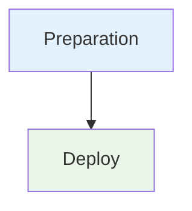

# Deploy ATZA no GKE via Kustomize

Pipeline de CD para deploy do produto ATZA no Google Kubernetes Engine (GKE) usando Service Account da GCP e Kustomize.

## 🎯 Descrição

Este pipeline automatiza o processo de deploy do produto ATZA em clusters GKE na GCP. A autenticação no cluster é feita via Service Account do GCP, com suporte a duas origens de credencial: Azure Key Vault corporativo (`kv-azdevops-shared`) ou Secure File do Azure DevOps.

Os manifests Kubernetes são gerenciados com [Kustomize](https://kustomize.io/), permitindo que cada ambiente (dev/preprod/prod) tenha seu próprio overlay independente. Antes do apply, o pipeline pode atualizar a tag da imagem Docker diretamente no `kustomization.yaml` via `kustomize edit set image`, garantindo rastreabilidade da versão deployada. Após o apply, aguarda o rollout completo de todos os Deployments no namespace antes de registrar o resultado.

O pipeline implementa boas práticas de segurança: arquivos de credencial são gravados em paths temporários isolados por `Build.BuildId`, com permissão `600`, e são destruídos via `shred` ao final da execução — mesmo em caso de falha. O deploy é registrado obrigatoriamente no Event Hub (observabilidade corporativa).

- [Pipeline utilizado para testes](https://dev.azure.com/telefonica-vivo-brasil/DVPS%20-%20DEVOPS/_build?definitionId=MUDAR_PARA_ID_CORRETO)
- [Repositório de exemplo](https://dev.azure.com/telefonica-vivo-brasil/DVPS%20-%20DEVOPS/_git/MUDAR_PARA_REPOSITORIO_CORRETO)


## 🚀 Quick Start (5 minutos)

1. Escolha uma estratégia de credencial da Service Account GCP:
  - `keyvault` (padrão): cadastre a chave JSON no AKV `kv-azdevops-shared` com o nome `GCP-SA-KEY-ATZA`
  - `secretfile`: faça upload do JSON no Library > Secure files e informe o nome em `gcpSaSecretFileName`
2. Crie os overlays Kustomize em `.azuredevops/kustomize/overlays/{dev,preprod,prod}/kustomization.yaml`
3. Crie `.azuredevops/pipelines/cd.yaml` na raiz do repositório
4. Cole o código de exemplo abaixo
5. Commit e push
6. ✅ Execute o pipeline manualmente selecionando o ambiente!

```yaml
# Pipeline mínimo de CD para deploy no GKE via Kustomize
# .azuredevops/pipelines/cd.yaml
resources:
  repositories:
    - repository: CodePlay
      name: DevOps/Vivo.CodePlay.Pipelines
      type: git
      ref: refs/heads/master
      endpoint: CodePlay

extends:
  template: /tech_products/atza/cd/deploy-gke.yaml@CodePlay
```

**O que acontece com esta configuração:**

- ☑️ Ambiente selecionável pelo operador (dev/preprod/prod) com gate de aprovação
- 🔑 Credencial SA GCP carregada via AKV (`keyvault`) ou Secure File (`secretfile`)
- 🖼️ Tag de imagem atualizada no `kustomization.yaml` do overlay via `kustomize edit set image`
- 🔍 Dry-run (`kubectl diff`) exibindo mudanças antes do apply
- 🚀 Apply via `kubectl apply -k` com timeout de 300s
- ⏳ Aguarda rollout de todos os Deployments no namespace
- ↩️ Rollback automático (`kubectl rollout undo`) em caso de falha no apply/rollout
- 🔒 Credenciais GCP revogadas e arquivos temporários destruídos ao final (sempre)
- 📡 Deploy registrado no Event Hub para observabilidade

## 🏗️ Matriz de Capacidades

| Capacidade | Suporte | Descrição |
|------------|---------|-----------|
| [Trunk Based Development](https://dvps.redecorp.azr/portal/codeplay/capacidades/catalog/trunk-based-development) | ❎ | Pipeline de CD — não realiza build nem versionamento de código-fonte |
| [Build Automatizado](https://dvps.redecorp.azr/portal/codeplay/capacidades/catalog/build-automatizado) | ❎ | Pipeline de CD dedicado apenas ao deploy. Build é responsabilidade do pipeline de CI |
| [Testes Unitários](https://dvps.redecorp.azr/portal/codeplay/capacidades/catalog/testes-unitarios) | ❎ | Pipeline de CD — testes são executados no pipeline de CI (ADR-0002) |
| [SAST](https://dvps.redecorp.azr/portal/codeplay/capacidades/catalog/sast) | ❎ | Pipeline de CD — análise estática é responsabilidade do CI (ADR-0004) |
| [SCA](https://dvps.redecorp.azr/portal/codeplay/capacidades/catalog/sca) | ❎ | Pipeline de CD — análise de dependências é responsabilidade do CI |
| [Gates de Segurança](https://dvps.redecorp.azr/portal/codeplay/capacidades/catalog/gates-de-seguranca) | ✅ | Gate de aprovação obrigatório via Azure DevOps Environment `deploy-{environment}` antes do deploy |
| [Análise de Código](https://dvps.redecorp.azr/portal/codeplay/capacidades/catalog/analise-de-codigo) | ❎ | Pipeline de CD — análise de código é responsabilidade do CI |
| [Gates de Qualidade](https://dvps.redecorp.azr/portal/codeplay/capacidades/catalog/gate-de-qualidade) | ❎ | Pipeline de CD — gates de qualidade são responsabilidade do CI |
| [Rollback de Upgrade](https://dvps.redecorp.azr/portal/codeplay/capacidades/catalog/rollback-de-upgrade) | ✅ | Rollback automático via `kubectl rollout undo` quando o apply ou rollout falha. Controlado por `enableAutomaticRollback` |
| [Blue/Green Deployment](https://dvps.redecorp.azr/portal/codeplay/capacidades/catalog/blue-green-deployment) | ❌ | Não implementado nesta versão. Estratégias avançadas dependem da configuração do cluster |
| [Canary Release](https://dvps.redecorp.azr/portal/codeplay/capacidades/catalog/canary-release) | ❌ | Não implementado nesta versão. Requer suporte a Argo Rollouts ou configuração de malha de serviço |

**Legenda:**

- ✅ Suportado nativamente
- ❌ Não suportado
- ⚠️ Suportado com limitações ou condições
- 🚧 Planejado / Em Construção
- ❎ Não faz sentido habilitar essa capacidade

## 🔄 Estrutura do Pipeline

O pipeline é organizado em dois estágios sequenciais. O estágio `Preparation` é executado em um job simples que valida parâmetros e registra a versão a ser deployada. Após sua conclusão bem-sucedida, o estágio `Deploy` é executado como um `deployment job` com gate de aprovação obrigatório via Azure DevOps Environment, garantindo controle de acesso antes de qualquer alteração no cluster.



### Estágios do Pipeline

1. **🔧 Preparation**
   - Exibe parâmetros do pipeline em modo debug (`System.Debug=true`)
   - Valida que parâmetros de ambiente superior não sejam usados em ambientes inferiores
   - Define tags de build (`gke`, `kubernetes`, `kustomize`, `deploy-gke`, `version-X`, `environment-X`)
   - Realiza checkout e calcula a versão de deploy via `VersionManagerVivo@8 setDeployVersion`
   - Atualiza o número da build no formato `deploy-{versão}-{ambiente}`

2. **🚀 Deploy** (Depende de `Preparation` — com gate de aprovação)
   - Checkout do repositório e definição da versão de deploy
  - Obtém credencial da Service Account GCP via Azure Key Vault ou Secure File
   - Autentica no GCP via `gcloud auth activate-service-account` e obtém credenciais do cluster GKE
   - *(Opcional)* Atualiza tag de imagem no `kustomization.yaml` via `kustomize edit set image`
   - *(Opcional)* Executa dry-run via `kubectl diff -k` para visualizar mudanças antes do apply
   - Aplica manifests com `kubectl apply -k` no namespace do ambiente
   - Aguarda rollout completo via `kubectl rollout status deployment`
   - *(Condicional — em caso de falha)* Executa rollback via `kubectl rollout undo deployment --all`
   - Coleta URLs de Ingresses e imagens de pods para registro no Event Hub
   - Revoga credenciais GCP e remove arquivos temporários (sempre, mesmo em falha)
   - Registra o deploy no Event Hub (`VivoEventHubTools@2`, sempre, mesmo em falha)


## ⚙️ Parâmetros Disponíveis

### Parâmetros Gerais de Execução

#### environment

- **nome**: `environment`
- **tipo**: string
- **default**: `"dev"`
- **valores aceitos**: `dev`, `preprod`, `prod`
- **descrição**: Ambiente de destino do deploy. Controla qual overlay Kustomize será utilizado, qual cluster/namespace/projeto GCP será alvo, e qual Azure DevOps Environment será usado para o gate de aprovação (`deploy-dev`, `deploy-preprod`, `deploy-prod`).
- **dependências**: Azure DevOps Environment `deploy-{environment}` deve existir e ter aprovadores configurados.

#### version

- **nome**: `version`
- **tipo**: string
- **default**: `"getLatestVersion()"`
- **descrição**: Versão da aplicação a ser deployada. O valor especial `getLatestVersion()` instrui o `VersionManagerVivo@8` a buscar automaticamente a última versão gerada pelo pipeline de CI para este repositório. Para forçar uma versão específica, informe no formato `1.2.3`.
- **dependências**: Nenhuma.

#### agentPool

- **nome**: `agentPool`
- **tipo**: string
- **default**: `"GeneralPurposeLinuxAgentsCD"`
- **descrição**: Pool de agentes Azure DevOps onde todos os jobs do pipeline serão executados. Deve ser um pool Linux com acesso à internet corporativa, ao Azure Key Vault e à API do GCP.
- **dependências**: Nenhuma.

### Configuração GCP / GKE

#### gcpProject

- **nome**: `gcpProject`
- **tipo**: object (mapa por ambiente)
- **default**: `{dev: "gcp-project-atza-dev", preprod: "gcp-project-atza-preprod", prod: "gcp-project-atza-prod"}`
- **descrição**: IDs dos projetos GCP por ambiente. O projeto correto é selecionado automaticamente com base no parâmetro `environment`. Deve corresponder ao projeto GCP onde o cluster GKE está provisionado.
- **dependências**: A Service Account configurada em `gcpSaKeySecretName` deve ter permissões no projeto informado.

#### gkeClusterName

- **nome**: `gkeClusterName`
- **tipo**: object (mapa por ambiente)
- **default**: `{dev: "gke-atza-dev", preprod: "gke-atza-preprod", prod: "gke-atza-prod"}`
- **descrição**: Nomes dos clusters GKE por ambiente. Usado na chamada `gcloud container clusters get-credentials` para obter o kubeconfig do cluster.
- **dependências**: O cluster deve existir no projeto e região informados.

#### gkeClusterRegion

- **nome**: `gkeClusterRegion`
- **tipo**: object (mapa por ambiente)
- **default**: `{dev: "us-central1", preprod: "us-central1", prod: "us-central1"}`
- **descrição**: Regiões GCP dos clusters por ambiente. Suporta regiões (ex: `us-central1`) e zonas (ex: `us-central1-a`). Ajuste conforme a localização real dos clusters ATZA.
- **dependências**: Nenhuma.

#### gcpSaKeySecretName

- **nome**: `gcpSaKeySecretName`
- **tipo**: string
- **default**: `"GCP-SA-KEY-ATZA"`
- **descrição**: Nome do segredo no Azure Key Vault `kv-azdevops-shared` que contém o JSON completo da Service Account GCP. O JSON deve ser gerado via `gcloud iam service-accounts keys create`. A SA deve ter as roles `roles/container.developer` e `roles/container.clusterViewer` no projeto GCP.
- **dependências**: Obrigatório quando `gcpCredentialSource="keyvault"`. Segredo deve estar cadastrado no AKV `kv-azdevops-shared` acessível via service connection `DevOpsSharedResources`.

#### gcpCredentialSource

- **nome**: `gcpCredentialSource`
- **tipo**: string
- **default**: `"keyvault"`
- **valores aceitos**: `keyvault`, `secretfile`
- **descrição**: Define a origem da credencial da Service Account GCP. Em `keyvault`, o pipeline lê o JSON do AKV via `AzureKeyVault@2`. Em `secretfile`, o pipeline baixa o JSON via `DownloadSecureFile@1`.
- **dependências**: Quando `keyvault`, preencher `gcpSaKeySecretName`. Quando `secretfile`, preencher `gcpSaSecretFileName`.

#### gcpSaSecretFileName

- **nome**: `gcpSaSecretFileName`
- **tipo**: string
- **default**: `""`
- **descrição**: Nome do Secure File no Azure DevOps Library contendo o JSON da Service Account GCP.
- **dependências**: Obrigatório quando `gcpCredentialSource="secretfile"`. O arquivo deve existir no Library > Secure files com permissão para o pipeline.

### Kubernetes Namespace

#### k8sNamespace

- **nome**: `k8sNamespace`
- **tipo**: object (mapa por ambiente)
- **default**: `{dev: "atza-dev", preprod: "atza-preprod", prod: "atza-prod"}`
- **descrição**: Namespaces Kubernetes por ambiente. Usado como `--namespace` em todos os comandos `kubectl`. O namespace deve existir previamente no cluster — o pipeline não cria namespaces.
- **dependências**: Namespace deve existir no cluster GKE antes da execução.

### Configuração Kustomize

#### kustomizeOverlayPath

- **nome**: `kustomizeOverlayPath`
- **tipo**: string
- **default**: `".azuredevops/kustomize/overlays"`
- **descrição**: Caminho base dos overlays Kustomize relativo à raiz do repositório. O overlay do ambiente selecionado é acessado em `{kustomizeOverlayPath}/{environment}/kustomization.yaml`. Exemplo de estrutura esperada: `.azuredevops/kustomize/overlays/dev/`, `.azuredevops/kustomize/overlays/prod/`.
- **dependências**: Diretório de overlay para o ambiente selecionado deve existir no repositório.

#### updateKustomizeImage

- **nome**: `updateKustomizeImage`
- **tipo**: boolean
- **default**: true
- **descrição**: Quando `true`, executa `kustomize edit set image` no overlay antes do apply para atualizar a tag da imagem Docker com a versão do deploy. Requer que o `kustomize` CLI esteja instalado no agente e que o `kustomization.yaml` do overlay possua a seção `images:`. Quando `false`, a tag de imagem deve ser gerenciada manualmente no overlay.
- **dependências**: `kustomize` CLI instalado no agente. Seção `images:` no `kustomization.yaml` do overlay.

#### kustomizeImageName

- **nome**: `kustomizeImageName`
- **tipo**: string
- **default**: `"$(Build.Repository.Name)"`
- **descrição**: Valor do campo `name` na seção `images:` do `kustomization.yaml` do overlay. Este é o identificador da imagem a ser atualizada. Exemplo: se o `kustomization.yaml` tiver `images: [{name: "minha-app", ...}]`, este parâmetro deve ser `"minha-app"`. Usado apenas quando `updateKustomizeImage=true`.
- **dependências**: `updateKustomizeImage: true`.

#### kustomizeImageNewName

- **nome**: `kustomizeImageNewName`
- **tipo**: string
- **default**: `"acrsharedservices01.azurecr.io/atza/$(Build.Repository.Name)"`
- **descrição**: Registry e nome completo da imagem Docker sem a tag (campo `newName` no `kustomization.yaml`). Exemplo: `acrsharedservices01.azurecr.io/atza/minha-app`. A versão do deploy é concatenada automaticamente pelo pipeline. Usado apenas quando `updateKustomizeImage=true`.
- **dependências**: `updateKustomizeImage: true`.

### Capacidades Adicionais

#### enableDryRun

- **nome**: `enableDryRun`
- **tipo**: boolean
- **default**: true
- **descrição**: Quando `true`, executa `kubectl diff -k` antes do apply para exibir no log todas as mudanças que seriam aplicadas ao cluster. O resultado é informativo (`continueOnError: true`) e não bloqueia o deploy. Recomendado manter habilitado em todos os ambientes para rastreabilidade.
- **dependências**: Nenhuma.

#### enableAutomaticRollback

- **nome**: `enableAutomaticRollback`
- **tipo**: boolean
- **default**: true
- **descrição**: Quando `true`, em caso de falha no apply (`kubectl apply -k`) ou no aguardo do rollout (`kubectl rollout status`), o pipeline executa automaticamente `kubectl rollout undo deployment --all` no namespace para reverter todos os Deployments à versão anterior. O rollback é executado antes da limpeza de credenciais, garantindo acesso ao cluster. Não afeta outros tipos de recursos Kubernetes (StatefulSets, DaemonSets).
- **dependências**: Nenhuma.

#### deployTimeoutSeconds

- **nome**: `deployTimeoutSeconds`
- **tipo**: number
- **default**: 300
- **descrição**: Timeout em segundos aplicado tanto ao `kubectl apply` quanto ao `kubectl rollout status`. Se o apply ou o rollout não concluírem dentro deste tempo, o step falha (e o rollback automático é acionado se `enableAutomaticRollback=true`). Aumente este valor para aplicações com tempo de inicialização longo.
- **dependências**: Nenhuma.


## 🔧 Dependências Externas

### Service Connections Necessárias

#### 1. Azure Resource Manager — DevOpsSharedResources

- **Nome padrão**: `DevOpsSharedResources`
- **Tipo**: Azure Resource Manager
- **Uso**: Acesso ao Azure Key Vault `kv-azdevops-shared` para obtenção da chave JSON da Service Account GCP
- **Permissões necessárias**:
  - Leitura de segredos no Key Vault `kv-azdevops-shared`
- **Configurável via**: Valor fixo — não parametrizável

### Secure Files (opcional)

#### 1. Azure DevOps Library > Secure files

- **Uso**: Fonte alternativa da chave JSON da Service Account GCP quando `gcpCredentialSource=secretfile`
- **Requisitos**:
  - Secure File com o JSON da Service Account cadastrado no projeto
  - Nome do arquivo informado em `gcpSaSecretFileName`
  - Pipeline com permissão de download no Secure File

### Agent Pool Requirements

#### Pool de Agentes

- **Pool padrão**: `GeneralPurposeLinuxAgentsCD`
- **Sistema Operacional**: Linux
- **Ferramentas obrigatórias**:
  - `gcloud` CLI (Google Cloud SDK) — para autenticação e obtenção de credenciais GKE (se ausente, o pipeline tenta instalar via `asdf`)
  - `asdf` previamente instalado no agente
  - `kubectl` — para `diff`, `apply -k`, `rollout status` e `rollout undo`
  - `kustomize` CLI — apenas se `updateKustomizeImage=true`
  - `shred` (coreutils) — para destruição segura da chave SA ao final
  - `jq`, `sed`, `sort` — para coleta de URLs e imagens de pods
- **Acesso de rede**:
  - Acesso à API do GCP (`container.googleapis.com`) para `gcloud container clusters get-credentials`
  - Acesso à API do cluster GKE (endpoint do cluster)
  - Acesso ao Azure Key Vault `kv-azdevops-shared.vault.azure.net`
  - Acesso ao Event Hub corporativo via `EVHCodeProd`

### Arquivos Obrigatórios no Repositório

#### 1. Overlays Kustomize por Ambiente

- **Localização padrão**: `.azuredevops/kustomize/overlays/{dev,preprod,prod}/kustomization.yaml`
- **Configurável via**: parâmetro `kustomizeOverlayPath`
- **Requisitos**:
  - `kustomization.yaml` válido para cada ambiente
  - Quando `updateKustomizeImage=true`: seção `images:` com campo `name` correspondente ao parâmetro `kustomizeImageName`
  - Overlays devem referenciar os resources/bases corretos para o ambiente

- **Exemplo de `kustomization.yaml` mínimo:**
  ```yaml
  apiVersion: kustomize.config.k8s.io/v1beta1
  kind: Kustomization
  resources:
    - ../../base
  images:
    - name: minha-app
      newName: acrsharedservices01.azurecr.io/atza/minha-app
      newTag: "0.0.0"  # atualizado automaticamente pelo pipeline
  ```

### Integrações Externas de Segurança

#### 1. Azure Key Vault — kv-azdevops-shared (quando `gcpCredentialSource=keyvault`)

- **Descrição**: Armazena a chave JSON da Service Account GCP de forma segura, evitando que credenciais fiquem em variáveis do pipeline ou repositório
- **Requisitos**:
  - Segredo cadastrado com o nome configurado em `gcpSaKeySecretName` (padrão: `GCP-SA-KEY-ATZA`)
  - Conteúdo: JSON completo gerado via `gcloud iam service-accounts keys create key.json --iam-account=SA_EMAIL`
  - Service connection `DevOpsSharedResources` com permissão de leitura no vault

#### 2. Azure DevOps Secure Files (quando `gcpCredentialSource=secretfile`)

- **Descrição**: Armazena o JSON da Service Account GCP como arquivo seguro no Library do Azure DevOps.
- **Requisitos**:
  - Secure File existente com o nome configurado em `gcpSaSecretFileName`
  - Conteúdo: JSON completo gerado via `gcloud iam service-accounts keys create key.json --iam-account=SA_EMAIL`
  - Permissão de download para o pipeline

### Azure Key Vault

#### kv-azdevops-shared

- **Uso**: Armazenamento seguro da chave JSON da Service Account GCP
- **Secrets esperados**:
  - `GCP-SA-KEY-ATZA` (ou o valor configurado em `gcpSaKeySecretName`) — chave JSON da SA com permissões `roles/container.developer` e `roles/container.clusterViewer`

### Variáveis de Sistema Necessárias

| Variável | Origem | Uso |
|----------|--------|-----|
| `System.TeamProject` | Azure DevOps | Cálculo automático da variável `SIGLA` |
| `System.Debug` | Azure DevOps | Quando `true`, exibe parâmetros do pipeline no log |
| `Build.BuildId` | Azure DevOps | Isolamento de arquivos temporários por execução |
| `Build.Repository.Name` | Azure DevOps | Nome padrão da imagem e da release |
| `Agent.TempDirectory` | Azure DevOps | Path base para arquivos temporários da SA e kubeconfig |
| `Build.SourcesDirectory` | Azure DevOps | Raiz do repositório após checkout |

### Dependências de Templates Internos

Este pipeline não utiliza templates compartilhados do framework CodePlay. É um pipeline autossuficiente específico do produto ATZA.

## 🎨 Comportamentos Customizados

:::danger
**⚠️ ATENÇÃO: CUSTOMIZAÇÕES REQUEREM RESPONSABILIDADE ⚠️**

- ✅ **Use os exemplos como ponto de partida** - Eles demonstram padrões seguros e testados
- 🧠 **"Todos somos adultos"** - Confiamos na sua expertise, mas exigimos consciência do impacto
- 📝 **Tudo fica registrado** - Seu histórico de commits é auditável e rastreável
- 🎯 **Entenda antes de modificar** - Customizações incorretas podem causar indisponibilidade em produção
- 🤝 **Documente suas decisões** - Facilite a manutenção futura por outros membros da equipe

**Customizar é permitido. Fazer sem entender não é.**
:::

### Deploy em Ambiente de Produção com Versão Específica

```yaml
# .azuredevops/pipelines/cd.yaml
resources:
  repositories:
    - repository: CodePlay
      name: DevOps/Vivo.CodePlay.Pipelines
      type: git
      ref: refs/heads/master
      endpoint: CodePlay

extends:
  template: /tech_products/atza/cd/deploy-gke.yaml@CodePlay
  parameters:
    environment: "prod"
    version: "2.5.1"  # versão específica gerada pelo CI
```

### Sem Atualização Automática de Imagem (tag gerenciada manualmente no overlay)

```yaml
# Útil quando o kustomize CLI não está disponível no agente,
# ou quando a tag de imagem é gerenciada por outro processo.
extends:
  template: /tech_products/atza/cd/deploy-gke.yaml@CodePlay
  parameters:
    environment: "dev"
    updateKustomizeImage: false  # a tag já está correta no kustomization.yaml
    enableDryRun: false          # opcional: desabilita dry-run para execução mais rápida
```

### Deploy com Timeout Estendido para Aplicação de Inicialização Lenta

```yaml
# Para aplicações que levam mais de 5 minutos para inicializar
# (ex: serviços que carregam modelos ML, inicializam caches grandes, etc.)
extends:
  template: /tech_products/atza/cd/deploy-gke.yaml@CodePlay
  parameters:
    environment: "prod"
    deployTimeoutSeconds: 600  # 10 minutos
    enableAutomaticRollback: false  # evita rollback prematuro durante inicialização lenta
```

### Deploy em Cluster de Região Diferente

```yaml
# Para ambientes que usam regiões GCP distintas
extends:
  template: /tech_products/atza/cd/deploy-gke.yaml@CodePlay
  parameters:
    environment: "prod"
    gkeClusterRegion:
      dev: "southamerica-east1"
      preprod: "southamerica-east1"
      prod: "southamerica-east1"  # cluster em São Paulo
    gcpProject:
      dev: "meu-projeto-dev"
      preprod: "meu-projeto-preprod"
      prod: "meu-projeto-prod"
```

## 🔖 Variáveis de Ambiente

As seguintes variáveis de ambiente são automaticamente configuradas pelo pipeline:

| Variável | Descrição | Valor Padrão |
|----------|-----------|--------------|
| `SIGLA` | Sigla do time derivada do nome do projeto Azure DevOps (letras minúsculas) | `$[ lower(split(variables['System.TeamProject'],' ')[0]) ]` |
| `ENVIRONMENT` | Ambiente de deploy (espelho do parâmetro `environment`) | `${{ parameters.environment }}` |
| `GCP_SA_KEY_PATH` | Path do arquivo temporário da chave SA GCP (isolado por Build ID) | `$(Agent.TempDirectory)/gcp-sa-key-$(Build.BuildId).json` |
| `GKE_KUBECONFIG_PATH` | Path do kubeconfig temporário GKE (isolado por Build ID) | `$(Agent.TempDirectory)/gke-kubeconfig-$(Build.BuildId)` |
| `KUSTOMIZE_OVERLAY_PATH` | Path absoluto do overlay Kustomize do ambiente selecionado | `$(Build.SourcesDirectory)/{kustomizeOverlayPath}/{environment}` |
| `K8S_APP_URL_LIST` | URLs dos Ingresses detectados no namespace após o deploy (separadas por vírgula) | *(coletado em runtime)* |
| `K8S_IMAGES` | Imagens dos pods em execução no namespace após o deploy (separadas por vírgula) | *(coletado em runtime)* |
| `KUBECONFIG` | Path do kubeconfig ativo durante os steps de kubectl | Igual a `GKE_KUBECONFIG_PATH` |

## ❓ FAQ

### Onde posso encontrar mais informações sobre o CodePlay Framework?

Você pode encontrar mais informações sobre o CodePlay Framework na [documentação oficial](https://dvps.redecorp.azr/portal/codeplay/framework/).

### Onde encontro as capacidades disponíveis?

As capacidades disponíveis podem ser encontradas no [Catálogo de Capacidade](https://dvps.redecorp.azr/portal/catalog/capabilities) no Portal CodePlay.

### Como faço para customizar o pipeline?

Siga o guia de [Adoção ao CodePlay](https://dvps.redecorp.azr/portal/codeplay/roteiro/codeplay#fluxo-de-ado%C3%A7%C3%A3o-ao-codeplay).

### Quais casos de uso relevantes?

- [Integrando CICD](https://dvps.redecorp.azr/portal/code/casos-de-uso/integrando-cicd)
- Veja o [Catálogo de Casos de Uso](https://dvps.redecorp.azr/portal/catalog/casos-de-uso) para outros exemplos de casos de uso.

### Quais Erros Comuns relevantes?

- Ainda não temos nenhum erro comum documentado para este pipeline.
- Veja o [Catálogo de Erros Conhecidos](https://dvps.redecorp.azr/portal/catalog/erros-conhecidos) para outros exemplos de erros.

## 🆘 Suporte

- [Abra um chamado para Dev Support](https://dvps.redecorp.azr/portal/codeplay/roteiro/#:~:text=Abra%20um%20chamado%20para%20Dev%20Support)
- [Canal DevEx - Azure DevOps](https://teams.microsoft.com/l/channel/19%3A8fbd00946cf044d7a844182ac71e6aa1%40thread.tacv2/Azure%20DevOps?groupId=038b4415-d6dd-42ce-92e5-31a8e2a13bf8&tenantId=9744600e-3e04-492e-baa1-25ec245c6f10)

## 📝 Decisões Tomadas

### Decisão 1: Credenciais GCP via Azure Key Vault (não via service connection Kubernetes)

- **Data**: 31/03/2026
- **Motivador**: Produto ATZA usa GKE (GCP) em vez de AKS (Azure), impossibilitando o uso do padrão de Managed Identity do framework. Service connections do tipo Kubernetes no Azure DevOps requerem exposição do endpoint do cluster e do token SA, o que aumenta a superfície de ataque.
- **Forum Envolvido**: Time ATZA + equipe de plataforma CodePlay
- **Descrição**: A chave JSON da Service Account GCP é armazenada no AKV corporativo `kv-azdevops-shared` e obtida em runtime via `AzureKeyVault@2`. O arquivo é gravado em path temporário isolado por `Build.BuildId` com permissão `600`, e destruído via `shred` ao final da execução (com `condition: always()`), garantindo que a credencial nunca persista no agente entre execuções.

### Decisão 2: `kubectl apply -k` em vez de `helm upgrade`

- **Data**: 31/03/2026
- **Motivador**: O produto ATZA adota Kustomize como ferramenta de gestão de manifests Kubernetes, sem uso de Helm Charts. O `kubectl apply -k` utiliza o engine Kustomize embutido no kubectl (sem dependência de CLI separado para o apply), e a customização por ambiente é feita via overlays nativos do Kustomize.
- **Forum Envolvido**: Time ATZA
- **Descrição**: A task `K8sUtilsFromVivo@3` (usada no `deploy-helm` corporativo) não foi utilizada pois ela é orientada ao Helm. O deploy é feito diretamente via scripts bash com `kubectl`, mantendo a flexibilidade de Kustomize sem acoplamento ao framework Helm do CodePlay.

### Decisão 3: Rollback automático antes da limpeza de credenciais

- **Data**: 31/03/2026
- **Motivador**: O rollback automático precisa de acesso ao cluster GKE, o que requer que o kubeconfig temporário ainda exista. Se a limpeza (`shred`) ocorresse antes, o rollback seria impossível.
- **Forum Envolvido**: Time ATZA
- **Descrição**: A ordem dos steps no estágio de deploy foi definida como: rollback (`condition: failed()`) → coleta de informações → limpeza de credenciais (`condition: always()`). Isso garante que o rollback tenha acesso ao cluster antes da destruição dos arquivos temporários, enquanto a limpeza sempre ocorre independentemente do resultado do deploy.
