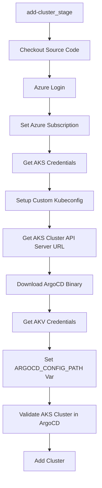

# Pipeline ArgoCD - DVPS

Pipeline para automação do processo de adição e atualização de clusters AKS no ArgoCD via Azure DevOps.

## 🎯 Descrição

Este pipeline permite adicionar ou atualizar clusters Kubernetes (AKS) no ArgoCD de forma automatizada, utilizando credenciais do Azure ou um kubeconfig customizado. Ele executa validações, prepara o ambiente, recupera segredos do Key Vault e garante que o cluster seja registrado corretamente no ArgoCD, seguindo padrões de segurança e automação corporativa.

**Principais Benefícios:**
- Provisionamento e atualização de clusters no ArgoCD sem intervenção manual
- Suporte a múltiplos métodos de autenticação (Service Principal ou kubeconfig customizado)
- Validação de existência do cluster e controle de duplicidade
- Integração segura com Azure Key Vault para segredos sensíveis
- Download automatizado do binário do ArgoCD

## 🚀 Quick Start

1. Configure os parâmetros obrigatórios:
   - `environment`: Ambiente alvo (ex: devops)
   - `action`: Ação desejada (`add` ou `update`)
   - `clusterName`, `resourceGroup`, `subscriptionId`: Dados do cluster AKS
   - `kubeconfigBase64` (opcional): kubeconfig customizado em base64
2. Execute o pipeline via Azure DevOps.
3. O pipeline irá:
   - Realizar login no Azure (se necessário)
   - Obter kubeconfig do AKS ou usar o customizado
   - Recuperar segredos do Key Vault
   - Validar existência do cluster no ArgoCD
   - Adicionar ou atualizar o cluster

## 🏗️ Matriz de Capacidades

| Capacidade | Suporte | Descrição |
|-----------|---------|-----------|
| Trunk Based Development | ✅ | Pipeline orientado a templates reutilizáveis |
| Build Automatizado | ✅ | Execução automatizada via Azure DevOps |
| SAST/SCA | ⚠️ | Não aplicável diretamente, mas recomenda-se uso em pipelines de produto |
| Gates de Segurança | ✅ | Uso de Key Vault e validações |
| Análise de Código | ❎ | Não aplicável |
| Gates de Qualidade | ⚠️ | Validações de execução e duplicidade |

Legenda: ✅ Suportado | ⚠️ Parcial | ❎ Não aplicável

## 🔄 Estrutura do Pipeline



### Detalhamento dos Steps

- **Checkout Source Code**: Faz checkout do repositório e limpa workspace.
- **Azure Login**: Login via Service Principal (se não usar kubeconfig customizado).
- **Set Azure Subscription**: Define a subscription do Azure.
- **Get AKS Credentials**: Obtém kubeconfig do AKS.
- **Setup Custom Kubeconfig**: Decodifica e valida kubeconfig customizado (se fornecido).
- **Get AKS Cluster API Server URL**: Extrai URL do servidor da API do cluster.
- **Download ArgoCD Binary**: Baixa e prepara o binário do ArgoCD.
- **Get AKV Credentials**: Recupera segredo do Key Vault para autenticação no ArgoCD.
- **Set ARGOCD_CONFIG_PATH Var**: Cria arquivo de configuração do ArgoCD.
- **Validate AKS Cluster in ArgoCD**: Verifica se o cluster já existe no ArgoCD.
- **Add Cluster**: Adiciona ou atualiza o cluster no ArgoCD.

## ⚙️ Parâmetros Disponíveis

| Parâmetro         | Tipo    | Obrigatório | Descrição |
|-------------------|---------|-------------|-----------|
| environment       | string  | Sim         | Ambiente alvo (ex: devops) |
| action            | string  | Sim         | `add` ou `update` |
| clusterName       | string  | Sim         | Nome do cluster AKS |
| resourceGroup     | string  | Sim         | Resource Group do AKS |
| subscriptionId    | string  | Sim         | Subscription do Azure |
| kubeconfigBase64  | string  | Não         | Kubeconfig customizado em base64 |

## 🔐 Segurança e Boas Práticas

- Secrets e credenciais são obtidos via Azure Key Vault
- Não armazene secrets em variáveis de pipeline
- O pipeline valida permissões antes de executar ações sensíveis
- Recomenda-se auditar execuções e logs

## 📝 Exemplos de Uso

```yaml
trigger: none
pr: none
 
parameters:
- name: environment
  displayName: Ambiente
  type: string
  default: devops
  values:
  - devops

- name: action
  displayName: Ação
  type: string
  default: add
  values:
  - add
  - update

- name: clusterName
  displayName: Insira o nome do cluster
  type: string  
  default: ""

- name: resourceGroup
  displayName: Insira o nome do resource group
  type: string
  default: ""

- name: subscriptionId
  displayName: Insira o ID da subscription
  type: string
  default: ""

  - name: kubeconfigBase64
    displayName: 'Kubeconfig em Base64 (opcional - Utilize para onprem) - echo "$(cat ~/.kube/config)" | base64 -w 0'
    type: string
    default: ''
 
resources:
  repositories:
    - repository: CodePlay
      name: DevOps/Vivo.CodePlay.Pipelines
      type: git
      ref: refs/heads/master
      endpoint: CodePlay
extends:
  template: tech_products/dvps/argocd/pipeline_dvps_argocd.yaml@CodePlay
  parameters:
    environment: "${{parameters.environment}}"
    action: "${{parameters.action}}"
    clusterName: "${{parameters.clusterName}}"
    resourceGroup: "${{parameters.resourceGroup}}"
    subscriptionId: "${{parameters.subscriptionId}}"
    kubeconfigBase64: ${{parameters.kubeconfigBase64}}
```

## 🔧 Dependências Externas

- Azure DevOps Service Connection com permissão no AKS
- Azure Key Vault com segredo `ARGOCD-4P-B64-CONFIG-FILE`
- Pool de agentes Linux com curl, jq, kubectl, az cli

## 📚 Referências

- [Documentação Oficial ArgoCD](https://argo-cd.readthedocs.io/)
- [Azure AKS Docs](https://docs.microsoft.com/azure/aks/)
---

> Dúvidas ou sugestões? Abra uma issue ou procure o time DVPS.
