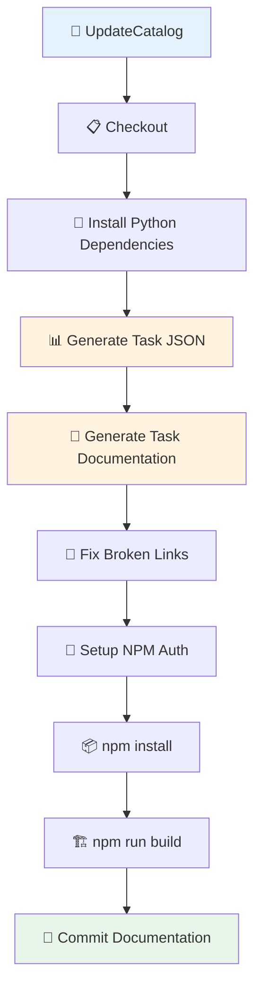

# CodePlay Portal - Custom Task Documentation Generator

Pipeline automatizado para geração e atualização da documentação de Custom Tasks do Azure DevOps no Portal CodePlay.

## 🎯 Descrição

Este pipeline foi desenvolvido para manter a documentação de Custom Tasks do Azure DevOps sempre atualizada no Portal CodePlay. Ele extrai automaticamente metadados de todas as tasks instaladas nas organizações (produção e pré-produção), gera documentação em Markdown, compila o portal Docusaurus e commita as alterações de volta ao repositório.

O pipeline é executado semanalmente de forma agendada (segundas-feiras às 8h UTC / 5h horário de Brasília), mas também pode ser executado manualmente quando necessário.

**Benefícios:**
- ✅ Documentação sempre atualizada automaticamente
- ✅ Sincronização entre ambientes prod e preprod
- ✅ Reduz trabalho manual da equipe
- ✅ Mantém consistência na documentação

- [Pipeline utilizado para testes](https://dev.azure.com/telefonica-vivo-brasil/DVPS%20-%20DEVOPS/_build?definitionId=42186)
- [Repositório do Portal CodePlay](https://dev.azure.com/telefonica-vivo-brasil/DVPS%20-%20DEVOPS/_git/Vivo.CodePlay.Portal)

## 🚀 Quick Start

**💡 Nota Importante:** Este pipeline é parte da infraestrutura do Portal CodePlay e **já está configurado e em execução**. Esta documentação é para entendimento e manutenção pela equipe DVPS.

Se você está buscando **documentação sobre custom tasks**, acesse o [Catálogo de Tasks](https://dvps.redecorp.azr/portal/catalog/tasks) no Portal - ele é mantido automaticamente por este pipeline! 🎯

### Como Está Configurado

O pipeline está configurado no repositório do Portal através do arquivo [azure-pipeline-custom-task.yaml](https://dev.azure.com/telefonica-vivo-brasil/DVPS%20-%20DEVOPS/_git/Vivo.CodePlay.Portal?path=/.azuredevops/azure-pipeline-custom-task.yaml):

```yaml
# Pipeline para atualização automática da documentação de custom tasks
# .azuredevops/azure-pipeline-custom-task.yaml (Portal CodePlay)

trigger: none
pr: none

schedules:
- cron: "0 8 * * 1"  # Toda segunda-feira às 5h (horário de Brasília / 8h UTC)
  displayName: Weekly custom task documentation update
  branches:
    include:
    - master
  always: true

resources:
  repositories:
    - repository: CodePlay
      name: DevOps/Vivo.CodePlay.Pipelines
      type: git
      ref: refs/heads/master
      endpoint: CodePlay

extends:
  template: /tech_products/dvps/codeplay-portal-custom-task-docs/pipeline.yaml@CodePlay
```

**Pré-requisitos já configurados:**
- Variable Group `pipe-generate-task-docs` com PATs de prod e preprod
- Scripts Python no repositório do Portal (`scripts/extract_tasks.py` e `scripts/generate_task_docs.py`)
- Pipeline no Azure DevOps ([#42186](https://dev.azure.com/telefonica-vivo-brasil/DVPS%20-%20DEVOPS/_build?definitionId=42186))

### Como Funciona

1. **Agendamento**: Pipeline configurado no Portal roda automaticamente toda segunda-feira às 5h (Brasília) via `schedules` no [azure-pipeline-custom-task.yaml](https://dev.azure.com/telefonica-vivo-brasil/DVPS%20-%20DEVOPS/_git/Vivo.CodePlay.Portal?path=/.azuredevops/azure-pipeline-custom-task.yaml)
2. **Extração**: Coleta metadados de todas as tasks via API do Azure DevOps
3. **Geração**: Cria arquivos Markdown com documentação completa
4. **Build**: Compila o Portal Docusaurus
5. **Commit**: Envia alterações para o repositório (se houver mudanças)

## 🏗️ Matriz de Capacidades

| Capacidade | Suporte | Descrição |
|------------|---------|-----------|
| [Trunk Based Development](https://dvps.redecorp.azr/portal/codeplay/capacidades/catalog/trunk-based-development) | ✅ | Pipeline executado na master com commits automáticos |
| [Build Automatizado](https://dvps.redecorp.azr/portal/codeplay/capacidades/catalog/build-automatizado) | ✅ | Build automático do Portal Docusaurus |
| [Testes Unitários](https://dvps.redecorp.azr/portal/codeplay/capacidades/catalog/testes-unitarios) | ❎ | Não aplicável - pipeline de documentação |
| [SAST](https://dvps.redecorp.azr/portal/codeplay/capacidades/catalog/sast) | ❎ | Não aplicável - documentação apenas |
| [SCA](https://dvps.redecorp.azr/portal/codeplay/capacidades/catalog/sca) | ❎ | Não aplicável - documentação apenas |
| [Gates de Segurança](https://dvps.redecorp.azr/portal/codeplay/capacidades/catalog/gates-de-seguranca) | ❎ | Não aplicável |
| [Análise de Código](https://dvps.redecorp.azr/portal/codeplay/capacidades/catalog/analise-de-codigo) | ❎ | Não aplicável |
| [Gates de Qualidade](https://dvps.redecorp.azr/portal/codeplay/capacidades/catalog/gate-de-qualidade) | ❎ | Não aplicável |

**Legenda:**

- ✅ Suportado nativamente
- ❌ Não suportado
- ⚠️ Suportado com limitações ou condições
- 🚧 Planejado / Em Construção
- ❎ Não faz sentido habilitar essa capacidade

## 🔄 Estrutura do Pipeline

O pipeline possui um único estágio com execução sequencial das etapas:



### Detalhamento dos Steps

1. **📋 Checkout**
   - Faz checkout do repositório com credenciais persistidas
   - Necessário para commit automático ao final

2. **🐍 Install Python Dependencies**
   - Instala pacotes: `requests`
   - Necessários para os scripts de extração e geração

3. **📊 Generate Task JSON**
   - Executa `scripts/extract_tasks.py`
   - Conecta nas APIs do Azure DevOps (prod e preprod)
   - Gera `scripts/data/relatorio-tasks.json` com metadados de todas as tasks

4. **📝 Generate Task Documentation**
   - Executa `scripts/generate_task_docs.py`
   - Lê o JSON gerado e cria arquivos `.md` para cada task
   - Salva em `code/tasks/catalog/*.md`

5. **🔧 Fix Broken Links**
   - Corrige problemas conhecidos de formatação
   - Exemplo: link `regex101.com` em `regexreplace@4.md`

6. **🔐 Setup NPM Auth**
   - Gera token base64 para autenticação no registry privado
   - Necessário para `npm install`

7. **📦 npm install**
   - Instala dependências do Portal Docusaurus
   - Usa `.npmrc` com autenticação

8. **🏗️ npm run build**
   - Compila o Portal Docusaurus
   - Gera o arquivo `src/data/catalog-tasks.json` com metadados para o catálogo
   - Valida que a documentação gerada não quebra o build

9. **💾 Commit Documentation**
   - Commita arquivos `.md` e JSON atualizados
   - Apenas se houver mudanças
   - Usa `[skip ci]` para evitar loop infinito

## ⚙️ Parâmetros Disponíveis

### Infraestrutura e Ambiente

#### pool

- **nome**: pool
- **tipo**: string
- **default**: `GeneralPurposeLinuxAgentsCI`
- **descrição**: Agent Pool para execução do pipeline. Deve ser um pool Linux com Python 3.9+, Node.js e npm.
- **dependências**: Nenhuma.

#### variableGroup

- **nome**: variableGroup
- **tipo**: string
- **default**: `pipe-generate-task-docs`
- **descrição**: Variable Group contendo os PATs para acesso às organizações do Azure DevOps. Deve conter: `PAT_PROD` e `PAT_PREPROD`.
- **dependências**: Variable Group configurado no Azure DevOps Library com as variáveis secretas.

## 🔧 Dependências Externas

### Variable Groups Necessários

#### 1. pipe-generate-task-docs

- **Nome**: `pipe-generate-task-docs`
- **Tipo**: Variable Group (Library)
- **Variáveis obrigatórias**:
  - `PAT_PROD`: Personal Access Token para organização `telefonica-vivo-brasil`
  - `PAT_PREPROD`: Personal Access Token para organização `telefonica-vivo-brasil-preprod`
- **Permissões dos PATs**:
  - Scope: `Read` em `Agent Pools`
  - Scope: `Read` em `Build`
- **Configurável via**: parâmetro `variableGroup`

### Agent Pool Requirements

#### Pool de Agentes

- **Pool padrão**: `GeneralPurposeLinuxAgentsCI`
- **Sistema Operacional**: Linux
- **Ferramentas obrigatórias**:
  - Python 3.9 ou superior
  - pip (gerenciador de pacotes Python)
  - Node.js 18+ 
  - npm 9+
  - Git
- **Acesso de rede**:
  - Acesso à API do Azure DevOps (`https://dev.azure.com`)
  - Acesso ao Azure Artifacts (registries npm privados)
  - Acesso ao proxy corporativo: `10.240.58.39:3128`

### Pré-requisitos no Repositório

O repositório do Portal CodePlay deve conter:

1. **Scripts Python**:
   - `scripts/extract_tasks.py` - Extração de metadados das tasks
   - `scripts/generate_task_docs.py` - Geração de documentação Markdown

2. **Configuração npm**:
   - `.npmrc` - Configuração de registries privados
   - `package.json` - Dependências do Docusaurus

3. **Estrutura de pastas**:
   - `code/tasks/catalog/` - Onde a documentação será salva
   - `scripts/data/` - Onde o JSON intermediário será salvo

### Variáveis de Sistema Necessárias

| Variável | Origem | Uso |
|----------|--------|-----|
| `Build.SourcesDirectory` | Azure DevOps | Diretório raiz do repositório |
| `Build.SourceBranch` | Azure DevOps | Branch atual (usado para condicional de commit) |
| `System.AccessToken` | Azure DevOps | Token para autenticação npm |
| `PAT_PROD` | Variable Group | Token para API do Azure DevOps (prod) |
| `PAT_PREPROD` | Variable Group | Token para API do Azure DevOps (preprod) |

## 🎨 Comportamentos Customizados

> **⚠️ ATENÇÃO: PIPELINE DE INFRAESTRUTURA ⚠️**
>
> Este pipeline é parte da infraestrutura do Portal CodePlay e não deve ser customizado sem aprovação da equipe DVPS. Qualquer modificação pode impactar a documentação de centenas de custom tasks.

## 🔖 Variáveis de Ambiente

As seguintes variáveis de ambiente são automaticamente configuradas pelo pipeline:

| Variável | Descrição | Valor |
|----------|-----------|-------|
| `AZURE_DEVOPS_PAT_PROD` | Token de acesso à organização prod | Valor de `$(PAT_PROD)` |
| `AZURE_DEVOPS_PAT_PREPROD` | Token de acesso à organização preprod | Valor de `$(PAT_PREPROD)` |
| `TASK_OUTPUT_DIR` | Diretório de saída do JSON | `$(Build.SourcesDirectory)/scripts/data` |
| `TASK_DATA_DIR` | Diretório de leitura do JSON | `$(Build.SourcesDirectory)/scripts/data` |
| `TASK_DOCS_OUTPUT_DIR` | Diretório de saída da documentação | `$(Build.SourcesDirectory)/code/tasks/catalog` |
| `AZURE_DEVOPS_PAT` | Token para npm | `$(System.AccessToken)` |
| `B64_AZURE_DEVOPS_PAT` | Token base64 para npm | Base64 de `$(System.AccessToken)` |

## 📊 Estrutura dos Arquivos Gerados

### JSON Intermediário (scripts/data/relatorio-tasks.json)

```json
[
  {
    "id": "task-guid",
    "name": "TaskName",
    "codeName": "TaskName@1",
    "friendlyName": "Task Display Name",
    "description": "Task description",
    "iconUrl": "https://...",
    "tags": ["customTask"],
    "author": "VIVO DevOps Solutions Team",
    "version": "1.0.0",
    "versionPre": "1.1.0",
    "runsOn": ["Agent"],
    "helpUrl": "https://...",
    "inputs": [...]
  }
]
```

### Documentação Markdown (code/tasks/catalog/*.md)

Exemplo: `code/tasks/catalog/taskname@1.md`

```markdown
---
"iconUrl": "https://..."
"tags": ['customTask']
"version": "1.0.0"
"versionPre": "1.1.0"
---

# TaskName@1 - Task Display Name

Task description

## Sintaxe
...

## Entradas
...

## Pipelines Consumidores
...
```

### Catálogo JSON (src/data/catalog-tasks.json)

Arquivo gerado automaticamente pelo `npm run build` do Docusaurus, usado pelo catálogo do Portal:

```json
{
  "tasks": [
    {
      "name": "TaskName",
      "version": "1.0.0",
      "description": "Task description",
      "iconUrl": "https://...",
      "tags": ["customTask"],
      "url": "/portal/catalog/tasks/taskname@1"
    }
  ]
}
```

**Nota**: Este arquivo é gerado durante o build do Docusaurus e não deve ser editado manualmente.

## ❓ FAQ

### Onde posso encontrar mais informações sobre o CodePlay Framework?

Você pode encontrar mais informações sobre o CodePlay Framework na [documentação oficial](https://dvps.redecorp.azr/portal/codeplay/framework/).

### Onde encontro as capacidades disponíveis?

As capacidades disponíveis podem ser encontradas no [Catálogo de Capacidades](https://dvps.redecorp.azr/portal/catalog/capabilities) no Portal CodePlay.

### Como faço para atualizar a documentação de uma task específica?

A documentação é gerada automaticamente. Se você modificou uma custom task, aguarde a próxima execução agendada (segunda-feira 5h) ou execute o pipeline manualmente.

### Por que minha task não aparece na documentação?

Verifique:
1. A task está instalada na organização?
2. O autor da task é `VIVO DevOps Solutions Team` ou `telefonica-vivo-devops-brasil`?
3. Os PATs têm permissão de leitura?

### O pipeline quebra o build do Portal?

Não. O step `npm run build` valida que a documentação gerada é válida e não quebra o Docusaurus. Se o build falhar, o commit não é executado.

### Como funciona o versionamento (version vs versionPre)?

- `version`: Versão instalada na organização de **produção**
- `versionPre`: Versão instalada na organização de **pré-produção**

Isso permite visualizar diferenças de versão entre ambientes.

## 🆘 Suporte

- [Abra um chamado para Dev Support](https://dvps.redecorp.azr/portal/codeplay/roteiro/#:~:text=Abra%20um%20chamado%20para%20Dev%20Support)
- [Canal DevEx - Azure DevOps](https://teams.microsoft.com/l/channel/19%3A8fbd00946cf044d7a844182ac71e6aa1%40thread.tacv2/Azure%20DevOps?groupId=038b4415-d6dd-42ce-92e5-31a8e2a13bf8&tenantId=9744600e-3e04-492e-baa1-25ec245c6f10)

## 📝 Decisões Tomadas

### Decisão 1: Pipeline como tech_product do CodePlay, não como pipeline do framework

- **Data**: 23/12/2025
- **Motivador**: Pipeline de infraestrutura específico do Portal, não um padrão replicável
- **Fórum Envolvido**: Equipe DVPS
- **Descrição**: O pipeline foi desenvolvido como tech_product do CodePlay para atender a necessidade específica de manter a documentação de custom tasks atualizada no Portal. Embora siga o padrão framework, não é um pipeline padrão para projetos de desenvolvimento (build, deploy, testes), e sim uma automação de infraestrutura. Por isso não será catalogado como pipeline do framework, evitando adoção indevida em contextos onde não se aplica.

### Decisão 2: Scripts no repositório do Portal

- **Data**: 23/12/2025
- **Motivador**: Simplicidade e manutenibilidade
- **Fórum Envolvido**: Equipe DVPS
- **Descrição**: Inicialmente considerou-se manter os scripts Python em um repositório separado (pipe-extract-data-azure). Decidiu-se migrar os scripts para o próprio repositório do Portal (`scripts/`) para simplificar manutenção, versionamento e evitar dependência de checkout de múltiplos repositórios.

### Decisão 3: Schedule definido no pipeline consumidor, não no template

- **Data**: 23/12/2025
- **Motivador**: Controle de agendamento no repo consumidor
- **Fórum Envolvido**: Equipe DVPS
- **Descrição**: O `schedules` é definido no arquivo YAML do [Vivo.CodePlay.Portal](https://dev.azure.com/telefonica-vivo-brasil/DVPS%20-%20DEVOPS/_git/Vivo.CodePlay.Portal) (`azure-pipeline-custom-task.yaml`). Isso permite que o Portal controle quando o pipeline roda, sem depender de mudanças no template. O template contém apenas a lógica de execução (stages, jobs, steps), seguindo padrão do Azure DevOps e do framework CodePlay.

## 🔗 Links Relacionados

- [Portal CodePlay](https://dvps.redecorp.azr/portal/)
- [Catálogo de Custom Tasks](https://dvps.redecorp.azr/portal/catalog/tasks)
- [Repositório Vivo.CodePlay.Portal](https://dev.azure.com/telefonica-vivo-brasil/DVPS%20-%20DEVOPS/_git/Vivo.CodePlay.Portal)