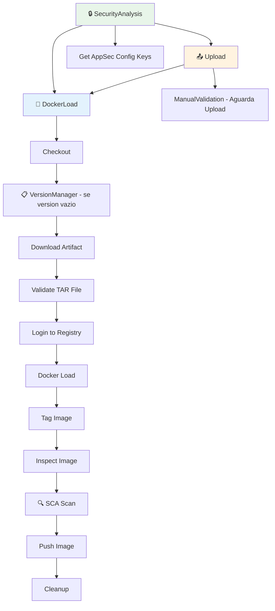

# Docker Load

Pipeline de CI para carregar imagens Docker a partir de arquivos `.tar` e publicar no Azure Container Registry (ACR).

## 🎯 Descrição

Este pipeline foi desenvolvido para cenários onde a imagem Docker é recebida de fontes externas (parceiros, fornecedores ou terceiros) em formato `.tar`. O arquivo pode ser enviado por e-mail ou outro canal, e então carregado e publicado no ACR corporativo através de **upload manual via Azure CLI** durante a execução do pipeline.

O pipeline oferece três modos de operação: upload manual via Azure CLI (padrão e recomendado para arquivos de parceiros), arquivo commitado no repositório, ou via Secure Files do Azure DevOps Library. Suporta arquivos `.tar` e `.tar.gz` (compactados com gzip).

Este pipeline **não executa SAST** (Fortify) pois não há código-fonte disponível, porém **executa análise SCA** (Dependency Track) na imagem Docker se habilitado pelo time de AppSec via AppConfig.

- [Pipeline utilizado para testes](https://dev.azure.com/telefonica-vivo-brasil/DVPS%20-%20DEVOPS/_build?definitionId=41829&_a=summary)
- [Repositório de exemplo](https://dev.azure.com/telefonica-vivo-brasil/DVPS%20-%20DEVOPS/_git/load-docker-image?version=GBmaster)

## 🚀 Quick Start (5 minutos)

1. Receba o arquivo `.tar` do parceiro/fornecedor por e-mail
2. Crie `.azuredevops/pipelines/ci.yaml` na raiz do repositório
3. Cole o código de exemplo abaixo
4. Crie um arquivo para versionamento (opcional) `version.txt` com a versão inicial, ex: `1.0.0`
5. Commit e push
6. Execute o pipeline manualmente
7. Faça upload do arquivo via Azure CLI conforme instruções exibidas
8. Clique em "Resume" para continuar
9. ✅ Pipeline publica a imagem no ACR!
10. Configure o pipeline de CD para deploy da imagem (veja opções no catálogo)

```yaml
# Pipeline para carregar imagem Docker de arquivo .tar (upload manual)
# .azuredevops/pipelines/ci.yaml
resources:
  repositories:
    - repository: CodePlay
      name: DevOps/Vivo.CodePlay.Pipelines
      type: git
      ref: refs/heads/master
      endpoint: CodePlay

extends:
  template: /tech_products/dvps/docker-load/pipeline.yaml@CodePlay
  parameters:
    sigla: 'minha-sigla'
    version: '1.0.0'  # Ou omita para usar versão automática do version.txt
```

### Versão Automática (version.txt)

Se você não informar o parâmetro `version`, o pipeline irá automaticamente:
1. Ler a versão atual do arquivo `version.txt` no repositório
2. Incrementar a versão (patch) usando VersionManagerVivo
3. Usar a nova versão para tagear a imagem Docker

```yaml
# Exemplo com versão automática
extends:
  template: /tech_products/dvps/docker-load/pipeline.yaml@CodePlay
  parameters:
    sigla: 'minha-sigla'
    # version omitido - usa version.txt automaticamente
```

**O que acontece com esta configuração:**

- ⏸️ Pipeline pausa e exibe instruções de upload via Azure CLI
- 📤 Você faz upload do arquivo `.tar` usando o comando exibido
- ▶️ Você clica em "Resume" para continuar
- 📥 Download do artefato uploadado
- 🐳 Carregamento da imagem Docker via `docker load`
- 🏷️ Aplicação de tag com a versão informada
- 📤 Push para ACR usando service connection `ACR-DEVOPS`
- 🧹 Limpeza das imagens locais após publicação

## 🏗️ Matriz de Capacidades

| Capacidade | Suporte | Descrição |
|------------|---------|-----------|
| [Trunk Based Development](https://dvps.redecorp.azr/portal/codeplay/capacidades/catalog/trunk-based-development) | ✅ | Pipeline executado em qualquer branch |
| [Build Automatizado](https://dvps.redecorp.azr/portal/codeplay/capacidades/catalog/build-automatizado) | ❎ | Não aplicável - pipeline carrega imagem pronta, não faz build |
| [Testes Unitários](https://dvps.redecorp.azr/portal/codeplay/capacidades/catalog/testes-unitarios) | ❎ | Não aplicável - imagem fornecida por terceiros |
| [SAST](https://dvps.redecorp.azr/portal/codeplay/capacidades/catalog/sast) | ❌ | Não implementado - código-fonte não disponível |
| [SCA](https://dvps.redecorp.azr/portal/codeplay/capacidades/catalog/sca) | ✅ | Análise de composição de software via Dependency Track |
| [Gates de Segurança](https://dvps.redecorp.azr/portal/codeplay/capacidades/catalog/gates-de-seguranca) | ⚠️ | Controlado pelo time de AppSec via AppConfig |
| [Análise de Código](https://dvps.redecorp.azr/portal/codeplay/capacidades/catalog/analise-de-codigo) | ❌ | Não aplicável - código-fonte não disponível |
| [Gates de Qualidade](https://dvps.redecorp.azr/portal/codeplay/capacidades/catalog/gate-de-qualidade) | ❌ | Não implementado |
| [Rollback de Upgrade](https://dvps.redecorp.azr/portal/codeplay/capacidades/catalog/rollback-de-upgrade) | ❎ | Pipeline de CI - não aplicável para rollback de deploy |
| [Blue/Green Deployment](https://dvps.redecorp.azr/portal/codeplay/capacidades/catalog/blue-green-deployment) | ❎ | Pipeline de CI - estratégias de deployment são responsabilidade do CD |
| [Canary Release](https://dvps.redecorp.azr/portal/codeplay/capacidades/catalog/canary-release) | ❎ | Pipeline de CI - estratégias de release são responsabilidade do CD |

**Legenda:**

- ✅ Suportado nativamente
- ❌ Não suportado
- ⚠️ Suportado com limitações ou condições
- 🚧 Planejado / Em Construção
- ❎ Não faz sentido habilitar essa capacidade

## 🔄 Estrutura do Pipeline

O pipeline possui até três estágios dependendo da origem do arquivo. O estágio `SecurityAnalysis` sempre executa para obter configurações de segurança. Quando `tarSource=manualUpload` (padrão), o estágio `Upload` aguarda o upload via Azure CLI antes de prosseguir para o estágio `DockerLoad`.



### Estágios do Pipeline

1. **🔒 Security Analysis**
   - Obtém configurações de segurança do AppConfig corporativo
   - Determina se SCA deve ser executado (flag `USE_DT_DOCKER`)
   - Configura gates de segurança conforme políticas do AppSec

2. **📤 Aguardar Upload do Arquivo** (Condicional - apenas quando `tarSource=manualUpload`)
   - Exibe instruções detalhadas para upload via Azure CLI
   - Aguarda confirmação do usuário (ManualValidation)
   - Permite upload de arquivo `.tar` ou `.tar.gz`

3. **🐳 Docker Load and Push**
   - Checkout do repositório
   - **Versionamento automático** (se `version` não informado) - Lê versão do `version.txt` via VersionManagerVivo
   - Download do artefato uploadado (ou leitura do repositório/Secure File)
   - Validação da existência do arquivo `.tar`
   - Login no Azure Container Registry
   - Carregamento da imagem via `docker load` (suporta `.tar` e `.tar.gz`)
   - Aplicação de tag com sigla, nome do repositório e versão
   - Inspeção da imagem carregada
   - **SCA Scan** (se habilitado pelo AppSec) - Análise de composição de software via Dependency Track
   - Push da imagem para o ACR
   - Limpeza das imagens locais

## ⚙️ Parâmetros Disponíveis

### Infraestrutura e Ambiente

#### agentPool

- **nome**: agentPool
- **tipo**: string
- **default**: `GeneralPurposeLinuxAgentsCI`
- **descrição**: Agent Pool para execução do pipeline. Deve ser um pool Linux com Docker instalado.
- **dependências**: Nenhuma.

### Configurações do Projeto

#### sigla

- **nome**: sigla
- **tipo**: string
- **default**: `$(SIGLA)` (extraído automaticamente do nome do projeto)
- **descrição**: Sigla do projeto. Utilizada para compor o nome da imagem no formato `{sigla}/{nome-repositorio}:{versao}`. Se não informado, é extraída automaticamente do nome do projeto no Azure DevOps.
- **dependências**: Nenhuma.

#### version

- **nome**: version
- **tipo**: string
- **default**: `''`
- **descrição**: Versão da imagem Docker. Se não informado, será lida automaticamente do arquivo `versionFile` usando VersionManagerVivo.
- **dependências**: Se não informado, requer arquivo `version.txt` (ou `versionFile` configurado) no repositório.

#### versionFile

- **nome**: versionFile
- **tipo**: string
- **default**: `version.txt`
- **descrição**: Arquivo onde será lida a versão automaticamente quando o parâmetro `version` não for informado. Utiliza VersionManagerVivo com incremento `patch`.
- **dependências**: Parâmetro `version` deve estar vazio para utilizar esta funcionalidade.

### Configurações de Docker

#### imageName

- **nome**: imageName
- **tipo**: string
- **default**: ''
- **descrição**: Nome da imagem Docker. Se não informado, será gerado automaticamente usando a sigla e o nome do repositório.
- **dependências**: Nenhuma.

#### registryServiceConnection

- **nome**: registryServiceConnection
- **tipo**: string
- **default**: `ACR-DEVOPS`
- **descrição**: Nome da Service Connection do Azure Container Registry para publicação da imagem.
- **dependências**: Service Connection configurada no projeto Azure DevOps.

#### registryUrl

- **nome**: registryUrl
- **tipo**: string
- **default**: `acrsharedservices01.azurecr.io`
- **descrição**: URL do Container Registry onde a imagem será publicada. Deve corresponder ao registry configurado na Service Connection.
- **dependências**: Deve ser compatível com a `registryServiceConnection` informada.

### Configurações do Arquivo .tar

#### tarSource

- **nome**: tarSource
- **tipo**: string
- **default**: `manualUpload`
- **descrição**: Define a origem do arquivo `.tar`. Valores possíveis: `manualUpload` (upload via Azure CLI durante execução), `repository` (arquivo commitado no repositório), `secureFile` (arquivo no Secure Files do Library).
- **dependências**: Dependendo do valor, outros parâmetros são obrigatórios.

#### tarFilePath

- **nome**: tarFilePath
- **tipo**: string
- **default**: `''`
- **descrição**: Caminho relativo do arquivo `.tar` no repositório. Obrigatório quando `tarSource=repository`. Exemplo: `images/minha-imagem.tar`.
- **dependências**: Arquivo deve existir no repositório e estar commitado.

#### secureFileName

- **nome**: secureFileName
- **tipo**: string
- **default**: `''`
- **descrição**: Nome do arquivo no Secure Files do Azure DevOps Library. Obrigatório quando `tarSource=secureFile`.
- **dependências**: Arquivo deve estar no Library > Secure files e pipeline autorizado.

#### artifactName

- **nome**: artifactName
- **tipo**: string
- **default**: `docker-tar`
- **descrição**: Nome do artefato para upload manual. Usado quando `tarSource=manualUpload`.
- **dependências**: Nenhuma.

## 🔧 Dependências Externas

### Service Connections Necessárias

#### 1. Azure Container Registry (ACR)

- **Nome padrão**: `ACR-DEVOPS`
- **Tipo**: Docker Registry
- **Uso**: Publicação de imagens Docker no ACR corporativo
- **Permissões necessárias**:
  - `AcrPush` - para push de imagens
  - `AcrPull` - para verificação de imagens existentes
- **Configurável via**: parâmetro `registryServiceConnection`

### Agent Pool Requirements

#### Pool de Agentes

- **Pool padrão**: `GeneralPurposeLinuxAgentsCI`
- **Sistema Operacional**: Linux
- **Ferramentas obrigatórias**:
  - Docker Engine
  - Git
  - Utilitário `file` (para detecção de compressão gzip)
  - Utilitário `gunzip` (para descompressão de `.tar.gz`)
- **Acesso de rede**:
  - Acesso ao Azure Container Registry (`acrsharedservices01.azurecr.io`)
  - Acesso ao proxy corporativo: `10.240.58.39:3128`

### Pré-requisitos para Upload Manual (Azure CLI)

Para usar o modo `tarSource=manualUpload` (padrão), você precisa:

1. **Azure CLI** instalado: https://learn.microsoft.com/pt-br/cli/azure/install-azure-cli
2. **Extensão Azure DevOps**:
   ```bash
   az extension add --name azure-devops
   ```
3. **Login no Azure**:
   ```bash
   az login
   ```

### Variáveis de Sistema Necessárias

| Variável | Origem | Uso |
|----------|--------|-----|
| `Build.SourcesDirectory` | Azure DevOps | Diretório raiz do checkout |
| `Build.Repository.Name` | Azure DevOps | Nome do repositório para compor nome da imagem |
| `Build.BuildId` | Azure DevOps | ID da execução (usado no upload manual) |
| `System.CollectionUri` | Azure DevOps | URL da organização |
| `System.TeamProject` | Azure DevOps | Nome do projeto |

## 🎨 Comportamentos Customizados

> **⚠️ ATENÇÃO: CUSTOMIZAÇÕES REQUEREM RESPONSABILIDADE ⚠️**
>
> - ✅ **Use os exemplos como ponto de partida** - Eles demonstram padrões seguros e testados
> - 🧠 **"Todos somos adultos"** - Confiamos na sua expertise, mas exigimos consciência do impacto
> - 📝 **Tudo fica registrado** - Seu histórico de commits é auditável e rastreável
> - 🎯 **Entenda antes de modificar** - Customizações incorretas podem quebrar builds em produção
> - 🤝 **Documente suas decisões** - Facilite a manutenção futura por outros membros da equipe
>
> **Customizar é permitido. Fazer sem entender não é.**

### Upload Manual via Azure CLI (Padrão) ⭐

```yaml
# .azuredevops/pipelines/ci.yaml
parameters:
- name: sigla
  type: string
- name: version
  type: string
resources:
  repositories:
    - repository: CodePlay
      name: DevOps/Vivo.CodePlay.Pipelines
      type: git
      ref: refs/heads/master
      endpoint: CodePlay

extends:
  template: /tech_products/dvps/docker-load/pipeline.yaml@CodePlay
  parameters:
    sigla: ${ { parameters.sigla } }
    version: ${ { parameters.version } }
```

### Arquivo .tar no Repositório

```yaml
# .azuredevops/pipelines/ci.yaml
resources:
  repositories:
    - repository: CodePlay
      name: DevOps/Vivo.CodePlay.Pipelines
      type: git
      ref: refs/heads/master
      endpoint: CodePlay

extends:
  template: /tech_products/dvps/docker-load/pipeline.yaml@CodePlay
  parameters:
    sigla: 'minha-sigla'
    version: '1.0.0'
    tarSource: 'repository'
    tarFilePath: 'images/imagem-parceiro.tar'
```

### Arquivo via Secure Files (Library)

```yaml
# .azuredevops/pipelines/ci.yaml
resources:
  repositories:
    - repository: CodePlay
      name: DevOps/Vivo.CodePlay.Pipelines
      type: git
      ref: refs/heads/master
      endpoint: CodePlay

extends:
  template: /tech_products/dvps/docker-load/pipeline.yaml@CodePlay
  parameters:
    sigla: 'minha-sigla'
    version: '2.0.0'
    tarSource: 'secureFile'
    secureFileName: 'imagem-vendor-v2.tar'
```

### Nome de Imagem Customizado

```yaml
extends:
  template: /tech_products/dvps/docker-load/pipeline.yaml@CodePlay
  parameters:
    sigla: 'parceiro'
    version: '3.0.0'
    imageName: 'custom/vendor-app'  # Nome customizado
```

## 🔖 Variáveis de Ambiente

As seguintes variáveis de ambiente são automaticamente configuradas pelo pipeline:

| Variável | Descrição | Valor Padrão |
|----------|-----------|--------------|
| `SIGLA` | Sigla do projeto (extraída do nome do projeto) | Primeira palavra do `System.TeamProject` |
| `IMAGE_NAME` | Nome da imagem composto pela sigla e nome do repositório | `{sigla}/{Build.Repository.Name}` |
| `IMAGE_VERSION` | Versão da imagem | Parâmetro `version` ou versão do `versionFile` |
| `DOCKER_BUILDKIT` | Habilita BuildKit para operações Docker | `1` |
| `DOCKER_SERVICE_CONNECTION` | Service Connection do registry | Valor do parâmetro `registryServiceConnection` |
| `USE_DT_DOCKER` | Flag AppSec para habilitar SCA | Obtido do AppConfig |
| `FORTIFY_APP_VERSION` | Versão da aplicação para relatórios de segurança | Definido pelo template de segurança |
| `PROXY_SQUID_SERVER` | Servidor proxy corporativo | `10.240.58.39:3128` |
| `PROXY_AGENT_HTTP` | Proxy HTTP | `http://10.240.58.39:3128` |
| `PROXY_AGENT_HTTPS` | Proxy HTTPS | `http://10.240.58.39:3128` |

## 📦 Como Fazer Upload do Arquivo .tar

### Opção 1: Upload Manual via Azure CLI (Recomendado) ⭐

Ideal para arquivos recebidos por e-mail de parceiros/fornecedores.

#### Passo 1: Execute o Pipeline

Execute o pipeline normalmente. Ele irá pausar e exibir instruções.

#### Passo 2: Instale o Azure CLI (se necessário)

- **Windows**: https://learn.microsoft.com/pt-br/cli/azure/install-azure-cli-windows
- **macOS**: `brew install azure-cli`
- **Linux**: https://learn.microsoft.com/pt-br/cli/azure/install-azure-cli-linux

```bash
# Instale a extensão Azure DevOps
az extension add --name azure-devops
```

#### Passo 3: Faça Login e Upload

O pipeline exibirá o comando exato. Exemplo:

```bash
# Login no Azure
az login

# Upload do arquivo (substitua os valores)
az pipelines runs artifact upload \
  --artifact-name docker-tar \
  --path "/caminho/para/imagem.tar" \
  --run-id 12345 \
  --organization https://dev.azure.com/telefonica-vivo-brasil \
  --project "Meu Projeto"
```

#### Passo 4: Continue o Pipeline

Clique em **"Resume"** no Azure DevOps para continuar a execução.

---

### Opção 2: Arquivo no Repositório

Para arquivos que podem ser versionados no Git.

```bash
# Configure Git LFS para arquivos grandes
git lfs track "*.tar"
git lfs track "*.tar.gz"
git add .gitattributes
git commit -m "Configure Git LFS"

# Adicione o arquivo
git add images/imagem.tar
git commit -m "Add vendor image v1.0.0"
git push
```

---

### Opção 3: Secure Files (Library)

Para arquivos que não devem estar no repositório.

1. Acesse **Pipelines → Library → Secure files**
2. Clique em **+ Secure file**
3. Faça upload do arquivo `.tar`
4. Autorize o pipeline em **Pipeline permissions**

---

### Como o Parceiro Deve Gerar o Arquivo .tar

Instrua o parceiro a executar:

```bash
# Salva a imagem em formato .tar
docker save -o minha-imagem.tar nome-da-imagem:tag

# Ou com compressão gzip (menor tamanho para envio por e-mail)
docker save nome-da-imagem:tag | gzip > minha-imagem.tar.gz
```

## ❓ FAQ

### Onde posso encontrar mais informações sobre o CodePlay Framework?

Você pode encontrar mais informações sobre o CodePlay Framework na [documentação oficial](https://dvps.redecorp.azr/portal/codeplay/framework/).

### Onde encontro as capacidades disponíveis?

As capacidades disponíveis podem ser encontradas no [Catálogo de Capacidade](https://dvps.redecorp.azr/portal/catalog/capabilities) no Portal CodePlay.

### Como faço para customizar o pipeline?

Siga o guia de [Adoção ao CodePlay](https://dvps.redecorp.azr/portal/codeplay/roteiro/codeplay#fluxo-de-ado%C3%A7%C3%A3o-ao-codeplay).

### Quais casos de uso relevantes?

- [Docker Build Mais Rapido](https://dvps.redecorp.azr/portal/code/casos-de-uso/docker-build-mais-rapido)
- [Integrando CICD](https://dvps.redecorp.azr/portal/code/casos-de-uso/integrando-cicd)
- Veja o [Catálogo de Casos de Uso](https://dvps.redecorp.azr/portal/catalog/casos-de-uso) para outros exemplos de casos de uso.

### Quais Erros Comuns relevantes?

- Ainda não temos nenhum erro comum documentado para este pipeline.
- Veja o [Catálogo de Erros Conhecidos](https://dvps.redecorp.azr/portal/catalog/erros-conhecidos) para outros exemplos de erros.

### Por que não há análise SAST (Fortify)?

Este pipeline foi desenhado para imagens de fornecedores externos onde o código-fonte não está disponível. A análise SAST (Fortify) requer acesso ao código-fonte, portanto não é aplicável. Porém, o pipeline **executa análise SCA** (Dependency Track) na imagem Docker para identificar vulnerabilidades em dependências, se habilitado pelo time de AppSec.

### Qual o tamanho máximo do arquivo .tar?

Para upload via Azure CLI, o limite depende da configuração do Azure DevOps. Para arquivos no repositório, recomendamos Git LFS para arquivos > 50MB.

### O pipeline suporta arquivos compactados?

Sim! O pipeline detecta automaticamente se o arquivo está compactado com gzip (`.tar.gz`) e descompacta antes de executar o `docker load`.

## 🆘 Suporte

- [Abra um chamado para Dev Support](https://dvps.redecorp.azr/portal/codeplay/roteiro/#:~:text=Abra%20um%20chamado%20para%20Dev%20Support)
- [Canal DevEx - Azure DevOps](https://teams.microsoft.com/l/channel/19%3A8fbd00946cf044d7a844182ac71e6aa1%40thread.tacv2/Azure%20DevOps?groupId=038b4415-d6dd-42ce-92e5-31a8e2a13bf8&tenantId=9744600e-3e04-492e-baa1-25ec245c6f10)

## 📝 Decisões Tomadas

### Decisão 1: Pipeline ser um tech_product do CodePlay e não um pipeline do framework

- **Data**: 08/12/2025
- **Motivador**: Pipeline deve ser adotado apenas em casos especiais e não devem ser incentivados para todos os projetos
- **Forum Envolvido**: Equipe DVPS
- **Descrição**: O pipeline foi desenvolvido como um tech_product do CodePlay para atender casos específicos de carregamento de imagens Docker de terceiros. Embora seja desenvolvido no padrão framework, não é um pipeline padrão para todos os projetos, evitando adoção indevida, portanto não será catalogado como pipeline do framework.

### Decisão 2: SAST desabilitado, SCA habilitado

- **Data**: 08/12/2025
- **Motivador**: Imagens de fornecedores externos não possuem código-fonte disponível para análise SAST
- **Forum Envolvido**: Equipe DVPS e AppSec
- **Descrição**: O pipeline não executa análises Fortify (SAST) pois não há código-fonte disponível. Porém, executa análise SCA via Dependency Track na imagem Docker, permitindo identificar vulnerabilidades em dependências. O SCA é controlado pelo time de AppSec via flags no AppConfig corporativo (`USE_DT_DOCKER`). Pipelines de build interno devem usar o template `build-docker/pipeline.yaml` que inclui análises SAST e SCA completas.


