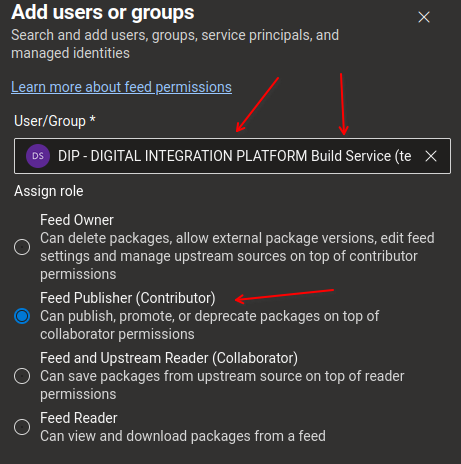

# Java Artifacts

Publicacao de `Componentes Java` no `Azure Artifacts` usando `maven`.

## Capacidades
* Lite
  * **Constroi**, **Testa** e **Empacota** projeto `Java` x `Maven`
  * Adaptavel a modelos de projetos **Maven Solo** e **Multimodulos** (*desde que o **pom.xml** parent fique na raiz*)
  * **Bump automatico** de numero de versao e tag
  * **Constroi** e **Empura** artefatos java para o **Azure Artifacts**
  * Upload de logs para **Auditoria**
* Gold
  * **Sonar Scan** para projetos **Maven Solo** e **Multimodulos**
  * **Fortify Scan**
  * **SCA**

### Como usar

> **Sobre os exemplos abaixo:**
> *   Alguns comentarios sao previsao onde ficarao as referencias futuras de maturidade.

`.azuredevops/azure-pipeline-ci.yml`
```yaml
trigger:
  branches:
    include:
      - 'master'
      - 'main'
      - 'codeplay'
  paths:
    exclude:
      - .azuredevops/*cd.*
      - .azuredevops/*pr.*
resources:
  repositories:
  - repository: CodePlay
    name: DevOps/Vivo.CodePlay.Pipelines
    type: git
    ref: refs/heads/master
    endpoint: CodePlay

parameters:
- name: environment
  displayName: 'Escolha o ambiente para publicar'
  type: string
  default: dev
  values:
  - dev
  - esteira1
  - esteira2
  - esteira3
  - preprod
  - production
  - prodlike

extends:  
  ## Maturidades disponiveis
  template: /tech_products/dvps/java/trunkbased/artifacts-mvn/lite-ci.yaml@CodePlay
  # template: /tech_products/dvps/java/trunkbased/artifacts-mvn/gold-ci.yaml@CodePlay
  # template: /tech_products/dvps/java/trunkbased/artifacts-mvn/platinum-ci.yaml@CodePlay
  # template: /tech_products/dvps/java/trunkbased/artifacts-mvn/diamond-ci.yaml@CodePlay
  parameters:
    # Valores aceitaveis sao [dev | test | production | esteira1 | esteira2 | preprod | prodlike]
    environment: ${{ parameters.environment }}


```

`.azuredevops/azure-pipeline-cd.yml`
```yaml
parameters:
- name: environment
  displayName: 'Escolha o ambiente para publicar'
  type: string
  default: preprod
  values:
  - dev
  - esteira1
  - esteira2
  - esteira3
  - preprod
  - production
  - prodlike

trigger: none

resources:
  repositories:
  - repository: CodePlay
    name: DevOps/Vivo.CodePlay.Pipelines
    type: git
    ref: refs/heads/master
    endpoint: CodePlay

extends:  
  template: /tech_products/dvps/java/trunkbased/artifacts-mvn/lite-cd.yaml@CodePlay
  # template: /tech_products/dvps/java/trunkbased/artifacts-mvn/gold-cd.yaml@CodePlay
  # template: /tech_products/dvps/java/trunkbased/artifacts-mvn/platinum-cd.yaml@CodePlay
  # template: /tech_products/dvps/java/trunkbased/artifacts-mvn/diamond-cd.yaml@CodePlay
  parameters:
    # Nomes de variable groups (opcional)
    #   Usado basicamente para substituir valores e segredos dos arquivos 'config/{environment}/*.yaml'
    #   que iram compor o deployment do kubernetes
    variable_groups:
    - azdo-team-project-variables
    - ms-teste-pipeline-e2e-remover-v1

    # Valores aceitaveis sao [dev | test | production | esteira1 | esteira2 | preprod | prodlike]
    # Valor padrao 'dev'
    environment: ${{ parameters.environment }}

    # Numero do CHG para validacao no VivoNow (⚠️ OBRIGATORIO para 'production')
    vivonow_chg: ${{ parameters.vivonow_chg }}

```

`.azuredevops/azure-pipeline-pr.yml`
```yaml
trigger:
  branches:
    include:
      - 'master'
      - 'main'
      - 'develop'
      - 'release'
      - 'codeplay'
  paths:
    exclude:
      - .azuredevops/*cd.*

resources:
  repositories:
  - repository: CodePlay
    name: DevOps/Vivo.CodePlay.Pipelines
    type: git
    ref: refs/heads/master
    endpoint: CodePlay

extends:  
  template: /tech_products/dvps/java/trunkbased/artifacts-mvn/lite-pr.yaml@CodePlay
  # template: /tech_products/dvps/java/trunkbased/artifacts-mvn/gold-pr.yaml@CodePlay
  # template: /tech_products/dvps/java/trunkbased/artifacts-mvn/platinum-pr.yaml@CodePlay
  # template: /tech_products/dvps/java/trunkbased/artifacts-mvn/diamond-pr.yaml@CodePlay
```

## Dependencias e configuracoes

### Configuracoes no `Azure DevOps`

Ambientes dentro do seu projeto (`AzureDevOps > Pipelines > Environments`)

* `deploy-dev`
* `deploy-production`

### Permissoes

Em [telefonica-vivo-brasil > DevOps > Artifacts > permissions](https://dev.azure.com/telefonica-vivo-brasil/DevOps/_artifacts/feed/DevOps/settings/permissions) adicione o perfil **Build Service** do seu projeto como **Feed Publisher (Contributor)**




### Arquivos dentro do `Azure Repos` (git)

> Antes de executar verifique se o seu repositorio tem esses arquivos com essas configuracoes minimas.

```
📂.azuredevops
 ┣ 📜sonar-project.properties
 ┣ 📜[artifacts]-settings.xml (o prefixo pode ser alterado)
 ┗ 📜sonar.env
📜catalog-info.yaml
📜pom.xml
```

`./catalog-info.yaml`
```yaml
  metadata:
    name: ms-...-v[1...N]
    annotations:
      techarch.governance-app.acronym: 'dip'
      techarch.governance-app.module: 'common-domain'
      sonarqube.org/project-key: ''
      arqtech.telefonica.com.br/language-version: '[7, 8, 11, 17, 19, 21]'
```

`./pom.xml`
```xml
<?xml version="1.0" encoding="UTF-8"?>
<project ...>
  <groupId>br.com.tlf.dip</groupId> 
  <artifactId>ms-...-v[1...N]</artifactId>
  <version>1.0.0</version>
  
  ...

	<repositories>
		<repository>
			<id>DevOps</id>
			<url>https://pkgs.dev.azure.com/telefonica-vivo-brasil/_packaging/DevOps/maven/v1</url>
			<releases>
				<enabled>true</enabled>
			</releases>
			<snapshots>
				<enabled>true</enabled>
			</snapshots>
		</repository>
	</repositories>
	<distributionManagement>
		<repository>
			<id>DevOps</id>
			<url>https://pkgs.dev.azure.com/telefonica-vivo-brasil/_packaging/DevOps/maven/v1</url>
			<releases>
				<enabled>true</enabled>
			</releases>
			<snapshots>
				<enabled>true</enabled>
			</snapshots>
		</repository>
	</distributionManagement>
</project>
```

`.azuredevops/[artifacts]-settings.xml`
```xml
<settings xmlns="http://maven.apache.org/SETTINGS/1.0.0"
          xmlns:xsi="http://www.w3.org/2001/XMLSchema-instance"
          xsi:schemaLocation="http://maven.apache.org/SETTINGS/1.0.0
                              https://maven.apache.org/xsd/settings-1.0.0.xsd">
  ...
  <servers>
    <server>
      <id>DevOps</id>
      <username>telefonica-vivo-brasil</username>
      <password>${SYSTEM_ACCESSTOKEN}</password>
    </server>
  </servers>
  ...
</settings>
```