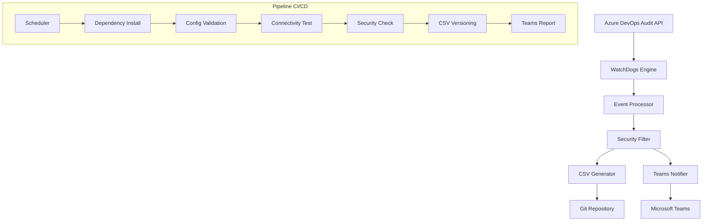

# Azure DevOps WatchDogs — Segurança, Governança e Operação
> O WatchDogs é uma **pipeline automatizada diária** que monitora **alterações de acessos** no Azure DevOps, **classifica riscos**, **envia alertas ao Teams** e **versiona CSVs** com trilha de auditoria. 

---

## 1) WatchDogs — visão geral 
 **O que é ?**

O Azure DevOps Watch Dog é um sistema automatizado de monitoramento de segurança desenvolvido para detectar e alertar sobre modificações críticas de acesso no ambiente Azure DevOps da empresa. O sistema opera em modo pipeline, executando verificações programadas e enviando relatórios detalhados via Microsoft Teams.  

**Objetivo**

- **Segurança & Governança**: controle nominal de acessos, rastreabilidade e conformidade.  
- **Automação**: verificação programada, sem intervenção manual.  
- **Resposta rápida**: alertas dirigidos às equipes responsáveis.

**Conceito**
- **Monitora** mudanças em grupos e permissões;  
- **Detecta** ações suspeitas ou não autorizadas;  
- **Classifica** por criticidade (alto/médio/baixo);  
- **Alerta** via Teams;  
- **Documenta** (CSVs versionados) para auditoria e compliance.

---

## 2) Arquitetura e fluxo (alto nível)

**Coleta**: Azure DevOps Audit API (eventos), com filtros para eventos críticos.  
**Processamento**: classificação por tipo de executor, análise de padrões e enriquecimento de metadados.  
**Entrega**: alertas no Teams + CSVs versionados em Git (histórico auditável).  



> **Obs.**: Caso o Mermaid não renderize no Azure DevOps, visualize o código ou use extensão compatível.

---

## 3) Operação da pipeline

- **Frequência**: diária (agendada na própria pipeline).
- **Janela analisada por execução**: últimas **12 horas**.
- **Modo**: 100% automático.
- **Saídas**:
  - **Teams**: cartões/resumos com indicadores de risco.
  - **Git/CSVs**: documentação detalhada para trilha de auditoria.

## 4) Eventos monitorados & classificação

**Principais eventos**
- Inclusão/remoção de membros em grupos de segurança (**alto**).
- Modificações de permissões (**médio**).
- Operações do Azure DevOps Service/automatizadas (**médio**).

**Por tipo de executor**
- **Usuários nominais (humanos)** → alertas **críticos** (alto risco).
- **Contas de serviço** (`svc_`, `svc-`, `svcdevops`) → geralmente **baixo**.
- **Azure DevOps Service** → **informativos**/**médio**.

> **Eventos adicionais (opcionais/avançados)**: criação/revogação de PAT, criação/remoção de projetos etc. — úteis para postura de segurança ampliada (ver _Detalhamento Técnico_ abaixo).

---

## 5) Segurança & compliance

- **Segredos protegidos**: PAT e Webhook do Teams criptografados e **mascarados em logs**.
- **Menor privilégio**: PAT somente com escopo necessário (leitura de auditoria).
- **Auditoria forte**: CSVs versionados + **hash/commit único** por execução.
- **Health-checks** e **alertas de falha** para garantir confiabilidade do monitoramento.

---

## 6) Configuração (detalhamento técnico)

### 6.1 Variáveis de ambiente obrigatórias

| Variável              | Descrição                                   | Exemplo                                       |
|-----------------------|---------------------------------------------|-----------------------------------------------|
| `AZURE_DEVOPS_URL`    | URL da organização no Azure DevOps          | `https://dev.azure.com/organizacao`           |
| `AZURE_PAT`           | Personal Access Token (leitura de auditoria)| `ghp_xxxxxxxxxxxxxxxxxxxx`                    |
| `TEAMS_WEBHOOK_URL`   | Webhook do canal Teams                      | `https://outlook.office.com/webhook/...`      |

### 6.2 Permissões mínimas do PAT
- **Audit Log**: Read (obrigatório)
- **Project and Team**: Read (recomendado)
- **Identity**: Read (opcional)

### 6.3 Variable Group (Azure DevOps)
Crie um **Variable Group** chamado `Watchdogs` com as 3 variáveis acima e referencie no YAML:

```yaml
variables:
- group: Watchdogs  # contém AZURE_DEVOPS_URL, AZURE_PAT, TEAMS_WEBHOOK_URL
```

### 6.4 Componentes principais (código)
- `WatchDogs.py`: motor principal (autenticação, coleta, filtros, geração de CSV, cache anti-duplicação, conversão UTC→BRT).  
- `send_teams_report.py`: leitura dos CSVs e construção dos payloads do Teams (com integração a commit).  
- `AuditEvent`: dataclass com campos (id, timestamp, action_id, category, actor, email, detalhes, ip, user_agent).  

> **Nota**: a lista de **CRITICAL_SECURITY_EVENTS** pode incluir `Group.UpdateGroupMembership.*`, `Security.*Permissions`, `Token.*PAT`, `Project.*Project`, entre outros.

---

## 7) Formato dos relatórios (CSV)

```csv
Ação;Usuário Afetado;Grupo;Executado por;Email;IP;User Agent;Data/Hora (BR);Detalhes
Adição de membro em grupo;john.doe@company.com;Contributors;admin@company.com;admin@company.com;192.168.1.100;Mozilla/5.0...;16/09/2025 09:30:15;Usuário adicionado ao grupo Contributors
```

Diretrizes:
- **UTF-8**; separador `;` (padrão local); datas com BR/UTC quando aplicável.
- Um **CSV por execução**, versionado em repositório (trilha permanente).

---

## 8) Como solicitar acesso (Vivo Access)

1. Acesse **Vivo Access**: https://acesso.vivo.com.br/  
2. **Gerenciar Meu Acesso** → **Adicionar Acesso**; pesquise pela sigla do projeto (ex.: `AXWY`).  
3. Selecione o **perfil** de governança: `DEVELOPER`, `READER`, `MAINTAINER`, `PCP`, `QA`.  
4. Preencha **justificativa objetiva** e envie.  
5. Aprovações: **N1 (gestor imediato)** e **N2 (gestor técnico do projeto/aplicação)**.

> Acesso **nominal** e **auditável**: elimina credenciais genéricas/compartilhadas, cumpre requisitos de compliance e assegura rastreabilidade.

---

## 9) Responsabilidades (RACI simplificado)

- **Solicitação** — Solicitante/Supervisor: registra no Vivo Access com justificativa.
- **Validação** — Governança: avalia necessidade e aderência às políticas.
- **Cadastro** — TI/Governança: cria usuário/perfil no Azure DevOps.
- **Monitoramento** — WatchDogs: vigia acessos e gera alertas.
- **Auditoria** — Governança: revisões **trimestrais** dos logs/relatórios.

---

## 10) Troubleshooting & FAQ (tópicos comuns)

**Erros de autenticação (401)**: validar PAT e escopos; testar em ferramenta externa.  
**Timeouts de conexão**: checar rede/proxy e aumentar timeout.  
**Webhook Teams inválido (400)**: recriar URL e validar payload.  
**CSV vazio/malformado**: checar permissões de escrita/estrutura e se há eventos na janela.

**Dúvidas frequentes**:
- **IDs mascarados (00000000-0000-0000-0000-000000000000)**: comportamento esperado da Audit API em cenários de privacidade/usuários externos.  
- **Ausência de IP/User-Agent**: depende do cliente (web/API), políticas e versão da API.

---

## 11) Referências
- Esquema YAML do Azure DevOps Pipelines  
- Webhooks/Connectors do Microsoft Teams  
- Azure DevOps REST API (Audit)  
- Procedimentos corporativos — solicitação de acesso via Vivo Access

---

### Observações finais
- Estrutura alinhada ao documento de **wiki**: primeiro o sistema **WatchDogs**, depois **como solicitar acesso**.
