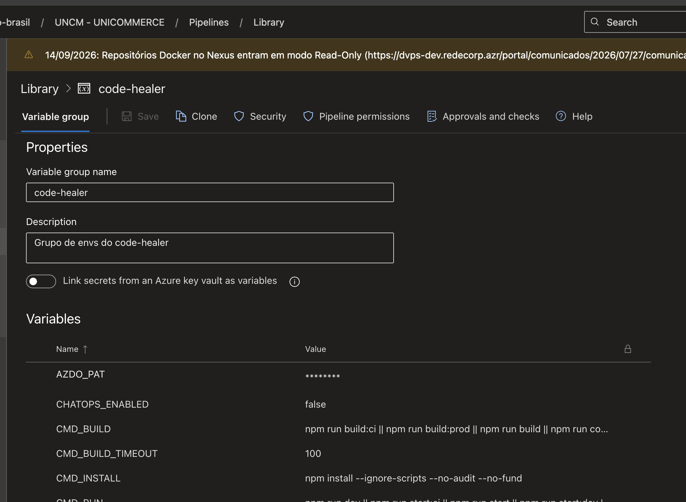

# Code-Healer SCA Agent

Pipeline e agente inteligente para análise e correção automatizada de vulnerabilidades SCA.

O agente atua buscando vulnerabilidades na Conviso e utiliza a base de dados da OSV (_Open Source Vulnerability_) para aplicar as correções iniciais nas dependências. Para garantir total resiliência, a inteligência artificial (LLM) entra em ação apenas em cenários de falha: caso ocorram erros durante o `build`, `test` ou `run`, a IA analisa o problema e ajusta o repositório para contornar a quebra. Todas as alterações são validadas em um ambiente isolado (via Docker) e, após o sucesso, o agente abre Pull Requests automaticamente e reporta os resultados no Teams via ChatOps.

---

## Variáveis de Ambiente (Configuração)

A tabela abaixo compila as variáveis gerenciadas pelo grupo `code-healer`, divididas por contexto de operação.

### 🔴 Autenticação e Integrações (Obrigatórias)

| Variável                             | Descrição                                                                       | Exemplo de Valor                                     |
| ------------------------------------ | ------------------------------------------------------------------------------- | ---------------------------------------------------- |
| `AZDO_PAT`                           | Token de Acesso Pessoal (PAT) do Azure DevOps para operações no Git.            | `********`                                           |
| `CONVISO_API_URL`                    | URL base da API da Conviso.                                                     | `https://api.convisoappsec.com`                      |
| `CONVISO_COMPANY_ID`                 | ID da sua empresa/conta na Conviso.                                             | `430`                                                |
| `COPILOT_URL`                        | URL de endpoint da API do LLM/Copilot interno ou externo.                       | `https://api-copilot.qaloja.vivo.com.br/copilot/ask` |
| `LLM_PROVIDER`                       | Provedor de inteligência artificial a ser utilizado.                            | `GITHUB`                                             |
| `MODEL_NAME`                         | Nome do modelo LLM a ser utilizado para as correções.                           | `claude-sonnet-4.6`                                  |
| `DOCKER_REGISTRY_SERVICE_CONNECTION` | _Service Connection_ do Azure DevOps para autenticação no _container registry_. | `ACR-DEVOPS`                                         |
| `PRIVATE_AGENT_DEFAULT`              | Pool de agentes privados onde a _pipeline_ será executada.                      | `GeneralPurposeLinuxAgentsCD`                        |

### 🟢 Comandos e Validação (Opcionais / Customizáveis)

| Variável                 | Descrição                                                     | Exemplo / Default                                                      |
| ------------------------ | ------------------------------------------------------------- | ---------------------------------------------------------------------- |
| `CMD_INSTALL`            | Comando de instalação de pacotes no container.                | `npm install --ignore-scripts --no-audit --no-fund`                    |
| `COMMAND_BUILD`          | Comando detalhado para gerar a imagem de _build_ base.        | `npm config set cache .npm --local && rm -rf package-lock.json && ...` |
| `CMD_BUILD`              | Comando para compilar a aplicação no sandbox.                 | `npm run build:ci \|\| npm run build:prod \|\| ...`                    |
| `CMD_TEST`               | Comando para rodar a suíte de testes unitários/e2e.           | `npm run test:ci \|\| npm run test:cov \|\| ...`                       |
| `CMD_RUN`                | Comando para validar a subida da aplicação (boot).            | `npm run dev \|\| npm run start:ci \|\| ...`                           |
| `CMD_RUN_FATAL_PATTERNS` | Padrões de log que indicam _crash_ irreversível na etapa RUN. | `"Cannot find module","Error: listen EADDRINUSE","app crashed",...`    |
| `CMD_INSTALL_TIMEOUT`    | Timeout em segundos para o _install_.                         | `100`                                                                  |
| `CMD_BUILD_TIMEOUT`      | Timeout em segundos para o _build_.                           | `100`                                                                  |
| `CMD_TEST_TIMEOUT`       | Timeout em segundos para os _testes_.                         | `100`                                                                  |
| `CMD_RUN_TIMEOUT`        | Timeout em segundos para o período de validação do _run_.     | `200`                                                                  |

### 🟡 Git, Versionamento e Notificações (Opcionais)

| Variável            | Descrição                                                         | Exemplo / Default                                         |
| ------------------- | ----------------------------------------------------------------- | --------------------------------------------------------- |
| `GIT_TARGET_BRANCH` | Branch base alvo para criar as correções e mesclar os PRs.        | `master`                                                  |
| `SCA_BRANCH_PREFIX` | Prefixo usado para o nome das novas _branches_.                   | `fix/sca-vulnerability`                                   |
| `COMMIT_TICKET`     | Prefixo ou tag Jira adicionado às mensagens de _commit_.          | `PTIECOM05-1164`                                          |
| `COMMIT_ON_FAILED`  | Define se o PR será criado mesmo com falha no ciclo de validação. | `false`                                                   |
| `COMMIT_LOCKFILES`  | Define se arquivos de _lock_ alterados subirão no commit.         | `true`                                                    |
| `ARCANE_TEAMS_URL`  | Webhook do Arcane para envio de alertas no Teams.                 | `https://arcane.qaloja.../api/chatops/notifications/send` |
| `CHATOPS_ENABLED`   | Liga/desliga o envio de alertas pelo Teams.                       | `false`                                                   |
| `TEAMS_CHAT_SCA_ID` | ID do canal ou chat do Teams alvo das notificações.               | _(Vazio)_                                                 |

### 🟣 Comportamento do Agente e Estratégia (Opcionais)

| Variável                   | Descrição                                                                         | Exemplo / Default                                  |
| -------------------------- | --------------------------------------------------------------------------------- | -------------------------------------------------- |
| `ENVIRONMENT`              | Ambiente de execução atual da _pipeline_.                                         | `true`                                             |
| `OVERRIDE_STRATEGY_GLOBAL` | `true` altera a dependência pelo pai imediato; `false` exige _path_ estrito.      | `true`                                             |
| `IGNORE_REPOS_REGEX`       | RegEx limitador de escopo para ignorar projetos não compatíveis.                  | `(.*test.*\|.*devops.*\|.*staging.*\|...)`         |
| `MAX_EXECUTIONS_LIMIT`     | Limite global de execuções simultâneas e tentativas lógicas.                      | `3`                                                |
| `REPOS_SCAN_LIMIT`         | Quantidade máxima de projetos processados por ciclo (CRON).                       | `5`                                                |
| `TARGET_VULN_COUNT`        | Limite tolerado de vulnerabilidades pendentes.                                    | `100`                                              |
| `DOCKERFILE_PATH`          | Diretório do _Dockerfile_ de testes do agente.                                    | `.azuredevops/builder.Dockerfile`                  |
| `NPMRC_PATH`               | Caminho físico do arquivo `.npmrc`.                                               | `.npmrc`                                           |
| `CONVISO_VERIFY_SSL`       | Habilita a checagem SSL nos _endpoints_ da Conviso.                               | `false`                                            |
| `SSL_VERIFY`               | Habilita validações SSL no ambiente de requisições.                               | `false`                                            |
| `NO_PROXY`                 | Lista de exceções (_bypass_) de rede corporativa.                                 | `localhost,127.0.0.1,api-copilot...`               |
| `CONVISO_STATUSES`         | Filtro de status das vulnerabilidades no Conviso (valores separados por vírgula). | `RISK_ACCEPTED,IDENTIFIED` / Default: `IDENTIFIED` |

---

## Pré-requisito: arquivo `private.yml`

O entrypoint do Code-Healer carrega obrigatoriamente o arquivo `.azuredevops/variables/private.yml` do seu repositório de pipelines. Esse arquivo é o ponto onde você declara as variáveis e grupos de variáveis específicos do seu contexto.

Crie o arquivo no caminho `.azuredevops/variables/private.yml` com a seguinte estrutura mínima:

```yaml
variables:
  - group: code-healer
  - name: global_poollImage
    value: "default"
```



**Importante: todas as variáveis listadas nesta seção devem ser cadastradas em um Variable Group (Library) do Azure DevOps. O grupo utilizado pela pipeline é o code-healer, conforme exemplo ilustrado na imagem acima.**

---

## Como Implementar a Pipeline

Toda a lógica e inteligência de validação encontram-se encapsuladas nos _templates_ centrais. A esteira suporta dois métodos de acionamento que devem ser configurados em um arquivo `.yml` no seu repositório de pipelines.

### Opção 1: Execução Agendada (CRON / Matriz)

Utilizada para varrer repositórios em lote na madrugada, filtrando base no `IGNORE_REPOS_REGEX`.

```yaml
pool:
  vmImage: $(global_poollImage)

trigger: none

schedules:
  - cron: "0 10 * * 1-5"
    displayName: CodeHealer-SCA
    batch: true
    branches:
      include:
        - master
    always: true

resources:
  repositories:
    - repository: CodePlayPipelines
      name: DevOps/Vivo.CodePlay.Pipelines
      type: git
      ref: refs/heads/master
      endpoint: CorePipelines

extends:
  template: /tech_products/ecmc/code-healer/entrypoint.yml@CodePlayPipelines
  parameters:
    correctionStrategy:
      codeHealer: "SCA"
    maxParallelScans: 5
    minNodeVersion: 16
    branch: master
```

### Opção 2: Execução Manual (Por Repositório)

Utilizada para rodar o Code-Healer de forma cirúrgica e imediata em um repositório alvo. Nesse modo, a esteira pula automaticamente a varredura da Conviso e a geração pesada do SBOM, focando estritamente na análise de código em tempo real.

Ao disparar a _pipeline_ manualmente no Azure DevOps, basta preencher o parâmetro de tela `repository` com o nome exato do repositório (ex: `src-ms-checkout-express`) e a `branch` alvo. A arquitetura de roteamento tratará o ambiente para você.

```yaml
pool: $(PRIVATE_AGENT_DEFAULT)

trigger: none

parameters:
  - name: repository
    displayName: "Nome do repositório (ex: 'src-ms-checkout-express')"
    type: string
    default: ""
  - name: branch
    displayName: "Branch a ser corrigida (ex: 'feat/xpto'). Se informado, commit direto na branch."
    type: string
    default: "master"
  - name: generateSbom
    displayName: "Gerar SBOM e realizar sync na conviso antes de rodar o agente (Single Repo)"
    type: boolean
    default: true

resources:
  repositories:
    - repository: CodePlayPipelines
      name: DevOps/Vivo.CodePlay.Pipelines
      type: git
      ref: refs/heads/master
      endpoint: CorePipelines

extends:
  template: /tech_products/ecmc/code-healer/entrypoint.yml@CodePlayPipelines
  parameters:
    correctionStrategy:
      codeHealer: "SCA"
    maxParallelScans: 1
    minNodeVersion: 16
    repository: ${{ parameters.repository }}
    branch: ${{ parameters.branch }}
    generateSbom: ${{ parameters.generateSbom }}
```

## Resultado da Execução

Ao final da execução, o agente produz um resumo estruturado consumível por pipelines, automações e integrações:

```json
{
  "repoName": "src-ms-checkout-express",
  "sourceBranch": "fix/sca-vulnerability-123",
  "status": "completed",
  "issuesProcessed": 12,
  "totalFixes": 10,
  "prId": "257268",
  "prUrl": "https://dev.azure.com/org/project/_git/repo/pullrequest/257268",
  "error": null,
  "buildSuccess": true
}
```

| Campo             | Descrição                                          |
| ----------------- | -------------------------------------------------- |
| `repoName`        | Nome do repositório processado                     |
| `sourceBranch`    | Branch onde as correções foram aplicadas           |
| `status`          | Status final da execução (`completed` ou `failed`) |
| `issuesProcessed` | Quantidade de vulnerabilidades processadas         |
| `totalFixes`      | Quantidade de correções efetivamente aplicadas     |
| `prId`            | ID do Pull Request criado ou atualizado            |
| `prUrl`           | URL do Pull Request                                |
| `error`           | Mensagem de erro em caso de falha                  |
| `buildSuccess`    | Resultado final da validação de build/testes       |

## Links úteis

- [Documentação oficial do Code-Healer SCA](https://dev.azure.com/telefonica-vivo-brasil/ECMC%20-%20Ecomm%20Cloud%20B2C/_git/src-agent-ai-code-healer-sca-python?path=/README.md)
- [OSV - Open Source Vulnerability Database](https://osv.dev/)
