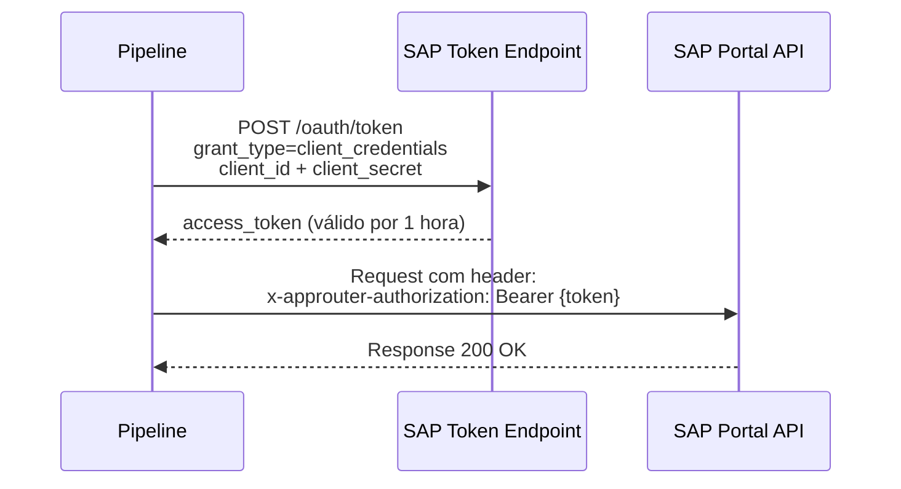
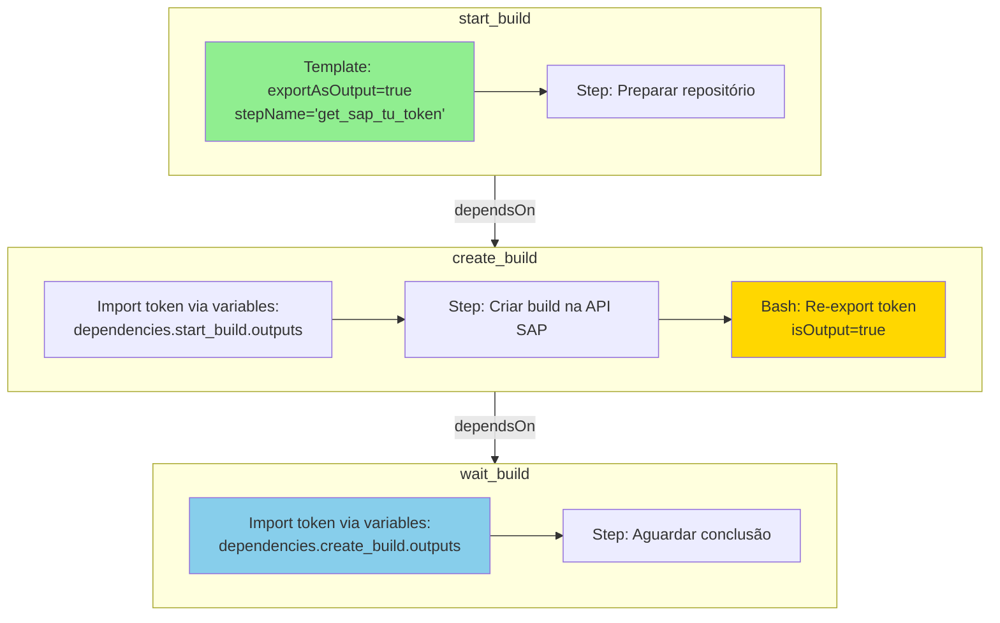
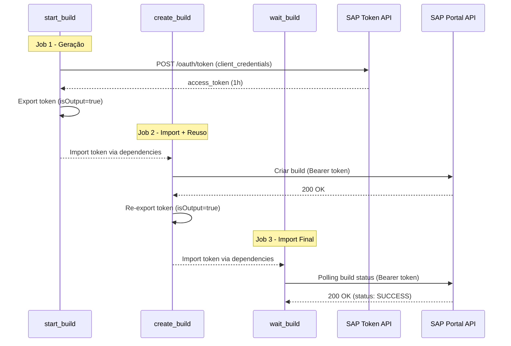
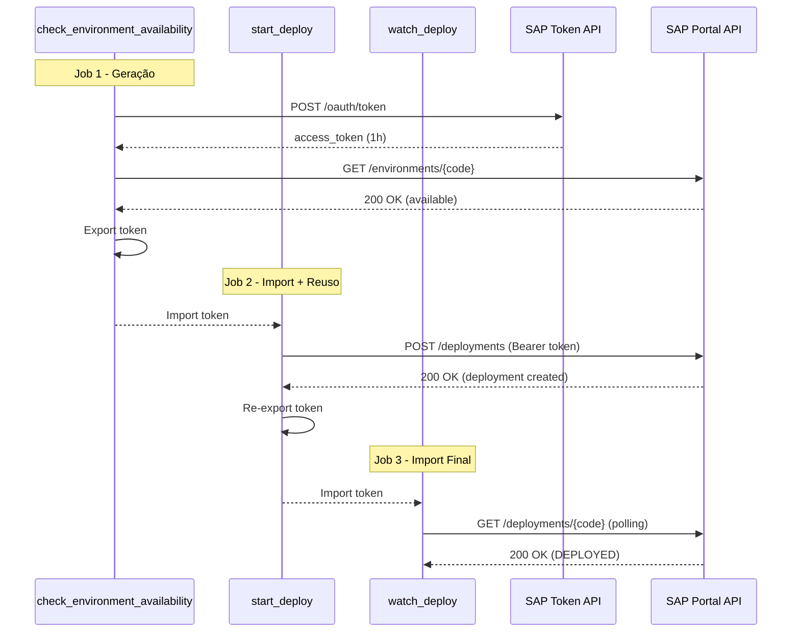
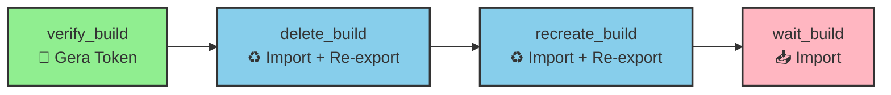

# Documentação - Pipelines SAP Commerce Cloud

## 📑 Índice

- [SAP Commerce Cloud API](#sap-commerce-cloud-api)
- [Autenticação via Technical User](#autenticação-via-technical-user)
- [Gerenciamento de Tokens](#gerenciamento-de-tokens)
- [Template Compartilhado](#template-compartilhado)
- [Estratégia de Export/Import](#estratégia-de-exportimport)
- [Fluxo de Execução](#fluxo-de-execução)
- [Exemplos Práticos](#exemplos-práticos)

---

## SAP Commerce Cloud API

A **SAP Commerce Cloud** fornece uma API REST para automação de operações de build e deploy via **Portal API**.

### Endpoint Base
```
https://portalapi.commerce.ondemand.com/v2
```

### Principais Recursos

| Recurso | Endpoint | Descrição |
|---------|----------|-----------|
| **Builds** | `/subscriptions/{id}/builds` | Criar, listar e consultar builds |
| **Deployments** | `/subscriptions/{id}/deployments` | Criar e monitorar deploys |
| **Environments** | `/subscriptions/{id}/environments` | Consultar ambientes disponíveis |

### Autenticação

Todas as requisições requerem autenticação via **OAuth 2.0** utilizando um **Technical User**.

---

## Autenticação via Technical User

### OAuth 2.0 Client Credentials Flow

A API SAP utiliza o fluxo **Client Credentials** do OAuth 2.0:



### Credenciais Necessárias

As seguintes variáveis devem estar configuradas no **Azure DevOps Library** (grupo `lojaonline-sap-commerce-cloud`):

| Variável | Descrição |
|----------|-----------|
| `SAP_TU_CLIENT_ID` | Client ID do Technical User |
| `SAP_TU_CLIENT_SECRET` | Client Secret (secret) |
| `SAP_TU_TOKEN_ENDPOINT` | URL do endpoint OAuth (`https://auth.sapcp.com/oauth/token`) |
| `SAP_TU_RESOURCE` | Resource identifier (subscription) |

### Ciclo de Vida do Token

- **Validade:** 1 hora (3600 segundos)
- **Buffer de segurança:** 60 segundos (token considerado expirado antes do fim)
- **Renovação:** Automática quando o timestamp atual ultrapassa `expiration - buffer`

---

## Gerenciamento de Tokens

### Problema Original

Antes da otimização, **cada job gerava seu próprio token**, resultando em:

❌ **Múltiplas requisições OAuth desnecessárias**
- Pipeline build: 3 tokens (start_build, create_build, wait_build)
- Pipeline deploy: 3 tokens (check_environment, start_deploy, watch_deploy)
- Pipeline rebuild: 4 tokens (verify, delete, recreate, wait)

❌ **Overhead de rede e latência**

❌ **Maior risco de atingir rate limits da API**

### Solução Implementada

✅ **Token gerado uma única vez por stage**
✅ **Reutilizado entre todos os jobs dependentes**
✅ **Redução de ~60% nas chamadas OAuth**

### Estratégia de Reuso


**Princípios:**
1. **Primeiro job do stage:** Gera o token e exporta com `isOutput=true`
2. **Jobs intermediários:** Importam o token e re-exportam para o próximo
3. **Último job:** Apenas importa (não precisa re-exportar)

---

## Template Compartilhado

### Localização
```
/tech_products/ecmc/sap-commerce/tasks/security/get_sap_tu_token.yaml
```

### Parâmetros

| Parâmetro | Tipo | Default | Descrição |
|-----------|------|---------|-----------|
| `displayName` | string | `'Get SAP Technical User token'` | Nome exibido no log |
| `exportAsOutput` | boolean | `false` | Se `true`, exporta token para jobs dependentes |
| `stepName` | string | `'get_sap_tu_token'` | Nome do step (usado para referenciar outputs) |
| `tokenVariableName` | string | `'SAP_TU_ACCESS_TOKEN'` | Nome da variável do token |
| `expirationVariableName` | string | `'SAP_TU_TOKEN_EXPIRATION'` | Nome da variável de expiração |
| `tokenLifetimeBufferSeconds` | string | `'60'` | Buffer de segurança antes da expiração |

### Comportamento

#### Quando `exportAsOutput=false` (padrão)
- Gera token
- Define variáveis **locais** (disponíveis apenas no job atual)
- Uso: Jobs standalone ou quando não há dependências

#### Quando `exportAsOutput=true`
- Gera token
- Define variáveis **locais** (uso no mesmo job)
- **E** define variáveis com `isOutput=true` (export para jobs dependentes)
- Uso: Primeiro job de uma cadeia de dependências

### Código Relevante

```yaml
# Sempre define variável local (para uso no mesmo job)
echo "##vso[task.setvariable variable=$TOKEN_VARIABLE_NAME;issecret=true]$ACCESS_TOKEN"
echo "##vso[task.setvariable variable=$EXPIRATION_VARIABLE_NAME]$EXPIRATION_TS"

# Se exportAsOutput=true, também exporta para jobs dependentes
if [ "$EXPORT_AS_OUTPUT" == "True" ]; then
  echo "##vso[task.setvariable variable=$TOKEN_VARIABLE_NAME;issecret=true;isOutput=true]$ACCESS_TOKEN"
  echo "##vso[task.setvariable variable=$EXPIRATION_VARIABLE_NAME;isOutput=true]$EXPIRATION_TS"
fi
```

**Importante:** A variável é definida **duas vezes** quando `exportAsOutput=true`:
- **Sem `isOutput`:** Para uso local no mesmo job
- **Com `isOutput`:** Para exportar aos jobs dependentes

> **Razão técnica:** No Azure DevOps, variáveis definidas com `isOutput=true` **não ficam disponíveis** para steps subsequentes no mesmo job - apenas para jobs dependentes.

---

## Estratégia de Export/Import

### Exemplo: Pipeline Build (3 jobs)



### 1. Geração (Primeiro Job)

```yaml
- job: start_build
  steps:
    - template: /tech_products/ecmc/sap-commerce/tasks/security/get_sap_tu_token.yaml
      parameters:
        displayName: 'Get SAP TU token (start build)'
        exportAsOutput: true
        stepName: 'get_sap_tu_token'
```

**Resultado:**
- Variáveis locais criadas: `SAP_TU_ACCESS_TOKEN`, `SAP_TU_TOKEN_EXPIRATION`
- Variáveis exportadas: `start_build.get_sap_tu_token.SAP_TU_ACCESS_TOKEN`, `start_build.get_sap_tu_token.SAP_TU_TOKEN_EXPIRATION`

### 2. Importação e Re-Export (Jobs Intermediários)

```yaml
- job: create_build
  dependsOn: start_build
  variables:
    - name: SAP_TU_ACCESS_TOKEN
      value: $[ dependencies.start_build.outputs['get_sap_tu_token.SAP_TU_ACCESS_TOKEN'] ]
    - name: SAP_TU_TOKEN_EXPIRATION
      value: $[ dependencies.start_build.outputs['get_sap_tu_token.SAP_TU_TOKEN_EXPIRATION'] ]
  steps:
    # Token já disponível via $(SAP_TU_ACCESS_TOKEN)
    
    - bash: |
        echo "##[section]Access token reutilizado (valor oculto)"
        # Re-export para o próximo job
        echo "##vso[task.setvariable variable=SAP_TU_ACCESS_TOKEN;issecret=true;isOutput=true]${SAP_TU_ACCESS_TOKEN}"
        echo "##vso[task.setvariable variable=SAP_TU_TOKEN_EXPIRATION;isOutput=true]${SAP_TU_TOKEN_EXPIRATION}"
      displayName: 'Re-export SAP TU token'
      name: reexport_token
```

**Resultado:**
- Token importado de `start_build`
- Usado nas operações do job
- Re-exportado como `create_build.reexport_token.SAP_TU_ACCESS_TOKEN`

### 3. Importação Final (Último Job)

```yaml
- job: wait_build
  dependsOn: create_build
  variables:
    - name: SAP_TU_ACCESS_TOKEN
      value: $[ dependencies.create_build.outputs['reexport_token.SAP_TU_ACCESS_TOKEN'] ]
    - name: SAP_TU_TOKEN_EXPIRATION
      value: $[ dependencies.create_build.outputs['reexport_token.SAP_TU_TOKEN_EXPIRATION'] ]
  steps:
    # Token já disponível via $(SAP_TU_ACCESS_TOKEN)
    # Não precisa re-exportar (último job)
```

**Resultado:**
- Token importado de `create_build`
- Usado nas operações do job
- Não há re-export (fim da cadeia)

---

## Fluxo de Execução

### Pipeline Build (Gitflow/Trunkbased)



### Pipeline Deploy



### Pipeline Rebuild (4 Jobs)



**Vantagem:** Token dura 1 hora - tempo suficiente para toda a cadeia de 4 jobs.

---

## Exemplos Práticos

### Uso do Template - Gerar e Exportar

```yaml
steps:
  - template: /tech_products/ecmc/sap-commerce/tasks/security/get_sap_tu_token.yaml
    parameters:
      displayName: 'Get SAP TU token (check environment)'
      exportAsOutput: true
      stepName: 'get_sap_tu_token'
```

**Saída esperada no log:**
```
##[section]Solicitando access token (client credentials)
##[section]Token gerado com sucesso (valor oculto)
##[command]expires_in=3600s (buffer 60s)
```

### Importar Token de Job Dependente

```yaml
- job: my_dependent_job
  dependsOn: previous_job
  variables:
    - name: SAP_TU_ACCESS_TOKEN
      value: $[ dependencies.previous_job.outputs['get_sap_tu_token.SAP_TU_ACCESS_TOKEN'] ]
    - name: SAP_TU_TOKEN_EXPIRATION
      value: $[ dependencies.previous_job.outputs['get_sap_tu_token.SAP_TU_TOKEN_EXPIRATION'] ]
```

### Re-exportar Token para Próximo Job

```yaml
- bash: |
    echo "##[section]Access token reutilizado (valor oculto)"
    echo "##vso[task.setvariable variable=SAP_TU_ACCESS_TOKEN;issecret=true;isOutput=true]${SAP_TU_ACCESS_TOKEN}"
    echo "##vso[task.setvariable variable=SAP_TU_TOKEN_EXPIRATION;isOutput=true]${SAP_TU_TOKEN_EXPIRATION}"
  displayName: 'Re-export SAP TU token'
  name: reexport_token
  env:
    SAP_TU_ACCESS_TOKEN: $(SAP_TU_ACCESS_TOKEN)
    SAP_TU_TOKEN_EXPIRATION: $(SAP_TU_TOKEN_EXPIRATION)
```

### Usar Token em Requisição cURL

```yaml
- bash: |
    ACCESS_TOKEN="${SAP_TU_ACCESS_TOKEN}"
    if [ -z "$ACCESS_TOKEN" ] || [ "$ACCESS_TOKEN" == "null" ]; then
      echo "##[error]Access token do Technical User indisponível"
      exit 1
    fi
    
    HTTP_RESPONSE=$(curl -s -w "%{http_code}" \
      -H "x-approuter-authorization: Bearer ${ACCESS_TOKEN}" \
      -H "Accept: application/json" \
      "$API_URL")
    
    echo "Response: $HTTP_RESPONSE"
  env:
    SAP_TU_ACCESS_TOKEN: $(SAP_TU_ACCESS_TOKEN)
    API_URL: $(API_URL_BUILDS)
```

---

## Benefícios da Implementação

### Performance
- ⚡ **60% menos requisições OAuth** (de 3 para 1 por stage)
- ⚡ Redução de latência no início de cada job
- ⚡ Menos overhead de rede

### Confiabilidade
- 🛡️ Menor risco de rate limiting
- 🛡️ Token único garante consistência
- 🛡️ Menos pontos de falha

### Manutenibilidade
- 🔧 Template centralizado e reutilizável
- 🔧 Lógica de geração em um único lugar
- 🔧 Fácil atualização de credenciais

### Observabilidade
- 📊 Logs claros indicando "token reutilizado"
- 📊 Visibilidade do ciclo de vida do token
- 📊 Fácil troubleshooting

---

## Troubleshooting

### Erro: "Access token do Technical User indisponível"

**Causa:** Token não foi exportado corretamente do job anterior.

**Solução:**
1. Verificar se o job anterior tem `exportAsOutput: true`
2. Verificar se o `stepName` está correto na referência
3. Verificar se o job tem `dependsOn` configurado

### Erro HTTP 401

**Causa:** Token expirado ou credenciais inválidas.

**Solução:**
1. Verificar variáveis no Library Group: `SAP_TU_CLIENT_ID`, `SAP_TU_CLIENT_SECRET`
2. Verificar se o Technical User não foi revogado no SAP Portal
3. Verificar se o token não expirou (duração: 1 hora)

### Erro HTTP 423 (Locked)

**Causa:** Ambiente SAP está em uso ou bloqueado.

**Solução:**
1. Verificar no SAP Portal se há operação em andamento
2. Aguardar conclusão da operação atual
3. Re-executar o pipeline

---

## Referências

- [SAP Commerce Cloud Portal API Documentation](https://help.sap.com/docs/SAP_COMMERCE_CLOUD_PUBLIC_CLOUD/b2f400d4c0414461a4bb7e115dccd779/5e7cc5fb13a04ddcb6e7e1dc4be06b75.html)
- [Azure DevOps - Job Output Variables](https://learn.microsoft.com/en-us/azure/devops/pipelines/process/variables?view=azure-devops&tabs=yaml%2Cbatch#set-a-job-scoped-variable-from-a-script)
- [OAuth 2.0 Client Credentials Flow](https://oauth.net/2/grant-types/client-credentials/)

---

**Doc Oficial SAP:**: https://help.sap.com/docs/SAP_COMMERCE_CLOUD_PUBLIC_CLOUD/452dcbb0e00f47e88a69cdaeb87a925d/66abfe678b55457fab235ce8039dda71.html?locale=en-US
**Última atualização:** Março 2026  
**Versão:** 2.0  
**Autor:** Lucas Lobo - ECMC Loja Online
