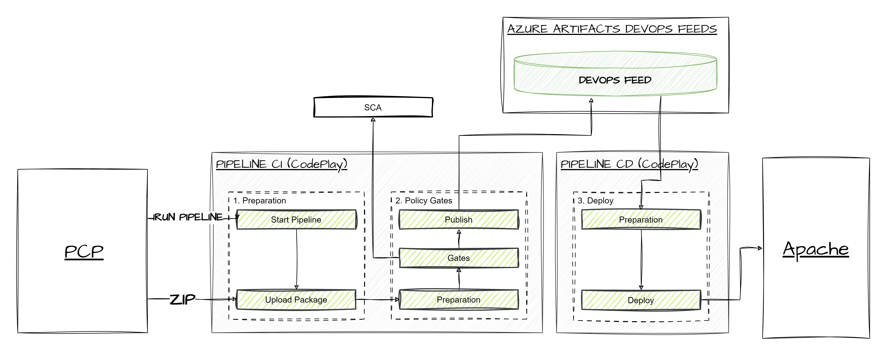
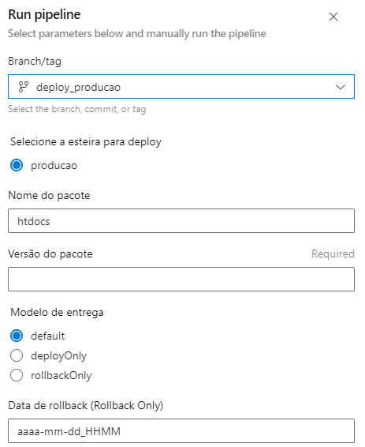
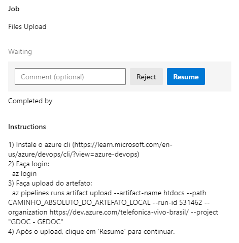

# PIPELINE - GEDOC

Pipeline desenvolvida para viabilizar a entrega de pacotes externos (desenvolvidos por aliados) em ambiente interno da Vivo.

É constituída por esteira de CI e CD e possui 3 configurações de utilização. São elas:

**default**

Com fluxo completo de CI e CD, viabiliza o upload do pacote externo e a sua entrega no ambiente. Possui 3 parâmetros de entrada obrigatórios. São eles:
- nome: O nome do pacote;
- versão: A versão do pacote;
- pacote: O pacote em si, que é solicitado em tempo de execução.

**deployOnly**

Com fluxo somente de CD, viabiliza a entrega de um pacote a partir de seu nome e versão. O pacote deverá, necessariamente existir no feed de produção no Artifacts. Possui 2 parâmetros obrigatórios. Sâo eles:
- nome: O nome do pacote;
- versão: A versão do pacote;

**rollbackOnly**

Viabiliza o rollback de uma versão previamente existente no servidor. Possui 1 parâmetro obrigatórios:
- rollbackDate: A data do backup de um pacote existente no servidor. Possui, necessariamente, o padrão 'aaaa-mm-dd_HHMM'.



**IMAGEM 1 - Desenho Macro do Processo de Entrega**

## CI

Realiza o processo parcial do modelo de CI previsto na Vivo. Isto porque a Vivo não possui propriedade intelectual e o código-fonte da aplicação, com isso não há etapa de build, teste e empacotamento. No entanto, está previsto a utilização dos estágios de análise de segurança e entrega do pacote no Artifacts.



**IMAGEM 2 - Exemplo de Dados de Entrada na Pipeline**

## Upload

Viabiliza o upload do artefato externo ao contexto da pipeline. Seguem exemplos:

- Instale o azure cli:
```sh
https://learn.microsoft.com/en-us/azure/devops/cli/?view=azure-devops)
```

- Faça login através do comando: 
```sh
az login
```

3) Faça upload do artefato:
```sh
az pipelines runs artifact upload --artifact-name htdocs --path CAMINHO_ABSOLUTO_DO_ARTEFATO_LOCAL --run-id RUN_ID --organization https://dev.azure.com/telefonica-vivo-brasil/ --project "GDOC - GEDOC"
```

4) Após o upload, clique em 'Resume' para continuar.



**IMAGEM 3 - Exemplo de Upload do Pacote na Pipeline**

## Security

Realiza a execução dos Gates de Segurança. Seguem mais detalhes:

- Aplicação as exclusões do Fortify.
- Cria o projeto no Fortify, caso necessário.
- Executa a análise do Fortify Analisys e recupera os dados do Security Gate.
- Executa a sincronização junto a Conviso e verifica o status do Quality Gate de Segurança.

## Publish

Realiza a publicação dos pacotes externos no Artifacts. 

## CD

Viabiliza a entrega de uma versão específica da aplicação em ambiente Apache na Vivo. Foi desenvolvida a partir do processo manual executado pelo time de PCP e prevê, necessariamente, a existência de scripts shell utilizados para stop/start de servidores, deploy e rollback da aplicação. Seguem mais informações:

- Recupera o artefato do feed 'DevOps' no Artifacts;
- Transfere o pacote para a pasta compartilhada no NAS;
- Realiza o stop de todos servidores;
- Confere o status de todos servidores;
- Realiza o backup da aplicação;
- Confere o status do backup da aplicação;
- Realiza o deploy da aplicação;
- Realiza o start de todos servidores;
- Confere o status de todos servidores;
- Limpa os arquivos utilizados exclusivamente e temporariamente pela pipeline.

## ROLLBACK

Viabiliza o rollback da aplicação a partir de backups salvos na máquina onde é realizado o deploy. Esses arquivos são salvos com um nome que possui o prefixo 'aaaa-mm-dd_HHMM' e, por isso, o campo 'rollbackDate' passa a ser necessário. Seguem mais informações:

- Realiza o stop de todos servidores;
- Confere o status de todos servidores;
- Realiza o rollback da aplicação, restaurando um backup previamente realizado;
- Realiza o start de todos servidores;
- Confere o status de todos servidores.