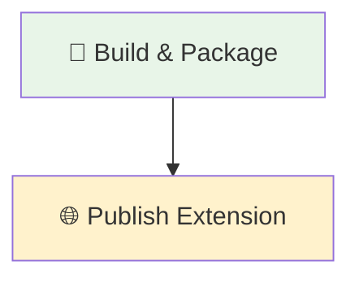

# Deploy Chrome Extension

Pipeline de CD para empacotamento e publicação de extensões do Chrome na Chrome Web Store com suporte a aprovação em ambiente de produção.

## 🎯 Descrição

Este pipeline automatiza o empacotamento e a publicação de extensões do Chrome na Chrome Web Store, oferecendo dois estágios bem definidos: preparação do artefato (Build & Package) e publicação em produção (Publish Extension). 

O processo inclui cópia seletiva de arquivos do repositório, criação de arquivo ZIP otimizado para distribuição, publicação como artefato no Azure DevOps para rastreabilidade, e finalmente publicação na Chrome Web Store com aprovação manual obrigatória através de um environment de produção. A pipeline implementa as melhores práticas de CD com separação clara entre build e deployment, permitindo controle total sobre quando e quem aprova as publicações.

## 🚀 Quick Start (5 minutos)

1. Crie os arquivos necessários no seu repositório (Veja [Dependências Externas](#-dependências-externas))
2. Crie `.azuredevops/pipelines/cd.yaml` na raiz
3. Cole o código de exemplo
4. Commit e push
5. ✅ Pipeline executa automaticamente!
6. Opcional: ajuste triggers

```yaml
# Deploy da extensão Chrome na Chrome Web Store
# .azuredevops/pipelines/cd.yaml
resources:
  repositories:
    - repository: CodePlay
      name: DevOps/Vivo.CodePlay.Pipelines
      type: git
      ref: refs/heads/master
      endpoint: CodePlay

extends:
  template: /tech_products/hrcl/templates/chromeextension/pipeline.yaml@CodePlay
  parameters:
    extensionId: 'seu-extension-id-aqui'
    serverEndpoint: 'sua-service-connection-cws'
    # Opcional: customize os arquivos a empacotar (usa padrão CodePlay se omitido)
    filesToInclude: |
      manifest.json
      src/**
      icons/**
      styles/**
      LICENSE
```

## 🔄 Estrutura do Pipeline

O pipeline é organizado em dois estágios sequenciais: BuildAndPackage prepara o artefato, seguido pelo PublishExtension que executa a publicação com aprovação manual obrigatória:



### Estágios do Pipeline

1. **🔨 Build & Package** (Pool: `GeneralPurposeLinuxAgentsCI`)
   - Checkout do repositório
   - Cópia seletiva com padrão parametrizável (padrão: exclui `.git`, `node_modules`, `.env*`, `secrets`, etc.)
   - Empacotamento em arquivo ZIP para distribuição
   - Publicação como PipelineArtifact no Azure DevOps para rastreabilidade
   - Benefícios: Controle total do conteúdo, sem risco de vazamento de sensíveis, determinístico

2. **🌐 Publish Extension** (Pool: `GeneralPurposeLinuxAgentsCD`, Deployment Job)
   - Download do artefato ZIP publicado no stage anterior
   - Publicação da extensão na Chrome Web Store (aprovação obrigatória via environment `deploy-producao`)
   - Registro de quem aprovou e quando para rastreabilidade

## 🔧 Parametrização

A pipeline utiliza **parâmetros obrigatórios** para flexibilidade de deployment:

### Parâmetros Disponíveis

#### extensionId

- **nome**: extensionId
- **tipo**: string
- **default**: Nenhum (obrigatório)
- **displayName**: 'ID único da extensão no Chrome Web Store'
- **descrição**: ID único da extensão no Chrome Web Store.
- **dependências**: Necessário para publicar a extensão corretamente na plataforma.

#### serverEndpoint

- **nome**: serverEndpoint
- **tipo**: string
- **default**: Nenhum (obrigatório)
- **displayName**: 'Service Connection configurada para acesso à Chrome Web Store'
- **descrição**: Nome da Service Connection configurada no Azure DevOps para autenticação com a Chrome Web Store.
- **dependências**: Deve corresponder a uma conexão válida já configurada no projeto Azure DevOps.

#### filesToInclude

- **nome**: filesToInclude
- **tipo**: string
- **default**: Padrão CodePlay (exclui `.git`, `node_modules`, `.env*`, `secrets`, etc.)
- **displayName**: 'Arquivos a incluir no ZIP da extensão'
- **descrição**: Padrão de glob para selecionar arquivos a empacotar. Personalize conforme a estrutura do seu projeto.
- **exemplo - modo genérico (padrão)**:
  ```yaml
  filesToInclude: |
    **/*
    !.azuredevops/**
    !.git/**
    !node_modules/**
    !.env*
    !secrets/**
  ```
- **exemplo - modo explícito (máxima segurança)**:
  ```yaml
  filesToInclude: |
    manifest.json
    src/**
    icons/**
    styles/**
    LICENSE
  ```

### Variáveis Internas

| Variável | Valor Padrão | Descrição |
|----------|-------------|-----------|
| ``zipFileName`` | ``chrome-extension.zip`` | Nome do arquivo ZIP gerado durante empacotamento |
| ``extensionArtifactName`` | ``chrome-extension-package`` | Nome do artefato publicado no Azure DevOps |

## 🔄 Saída e Artefatos

### Artefato no Azure DevOps
- **Nome**: ``chrome-extension-package``
- **Conteúdo**: Arquivo ZIP contendo extensão pronta para distribuição
- **Disponibilidade**: Após execução bem-sucedida do Stage 1 (Build & Package)
- **Retenção**: Conforme políticas configuradas no Azure DevOps

### Publicação na Chrome Web Store
A extensão é publicada na Chrome Web Store **após aprovação manual** no environment ``deploy-producao``:

- Data e hora da publicação registradas
- Usuário que aprovou a publicação
- Histórico completo de deployments via Azure DevOps
- Possibilidade de rollback manual se necessário

## 🔧 Dependências Externas

### Extensão cws-publish (Obrigatória)

A task `cws-publish` está já instalada na organização e disponível para uso em todos os projetos.

**Referência**: [CWS (Chrome Web Store) Publish Task](https://marketplace.visualstudio.com/_public/_MsalSignedIn?reply_to=https%3A%2F%2Fmarketplace.visualstudio.com%2Fitems%3FitemName%3Dtelefonica-vivo-devops-brasil.cws-publish-task%26targetId%3D33cc13a1-6ad8-45ec-b3af-b775982f769a%26utm_source%3Dvstsproduct%26utm_medium%3DExtHubManageList) no Azure DevOps Marketplace

### Service Connections Obrigatórias

| Serviço | Descrição | Configurável |
|---------|-----------|--------------|
| Chrome Web Store | Autenticação para publicação na Chrome Web Store | Sim (via parâmetro ``serverEndpoint``) |

#### Como Configurar a Service Connection

1. Acesse **Project Settings** → **Service Connections** no seu projeto Azure DevOps
2. Clique em **"New service connection"** → **"Chrome Web Store"**
3. Configure com as credenciais solicitadas e salve

### Agent Pools

| Stage | Pool | Descrição |
|-------|------|-----------|
| Build & Package | ``GeneralPurposeLinuxAgentsCI`` | Pool para executar build e empacotamento |
| Publish Extension | ``GeneralPurposeLinuxAgentsCD`` | Pool para executar deployment em produção |

### Environments (Obrigatório: deploy-producao)

| Environment | Descrição | Obrigatório |
|-------------|-----------|------------|
| ``deploy-producao`` | Environment de produção com approval requerido antes de publicar | Sim |

#### Como Criar o Environment deploy-producao

1. Acesse **Pipelines** → **Environments** no seu projeto Azure DevOps
2. Clique em **"Create environment"**
3. Configure:
   - **Name**: `deploy-producao` (exatamente este nome)
   - **Description**: "Produção - Chrome Web Store Publishing"
4. Clique em **"Create"**
5. Acesse o environment criado e configure approvers:
   - Clique em **⋯** (três pontos) → **Approvals and checks**
   - Clique em **"+"** → **Required approvers**
   - Adicione os usuários/grupos que devem aprovar publicações em produção
   - Configure opções:
     - ✅ **Auto-approve if creator is the approver**: Desmarcar (requer aprovação de terceiro)
     - ✅ **On timeout**: Set to "Reject"
     - ✅ **Timeout**: 30 days (padrão)

#### Boas Práticas para o Environment

- 👥 **Adicione múltiplos aprovadores**: Mínimo 2 pessoas para evitar ponto único de falha
- 🔐 **Restrinja a grupo restrito**: Apenas Release Engineers e Product Managers
- 📋 **Mantenha auditoria**: Azure DevOps registra automaticamente aprovações e deployments
- ⏰ **Monitore aprovações pendentes**: Defina alertas para não deixar aprovações esquecidas

## 🔖 Variáveis de Ambiente

A pipeline utiliza variáveis internas do Azure DevOps durante execução:

| Variável | Escopo | Descrição |
|----------|--------|-----------|
| ``Build.SourcesDirectory`` | Build Stage | Diretório raiz do repositório |
| ``Build.ArtifactStagingDirectory`` | Build Stage | Diretório para preparação de artefatos |
| ``Pipeline.Workspace`` | Deploy Stage | Workspace para download de artefatos |
| ``zipFileName`` | Todos | Nome do arquivo ZIP (padrão: ``chrome-extension.zip``) |
| ``extensionArtifactName`` | Todos | Nome do artefato Azure (padrão: ``chrome-extension-package``) |