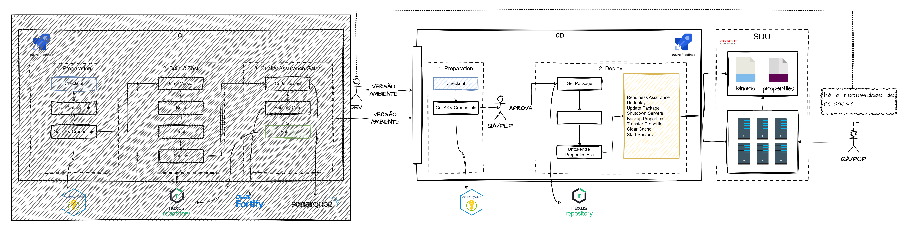

# JAVA

Detalhamento geral.

## INITIALIZATION

Realiza a coleta de dados para utilização dos mesmos em todas as etapas da pipeline.

- **GENERAL**

    Coleta informações gerais de dados que serão usados em diversas etapas das pipelines.

        1. Limpa a workspace da pipeline e faz o checkout do código da branch de trabalho.
        2. Coleta as informações do 'catalog-info.yml'.
        3. Recupera as credenciais do NEXUS.
        4. Recupera as informações de Exclusions de OSS.

- **QUALITY AND SECURITY GATES**

    Coleta informações para futuras execução dos Gates de Qualidade e Segurança

        1. Recupera o token do SonarQube e as define como variáveis.
        2. Recupera os tokens do Fortify e as define como variáveis.

## CI

Realiza o processo de CI, que de modo geral prevê o Build, crítica dos Gates de Qualidade e Segurança e Publicação do pacote binário do NEXUS.

- **BUILD**

    Realiza o build do pacote via Maven. Seguem maiores detalhes:

        1. Faz o checkout do código a partir do último commit realizado.
        2. Recupera o setting.xml da library que será utilizada pelo processo de Build.
        3. Calcula a nova versão do pacote.
        4. Executa o Build.
        5. Executa o pos-build e avalia se os pacotes foram gerados conforme padrão determinado por OSS.
        6. Publica os artefatos construídos no contexto de execução da pipeline.
        7. Publica os resultados dos Testes Unitários no contexto de execução da pipeline.
        8. Publica os resultados de Cobertura de Código no contexto de execução da pipeline.

- **QUALITY GATES**

    Realiza a execução dos Gates de Qualidade. Seguem maiores detalhes:

        1. A partir do catalog-info.yml, avalia se a aplicação está aderente as políticas do GovApp.
        2. Executa a analise do SonarQube a partir dos Quality Gates configurados.
        3. Verifica o status dos Quality Gates.

- **SECURITY**

    Realiza a execução dos Gates de Segurança. Seguem maiores detalhes:

        1. Aplicação as exclusões do Fortify.
        2. Cria o projeto no Fortify, caso necessário.
        3. Executa a análise do Fortify Analisys e recupera os dados do Security Gate.
        4. Executa a sincronização junto a Conviso e verifica o status do Quality Gate de Segurança.

- **PUBLISH**

    Realiza a publicação de todos os binários gerados. Seguem maiores detalhes:

        1. Publica todos os pacotes gerados.
        2. Atualiza o código-fonte com a nova versão gerada.

## CD

Viabiliza a entrega de uma versão específica de uma aplicação JAVA em ambiente WEBLOGIC ou KUBERNETES. **Também é conhecido como CD-ONLY**. Seguem maiores informações:

- **WEBLOGIC DEPLOY**

    É realizado utilizando scripts WLST. Seguem maiores detalhes:

        1. Faz checkout do código e recupera as configurações de deploy da aplicação.
        2. Recupera o artefato do NEXUS.
        3. Recupera os scripts abaixo do Gitlab.
            3.1. StartServers.py - Inicia os Node Servers.
            3.2. UndeployAppRetired.py - Desinstala um pacote.
            3.3. HotDeployApp.py - Instala um pacote.
        4. Configura a conexão SSH para o Admin Server.
        5. Faz a cópia do pacote para o Admin Server.
        6. Faz a cópia dos scripts da etapa '3' para o Admin Server.
        7. Como Readiness Assurance executa o StartServers.py.
        8. Desisntala o pacote atual executando o UndeployAppRetired.py.
        9. Instala o novo pacote execuntado o HotDeployApp.py.

- **KUBERNETES DEPLOY**
    1. Em desenvolvimento...

## ROLLBACK

É realizado passando-se a versão necessária para a pipeline CD ONLY. O processo é visualmente descrito conforme abaixo:

# NodeJS

Em desenvolvimento...

# Gradle

Em desenvolvimento...