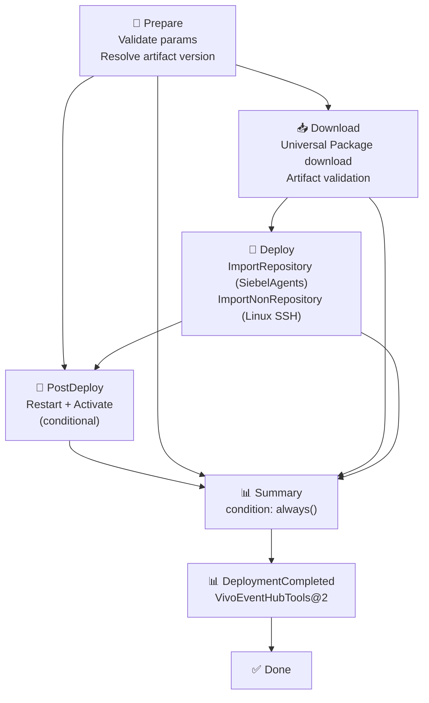

# SIBL CD pipeline - CodePlay Framework

> Continuous delivery pipeline for Siebel (SIBL) object migration to target
> environments via Azure DevOps.

---

## Description

This pipeline imports Siebel objects into the target environment by consuming
artifacts published by the SIBL CI pipeline (`sibl-exports-{environment}`
Universal Package). It covers the full delivery lifecycle: artifact download,
repository object import via `siebdev.exe`, non-repository object import via
`srvrmgr/ADMBatchProc`, optional post-deploy actions, and mandatory deployment
event registration in the corporate Event Hub.

- **Artifact source**: Universal Package published by
  [`tech_products/sibl/ci/pipeline.yaml`](../ci/pipeline.yaml)
- **Package naming convention**: `sibl-exports-{environment}`
  (for example, `sibl-exports-esteira1`)
- **Supported environments**: `esteira1`, `esteira2`, `preprod`, `prodlike`
- **Legacy aliases (temporary compatibility)**: `dev1`, `qa1`, `qa3`, `pp`
  normalized to `esteira1`, `esteira2`, `preprod`, `preprod`
- **Import methods**:
  - Repository objects (`.sif`): `siebdev.exe /batchimport` on `SiebelAgents`
    pool (Windows)
  - Non-repository objects (`.xml`): `srvrmgr/ADMBatchProc` via SSH on
    `GeneralPurposeLinuxAgentsCD`
- **Status**: Full implementation — all core stages operational

---

## Quick start

### Minimal execution (import latest artifact)

```yaml
extends:
  template: /tech_products/sibl/cd/pipeline.yaml
  parameters:
    environment: esteira1
    objectType: both
    enableImport: true
```

### Import a specific artifact version

```yaml
extends:
  template: /tech_products/sibl/cd/pipeline.yaml
  parameters:
    environment: preprod
    objectType: both
    enableImport: true
    artifactsPackageVersion: '2026.4.23-1993735'
```

### Import with post-deploy restart and activation

```yaml
extends:
  template: /tech_products/sibl/cd/pipeline.yaml
  parameters:
    environment: esteira2
    objectType: both
    enableImport: true
    enableRestart: true
    enableActivate: true
    artifactsPackageVersion: '2026.4.17-1981425'
```

### Dry run (simulate without executing)

```yaml
extends:
  template: /tech_products/sibl/cd/pipeline.yaml
  parameters:
    environment: esteira1
    objectType: both
    enableImport: true
    dryRun: true
```

### Import only repository objects (.sif)

```yaml
extends:
  template: /tech_products/sibl/cd/pipeline.yaml
  parameters:
    environment: preprod
    objectType: repository
    enableImport: true
    artifactsPackageVersion: '2026.4.23-1993735'
```

---

## Validation before PR

Run validation before requesting review:

```bash
make validate-pipelines
```

Recommended evidence in PR:

- one run with `dryRun: true`
- one controlled run with import enabled
- confirmation that logs do not expose secrets

---

## Agent requirements

- Linux pool (`GeneralPurposeLinuxAgentsCD`): `az` CLI + `azure-devops`
  extension + OAuth token enabled (`System.AccessToken`).
- Windows pool (`SiebelAgents`): `siebdev.exe` + secure file
  `tools_DevOps.cfg` + writable log/output paths.
- SSH steps require `sshpass` on Linux agents.

---

## Capabilities

| Capability | Status | Notes |
|---|---|---|
| Artifact download (Azure Artifacts) | ✅ | `UniversalPackages@0` — `sibl-exports-{env}` |
| Repository import (`.sif`) | ✅ | `siebdev.exe /batchimport` — `SiebelAgents` pool |
| Non-repository import (`.xml`) | ✅ | `srvrmgr/ADMBatchProc` via SSH |
| Dry run mode | ✅ | `dryRun: true` simulates all operations |
| Restart Siebel services | ✅ | `enableRestart: true` — via `srvrmgr` SSH |
| Activate WF/RS/Task objects | ✅ | `enableActivate: true` — via `srvrmgr` SSH |
| Execution summary | ✅ | Stage `Summary` — `condition: always()` |
| Deployment event registration | ✅ | `VivoEventHubTools@2` — mandatory, cannot be disabled |
| Version format validation | ✅ | Regex `YYYY.M.D-BuildId` at Prepare stage |
| Debug logging | ✅ | `debugMode: true` |
| SAST / Quality Gate | ❌ | Not applicable in CD — performed by CI pipeline |
| Database migration (DDL/DML) | 🚧 | `enableDatabaseMigration` parameter available |
| Workspace Projects migration | 🚧 | `enableWorkspaceProjects` parameter available |
| JOB migration | 🚧 | `enableJobMigration` parameter available |
| Git operations (commit/tag) | 🚧 | `enableGitOperations` parameter available |

---

## Pipeline stages



### Stage descriptions

| Stage | Pool | Condition | Description |
|---|---|---|---|
| `Prepare` | `GeneralPurposeLinuxAgentsCD` | always | Validates parameters, blocks `prodlike` without approval, resolves artifact version (`*` for latest) |
| `Download` | `GeneralPurposeLinuxAgentsCD` | `enableImport: true` | Downloads Universal Package from Azure Artifacts, validates `.sif`/`.xml` counts, publishes pipeline artifact |
| `Deploy` > `ImportRepository` | `SiebelAgents` (Windows) | `objectType: repository\|both` | Runs `siebdev.exe /batchimport` with the downloaded `.sif` list |
| `Deploy` > `ImportNonRepository` | `GeneralPurposeLinuxAgentsCD` | `objectType: nonrepository\|both` | Copies `.xml` files via SCP and imports via `srvrmgr/ADMBatchProc` SSH |
| `PostDeploy` | `GeneralPurposeLinuxAgentsCD` | `enableRestart` or `enableActivate` | Restarts Siebel services and/or activates WF/RS/Task objects |
| `Summary` | `GeneralPurposeLinuxAgentsCD` | `always()` | Prints consolidated execution summary for audit |
| `DeploymentCompleted` | `GeneralPurposeLinuxAgentsCD` | `succeeded()` | Registers deployment completion event in the corporate Event Hub |

---

## Parameters

### Environment configuration

#### `environment`

- **Type**: string
- **Default**: `preprod`
- **Values**: `esteira1`, `esteira2`, `preprod`, `prodlike`
- **Description**: Target Siebel environment. Determines the artifact package
  to download (`sibl-exports-{environment}`) and the server variables loaded
  from variable groups.

#### `migrationMode`

- **Type**: string
- **Default**: `manual`
- **Values**: `manual`, `automatic`
- **Description**: How objects are identified for migration.
  - `manual`: Uses the artifact manifest generated by the CI pipeline.
  - `automatic`: Identifies changed objects automatically.

#### `objectType`

- **Type**: string
- **Default**: `both`
- **Values**: `repository`, `nonrepository`, `both`
- **Description**: Type of Siebel objects to import.
  - `repository`: `.sif` files — imported via `siebdev.exe /batchimport` on
    the Windows `SiebelAgents` pool.
  - `nonrepository`: `.xml` files — imported via `srvrmgr/ADMBatchProc` over
    SSH.
  - `both`: Runs both import jobs in parallel.

#### `exportMode`

- **Type**: string
- **Default**: `unificado`
- **Values**: `massivo`, `unificado`
- **Description**: Import mode.
  - `massivo`: Uses `exprep/imprep` (full export/import).
  - `unificado`: Uses `siebdev` (granular, more controlled).

#### `projectName`

- **Type**: string
- **Default**: `$(Build.Repository.Name)`
- **Description**: Siebel project name. Defaults to the Git repository name.

### Artifact configuration

#### `artifactsFeed`

- **Type**: string
- **Default**: `DevOps`
- **Description**: Azure Artifacts feed where the CI pipeline publishes the
  Universal Package.

#### `artifactsProject`

- **Type**: string
- **Default**: `DevOps`
- **Description**: Azure DevOps project (deprecated in current implementation).
  The feed is downloaded using **organization-scoped** scope, so this parameter
  is retained for backward compatibility but not used in download commands.
  Override only if the feed structure changes to project-scoped in the future.

#### `artifactsPackageName`

- **Type**: string
- **Default**: `sibl-exports-`
- **Description**: Package name prefix. The pipeline concatenates this value
  with `environment` to form the full package name
  (`sibl-exports-{environment}`). Override only when using a custom feed
  structure.

#### `artifactsPackageVersion`

- **Type**: string
- **Default**: `''` (latest)
- **Description**: Version of the artifact package to import. Accepts the
  format `YYYY.M.D-BuildId` (for example, `2026.4.23-1993735`). Leave empty
  to use the latest published version. An invalid format causes the Prepare
  stage to fail with a clear error message.

### Execution control

#### `enableImport`

- **Type**: boolean
- **Default**: `true`
- **Description**: Enables the Download and Deploy stages. Set to `false` to
  skip import and run only PostDeploy or Summary.

#### `enableRestart`

- **Type**: boolean
- **Default**: `false`
- **Description**: Restarts Siebel services after import via `srvrmgr` SSH.
  This operation is opt-in and must be explicitly enabled.

#### `projectLockBy`

- **Type**: string
- **Default**: `''`
- **Description**: Siebel user Row ID written to `S_PROJECT.LOCKED_BY` during
  project locking. Required when project locking runs outside dry-run mode;
  provide the value from the environment configuration or the pipeline
  wrapper instead of hardcoding it in this template.

#### `enableActivate`

- **Type**: boolean
- **Default**: `false`
- **Description**: Activates WF/RS/Task objects after import via
  `srvrmgr run task for comp WfProcMgr with ModeType=ACTIVATE`.

#### `enableGitOperations`

- **Type**: boolean
- **Default**: `true`
- **Description**: Enables Git commit and tag operations after successful
  migration. Stage not yet implemented — parameter reserved for roadmap.

#### `dryRun`

- **Type**: boolean
- **Default**: `false`
- **Description**: Simulates all operations without executing them. Activates
  automatically when `siebdev.exe` is not found or
  `SIEBEL_EXPORT_PASSWORD` is not set.

#### `debugMode`

- **Type**: boolean
- **Default**: `false`
- **Description**: Enables verbose logging for feed, package name, version,
  and mode parameters.

### Roadmap capabilities

| Parameter | Default | Description |
|---|---|---|
| `enableDatabaseMigration` | `false` | DDL/DML/DCL database migration |
| `enableWorkspaceProjects` | `false` | Siebel Workspace Projects migration |
| `enableJobMigration` | `false` | Scheduled Siebel JOB migration |

### Operational safeguards

- Generated SRF files must be at least 70 MB; smaller files fail validation.
- Project unlock clears `LOCKED_DATE`, `LOCKED_BY`, and `LOCKED_LANG` with SQL
  `NULL` values.
- Temporary artifact directories are deleted only when they resolve under
  `$(Pipeline.Workspace)`.

---

## CI–CD artifact flow

The CI pipeline publishes a Universal Package on each successful run. The CD
pipeline consumes that package by matching the environment name.

```
CI (esteira1)                          CD (esteira1)
─────────────                          ─────────────
publish stage                          Download stage
  UniversalPackages@0                    UniversalPackages@0
  package: sibl-exports-esteira1   →     package: sibl-exports-esteira1
  version: 2026.4.23-1993735             version: 2026.4.23-1993735 (or *)

  combined-artifacts/
    repository-export-raw/*.sif    →   Deploy > ImportRepository
    exported-xml-files/*.xml       →   Deploy > ImportNonRepository
```

| CI environment | CD environment | Package name |
|---|---|---|
| `esteira1` | `esteira1` | `sibl-exports-esteira1` |
| `esteira2` | `esteira2` | `sibl-exports-esteira2` |
| `preprod` | `preprod` | `sibl-exports-preprod` |
| `prodlike` | `prodlike` | `sibl-exports-prodlike` |

---

## Variables

### Computed variables

| Variable | Value | Description |
|---|---|---|
| `SIGLA` | `lower(split(System.TeamProject,' ')[0])` | Project identifier |
| `TIMESTAMP` | `yyyyMMddHHmmss` | Pipeline start timestamp |
| `ARTIFACTS_PACKAGE_NAME` | `{artifactsPackageName}{environment}` | Full package name resolved at compile time |
| `ARTIFACT_VERSION` | Output from `Prepare` stage | Resolved version (`*` or specified value) |
| `NEW_VERSION` | Output from `Prepare` stage | Used by `VivoEventHubTools@2` |

### AppSec configuration

| Variable | Default | Description |
|---|---|---|
| `APP_CONFIGURATION_AZURE_SUBSCRIPTION` | `DevOpsSharedResources` | Azure subscription for App Configuration |
| `AZURE_APP_CONFIGURATION_ENDPOINT` | `https://appcs-azdevops-shared.azconfig.io` | App Configuration endpoint |
| `AKV_DEVOPS_NAME` | `kv-devops-shared` | Key Vault name |

### Environment variables (loaded per environment)

| Variable | esteira1 | esteira2 | preprod | prodlike |
|---|---|---|---|---|
| `SIEBEL_SERVER` | `$(SIEBEL_SERVER_ESTEIRA1)` | `$(SIEBEL_SERVER_ESTEIRA2)` | Variable Group | Variable Group |
| `SIEBEL_SERVER_IP` | `$(SIEBEL_SERVER_IP_ESTEIRA1)` | `$(SIEBEL_SERVER_IP_ESTEIRA2)` | Variable Group | Variable Group |
| `WINDOWS_SERVER` | `$(WINDOWS_SERVER_ESTEIRA1)` | `$(WINDOWS_SERVER_ESTEIRA2)` | Variable Group | Variable Group |
| `SIEBEL_EXPORT_DATASOURCE` | `SIBL_Esteira1_DEV` | `SIBL_Esteira2_DEV` | `SIBL_EsteiraPreProd_DEV` | `SIBL_EsteiraProdLike_DEV` |

---

## External dependencies

### Variable groups

| Group | Description |
|---|---|
| `vg-sibl-env-global` | Global variables shared across all environments |
| `vg-sibl-env-dev-preprod` | Variables for DEV and pre-production environments |
| `vg-sibl-env-dev6` | Variables for DEV6 environment |

### Service connections

| Connection | Usage |
|---|---|
| `DevOpsSharedResources` | Event Hub registration via `VivoEventHubTools@2` |

### Custom tasks

| Task | Description |
|---|---|
| `VivoEventHubTools@2` | Registers deployment completion event in the corporate Event Hub. Mandatory — cannot be disabled. |

### Agent pools

| Pool | OS | Usage |
|---|---|---|
| `GeneralPurposeLinuxAgentsCD` | Linux | Prepare, Download, ImportNonRepository, PostDeploy, Summary, DeploymentCompleted |
| `SiebelAgents` | Windows | ImportRepository — requires `siebdev.exe` |

---

## FAQ

### Which CI build does the CD deploy?

By default, the CD downloads the latest published package for the selected
environment. To deploy a specific CI build, set
`artifactsPackageVersion: '2026.4.23-1993735'` using the version printed in
the CI `publish` stage logs.

### What happens if `siebdev.exe` is not found on the agent?

The `ImportRepository` job automatically falls back to dry run mode and logs
the command that would have been executed. No import is performed, and the
pipeline completes successfully.

### Can I disable the Event Hub registration?

No. The `DeploymentCompleted` stage is mandatory in all CD pipelines for
corporate governance and audit traceability.

### What does `objectType: both` do?

It runs both `ImportRepository` and `ImportNonRepository` jobs in parallel.
The CI artifact may contain `.sif` files, `.xml` files, or both. Using `both`
ensures all exported objects are imported regardless of type.

### How do I deploy to `prodlike`?

Set `environment: prodlike`. The Prepare stage does not block `prodlike`, but
all server variables must be configured in the corresponding variable group.
Add a `ManualValidation@1` gate in a pipeline wrapper before calling this
template for production-like environments.

### Must I configure variable groups before using the pipeline?

Yes. The following variable groups must exist and contain the server variables
for your target environment:

- `vg-sibl-env-global`
- `vg-sibl-env-dev-preprod`
- `vg-sibl-env-dev6`

See [`docs/VARIABLE-GROUPS-STRUCTURE.md`](../docs/VARIABLE-GROUPS-STRUCTURE.md)
for the expected structure.

### How is the package version format validated?

The Prepare stage validates the version against the regex
`^[0-9]{4}\.[0-9]{1,2}\.[0-9]{1,2}-[0-9]+$`. An invalid value (for example,
`latest` or `v1.0.0`) causes the stage to fail immediately with a descriptive
error message.

---

## Architectural decisions

### Full CD pipeline replacing MVP stub

The previous version contained only the `DeploymentCompleted` stage. This
version implements the complete delivery pipeline including artifact download,
import, and post-deploy operations, making it a self-contained CD pipeline
that does not require a parent pipeline to define preceding stages.

### Environment alignment with CI

Both CI and CD use canonical environment names (`esteira1`, `esteira2`,
`preprod`, `prodlike`) and also accept legacy aliases (`dev1`, `qa1`, `qa3`,
`pp`) during migration. The alias is normalized before package resolution to
preserve compatibility with existing consumers.

### Computed `ARTIFACTS_PACKAGE_NAME` variable

The package name is computed at compile time from prefix + normalized
environment suffix (`ARTIFACTS_ENV_SUFFIX`), preserving compatibility and
ensuring deterministic naming across CI and CD.

### Separate agent pools per job

`ImportRepository` runs on `SiebelAgents` (Windows) because `siebdev.exe`
requires a Windows host with Siebel Tools installed. All other jobs use the
standard `GeneralPurposeLinuxAgentsCD` pool, avoiding unnecessary Windows
agent usage.

### `PostDeploy` runs after skipped `Deploy`

`PostDeploy` uses `in(dependencies.Deploy.result, 'Succeeded', 'Skipped')` so
that restart and activate operations can run independently when import is
disabled (`enableImport: false`).

### Dry run fallback

Any job that cannot locate required binaries (`siebdev.exe`) or credentials
(`SIEBEL_EXPORT_PASSWORD`) automatically activates dry run mode instead of
failing. This makes the pipeline safe to run in environments that are not yet
fully configured.

---

> **Status**: v1.0.0 — Full CD pipeline implementation
> **Last updated**: April 23, 2026
> **Repository**:
> [Vivo.CodePlay.Pipelines](https://dev.azure.com/telefonica-vivo-brasil/DevOps/_git/Vivo.CodePlay.Pipelines)


