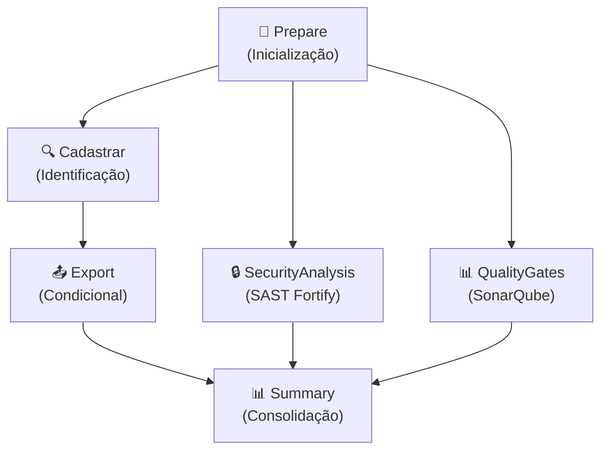

# 🚀 SIBL Pipeline - CodePlay Framework

> **Pipeline de teste de migração de objetos Siebel em ambiente DEV via Azure DevOps**

---

## 🎯 Descrição

Este diretório contém a pipeline CI do **Siebel (SIBL)** para validar a migração de objetos Siebel (SIT) do SOM para Azure DevOps.

- **Objetivo**: Executar teste completo de integração com preparação, identificação **manual obrigatória**, exportação (quando habilitado), análise SAST e Quality Gate obrigatórios
- **Escopo**: Validação de migração em ambientes DEV com gates de segurança e qualidade bloqueadores
- **Suporte de ambientes**: esteira1, esteira2, preprod, prodlike (com bloqueio implícito para prod)
- **Compatibilidade legada**: também aceita dev1, qa1, qa3, pp (normalizados internamente)
- **Status**: MVP com security gates obrigatórios para compliance corporativo
- **Modo de Identificação**: 100% Manual - Desenvolvedor especifica IDs de objetos Siebel explicitamente
- **Manifesto Estruturado**: Gera JSON com metadata, execution context e lista de objetos para rastreabilidade completa

---

## 🔗 Integração com pipeline CD

O CI publica pacote no Azure Artifacts usando o padrão:

- Prefixo: `sibl-exports-`
- Sufixo resolvido por ambiente canônico (`esteira1`, `esteira2`, `preprod`, `prodlike`)
- Exemplo: `sibl-exports-esteira1`

Aliases legados são aceitos por compatibilidade e normalizados para o sufixo
canônico:

- `dev1` -> `esteira1`
- `qa1` -> `esteira2`
- `qa3` -> `preprod`
- `pp` -> `preprod`

---

## ✅ Validação obrigatória antes de PR

Execute o validador do repositório antes de subir alterações em pipeline:

```bash
make validate-pipelines
```

Evidências mínimas recomendadas no PR:

- execução com `dryRun: true`
- execução com `enableExport: true`
- confirmação de que logs não exibem segredos

---

## ⚡ Quick Start

> **⚠️ IMPORTANTE: Use `objectType: both` como padrão!**
> 
> Na prática, raramente você trabalhará apenas com objetos repository (.sif) OU apenas nonrepository (.xml). Desenvolvedores normalmente alteram múltiplos tipos simultaneamente.
> 
> - ✅ **Recomendado**: `objectType: both` - Pipeline detecta automaticamente o tipo de cada ID
> - ⚠️ **Específico**: `objectType: repository` - Use APENAS se tiver certeza que são todos .sif
> - ⚠️ **Específico**: `objectType: nonrepository` - Use APENAS se tiver certeza que são todos .xml
> 
> A detecção automática funciona perfeitamente, então não há necessidade de restringir o tipo a menos que seja uma otimização intencional.

### Execução com especificações de objeto (Recomendado)

```yaml
extends:
   template: /tech_products/sibl/ci/pipeline.yaml
   parameters:
      environment: preprod
      jiraProject: 'PTI5577'
      objectType: both
      objectIds: 'repository{business_component=Account BC},repository{view=Account View},nonrepository{lov=NV_ON_OFF}'
      projectName: '$(Build.Repository.Name)'
      enableExport: true
      sonarServiceConnection: 'VIVO_SONARQUBE'
      sonarQualityGate: 'AzureDevOps-Default'
```

### Execução com projeto completo (Export ALL)

```yaml
extends:
   template: /tech_products/sibl/ci/pipeline.yaml
   parameters:
      environment: preprod
      objectType: both
      objectIds: ''  # Vazio = export completo do projeto
      enableExport: true
      sonarServiceConnection: 'VIVO_SONARQUBE'
```

### Execução apenas repository objects (.sif)

```yaml
extends:
   template: /tech_products/sibl/ci/pipeline.yaml
   parameters:
      environment: preprod
      objectType: repository
      objectIds: 'repository{business_component=Account BC},repository{business_object=Account BO},repository{business_service=FINS CAP Service}'
      enableExport: true
      sonarServiceConnection: 'VIVO_SONARQUBE'
```

### Execução com export desabilitado (apenas análise)

```yaml
extends:
   template: /tech_products/sibl/ci/pipeline.yaml
   parameters:
      environment: preprod
      objectIds: 'nonrepository{lov=NV_ON_OFF},nonrepository{script=Meu Script}'
      enableExport: false
      sonarServiceConnection: 'VIVO_SONARQUBE'
```

---

## �️ Matriz Capacidades

| Capacidade | Status | Observação |
| ----------- | -------- | ------------ |
| Preparação e validação inicial | ✅ | Stage `Prepare` com validação forte de parâmetros (tipos, caracteres, ambiente) |
| Identificação manual de objetos | ✅ | Stage `Cadastrar` - **Modo MANUAL obrigatório** com IDs explícitos |
| Manifesto JSON estruturado | ✅ | Gera `object_manifest.json` via Bash + `jq` com metadata, execution, objects e summary |
| Mapeamento IDs → Paths Siebel | ✅ | Dicionário interno embutido no stage `Cadastrar` da pipeline |
| Detecção automática tipo arquivo | ✅ | Detecta .sif (repository) vs .xml (non-repository) por ID |
| Summário visual pré-export | ✅ | Dashboard estruturado com lista de objetos e próximas etapas |
| Export de objetos `.sif` e `.xml` | ✅ | Stage `Export` ativo quando (`enableExport: true`), com execução real de `.sif` via `siebdev.exe` e `.xml` via `ADMBatchProc` no `srvrmgr` (SSH DEV6) |
| SAST Fortify | ✅ | Stage `SecurityAnalysis` com template `/security/run_fortify_scan.yml` |
| SonarQube Quality Gate | ✅ | Stage `QualityGates` com `SonarAnalysisFromVivo@2` |
| Gate bloqueador de segurança | ✅ | SonarQube em `QualityGates` bloqueia pipeline quando quality gate falha |
| Resumo de execução | ✅ | Stage `Summary` com consolidação de resultados |
| Operações Git (Commit/Tag) | ✅ | Implementado no job `ValidateExportsAndGit` (preparação, commit e tag com controles de dry run/simulação) |
| Compilação SRF | 🚧 | Parâmetro `enableCompile` disponível, stage não implementado |
| Import de objetos | 🚧 | Parâmetro `enableImport` disponível, stage não implementado |
| Migração de banco (DDL/DML/DCL) | 🚧 | Parâmetro `enableDatabaseMigration` disponível, stage não implementado |
| Registro de deployment em Event Hub | ❌ | Exclusivo de pipeline CD, não presente em CI |
| Gate de aprovação manual | 🚧 | Estruturado para implementação futura (Manual Validation task) |

---

## 🔄 Estrutura do Pipeline

### Ordem de execução dos stages



### Observações de fluxo

- **Stage `Prepare`** (sempre): Inicializa pipeline, valida parâmetros e prepara artefatos
  - Job: `Initialize` - Exibe configuração, valida entrada (bloqueia prod), checkout e criação de diretórios
  - Output: Variáveis `LAST_TAG`, `NEW_VERSION` para próximos stages

- **Stage `Cadastrar`** (sempre): Identifica objetos via modo MANUAL obrigatório com IDs explícitos
  - Depende de: `Prepare`
  - Desenvolvedor especifica IDs via parâmetro `objectIds` (ex: `'repository{business_component=Account BC},nonrepository{lov=NV_ON_OFF}'`)
  - Gera manifesto JSON estruturado com metadata, execution context e lista de objetos
  - Aplica validações: object type (regex), IDs format (caracteres permitidos), environment blocking
  - Mapeia automaticamente `type{subtype=Nome}` → método/extensão/path usando dicionário interno embutido
  - Detecta automaticamente tipo de arquivo (.sif repository vs .xml non-repository)
  - Exibe dashboard visual com lista de objetos e próximas etapas
  - Output: Arquivo `object_manifest.json` publicado como artifact

- **Stage `Export`** (condicional: `enableExport: true`): Exporta objetos identificados e valida exportações
   - Depende de: `Cadastrar`
   - Job 1: `ExportRepository` - Exporta objetos .sif via `siebdev.exe`, publica artifact `repository-export-raw`
   - Job 2: `ExportNonRepository` - Exporta objetos .xml via `ADMBatchProc` em `srvrmgr` remoto (SSH DEV6), publica artifact `exported-xml-files`
   - Job 3: `ValidateExportsAndGit` - **Valida e consolida** arquivos exportados, prepara para commits Git futuros
   - Nota: Export `.xml` gera arquivo de input do `srvrmgr` e executa com `/i` e `/l`, com polling até geração dos arquivos esperados

- **Stage `SecurityAnalysis`** (sempre): SAST com Fortify (obrigatório para compliance)
  - Depende de: `Prepare`
  - Job 1: `AppSecConfigKeys` - Obtém flags de segurança do App Configuration
  - Job 2: `FortifyScan` - Executa Fortify SAST via template `/security/run_fortify_scan.yml`

- **Stage `QualityGates`** (sempre): Análise de qualidade SonarQube (obrigatório)
  - Depende de: `Prepare`
  - Pool: `GeneralPurposeLinuxAgentsCI`
  - Job: `SonarQubeScan` - Executa `SonarAnalysisFromVivo@2` com quality gate bloqueador (fail-safe em caso de falha)

- **Stage `Summary`** (sempre): Consolidação final com `condition: always()`
  - Depende de: Prepare, Cadastrar, Export, SecurityAnalysis, QualityGates
  - Pool: `GeneralPurposeLinuxAgentsCI`
  - Job: `FinalSummary` - Consolidação final com status dos estágios e diagnóstico da execução
  - Não bloqueia pipeline (apenas informativo)

---

## ⚙️ Parâmetros Disponíveis

### Configuração de Ambiente

#### environment
- **nome**: environment
- **tipo**: string
- **default**: `preprod`
- **valores**: `esteira1`, `esteira2`, `preprod`, `prodlike`
- **descrição**: Ambiente de destino para o teste de integração. Define qual servidor Siebel e credentials serão utilizados. Nota: `prod` é bloqueado pela pipeline.
- **dependências**: Determina variáveis de servidor via Variable Groups (SIEBEL_SERVER_DEV1, etc.)

#### jiraProject
- **nome**: jiraProject
- **tipo**: string
- **default**: `''` (vazio)
- **descrição**: Código do projeto Jira para rastreabilidade da migração (**recomendado**, mas não obrigatório). Se vazio, pipeline emite warning e continua. Exemplo: `PTI5577`, `SIBL-MIGR`, `Meu_Projeto`
- **validação**: Regex `^[A-Za-z][A-Za-z0-9_-]{0,15}[0-9]*$` - aceita letras, números, hífens e underscores (max 17 chars)
- **dependências**: Nenhuma (informativo para rastreamento)

### Configuração de Migração de Objetos

#### objectType
- **nome**: objectType
- **tipo**: string
- **default**: `both`
- **valores**: `repository`, `nonrepository`, `both`
- **descrição**: Tipo de objeto Siebel a filtrar no manifesto de identificação.
  - `repository`: Apenas objetos .sif (Siebel Tools - BC, BusObj, Applet, View, Screen, etc.)
   - `nonrepository`: Apenas objetos .xml (ADMBatchProc/srvrmgr - Process, Script)
  - `both`: Ambos tipos (configuração mais comum)
- **dependências**: Afeta validação e geração do manifesto JSON
- **validação**: Aceita apenas valores exatos: `repository|nonrepository|both` (case-sensitive)

#### objectIds
- **nome**: objectIds
- **tipo**: string
- **default**: `''` (vazio - export completo do projeto)
- **descrição**: **Lista de especificações no formato `type{subtype=Nome}` separadas por vírgula (modo MANUAL obrigatório)**. Se vazio, exporta todos os objetos do projeto.
- **formato**: Exemplo: `repository{business_component=Account BC},nonrepository{lov=NV_ON_OFF}`
- **categorias válidas**: `repository`, `nonrepository`
- **subtype**: Aceita letras, números, espaço, underscore e hífen; o pipeline normaliza para `snake_case`
- **mapeamento automático**: Pipeline enriquece o manifesto usando dicionário interno embutido no script do stage `Cadastrar` (categoria/tipo/método/extensão/path)
- **métodos por categoria**:
  - **Repository**: `SiebelTools` (`.sif`)
  - **Non-Repository**: `ADM` (`.xml`)
- **validação**: Caracteres permitidos e formato obrigatório `type{subtype=Nome}` separado por vírgula
- **manifesto**: Gera `object_manifest.json` estruturado com metadata, execution context e lista de objetos com paths
- **dependências**: Usado em conjunto com `objectType` para filtragem adicional

#### projectName
- **nome**: projectName
- **tipo**: string
- **default**: `$(Build.Repository.Name)`
- **descrição**: Nome do projeto/repositório Siebel para migração. Por padrão usa o nome do repositório Git.
- **dependências**: Nenhuma

### Controle de Execução

#### enableExport
- **nome**: enableExport
- **tipo**: boolean
- **default**: `true`
- **descrição**: Habilita o stage Export para exportação de objetos Siebel. Se falso, pipeline executa apenas validação e testes de segurança.
- **dependências**: Controla execução do stage `Export`

#### enableGitOperations
- **nome**: enableGitOperations
- **tipo**: boolean
- **default**: `true`
- **descrição**: Habilita operações de commit e tag no repositório Git após validação bem-sucedida.
- **dependências**: Controla execução das operações Git no job `ValidateExportsAndGit` do stage `Export`

#### enableCompile
- **nome**: enableCompile
- **tipo**: boolean
- **default**: `true`
- **descrição**: Habilita compilação de objetos em arquivo .srf.
- **dependências**: Requer stage Compile (não implementado no MVP)

#### enableImport
- **nome**: enableImport
- **tipo**: boolean
- **default**: `true`
- **descrição**: Habilita importação de objetos no ambiente Siebel de destino.
- **dependências**: Requer stage Import (não implementado no MVP)

### Segurança e Qualidade (Obrigatórios)

#### sonarServiceConnection
- **nome**: sonarServiceConnection
- **tipo**: string
- **default**: `VIVO_SONARQUBE`
- **descrição**: Nome da Service Connection do SonarQube no Azure DevOps. Obrigatório para stage QualityGates.
- **dependências**: Requerido pelo stage `QualityGates`

#### sonarQualityGate
- **nome**: sonarQualityGate
- **tipo**: string
- **default**: `AzureDevOps-Default`
- **descrição**: Nome do Quality Gate do SonarQube a ser avaliado. Deve existir no SonarQube configurado.
- **dependências**: Requerido pelo stage `QualityGates`

#### sonarScannerMode
- **nome**: sonarScannerMode
- **tipo**: string
- **default**: `cli`
- **valores**: `cli`, `dotnet`
- **descrição**: Modo do scanner SonarQube. `cli` para análise via command-line, `dotnet` para projetos .NET.
- **dependências**: Utilizado por `SonarAnalysisFromVivo@2`

#### sonarPollingTimeoutSec
- **nome**: sonarPollingTimeoutSec
- **tipo**: string
- **default**: `600`
- **descrição**: Timeout em segundos para aguardar conclusão da análise SonarQube e avaliação do Quality Gate. (10 minutos por padrão)
- **dependências**: Utilizado por `SonarAnalysisFromVivo@2`

#### sonarWsTimeoutSec
- **nome**: sonarWsTimeoutSec
- **tipo**: string
- **default**: `300`
- **descrição**: Timeout da API SonarQube em segundos para chamadas de web service durante a análise.
- **dependências**: Utilizado por `SonarAnalysisFromVivo@2` em `extraProperties` como `sonar.ws.timeout`.

#### sonarTaskRetryCount
- **nome**: sonarTaskRetryCount
- **tipo**: number
- **default**: `2`
- **descrição**: Número de tentativas automáticas da task SonarQube em falhas transitórias.
- **dependências**: Utilizado em `retryCountOnTaskFailure` da task `SonarAnalysisFromVivo@2`.

#### useAppConfig
- **nome**: useAppConfig
- **tipo**: boolean
- **default**: `true`
- **descrição**: Habilita leitura de configurações do SonarQube via Azure App Configuration.
- **dependências**: Utilizado por stage `QualityGates`

#### enableFortifyExclusions
- **nome**: enableFortifyExclusions
- **tipo**: boolean
- **default**: `false`
- **descrição**: Habilita exclusões Fortify via checkout de repositório de exceções. Quando habilitado, faz checkout do repositório FortifyExclusion e aplica regras de exclusão customizadas.
- **dependências**: Utilizado por stage `SecurityAnalysis`

#### SKIP_SECURITY_GATE
- **nome**: SKIP_SECURITY_GATE
- **tipo**: boolean
- **default**: `false`
- **descrição**: Define flag para pular gate de segurança quando necessário por exceção controlada.
- **dependências**: Parâmetro definido no pipeline e considerado no contexto de segurança.

### Capacidades Evolutivas (Roadmap)

#### enableDatabaseMigration
- **nome**: enableDatabaseMigration
- **tipo**: boolean
- **default**: `false`
- **descrição**: Habilita migração de operações de banco de dados (DDL/DML/DCL scripts).
- **dependências**: Requer stage DatabaseMigration (não implementado no MVP)

### Diagnóstico e Simulação

#### debugMode
- **nome**: debugMode
- **tipo**: boolean
- **default**: `false`
- **descrição**: Habilita modo debug com logs detalhados para diagnóstico de problemas. Aumenta verbosidade de output.
- **dependências**: Nenhuma

#### dryRun
- **nome**: dryRun
- **tipo**: boolean
- **default**: `true`
- **descrição**: Simula execução sem fazer mudanças reais. Útil para validação antes de execução efetiva.
- **dependências**: Nenhuma

---

## � Dependências Externas

### Variable Groups

A pipeline carrega configurações de três Variable Groups:

- **vg-sibl-env-global**: Variáveis globais compartilhadas por todos os ambientes
- **vg-sibl-env-dev-preprod**: Configurações específicas para ambientes DEV e PRE-PRODUÇÃO
- **vg-sibl-env-dev6**: Configurações específicas para ambiente DEV6

### Service Connections

- **VIVO_SONARQUBE**: Para análise SonarQube (requerido por parâmetro `sonarServiceConnection`)
- **DevOpsSharedResources**: Para acesso a Azure App Configuration e Key Vault

### Templates do Framework

- **/security/get_appconfig_keys_framework.yml**: Obtém flags de AppSec e entrega como output do job
- **/security/run_fortify_scan.yml**: Executa análise Fortify SAST com suporte a exclusões customizadas

### Custom Tasks

- **SonarAnalysisFromVivo@2**: Executa análise completa do SonarQube com quality gate bloqueador

### Azure App Configuration e Key Vault

Pipeline utiliza:
- **Endpoint**: `https://appcs-azdevops-shared.azconfig.io` (Azure App Configuration)
- **Key Vault**: `kv-azdevops-shared` (Azure Key Vault para secrets)
- **Subscription**: `DevOpsSharedResources`

### Agent Pool

- **GeneralPurposeLinuxAgentsCI**: Pool de agentes Linux para jobs de Prepare, Cadastrar, ExportNonRepository, ValidateExportsAndGit, SecurityAnalysis, QualityGates e Summary
- **SiebelAgents**: Pool de agentes Windows para job ExportRepository

### Variáveis por Ambiente

A pipeline injeta variáveis dinamicamente baseado no parâmetro `environment`:

| Variável | Esteira1 | Esteira2 | Preprod | Prodlike |
| --- | --- | --- | --- | --- |
| `SIEBEL_SERVER` | Via VG | Via VG | Via VG | Via VG |
| `SIEBEL_SERVER_IP` | Via VG | Via VG | Via VG | Via VG |
| `WINDOWS_SERVER` | Via VG | Via VG | Via VG | Via VG |
| `WINDOWS_SERVER_IP` | Via VG | Via VG | Via VG | Via VG |

### Paths de Processamento

- **SIF_OUTPUT_PATH**: `$(Pipeline.Workspace)/sif_files` - Arquivos .sif exportados
- **XML_OUTPUT_PATH**: `$(Pipeline.Workspace)/xml_files` - Arquivos .xml exportados
- **SRF_OUTPUT_PATH**: `$(Pipeline.Workspace)/srf_output` - Compilação SRF
- **EXPORT_PATH**: `$(SIEBEL_EXPORT_PATH)\$(TIMESTAMP)` - Diretório base de export

---

## 🎨 Comportamentos Customizados

### Modo de Identificação

**Identificação Manual Obrigatória** - Desenvolvedor especifica IDs de objetos Siebel explicitamente via parâmetro `objectIds`:

```yaml
extends:
   template: /tech_products/sibl/ci/pipeline.yaml
   parameters:
      environment: preprod
      objectIds: 'repository{business_component=Account BC},nonrepository{lov=NV_ON_OFF}'
      objectType: both
```

**Validações Aplicadas**:
1. **Validação 1 - Object Type**: Valor deve ser exatamente `repository`, `nonrepository` ou `both` (case-sensitive)
2. **Validação 2 - IDs Format**: Formato obrigatório `type{subtype=Nome}` separado por vírgula. Regex aplicada no pipeline: `^[a-z]+\{[A-Za-z0-9_\ -]+=[A-Za-z0-9_\ -]+\}(,[a-z]+\{[A-Za-z0-9_\ -]+=[A-Za-z0-9_\ -]+\})*$`
3. **Validação 3 - Environment**: Ambiente `prod` é bloqueado automaticamente pela pipeline

**Export Completo vs Seletivo**:
- **objectIds vazio** (`''`): Exporta todos os objetos do projeto
- **objectIds com lista**: Exporta apenas tipos/IDs especificados (ex: `'repository{business_component=Account BC},nonrepository{lov=NV_ON_OFF}'`)

### Manifesto JSON Estruturado

Pipeline gera `object_manifest.json` com estrutura completa:

```json
{
  "metadata": {
      "pipeline_timestamp": "20260331143000",
      "build_id": "12345",
      "build_number": "20260331.1",
      "source_version": "abc123def456",
      "source_branch": "refs/heads/main"
  },
  "execution": {
      "object_type": "both",
      "project_name": "MyProject",
      "environment": "preprod"
  },
  "objects": [
    {
         "id": "business_component_Account_BC",
      "type": "repository",
         "subtype": "business_component",
         "subtypeRaw": "business_component",
         "objectType": "business component",
         "name": "Account BC",
      "fileExtension": ".sif",
         "expectedFile": "BUSINESS_COMPONENT_Account_BC.sif",
         "method": "SiebelTools",
         "admFilterParam": "",
         "admFilter": "",
         "admEaiMethod": "",
         "scope": "object",
         "version": "v001",
         "siebelPath": "Repository/Business Components"
    }
  ],
  "summary": {
      "total": 4,
      "repository_count": 3,
      "nonrepository_count": 1
  }
}
```

**Publicado como Artifacts**:
- `object-manifest` — `object_manifest.json` (formato principal, recomendado)

### Mapeamento Automático de IDs → Paths Siebel

Pipeline contém dicionário interno por categoria para enriquecer cada objeto no manifesto:

| Categoria | Método | Extensão | Base Path |
|--------------|------|----------|-------------|
| repository | SiebelTools | .sif | `Repository/*` (por subtipo) |
| nonrepository | ADM | .xml | `NonRepository/*` (por subtipo) |

**Detecção Automática**: Pipeline classifica objetos como repository ou nonrepository e aplica método, extensão e path com base nessa categoria.

### Dashboard Visual Pré-Export

Antes da exportação, pipeline exibe dashboard estruturado:

```
========================================
IDENTIFICAÇÃO DE OBJETOS SIEBEL - RESUMO
========================================

Modo: Manual (IDs explícitos)
Ambiente: preprod
Tipo de Objetos: both
Export Habilitado: true

OBJETOS IDENTIFICADOS (4 total):
  • repository{business_component=Account BC}
  • repository{view=Account View}
  • nonrepository{lov=NV_ON_OFF}
  • nonrepository{script=Meu Script}

PRÓXIMAS ETAPAS:
- Export de 3 objetos repository (.sif)
- Export de 1 objeto nonrepository (.xml)
- Validação de arquivos gerados
- Análise de segurança (SAST + Quality Gate)
========================================
```

### Seleção de Tipo de Objeto

```yaml
# Apenas objetos estruturados (Siebel Tools)
parameters:
   objectType: repository

# Apenas objetos não estruturados (ADMBatchProc/srvrmgr)
parameters:
   objectType: nonrepository

# Ambos (padrão)
parameters:
   objectType: both
```

### Controle de Stages Opcionais

Export pode ser desabilitado para executar apenas validação e testes de segurança:

```yaml
parameters:
   enableExport: false
   enableGitOperations: false
   enableCompile: false
   enableImport: false
```

### Pool de Agentes

- **Windows (`SiebelAgents`)**: Usado no job `ExportRepository` para export Siebel Tools
- **Linux (`GeneralPurposeLinuxAgentsCI`)**: Usado nos jobs de Prepare, Cadastrar, ExportNonRepository, ValidateExportsAndGit, SecurityAnalysis, QualityGates e Summary

### Validações Automáticas

Pipeline executa validações automáticas em `stage: Prepare`:
- Verifica modo manual sem lista de objetos (aviso, não bloqueia)
- Bloqueia execução com `environment: prod` (segurança corporativa)
- Valida diretórios de trabalho

### Fail-Safe de Segurança

Stages de segurança usam fail-safe: se resultado de Fortify/SonarQube não estiver disponível, assume FAILED:
- **SecurityAnalysis**  (Fortify SAST): Prioriza **segurança primeiro** sobre conveniência
- **QualityGates** (SonarAnalysisFromVivo@2): Falha a pipeline se quality gate não pode ser validado
- Garante compliance obrigatório de SAST e Quality Gate

---

## 🔖 Variáveis de Ambiente

### Variáveis de Rastreabilidade

| Variável | Valor | Propósito |
| --- | --- | --- |
| `SIGLA` | Derivada do Team Project (`lower(split(System.TeamProject,' ')[0])`) | Identificador do produto em SonarQube |
| `TIMESTAMP` | Data/hora do pipeline (`yyyyMMddHHmmss`) | Rastreamento temporal de execução |
| `DEBUG_MODE` | `true` se `parameters.debugMode: true`, senão `false` | Ativa logs detalhados de depuração |
| `ENABLE_EXPORT` | `true` se `parameters.enableExport: true`, senão `false` | Flag de controle do stage Export |

### Variáveis de Configuração AppSec

| Variável | Valor Padrão | Propósito |
| --- | --- | --- |
| `APP_CONFIGURATION_AZURE_SUBSCRIPTION` | `DevOpsSharedResources` | Subscription para Azure App Configuration |
| `AZURE_APP_CONFIGURATION_ENDPOINT` | `https://appcs-azdevops-shared.azconfig.io` | Endpoint de App Configuration |
| `AKV_DEVOPS_NAME` | `kv-azdevops-shared` | Nome do Key Vault |
| `CACORP_LOCATION` | `$(Agent.HomeDirectory)/../../certs/CACORP.pem` | Localização do certificado CA corporativo (Fortify) |

### Variáveis de Infraestrutura

| Variável | Valor | Propósito |
| --- | --- | --- |
| `CI_AGENT_POOL` | `GeneralPurposeLinuxAgentsCI` | Pool de agentes Linux para segurança e testes |
| `CI_AGENT_POOL_WINDOWS` | `SiebelAgents` | Pool de agentes Windows para fluxo Siebel e export |

### Variáveis de Output entre Stages

| Variável | Source Stage | Source Job | Propósito |
| --- | --- | --- | --- |
| `LAST_TAG` | `Prepare` | `Initialize` (step: `versioning`) | Última tag Git detectada |
| `NEW_VERSION` | `Prepare` | `Initialize` (step: `versioning`) | Nova versão gerada (v{YYYY.MM.DD}-{BuildId}) |

Referenciadas em stages posteriores como: `stageDependencies.Prepare.Initialize.outputs['versioning.NEW_VERSION']`

### Variáveis Dinâmicas por Ambiente

A pipeline carrega valores de servidor dinamicamente baseado no parâmetro `environment` via Variable Groups:

| Variável | Esteira1 | Esteira2 | Preprod | Prodlike |
| --- | --- | --- | --- | --- |
| `SIEBEL_SERVER` | Via VG | Via VG | Via VG | Via VG |
| `SIEBEL_SERVER_IP` | Via VG | Via VG | Via VG | Via VG |
| `WINDOWS_SERVER` | Via VG | Via VG | Via VG | Via VG |
| `WINDOWS_SERVER_IP` | Via VG | Via VG | Via VG | Via VG |
| `SIEBEL_EXPORT_DATASOURCE` | `SIBL_Esteira1_DEV` | `SIBL_Esteira2_DEV` | `SIBL_EsteiraPreProd_DEV` | `SIBL_EsteiraProdLike_DEV` |

### Variáveis de Export Siebel

| Variável | Valor Padrão | Propósito |
| --- | --- | --- |
| `SIEBEL_EXPORT_SERVER` | `SV2KPREM2` | Servidor de export padrão (override via VG) |
| `SIEBEL_EXPORT_TOOLS_PATH` | `D:\Siebel\Tools15\BIN` | Caminho da ferramenta siebdev.exe |
| `SIEBEL_EXPORT_CONFIG_PATH` | `$(Agent.TempDirectory)\$(SIEBEL_EXPORT_BUILD_REF)\tools_DevOps.cfg` | Arquivo de configuração Siebel Tools |
| `SIEBEL_EXPORT_DATASOURCE` | Dinâmica por ambiente | Nome da fonte de dados Siebel (SIBL_Esteira1_DEV, etc.) |
| `SIEBEL_EXPORT_USER` | `CRM_MIGRADOR_SIEBEL8_PROD` | Usuário para export (deve estar em Variable Group) |
| `SIEBEL_EXPORT_REPOSITORY` | `Siebel Repository` | Repositório de origem |
| `SIEBEL_EXPORT_OBJECT_LIST_FILE` | `$(Agent.TempDirectory)\$(SIEBEL_EXPORT_BUILD_REF)\lista_sifs_sieb8.txt` | Arquivo lista de objetos para export |
| `SIEBEL_EXPORT_LOG_FILE` | `D:\Siebellogs\export_log_<ambiente>_$(SIEBEL_EXPORT_BUILD_REF).txt` | Arquivo de log do export |
| `SIEBEL_EXPORT_BUILD_REF` | `$(Build.DefinitionName)-$(Build.BuildId)` | Referência única do build para rastreamento |
| `SIEBEL_EXPORT_LOCAL_SIF_DIR` | `$(Pipeline.Workspace)\sif_files` | Diretório local para .sif exportados |
| `SIEBEL_SRVRMGR_PATH` | `/app/siebel/siebsrvr/bin/srvrmgr` | Caminho do binário `srvrmgr` usado no export nonrepository |
| `SIEBEL_REMOTE_EXPORT_DIR` | `/app/siebel/exports/adm` | Diretório remoto base para geração dos XMLs nonrepository |
| `SIEBEL_SRVRMGR_LANG` | `PTB` | Idioma da sessão `srvrmgr` (`/l`) |
| `SIEBEL_EXPORT_POLL_INTERVAL` | `15` | Intervalo, em segundos, do polling de export nonrepository |
| `SIEBEL_EXPORT_POLL_MAX` | `40` | Número máximo de tentativas de polling do export nonrepository |
| `FORTIFY_SCAN_DIRECTORY` | Dinâmica (se enableFortifyExclusions) | Diretório a ser scaneado pelo Fortify |

### Variáveis de Output e Paths

| Variável | Valor | Propósito |
| --- | --- | --- |
| `SIF_OUTPUT_PATH` | `$(Pipeline.Workspace)/sif_files` | Arquivos .sif exportados |
| `XML_OUTPUT_PATH` | `$(Pipeline.Workspace)/xml_files` | Arquivos .xml exportados |
| `SRF_OUTPUT_PATH` | `$(Pipeline.Workspace)/srf_output` | Compilação SRF (futuro) |
| `EXPORT_PATH` | `$(SIEBEL_EXPORT_PATH)\$(TIMESTAMP)` | Diretório raiz de export com timestamp |

### Variáveis Derivadas de Parâmetros

| Nome | Tipo | Derivado de | Propósito |
| --- | --- | --- | --- |
| `DEBUG_MODE` | string | `parameters.debugMode` | Ativa logs detalhados se 'true' |
| `ENABLE_EXPORT` | string | `parameters.enableExport` | Controla execução do stage Export |

---

## ❓ FAQ

### Esta pipeline pode ser usada em produção?

Não. A pipeline tem bloqueio ativo para `environment: prod`. É uma pipeline de **CI com testes de integração**, não uma pipeline de deployment. Para produção, use a pipeline CD `/tech_products/sibl/cd/`.

### O que acontece se SAST ou Quality Gate falharem?

A pipeline falha quando os gates de segurança e qualidade não passam no fluxo de `SecurityAnalysis` e `QualityGates`. O stage `Summary` ainda executa por `condition: always()`, mas o resultado final permanece com falha. Você deve resolver os findings de segurança antes de prosseguir.

### Posso desabilitar SAST ou Quality Gate?

Não. SAST Fortify e SonarQube Quality Gate são **obrigatórios para compliance corporativo**. Não há parâmetro para desabilitar.

### Como executo apenas export sem security gates?

Use parâmetro `enableExport: true` + desabilite export em estágios posteriores, mas **security gates sempre executam**:

```yaml
parameters:
   enableExport: true
   # Stages de security (Fortify + SonarQube) sempre rodam
```

### E se não conhecer os objetos a migrar?

Use `objectIds: ''` (vazio). A pipeline executará **export completo do projeto**, incluindo todos os objetos disponíveis:

```yaml
parameters:
   environment: preprod
   objectIds: ''  # Vazio = export ALL
   enableExport: true
```

Alternativamente, consulte a **Tabela de Mapeamento** na seção "Mapeamento Automático de IDs → Paths Siebel" para entender como cada categoria é enriquecida no manifesto.

### Qual é diferença entre CI e CD?

- **CI** (este diretório): Testes, validação, segurança, qualidade - executa a cada commit
- **CD** (`/tech_products/sibl/cd/`): Deploy real + registro de eventos - executa após CI bem-sucedida

### Os parâmetros `enableCompile`, `enableImport`, etc. funcionam?

Não. Esses parâmetros estão **definidos para roadmap futuro** mas os stages correspondentes **não estão implementados** no MVP. Quando implementados, serão transparentes (sem breaking changes).

### Posso usar esta pipeline em produção real?

**Não.** Pipeline CI não é para produção. As opções de ambiente disponíveis são `esteira1`, `esteira2`, `preprod` e `prodlike` - nenhuma é produção real. Para produção real, use a pipeline CD dedicada em `/tech_products/sibl/cd/` que inclui validações e gates adicionais.

### Qual pool de agentes é usado?

A pipeline usa dois pools: `SiebelAgents` para o job `ExportRepository` (export `.sif` via Siebel Tools) e `GeneralPurposeLinuxAgentsCI` para Prepare, Cadastrar, ExportNonRepository, ValidateExportsAndGit, SecurityAnalysis, QualityGates e Summary.

### Quanto tempo demora a pipeline?

Típicamente 5-15 minutos dependendo de:
- Tamanho do código
- Timeout SonarQube (padrão 10 min)
- Integração Siebel Tools (awaiting para MVP)

### Como resolver erro de validação de caracteres inválidos?

**Erro**: `🚨 ERRO: Formato inválido objectIds. Esperado: type{subtype=Nome},type{subtype=Nome}`

**Solução**: Use o formato completo `type{subtype=Nome}` em cada item, separado por vírgula.

```yaml
# ❌ ERRADO
objectIds: 'JOB,TASK'  # Formato incompleto

# ✅ CORRETO
objectIds: 'repository{business_component=Account BC},nonrepository{lov=NV_ON_OFF}'
```

### Como resolver erro de formato com vírgulas?

**Erro**: `❌ VALIDATION ERROR: Formato inválido - IDs não podem ter vírgulas consecutivas`

**Solução**: Remova vírgulas extras ou trailing commas.

```yaml
# ❌ ERRADO
objectIds: 'JOB,,TASK,'

# ✅ CORRETO
objectIds: 'JOB,TASK'
```

### Por que minha pipeline ignora alguns objetos?

**Causa comum**: objectType fixado incorretamente.

Se você especificou `objectType: repository` mas incluiu IDs de objetos .xml (PROCESS, SCRIPT), a pipeline **ignora silenciosamente** esses objetos.

**Solução**: Use `objectType: both` (recomendado) para permitir detecção automática de todos os tipos.

```yaml
# ❌ ANTI-PATTERN
objectType: repository
objectIds: 'repository{business_component=Account BC},nonrepository{workflow process=Meu WF}'  # item nonrepository será ignorado

# ✅ CORRETO
objectType: both  # Detecta automaticamente todos os tipos
objectIds: 'repository{business_component=Account BC},nonrepository{workflow process=Meu WF}'
```

---

## 🆘 Suporte

| Tópico | Contato | Observação |
| -------- | --------- | --- |
| 🏗️ Arquitetura e Design | DevOps Team | Questões sobre stages e fluxo |
| ⚙️ Parâmetros e Customizações | DevOps Team | Dúvidas sobre comportamentos |
| 🔒 Gates de Segurança | AppSec Team | Issues com Fortify ou SonarQube |
| 📊 Análise SonarQube | SonarQube Admin | Configuração de quality gates |
| 📁 Variable Groups | Infrastructure Team | Configuração de vg-sibl-env-* |
| 🔐 Secrets/Key Vault | Security Team | Problemas com App Configuration |
| 📞 Contato Rápido | DevOps Slack | #devops-pipelines |

---

## ⚠️ Breaking Changes e Changelog

### v0.2.0 (06/03/2026) - Refactoring de Segurança e Qualidade

#### 🚨 Breaking Changes

1. **Remoção do Modo Automático (Git diff)**
   - **Antes**: Pipeline suportava identificação automática de objetos via `git diff` (modo `auto`)
   - **Agora**: **Apenas modo MANUAL** é suportado — desenvolvedor DEVE especificar IDs via `objectIds`
   - **Migração**: Substitua `identificationMode: auto` por lista explícita em `objectIds`:
     ```yaml
     # ❌ ANTES (não funciona mais)
     parameters:
        identificationMode: auto
     
     # ✅ AGORA
     parameters:
        objectIds: 'repository{business_component=Account BC},nonrepository{lov=NV_ON_OFF}'
     ```

2. **Parâmetro `jiraProject` agora é opcional**
   - **Antes**: Validação falhava com erro se `jiraProject` estivesse vazio
   - **Agora**: Pipeline emite **warning** mas continua execução. Recomendado para rastreabilidade.
   - **Regex relaxada**: Aceita letras, números, hífens, underscores (antes aceitava apenas `[A-Z]{2,8}[0-9]+`)

3. **Credenciais removidas de comandos hardcoded**
   - **Antes**: Senha e paths fixos eram usados no fluxo de export
   - **Agora**: Usa variáveis de pipeline (`$(SIEBEL_EXPORT_TOOLS_PATH)`, `$(SIEBEL_EXPORT_CONFIG_PATH)`, `$(SIEBEL_EXPORT_PASSWORD)`) com secret em Variable Group/Key Vault
   - **Migração**: Certifique-se de que as Variable Groups (`vg-sibl-env-*`) possuem os valores necessários de export

4. **Manifesto JSON gerado em Bash com `jq`**
   - **Antes**: Modelo inicial com serialização simplificada
   - **Agora**: Gera manifesto estruturado em Bash com `jq` com metadata, execution, objects e summary
   - **Impacto**: Nenhuma ação necessária — é transparente para consumidores

5. **Artifact oficial de manifesto consolidado**
   - **Artifact publicado**: `object-manifest` com `object_manifest.json`
   - **Nota**: Consumidores devem utilizar o artifact JSON como fonte principal

#### 📋 Outras Melhorias

- Logs de configuração detalhados agora exigem `debugMode: true` (banner simplificado por padrão)
- Validação de `objectIds` reforçada com regex no stage `Prepare`

---

## 📝 Decisões Tomadas

### Segurança Obrigatória (Non-Negotiable)

**Decisão**: SAST Fortify e SonarQube Quality Gate são **obrigatórios** e **bloqueadores**.

**Justificativa**:
- Migração Siebel é crítica para operações corporativas
- Segurança não é negociável em compliance corporativo
- Gates falsos-positivos devem ser resolvidos upstream, não ignorados
- Fail-safe de `QualityGates` via SonarAnalysisFromVivo@2 (bloqueia se não puder validar) prioritiza segurança

### Bloqueio de Produção Explícito

**Decisão**: Validação em `Prepare` stage bloqueia `environment: prod`.

**Justificativa**:
- CI é para testes em DEV
- Deployment para produção usa pipeline CD dedicada
- Previne erros humanos de ambiente incorreto
- Força workflow correto: CI → CD

### Parâmetros Evolutivos sem Stages Correspondentes

**Decisão**: Definir `enableCompile`, `enableImport`, etc. sem implementar stages.

**Justificativa**:
- Habilita roadmap futuro sem breaking changes
- Consumers podem preparar pipelines pai antecipadamente
- MVP focado em essencial (identificação, export, security)
- Facilita faseamento incremental de features

### Identificação 100% Manual com IDs Explícitos

**Decisão**: Implementar **apenas modo MANUAL** onde desenvolvedor especifica IDs de objetos Siebel via parâmetro `objectIds`. Modo automático via Git diff foi **removido**.

**Justificativa**:
- Siebel é orientado a objetos, não arquivos - IDs são identificadores naturais
- Git diff em arquivos .sif/.xml não representa unidades lógicas de trabalho Siebel
- Desenvolvedor conhece exatamente quais objetos foram alterados no Siebel Tools
- Evita confusão entre arquivos Git alterados vs objetos Siebel modificados
- Permite rastreamento auditável: cada pipeline especifica explicitamente o que está migrando
- Reduz erros: Git diff pode capturar arquivos não relacionados à migração Siebel
- Alinhado com práticas Siebel: export baseado em IDs de objetos, não paths de arquivos

### Fail-Safe em Quality Gates

**Decisão**: Se resultado de Fortify/SonarQube não pode ser validado, considera FAILED (não passou).

**Justificativa**:
- Evita passar falsa segurança
- Força resolução de problemas de integração
- Prioritiza segurança sobre conveniência
- Garante auditoria de compliance

### Versionamento SonarQube Baseado em Build

**Decisão**: Usar formato `v{YYYY.MM.DD}-{BuildId}` para versão em SonarQube.

**Justificativa**:
- Correlação automática entre commits e análises
- Rastreamento único por build
- Compatível com semantic versioning
- Facilita histórico e auditoria

### Separação CI vs CD

**Decisão**: Pipeline CI apenas testa/valida. Registro em Event Hub é exclusivo de CD.

**Justificativa**:
- Ciclos CI podem ser reexecutados sem registrar duplicatas
- Event Hub registra apenas deployments efetivos
- Clareza de responsabilidades
- Evita poluição de auditoria

### Pool Híbrido por Tipo de Execução

**Decisão**: Usar `SiebelAgents` no job `ExportRepository` e `GeneralPurposeLinuxAgentsCI` nos demais jobs do pipeline.

**Justificativa**:
- Execução Siebel exige ambiente Windows para fluxo de export
- Gates de segurança e qualidade rodam em Linux com padrão corporativo
- Separação otimiza uso de recursos por tipo de workload
- Mantém compatibilidade com capacidades atuais da esteira

---

## ✅ Validação e Conformidade

### Pipeline Validator

Este pipeline foi validado usando a ferramenta obrigatória do CodePlay Framework:

```powershell
# Executar validação (Windows PowerShell)
.venv\Scripts\pipeline-validator.exe --pipeline tech_products/sibl/ci/pipeline.yaml

# Ou via Makefile (Linux/Mac/WSL)
make validate-custom PIPELINE=tech_products/sibl/ci/pipeline.yaml
```

**Última Validação:** 18/03/2026  
**Resultado:** ✅ **SUCESSO** - Comando `make validation` executado com exit code 0 no ambiente atual  
**Validador:** vivo-codeplay-pipeline-validator v0.1.13

### Evidências de Conformidade

- ✅ Sintaxe YAML válida e estruturada
- ✅ Documentação completa e consistente com código
- ✅ Todos os parâmetros definidos são utilizados
- ✅ Campos obrigatórios presentes e válidos
- ✅ Boas práticas CodePlay Framework implementadas
- ✅ Nenhuma violação de políticas corporativas

**Documentação Completa:** [reports/SIBL_CI_VALIDATION_EVIDENCE.md](../../../reports/SIBL_CI_VALIDATION_EVIDENCE.md)

---

> **Status**: MVP 0.2.0 - Pipeline CI com security gates obrigatórios
> **Última Atualização**: 18/03/2026
> **Repositório**: [Vivo.CodePlay.Pipelines](https://dev.azure.com/dvps/DevOps/_git/Vivo.CodePlay.Pipelines)
