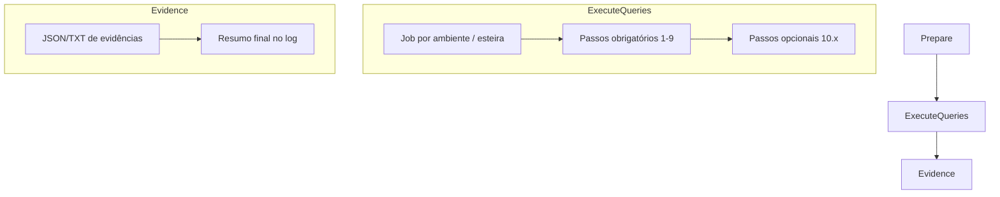

# SIBL Clone Validation Pipeline

Pipeline para validar o ambiente SIBL 2015 apos clone de servidores, executando queries diretamente no banco Oracle.

## Objetivo

Este projeto consolida o template de validacao pos-clone do SIBL com foco em consistencia de dados, saneamento tecnico e restauracao de parametros operacionais do ambiente. O template e consumido por um entrypoint do repositorio produto, que controla o disparo e os recursos remotos; a execucao permanece rastreavel, com falha imediata em qualquer erro SQL, erro de conexao ou timeout.

A documentação abaixo consolida o plano funcional, a referência de configuração e o mapeamento de passos e queries para orientar a implementação do pipeline.

## Documentação

Toda a documentação do projeto foi centralizada na pasta `docs/`.

Documentos principais (implementados):

- [docs/ARCHITECTURE.md](docs/ARCHITECTURE.md) — Arquitetura técnica e decisões
- [docs/CONFIGURATION.md](docs/CONFIGURATION.md) — Setup de Variable Groups e configuração
- [docs/passo-a-passo-validacao-pos-clone-com-queries.md](docs/passo-a-passo-validacao-pos-clone-com-queries.md) — Sequência canônica de passos
- [docs/conteudo-consolidado-pdfs.md](docs/conteudo-consolidado-pdfs.md) — Referência SQL complementar

Documentos planejados:

- `docs/INDEX.md` — Índice centralizado (Phase 7)
- `docs/ROADMAP.md` — Roadmap de fases futuras (Phase 7)

## Escopo

O pipeline cobre os seguintes objetivos:

- comparar volumetria entre o ambiente de referência e os ambientes clonados;
- limpar tabelas técnicas e resíduos de workflow, escalacao, dock/log e filas;
- atualizar LOVs e componentes de cache;
- desbloquear objetos e projetos;
- restaurar escrita para desenvolvedores;
- atualizar apontamentos por ambiente em LOV, WebService, Host e CTI;
- criar usuários de banco e conceder `SSE_ROLE`;
- validar ou habilitar `Runtime Scripts System Access`.

Fora do escopo essencial atual:

- etapas opcionais de contingencia (10.x), como estatisticas, filas AQ e sequence.

## Fonte de Verdade das Queries

Existem dois documentos de referência para as queries:

- [passo-a-passo-validacao-pos-clone-com-queries.md](docs/passo-a-passo-validacao-pos-clone-com-queries.md) é a sequência canônica de execução.
- [conteudo-consolidado-pdfs.md](docs/conteudo-consolidado-pdfs.md) é a fonte mais completa para o SQL bruto e complementa os passos 5 e 7, que no manual consolidado têm cobertura mais ampla.

Regra de uso:

- passos obrigatórios seguem o passo-a-passo;
- blocos com maior cobertura SQL usam o consolidado como complemento;
- passos opcionais entram apenas quando habilitados na pipeline.

## Histórico de Fases

### Phase 4 (Baseline)
Entregas implementadas:
- ✅ Validação de YAML no fluxo de build, via stage BuildValidation no pipeline
- ✅ Documentação de passos 1-9 com foco em uso recorrente
- ✅ Rotina de revisão mensal (processo, não documentado)

### Phase 5 (2026-06-17) — CodePlay Framework Compliance
Padronização ao framework corporativo:
- ✅ Stages reorganizados (BuildValidation → Prepare → ExecuteMandatory → Evidence → Summary)
- ✅ Parâmetros com `displayName` descritivo
- ✅ Variáveis normalizadas (`CV_*` prefix)

### Phase 6 (2026-06-19) — **ATUAL** — Variable Groups as Source of Truth
Migração de configuração:
- ✅ `config/environments.yml` → referência fallback apenas
- ✅ Variable Groups (`vg-sibl-clone-validation-*`) como fonte de verdade
- ✅ Zero-friction operation: troca de esteira sem código/commit
- ✅ Contrato versionado em `scripts/utils/env_contract.py` (v1.0.0)

### Phase 7 (Roadmap — Q3 2026)
Guias operacionais (planejado):
- [ ] [CLONE_RUN_CHECKLIST.md](docs/CLONE_RUN_CHECKLIST.md) — Checklist por clone
- [ ] [MONTHLY_REVIEW.md](docs/MONTHLY_REVIEW.md) — Rotina de revisão mensal

## Arquitetura Proposta



### Stages implementados (Phase 5+)

1. **BuildValidation**
   - Valida YAML e contrato de variáveis contra schema CodePlay Framework
   - Executa primeiro para fail-fast em erros de configuração

2. **Prepare**
   - Valida parâmetros da execução
   - Resolve esteira, ambientes e QA de referência via Variable Groups
   - Carrega contexto de conexão e credenciais

3. **ExecuteMandatory** (paralelo por ambiente)
   - Executa passos obrigatórios 1-9 na ordem definida
   - Suporta dry-run (padrão)
   - Falha imediatamente em qualquer erro SQL ou timeout
   - Coleta evidência JSON por passo

4. **ExecuteOptional** (condicional)
   - Executa passos opcionais 10.x se `skip_optional_steps=false`
   - Não bloqueia pipeline se desabilitados ou falham

5. **Evidence**
   - Consolida resultado final de todos os ambientes/passos
   - Gera artifacts JSON e TXT com evidências completas
   - Registra resumo operacional estruturado

6. **Evidencias publicadas**
   - Cada job de ambiente publica os JSONs intermediarios com `PublishBuildArtifacts@1`.
   - O stage **Evidencia** consolida os resultados e publica `clone-validation-audit-report`.

7. **Summary**
   - Resumo final com status agregado (pass/warning/fail por ambiente)
   - Registra evento em Event Hub (via `VivoEventHubTools@2`)

## Mapeamento dos Passos

| Passo | Propósito | Status no plano | Fonte principal |
|---|---|---|---|
| 1 | Comparar volumetria entre ambientes | Obrigatório | `passo-a-passo-validacao-pos-clone-com-queries.md` |
| 2 | Limpar tabelas técnicas | Obrigatório | Passo a passo + consolidado |
| 3 | Atualizar LOVs de cache | Obrigatório | Ambos |
| 4 | Validar componente de cache | Obrigatório | Ambos |
| 5 | Desbloquear objetos e projetos | Obrigatório | Passo a passo + consolidado |
| 6 | Restaurar escrita para desenvolvedores | Obrigatório | Ambos |
| 7 | Atualizar apontamentos por ambiente | Obrigatório | Passo a passo + consolidado |
| 8 | Criar usuários e conceder `SSE_ROLE` | Obrigatório | Ambos |
| 9 | Validar `Runtime Scripts System Access` | Obrigatório | Ambos |
| 10 | Atualizar estatísticas | Opcional | `conteudo-consolidado-pdfs.md` |
| 10.2 | Iniciar filas AQ | Opcional | `conteudo-consolidado-pdfs.md` |
| 10.3 | Validar sequence `NV_RPON_PSA_PROTOCOL` | Opcional | `conteudo-consolidado-pdfs.md` |

## Configuração

A configuração é centralizada em **Azure DevOps Variable Groups** (Phase 6+). Veja detalhes completos em:

- [ARCHITECTURE.md](docs/ARCHITECTURE.md) — Visão técnica e diagrama de fluxo
- [CONFIGURATION.md](docs/CONFIGURATION.md) — Setup passo-a-passo de Variable Groups

### Variable Groups (Fonte de Verdade em Runtime)

O default do parametro `environment` e `esteira1`, uma esteira nao produtiva. A esteira `prodlike` permanece disponivel, mas deve ser selecionada explicitamente no entrypoint ou na execucao manual. O parametro `dryRun` permanece habilitado por padrao.

| Variable Group | Propósito | Status |
|---|---|---|
| `vg-sibl-clone-validation-global` | service_name, port, username (constantes) | ✅ Runtime |
| `vg-sibl-clone-validation-esteira1` | DEV2, DEV3, QA6 (hosts + lista) | ✅ Runtime |
| `vg-sibl-clone-validation-esteira2` | DEV5, DEV7, QA1 | ✅ Runtime |
| `vg-sibl-clone-validation-preprod` | DEV4, DEV6, QA3 | ✅ Runtime |
| `vg-sibl-clone-validation-prodlike` | DEV8, QA2 | ✅ Runtime |
| `SIBLCloneValidationSecrets` | ORACLE_PASSWORD_* (secrets em Key Vault) | ✅ Runtime |

### Arquivos de Configuração

| Arquivo | Propósito | Status |
|---|---|---|
| `config/environments.yml` | Referência documental de ambientes/esteiras | ⚠️ Fallback (não é fonte obrigatória) |
| `config/users_per_env.yml` | Usuários DB para passo 8 (criação de usuários) | ✅ Ativo |
| `config/variable_groups_spec.yml` | Especificação completa de Variable Groups | ✅ Referência setup |
| `scripts/utils/env_contract.py` | Contrato versionado de variáveis (v1.0.0) | ✅ Validação |

### Pontos Principais

- Parâmetro `esteira` seleciona qual Variable Group carregar (sem editar código)
- Credenciais gerenciadas por **Azure Key Vault** (binding via Service Connection)
- Agente **self-hosted obrigatório** (acesso à rede corporativa e hosts Oracle)
- Prefixo `CV_` para variáveis de configuração; `ORACLE_PASSWORD_*` para secrets
- Contrato validado no stage BuildValidation contra `scripts/utils/env_contract.py`

## Evidências Esperadas

A pipeline deve produzir pelo menos:

- log detalhado por etapa e por query;
- artifact em `JSON` com status da execução;
- artifact em `TXT` com resumo humano para auditoria;
- resumo final com sucesso, warning ou falha por ambiente.

## Regras de Execução

- `dry_run` deve existir e, por padrão, permitir validar o fluxo sem escrever no banco;
- passos obrigatórios falham o run em qualquer erro;
- passos opcionais não bloqueiam o fluxo principal quando desabilitados;
- queries que dependem de credenciais específicas devem ser isoladas por usuário ou role.

## Estrutura do Projeto

```text
tech_products/sibl/clone-validation/
├── README.md                                    # Este arquivo
├── carta_execucao.md                            # ADR — Decisões arquiteturais
├── azure-pipelines.yml                          # Pipeline principal
├── docs/
│   ├── ARCHITECTURE.md                          # Arquitetura técnica e fases
│   ├── CONFIGURATION.md                         # Setup de Variable Groups
│   ├── passo-a-passo-validacao-pos-clone-com-queries.md  # Sequência canônica
│   ├── conteudo-consolidado-pdfs.md             # SQL bruto complementar
│   └── *.pdf                                    # PDFs originais (referência)
├── config/
│   ├── environments.yml                         # Fallback documental
│   ├── users_per_env.yml                        # Usuários DB
│   └── variable_groups_spec.yml                 # Spec de Variable Groups
└── scripts/
    ├── utils/env_contract.py                    # Contrato de variáveis (v1.0.0)
    └── ...                                      # Scripts de validação
```

## Próximos Passos

1. Executar validacao completa em dry-run nos ambientes da esteira do ciclo.
2. Executar run real com os mesmos parametros apos aprovacao.
3. Revisar evidencias publicadas e registrar ajustes de configuracao.
4. Repetir a rotina mensal de revisao para manter estabilidade.

---

## Referências e Documentação Adicional

### Decisões Arquiteturais
Para entender as justificativas técnicas por trás das decisões arquiteturais principais (execução controlada pelo entrypoint, multi-esteira, Variable Groups, dual documentation, fail-fast, YAML validation), consulte:

- **[carta_execucao.md](carta_execucao.md)** — Architecture Decision Record (ADR) completo

### Framework e Padrões
- **[../../CONTRIBUTING.md](../../CONTRIBUTING.md)** — Guia de contribuição ao CodePlay Framework
- **[../../GUIDELINES.md](../../GUIDELINES.md)** — Diretrizes de pipelines corporativas
- **[Premissas do Framework](https://dvps.redecorp.azr/portal/codeplay/framework/premissas)** — Padrões CodePlay
