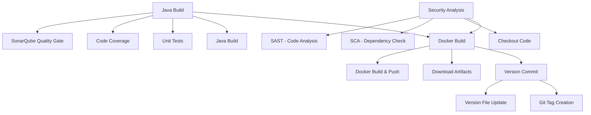

# Pipeline Java Docker CI

## Descrição

Pipeline de CI para aplicações Java com empacotamento em containers Docker. Este pipeline automatiza o processo de build, teste, análise de qualidade e criação de imagens Docker para aplicações Java baseadas em Maven.

**Principais funcionalidades:**
- Build automatizado com Maven e múltiplas versões Java (8, 11, 17, 21)
- Execução condicional de testes unitários com cobertura de código (JaCoCo)
- Análise de qualidade de código com SonarQube totalmente parametrizada
- Análise de segurança completa (SCA + SAST) com security gate e aprovação manual
- Cache inteligente de dependências Maven para otimização de performance
- Empacotamento em imagem Docker com publicação condicional inteligente
- Versionamento automático com tags Git (apenas quando não é validação de PR)
- Publicação de artefatos e relatórios de teste
- Modo validação para Pull Requests sem publicação de imagens
- Integração com Azure App Configuration para configurações centralizadas
- Controle granular de execução com parâmetros expandidos

## 🏗️ Matriz de Capacidades

| Capacidade | Status | Observações |
|------------|--------|-------------|
| **Build Java Multi-Versão** | ✅ | Suporte a Java 8, 11, 17, 21 e SAPMachine |
| **Testes Unitários** | ✅ | JUnit com publicação de resultados |
| **Cobertura de Código** | ✅ | JaCoCo com relatórios HTML/XML |
| **Quality Gate SonarQube** | ✅ | Análise configurável com App Configuration |
| **Análise SAST** | ✅ | Fortify com exclusões personalizáveis |
| **Análise SCA** | ✅ | Software Composition Analysis |
| **Cache Maven** | ✅ | Cache inteligente de dependências |
| **Docker Build & Push** | ✅ | Empacotamento e publicação ACR |
| **Versionamento Automático** | ✅ | Tags Git e commit automático |
| **Validação PR** | ✅ | Modo prValidationOnly |
| **Security Gate Manual** | 🚫 | Aprovação manual desabilitada (job comentado) |
| **Execução Paralela** | ✅ | SecurityAnalysis em paralelo ao JavaBuild |
| **Azure App Configuration** | ✅ | Configurações centralizadas |
| **Multi-Registry Support** | ✅ | Azure Artifacts e Nexus |

## Estrutura do Pipeline

O pipeline está organizado em estágios para garantir a qualidade e integridade das aplicações Java Docker:



**Descrição dos Estágios:**

- **Java Build**: Compilação Java com Maven, execução condicional de testes unitários (JUnit), análise de cobertura (JaCoCo) e quality gate SonarQube parametrizável
- **Security Analysis**: Análise completa de segurança executada **em paralelo** ao Java Build, incluindo SCA (dependências) e SAST (Fortify). ⚠️ Security gate manual atualmente desabilitado
- **Docker Build**: Download de artefatos JAR, construção da imagem Docker e publicação condicional baseada na lógica `prValidationOnly`. Aguarda conclusão de ambos os estágios anteriores
- **Version Commit**: Criação de tags Git e commit automático de versionamento (executa apenas na branch master quando `prValidationOnly=false`)

## Variáveis de Ambiente

As seguintes variáveis são utilizadas internamente pelo pipeline para configuração automática e otimização:

| Variável | Descrição | Valor Padrão |
|----------|-----------|--------------|
| `SIGLA` | Sigla do projeto extraída do nome do Team Project | `$[ lower(split(variables['System.TeamProject'],' ')[0]) ]` |
| `POM_FILE_PATH` | Caminho completo para o arquivo pom.xml do projeto | `${{ parameters.workingDirectory }}/${{ parameters.versionFile }}` |
| `MAVEN_CACHE_FOLDER` | Diretório de cache das dependências Maven | `$(Pipeline.Workspace)/.m2/repository` |
| `MAVEN_OPTS` | Opções JVM para execução do Maven | `-Dmaven.repo.local=$(MAVEN_CACHE_FOLDER)` |
| `MAVEN_CUSTOM_SETTINGS` | Caminho completo para o settings.xml customizado | `${{ parameters.workingDirectory }}/${{ parameters.mavenCustomSettings }}` |
| `MAVEN_REPO_LOCAL` | Diretório local do repositório Maven, configurado com ou sem cache | `$(Pipeline.Workspace)/.m2/repository` ou `/home/svc_devopscorp/.m2/repository` |
| `DOCKER_BUILDKIT` | Habilita BuildKit para builds Docker otimizados | `1` |
| `BUILDKIT_PROGRESS` | Formato de output do BuildKit | `plain` |
| `CACORP_LOCATION` | Caminho para o certificado CA corporativo utilizado para comunicação segura com endpoints internos (ex: Fortify, Nexus) | `$(Agent.HomeDirectory)/../../certs/CACORP.pem` |
| `AKV_DEVOPS_NAME` | Nome do Azure Key Vault para configurações de segurança | `kv-azdevops-shared` |
| `PROXY_SQUID_SERVER` | Servidor proxy corporativo para acesso externo | `10.240.58.39:3128` |
| `PROXY_AGENT_HTTP` | Configuração proxy HTTP para agentes | `http://$(PROXY_SQUID_SERVER)` |
| `PROXY_AGENT_HTTPS` | Configuração proxy HTTPS para agentes | `http://$(PROXY_SQUID_SERVER)` |

### Lógica Condicional de Publicação Docker

O pipeline implementa uma lógica condicional inteligente para controlar quando imagens Docker devem ser publicadas:

**Comportamentos:**
- **`prValidationOnly=false`**: ✅ Publica imagem (cenário padrão de produção)
- **`prValidationOnly=true`**: ❌ Não publica (validação de PR)

Esta abordagem garante que Pull Requests nunca publiquem imagens acidentalmente, enquanto permite execução de todas as validações necessárias.

**Nota**: Configurações específicas do projeto devem ser definidas como parâmetros, não como variáveis de ambiente.

## Parâmetros Disponíveis

Configure o comportamento do pipeline através dos seguintes parâmetros. Para cada parâmetro, documente claramente seu propósito e impacto.

#### agentPool

- **nome**: agentPool
- **tipo**: string
- **default**: "GeneralPurposeLinuxAgentsCI"
- **descrição**: "Define o pool de agentes Azure DevOps para execução do pipeline. Deve ser um pool com agentes Linux configurados com ferramentas Java e Docker."
- **dependências**: Pool de agentes com Java (via ASDF), Maven, Docker e acesso ao Azure Container Registry

#### akvName

- **nome**: akvName
- **tipo**: string
- **default**: "DevOpsSharedResources"
- **descrição**: "Nome do Azure Key Vault para recuperação de secrets e credenciais compartilhadas."
- **dependências**: Service Connection configurada para o Azure Key Vault

#### javaVersion

- **nome**: javaVersion
- **tipo**: string
- **default**: "openjdk-21.0.2"
- **opções**: ["openjdk-21.0.2", "openjdk-17.0.2", "openjdk-11.0.2", "adoptopenjdk-8.0.352+8", "sapmachine-17.0.10"]
- **descrição**: "Versão do Java a ser utilizada para compilação e execução. A versão deve estar previamente instalada nos agentes via ASDF."
- **dependências**: Versão Java instalada nos agentes conforme documentação do repositório Vivo.Infra.Ansible.SetupAzdoAgents

#### useNexusToAuth

- **nome**: useNexusToAuth
- **tipo**: boolean
- **default**: false
- **descrição**: "Usar Nexus para autenticação (true) ou Azure Artifacts (false). Define o método de autenticação para dependências Maven."
- **dependências**: Service Connection DevOpsSharedResources configurada quando true

#### workingDirectory

- **nome**: workingDirectory
- **tipo**: string
- **default**: "$(Build.SourcesDirectory)"
- **descrição**: "Diretório do projeto Java onde está o pom.xml. Permite especificar subdiretórios para projetos multi-módulo."
- **dependências**: Arquivo pom.xml válido no diretório especificado

#### fortifyScanDirectory

- **nome**: fortifyScanDirectory
- **tipo**: string
- **default**: "$(Build.SourcesDirectory)"
- **descrição**: "Diretório específico para análise Fortify SAST. Permite customizar o escopo da análise de segurança."
- **dependências**: Código fonte válido no diretório especificado

#### mavenCustomSettings

- **nome**: mavenCustomSettings
- **tipo**: string
- **default**: ".azuredevops/settings.xml"
- **descrição**: "Caminho para o settings.xml customizado do Maven utilizado durante o build. Permite customizar repositórios, proxies e configurações específicas do Maven para cada projeto."
- **dependências**: Arquivo settings.xml válido no caminho especificado

#### imageName

- **nome**: imageName
- **tipo**: string
- **default**: `$(SIGLA)/$(Build.Repository.Name)`
- **descrição**: "Nome da imagem Docker a ser criada. Utiliza convenção baseada na sigla do projeto e nome do repositório."
- **dependências**: Nenhuma dependência adicional necessária

#### dockerfilePath

- **nome**: dockerfilePath
- **tipo**: string
- **default**: "Dockerfile"
- **descrição**: "Caminho relativo para o arquivo Dockerfile a partir da raiz do repositório."
- **dependências**: Dockerfile válido no caminho especificado

#### registryServiceConnection

- **nome**: registryServiceConnection
- **tipo**: string
- **default**: "ACR-DEVOPS"
- **descrição**: "Nome da Service Connection configurada para autenticação no Azure Container Registry onde a imagem será armazenada."
- **dependências**: Service Connection do tipo Azure Container Registry configurada no projeto

#### prValidationOnly

- **nome**: prValidationOnly
- **tipo**: boolean
- **default**: false
- **descrição**: "Executa apenas a validação do código (build, testes, análises), sem publicar imagem Docker nem gerar versão/tag. Ideal para Pull Requests."
- **dependências**: Nenhuma dependência adicional necessária

#### enableCache

- **nome**: enableCache
- **tipo**: boolean
- **default**: true
- **descrição**: "Habilita cache inteligente de dependências Maven baseado no hash dos arquivos pom.xml, melhorando significativamente a performance do pipeline."
- **dependências**: Nenhuma dependência adicional necessária

#### enableTest

- **nome**: enableTest
- **tipo**: boolean
- **default**: true
- **descrição**: "Executa testes unitários e gera relatórios de cobertura de código usando JaCoCo. Publica resultados no Azure DevOps."
- **dependências**: Testes configurados no projeto, plugins JaCoCo e Surefire no pom.xml

#### enableCoverage

- **nome**: enableCoverage
- **tipo**: boolean
- **default**: true
- **descrição**: "Habilita execução e coleta de métricas de cobertura de código durante os testes unitários."
- **dependências**: Plugin JaCoCo configurado no pom.xml

#### runSecuritySCA

- **nome**: runSecuritySCA
- **tipo**: boolean
- **default**: true
- **descrição**: "Executa análise completa de segurança incluindo SCA (Software Composition Analysis) para dependências e SAST (Static Application Security Testing) para código-fonte, em paralelo ao build principal."
- **dependências**: Nenhuma dependência adicional necessária

#### enableFortifyExclusions

- **nome**: enableFortifyExclusions
- **tipo**: boolean
- **default**: false
- **descrição**: "Habilita o checkout do repositório de exclusões Fortify durante a análise SAST. Quando ativado, permite usar configurações de exclusão personalizadas."
- **dependências**: Repositório de exclusões deve existir quando habilitado

#### fortifyExclusion

- **nome**: fortifyExclusion
- **tipo**: string
- **default**: "FortifyExclusion"
- **descrição**: "Nome do repositório que contém arquivos de exclusões para análise Fortify SAST. Permite customizar regras de exclusão por projeto."
- **dependências**: Repositório com configurações de exclusão válidas

#### runQualityGate

- **nome**: runQualityGate
- **tipo**: boolean
- **default**: true
- **descrição**: "Executa análise estática de código no SonarQube com quality gate. Não executa em Pull Requests por padrão."
- **dependências**: Service Connection 'SonarQube' configurada, projeto configurado no SonarQube

#### requireSecurityApproval

- **nome**: requireSecurityApproval
- **tipo**: boolean
- **default**: true
- **descrição**: "⚠️ **FUNCIONALIDADE DESABILITADA** - Requer aprovação manual no security gate após análises SCA e SAST antes de prosseguir com o build da imagem Docker. Atualmente comentado no pipeline."
- **dependências**: Nenhuma dependência adicional necessária
- **status**: 🚫 Desabilitado (job ManualSecurity comentado no código)

#### versionFile

- **nome**: versionFile
- **tipo**: string
- **default**: "pom.xml"
- **descrição**: "Arquivo de versionamento do projeto. Define qual arquivo será utilizado para controle de versão automático."
- **dependências**: Arquivo de versionamento válido no diretório de trabalho

#### useSonarConfigFile

- **nome**: useSonarConfigFile
- **tipo**: boolean
- **default**: true
- **descrição**: "Usar arquivo de configuração do SonarQube? Permite definir se o pipeline deve utilizar um arquivo customizado de propriedades do SonarQube durante a análise."
- **dependências**: Arquivo de configuração válido no caminho especificado por `sonarConfigFilePath`

#### sonarConfigFilePath

- **nome**: sonarConfigFilePath
- **tipo**: string
- **default**: ".azuredevops/sonar-project.properties"
- **descrição**: "Caminho do arquivo de configuração do SonarQube. Informe o caminho relativo do arquivo de propriedades do SonarQube a ser utilizado na análise."
- **dependências**: Arquivo de propriedades do SonarQube presente no repositório (apenas se `useSonarConfigFile` = true)

#### sonarPollingTimeoutSec

- **nome**: sonarPollingTimeoutSec
- **tipo**: string
- **default**: "300"
- **descrição**: "Timeout em segundos para aguardar o resultado do Quality Gate do SonarQube."
- **dependências**: Nenhuma dependência adicional necessária

#### sonarJavaVersion

- **nome**: sonarJavaVersion
- **tipo**: string
- **default**: "openjdk-17.0.2"
- **opções**: ["openjdk-21.0.2", "openjdk-17.0.2", "openjdk-11.0.2"]
- **descrição**: "Versão do Java específica para análise SonarQube. Pode ser diferente da versão usada para build."
- **dependências**: Versão Java instalada nos agentes via ASDF

#### sonarServiceConnection

- **nome**: sonarServiceConnection
- **tipo**: string
- **default**: "VIVO_SONARQUBE"
- **descrição**: "Nome da Service Connection configurada para acesso ao servidor SonarQube."
- **dependências**: Service Connection do tipo SonarQube configurada no projeto

#### sonarQualityGate

- **nome**: sonarQualityGate
- **tipo**: string
- **default**: "AzureDevOps-Default"
- **descrição**: "Nome do Quality Gate configurado no SonarQube para validação da qualidade do código."
- **dependências**: Quality Gate configurado no servidor SonarQube

#### sonarScannerMode

- **nome**: sonarScannerMode
- **tipo**: string
- **default**: "cli"
- **opções**: ["cli", "dotnet"]
- **descrição**: "Modo do scanner SonarQube a ser utilizado para análise do código."
- **dependências**: Nenhuma dependência adicional necessária

#### sonarProjectKey

- **nome**: sonarProjectKey
- **tipo**: string
- **default**: `$(System.TeamProject)-$(Build.Repository.Name)`
- **descrição**: "Chave única do projeto no SonarQube. Utiliza convenção baseada no Team Project e nome do repositório."
- **dependências**: Projeto configurado no SonarQube com a chave especificada

#### sonarProjectName

- **nome**: sonarProjectName
- **tipo**: string
- **default**: `$(System.TeamProject)-$(Build.Repository.Name)`
- **descrição**: "Nome amigável do projeto no SonarQube para exibição na interface."
- **dependências**: Nenhuma dependência adicional necessária

#### useAppConfig

- **nome**: useAppConfig
- **tipo**: boolean
- **default**: true
- **descrição**: "Habilita uso do Azure App Configuration para centralizar configurações do SonarQube."
- **dependências**: Azure App Configuration configurado com as chaves necessárias

#### appConfigAzureSubscription

- **nome**: appConfigAzureSubscription
- **tipo**: string
- **default**: "DevOpsSharedResources"
- **descrição**: "Nome da Azure Subscription Service Connection para acesso ao App Configuration."
- **dependências**: Service Connection configurada para a subscription do App Configuration

#### appConfigEndpoint

- **nome**: appConfigEndpoint
- **tipo**: string
- **default**: "https://appcs-azdevops-shared.azconfig.io"
- **descrição**: "URL do endpoint do Azure App Configuration onde estão centralizadas as configurações."
- **dependências**: Azure App Configuration ativo e acessível no endpoint especificado

## Dependências Externas

Este pipeline requer configurações específicas no Azure DevOps e recursos externos para funcionamento adequado.

### Service Connections Obrigatórias

| Nome da Connection | Tipo | Descrição | Como Configurar |
|-------------------|------|-----------|-----------------|
| `ACR-DEVOPS` | Azure Container Registry | Acesso ao registro de containers para push de imagens Docker | Configurar no projeto: Project Settings > Service Connections > New > Docker Registry > Azure Container Registry |
| `DevOpsSharedResources` | Azure Resource Manager | Acesso ao Azure Key Vault compartilhado para secrets | Configurar no projeto: Project Settings > Service Connections > New > Azure Resource Manager |
| `azdo-artifacts-prod` | Generic | Endpoint para autenticação no Azure Artifacts para dependências Maven | Configurar usando task LoadEndpointFromVivo@4 |

### Service Connections Opcionais

| Nome da Connection | Tipo | Descrição | Quando Necessário |
|-------------------|------|-----------|-------------------|
| `VIVO_SONARQUBE` | SonarQube | Conexão com servidor SonarQube para análise de qualidade | Necessário quando parâmetro `runQualityGate` = true |
| **Customizada** | SonarQube | Connection customizada configurável via parâmetro `sonarServiceConnection` | Alternativa ao `VIVO_SONARQUBE` para configurações específicas |
| **Customizada** | Azure Resource Manager | Connection para Azure App Configuration configurável via `appConfigAzureSubscription` | Necessário quando `useAppConfig` = true e diferente do padrão |

### Recursos de Build Agent

Os agentes devem ter as seguintes ferramentas pré-instaladas:
- **ASDF**: Gerenciador de versões para Java e Maven
- **Java**: Versões suportadas instaladas via ASDF (OpenJDK 8, 11, 17, 21, SAPMachine 17)
- **Maven 3.9.9**: Instalado via ASDF para build das aplicações
- **Docker**: Engine Docker para build e push de imagens
- **Git**: Para operações de versionamento e checkout
- **Acesso de rede**: Conectividade com Azure Container Registry, Azure Artifacts e SonarQube

## Exemplos de Uso

### Comportamento Padrão - Configuração Básica

Pipeline básico para aplicações Java com configurações padrão otimizadas:

```yaml
# azure-pipeline.yml
resources:
  repositories:
    - repository: CodePlay
      name: DevOps/Vivo.CodePlay.Pipelines
      type: git
      ref: refs/heads/master
      endpoint: CodePlay

extends:
  template: /framework/pipelines/ci/build-java-docker/pipeline.yaml@CodePlay
```

**Comportamento esperado:**
- Build com Java 21 (OpenJDK) e Maven
- Execução de testes unitários com cobertura JaCoCo
- Análise de segurança completa (SCA + SAST) em paralelo
- Cache de dependências Maven habilitado
- Build de imagem Docker e push para ACR-DEVOPS
- Commit automático de versão na branch main

### Aplicação Legacy - Java 8 sem SonarQube

Para aplicações legadas que utilizam Java 8 sem análise de qualidade:

```yaml
# azure-pipeline.yml
resources:
  repositories:
    - repository: CodePlay
      name: DevOps/Vivo.CodePlay.Pipelines
      type: git
      ref: refs/heads/master
      endpoint: CodePlay

extends:
  template: /framework/pipelines/ci/build-java-docker/pipeline.yaml@CodePlay
  parameters:
    javaVersion: "adoptopenjdk-8.0.352+8"     # Java 8 para apps legadas
    runQualityGate: false                     # Sem SonarQube
    runSecuritySCA: true                      # Manter análise de segurança (SCA + SAST)
```

### Pipeline Completo - Todas as Validações

Para projetos críticos que requerem todas as validações disponíveis:

```yaml
# azure-pipeline.yml
resources:
  repositories:
    - repository: CodePlay
      name: DevOps/Vivo.CodePlay.Pipelines
      type: git
      ref: refs/heads/master
      endpoint: CodePlay

extends:
  template: /framework/pipelines/ci/build-java-docker/pipeline.yaml@CodePlay
  parameters:
    javaVersion: "openjdk-17.0.2"            # Java 17 LTS
    runQualityGate: true                     # Análise SonarQube
    runSecuritySCA: true                     # Análise de segurança (SCA + SAST)
    registryServiceConnection: "ACR-PROD"     # Registry de produção
    imageName: "mycompany/myapp"             # Nome customizado
```

**Nota**: Security gate manual não está disponível (funcionalidade desabilitada).

### Pull Request Validation - Validação sem Publicação

Para Pull Requests que devem executar todas as validações sem publicar imagens:

```yaml
# azure-pipeline.yml
resources:
  repositories:
    - repository: CodePlay
      name: DevOps/Vivo.CodePlay.Pipelines
      type: git
      ref: refs/heads/master
      endpoint: CodePlay

extends:
  template: /framework/pipelines/ci/build-java-docker/pipeline.yaml@CodePlay
  parameters:
    prValidationOnly: true                   # ✅ Modo validação apenas
    runQualityGate: true                     # ✅ Mantém análise SonarQube
    runSecuritySCA: true                     # ✅ Mantém análise de segurança
```

**Comportamento esperado**: Executa build, testes, SonarQube e análises de segurança, mas não publica imagem Docker nem cria tags de versão.

### Análise de Segurança com Exclusões Customizadas

Para projetos que requerem exclusões específicas na análise Fortify SAST:

```yaml
# azure-pipeline.yml
resources:
  repositories:
    - repository: CodePlay
      name: DevOps/Vivo.CodePlay.Pipelines
      type: git
      ref: refs/heads/master
      endpoint: CodePlay

extends:
  template: /framework/pipelines/ci/build-java-docker/pipeline.yaml@CodePlay
  parameters:
    enableFortifyExclusions: true            # ✅ Habilita exclusões Fortify
    fortifyExclusion: "MeuRepoExclusoes"     # Repositório customizado
    fortifyScanDirectory: "$(Build.SourcesDirectory)/src" # Diretório específico
    runSecuritySCA: true                     # Mantém análise SCA
```

**Comportamento esperado**: Executa build completo com análise SAST personalizada usando exclusões específicas do projeto.

### SonarQube Configuração Completa - Análise Personalizada

Para projetos que requerem configuração completa do SonarQube:

```yaml
# azure-pipeline.yml
resources:
  repositories:
    - repository: CodePlay
      name: DevOps/Vivo.CodePlay.Pipelines
      type: git
      ref: refs/heads/master
      endpoint: CodePlay

extends:
  template: /framework/pipelines/ci/build-java-docker/pipeline.yaml@CodePlay
  parameters:
    runQualityGate: true                     # Habilita SonarQube
    sonarServiceConnection: "VIVO_SONARQUBE" # Service Connection customizada
    sonarQualityGate: "Enterprise-Strict"    # Quality Gate rigoroso
    sonarScannerMode: "cli"                  # Modo CLI
    sonarProjectKey: "meu-projeto-java"      # Chave customizada
    sonarProjectName: "Meu Projeto Java"     # Nome amigável
    sonarJavaVersion: "openjdk-17.0.2"       # Java 17 para análise
    sonarPollingTimeoutSec: "600"           # Timeout estendido
    useSonarConfigFile: true                 # Usar arquivo de config
    sonarConfigFilePath: ".sonar/sonar-project.properties" # Config customizada
```

### Azure App Configuration - Configuração Centralizada

Para projetos que utilizam configuração centralizada via Azure App Configuration:

```yaml
# azure-pipeline.yml
resources:
  repositories:
    - repository: CodePlay
      name: DevOps/Vivo.CodePlay.Pipelines
      type: git
      ref: refs/heads/master
      endpoint: CodePlay

extends:
  template: /framework/pipelines/ci/build-java-docker/pipeline.yaml@CodePlay
  parameters:
    runQualityGate: true                     # Habilita SonarQube
    useAppConfig: true                       # ✅ Usar App Configuration
    appConfigAzureSubscription: "PROD-SUB"   # Subscription de produção
    appConfigEndpoint: "https://mycompany-appconfig.azconfig.io" # Endpoint customizado
    sonarServiceConnection: "SONAR-PROD"     # Configurado no App Config
```

**Benefícios**: Configurações centralizadas no Azure App Configuration, facilitando gestão de múltiplos projetos e ambientes.

### Configuração Completa - Todos os Parâmetros

Exemplo abrangente mostrando todas as opções disponíveis:

```yaml
# azure-pipeline.yml
resources:
  repositories:
    - repository: CodePlay
      name: DevOps/Vivo.CodePlay.Pipelines
      type: git
      ref: refs/heads/master
      endpoint: CodePlay

extends:
  template: /framework/pipelines/ci/build-java-docker/pipeline.yaml@CodePlay
  parameters:
    # Infraestrutura
    agentPool: "GeneralPurposeLinuxAgents"    # Pool de agentes
    akvName: "DevOpsSharedResources"          # Azure Key Vault
    
    # Java e Maven
    javaVersion: "openjdk-21.0.2"            # Versão Java
    workingDirectory: "$(Build.SourcesDirectory)" # Diretório do projeto
    mavenCustomSettings: ".azuredevops/settings.xml" # Settings customizado
    
    # Docker
    imageName: "$(SIGLA)/$(Build.Repository.Name)" # Nome da imagem
    dockerfilePath: "Dockerfile"              # Caminho Dockerfile
    registryServiceConnection: "ACR-DEVOPS"   # Service Connection
    
    # Controle de Fluxo
    prValidationOnly: false                   # Não é validação apenas
    enableCache: true                         # Cache Maven
    enableTest: true                          # Testes unitários
    enableCoverage: true                      # Cobertura de código
    
    # Capacidades
    runSecuritySCA: true                      # Análise segurança (SCA + SAST)
    runQualityGate: true                      # SonarQube
    
    # SonarQube Completo
    sonarServiceConnection: "VIVO_SONARQUBE" 
    sonarQualityGate: "AzureDevOps-Default"
    sonarScannerMode: "cli"
    sonarProjectKey: "$(System.TeamProject)-$(Build.Repository.Name)"
    sonarProjectName: "$(System.TeamProject)-$(Build.Repository.Name)"
    sonarJavaVersion: "openjdk-17.0.2"
    sonarPollingTimeoutSec: "300"
    useSonarConfigFile: true
    sonarConfigFilePath: ".azuredevops/sonar-project.properties"
    
    # App Configuration
    useAppConfig: true
    appConfigAzureSubscription: "DevOpsSharedResources"
    appConfigEndpoint: "https://appcs-azdevops-shared.azconfig.io"
```


## Melhorias Recentes

### Parametrização Completa do SonarQube

A análise de qualidade de código agora oferece controle total através de parâmetros dedicados:

- **Service Connection customizável**: `sonarServiceConnection`
- **Quality Gate configurável**: `sonarQualityGate`
- **Modo de scanner**: `sonarScannerMode` (CLI ou DotNet)
- **Chaves de projeto**: `sonarProjectKey` e `sonarProjectName`
- **Versão Java específica**: `sonarJavaVersion`
- **Timeout configurável**: `sonarPollingTimeoutSec`

### Integração com Azure App Configuration

Centralize configurações do SonarQube e outros serviços através do Azure App Configuration:

- **Habilitação**: `useAppConfig` (padrão: true)
- **Subscription customizável**: `appConfigAzureSubscription`
- **Endpoint configurável**: `appConfigEndpoint`

Esta integração permite gestão centralizada de configurações entre múltiplos projetos e ambientes.

### Lógica Condicional Inteligente

Implementação de controle granular para publicação de imagens Docker:

- **Validação de PR**: `prValidationOnly=true` impede publicação de imagens
- **Controle de execução**: Permite execução de todas as validações sem publicar
- **Lógica simplificada**: Usa apenas `prValidationOnly` para decisões de publicação

### Documentação Padronizada

Comentários padronizados em todo o pipeline seguindo padrão consistente:

- **Seções categorizadas**: [Configuração], [Build], [SonarQube], [Publicação]
- **Capacidades documentadas**: Cada funcionalidade com documentação completa
- **Contexto claro**: Explicação detalhada de cada stage e job

## Decisões Tomadas

### Decisão 1: Uso de templates

- **Data**: 31/07/2025
- **Motivador**: Ainda não foi definido o processo de criação simplificado de custom tasks
- **Forum Envolvido**: Equipe DevOps Soluções
- **Descrição**: Utilizar templates para padronizar a criação de pipelines de CI/CD, permitindo reutilização e consistência entre diferentes projetos.
- **Impacto**: Não faz uso do principio `Custom Tasks First`, mas permite uma abordagem mais rápida e padronizada para a criação de pipelines.
- **Próximos Passos**: Criação de custom tasks para lidar com o versionamento.
- **Referências**: N/A
- **Notas**: N/A

### Decisão 2: Custom Settings Dentro do Repositório
- **Data**: 12/09/2025
- **Motivador**: Flexibilidade para diferentes projetos, feeds e registries
- **Fórum Envolvido**: Soluções DevOps
- **Descrição**: Permitir configuração customizada de `settings.xml` no repositório do projeto, para trazer mais flexibilidade e transparência para autenticação maven.
- **Impacto**: Adaptação fácil a diferentes necessidades sem alterar o pipeline, quebra um pouco o conceito de plug and play, pois esse arquivo precisa ser criado.
- **Próximos Passos**: Documentar o uso do arquivo `settings.xml` e fornecer exemplos de casos de uso.
- **Referências**: Parâmetro `mavenCustomSettings`
- **Notas**: Flexibilidade para múltiplos feeds e repositórios.

### Decisão 3: Usuário somente de leitura no Nexus (DEPS)
- **Data**: 12/09/2025
- **Motivador**: A ideia é desmotivar o uso do nexus para publicação de artefatos, e incentivar o uso do Azure Artifacts. A utilização do nexus fica restrita a apenas baixar dependências, pois alguns projetos ainda podem ter dependências legadas.
- **Fórum Envolvido**: Soluções DevOps
- **Descrição**: O usuário utilizado para autenticação no Nexus (DEPS) terá apenas permissão de leitura.
- **Impacto**: A publicação de artefatos em Nexus não será possível, forçando o uso do Azure Artifacts.
- **Próximos Passos**: Monitorar o uso do Nexus e incentivar a migração para Azure Artifacts.
- **Referências**: Parâmetro `useNexusToAuth`
- **Notas**: N/D

### Decisão 4: Sanitização Automática de Propriedades SonarQube
- **Data**: 01/10/2025
- **Motivador**: Problemas recorrentes com espaços em branco no `sonar.projectKey` causando falhas na análise SonarQube
- **Fórum Envolvido**: Equipe DevOps Soluções
- **Descrição**: Implementar sanitização automática de espaços em branco nas propriedades do SonarQube, especialmente no `sonar.projectKey`, eliminando a necessidade de tratamento manual nos pipelines.
- **Impacto**: Redução de falhas por configuração incorreta, melhoria na experiência do desenvolvedor, padronização automática de chaves de projeto.
- **Próximos Passos**: Monitorar eficácia da sanitização e considerar expansão para outras propriedades críticas.
- **Referências**: Função `parseScannerExtraProperties` no arquivo `azdo-api-utils.ts` do repositório [azdo-task-sonar-utils](https://dev.azure.com/telefonica-vivo-brasil/DVPS%20-%20DEVOPS/_git/azdo-task-sonar-utils)
- **Notas**: Implementado na VIVO SonarQube Task v2.5.1

### Decisão 5: Unificação de Parâmetros SonarQube
- **Data**: 03/10/2025
- **Motivador**: Duplicação de parâmetros (`sonarProjectKey`/`sonarProjectName` vs parâmetros oficiais) causava confusão e inconsistências
- **Fórum Envolvido**: Equipe DevOps Soluções
- **Descrição**: Remover parâmetros duplicados e utilizar exclusivamente os parâmetros oficiais das tasks SonarQube (`projectKey`, `cliProjectKey`, `projectName`, `cliProjectName`) com valores padrão baseados em variáveis do Azure DevOps.
- **Impacto**: Simplificação da configuração de pipelines, eliminação de duplicação, comportamento mais consistente entre diferentes modos de scanner, melhor alinhamento com tasks oficiais.
- **Próximos Passos**: Atualizar documentação de pipelines existentes e migrar configurações que usavam parâmetros antigos.
- **Referências**: Parâmetros `task.json`, arquivo `Scanner.ts`, todos os arquivos de teste do repositório [azdo-task-sonar-utils](https://dev.azure.com/telefonica-vivo-brasil/DVPS%20-%20DEVOPS/_git/azdo-task-sonar-utils)
- **Notas**: Implementado na VIVO SonarQube Task v2.5.2