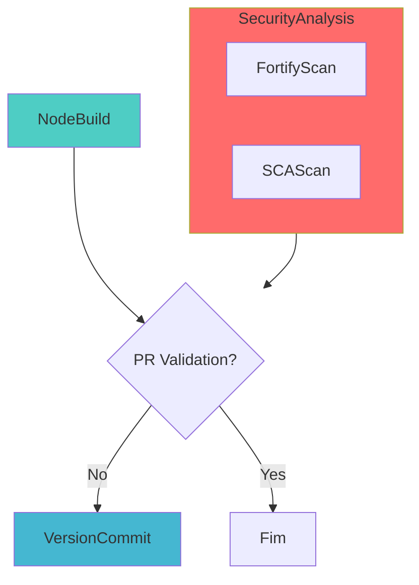

# Pipeline de Build de Biblioteca NodeJS

## 📋 Descrição

Pipeline para build, teste e publicação de bibliotecas Node.js no registro de pacotes npm (Azure Artifacts ou Nexus). Suporta versionamento automático, execução de testes unitários, geração de relatórios de cobertura e publicação dos artefatos.

O pipeline utiliza Node.js como tecnologia principal para bibliotecas e componentes reutilizáveis que podem ser consumidos por outras aplicações através do gerenciador de pacotes npm.

Suporta tanto projetos em JavaScript quanto TypeScript, com configuração flexível para atender diferentes necessidades de desenvolvimento.

- [Repositório de testes](https://dev.azure.com/telefonica-vivo-brasil/DVPS%20-%20DEVOPS/_git/testes-codeplay-framework?path=/build-nodejs-lib/javascript)

- [Pipeline de testes](https://dev.azure.com/telefonica-vivo-brasil/DVPS%20-%20DEVOPS/_build?definitionId=39671&_a=summary)


## 🚀 Principais funcionalidades

- 🔨 **Build automatizado** de bibliotecas Node.js com npm/yarn e cache inteligente
- 🧪 **Execução de testes unitários** com Jest e publicação de relatórios JUnit
- 📊 **Cobertura de código** com geração de relatórios LCOV para JavaScript/TypeScript
- 🔍 **Análise de qualidade** com SonarQube e Quality Gates configuráveis
- 🛡️ **Análises de segurança** SAST (Fortify) e SCA (Dependency Track) em paralelo
- 📦 **Publicação automática** no registro npm (Azure Artifacts ou Nexus)
- 🏷️ **Versionamento automático** com Semantic Versioning e Git tagging
- 🔄 **Suporte a feeds** Azure Artifacts e Nexus para dependências legadas
- ⚡ **Execução otimizada** com cache de dependências e estágios paralelos

## Matriz de Capacidades

| Capacidade                  | Suporte | Descrição                                      |
|----------------------------|---------|------------------------------------------------|
| [Trunk Based Development](https://dvps-dev.redecorp.azr/portal/codeplay/capacidades/catalog/trunk-based-development) | ✅      | Suportado com estratégia de branches configurável via `VersionManagerVivo@4`    |
| [Build Automatizado](https://dvps-dev.redecorp.azr/portal/codeplay/capacidades/catalog/build-automatizado)        | ✅      | Build automático usando npm     |
| [Testes Unitários](https://dvps-dev.redecorp.azr/portal/codeplay/capacidades/catalog/testes-unitarios)       | ✅      | Habilitado por padrão, controlado pelo parâmetro `enableTest`        |
| [SAST](https://dvps-dev.redecorp.azr/portal/codeplay/capacidades/catalog/sast)                        | ✅      | Análise estática de código via Fortify no estágio SecurityAnalysis executado em paralelo.                       |
| [SCA](https://dvps-dev.redecorp.azr/portal/codeplay/capacidades/catalog/sca)                        | ✅      | Análise de composição de software via template run-sca-scan.yaml no estágio SecurityAnalysis.           |
| [Gates de Segurança](https://dvps-dev.redecorp.azr/portal/codeplay/capacidades/catalog/gates-de-seguranca)          | ⚠️      | Planejado/condicional (TODOs indicam intenção).   |
| [Análise de Código](https://dvps-dev.redecorp.azr/portal/codeplay/capacidades/catalog/analise-de-codigo)          | ✅      | SonarQube com LCOV para Node.js - parâmetro `runQualityGate`   |
| [Gates de Qualidade](https://dvps-dev.redecorp.azr/portal/codeplay/capacidades/catalog/gate-de-qualidade)           | ✅      | SonarQube Quality Gate - parâmetro `runQualityGate`    |
| [Rollback de Upgrade](https://dvps-dev.redecorp.azr/portal/codeplay/capacidades/catalog/rollback-de-upgrade) | ❎  | Pipeline de CI não faz sentido habilitar essa capacidade |
| [Blue/Green Deployment](https://dvps-dev.redecorp.azr/portal/codeplay/capacidades/catalog/blue-green-deployment) | ❎  | Pipeline de CI não faz sentido habilitar essa capacidade |
| [Canary Release](https://dvps-dev.redecorp.azr/portal/codeplay/capacidades/catalog/canary-release)        | ❎  | Pipeline de CI não faz sentido habilitar essa capacidade |

Legenda:
- ✅ - Suportado nativamente
- ❌ - Não suportado
- ⚠️ - Suportado com limitações ou condições
- 🚧 - Planejado / Em Construção
- ❎ - Não faz sentido habilitar essa capacidade

## ⚙️ Estrutura do Pipeline

O pipeline é organizado em estágios sequenciais e paralelos. O estágio SecurityAnalysis executa em paralelo ao NodeBuild:



**Descrição dos Estágios:**

- **NodeBuild**: Realiza checkout do código, configuração do ambiente, build da biblioteca, execução de testes (quando configurado) e publicação do pacote npm (se não for apenas validação de PR).
- **SecurityAnalysis**: Estágio executado em paralelo ao NodeBuild. Contém jobs para análise de segurança SAST (FortifyScan) e SCA (SCAScan).
- **VersionCommit**: Realiza o commit da nova versão e cria tag Git correspondente para rastreabilidade. Executado apenas quando não é uma validação de PR.

## 📋 Parâmetros Disponíveis

Configure o comportamento do pipeline através dos seguintes parâmetros:

## Parâmetros para Infraestrutura e Ambiente

#### agentPool

- **nome**: agentPool
- **tipo**: string
- **default**: "GeneralPurposeLinuxAgentsCI"
- **opções**: Qualquer pool de agentes disponível
- **descrição**: "Define o pool de agentes onde o pipeline será executado"
- **dependências**: O pool especificado deve existir na organização Azure DevOps

## Parâmetros para Configurações de NodeJS e Feed

#### getDependenciesFromNexus

- **nome**: getDependenciesFromNexus
- **tipo**: boolean
- **default**: false
- **opções**: true/false
- **descrição**: "Define se a autenticação de pacotes será feita via Nexus (true) ou Azure Artifacts (false). Quando true, recupera credenciais do Azure Key Vault."
- **dependências**: Se true, requer uma conexão "DevOpsSharedResources" para Azure Key Vault e acesso ao KeyVault "kv-azdevops-shared"

#### workingDirectory

- **nome**: workingDirectory
- **tipo**: string
- **default**: "$(Build.SourcesDirectory)"
- **opções**: Qualquer caminho relativo dentro do repositório
- **descrição**: "Diretório base onde se encontra o projeto Node.js, contendo o package.json"
- **dependências**: Nenhuma dependência adicional necessária

## Parâmetros para Configurações de Versionamento e Validação

#### versionFile

- **nome**: versionFile
- **tipo**: string
- **default**: "package.json"
- **opções**: Geralmente package.json ou outro arquivo contendo informação de versão
- **descrição**: "Arquivo que contém a informação de versão a ser atualizada pelo pipeline"
- **dependências**: O arquivo deve existir no diretório de trabalho especificado

#### prValidationOnly

- **nome**: prValidationOnly
- **tipo**: boolean
- **default**: false
- **opções**: true/false
- **descrição**: "Quando true, executa apenas a validação (build e testes) sem publicar pacotes ou gerar novas versões"
- **dependências**: Nenhuma dependência adicional necessária

## Parâmetros para Configurações de Build e Teste

#### enableTest

- **nome**: enableTest
- **tipo**: boolean
- **default**: true
- **opções**: true/false
- **descrição**: "Habilita ou desabilita a execução de testes unitários durante o build"
- **dependências**: Para uso efetivo, o projeto deve ter testes configurados e deve gerar relatórios no formato JUnit XML

#### enableCache

- **nome**: enableCache
- **tipo**: boolean
- **default**: true
- **opções**: true/false
- **descrição**: "Habilita ou desabilita o cache de dependências npm para otimizar o tempo de build"
- **dependências**: Nenhuma dependência adicional necessária

#### enableCoverage

- **nome**: enableCoverage
- **tipo**: boolean
- **default**: true
- **opções**: true/false
- **descrição**: "Habilita ou desabilita a geração de relatórios de cobertura de código"
- **dependências**: Para uso efetivo, o projeto deve ter cobertura de código configurada e gerar relatórios no formato Clover XML

#### runQualityGate

- **nome**: runQualityGate
- **tipo**: boolean
- **default**: true
- **opções**: true/false
- **descrição**: "Habilita ou desabilita a execução da análise de qualidade de código com SonarQube."
- **dependências**: Service Connection SonarQube configurada e projeto configurado no SonarQube.

## Parâmetros para Configurações de Segurança

#### fortifyScanDirectory

- **nome**: fortifyScanDirectory
- **tipo**: string
- **default**: `$(Build.SourcesDirectory)`
- **opções**: Qualquer caminho válido para análise
- **descrição**: "Diretório usado para análise SAST com Fortify no estágio SecurityAnalysis executado em paralelo."
- **dependências**: Utilizado pelo template run-sast-scan.yaml no job FortifyScan.

#### runSecuritySCA

- **nome**: runSecuritySCA
- **tipo**: boolean
- **default**: true
- **opções**: true/false
- **descrição**: "Controla se a análise de segurança SCA (Software Composition Analysis) será executada no estágio SecurityAnalysis."
- **dependências**: Executa em paralelo ao build principal e utiliza template run-sca-scan.yaml.

#### fortifyExclusion

- **nome**: fortifyExclusion
- **tipo**: string
- **default**: `FortifyExclusion`
- **opções**: Nome de repositório válido
- **descrição**: "Repositório de exclusões Fortify usado para checkout de configurações de exclusão durante análise SAST."
- **dependências**: Repositório deve estar acessível durante execução do pipeline e contém configurações específicas de exclusão.

#### enableFortifyExclusions

- **nome**: enableFortifyExclusions
- **tipo**: boolean
- **default**: false
- **opções**: true/false
- **descrição**: "Habilita checkout do repositório de exclusões Fortify para aplicar filtros específicos durante análise SAST."
- **dependências**: Se true, mude fortifyScanDirectory para $(Build.SourcesDirectory)/$(Build.Repository.Name)

### Parâmetros do SonarQube

#### useSonarConfigFile

- **nome**: useSonarConfigFile
- **tipo**: boolean
- **default**: true
- **opções**: true/false
- **descrição**: "Define se o SonarQube deve usar arquivo de configuração customizado ao invés de configuração automática."
- **dependências**: Se true, arquivo sonar-project.properties deve existir no caminho especificado.

#### sonarConfigFilePath

- **nome**: sonarConfigFilePath
- **tipo**: string
- **default**: ".azuredevops/sonar-project.properties"
- **opções**: Qualquer caminho válido
- **descrição**: "Caminho para o arquivo de configuração do SonarQube quando useSonarConfigFile é true."
- **dependências**: Arquivo deve existir no caminho especificado.

#### sonarPollingTimeoutSec

- **nome**: sonarPollingTimeoutSec
- **tipo**: string
- **default**: "300"
- **opções**: Qualquer valor numérico em segundos
- **descrição**: "Timeout em segundos para aguardar o resultado do Quality Gate do SonarQube."
- **dependências**: Nenhuma dependência adicional necessária.

#### sonarJavaVersion

- **nome**: sonarJavaVersion
- **tipo**: string
- **default**: "openjdk-17.0.2"
- **opções**: ["openjdk-21.0.2", "openjdk-17.0.2", "openjdk-11.0.2"]
- **descrição**: "Versão do Java utilizada para executar a análise do SonarQube. O SonarQube Scanner requer Java."
- **dependências**: Versão deve estar disponível no agent pool.

#### sonarServiceConnection

- **nome**: sonarServiceConnection
- **tipo**: string
- **default**: "VIVO_SONARQUBE"
- **opções**: Qualquer service connection do SonarQube
- **descrição**: "Service connection configurada para conectar ao servidor SonarQube."
- **dependências**: Service connection deve estar configurada no Azure DevOps.

#### sonarQualityGate

- **nome**: sonarQualityGate
- **tipo**: string
- **default**: "AzureDevOps-Default"
- **opções**: Qualquer Quality Gate configurado no SonarQube
- **descrição**: "Nome do Quality Gate que será aplicado na análise de qualidade."
- **dependências**: Quality Gate deve estar configurado no SonarQube.

#### sonarScannerMode

- **nome**: sonarScannerMode
- **tipo**: string
- **default**: "cli"
- **opções**: ["cli", "dotnet"]
- **descrição**: "Modo do scanner SonarQube. Para Node.js, sempre use 'cli'."
- **dependências**: Nenhuma dependência adicional necessária.

#### sonarProjectKey

- **nome**: sonarProjectKey
- **tipo**: string
- **default**: "$(System.TeamProject)-$(Build.Repository.Name)"
- **opções**: Qualquer chave válida
- **descrição**: "Chave única do projeto no SonarQube. Gerada automaticamente baseada no Team Project e nome do repositório."
- **dependências**: Projeto deve estar configurado no SonarQube com essa chave.

#### sonarProjectName

- **nome**: sonarProjectName
- **tipo**: string
- **default**: "$(System.TeamProject)-$(Build.Repository.Name)"
- **opções**: Qualquer nome válido
- **descrição**: "Nome amigável do projeto no SonarQube."
- **dependências**: Nenhuma dependência adicional necessária.

#### useAppConfig

- **nome**: useAppConfig
- **tipo**: boolean
- **default**: true
- **opções**: true/false
- **descrição**: "Habilita uso do Azure App Configuration para obter configurações do SonarQube dinamicamente."
- **dependências**: Azure App Configuration deve estar configurado e acessível.

## 🔧 Dependências Externas

## .npmrc

O repositório deve conter um arquivo `.npmrc` configurado para o feed de pacotes desejado (Azure Artifacts ou Nexus). Exemplo para Azure Artifacts:

```plaintext
@[MUDE AQUI SEU SCOPE]:registry=https://pkgs.dev.azure.com/telefonica-vivo-brasil/[MUDAR PARA AZDO PROJECT ID]_packaging/[MUDAR PARA NOME DO FEED]/npm/registry/
registry=https://pkgs.dev.azure.com/telefonica-vivo-brasil/_packaging/DevOps/npm/registry/

always-auth=true

; begin auth token
//pkgs.dev.azure.com/telefonica-vivo-brasil/_packaging/DevOps/npm/registry/:username=telefonica-vivo-brasil
//pkgs.dev.azure.com/telefonica-vivo-brasil/_packaging/DevOps/npm/registry/:_password=${AZURE_DEVOPS_PAT}
//pkgs.dev.azure.com/telefonica-vivo-brasil/_packaging/DevOps/npm/registry/:email=npm requires email to be set but doesn't use the value
//pkgs.dev.azure.com/telefonica-vivo-brasil/_packaging/DevOps/npm/:username=telefonica-vivo-brasil
//pkgs.dev.azure.com/telefonica-vivo-brasil/_packaging/DevOps/npm/:_password=${AZURE_DEVOPS_PAT}
//pkgs.dev.azure.com/telefonica-vivo-brasil/_packaging/DevOps/npm/:email=npm requires email to be set but doesn't use the value

//pkgs.dev.azure.com/telefonica-vivo-brasil/[MUDAR PARA AZDO PROJECT ID]_packaging/[MUDAR PARA NOME DO FEED]/npm/registry/:username=telefonica-vivo-brasil
//pkgs.dev.azure.com/telefonica-vivo-brasil/[MUDAR PARA AZDO PROJECT ID]_packaging/[MUDAR PARA NOME DO FEED]/npm/registry/:_password=${AZURE_DEVOPS_PAT}
//pkgs.dev.azure.com/telefonica-vivo-brasil/[MUDAR PARA AZDO PROJECT ID]_packaging/[MUDAR PARA NOME DO FEED]/npm/registry/:email=npm requires email to be set but doesn't use the value
//pkgs.dev.azure.com/telefonica-vivo-brasil/[MUDAR PARA AZDO PROJECT ID]_packaging/[MUDAR PARA NOME DO FEED]/npm/:username=telefonica-vivo-brasil
//pkgs.dev.azure.com/telefonica-vivo-brasil/[MUDAR PARA AZDO PROJECT ID]_packaging/[MUDAR PARA NOME DO FEED]/npm/:_password=${AZURE_DEVOPS_PAT}
//pkgs.dev.azure.com/telefonica-vivo-brasil/[MUDAR PARA AZDO PROJECT ID]_packaging/[MUDAR PARA NOME DO FEED]/npm/:email=npm requires email to be set but doesn't use the value
; end auth token
```

- `[MUDE AQUI SEU SCOPE]`: Escopo do seu pacote, geralmente o nome da sigla
- `[MUDAR PARA AZDO PROJECT ID]`: ID do projeto Azure DevOps onde o feed está localizado
- `[MUDAR PARA NOME DO FEED]`: Nome do feed de pacotes configur
- O Feed de DevOps é necessário para baixar dependências utilizando o proxy do Artifacts

_Você pode pegar essas informações na URL do feed no Azure Artifacts._

Para executar localmente, você deve exportar a `AZURE_DEVOPS_PAT` como um Personal Access Token (PAT) com permissão para acessar o feed.

```bash
# Linux / MacOS
export AZURE_DEVOPS_PAT=seu_personal_access_token_aqui

# Windows PowerShell
$env:AZURE_DEVOPS_PAT="seu_personal_access_token_aqui"

# Depois execute:
npm install
```

:::warning[Atenção]
Não inclua credenciais diretamente no arquivo `.npmrc` no repositório. Use variáveis de ambiente para manter a segurança.
:::

## Setup da versão do NodeJS

O setup da versão no NodeJs é realizado através do asdf. Para isso basta criar o arquivo `.tools-version`com o seguinte conteudo:

```bash
# .tools-version
nodejs 20.19.1
```

Consulte a [documentação](https://dvps-dev.redecorp.azr/portal/code/casos-de-uso/mundando-versao) para mais informações:

### Service Connections Obrigatórias

| Nome da Connection | Tipo | Descrição | Como Configurar |
|-------------------|------|-----------|-----------------|
| `DevOpsSharedResources` | Azure Resource Manager | Utilizada para acessar o Azure Key Vault quando getDependenciesFromNexus=true | Configurar uma service connection com permissões para acessar o Key Vault |

### Service Connections Opcionais

| Nome da Connection | Tipo | Descrição | Quando Necessário |
|-------------------|------|-----------|-------------------|
| Não aplicável | Não aplicável | Não aplicável | Não aplicável |

### Recursos de Build Agent

- **Node.js**: Agente precisa ter Node.js instalado ou disponível via task
- **.npmrc**: O repositório deve ter um arquivo .npmrc configurado para o feed adequado
- **Acesso à rede**: Acesso aos feeds npm, Azure Artifacts ou Nexus conforme configurado
  
### Jest

Configuração para execução de testes com Jest:

```json
{
// package.json
...
  "scripts": {
    "test": "jest --config jest.config.js --coverage --ci",
    ...
  }
...
}
```
Configuração do Jest para gerar relatórios de cobertura e testes no formato esperado pelo pipeline:
```javascript
// jest.config.js
/** @type {import('ts-jest').JestConfigWithTsJest} */
module.exports = {
  preset: 'ts-jest',
  testEnvironment: 'node',
  roots: ['<rootDir>/src'],
  testMatch: ['**/*.test.ts'],
  coverageDirectory: 'test-results/coverage',
  collectCoverageFrom: ['src/**/*.ts'],
  reporters: [
    'default',
    ['jest-junit', { outputDirectory: 'test-results', outputName: 'junit.xml' }]
  ],
};
```

Teste com:  `npm test`

## 🔧 Variáveis de Ambiente

As seguintes variáveis são utilizadas internamente no pipeline:

| Variável | Descrição | Valor Padrão |
|----------|-----------|--------------|
| `SIGLA` | Sigla do projeto em lowercase, extraída do nome do Team Project | Derivado de `variables['System.TeamProject']` |
| `NODE_CACHE_FOLDER` | Pasta onde o cache do npm será armazenado | `$(Pipeline.Workspace)/.npm` |
| `AKV_DEVOPS_NAME` | Nome do Azure Key Vault para configurações de segurança | `kv-azdevops-shared` |
| `PROXY_SQUID_SERVER` | Servidor proxy Squid para conexões de rede | `10.240.58.39:3128` |
| `PROXY_AGENT_HTTP` | Configuração de proxy HTTP para o agente | `http://$(PROXY_SQUID_SERVER)` |
| `PROXY_AGENT_HTTPS` | Configuração de proxy HTTPS para o agente | `http://$(PROXY_SQUID_SERVER)` |

**Nota**: Configurações específicas do projeto devem ser definidas como parâmetros, não como variáveis de ambiente.

## 🚀 Exemplos de Uso

### Comportamento Padrão - Configuração Básica

Configuração básica para build e publicação de biblioteca Node.js:

```yaml
# .azuredevops/pipelines/ci.yaml
resources:
  repositories:
    - repository: CodePlay
      name: DevOps/Vivo.CodePlay.Pipelines
      type: git
      ref: refs/heads/master
      endpoint: CodePlay

extends:
  template: /framework/pipelines/ci/build-nodejs-lib/pipeline.yaml@CodePlay
```

### Cenários de Uso Customizados

:::danger[Atenção]
Só modifique algum comportamento se você tiver certeza do que está fazendo. A modificação de parâmetros pode afetar o comportamento do pipeline.
:::

⚠️⚠️⚠️  Deixamos alguns exemplos de como customizar o pipeline para atender a necessidades específicas. Use-os como ponto de partida e ajuste conforme necessário. Mas lembre-se, utilizamos o conceito `todos somos adultos` então haja com responsabilidade, e lembre-se que tudo fica registrado no histórico do repositório. ⚠️ ⚠️ ⚠️

#### 📝 Configuração de Diretório Personalizado - Monorepo

Configuração para projetos dentro de um monorepo, onde a biblioteca está em um subdiretório:

```yaml
# .azuredevops/pipelines/ci.yaml
resources:
  repositories:
    - repository: CodePlay
      name: DevOps/Vivo.CodePlay.Pipelines
      type: git
      ref: refs/heads/master
      endpoint: CodePlay

extends:
  template: /framework/pipelines/ci/build-nodejs-lib/pipeline.yaml@CodePlay
  parameters:
    workingDirectory: '$(Build.SourcesDirectory)/packages/my-library'  # Caminho para o subdiretório onde está a biblioteca
```

#### 🔧 Validação de PR - Apenas Build e Testes

Configuração para validação de Pull Requests, sem publicar pacotes:

```yaml
# .azuredevops/pipelines/ci.yaml
resources:
  repositories:
    - repository: CodePlay
      name: DevOps/Vivo.CodePlay.Pipelines
      type: git
      ref: refs/heads/master
      endpoint: CodePlay

extends:
  template: /framework/pipelines/ci/build-nodejs-lib/pipeline.yaml@CodePlay
  parameters:
    prValidationOnly: true                # Apenas validação, sem publicação
    enableTest: true                      # Executa testes para validar a PR
    agentPool: 'LinuxPool'                # Pool de agentes específico para PRs
```

#### 🔧 Publicação com Nexus - Biblioteca Privada

Configuração para publicação em repositório Nexus privado:

```yaml
# .azuredevops/pipelines/ci.yaml
resources:
  repositories:
    - repository: CodePlay
      name: DevOps/Vivo.CodePlay.Pipelines
      type: git
      ref: refs/heads/master
      endpoint: CodePlay

extends:
  template: /framework/pipelines/ci/build-nodejs-lib/pipeline.yaml@CodePlay
  parameters:
    getDependenciesFromNexus: true                  # Usa Nexus para autenticação
    enableCache: true                     # Habilita cache para melhorar performance
    enableCoverage: false                 # Desabilita cobertura para acelerar o build
```

#### 🛡️ Configuração com Análises de Segurança Customizadas

Configuração avançada com análises de segurança específicas:

```yaml
# .azuredevops/pipelines/ci.yaml
resources:
  repositories:
    - repository: CodePlay
      name: DevOps/Vivo.CodePlay.Pipelines
      type: git
      ref: refs/heads/master
      endpoint: CodePlay

extends:
  template: /framework/pipelines/ci/build-nodejs-lib/pipeline.yaml@CodePlay
  parameters:
    runSecuritySCA: true                  # Habilita análise SCA
    fortifyScanDirectory: '$(Build.SourcesDirectory)'  # Diretório específico para scan
    fortifyExclusion: 'MyFortifyExclusion'  # Repositório personalizado de exclusões
    enableTest: true                      # Mantém testes habilitados
    enableCoverage: true                  # Mantém cobertura habilitada
```

## 🔧 Configuração e Instalação

### Pré-requisitos

Antes de utilizar este pipeline, certifique-se de que os seguintes recursos estão configurados:

1. **Service Connection**: DevOpsSharedResources (se usar Nexus)
2. **Agent Pools**: GeneralPurposeLinuxAgentsCI ou pool personalizado
3. **Arquivo .npmrc**: Configurado para o feed adequado (Azure Artifacts ou Nexus)
4. **Permissões**: Acesso para publicar pacotes no registry configurado

### ⚙️ Configuração Inicial

Você pode se basear no exemplos de testes:

1. Typescript: https://dev.azure.com/telefonica-vivo-brasil/DVPS%20-%20DEVOPS/_git/testes-codeplay-framework?path=/build-nodejs-lib/typescript
2. Javascript: https://dev.azure.com/telefonica-vivo-brasil/DVPS%20-%20DEVOPS/_git/testes-codeplay-framework?path=/build-nodejs-lib/javascript

Pipeline de testes: https://dev.azure.com/telefonica-vivo-brasil/DVPS%20-%20DEVOPS/_build?definitionId=39671&_a=summary

## 🛠️ Solução de Problemas

### Problemas Comuns

#### ❌ Erro de Autenticação com Nexus

**Sintomas:**
- Erro 401 (Unauthorized) durante npm install ou publish
- Falhas com mensagem "unable to authenticate, need: Basic realm"

**Causa Provável:**
Credenciais do Nexus não estão disponíveis ou estão incorretas.

**Solução:**
1. Verifique se getDependenciesFromNexus está definido como true
2. Verifique se a service connection DevOpsSharedResources está configurada corretamente
3. Verifique se os segredos NEXUS-DEPS-USR e NEXUS-DEPS-PSW existem no Key Vault

**Exemplo de correção:**
```yaml
# Configuração incorreta
getDependenciesFromNexus: false

# Configuração correta
getDependenciesFromNexus: true
```

#### ❌ Falha nos Testes Unitários

**Sintomas:**
- O pipeline falha com erros nos testes
- Relatórios de teste não são encontrados

**Causa Provável:**
Configuração incorreta de testes ou caminhos para relatórios incorretos.

**Solução:**
1. Verifique se os testes estão configurados corretamente
2. Confirme que o relatório JUnit está sendo gerado no caminho `test-results/junit.xml`
3. Se necessário, desabilite temporariamente os testes com enableTest: false

### 🔍 Debug e Logs

#### Como ativar logs detalhados

Ative diretamente na UI do Azure DevOps:
1. Vá para a execução do pipeline
2. Clique em "Run pipeline"
3. Marque a opção "Enable system diagnostics"
4. Execute o pipeline

#### Principais arquivos de log

- **npm-debug.log**: Log detalhado de erros do npm
- **test-results**: Pasta com resultados detalhados dos testes
- **coverage**: Pasta com relatórios detalhados de cobertura

## Decisões Tomadas

### Decisão 1: Configuração do Feed via .npmrc

- **Data**: 25/09/2025
- **Motivador**: Padronização de acesso aos registros npm
- **Fórum Envolvido**: DevOps Soluções
- **Descrição**: O arquivo .npmrc deve estar no repositório para configurar o feed npm. O pipeline utiliza este arquivo e injeta credenciais em tempo de execução. A ideia é dar transparência para o desenvolvedor.
- **Impacto**: Simplifica a configuração e não requer parametrização adicional no pipeline, porém exige que o desenvolvedor mantenha o arquivo atualizado e com risco de configurar incorretamente credenciais neste arquivo.
- **Próximos Passos**: Documentar padrões de .npmrc para Azure Artifacts e Nexus.
- **Referências**: Documentação interna de padrões npm.
- **Notas**: Esta abordagem permite que os desenvolvedores usem o mesmo arquivo para desenvolvimento local.

### Decisão 2: Ususario somene de leitura no Nexus (DEPS)
- **Data**: 25/09/2025
- **Motivador**: A ideia é desmotivar o uso do nexus para publicação de artefatos, e incentivar o uso do Azure Artifacts. A utilização do nexus fica restrita a apenas baixar dependências, pois alguns projetos ainda podem ter dependências legadas.
- **Fórum Envolvido**: Soluções DevOps
- **Descrição**: O usuário utilizado para autenticação no Nexus (DEPS) terá apenas permissão de leitura.
- **Impacto**: A publicação de artefatos em Nexus não será possível, forçando o uso do Azure Artifacts.
- **Próximos Passos**: Monitorar o uso do Nexus e incentivar a migração para Azure Artifacts.
- **Referências**: Parâmetro `getDependenciesFromNexus`
- **Notas**: N/D

### Decisão 3: Adicionar variável SYSTEM_ACCESSTOKEN e não apenas AZURE_DEVOPS_PAT
- **Data**: 14/10/2025
- **Motivador**: Algumas documentações sugerem a criação de uma variável de ambiente chamada `SYSTEM_ACCESSTOKEN` para realizar a autenticação em Azure Artifacts.
- **Fórum Envolvido**: Soluções DevOps
- **Descrição**: Adicionar a variável de ambiente `SYSTEM_ACCESSTOKEN` com o valor de `$(System.AccessToken)` para garantir compatibilidade com documentações e práticas recomendadas. Não tem impacto deixar as duas variáveis, pois ambas apontam para o mesmo token.
- **Impacto**: Melhora a clareza e compatibilidade com documentações externas.
