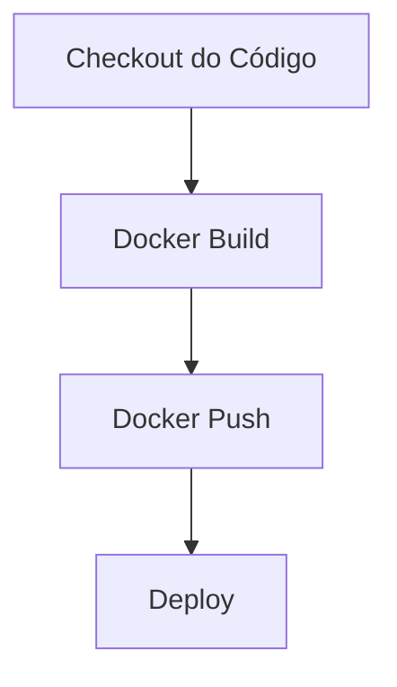

# Pipeline: Ping

Pipeline para para build e deploy da plataforma Ping.

## Descrição

Este pipeline é responsável por realizar o build e deploy da plataforma Ping, garantindo que as alterações no código sejam integradas e disponibilizadas de forma contínua. Ele inclui as seguintes etapas:

### Build

:::note
A decisão de utilizar o estágio de build é baseada na necessidade de realizar backup das imagens. Atualmente elas estão no dockerhub e são deletadas todos os meses.
:::

1. **Checkout do Código**: Clona o repositório do código-fonte.
2. **Docker Build**: Constrói a imagem Docker do aplicativo.
3. **Docker Push**: Envia a imagem Docker para o registro de contêineres.

#### Plano de construção

1. Validação de service connection para publicar imagens no Azure Container Registry.
2. Validação de secret no ambiente para baixar imagens do ACR.
3. Contração do Dockerfile.
4. Construção do pipeline de build.
5. Mudar referencia a imagem no helm.
6. Validação E2E.
7. Plano de trabalho para internalizar deploy.

### Deploy

TODO: O Time do VVWM deve escrever aqui o que cada estagio e tipos de pipelines de deploy fazem.

TODO: Devemos internalizar esses pipelines no CodePlay.

- pingaccess-pingfederate-backup.yml
- pipeline-deploy-ping-openshift.yml
- pipeline.yaml

## Configuração

## Decisões

- A decisão de utilizar o estágio de build é baseada na necessidade de realizar backup das imagens. Atualmente elas estão no dockerhub e são deletadas todos os meses.

## Erros conhecidos

## Plano de evolução

- O Time do VVWM deve escrever aqui o que cada estagio e tipos de pipelines de deploy fazem.
- Devemos internalizar [pipelines](https://dev.azure.com/telefonica-vivo-brasil/VVWM%20-%20VIVO%20WIAM/_git/infra-tests) no CodePlay.
