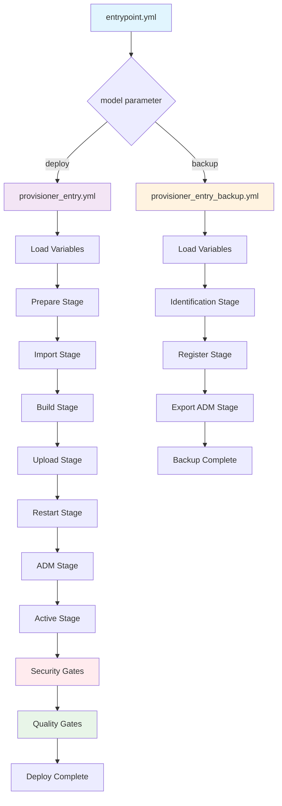
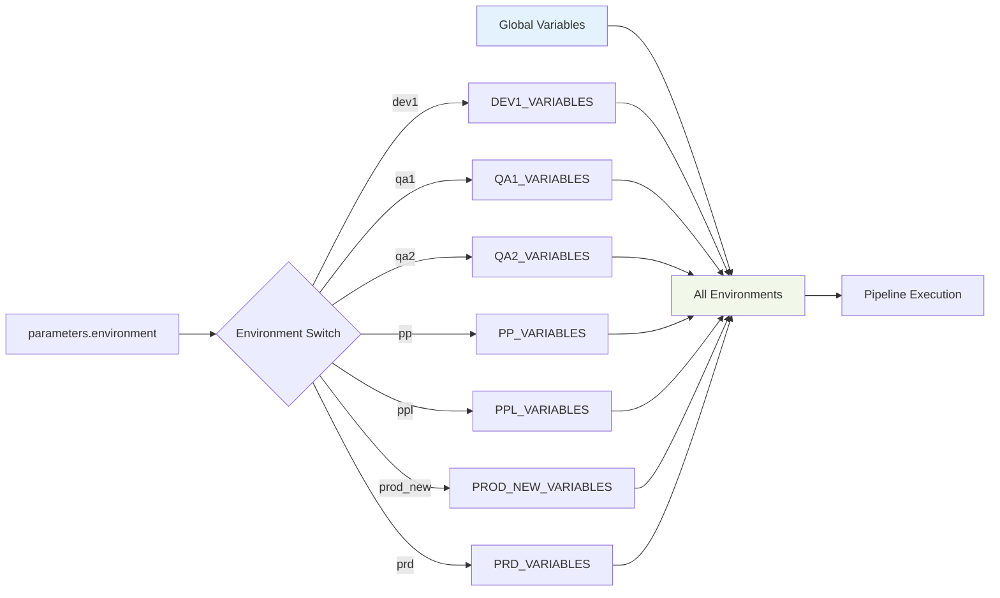
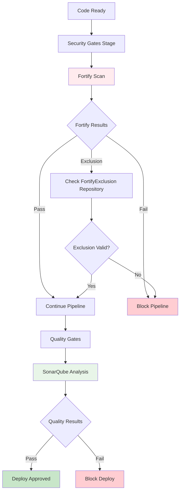
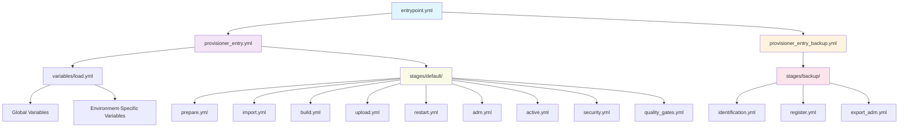

# Diagramas de Fluxo - Pipeline Win-VivoCore

## Fluxo Principal de Deploy



## Fluxo de Variáveis por Ambiente



## Arquitetura de Security Gates



## Estrutura de Templates e Dependências



## Fluxo de Execução Temporal

```mermaid
gantt
    title Pipeline Win-VivoCore - Execução Deploy
    dateFormat X
    axisFormat %M:%S
    
    section Preparation
    Load Variables    :0, 30s
    Prepare Environment :30s, 60s
    
    section Build Process
    Import Dependencies :60s, 120s
    Build Application  :120s, 300s
    Upload Artifacts   :300s, 360s
    
    section Deployment
    Restart Services   :360s, 420s
    ADM Configuration  :420s, 480s
    Activate Environment :480s, 540s
    
    section Gates
    Security Scan      :540s, 900s
    Quality Analysis   :900s, 1080s
    
    section Completion
    Final Validation   :1080s, 1140s
```

## Matriz de Responsabilidades

| Stage | Responsável | Tempo Estimado | Crítico | Rollback |
|-------|-------------|----------------|---------|----------|
| Prepare | DevOps | 30s | ⚠️ | ❌ |
| Import | DevOps | 1min | ⚠️ | ❌ |
| Build | DevOps | 3min | 🔴 | ❌ |
| Upload | DevOps | 1min | 🔴 | ❌ |
| Restart | SysAdmin | 1min | 🔴 | ❌ |
| ADM | SysAdmin | 1min | 🔴 | ❌ |
| Active | SysAdmin | 1min | 🔴 | ❌ |
| Security | SecOps | 6min | 🔴 | ❌ |
| Quality | DevOps | 3min | ⚠️ | ❌ |

**Legenda:**

- 🔴 Crítico - Falha bloqueia pipeline
- ⚠️ Warning - Falha gera alerta mas permite continuidade
- ✅ Suporta rollback automático
- ❌ Não suporta rollback automático

---

> Documentação de fluxos atualizada em: 30/06/2025
