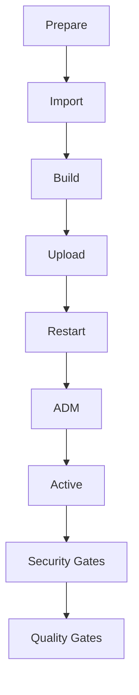
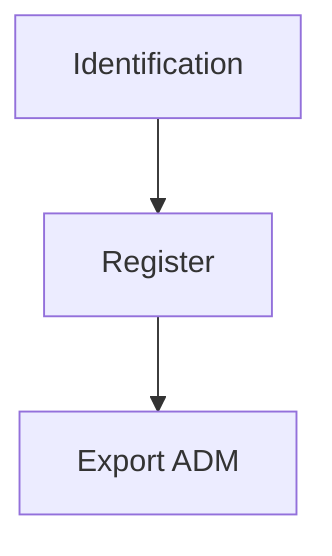

# Pipeline Win-VivoCore - Documentação

## Visão Geral

Esta pipeline é responsável pelo deployment e backup de aplicações Windows no ambiente VivoCore. A pipeline suporta dois modelos de execução principais: **deploy** e **backup**, controlados através do parâmetro `model` no entrypoint.

## Arquitetura da Pipeline

### Entrypoint (`entrypoint.yml`)

O arquivo `entrypoint.yml` serve como ponto de entrada único da pipeline, implementando um padrão de roteamento baseado no parâmetro `model`:

```yaml
parameters:
- name: environment 
  type: string
- name: model 
  type: string
  default: 'deploy'
```

#### Fluxos Suportados

1. **Modelo Deploy** (`model: 'deploy'`): Executa o fluxo completo de deployment
2. **Modelo Backup** (`model: 'backup'`): Executa apenas operações de backup

### Estrutura de Provisioners

#### 1. Provisioner de Deploy (`provisioner_entry.yml`)

Pipeline principal que executa o fluxo completo de deployment seguindo os stages:



**Stages do Deploy:**

| Stage | Descrição | Parâmetros |
|-------|-----------|------------|
| **Prepare** | Preparação do ambiente de build | - |
| **Import** | Importação de dependências e configurações | `environment` |
| **Build** | Compilação e build da aplicação | `environment` |
| **Upload** | Upload de artefatos para repositório | - |
| **Restart** | Reinicialização de serviços | `environment` |
| **ADM** | Configurações administrativas | `environment` |
| **Active** | Ativação do ambiente | `host` |
| **Security** | Gates de segurança (Fortify) | `fortifyExclusionRepository` |
| **Quality Gates** | Gates de qualidade (SonarQube) | - |

#### 2. Provisioner de Backup (`provisioner_entry_backup.yml`)

Pipeline simplificada focada apenas em operações de backup:



**Stages do Backup:**

| Stage | Descrição |
|-------|-----------|
| **Identification** | Identificação do ambiente para backup |
| **Register** | Registro da operação de backup |
| **Export ADM** | Exportação de configurações administrativas |

## Configuração de Variáveis

### Grupos de Variáveis por Ambiente

A pipeline utiliza diferentes grupos de variáveis dependendo do ambiente de execução:

- **Globais**: `PIPELINE_VARIABLES`, `DATABASE_VARIABLES`, `WINDOWS_SERVER_COMMON_VARIABLES`
- **Específicas**: `SIBEL_SERVER_COMMON_VARIABLES`, `BACKUP_PIPELINE_VARIABLES`

### Ambientes Suportados

| Ambiente | Grupo de Variáveis | Descrição |
|----------|-------------------|-----------|
| `dev1` | `DEV1_VARIABLES` | Desenvolvimento 1 |
| `qa1` | `QA1_VARIABLES` | Quality Assurance 1 |
| `qa2` | `QA2_VARIABLES` | Quality Assurance 2 |
| `pp` | `PP_VARIABLES` | Pré-produção |
| `ppl` | `PPL_VARIABLES` | Pré-produção Lima |
| `prod_new` | `PROD_NEW_VARIABLES` | Produção Nova |
| `prd` | `PRD_VARIABLES` | Produção |

## Como Utilizar

### 1. Execução de Deploy

```yaml
# Exemplo de chamada para deploy
- template: tech_products/win-vivocorp/entrypoint.yml
  parameters:
    environment: 'qa1'
    model: 'deploy'
```

### 2. Execução de Backup

```yaml
# Exemplo de chamada para backup
- template: tech_products/win-vivocorp/entrypoint.yml
  parameters:
    environment: 'prod_new'
    model: 'backup'
```

## Gates de Segurança e Qualidade

### Security Gates

- **Fortify**: Análise SAST (Static Application Security Testing)
- Configuração de exclusões via `FortifyExclusion` repository
- Execução obrigatória antes do deploy em produção

### Quality Gates

- **SonarQube**: Análise de qualidade de código
- Métricas de cobertura e complexidade
- Validação de código duplicado e vulnerabilidades

## Estrutura de Arquivos

```text
win-vivocorp/
├── entrypoint.yml                   # Ponto de entrada da pipeline
├── provisioners/                    # Templates de provisioning
│   ├── provisioner_entry.yml        # Pipeline principal de deploy
│   ├── provisioner_entry_backup.yml # Pipeline de backup
│   ├── variables/
│   │   └── load.yml                 # Carregamento de variáveis
│   └── stages/                      # Stages organizados por tipo
│       ├── default/                 # Stages do fluxo de deploy
│       │   ├── prepare.yml
│       │   ├── import.yml
│       │   ├── build.yml
│       │   ├── upload.yml
│       │   ├── restart.yml
│       │   ├── adm.yml
│       │   ├── active.yml
│       │   ├── security.yml
│       │   └── quality_gates.yml
│       └── backup/                  # Stages do fluxo de backup
│           ├── identification.yml
│           ├── register.yml
│           └── export_adm.yml
├── tasks/                           # Tasks específicas
└── README.md                        # Esta documentação
```

## Melhores Práticas

### Desenvolvimento

- Sempre teste mudanças primeiro em ambientes de desenvolvimento (`dev1`)
- Use o modelo `backup` antes de alterações significativas em produção
- Mantenha os stages modulares e reutilizáveis

### Deployment

- Siga a sequência: DEV → QA → PP → PROD
- Execute backup antes de deployments em produção
- Monitore os gates de segurança e qualidade

### Troubleshooting

- Verifique logs de cada stage individualmente
- Valide configurações de variáveis por ambiente
- Use o stage `debug.yml` quando disponível para diagnóstico

## Dependências

- **Azure DevOps**: Pipeline execution engine
- **Fortify**: Security scanning tools
- **SonarQube**: Code quality analysis
- **Windows Server**: Target deployment environment
- **Sibel**: Application server platform

## Contato e Suporte

Para dúvidas ou suporte relacionado a esta pipeline, consulte:

- [CONTRIBUTING.md](../../CONTRIBUTING.md)
- [GUIDELINES.md](../../GUIDELINES.md)
- Equipe de DevOps Vivo

---

> Documentação atualizada em: 30/06/2025
