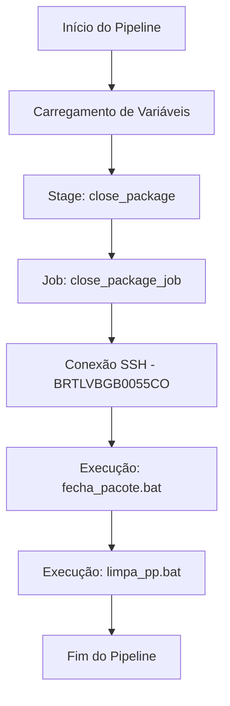

# Pipeline: Close Package v2 - Win VivoCorpSiebel

## Visão Geral

O pipeline `close-package-v2.yml` é responsável pelo fechamento de pacotes e limpeza de repositórios no ambiente Windows VivoCorpSiebel. Este pipeline automatiza processos críticos de finalização de deployments através de conexões SSH para servidores específicos.

## Características Técnicas

- **Localização**: `/tech_products/win-vivocorp/close-package-v2.yml`
- **Tecnologia**: Windows/Siebel
- **Tipo**: Pipeline de Finalização (Close Package)
- **Pool de Agentes**: `$(PollVivoCorpSiebelAgents)`
- **Conexão**: SSH para servidor `BRTLVBGB0055CO`

## Parâmetros

| Parâmetro | Tipo | Valor Padrão | Descrição |
|-----------|------|--------------|-----------|
| `environment` | string | `'pp'` | Define o ambiente de execução (pp, prd, etc.) |

## Variáveis

O pipeline utiliza um template de variáveis centralizado:

```yaml
- template: provisioners/variables/load.yml
  parameters:
    environment: ${{parameters.environment}}
```

### Variáveis de Proxy

- `PROXY_NSKP_HTTPS`: Configuração de proxy HTTPS
- `PROXY_NSKP_HTTP`: Configuração de proxy HTTP  
- `PROXY_NSKP_NO_PROXY`: Exceções de proxy

## Estrutura do Pipeline

### Stage: close_package

#### Job: close_package_job

O job principal executa duas tasks SSH sequenciais:

##### 1. Fechamento de Pacote

- **Task**: SSH@0
- **Comando**: `call C:\Siebel_Devops\paliativo\${{ parameters.environment }}\fecha_pacote.bat`
- **Timeout**: 20 segundos
- **Função**: Executa o script de fechamento de pacote específico do ambiente

##### 2. Limpeza de Repositório

- **Task**: SSH@0  
- **Comando**: `call C:\Siebel_Devops\paliativo\${{ parameters.environment }}\limpa_pp.bat`
- **Timeout**: 20 segundos
- **Função**: Limpa arquivos temporários e repositórios locais

## Fluxo de Execução



## Configurações de Segurança

### Conexão SSH

- **Endpoint**: `BRTLVBGB0055CO`
- **Método**: Comandos remotos via SSH
- **Timeout**: 20 segundos por operação

### Configuração de Proxy

Todas as tasks SSH são executadas com configurações de proxy para garantir conectividade:

- HTTPS_PROXY
- HTTP_PROXY  
- NO_PROXY

## Scripts Executados

### fecha_pacote.bat

- **Localização**: `C:\Siebel_Devops\paliativo\{environment}\fecha_pacote.bat`
- **Função**: Finaliza o processo de empacotamento
- **Parâmetro**: Ambiente dinâmico baseado no parâmetro do pipeline

### limpa_pp.bat

- **Localização**: `C:\Siebel_Devops\paliativo\{environment}\limpa_pp.bat`
- **Função**: Remove arquivos temporários e limpa workspace
- **Parâmetro**: Ambiente dinâmico baseado no parâmetro do pipeline

## Ambientes Suportados

O pipeline suporta múltiplos ambientes através do parâmetro `environment`:

- **pp** (Pré-Produção) - *padrão*
- **prd** (Produção)
- Outros ambientes conforme configuração

## Pré-requisitos

### Infraestrutura

- Servidor `BRTLVBGB0055CO` acessível via SSH
- Pool de agentes `$(PollVivoCorpSiebelAgents)` configurado
- Scripts batch disponíveis no caminho especificado

### Credenciais

- Service connection SSH configurada para `BRTLVBGB0055CO`
- Permissões de execução nos scripts batch do servidor remoto

### Variáveis de Ambiente

- Configurações de proxy (HTTPS, HTTP, NO_PROXY)
- Template de variáveis `provisioners/variables/load.yml` disponível

## Monitoramento e Logs

### Pontos de Monitoramento

- Status da conexão SSH
- Tempo de execução dos scripts batch
- Códigos de retorno dos comandos

### Logs Importantes

- Saída dos scripts `fecha_pacote.bat` e `limpa_pp.bat`
- Mensagens de erro de conectividade SSH
- Timeouts de execução

## Troubleshooting

### Problemas Comuns

#### Falha na Conexão SSH

- **Sintoma**: Timeout ou erro de conexão
- **Solução**: Verificar disponibilidade do servidor `BRTLVBGB0055CO`
- **Verificação**: Testar conectividade SSH manual

#### Script Batch não Encontrado

- **Sintoma**: Erro "arquivo não encontrado"
- **Solução**: Verificar se os scripts existem no caminho especificado
- **Verificação**: Confirmar estrutura de diretórios no servidor remoto

#### Timeout de Execução

- **Sintoma**: Task cancelada por timeout
- **Solução**: Aumentar `readyTimeout` ou otimizar scripts
- **Verificação**: Monitorar tempo de execução manual dos scripts

### Comandos de Diagnóstico

```bash
# Teste de conectividade SSH
ssh usuario@BRTLVBGB0055CO "echo 'Conexao OK'"

# Verificação de arquivos
ssh usuario@BRTLVBGB0055CO "dir C:\Siebel_Devops\paliativo\pp\"

# Execução manual para debug
ssh usuario@BRTLVBGB0055CO "call C:\Siebel_Devops\paliativo\pp\fecha_pacote.bat"
```

## Melhores Práticas

### Execução

- Execute apenas após conclusão bem-sucedida do deployment
- Monitore logs para identificar problemas nos scripts batch
- Mantenha timeout adequado para operações complexas

### Manutenção

- Teste regularmente a conectividade SSH
- Mantenha scripts batch atualizados no servidor remoto
- Documente mudanças nos scripts de fechamento

### Segurança

- Use credenciais específicas com permissões mínimas necessárias
- Monitore execuções para detectar anomalias
- Mantenha logs de auditoria das execuções

## Changelog

| Versão | Data | Alterações |
|--------|------|------------|
| v2 | - | Versão atual com dupla task SSH |
| v1 | - | Versão inicial (descontinuada) |

## Contatos e Suporte

Para dúvidas ou problemas com este pipeline:

- **Equipe**: DevOps VivoCorpSiebel
- **Documentação**: Wiki Vivo CodePlay Pipelines
- **Suporte**: Canal técnico Azure DevOps

---

> **Nota**: Esta documentação refere-se à versão 2 do pipeline de fechamento de pacotes. Para informações sobre versões anteriores, consulte o histórico de commits do repositório.
