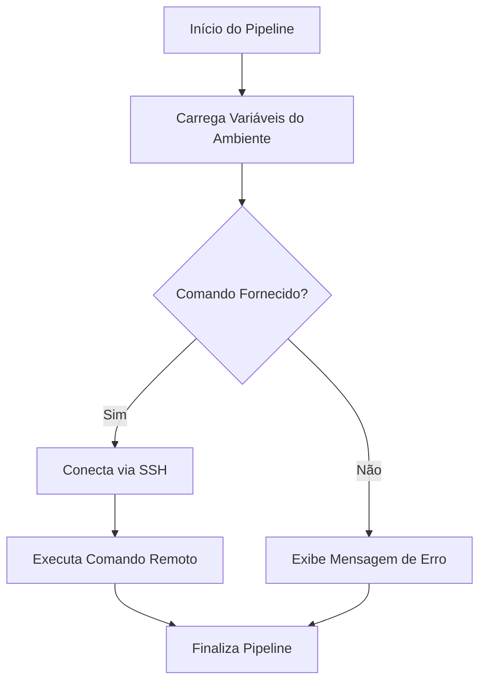

# Pipeline: Windows VivoCorb - Execução de Comandos Remotos

Pipeline para execução de comandos remotos via SSH em servidores Windows do ambiente Siebel VivoCorb.

## Descrição

Este pipeline permite a execução de comandos remotos em servidores Windows do ambiente Siebel VivoCorb através de conexão SSH. É especialmente útil para automação de tarefas de deployment, manutenção e operações em ambientes produtivos.

O pipeline executa as seguintes etapas:

1. **Inicialização**: Carrega as variáveis do ambiente especificado
2. **Validação de Parâmetros**: Verifica se o comando foi fornecido
3. **Execução SSH**: Conecta ao servidor remoto e executa o comando
4. **Logs e Feedback**: Fornece feedback sobre a execução



## Configuração

Para configurar este pipeline, você precisa definir o arquivo `pipeline.yml` com o seguinte conteúdo:

```yaml
trigger: none

resources:
  repositories:
    - repository: Vivo.CodePlay.Pipelines
      name: DevOps/Vivo.CodePlay.Pipelines
      type: git
      ref: refs/heads/master

extends:
  template: /tech_products/win-vivocorp/prod-new.yml@Vivo.CodePlay.Pipelines
  parameters:
    command: 'git_prod.bat'        # Comando a ser executado remotamente
    environment: 'prod'            # Ambiente (prod, hml, dev)
    timeout: 30000                 # Timeout em milissegundos (opcional)
```

### Parâmetros Disponíveis

| Parâmetro | Tipo | Padrão | Descrição |
|-----------|------|--------|-----------|
| `command` | string | '' | Comando ou script a ser executado no servidor remoto |
| `environment` | string | 'prod' | Ambiente de destino (prod, hml, dev) |
| `timeout` | number | 20000 | Timeout para a operação SSH em milissegundos |

### Pré-requisitos

- Service Connection `BRTLVBGB0055CO` configurada
- Pool de agentes `PollVivoCorpSiebelAgents` disponível
- Variáveis de proxy configuradas no ambiente
- Scripts de destino disponíveis no caminho `C:\Siebel_Devops\paliativo\{environment}\`

## Decisões

- **SSH Task**: Escolhida para compatibilidade com servidores Windows e facilidade de configuração
- **Timeout Parametrizável**: Permite ajustar o tempo limite conforme a complexidade do comando
- **Validação de Parâmetros**: Evita execuções desnecessárias quando nenhum comando é fornecido
- **Pool Dedicado**: Uso do pool `PollVivoCorpSiebelAgents` para garantir compatibilidade com o ambiente Siebel
- **Operador `>`**: Utilizado para melhor legibilidade dos comandos SSH conforme guidelines do CodePlay

## Erros Conhecidos

### Erro de Conexão SSH

**Sintoma**: Pipeline falha na conexão SSH

**Causa**: Service Connection não configurada ou credenciais inválidas

**Solução**: Verificar a configuração da Service Connection `BRTLVBGB0055CO`

### Timeout de Operação

**Sintoma**: Pipeline falha por timeout

**Causa**: Comando demora mais que o timeout configurado

**Solução**: Aumentar o parâmetro `timeout` ou otimizar o comando executado

### Script Não Encontrado

**Sintoma**: Erro "arquivo não encontrado" no servidor remoto

**Causa**: Script não existe no caminho especificado

**Solução**: Verificar se o script existe em `C:\Siebel_Devops\paliativo\{environment}\{command}`

## Plano de Evolução

### Versão Atual (v1.0)

- Execução básica de comandos via SSH
- Suporte a múltiplos ambientes
- Timeout configurável

### Próximas Versões

- **v1.1**: Suporte a múltiplos comandos em sequência
- **v1.2**: Integração com Gates de Segurança (Fortify, SonarQube)
- **v1.3**: Logs estruturados e métricas de performance
- **v1.4**: Rollback automático em caso de falhas
- **v2.0**: Migração para Azure DevOps Tasks customizadas

### Melhorias Planejadas

- Implementação de retry automático
- Notificações Teams/Slack para resultados
- Dashboard de monitoramento de execuções
- Suporte a execução paralela de comandos